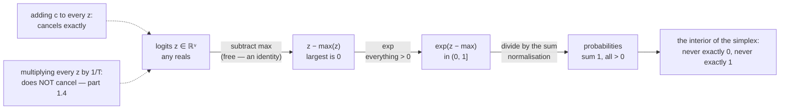

# 1.3 — Softmax: the map from any real numbers to a distribution

## One-line answer

Softmax turns any list of reals into a distribution by exponentiating — which makes everything positive
— and dividing by the total — which makes it sum to one; and because `exp` turns *differences* into
*ratios*, the whole operation depends only on gaps between logits and not on their absolute values.

---

## The story

Four friends have to split some prize money, and they agree to split it according to how much each of
them put in.

The trouble is that somebody recorded the contributions as *above or below the group average*, so the
list reads `+2`, `+1`, `0.1`, `−0.5`. Two of those are numbers you cannot hand anybody a share of. A
share of minus half is not a share.

So they use a rule with two steps, and everybody in the room can follow both of them. First, turn each
number into a positive weight, using something that gives a bigger weight for a bigger number and
never, ever gives you zero or a negative. Then divide each weight by the total of all the weights.
Four positive numbers, adding up to one, in exactly the same order they started in.

And there is one property that stops the argument before it begins. If somebody re-does the maths
against a different average, so that every one of the four numbers goes up by ten, the shares come out
**identical**. The rule reads the gaps between people, not the level they all sit at. Nobody can gain
anything by moving the baseline.
---

## The idea in plain language

Part [1.2](1.2-logits-are-not-probabilities.md) established the problem: the model produces
unconstrained reals and the next step needs a distribution. Softmax is the standard bridge, and it is
two operations:

> `softmax(z)[i] = exp(z[i]) / Σⱼ exp(z[j])`

**Step one, `exp`, fixes non-negativity.** The exponential of any real number is positive — never zero,
never negative — so every entry becomes a legal weight. `exp(-10)` is tiny but not zero, which is why a
softmax never assigns exactly zero probability to anything, which in turn is why Day 6's `log(0)`
problem does not arise from a softmax output.

**Step two, dividing by the total, fixes the sum.** Any list of positive numbers divided by its own sum
adds to one. This step is called **normalisation** and it is what makes the output comparable across
different vocabularies and different models.

Three properties follow, and each one is used later:

**It is monotonic.** `exp` is increasing, and dividing every entry by the same positive number preserves
order. So the ranking is unchanged — part 1.2's measurement.

**It is shift-invariant.** `exp(z + c) = exp(z)·exp(c)`, and the `exp(c)` appears in every numerator and
in the denominator, so it cancels exactly. Adding a constant to every logit is a no-op. **This is an
identity, not an approximation**, and it is what licenses the numerically stable form below.

**It is not scale-invariant.** Multiplying every logit by a constant *does* change the distribution, and
does so in a specific and useful way. That is temperature, and it is part
[1.4](1.4-temperature-is-a-scale-on-the-logits.md).

One more term, because the geometry gives the operation its name in the literature: the set of all
valid distributions over `V` outcomes is called the **probability simplex** — the flat region where the
coordinates are non-negative and sum to one. Softmax is a map from all of `V`-dimensional real space
onto the interior of that simplex. "Interior" matters: the output never touches the boundary, so no
probability is ever exactly 0 or exactly 1.

And the name itself is worth unpacking, because it misleads. Softmax is **not** a soft version of
`max` — `max` returns a value and softmax returns a whole distribution. It is a soft version of
**argmax**: as the logits are scaled up it approaches a one-hot vector at the largest entry, which
part 1.4 measures.

---

## Why Akshara needs it

- **Day 6**'s cross-entropy is defined against a softmax distribution, and the combination —
  softmax-then-log — is where the whole loss comes from. The two are always implemented together, for
  reasons Day 7 measures.
- **Day 30**'s attention has a softmax at its centre: `softmax(Q @ K.T / √d_k) @ V`. The weights that
  decide what attends to what are exactly this operation applied along the key axis.
- **Day 31**'s causal mask works by setting logits to `-inf` **before** the softmax, so that
  `exp(-inf) = 0` gives exactly zero probability. Masking after the softmax would need a
  renormalisation, which is the bug that day is built to prevent.
- **Day 69–77** applies temperature, top-k and top-p in logit space and takes one softmax at the end,
  and that ordering is a direct consequence of the properties above.
- **Day 7** (MATH-14) is the numerically stable softmax as a whole day's subject. The stable form
  appears here because it is not optional even at toy scale.

---

## The mechanism

The definition, written twice — once as it reads and once as it must be implemented:

```python
import numpy as np


def softmax_naive(z: np.ndarray, axis: int = -1) -> np.ndarray:
    """The definition, literally. Do not use — see When it breaks."""
    e = np.exp(z)
    return e / e.sum(axis=axis, keepdims=True)


def softmax(z: np.ndarray, axis: int = -1) -> np.ndarray:
    """The stable form: subtract the max first. Mathematically identical."""
    e = np.exp(z - z.max(axis=axis, keepdims=True))
    return e / e.sum(axis=axis, keepdims=True)
```

**Line by line:**
- `axis=-1` throughout, because the distribution lives on the last axis (part
  [1.1](1.1-a-distribution-over-a-vocabulary.md)). Naming the axis positionally would break the day a
  batch dimension is added.
- `keepdims=True` on **both** the max and the sum. Without it the reduction removes the axis and the
  broadcast back fails — or worse, succeeds against the wrong axis, which Day 2 part
  [2.1](../../../day-002-tensors-shape-stride/parts/02-broadcasting-and-indexing/2.1-broadcasting-the-rule.md)
  measured on a square tensor as rows summing to `1.45, 0.76, 0.91` instead of 1.
- `z - z.max(...)` makes the largest entry exactly `0`, so the largest `exp` is exactly `1` and every
  other is between 0 and 1. **Nothing can overflow.** By shift invariance the answer is unchanged.
- The two functions differ by seven characters and one of them cannot be used on real data, which is
  the subject of *When it breaks*.

Run it and check both conditions:

```python
z = np.array([2.0, 1.0, 0.1, -0.5])            # (V,)
p = softmax(z)                                  # (V,)
print("logits :", z)
print("probs  :", np.round(p, 6))
print("all >0 :", bool((p > 0).all()))
print("sum    :", repr(float(p.sum())))
```

**Line by line:**
- Measured on Intel Core i3-1115G4, CPython 3.12.10, numpy 2.5.2, 2026-08-26:
  `probs [0.625182 0.229992 0.093508 0.051318]`, `all >0 True`, `sum 1.0`.
- **Strictly greater than zero**, not merely non-negative. `exp` cannot produce zero, so no token is
  ever completely ruled out by a softmax — a property Day 6 depends on and Day 31 deliberately
  overrides with `-inf`.
- `repr(float(p.sum()))` rather than a rounded print, because the exact value is the subject of part
  [1.5](1.5-the-probabilities-that-summed-to-almost-one.md) and rounding it would hide the thing being
  discussed.

**The shift invariance, verified rather than asserted:**

```python
for shift in (0.0, 10.0, 100.0):
    print(f"  shift {shift:6.1f} -> {np.round(softmax(z + shift), 8)}")
print("  max |diff| between shift 0 and 100:",
      float(np.abs(softmax(z) - softmax(z + 100.0)).max()))
```

**Line by line:**
- All three rows print `[0.62518245 0.22999177 0.09350768 0.0513181]` on this machine, 2026-08-26.
- The maximum difference is `4.857e-16` — around `float64`'s epsilon of `2.22e-16` (Day 2 part
  [1.2](../../../day-002-tensors-shape-stride/parts/01-what-a-tensor-is/1.2-dtype-the-width-of-a-number.md)),
  so it is rounding and not a real difference.
- **This is the proof that subtracting the max is free.** The stable implementation is not trading
  accuracy for safety; it is applying an identity.

Why `exp` and not something else — the property that makes softmax the natural choice:

```python
gap = np.array([0.0, 1.0, 2.0, 3.0])            # logits with unit gaps
p_gap = softmax(gap)
print("probs        :", np.round(p_gap, 6))
print("ratios p[i+1]/p[i]:", np.round(p_gap[1:] / p_gap[:-1], 6))
print("e            :", round(float(np.e), 6))
```

**Line by line:**
- Every consecutive pair of logits differs by exactly 1.
- The printed ratios are all the same number, `2.718282` — that is `e`. Measured on this machine,
  2026-08-26.
- **A fixed difference in logits is a fixed *ratio* of probabilities**, everywhere in the range, and
  that is the whole reason `exp` is the function used. A logit gap of `d` means the more likely token
  is `e^d` times more likely, regardless of where the two sit. Day 6 makes this precise: logits are
  unnormalised log-probabilities, and cross-entropy is the loss that treats them as such.



---

## Shapes

| Tensor | Symbolic shape | Concrete here | What each axis means |
| --- | --- | --- | --- |
| `z` | `(V,)` | `(4,)` | one logit per vocabulary entry |
| `z.max(axis=-1, keepdims=True)` | `(1,)` | `(1,)` | **kept** so the subtraction broadcasts |
| `exp(z - max)` | `(V,)` | `(4,)` | every entry in `(0, 1]` |
| `.sum(axis=-1, keepdims=True)` | `(1,)` | `(1,)` | the normaliser |
| `softmax(z)` | `(V,)` | `(4,)` | the distribution |
| batched logits | `(B, T, V)` | `(2, 6, 50)` | the shape a real model produces |
| its max | `(B, T, 1)` | `(2, 6, 1)` | one max per distribution — `keepdims` is what makes this right |
| its softmax | `(B, T, V)` | `(2, 6, 50)` | `B × T` independent distributions |

The `(B, T, 1)` row is the one that goes wrong. Without `keepdims=True` it is `(B, T)`, which
right-aligned against `(B, T, V)` becomes `(1, B, T)` — and if `V` happens to equal `T`, it broadcasts
and produces a plausible wrong answer instead of an error.

---

## When it breaks

The loud one, and it is the entire reason the stable form exists:

```console
>>> big = np.array([1000.0, 999.0, 998.0])
>>> softmax_naive(big)
RuntimeWarning: overflow encountered in exp
RuntimeWarning: invalid value encountered in divide
array([nan, nan, nan])
```

Verbatim on this machine, 2026-08-26. `exp(1000)` exceeds `float64`'s maximum of about `1.8e308` (Day 2
part [1.2](../../../day-002-tensors-shape-stride/parts/01-what-a-tensor-is/1.2-dtype-the-width-of-a-number.md)
measured it), so every numerator is `inf`, the denominator is `inf`, and `inf / inf` is `NaN`. The
stable form gives `[0.66524096 0.24472847 0.09003057]` on the same input.

Note that these are **warnings**, not exceptions. Without `filterwarnings = ["error::RuntimeWarning"]`
in `pyproject.toml` — which this repository sets, from Day 0 — the program continues with a tensor of
`NaN` and the failure surfaces somewhere else entirely.

Logits of 1000 are not hypothetical: attention scores before scaling grow with the head dimension
(Day 30's `√d_k` exists for exactly this), and a diverging training run produces them routinely.

The other loud one, from the missing `keepdims`:

```console
>>> zb = np.zeros((2, 6, 50))
>>> e = np.exp(zb - zb.max(axis=-1))
Traceback (most recent call last):
  File "<stdin>", line 1, in <module>
ValueError: operands could not be broadcast together with shapes (2,6,50) (2,6)
```

Caught here because `V = 50` and `T = 6` differ. **With `V == T` it broadcasts silently** and computes
a softmax over the wrong axis, which is Day 2 part
[4.1](../../../day-002-tensors-shape-stride/parts/04-where-they-meet/4.1-the-shape-was-right-the-answer-was-wrong.md)
in a new costume.

**The silent version.** Underflow at the bottom of the distribution. `exp(-800)` is `0.0` in `float64`,
so a token whose logit is 800 below the maximum gets probability **exactly zero** — despite the claim
above that softmax never produces zero. That claim is true in exact arithmetic and false in floating
point, and the gap matters on Day 6, where `log(0)` is `-inf` and a single such token makes the loss
infinite. The check is to look at the minimum:

```python
print("smallest probability:", float(softmax(z).min()))
print("any exactly zero    :", bool((softmax(z) == 0).any()))
```

**Line by line:**
- On healthy logits the minimum is small and positive — `0.051318` for this document's example.
- On a distribution with a huge spread it can be exactly `0.0`, and that is the value Day 6 must
  survive. The reason cross-entropy is computed from **logits** rather than from probabilities is
  precisely to avoid ever forming that zero and then taking its logarithm.

---

## In production

**What a research engineer writes instead of the teaching version.** They call the framework's softmax,
which is the stable form plus fused kernels — and more often they do not call it at all. In training,
the loss goes straight from logits (Day 6), so the probability tensor is never built. In decoding, a
greedy step needs `argmax` on logits and no softmax; a sampling step needs one softmax on a single row
of `V` numbers, not on the whole `(B, T, V)` tensor. **The most common performance mistake around
softmax is computing it on more of the tensor than necessary.**

**What degrades at scale.** Two things. The `(B, T, V)` allocation, which at realistic sizes is the
largest tensor in the model — 262 million numbers for a batch of 8 at sequence 1024 and vocabulary
32,000, computed in part [1.1](1.1-a-distribution-over-a-vocabulary.md). And the reduction: a softmax
needs the max and the sum over `V` before it can produce any output, which makes it a two-pass
operation over the biggest axis. Fused implementations do it in one pass by updating a running max and
a running sum together — the same idea that makes flash-attention possible on Day 34.

**The failure that only shows with real data.** Saturation. As a model trains, its logits spread out,
and a confident distribution can put probability `1.0` (after rounding) on one token and exactly `0.0`
on the rest. Everything still runs; the gradient through that softmax is essentially zero (Day 4 part
[2.5](../../../day-004-backprop-and-gradcheck/parts/02-gradient-checking/2.5-the-gradcheck-that-passed.md)
measured the same phenomenon in `tanh`), so those positions stop learning. This is one of the things
label smoothing and temperature are for, and it is invisible on random initial logits.

**The review comment.** *"`z.max(axis=-1)` without `keepdims` — this only raises because `V != T`. Add
`keepdims=True`."*

**The interview question.** *"Why do we subtract the maximum in a softmax?"* The weak answer says "for
numerical stability". The strong answer says *why it is allowed* — softmax is shift-invariant, so it is
an exact identity, not an approximation — and then *what it prevents*: `exp` of a large logit overflows
to `inf` and `inf/inf` is `NaN`, measured at logits of 1000. And the very strong answer notes that it
fixes overflow at the top and does nothing about underflow at the bottom, which is why the loss is
computed from logits rather than from probabilities.

**Compute tier: T0.** Everything is a four-element array on a laptop CPU. The T0 version proves the
**definition, the two conditions, the shift invariance and the overflow** exactly — all four are
properties of IEEE-754 arithmetic and transfer to any hardware. What it does not show is the memory and
bandwidth cost at `(B, T, V)`, which is arithmetic on the shapes and arrives on Day 39 and Day 66.

---

## Check yourself

Run this. It prints **one sum, one set of ratios that are all the same number, and one `nan`**:

```python
import numpy as np


def softmax(z, axis=-1):
    e = np.exp(z - z.max(axis=axis, keepdims=True))
    return e / e.sum(axis=axis, keepdims=True)


z = np.array([2.0, 1.0, 0.1, -0.5])
p = softmax(z)
print("probs :", np.round(p, 6), " sum", repr(float(p.sum())), " all > 0:", bool((p > 0).all()))

gap = np.array([0.0, 1.0, 2.0, 3.0])
pg = softmax(gap)
print("consecutive ratios:", np.round(pg[1:] / pg[:-1], 6), " e =", round(float(np.e), 6))

big = np.array([1000.0, 999.0, 998.0])
with np.errstate(over="ignore", invalid="ignore"):
    naive = np.exp(big) / np.exp(big).sum()
print("naive on big logits :", naive)
print("stable on big logits:", np.round(softmax(big), 8))
```

**Line by line:**
- The first line prints `sum 1.0` and `all > 0: True`.
- The ratios all print `2.718282`. **Say out loud what that number is and why it appears**, before
  reading part 1.4.
- The naive version prints `[nan nan nan]` and the stable one
  `[0.66524096 0.24472847 0.09003057]` on this machine, 2026-08-26.
- `np.errstate(over="ignore")` is used **only** to let the demonstration print rather than raise under
  this repository's `error::RuntimeWarning` setting. Never write it in real code: it is the setting that
  turns a caught overflow into a silent `NaN`.

**Say this out loud, without scrolling up:** name the two steps of softmax and what each one fixes — and
say why subtracting the maximum is exact rather than approximate.
