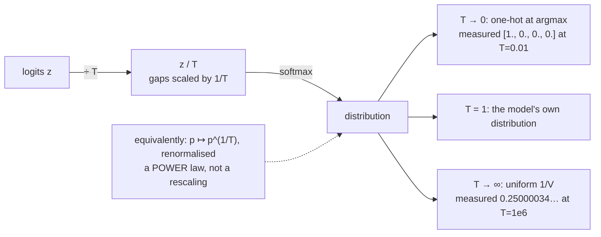

# 1.4 — Temperature is a scale on the logits

## One-line answer

Dividing every logit by a number `T` before the softmax stretches or compresses the gaps between them —
so `T → 0` collapses onto `argmax` and `T → ∞` flattens to uniform — and it is the one knob that
changes a model's output without changing a single parameter.

---

## The story

A cook has a recipe pinned to the wall, and one dial that decides how closely to follow it.

Turn the dial all the way down and the cook follows the recipe to the gram. Exactly 300 ml of water,
exactly one teaspoon of salt, every single time. Every plate that comes out is identical to the last
one.

Turn the dial up and the cook starts to improvise. A bit more chilli today because the mood is right,
a bit less salt because the last batch was heavy. The recipe is still the guide, and the dish is still
recognisably the dish, but no two plates come out the same.

Turn the dial all the way up and it stops being cooking from a recipe at all. Everything on the shelf
is equally likely to go in the pot, and the recipe on the wall might as well not be there.

Nothing about the recipe changed. Not one line of it. The dial does not add ingredients and it does not
remove any. It only decides **how strictly the written differences get obeyed**.
---

## The idea in plain language

Part [1.3](1.3-softmax-the-map-to-the-simplex.md) established that softmax is *shift*-invariant — adding
a constant to every logit does nothing — and noted that it is **not** *scale*-invariant. This part is
that observation, used.

**Temperature** is a positive number `T`, and applying it means dividing every logit by it before the
softmax:

> `p = softmax(z / T)`

Because the softmax depends only on the differences between logits, dividing by `T` scales every
difference by `1/T`:

- **`T < 1`** multiplies the gaps up. Differences that were small become large, the distribution
  sharpens, and the largest entry takes more of the mass. In the limit `T → 0` it becomes a one-hot
  vector at the `argmax`. This is called **lowering the temperature**, and it makes output more
  deterministic and more repetitive.
- **`T = 1`** is the model's own distribution, unmodified.
- **`T > 1`** divides the gaps down. The distribution flattens and low-probability tokens gain. In the
  limit `T → ∞` every entry approaches `1/V`, which is the uniform distribution — the model's opinions
  erased entirely. This is **raising the temperature**, and it makes output more varied and more prone
  to nonsense.

Two things to hold onto because they are what people get wrong:

**It is applied to logits, not to probabilities.** `softmax(z / T)` is the operation. Dividing
*probabilities* by `T` gives something that does not sum to one — measured below at `2.0` and `0.5` for
`T = 0.5` and `T = 2.0` — and is not a distribution at all.

**There is an equivalent form on probabilities, and it is not division.** Raising each probability to
the power `1/T` and renormalising gives *exactly* the same answer, measured below as agreeing to every
digit. That is worth knowing because it explains what temperature does in probability terms — it
is a power law, not a rescaling — and because a system that only has probabilities can still apply a
temperature correctly.

One more term: the amount of "spread" in a distribution is its **entropy**, measured in nats when
natural logarithms are used. Day 6 defines it properly. It is used here only as the single number that
summarises what temperature is doing, and its maximum for `V` outcomes is `ln(V)` — `1.386294` for
`V = 4`.

---

## Why Akshara needs it

- **Day 69–71** is the decoding phase, where temperature is the first and most-used sampling control,
  and where it combines with top-k and top-p in a specific order.
- **Day 97–103** studies prompt sensitivity with error bars, and temperature is the setting that
  decides how much run-to-run variation there is at all. A study run at `T = 0` measures something
  different from one run at `T = 0.8`.
- **Day 112 onward** evaluates the model, and the choice between greedy and sampled decoding changes
  every number reported. An eval that does not state its temperature is not reproducible.
- **Day 92**'s distillation and **Day 94**'s DPO both use temperature inside the *loss*, not only at
  decode time — a soft target is a teacher's distribution at `T > 1`, and the reason is exactly the
  flattening measured here.

---

## The mechanism

Sweep the dial and watch two numbers — the largest probability, and the entropy:

```python
import numpy as np


def softmax(z, axis=-1):
    e = np.exp(z - z.max(axis=axis, keepdims=True))
    return e / e.sum(axis=axis, keepdims=True)


z = np.array([2.0, 1.0, 0.1, -0.5])              # (V,) V = 4
for T in (0.1, 0.25, 0.5, 1.0, 2.0, 5.0, 10.0, 100.0):
    p = softmax(z / T)                            # (V,)
    entropy = float(-(p * np.log(p + 1e-300)).sum())
    print(f"  T={T:6.2f}  max p {p.max():.6f}  entropy {entropy:.6f} nats  "
          f"(uniform = {np.log(len(z)):.6f})")
```

**Line by line:**
- `z / T` divides **before** the softmax. That single position is the whole operation, and putting it
  after is the failure in *When it breaks*.
- `p * np.log(p + 1e-300)` adds a tiny constant inside the logarithm to avoid `log(0)`. That is a
  stopgap for a display value and **not** how a loss should be written — Day 6 does it properly, and
  Day 7 explains why the stopgap is a bad habit in real code.
- `np.log(len(z))` is the entropy of a uniform distribution over `V` outcomes and is the ceiling every
  row is heading towards.
- Measured on Intel Core i3-1115G4, CPython 3.12.10, numpy 2.5.2, 2026-08-26:

```text
  T=  0.10  max p 0.999955  entropy 0.000499 nats  (uniform = 1.386294)
  T=  0.25  max p 0.981488  entropy 0.094771 nats  (uniform = 1.386294)
  T=  0.50  max p 0.858779  entropy 0.486626 nats  (uniform = 1.386294)
  T=  1.00  max p 0.625182  entropy 1.005663 nats  (uniform = 1.386294)
  T=  2.00  max p 0.438639  entropy 1.275350 nats  (uniform = 1.386294)
  T=  5.00  max p 0.321634  entropy 1.368130 nats  (uniform = 1.386294)
  T= 10.00  max p 0.284852  entropy 1.381778 nats  (uniform = 1.386294)
  T=100.00  max p 0.253387  entropy 1.386250 nats  (uniform = 1.386294)
```

Three readings:

**The dial is not linear.** Going from `T = 1` to `T = 0.5` takes the top probability from 0.625 to
0.859 — a large change. Going from `T = 10` to `T = 100` takes it from 0.285 to 0.253, barely anything,
because the distribution is already almost uniform. **Most of the interesting range is between about
0.1 and 2**, which is why decoding settings live there.

**The limits are exact.** At `T = 0.01` the distribution measures `[1., 0., 0., 0.]` — the `argmax`. At
`T = 1e6` it measures `[0.25000034, 0.25000009, 0.24999986, 0.24999971]` — uniform to six decimal
places. Both on this machine, 2026-08-26. So temperature interpolates continuously between greedy
decoding and pure noise, and greedy decoding is the `T → 0` end of the same dial rather than a separate
algorithm.

**Entropy is the better summary.** The top probability only describes one entry; the entropy describes
the whole distribution in one number, and it runs from `0.000499` to `1.386250` against a ceiling of
`1.386294`. Day 6 makes this quantity the centre of the curriculum.

**The equivalent form on probabilities**, because it says what temperature *is*:

```python
p1 = softmax(z)                                   # (V,) the T = 1 distribution
for T in (0.5, 2.0):
    by_logits = softmax(z / T)                    # (V,)
    by_power = p1 ** (1 / T)                      # (V,)
    by_power = by_power / by_power.sum()          # (V,) renormalise
    print(f"  T={T}: identical? {np.allclose(by_logits, by_power)}")
```

**Line by line:**
- `p1 ** (1 / T)` raises each probability to a power. For `T < 1` the exponent is greater than 1, which
  pushes small numbers down faster than large ones — sharpening. For `T > 1` the exponent is less than
  1, which lifts small numbers — flattening.
- The renormalisation is required: raising to a power destroys the sum-to-one property, and dividing by
  the new total restores it.
- Both print `identical? True` on this machine, 2026-08-26. This is not a coincidence — it falls out of
  `softmax(z/T)[i] ∝ exp(z[i]/T) = (exp(z[i]))^(1/T) ∝ p1[i]^(1/T)`.
- **So temperature is a power law on probabilities, not a rescaling.** That is the sentence that
  prevents the most common wrong implementation.



---

## Shapes

| Tensor | Symbolic shape | Concrete here | What each axis means |
| --- | --- | --- | --- |
| `z` | `(V,)` | `(4,)` | logits, one per vocabulary entry |
| `z / T` | `(V,)` | `(4,)` | same shape; only the spread changed |
| `softmax(z / T)` | `(V,)` | `(4,)` | the tempered distribution |
| entropy | `()` | scalar | `0.000499` at `T = 0.1`, `1.386250` at `T = 100` |
| batched logits at decode | `(B, 1, V)` | `(B, 1, 32000)` | **only the last position** is tempered during generation |

The last row is worth noticing: during generation the temperature is applied to a single row of logits
per sequence, not to the whole `(B, T, V)` tensor, because only the next token is being chosen.

---

## When it breaks

The loud one, and it is the reason `T = 0` is a special case in every decoding implementation:

```console
>>> softmax(z / 0.0)
RuntimeWarning: divide by zero encountered in divide
RuntimeWarning: invalid value encountered in subtract
array([nan, nan, nan, nan])
```

Verbatim on this machine, 2026-08-26. `z / 0` gives `[inf, inf, inf, -inf]`, and subtracting the max
(`inf`) gives `inf - inf = nan`. **So "temperature zero" cannot be implemented as a temperature.** Every
real decoder special-cases it:

```python
def choose(logits, T):
    if T == 0.0:
        return int(logits.argmax())          # greedy: the T -> 0 limit, computed directly
    return sample(softmax(logits / T))
```

**Line by line:**
- The branch is not an optimisation; it is the only way to express the limit. `T = 0` is mathematically
  meaningful (it *is* `argmax`) and numerically impossible.
- Comparing a float with `== 0.0` is acceptable here because `T` comes from configuration, not from a
  computation — it is exactly the value someone typed.
- Note that this also makes `T = 0` deterministic and therefore **not dependent on the seed**, which is
  worth knowing when an eval reports "same results every time".

**The silent version, and it is the common one: dividing the probabilities.**

```console
>>> p = softmax(z)
>>> (p / 0.5).round(6)
array([1.250365, 0.459984, 0.187015, 0.102636])
>>> (p / 0.5).sum()
np.float64(2.0)
>>> (p / 2.0).sum()
np.float64(0.5)
```

Measured on this machine, 2026-08-26. Dividing probabilities by `T` produces something summing to
`1/T` — `2.0` and `0.5` here — with an entry above 1. It is not a distribution, and it has not been
sharpened or flattened at all: **every entry was scaled by the same factor, so the ratios are
unchanged**. Temperature had literally no effect except to break the normalisation.

What happens downstream depends on who receives it. A sampler that validates raises (part
[1.2](1.2-logits-are-not-probabilities.md) measured
`ValueError: Probabilities are not non-negative` for the related case). A sampler that does not
validate — a hand-rolled cumulative-sum loop, which is section 2's subject — quietly samples from a
distribution stretched to sum to 2, which for `T < 1` means **the first token is chosen almost always**
and for `T > 1` means the loop can fall off the end. Neither raises.

The check is a single assertion at the point of use:

```python
p = softmax(logits / T)
assert np.isclose(p.sum(), 1.0, atol=1e-6), f"not a distribution after temperature: sum {p.sum():.6f}"
assert T > 0.0, "temperature must be positive; T == 0 is greedy and is a separate branch"
```

**Line by line:**
- The sum assertion catches the divide-the-probabilities mistake immediately, with the telling value —
  `2.0` says "you divided by 0.5 in the wrong place" to anyone who has read this document.
- `atol=1e-6` and not exact equality, for the reason part
  [1.5](1.5-the-probabilities-that-summed-to-almost-one.md) measures.
- The positivity assertion documents the `T = 0` branch rather than letting it produce `NaN`. A
  **negative** temperature is worse still: it reverses the order, making the model's least likely token
  its most likely, and it produces a perfectly valid distribution while doing so.

---

## In production

**What a research engineer writes instead of the teaching version.** Temperature is applied in logit
space, in a documented order relative to the other logit transforms: penalties first, then temperature,
then top-k / top-p truncation, then one softmax, then sample. **The order is part of the specification**
— applying top-k before or after temperature gives different results, because truncation depends on the
ranking's *gaps* — and two systems that disagree about it produce different text from the same model
and the same setting.

They also treat `T = 0` as a documented alias for greedy rather than as a value, and they log the
temperature with every generation, because a sample without its decoding settings is not reproducible
even with a seed.

**What degrades at scale.** Nothing computationally — it is one division over `V` numbers. What changes
is the *effect*: with a vocabulary of 32,000 rather than 4, raising the temperature redistributes mass
across tens of thousands of tokens, the vast majority of which are nonsense in context. That is why
temperature alone is rarely used at high values in practice and is paired with top-k or top-p
truncation, which cuts the tail off first so the flattening only spreads mass over plausible
candidates. Day 70 is that combination.

**The failure that only shows with real data.** A temperature tuned on one model and carried to
another. Temperature scales the *gaps* between logits, and the natural size of those gaps depends on
the model — part [1.2](1.2-logits-are-not-probabilities.md) measured a logit range of `-11.01` to
`+9.38` for one small random head, and a differently-trained model will differ. So `T = 0.8` is not a
property of "good sampling"; it is a property of a particular model's logit scale, and copying it
across checkpoints, across fine-tunes, or across a quantization (Day 78) changes the behaviour with
nothing in the config changed.

**The review comment.** *"Temperature is applied after the softmax here. That scales the probabilities
without changing their ratios and breaks the sum — it should be `softmax(logits / T)`."*

**The interview question.** *"What does temperature actually do?"* The weak answer says "makes it more
random". The strong answer says it scales the *differences* between logits by `1/T`, so it interpolates
between `argmax` at `T → 0` and uniform at `T → ∞`; that it is equivalent to raising the probabilities
to the power `1/T` and renormalising; and that `T = 0` has to be special-cased because the division is
undefined. Mentioning that the sensible range is roughly 0.1–2 because the dial is strongly non-linear
is the detail that comes from having swept it.

**Compute tier: T0.** Every measurement is a four-element array on a laptop CPU, and the behaviour —
the limits, the non-linearity, the power-law equivalence, the `NaN` at `T = 0` — is exact arithmetic
that transfers everywhere. What T0 does not show is temperature's *interaction with a real vocabulary*,
where the tail is tens of thousands of tokens long, and that is Day 70's measurement rather than
this one's.

---

## Check yourself

Run this. It prints **a sweep whose entropy must rise monotonically, and two sums that are not 1**:

```python
import numpy as np


def softmax(z, axis=-1):
    e = np.exp(z - z.max(axis=axis, keepdims=True))
    return e / e.sum(axis=axis, keepdims=True)


z = np.array([2.0, 1.0, 0.1, -0.5])
for T in (0.1, 0.5, 1.0, 2.0, 10.0):
    p = softmax(z / T)
    print(f"  T={T:5.2f}  max p {p.max():.6f}  entropy {-(p * np.log(p + 1e-300)).sum():.6f}")

p1 = softmax(z)
print("p / 0.5 sums to :", float((p1 / 0.5).sum()))
print("p / 2.0 sums to :", float((p1 / 2.0).sum()))

by_power = p1 ** (1 / 0.5)
print("power form == logit form:", np.allclose(softmax(z / 0.5), by_power / by_power.sum()))
```

**Line by line:**
- The entropy column rises from `0.000499` to `1.381778` on this machine, 2026-08-26, against a uniform
  ceiling of `1.386294`.
- The two sums print `2.0` and `0.5`. **Neither is a distribution**, and neither has been sharpened or
  flattened — say out loud why the ratios are unchanged.
- The last line prints `True`. Temperature is a power law on probabilities; write that down.
- Now try `softmax(z / 0.0)` and `softmax(z / -1.0)`. One gives `NaN` and one gives a perfectly valid
  distribution that is **exactly wrong**. Predict which before you run it.

**Say this out loud, without scrolling up:** say what temperature scales and what the two limits are —
and explain why `T = 0` has to be a separate branch rather than a value you can pass.
