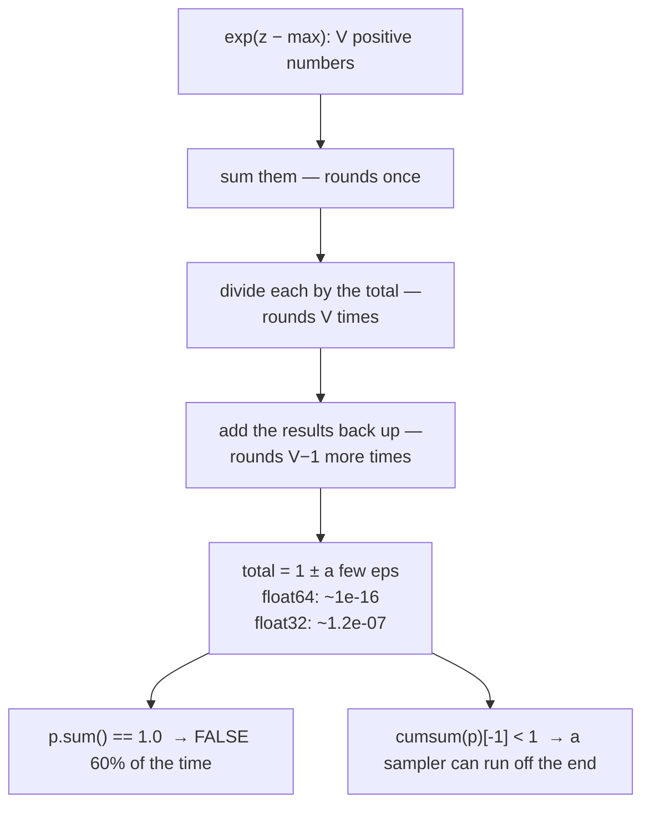

# 1.5 — 💥 The probabilities that summed to almost one

## One-line answer

A softmax output does not sum to exactly one — measured here at **1190 of 2000** random distributions
landing on values between `0.9999999999999994` and `1.0000000000000004` — so any code that tests
`p.sum() == 1.0`, or relies on a cumulative sum reaching 1, is relying on something that is false most
of the time.

---

## The story

Three friends split a ₹100 restaurant bill.

A third of 100 is 33.333..., and nobody can hand over a third of a rupee, so each of them pays ₹33.33.
Add the three payments up and you get ₹99.99.

The last paisa is not missing. Nobody kept it. It never existed in the first place. It was rounded
away, three separate times, and the three roundings did not happen to cancel out.

Now think about what rule you would write down for checking that a bill has been settled. If the rule
says the payments must add up to exactly ₹100, then your rule will fail nearly every time three people
split a bill, for a reason that is not a problem and that nobody can fix. If instead the rule says the
payments must add up to within a rupee, you can still ring the alarm on the evening the total comes to
₹95.

The second rule is not the lazier one. It is the only one of the two that can tell a real mistake apart
from ordinary arithmetic.
---

## The idea in plain language

Part [1.3](1.3-softmax-the-map-to-the-simplex.md) said a softmax output sums to one. In exact
arithmetic it does. In floating point it usually does not, and the reason is Day 2's.

The final step of a softmax is dividing `V` numbers by their total. Each division rounds to the nearest
representable `float64` (Day 2 part
[1.2](../../../day-002-tensors-shape-stride/parts/01-what-a-tensor-is/1.2-dtype-the-width-of-a-number.md)
measured the spacing: `eps = 2.22e-16` near 1). Then adding those `V` rounded numbers back up rounds
again, `V − 1` times, in whatever order the summation happens to use.

The errors are tiny and they do not cancel. The result is a total that is one or two units in the last
place away from one — sometimes above, sometimes below, and **which way is not predictable**.

Three consequences, and they get progressively more expensive:

**A test for exact equality fails on correct code.** `assert p.sum() == 1.0` is red most of the time.
This is the same lesson as Day 2 part
[3.2](../../../day-002-tensors-shape-stride/parts/03-matmul/3.2-three-loops-then-one-call.md), where two
correct matmuls disagreed in the last bits, and Day 4 part
[2.2](../../../day-004-backprop-and-gradcheck/parts/02-gradient-checking/2.2-the-relative-error-criterion.md),
where a tolerance had to be chosen from a measurement.

**A cumulative sum may end below one.** `np.cumsum(p)[-1]` inherits the same error. Any sampler that
walks the cumulative sum looking for the first value exceeding a uniform draw can therefore run off the
end — and section 2 measures exactly how often, in `float32`, at a rate of about **one in eight
million**, which is rare enough to pass every test and common enough to happen in a decode loop.

**The size of the error depends on the dtype and on `V`.** In `float64` the discrepancy is around
`1e-16`. In `float32` it is around `1e-7` — a factor of a billion — and a real model produces its
logits in `float32` or narrower.

The rule that follows is short: **never test a floating-point sum for exact equality, and never rely on
a cumulative sum reaching its endpoint.** Both have cheap, correct alternatives.

---

## Why Akshara needs it

- **Section 2 of today** builds a sampler on a cumulative sum. This part is the reason its last step
  has a guard, and part [2.5](../02-sampling/2.5-the-sampler-that-fell-through.md) is the measured
  failure when it does not.
- **Day 6** computes cross-entropy. A distribution that sums to `0.9999999999999994` gives a loss that
  is wrong in the last digits — harmless — but the same reasoning explains why the loss is computed
  from logits and never from a normalised probability tensor.
- **Day 69–77**'s top-p sampling accumulates probabilities until they exceed a threshold. Its stopping
  condition has exactly this shape and exactly this hazard.
- **Day 78 onward** quantizes, and every narrowing of the dtype multiplies this error. A check that was
  comfortably inside tolerance in `float32` can fail in `float16`.
- **Day 51's test suite** must not be flaky (CLAUDE.md). Any assertion written against a softmax output
  has to be written with a tolerance chosen from a measurement.

---

## The mechanism

Measure it. Two thousand random distributions over a vocabulary of 50:

```python
import numpy as np


def softmax(z, axis=-1):
    e = np.exp(z - z.max(axis=axis, keepdims=True))
    return e / e.sum(axis=axis, keepdims=True)


rng = np.random.default_rng(1337)
V, trials = 50, 2000
off, sums = 0, set()
for _ in range(trials):
    z = rng.standard_normal(V) * 3               # (V,) logits with a realistic spread
    total = float(softmax(z).sum())
    sums.add(total)
    if total != 1.0:
        off += 1

print(f"{off} of {trials} did NOT sum to exactly 1.0")
print(f"distinct totals observed: {len(sums)}")
print(f"min {min(sums)!r}   max {max(sums)!r}")
```

**Line by line:**
- `* 3` widens the logits to a realistic spread. Logits clustered near zero give a nearly-uniform
  distribution whose sum happens to round well; a real model's logits are spread out.
- `float(...)` before comparing, so the comparison is between Python floats and not numpy scalars — the
  values are identical, but the `repr` in the output is unambiguous.
- `sums` is a **set**, which collects the distinct values seen. That number turns out to be the
  interesting one.
- Measured on Intel Core i3-1115G4, CPython 3.12.10, numpy 2.5.2, seed 1337, 2026-08-26:

```text
1190 of 2000 did NOT sum to exactly 1.0
distinct totals observed: 8
min 0.9999999999999994   max 1.0000000000000004
```

**Nearly sixty per cent.** Not an edge case, not an unlucky input — the *normal* outcome. And note the
second line: only **eight** distinct values appeared across two thousand trials, because the possible
totals are the handful of `float64` values adjacent to 1. The error is quantised, tiny and unavoidable.

Where the error comes from, made visible:

```python
z = rng.standard_normal(V) * 3
e = np.exp(z - z.max())
p = e / e.sum()
print("e.sum()            :", repr(float(e.sum())))
print("p.sum()            :", repr(float(p.sum())))
print("1 - p.sum()        :", repr(1.0 - float(p.sum())))
print("float64 eps near 1 :", repr(float(np.finfo(np.float64).eps)))
```

**Line by line:**
- `e.sum()` is an exact-ish total of `V` positive numbers. `p = e / e.sum()` divides each one, and each
  division rounds.
- `1 - p.sum()` is the shortfall (or surplus), and it comes out at a small multiple of `eps`.
- `np.finfo(np.float64).eps` is `2.220446049250313e-16`, measured on Day 2 part
  [1.2](../../../day-002-tensors-shape-stride/parts/01-what-a-tensor-is/1.2-dtype-the-width-of-a-number.md).
  **The discrepancy is one or two units in the last place**, which is the smallest error floating-point
  arithmetic can have and still be wrong.

**And the same measurement in `float32`, which is what a real model uses:**

```python
p32 = softmax(rng.standard_normal(V).astype(np.float32) * 3)     # (V,) float32
running = np.float32(0.0)
for x in p32:
    running = np.float32(running + x)
print("float32 running total:", repr(float(running)))
print("shortfall            :", repr(1.0 - float(running)))
print("float32 eps          :", repr(float(np.finfo(np.float32).eps)))
```

**Line by line:**
- The loop accumulates in `float32` explicitly, as a `float32` implementation would. Letting Python's
  `+` promote to `float64` would hide the effect and is itself a real bug: an accumulator that is wider
  than the data is a deliberate choice, and doing it by accident means you cannot reason about it.
- Measured on this machine, 2026-08-26: running total `0.9999998807907104`, shortfall
  `1.1920928955078125e-07`, and `float32` eps `1.1920928955078125e-07`. **The shortfall is exactly one
  epsilon** — which is the cleanest possible confirmation of where it comes from.
- A billion times larger than the `float64` case. Part
  [2.5](../02-sampling/2.5-the-sampler-that-fell-through.md) measures what that does to a sampler.



**The two correct forms:**

```python
# 1 - testing a distribution
assert np.isclose(p.sum(), 1.0, atol=1e-6), f"sum is {p.sum():.9f}"

# 2 - a cumulative sum used for sampling
cdf = np.cumsum(p)
cdf[-1] = 1.0                   # pin the endpoint: it is 1 by definition, whatever the arithmetic says
```

**Line by line:**
- `atol=1e-6` is chosen with headroom over both dtypes: a thousand times the `float32` epsilon of
  `1.19e-07`, and ten orders of magnitude above `float64`'s. **A real problem — a missing
  normalisation, a truncated distribution — is off by percent, not by parts per million**, so the
  tolerance separates the two cleanly. This is Day 4 part
  [2.2](../../../day-004-backprop-and-gradcheck/parts/02-gradient-checking/2.2-the-relative-error-criterion.md)'s
  method applied again: pick the threshold from the measured spread.
- `cdf[-1] = 1.0` is one assignment and it removes an entire class of failure. The last entry of a
  cumulative distribution *is* 1 — that is what "cumulative distribution" means — so writing it down is
  not a fudge, it is restoring a definition the arithmetic could not preserve.
- The alternative, clamping the sampled index with `min(idx, V - 1)`, also works and is what most
  library samplers do internally. Either is fine; **having neither is the bug**.

---

## Shapes

| Tensor | Symbolic shape | Concrete here | What each axis means |
| --- | --- | --- | --- |
| `z` | `(V,)` | `(50,)` | logits, spread ×3 for realism |
| `p = softmax(z)` | `(V,)` | `(50,)` | the distribution |
| `p.sum()` | `()` | `0.9999999999999994` … `1.0000000000000004` | **not** exactly 1, 1190 times in 2000 |
| `np.cumsum(p)` | `(V,)` | `(50,)` | the cumulative distribution used by section 2 |
| `np.cumsum(p)[-1]` | `()` | not exactly 1 | the endpoint a sampler walks to |
| `p32` | `(V,)` | `(50,)` | `float32`; running total `0.9999998807907104` |

---

## When it breaks

**The loud one, which is a test failing on correct code:**

```console
>>> assert softmax(z).sum() == 1.0
Traceback (most recent call last):
  File "<stdin>", line 1, in <module>
AssertionError
```

No message, no value, and nothing wrong with the softmax. A test suite containing this assertion goes
red roughly 60% of the time, which — because it is intermittent — reads as *flakiness* rather than as a
wrong assertion. **A flaky test in this repository is indistinguishable from Silent Failure #4 and must
be fixed, never re-run** (CLAUDE.md), and the fix here is the assertion, not the code.

**The silent one, and it is the expensive half: a cumulative sum that ends below one.**

```console
>>> p32 = softmax(rng.standard_normal(50).astype(np.float32) * 3)
>>> running = np.float32(0.0)
>>> for x in p32: running = np.float32(running + x)
>>> float(running)
0.9999998807907104
```

Nothing raises. The distribution is correct, the probabilities are right, and the running total stops
`1.19e-07` short of one. A sampler written as

```python
total = 0.0
for i, prob in enumerate(p):
    total += prob
    if u < total:
        return i
# no return here
```

**Line by line:**
- This is the obvious hand-rolled sampler and it is correct for every `u` below the running total.
- For `u` above the running total — which happens with probability equal to the shortfall — the loop
  ends without returning, and the function returns `None`.
- In `float32` the shortfall is `1.19e-07`, so the rate is about **one in 8.4 million draws**. Part
  [2.5](../02-sampling/2.5-the-sampler-that-fell-through.md) measures it empirically at 9 occurrences
  in 50 million.
- One in 8.4 million is invisible in a test suite and unavoidable in a decode loop, which generates one
  draw per token for as long as the service runs.

The check that catches both, and it is one line in the right place:

```python
def assert_distribution(p, atol=1e-6):
    assert (p >= 0).all(), f"negative entry: {p.min()}"
    assert abs(float(p.sum()) - 1.0) < atol, f"sum is {p.sum():.12f}, off by {1 - p.sum():.3e}"
```

**Line by line:**
- `atol=1e-6` for the reason above: three orders of magnitude above the worst `float32` case and far
  below any real error.
- The message prints the sum to twelve places **and** the signed shortfall. `off by 1.192e-07` says
  "this is `float32` epsilon" to anyone who has read this part; `off by 3.100e-02` says "something is
  genuinely wrong".
- Use it at boundaries — where a distribution arrives from a model or a library — and pair it with the
  `cdf[-1] = 1.0` pin wherever a cumulative sum is built.

---

## In production

**What a research engineer writes instead of the teaching version.** They never build a cumulative sum
by hand — the framework's categorical sampler does it, with the clamping already inside — and every
assertion about a probability sum carries a tolerance with a comment saying which dtype it was chosen
for. The deeper habit is that **exact equality is never used on floating-point values anywhere**, and
the few places it looks safe (comparing a configured constant, checking a value against a sentinel) are
called out as exceptions.

**What degrades at scale.** Two ways, both measurable. The error grows with `V`, because more additions
means more roundings: a vocabulary of 32,000 accumulates more error than one of 50. And it grows
catastrophically as the dtype narrows — `float64` at `2.2e-16`, `float32` at `1.2e-07`, and `float16`'s
epsilon is `9.77e-04` (Day 2 part
[1.2](../../../day-002-tensors-shape-stride/parts/01-what-a-tensor-is/1.2-dtype-the-width-of-a-number.md)
measured it), which is a shortfall of one part in a thousand. **A sampler that falls through once in
8 million draws in `float32` would fall through once in a thousand in `float16`**, which is not rare at
all. That is a real reason reductions are kept in 32-bit even in mixed-precision inference.

**The failure that only shows with real data.** Top-p sampling. It accumulates sorted probabilities
until the total exceeds `p` — say 0.95 — and keeps that prefix. When `p` is set to `1.0`, the
accumulation is supposed to keep everything, and whether it does depends on whether the cumulative sum
reaches 1.0 exactly. In `float32` it usually does not, so the last token is dropped. One token out of
32,000, the rarest one, silently, every step. Nothing about the output looks wrong. Day 70 is where
that gets handled properly.

**The review comment.** *"`assert p.sum() == 1.0` — this fails about 60% of the time on correct code.
Use `np.isclose` with a stated tolerance and say which dtype it's for."*

**The interview question.** *"Your softmax output doesn't sum to exactly 1. Is that a bug?"* The strong
answer is no, with the reason and a number: the final division and the re-summation each round, so the
total lands a few units in the last place away from one — around `1e-16` in `float64` and `1e-7` in
`float32`. Then the consequence that shows experience: any code walking a cumulative sum needs a
clamp, because the endpoint may fall short, and in `float32` that happens often enough to matter in a
decode loop.

**Compute tier: T0.** Every number here is a laptop CPU measurement, and every one is a property of
IEEE-754 arithmetic rather than of the machine — the `1190 of 2000`, the eight distinct totals, the
`float32` shortfall equalling exactly one epsilon. They reproduce anywhere. What T0 cannot show is the
cost: a decode loop returning `None` once in eight million tokens, in production, at three in the
morning.

---

## Check yourself

Run this. It prints **a count that must be large, and a shortfall that must equal `float32` epsilon**:

```python
import numpy as np


def softmax(z, axis=-1):
    e = np.exp(z - z.max(axis=axis, keepdims=True))
    return e / e.sum(axis=axis, keepdims=True)


rng = np.random.default_rng(1337)
V, trials = 50, 2000
off = sum(1 for _ in range(trials) if float(softmax(rng.standard_normal(V) * 3).sum()) != 1.0)
print(f"{off} of {trials} softmax outputs did not sum to exactly 1.0")

p32 = softmax(np.random.default_rng(5).standard_normal(V).astype(np.float32) * 3)
running = np.float32(0.0)
for x in p32:
    running = np.float32(running + x)
print("float32 running total:", repr(float(running)))
print("shortfall            :", repr(1.0 - float(running)))
print("float32 eps          :", repr(float(np.finfo(np.float32).eps)))
```

**Line by line:**
- The count prints `1190` on this machine, 2026-08-26. **Say out loud what that means for
  `assert p.sum() == 1.0`.**
- The shortfall and the epsilon both print `1.1920928955078125e-07` — the same number, exactly. That
  identity is the whole explanation.
- Now change `np.float32` to `np.float16` in the accumulator and re-run. Predict the order of magnitude
  of the shortfall first, using Day 2 part 1.2's epsilon table.

**Say this out loud, without scrolling up:** say why a softmax output does not sum to exactly one — and
name the two things that must never be written against such a sum, and what to write instead.
