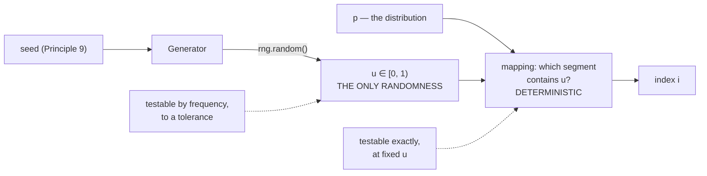

# 2.1 — Sampling from a categorical distribution

## One-line answer

To draw one outcome from `V` options with given probabilities, you need exactly one source of
randomness — a uniform number between 0 and 1 — and a rule for turning it into an index, and that
separation is what makes the whole thing reproducible.

---

## The story

A village fair runs a raffle with four prizes, and different numbers of tickets were sold for each:
50, 30, 15 and 5.

Nobody builds four separate machines. Somebody lays the hundred tickets end to end along a bench, in
order — tickets 1 to 50 for the first prize, 51 to 80 for the second, 81 to 95 for the third, 96 to
100 for the fourth — and then spins one wheel, numbered 1 to 100.

One wheel. One number. The bench does everything else, and it does it with no chance involved at all:
going from "the wheel said 73" to "second prize" is pure arithmetic, and anybody standing there can
check it afterwards.

That split is the reason the raffle can be argued about honestly. **The wheel is where the luck is; the
bench is where the rules are.** If somebody disputes the result, you check the bench first. And if you
wrote down what the wheel said, you can lay the whole thing out again from scratch and get the same
answer.
---

## The idea in plain language

A **categorical distribution** is exactly what part
[1.1](../01-logits-and-probabilities/1.1-a-distribution-over-a-vocabulary.md) described: `V` outcomes
with probabilities `p[0] … p[V-1]`, non-negative and summing to one. Sampling from it means producing
one index, at random, such that index `i` comes up with probability `p[i]`.

Every method for doing this has the same two-part structure:

1. **Draw a uniform random number** `u` in `[0, 1)`. This is the only randomness in the whole
   operation, and it knows nothing about the distribution.
2. **Map `u` to an index** using `p`. This step is deterministic — the same `u` and the same `p` always
   give the same index.

The separation matters more than any particular mapping. It means:

- **Reproducibility is free.** Fix the sequence of `u` values (part
  [2.3](2.3-seeds-and-generators.md)) and the whole generation is deterministic, however complicated
  the model is.
- **The mapping is testable without randomness.** You can feed specific `u` values and assert specific
  indices, which is a real unit test rather than a statistical one.
- **The two can be swapped independently.** A different random source, a different mapping — neither
  requires touching the other.

The mapping used everywhere is the **inverse-CDF** method, which is the bench: lay the probabilities
end to end along `[0, 1)` and see which segment `u` lands in. Part
[2.2](2.2-the-inverse-cdf-trick.md) is that method in full, including the boundary question that makes
it interesting. This part is about the shape of the problem and about what "correct" even means for a
function that returns a different answer every time.

Which is the last idea here, and it is a genuine difficulty: **you cannot test a sampler by checking
its output.** A correct sampler can return index 3 when index 0 had 99% probability. The only things
you can test are (a) the deterministic mapping, at fixed `u`, and (b) the *frequencies*, over many
draws, to a tolerance. Both appear below.

---

## Why Akshara needs it

- **Day 69–77** is the decoding phase. Every generation this curriculum produces after Day 25 comes out
  of a sampler, and everything built there — top-k, top-p, beam search — is a modification of the
  mapping in step 2.
- **Day 25**'s first trained model is judged by what it generates, so the sampler is between you and
  every qualitative result.
- **Day 51**'s data loader shuffles, which is sampling without replacement, and Day 9's tokenizer
  training subsamples a corpus. The same two-part structure and the same seeding discipline apply.
- **Day 129 onward**'s diffusion models draw noise every step; the reproducibility argument here is
  what makes a diffusion sample reproducible at all.
- **Principle 9** requires a seed on every run. This part is where "seeded" becomes a concrete property
  of a specific function rather than a slogan.

---

## The mechanism

The two parts, written separately on purpose:

```python
import numpy as np


def draw_uniform(rng: np.random.Generator) -> float:
    """Part 1: the only randomness. Returns u in [0, 1)."""
    return float(rng.random())


def index_from_uniform(p: np.ndarray, u: float) -> int:
    """Part 2: deterministic. Lay p end to end on [0, 1) and see where u lands."""
    total = 0.0
    for i, prob in enumerate(p):
        total += float(prob)
        if u < total:
            return i
    return len(p) - 1                      # the guard — part 2.5 is why
```

**Line by line:**
- `draw_uniform` takes a `Generator` rather than calling a global. That is the whole of part
  [2.3](2.3-seeds-and-generators.md) in one signature: a function that reads a module-level random
  state has an output that depends on something you cannot see, which this repository's Principle 9
  forbids.
- `rng.random()` returns a value in `[0, 1)` — **inclusive of 0, exclusive of 1**. That half-open
  interval is a deliberate choice by the library and it interacts with the boundary rule in part
  [2.2](2.2-the-inverse-cdf-trick.md).
- `index_from_uniform` contains no randomness at all. Given `p` and `u` it always returns the same `i`,
  which is what makes it unit-testable.
- The loop accumulates and returns the **first** index whose running total exceeds `u`. That is the
  bench: `u = 0.73` walks past 0.5 and stops at 0.8, giving index 1.
- `return len(p) - 1` after the loop is the guard, and it is not defensive programming for its own
  sake. Part [1.5](../01-logits-and-probabilities/1.5-the-probabilities-that-summed-to-almost-one.md)
  measured the running total ending at `0.9999998807907104` in `float32`; without this line, a `u`
  above that returns `None`, and part [2.5](2.5-the-sampler-that-fell-through.md) measures how often.

Put them together and check the frequencies:

```python
p = np.array([0.5, 0.3, 0.15, 0.05])       # (V,) V = 4
rng = np.random.default_rng(1337)

N = 200_000
draws = np.array([index_from_uniform(p, draw_uniform(rng)) for _ in range(N)])
counts = np.bincount(draws, minlength=len(p))

print("target    :", p)
print("empirical :", np.round(counts / N, 5))
print("max |diff|:", float(np.abs(counts / N - p).max()))
```

**Line by line:**
- `np.bincount(draws, minlength=len(p))` counts occurrences of each index. `minlength` matters: without
  it, an outcome that never occurred would be missing from the result and the array would be too short
  — a shape bug that only appears on unlucky seeds.
- Measured on Intel Core i3-1115G4, CPython 3.12.10, numpy 2.5.2, seed 1337, 2026-08-26:
  `empirical [0.50162 0.29818 0.15003 0.05017]` against a target of `[0.5, 0.3, 0.15, 0.05]`, with a
  maximum difference of `0.0018`.
- **`0.0018` is not zero and should not be.** With 200,000 draws the expected sampling error on a
  probability of 0.5 is about `√(0.5 × 0.5 / 200000) ≈ 0.0011`, so a discrepancy of 0.0018 is
  unremarkable. A test that demanded exact agreement would be a test that fails on a correct sampler —
  the same lesson as part
  [1.5](../01-logits-and-probabilities/1.5-the-probabilities-that-summed-to-almost-one.md), arriving
  through statistics rather than through floating point.

The two-part structure, drawn:



**Testing the deterministic half, which is the part you can actually assert on:**

```python
def test_mapping_is_exact():
    p = np.array([0.5, 0.3, 0.15, 0.05])       # cdf: 0.5, 0.8, 0.95, 1.0
    assert index_from_uniform(p, 0.00) == 0
    assert index_from_uniform(p, 0.49) == 0
    assert index_from_uniform(p, 0.50) == 1     # exactly on a boundary — part 2.2
    assert index_from_uniform(p, 0.79) == 1
    assert index_from_uniform(p, 0.80) == 2
    assert index_from_uniform(p, 0.99) == 3
```

**Line by line:**
- No randomness anywhere. Six fixed inputs, six fixed expected outputs, and the test either passes or
  it does not — no seeds, no tolerances, no flakiness.
- The `0.50` case is on a boundary and its answer is a **convention**, not a fact. Part
  [2.2](2.2-the-inverse-cdf-trick.md) shows that the two obvious implementations disagree here. Pinning
  it in a test is how the convention stops being accidental.
- **This is the test that catches real bugs.** A frequency test over 200,000 draws would need a large
  error to fail; this one fails on an off-by-one immediately.
- The complementary frequency test belongs alongside it, with a tolerance derived from the sample size
  rather than guessed:

```python
def test_frequencies_match_within_sampling_error():
    p = np.array([0.5, 0.3, 0.15, 0.05])
    rng = np.random.default_rng(1337)
    N = 200_000
    counts = np.bincount([index_from_uniform(p, float(rng.random())) for _ in range(N)],
                         minlength=len(p))
    tolerance = 4 * np.sqrt(p * (1 - p) / N)    # four standard errors, per outcome
    assert (np.abs(counts / N - p) < tolerance).all(), f"{counts / N} vs {p}"
```

**Line by line:**
- `np.sqrt(p * (1 - p) / N)` is the standard error of a proportion — the expected size of the wobble.
  Using it rather than a guessed constant means the tolerance **scales correctly with `N`**, so raising
  the sample size tightens the test automatically instead of leaving it loose.
- Four standard errors is a deliberate choice: tight enough to catch a real bias, loose enough that a
  correct sampler passes essentially always. Making it two would produce a test that fails
  occasionally, which is the flakiness this repository forbids.
- The seed is fixed, so this test is actually deterministic despite testing randomness — it will give
  the same answer on every run on this machine. Note it may give a *different* answer on a different
  numpy version, which is why the tolerance matters even with a seed.

---

## Shapes

| Tensor | Symbolic shape | Concrete here | What each axis means |
| --- | --- | --- | --- |
| `p` | `(V,)` | `(4,)` | probability per vocabulary entry |
| `u` | `()` | scalar | one uniform draw in `[0, 1)` |
| the returned index | `()` | `0`…`3` | an index into the vocabulary |
| `draws` | `(N,)` | `(200000,)` | one index per draw |
| `counts` | `(V,)` | `(4,)` | occurrences per outcome — `minlength` keeps it `(V,)` |
| `counts / N` | `(V,)` | `(4,)` | empirical frequencies, compared to `p` |
| at decode time | `(V,)` | `(32000,)` | **one distribution**, for the next token only |

The last row is worth stating: generation samples from a single row of `V` numbers per step, not from
the whole `(B, T, V)` tensor. Only the last position's distribution is ever used.

---

## When it breaks

The loud one, from a distribution that is not one:

```console
>>> rng.choice(4, p=np.array([0.5, 0.3, 0.15, 0.15]))
Traceback (most recent call last):
  File "<stdin>", line 1, in <module>
ValueError: Probabilities do not sum to 1. See Notes section of docstring for more information.
```

Verbatim on this machine, 2026-08-26 — the library validates. Note that **the hand-rolled loop above
does not**: given the same input it would simply never return index 3, because the running total
exceeds 1 before reaching it. A sampler that does not check its input fails silently on exactly the
input a check would have caught.

The other loud one, from forgetting `minlength`:

```console
>>> np.bincount(np.array([0, 0, 1, 1, 0])).shape
(2,)
```

Three outcomes existed and the count array has two entries, because index 2 and 3 never came up. Any
comparison against a `(4,)` target then raises — or, if `V` happens to match some other length,
broadcasts. Day 2 part
[4.1](../../../day-002-tensors-shape-stride/parts/04-where-they-meet/4.1-the-shape-was-right-the-answer-was-wrong.md)
is the general form.

**The silent version, and it is the one that makes samplers hard: a wrong sampler looks like a right
one.** Suppose the mapping has an off-by-one and returns index `i-1` whenever `u` lands exactly on a
boundary. Boundaries are measure-zero for a continuous `u`, so over 200,000 draws the frequencies are
indistinguishable from correct — and then the same code meets a distribution with a **zero-probability
entry**, where the boundary case is no longer rare, and starts emitting a token the model assigned no
probability to.

The detection is the exact test above, not the frequency test:

```python
p = np.array([0.5, 0.0, 0.5])                  # index 1 has probability zero
for u in (0.0, 0.25, 0.4999, 0.5, 0.75, 0.999):
    assert index_from_uniform(p, u) != 1, f"u={u} produced a zero-probability outcome"
```

**Line by line:**
- A **zero-probability outcome must never be returned**, and that is a property a frequency test cannot
  check with any confidence — you would be asserting that something did not happen in `N` trials.
- Testing it at the boundary values specifically is what makes it a real test: `u = 0.5` is exactly
  where the zero-width segment sits.
- Any sampler used with top-k or top-p (Day 70) meets zero probabilities on **every single call**,
  because truncation sets them to zero. This test stops being hypothetical the moment that day arrives.

---

## In production

**What a research engineer writes instead of the teaching version.** They call the framework's
categorical sampler, which is vectorised over the batch and handles the boundary and clamping cases
internally. What they keep from this part is the **structure**: a generator passed explicitly rather
than a global, the mapping kept deterministic and testable, and a seed recorded alongside every
generation. A generated sample without its seed and its decoding settings is not reproducible, and
`docs/RUNS.md` exists (Day 1 part
[3.2](../../../day-001-bootstrap-and-map/parts/03-the-ledgers/3.2-runs-md-turns-anecdote-into-result.md))
precisely so that this is written down at the time.

**What degrades at scale.** The loop. A Python loop over `V = 32,000` entries per token is the wrong
shape entirely — part [2.2](2.2-the-inverse-cdf-trick.md) replaces it with a binary search over the
cumulative sum, which is logarithmic rather than linear, and a batched implementation does all `B`
sequences at once. At `V = 32,000` the difference between a linear scan and a binary search is roughly
32,000 steps against 15, per token, per sequence.

**The failure that only shows with real data.** Sampling from a stale distribution. In a decode loop
the sampler must use the logits for the *current* step; an off-by-one in the loop — sampling from the
previous step's distribution — produces output that is grammatical, plausible, and lagged by one token.
It is astonishingly hard to see, it does not affect any frequency test, and it is caught by the same
discipline as everything else in this curriculum: a small end-to-end case whose expected output you
worked out by hand.

**The review comment.** *"This sampler reads the module-level random state. Pass a `Generator` in — the
run's seed has to reach it, and Principle 9 says a run without a seed didn't happen."*

**The interview question.** *"How do you test a random function?"* The strong answer splits it exactly
as this part does: test the deterministic mapping at fixed inputs, exactly; and test the frequencies
over many draws, with a tolerance derived from the sampling error rather than guessed. Adding that a
zero-probability outcome must be tested directly — because a frequency test cannot establish that
something never happens — is the part that shows they have written one.

**Compute tier: T0.** Everything is a four-element distribution and 200,000 draws on a laptop CPU,
completing in under a second. The T0 version proves the **structure and the correctness** exactly, and
both transfer to any `V`. What it does not show is the cost of the linear scan at a real vocabulary
size, which part [2.2](2.2-the-inverse-cdf-trick.md) addresses.

---

## Check yourself

Run this. It prints **four empirical frequencies close to the target, and six exact index assertions
that must pass**:

```python
import numpy as np


def index_from_uniform(p, u):
    total = 0.0
    for i, prob in enumerate(p):
        total += float(prob)
        if u < total:
            return i
    return len(p) - 1


p = np.array([0.5, 0.3, 0.15, 0.05])
rng = np.random.default_rng(1337)
N = 200_000
counts = np.bincount([index_from_uniform(p, float(rng.random())) for _ in range(N)], minlength=4)
print("target    :", p)
print("empirical :", np.round(counts / N, 5))
print("max |diff|:", float(np.abs(counts / N - p).max()))

for u, expected in ((0.00, 0), (0.49, 0), (0.50, 1), (0.79, 1), (0.80, 2), (0.99, 3)):
    got = index_from_uniform(p, u)
    print(f"  u={u:5.2f} -> {got}   expected {expected}   {'ok' if got == expected else 'MISMATCH'}")
```

**Line by line:**
- The frequencies print `[0.50162 0.29818 0.15003 0.05017]` on this machine, 2026-08-26, with a maximum
  difference of `0.0018`. **Say out loud why that is not zero and should not be.**
- All six index assertions print `ok`. These are the ones that would catch an off-by-one.
- Now change `if u < total` to `if u <= total` and re-run. The frequencies barely move; **one of the six
  exact cases flips**. Say which one, and why the frequency test could not have told you.

**Say this out loud, without scrolling up:** name the two parts of any sampler and say which one carries
the randomness — and explain why a frequency test cannot establish that a zero-probability token is
never emitted.
