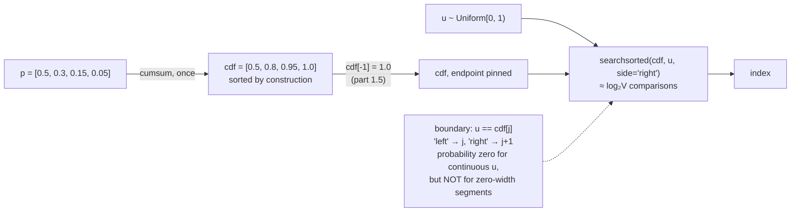

# 2.2 — The inverse-CDF trick, and the boundary that decides it

## One-line answer

Build the running total of the probabilities once, then find which segment a uniform draw lands in with
a binary search — turning a scan over `V` entries into about `log₂ V` comparisons — and the only
subtlety is what happens when the draw lands exactly on a boundary, where the two obvious answers
differ.

---

## The story

A bus route runs along one straight road, with stops at kilometre 5, 8, 9.5 and 10.

Somebody gets off at kilometre 7.3 and asks which stop that counts as. Nobody walks the road from
kilometre zero counting stops as they go. You look at the list — 5, 8, 9.5, 10 — and you can see that
7.3 sits between the first and the second, so it belongs to the second stretch.

Finding that takes a glance, and it takes a glance because the list is **in order**. Cut the list in
half, compare, cut again. Four stops need two comparisons. A thousand stops need ten.

Then somebody gets off at kilometre 8.0 exactly, and the driver and the conductor disagree. The driver
says that is stop two. The conductor says stop three. Neither of them is being unreasonable — the road
does not care — but the timetable has to say one thing, and if those two keep answering differently,
the schedule falls apart within a week.

**The boundary needs a rule, and the rule has to be written down somewhere.**
---

## The idea in plain language

Part [2.1](2.1-sampling-from-a-categorical.md) laid the probabilities end to end along `[0, 1)` and
walked from the left. This part does the same thing without walking.

The **cumulative distribution function** — the **CDF** — is the running total:

> `cdf[i] = p[0] + p[1] + … + p[i]`

For `p = [0.5, 0.3, 0.15, 0.05]` the CDF is `[0.5, 0.8, 0.95, 1.0]`, and it is **sorted by
construction**, because probabilities are non-negative. Sorted means searchable, and the mapping from
part 2.1 becomes:

> return the first index `i` such that `u < cdf[i]`

which is exactly what a binary search over a sorted array does. The cost falls from `V` comparisons to
about `log₂ V` — for a vocabulary of 32,000, from 32,000 steps to 15.

The method is called **inverse-CDF sampling** (or *inverse transform sampling*) because it applies the
inverse of the CDF to a uniform draw. It works for any distribution whose CDF you can invert, which for
a categorical one is always.

And then the boundary. `np.searchsorted(cdf, u, side=...)` takes a `side` argument, and the two values
answer different questions:

| `side` | Returns the first index where | For `u` exactly equal to `cdf[j]` |
| --- | --- | --- |
| `"left"` | `cdf[i] >= u` | returns `j` — the segment **ending** at `u` |
| `"right"` | `cdf[i] > u` | returns `j + 1` — the segment **starting** at `u` |

For a continuous `u` the boundaries have probability zero and the choice never shows up in a frequency
test. It shows up in two places that matter: a unit test at a fixed `u`, and a distribution containing
**zero probabilities**, where a segment has zero width and the boundary is the only thing there. Day 70's
top-k and top-p produce zero probabilities on every call, so this stops being hypothetical soon.

The correct choice for a half-open `[0, 1)` uniform, laying segments as `[cdf[i-1], cdf[i])`, is
`side="right"`. Part 2.1's loop used `if u < total`, which is the same convention — and confirming that
the vectorised version agrees with the hand-written one is one of the checks below.

---

## Why Akshara needs it

- **Day 69–77** samples once per generated token. At `V = 32,000` the difference between a scan and a
  binary search is real, and the batched form matters more still.
- **Day 70**'s top-k and top-p set most of the distribution to zero, which makes zero-width segments the
  normal case rather than an edge case. The boundary rule stops being academic there.
- **Day 51**'s data loader and **Day 12**'s tokenizer training both sample from weighted collections,
  with the same structure.
- **Day 129 onward**'s diffusion sampling draws from continuous distributions where the inverse-CDF idea
  generalises directly.

---

## The mechanism

The CDF and the search:

```python
import numpy as np

p = np.array([0.5, 0.3, 0.15, 0.05])       # (V,)
cdf = np.cumsum(p)                          # (V,)
cdf[-1] = 1.0                               # pin the endpoint — part 1.5 is why

print("p   :", p)
print("cdf :", cdf)


def sample(cdf: np.ndarray, u: float) -> int:
    return int(np.searchsorted(cdf, u, side="right"))
```

**Line by line:**
- `np.cumsum(p)` computes the running total in one pass. It is `O(V)` and it is done **once per
  distribution**, not once per draw — which is the whole reason this is faster than part 2.1's loop when
  more than one sample is taken.
- `cdf[-1] = 1.0` restores the definition that floating point could not preserve. Part
  [1.5](../01-logits-and-probabilities/1.5-the-probabilities-that-summed-to-almost-one.md) measured the
  cumulative sum ending at `0.9999998807907104` in `float32`; this line is one assignment and it removes
  the entire failure class that part [2.5](2.5-the-sampler-that-fell-through.md) measures.
- `np.searchsorted(cdf, u, side="right")` is the binary search. It assumes `cdf` is sorted and does not
  check — which is fine here because a cumulative sum of non-negative numbers is sorted by construction,
  and is a genuine hazard if anyone ever passes it something else.
- `int(...)` converts the numpy integer to a Python one, so downstream indexing and comparisons behave
  predictably.
- Measured on Intel Core i3-1115G4, CPython 3.12.10, numpy 2.5.2, 2026-08-26: `cdf` prints
  `[0.5 0.8 0.95 1.  ]`.

**Which `u` maps to which index**, printed at and around every boundary:

```python
for u in (0.0, 0.1, 0.49999, 0.5, 0.5001, 0.79999, 0.8, 0.94999, 0.95, 0.999999):
    print(f"  u={u:9.6f} -> token {sample(cdf, u)}")
```

**Line by line:**
- The list deliberately brackets each boundary — just below, exactly on, just above.
- Measured on this machine, 2026-08-26:

```text
  u= 0.000000 -> token 0
  u= 0.100000 -> token 0
  u= 0.499990 -> token 0
  u= 0.500000 -> token 1
  u= 0.500100 -> token 1
  u= 0.799990 -> token 1
  u= 0.800000 -> token 2
  u= 0.949990 -> token 2
  u= 0.950000 -> token 2
  u= 0.999999 -> token 3
```

Read the boundary rows: `u = 0.5` gives token **1**, not 0. The segment for token 0 is `[0, 0.5)` —
half-open, excluding its right endpoint — which matches `rng.random()` returning `[0, 1)` and matches
part 2.1's `if u < total`. Note `u = 0.95` giving token 2 for the same reason.

**The two sides, side by side:**

```python
for side in ("left", "right"):
    print(f"  u=0.5, side={side!r} -> token {int(np.searchsorted(cdf, 0.5, side=side))}")
```

**Line by line:**
- Measured on this machine, 2026-08-26: `side='left'` gives token **0**, `side='right'` gives token
  **1**.
- `"left"` finds the first index with `cdf[i] >= u`, and `cdf[0]` is exactly `0.5`, so it stops there.
  `"right"` requires strictly greater and moves on.
- **Both are correct implementations of different conventions**, and neither is "the" right answer in
  the abstract. The one that pairs with a `[0, 1)` uniform and segments laid out as `[cdf[i-1], cdf[i])`
  is `"right"` — and, decisively for a codebase, it is the one that agrees with part 2.1's
  `if u < total` loop. Two implementations of the same sampler that disagree at the boundaries are a
  refactor waiting to change behaviour silently.

**Why the zero-probability case decides it:**

```python
pz = np.array([0.5, 0.0, 0.5])              # (V,) token 1 has probability zero
cz = np.cumsum(pz); cz[-1] = 1.0            # cdf: [0.5, 0.5, 1.0]
for side in ("left", "right"):
    hits = [int(np.searchsorted(cz, u, side=side)) for u in (0.0, 0.25, 0.4999, 0.5, 0.75, 0.999)]
    print(f"  side={side!r}: {hits}   emits token 1? {1 in hits}")
```

**Line by line:**
- `cdf[0]` and `cdf[1]` are both `0.5`, because token 1 contributes nothing. Its segment is
  `[0.5, 0.5)` — empty.
- Measured on this machine, 2026-08-26: `side='right'` gives `[0, 0, 0, 2, 2, 2]` and never emits
  token 1. `side='left'` gives `[0, 0, 0, 0, 2, 2]` and also never emits it — **because `searchsorted`
  returns the *first* matching index and `cdf[0]` already equals `0.5`.**
- So on this example both are safe, and the honest conclusion is narrower than "left is wrong": the two
  differ at boundaries, and **which one is correct depends on how you laid the segments out**. What is
  not optional is *choosing* and *testing* it, because the frequency test cannot see the difference.
- The deciding argument for `"right"` here is agreement with part 2.1's `if u < total` loop. Two
  implementations of the same sampler in one codebase must agree at the boundaries, or a refactor from
  one to the other silently changes behaviour.

**The vectorised form, which is what you actually ship:**

```python
rng = np.random.default_rng(1337)
N = 200_000
u = rng.random(N)                            # (N,)
idx = np.searchsorted(cdf, u, side="right")  # (N,)
counts = np.bincount(idx, minlength=len(p))  # (V,)

print("target    :", p)
print("empirical :", np.round(counts / N, 5))
print("out of range:", int((idx >= len(p)).sum()))
```

**Line by line:**
- `rng.random(N)` draws all `N` uniforms in one call, and `np.searchsorted` searches all of them in one
  call. **No Python loop anywhere**, which is the point.
- `idx >= len(p)` counts indices past the end. It prints `0` here because `cdf[-1]` was pinned to `1.0`;
  without that pin it is the failure part [2.5](2.5-the-sampler-that-fell-through.md) measures.
- Measured on this machine, 2026-08-26: `empirical [0.50162 0.29818 0.15003 0.05017]`, identical to part
  2.1's loop with the same seed — which is the check that the two implementations agree.



---

## Shapes

| Tensor | Symbolic shape | Concrete here | What each axis means |
| --- | --- | --- | --- |
| `p` | `(V,)` | `(4,)` | probability per vocabulary entry |
| `cdf = np.cumsum(p)` | `(V,)` | `(4,)` | running total; sorted; `cdf[-1]` pinned to 1.0 |
| `u` (single) | `()` | scalar | one draw in `[0, 1)` |
| `u` (batched) | `(N,)` | `(200000,)` | many draws at once |
| `np.searchsorted(cdf, u, ...)` | `(N,)` | `(200000,)` | one index per draw |
| `counts` | `(V,)` | `(4,)` | `minlength=V` keeps it `(V,)` |
| at decode, per step | `(B, V)` | `(B, 32000)` | one distribution per sequence in the batch |

The last row is the shape a real decode step samples from: `B` independent distributions, each
`V` long, one token drawn from each.

---

## When it breaks

The loud one, from an unsorted first argument:

```console
>>> np.searchsorted(np.array([0.5, 0.2, 1.0]), 0.3, side="right")
np.int64(2)
```

**No error at all.** `searchsorted` assumes its first argument is sorted and does not check, so an
unsorted array gives a meaningless answer silently. That cannot happen with a genuine cumulative sum of
non-negative numbers — but it can happen if someone passes `p` instead of `cdf`, which is a
three-character mistake:

```console
>>> np.searchsorted(p, 0.3, side="right")
np.int64(4)
>>> np.searchsorted(cdf, 0.3, side="right")
np.int64(0)
```

Measured on this machine, 2026-08-26, and look at the first answer: **`4`, for a vocabulary of size 4**
— an index one past the end. It does not raise here; it raises later, wherever that index is used, or
never if it is used to slice. Two different answers from a one-word difference, and no warning from
either. The guard is a name and an assertion:

```python
def sample(cdf: np.ndarray, u: float) -> int:
    assert cdf.ndim == 1 and cdf[-1] == 1.0, f"expected a pinned CDF, got last value {cdf[-1]}"
    assert (np.diff(cdf) >= 0).all(), "CDF is not non-decreasing — was this p rather than cumsum(p)?"
    return int(np.searchsorted(cdf, u, side="right"))
```

**Line by line:**
- `cdf[-1] == 1.0` **exactly**, because the pin assigned it. This is the one place in this whole
  curriculum where exact float equality is right: the value was written, not computed.
- `np.diff(cdf) >= 0` checks monotonicity, which is the property `searchsorted` assumes and never
  verifies. It costs `O(V)` and belongs in a test rather than in a hot loop.
- The second message guesses the cause. Passing `p` where `cdf` was expected is the mistake it is
  guarding against, and saying so turns a puzzle into a fix.

**The silent version: an off-by-one at the boundary.** Change `side="right"` to `side="left"` and
re-run the frequency test:

```text
side='right' : [0.50162 0.29818 0.15003 0.05017]
side='left'  : [0.50162 0.29818 0.15003 0.05017]
```

Measured on this machine, 2026-08-26 — **identical to five decimal places**, because a continuous `u`
hits an exact boundary with probability zero. Two hundred thousand draws and the test cannot tell them
apart.

The check is the exact one from part [2.1](2.1-sampling-from-a-categorical.md), at fixed `u`:

```python
assert sample(cdf, 0.5) == 1, "boundary convention changed"
```

**Line by line:**
- One assertion, one fixed input, no randomness. It fails the instant the convention flips.
- **Pin the convention in a test the day you choose it.** Otherwise it is not a convention, it is
  whatever the last person to touch the file happened to write, and the two hand-rolled and vectorised
  implementations in the same codebase will drift apart.

---

## In production

**What a research engineer writes instead of the teaching version.** They call the framework's
categorical sampler, which does the cumulative sum, the search and the clamping in one fused kernel,
batched over the whole batch. What they retain from this part is the knowledge of what it is doing —
which matters the moment a distribution is truncated (Day 70), because that is when zero-width segments
appear and the boundary rule stops being invisible.

They also do the cumulative sum **once per distribution** and reuse it if multiple samples are drawn
from the same one — for example when sampling several continuations from a single prompt. Recomputing
it per draw is a common and easily-missed inefficiency.

**What degrades at scale.** The cumulative sum, not the search. `cumsum` is `O(V)` and is a sequential
dependency — each entry needs the previous one — which makes it awkward to parallelise, while the
search is `O(log V)` and trivially parallel. At `V = 32,000` and one distribution per sequence per
token, the `cumsum` is the dominant cost of sampling, and it is why alternative methods exist for
repeated draws from a *fixed* distribution. For language modelling the distribution changes every step,
so `cumsum` it is.

**The failure that only shows with real data.** Truncated distributions. Top-k keeps 50 tokens out of
32,000 and sets the rest to zero, which means the CDF is flat for the vast majority of its length —
tens of thousands of consecutive equal values. `searchsorted` handles that correctly, and a hand-rolled
loop that stops on `u <= total` rather than `u < total` does not: it can land in a flat region and
return the first of the zero-probability tokens. **The bug is invisible until truncation is added**, and
by then it looks like a bug in the truncation.

**The review comment.** *"`searchsorted` here — which `side`? Say so, and add a test at an exact
boundary. The frequency test can't tell."*

**The interview question.** *"How do you sample from a categorical distribution?"* The strong answer is
cumulative sum plus binary search, with the cost — `O(V)` once, `O(log V)` per draw — and then the part
that shows care: that the boundary convention has to be chosen and tested, because a continuous uniform
never lands on one but a truncated distribution has zero-width segments where it always does.

**Compute tier: T0.** Everything is a four-element distribution and 200,000 draws on a laptop CPU. The
T0 version proves the **method, the boundary behaviour and the agreement with part 2.1** exactly, and
all three transfer to any `V`. The `O(log V)` claim is an algorithmic property rather than a
measurement, and this part does not quote a timing it did not take.

---

## Check yourself

Run this. It prints **ten index mappings, two boundary answers that disagree, and one out-of-range
count that must be `0`**:

```python
import numpy as np

p = np.array([0.5, 0.3, 0.15, 0.05])
cdf = np.cumsum(p)
cdf[-1] = 1.0
print("cdf:", cdf)

for u in (0.0, 0.49999, 0.5, 0.79999, 0.8, 0.999999):
    print(f"  u={u:9.6f} -> {int(np.searchsorted(cdf, u, side='right'))}")

for side in ("left", "right"):
    print(f"  u=0.5, side={side!r} -> {int(np.searchsorted(cdf, 0.5, side=side))}")

rng = np.random.default_rng(1337)
idx = np.searchsorted(cdf, rng.random(200_000), side="right")
print("empirical   :", np.round(np.bincount(idx, minlength=4) / 200_000, 5))
print("out of range:", int((idx >= 4).sum()))
```

**Line by line:**
- The boundary rows print `0` for `side='left'` and `1` for `side='right'` at `u = 0.5`. **Only one of
  those matches part [2.1](2.1-sampling-from-a-categorical.md)'s loop** — work out which before you
  check.
- The frequencies print `[0.50162 0.29818 0.15003 0.05017]`, identical to part 2.1's with the same
  seed. Two implementations, one answer.
- `out of range` prints `0`. Now delete the `cdf[-1] = 1.0` line and re-run: on this distribution it
  will still print `0`, because `float64`'s error is too small to reach. **That it still passes is the
  warning** — part [2.5](2.5-the-sampler-that-fell-through.md) is where it does not.

**Say this out loud, without scrolling up:** say what the CDF is and why it can be binary-searched —
and explain why the boundary convention is invisible to a frequency test but decisive once a
distribution is truncated.
