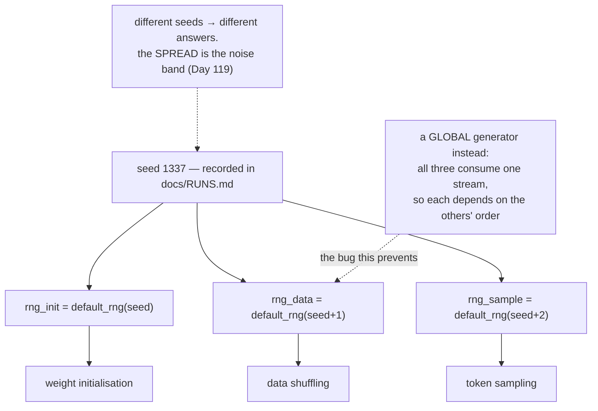

# 2.3 — Seeds and generators: reproducible randomness

## One-line answer

A pseudo-random generator is a deterministic machine whose output looks random, so fixing its starting
state fixes the entire sequence — and passing that generator explicitly, rather than reading a global,
is what makes a result something another person can reproduce.

---

## The story

A card club has a shuffling machine, and the machine has a number dial on the back.

Set the dial to 1337, feed a deck in, and a particular order comes out. Set it to 1337 again next
Tuesday and the exact same order comes out. Set it to 1338 and a completely different order comes out
— just as impossible to guess in advance, and just as repeatable.

Nobody thinks the machine is broken. It is doing exactly what a shuffling machine ought to do:
producing an arrangement nobody at the table could have predicted, in a way that can still be checked
afterwards if there is an argument.

The trouble starts when a second table begins using the same machine without setting the dial at all.
Both tables get their shuffles. Neither of them can reproduce theirs later. And worse than that, the
two tables are now pulling from the same run of numbers, so what one table gets depends on how many
hands the other table has played — which nobody at either table can see.
---

## The idea in plain language

Computers do not produce random numbers. They run a **pseudo-random number generator** (PRNG): a
deterministic function that takes an internal state, produces a number, and updates the state. The
sequence is fixed by the starting state and by nothing else.

A **seed** is that starting state, expressed as a number you choose. Two runs with the same seed produce
the same sequence of draws, always, on the same library version. Two runs with different seeds produce
unrelated sequences.

That gives three properties, and they are the reason Principle 9 exists:

- **Reproducibility.** A generation, a shuffle, a weight initialisation — all repeatable exactly.
- **Auditability.** A result somebody disputes can be re-run.
- **Comparability.** Two experiments differing only in the thing you changed, because everything random
  was the same.

And one trap that follows: **a seed does not make randomness go away, it pins it.** Two runs of the same
config with different seeds give different answers, and the spread between them is the noise band.
Day 1 part
[3.2](../../../day-001-bootstrap-and-map/parts/03-the-ledgers/3.2-runs-md-turns-anecdote-into-result.md)
made that the reason `docs/RUNS.md` records a seed per run, and this repository's Silent Failure #4 —
noise mistaken for improvement — is precisely what happens when a single seeded run is treated as *the*
answer.

Then the structural half, which is the part that shows up in code review. There are two ways to reach a
generator:

- **A global.** `np.random.random()` reads a module-level state shared by everything in the process.
- **An explicit generator.** `rng = np.random.default_rng(1337)` creates an independent object you pass
  where it is needed.

The global is convenient and it is a bug factory. Any function using it has an output that depends on
**how many random numbers other, unrelated code drew first** — so adding a logging line that shuffles
something changes your model's initialisation. This repository's CLAUDE.md states the rule directly: *a
function whose output depends on an unseeded global is a bug*, and the same reasoning condemns a
*seeded* global too, because seeding it does not stop it being shared.

---

## Why Akshara needs it

- **Day 1 part [3.2](../../../day-001-bootstrap-and-map/parts/03-the-ledgers/3.2-runs-md-turns-anecdote-into-result.md)**
  put a `Seed` column in `docs/RUNS.md`. This part is what goes in it and why it is not optional.
- **Day 51 onward**, every training run seeds `random`, `numpy`, the framework and the data loader —
  four separate generators, each of which will happily be unseeded on its own.
- **Day 67**'s pretraining run is the one that costs a session. A run that cannot be reproduced cannot
  be resumed or compared, and free sessions get pre-empted (Day 1 part
  [4.4](../../../day-001-bootstrap-and-map/parts/04-free-compute/4.4-the-session-that-vanished.md)).
- **Day 119** makes statistical significance formal, and its whole premise is *multiple seeds*, which
  requires seeds to be a controlled variable rather than an accident.
- **Every test in `tests/`** must be deterministic (CLAUDE.md). A test that draws from a global is
  order-dependent and therefore flaky.

---

## The mechanism

The two properties, checked:

```python
import numpy as np

a = np.random.default_rng(1337).random(5)      # (5,)
b = np.random.default_rng(1337).random(5)      # (5,)
c = np.random.default_rng(1338).random(5)      # (5,)

print("same seed  :", a)
print("same again :", b)
print("identical  :", np.array_equal(a, b))
print("other seed :", c)
print("identical  :", np.array_equal(a, c))
```

**Line by line:**
- `np.random.default_rng(seed)` constructs a **new, independent** generator. Two calls with the same
  seed produce two objects that will emit identical sequences and share no state — which is what makes
  them safe to hand to different parts of a program.
- `np.array_equal` compares exactly, and here exact comparison is right: the two sequences are produced
  by the same deterministic function from the same state, so they agree bit for bit. This is one of the
  very few places in this curriculum where exact float equality is the correct test.
- Measured on Intel Core i3-1115G4, CPython 3.12.10, numpy 2.5.2, 2026-08-26: the same-seed comparison
  prints `True` and the different-seed comparison prints `False`.

**The global versus the explicit generator, and why order-dependence is a real bug:**

```python
def sample_twice(rng: np.random.Generator) -> tuple[float, float]:
    return float(rng.random()), float(rng.random())


rng = np.random.default_rng(1337)
first = sample_twice(rng)

rng = np.random.default_rng(1337)
_ = rng.random()                                # something ELSE drew one number first
second = sample_twice(rng)

print("first :", first)
print("second:", second)
print("same? :", first == second)
```

**Line by line:**
- Both calls use a generator seeded with 1337. The only difference is that one extra draw happened in
  between — the kind of thing a logging line, a shuffle or a dropout mask does.
- It prints `False` on this machine, 2026-08-26. The two results are
  `(0.8781019003471183, 0.18552796163759344)` and `(0.18552796163759344, 0.9209004548704729)` — note
  that the second run's *first* value is the first run's *second* value, which is the sequence shifted
  by one. **The seed was fixed and the result still changed**, because a seed pins the *sequence*, not
  the position in it.
- With a global generator this is exactly the situation you are always in, and the "something else"
  is any other code in the process. With explicit generators you at least control who consumes from
  which, and the fix is to give the independent thing its **own** generator rather than sharing one.

**Independent streams, which is the fix:**

```python
seed = 1337
rng_init = np.random.default_rng(seed)         # weight initialisation
rng_data = np.random.default_rng(seed + 1)     # data shuffling
rng_sample = np.random.default_rng(seed + 2)   # decoding

for _ in range(3):
    _ = rng_data.random(100)                    # the loader does its work
print("sampling is unaffected:", float(rng_sample.random()))
```

**Line by line:**
- Three generators from one recorded seed, so **one number in `docs/RUNS.md` still reproduces
  everything** while the three streams cannot disturb each other.
- Deriving them as `seed`, `seed + 1`, `seed + 2` is the simple version and it is adequate here. The
  more careful approach is `np.random.SeedSequence(seed).spawn(3)`, which is designed to produce
  independent streams and does not rely on nearby seeds being unrelated — worth knowing about, and
  worth using once more than three streams exist.
- Draining `rng_data` three times changes nothing about `rng_sample`. That independence is the whole
  point: adding a shuffle no longer perturbs the generation.

**And the honest limit of a seed:**

```python
for seed in (1337, 1338, 1339):
    rng = np.random.default_rng(seed)
    p = np.array([0.5, 0.3, 0.15, 0.05])
    cdf = np.cumsum(p); cdf[-1] = 1.0
    draws = np.searchsorted(cdf, rng.random(1000), side="right")
    print(f"  seed {seed}: frequencies {np.round(np.bincount(draws, minlength=4) / 1000, 4)}")
```

**Line by line:**
- Three seeds, one thousand draws each, one distribution.
- Measured on this machine, 2026-08-26: `seed 1337` gives `[0.52  0.29  0.146 0.044]`, `seed 1338`
  gives `[0.506 0.299 0.147 0.048]`, `seed 1339` gives `[0.494 0.308 0.145 0.053]`.
- **All three are correct and all three differ**, by `0.026` between the highest and lowest first
  entry. That spread is the noise band, and it is what a single seeded run cannot tell you. A result
  quoted from one seed is a point without an error bar — Silent Failure #4, and Day 119's subject.



---

## Shapes

| Tensor | Symbolic shape | Concrete here | What each axis means |
| --- | --- | --- | --- |
| `rng.random(5)` | `(5,)` | `(5,)` | five uniform draws in `[0, 1)` |
| `rng.random(N)` | `(N,)` | `(1000,)` | one draw per sample |
| `draws` | `(N,)` | `(1000,)` | one index per draw |
| frequencies | `(V,)` | `(4,)` | compared across seeds — the spread is the finding |

---

## When it breaks

The loud one, and it is worth provoking because the message is instructive:

```console
>>> np.random.default_rng(-1)
Traceback (most recent call last):
  File "<stdin>", line 1, in <module>
ValueError: expected non-negative integer
```

Verbatim on this machine, 2026-08-26. Seeds are non-negative integers; a negative one, or a float, is
refused rather than silently coerced.

**The silent versions, and there are three, each worse than the last.**

*One: an unseeded generator.* `np.random.default_rng()` with no argument seeds itself from the operating
system. It runs, it produces good randomness, and **the run is unreproducible**. Nothing warns, and the
absence is only discovered when someone tries to reproduce a result and cannot.

*Two: a seeded global.* `np.random.seed(1337)` then `np.random.random()` looks reproducible and is
order-dependent, as measured above. Add a line anywhere in the process that draws a number and every
result downstream changes. The run reproduces perfectly today and not after the next refactor.

*Three: the same seed everywhere.* Using `seed` for the initialisation, the shuffle and the sampling
means the three streams start identically. They diverge immediately in practice, so nothing looks
wrong — but the streams are correlated in a way nobody has reasoned about, and for anything relying on
independence between them it is a real defect.

The check, and it belongs at the top of every entry point:

```python
def make_generators(seed: int) -> dict[str, np.random.Generator]:
    assert isinstance(seed, int) and seed >= 0, f"seed must be a non-negative int, got {seed!r}"
    names = ("init", "data", "sample")
    children = np.random.SeedSequence(seed).spawn(len(names))
    print(f"seed {seed} -> streams {names}")          # goes into the run log
    return dict(zip(names, (np.random.Generator(np.random.PCG64(c)) for c in children), strict=True))
```

**Line by line:**
- The assertion refuses anything that is not a usable seed, including `None` — which is the silent
  "unseeded" case turned loud.
- `SeedSequence(seed).spawn(n)` is the library's own mechanism for deriving independent streams from one
  seed. It exists because "seed, seed+1, seed+2" is a heuristic and this is a guarantee.
- **The `print` is not decoration.** The seed has to reach the run log — `docs/RUNS.md`, Day 1 part
  [3.2](../../../day-001-bootstrap-and-map/parts/03-the-ledgers/3.2-runs-md-turns-anecdote-into-result.md)
  — and a seed that is chosen but never recorded is exactly as useless as no seed at all.
- `strict=True` on the `zip`, so a mismatch between the names and the spawned streams raises instead of
  silently dropping one.
- Returning a **dict** rather than a tuple means the call sites read `rngs["sample"]`, which cannot be
  got wrong the way positional unpacking can.

---

## In production

**What a research engineer writes instead of the teaching version.** One seed in the config, derived
streams for every consumer, and the seed logged with every artefact — checkpoint, generation, eval
result. They also know that **a seed is necessary and not sufficient for reproducibility**: the library
version, the thread count and the hardware all affect results too, because floating-point summation
order changes with them (Day 2 part
[3.2](../../../day-002-tensors-shape-stride/parts/03-matmul/3.2-three-loops-then-one-call.md) measured
two correct matmuls disagreeing at `10⁻¹⁴`). That is why `docs/RUNS.md` has a `Hardware` column
alongside the `Seed` column, and why "same seed, different machine, slightly different number" is
expected rather than alarming.

**What degrades at scale.** Parallelism. Multiple data-loading workers, multiple devices and multiple
processes each need their own stream, and deriving them incorrectly gives **duplicated randomness** —
two workers producing the same "random" augmentation, or two devices drawing the same dropout mask.
That failure produces a model that trains and is quietly worse, with no error, and it is why
`SeedSequence.spawn` exists rather than everyone adding one to a seed.

**The failure that only shows with real data.** A resumed run. Day 1 part
[4.4](../../../day-001-bootstrap-and-map/parts/04-free-compute/4.4-the-session-that-vanished.md)
rehearsed pre-emption; the piece that catches people is that resuming from a checkpoint restores the
weights and **not** the generator state, so the data order after a resume is whatever a freshly-seeded
loader produces. The model sees some examples twice and others not at all in that epoch. Nothing raises;
the loss curve has a small discontinuity that looks like noise. Checkpointing the generator state
alongside the weights is the fix, and Day 67's checklist asks for it.

**The review comment.** *"This calls `np.random.random()` — that's the global. Pass a `Generator` in, and
make sure the run's seed reaches it."*

**The interview question.** *"What does setting a seed actually guarantee?"* The strong answer is
precise: it fixes the *sequence* a generator produces, so the same code consuming the same number of
draws in the same order gives the same result — and then the three caveats that show experience: it does
not survive a change in library version or thread count; it does not help if the generator is global and
something else consumes from it; and it does not remove noise, it pins one sample of it, which is why
you need several seeds before quoting a difference.

**Compute tier: T0.** All of it is a laptop CPU measurement, and the reproducibility properties are
properties of the library rather than the machine, so they transfer. The *values* do not: a different
numpy version may produce a different sequence from the same seed, which is itself the point of the
"necessary and not sufficient" caveat above.

---

## Check yourself

Run this. It prints **two `True`/`False` pairs and three sets of frequencies that must differ**:

```python
import numpy as np

a = np.random.default_rng(1337).random(5)
b = np.random.default_rng(1337).random(5)
c = np.random.default_rng(1338).random(5)
print("same seed identical :", np.array_equal(a, b))
print("diff seed identical :", np.array_equal(a, c))

p = np.array([0.5, 0.3, 0.15, 0.05])
cdf = np.cumsum(p); cdf[-1] = 1.0
for seed in (1337, 1338, 1339):
    rng = np.random.default_rng(seed)
    draws = np.searchsorted(cdf, rng.random(1000), side="right")
    print(f"  seed {seed}: {np.round(np.bincount(draws, minlength=4) / 1000, 4)}")
```

**Line by line:**
- The two booleans print `True` and `False`.
- The three frequency rows all differ from each other and from `p`. On this machine, 2026-08-26, the
  first entry ranges from `0.494` to `0.520` — a spread of `0.026` across three correct runs.
- **That spread is the point.** Write it down: it is the smallest difference a single-seed comparison
  could ever detect, and Day 119 turns it into a threshold.
- Now draw one extra number from `rng` before the loop body and re-run. Predict whether the frequencies
  change before you look.

**Say this out loud, without scrolling up:** say what a seed fixes and what it does not — and explain
why passing a generator is different from seeding a global, using the word *order*.
