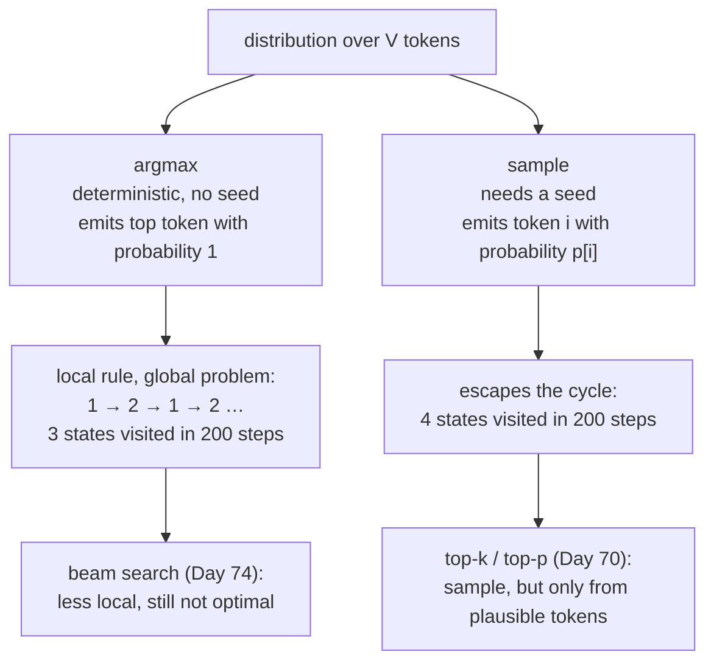

# 2.4 — Argmax versus sampling: two different questions

## One-line answer

`argmax` asks "what is the single most likely next token" and sampling asks "what is *a* plausible next
token" — and because the most likely continuation of the most likely continuation is not the most
likely sequence, greedy decoding gets stuck in loops that sampling walks straight out of, measured here
as `[0, 1, 2, 1, 2, 1, 2, …]` forever.

---

## The story

You are new to a hill town and you want to get to the highest point. You give yourself one rule: at
every corner, take the street that goes most steeply uphill.

You follow it faithfully. Up the first slope. Then, from the top of it, the rule points you back down
the way you came, because the little rise behind you is now the steepest thing available. So you walk
back. From there the rule points at the first slope again.

You are now walking between two small bumps, back and forth, forever. And at every single step you are
doing precisely the right thing according to your rule.

A friend uses the same rule, but every now and then deliberately takes a different street instead.
They wander more. They waste some steps. And they end up standing on the actual hilltop — because
getting there meant walking *downhill* for one block first, and your rule will never do that.

Neither of you is wrong. You are answering two different questions: *which single step is best from
right here*, and *what is a good route*. Those two questions have different answers, and no amount of
care with the first one ever turns it into the second.
---

## The idea in plain language

Given a distribution over the vocabulary, there are two obvious things to do with it:

- **Greedy decoding** — take `argmax`. The most likely next token, every time.
- **Sampling** — draw from the distribution, as parts [2.1](2.1-sampling-from-a-categorical.md) and
  [2.2](2.2-the-inverse-cdf-trick.md) built.

They differ in four ways that matter, and the fourth is the one that surprises people:

**Determinism.** Greedy is deterministic: same input, same output, forever, with no seed involved.
Sampling depends on the generator's state, so it needs a seed to be reproducible (part
[2.3](2.3-seeds-and-generators.md)).

**Diversity.** Greedy produces exactly one continuation. Sampling produces a different one each time,
which is what you want when generating several candidates or measuring variability.

**Faithfulness to the distribution.** Sampling emits token `i` with probability `p[i]` — measured below
at `0.6295` against `p[argmax] = 0.6252`. Greedy emits the top token with probability 1, which is a
distribution the model did not produce.

**And the one that is not obvious: greedy is not optimal even at its own goal.** Choosing the most
likely token at every step does *not* produce the most likely sequence, because a slightly
lower-probability token now can open up a much higher-probability continuation later. Greedy is a local
rule applied to a global problem. Beam search (Day 74) exists precisely to search a little wider, and
it is still not optimal — it is just less local.

The visible symptom of that locality is **repetition**. If token A makes B most likely and B makes A
most likely, greedy decoding produces `A B A B A B` forever. Nothing is broken: every step is the
model's top choice. Measured below as a chain that enters a two-cycle at step 1 and never leaves it.

---

## Why Akshara needs it

- **Day 25** trains the first model, and how you decode it decides what "it generates English-shaped
  text" even means. A greedy sample from a weak model looks far worse than a temperature sample from
  the same weights.
- **Day 69–77** builds the decoding phase, and this is the choice everything there elaborates: top-k,
  top-p and beam search are all attempts to sit between these two extremes.
- **Day 112 onward** evaluates the model. Greedy gives a reproducible number and understates diversity;
  sampled gives a distribution of numbers and needs seeds and error bars. **An eval that does not state
  its decoding strategy is not reproducible**, and neither choice is neutral.
- **Day 97–103**'s prompt-sensitivity study needs variability to measure at all, so it cannot be run
  greedily.
- **Day 71** implements repetition penalties, which exist because of the loop measured here.

---

## The mechanism

First, that sampling really is faithful and greedy really is not:

```python
import numpy as np


def softmax(z, axis=-1):
    e = np.exp(z - z.max(axis=axis, keepdims=True))
    return e / e.sum(axis=axis, keepdims=True)


z = np.array([2.0, 1.0, 0.1, -0.5])            # (V,)
p = softmax(z)                                  # (V,)
cdf = np.cumsum(p); cdf[-1] = 1.0               # (V,)

rng = np.random.default_rng(1337)
draws = np.searchsorted(cdf, rng.random(10_000), side="right")   # (10000,)

print("argmax token        :", int(p.argmax()))
print("sampled frequencies :", np.round(np.bincount(draws, minlength=4) / 10_000, 4))
print("fraction == argmax  :", float((draws == p.argmax()).mean()))
print("p[argmax]           :", round(float(p.max()), 4))
```

**Line by line:**
- `draws == p.argmax()` compares every draw against the greedy choice, and its mean is the fraction of
  the time sampling agreed with greedy.
- Measured on Intel Core i3-1115G4, CPython 3.12.10, numpy 2.5.2, seed 1337, 2026-08-26:
  `fraction == argmax 0.6295` against `p[argmax] 0.6252`. **Sampling agrees with greedy exactly as
  often as the model says it should** — that is the definition of faithful — and the small gap is
  sampling error over 10,000 draws.
- Greedy would give `1.0` for that fraction. So greedy is not a low-temperature version of sampling; it
  is `T = 0`, the limit measured in part
  [1.4](../01-logits-and-probabilities/1.4-temperature-is-a-scale-on-the-logits.md) as `[1., 0., 0.,
  0.]`.

**Now the loop, which is the failure mode.** A four-state chain where the transition logits make states
1 and 2 point at each other:

```python
transitions = np.array([                        # (S, S) logits: row i is the next-state logits from i
    [0.0, 3.0, 0.5, 0.2],                       # from 0 -> mostly 1
    [0.0, 0.0, 3.0, 0.4],                       # from 1 -> mostly 2
    [0.0, 3.0, 0.0, 0.5],                       # from 2 -> mostly 1     <- the cycle
    [1.0, 0.5, 0.5, 0.0],
])


def generate(start: int, steps: int, greedy: bool, rng=None) -> list[int]:
    state, out = start, [start]
    for _ in range(steps):
        probs = softmax(transitions[state])     # (S,)
        if greedy:
            state = int(probs.argmax())
        else:
            c = np.cumsum(probs); c[-1] = 1.0
            state = int(np.searchsorted(c, rng.random(), side="right"))
        out.append(state)
    return out


print("greedy  :", generate(0, 15, greedy=True))
print("sampled :", generate(0, 15, greedy=False, rng=np.random.default_rng(1337)))
print("sampled :", generate(0, 15, greedy=False, rng=np.random.default_rng(1338)))
```

**Line by line:**
- `transitions` is a stand-in for a language model: given the current token, it produces logits over
  the next. It is four states rather than 32,000 so the whole behaviour fits on one line of output.
- Row 1 has its largest entry at index 2, and row 2 has its largest entry at index 1. **That is the
  entire construction** — two states that each consider the other most likely.
- `generate` is the decode loop, with the branch as the only difference between the two strategies.
- Measured on this machine, 2026-08-26:

```text
greedy  : [0, 1, 2, 1, 2, 1, 2, 1, 2, 1, 2, 1, 2, 1, 2, 1]
sampled : [0, 1, 2, 2, 3, 3, 0, 1, 2, 1, 2, 0, 1, 2, 1, 1]
sampled : [0, 1, 2, 1, 2, 1, 2, 1, 2, 1, 3, 1, 2, 1, 2, 1]
```

**The greedy row enters the cycle at step 1 and never leaves.** Every single step is the model's top
choice; the sequence is a two-cycle. The first sampled row visits all four states. The second sampled
row *almost* loops — and then breaks out at step 10 by taking state 3, which had a logit of `0.5`
against the winner's `3.0`.

Over a longer horizon:

```python
print("greedy distinct states in 200 steps :", len(set(generate(0, 200, greedy=True))))
print("sampled distinct states in 200 steps:",
      len(set(generate(0, 200, greedy=False, rng=np.random.default_rng(1337)))))
```

**Line by line:**
- `set(...)` counts how much of the state space was visited at all.
- Measured on this machine, 2026-08-26: greedy visits **3** distinct states in 200 steps (states 0, 1
  and 2, and state 0 only because it started there); sampling visits **4**.
- At `V = 32,000` this is the difference between text that repeats a phrase indefinitely and text that
  moves.

And the determinism property, stated as a fact rather than a feeling:

```python
print("greedy twice identical :", generate(0, 20, True) == generate(0, 20, True))
print("sampled, same seed     :", generate(0, 20, False, np.random.default_rng(7))
                                  == generate(0, 20, False, np.random.default_rng(7)))
print("sampled, diff seed     :", generate(0, 20, False, np.random.default_rng(7))
                                  == generate(0, 20, False, np.random.default_rng(8)))
```

**Line by line:**
- Measured on this machine, 2026-08-26: `True`, `True`, `False`.
- **Greedy is reproducible with no seed at all.** That is genuinely useful for an eval, and it is why
  "greedy decoding" and "temperature 0" are used interchangeably in benchmark protocols.
- Sampling is reproducible *given* a seed, which is the whole of part
  [2.3](2.3-seeds-and-generators.md), and irreproducible without one.



---

## Shapes

| Tensor | Symbolic shape | Concrete here | What each axis means |
| --- | --- | --- | --- |
| `z`, `p` | `(V,)` | `(4,)` | logits and probabilities over the vocabulary |
| `cdf` | `(V,)` | `(4,)` | the cumulative sum, endpoint pinned |
| `draws` | `(N,)` | `(10000,)` | one sampled index per draw |
| `transitions` | `(S, S)` | `(4, 4)` | current state · next-state logits |
| `transitions[state]` | `(S,)` | `(4,)` | one row — the distribution for this step |
| a real decode step | `(B, V)` | `(B, 32000)` | one distribution per sequence, last position only |

---

## When it breaks

The loud one, from `argmax` on the wrong axis:

```console
>>> probs = np.full((2, 6, 50), 1 / 50)
>>> probs.argmax().shape
()
>>> probs.argmax(axis=-1).shape
(2, 6)
```

`argmax` with no axis flattens the whole tensor and returns **one** index into `B × T × V` — a number
between 0 and 599 here, which is a valid-looking integer and complete nonsense as a token id. It does
not raise. Always name the axis: `probs.argmax(axis=-1)`.

**The silent version, and it is the subject of this part: greedy decoding that is working perfectly and
producing unusable output.**

```text
greedy  : [0, 1, 2, 1, 2, 1, 2, 1, 2, 1, 2, 1, 2, 1, 2, 1]
```

No error. No `NaN`. Every step is the model's highest-probability choice, and the model is not
necessarily bad — the loop is a property of the *decoding rule*, not of the weights. A model evaluated
only under greedy decoding will look worse than it is, and one evaluated only under sampling will have
a different — not better — set of problems.

The detection is a diversity measure, computed alongside the generation rather than eyeballed:

```python
def repetition_report(tokens: list[int], window: int = 20) -> dict[str, float]:
    """Cheap degeneration diagnostics for a generated sequence."""
    recent = tokens[-window:]
    distinct = len(set(recent)) / len(recent)
    bigrams = [tuple(recent[i:i + 2]) for i in range(len(recent) - 1)]
    unique_bigrams = len(set(bigrams)) / max(1, len(bigrams))
    return {"distinct_token_ratio": distinct, "unique_bigram_ratio": unique_bigrams}
```

**Line by line:**
- The **distinct-token ratio** over a recent window is the cheapest possible signal: a two-cycle gives
  `2/20 = 0.1`, healthy text gives something much higher.
- The **unique-bigram ratio** catches longer cycles that the token ratio misses — a repeating
  three-phrase pattern has plenty of distinct tokens and almost no distinct bigrams.
- A **window** rather than the whole sequence, because degeneration usually starts partway through and
  averaging over the healthy prefix hides it.
- Applied to this part's greedy output over its last 20 tokens, the distinct-token ratio is `0.1` and
  the unique-bigram ratio is `2/19 ≈ 0.105`. Applied to the sampled output they are far higher. **Log
  both alongside every generation**, from Day 25 onward — they cost nothing and they are the difference
  between noticing degeneration and reading it.

---

## In production

**What a research engineer writes instead of the teaching version.** They do not choose between the two;
they parameterise. One decode function with a strategy — greedy, temperature, top-k, top-p, beam —
selected by configuration, and the configuration logged with every generation. The reason is that the
right choice depends on the task: a benchmark that requires an exact answer is run greedily for
reproducibility, a creative generation is sampled, and a system serving both does both.

They also know that greedy is **not** free of settings. Ties in `argmax` are broken by index order,
which means the tokenizer's arbitrary ordering decides the output when two logits are exactly equal.
Rare, deterministic, and a real source of "why does this model prefer this token" confusion.

**What degrades at scale.** The cost of repetition, and the cost of greedy's determinism as a
*measurement* strategy. At long generation lengths, greedy degeneration is close to universal for
weaker models — which is why nearly every practical system samples with truncation. And an eval run
greedily reports one number with no error bar, so two systems differing by less than the sampling
noise cannot be distinguished. Reporting a greedy number as if it settled a comparison is Silent
Failure #4 (plan §6) with the noise hidden rather than measured, and Day 119 is where that is made
formal.

**The failure that only shows with real data.** Degeneration that depends on the *prompt*. A model may
decode cleanly on most inputs and loop on a specific kind — a list, a repeated structure, a prompt
ending mid-phrase. Because it is input-dependent, a fixed test prompt will not find it, and the
diversity metrics above have to run on real traffic rather than on a fixture. Day 71's repetition
penalty and Day 70's truncation are the standard mitigations, and neither is a fix so much as a
tradeoff.

**The review comment.** *"This eval uses sampling but doesn't record the seed or the temperature. Either
run it greedily and say so, or record both and run three seeds."*

**The interview question.** *"Why would you ever sample instead of taking the most likely token?"* The
strong answer names more than "variety": greedy is a local rule for a global objective, so the most
likely token at each step does not give the most likely sequence, and the visible consequence is
repetition loops. Then the honest counterpoint — greedy is reproducible with no seed, which is why
benchmarks use it — and the practical resolution, which is truncated sampling. Mentioning that
`T → 0` *is* greedy, so the two are ends of one dial rather than different algorithms, is the detail
that ties it to part 1.4.

**Compute tier: T0.** Everything is a four-state chain and 10,000 draws on a laptop CPU. The T0 version
proves the **structural facts** — faithfulness, determinism, and that a greedy loop is a property of
the rule rather than the model — and all three transfer to any vocabulary. What it does not show is how
often real models degenerate at real lengths, which is a measurement on a trained model and belongs to
Day 69 onward.

---

## Check yourself

Run this. It prints **a sampled fraction close to `p[argmax]`, and one sequence that must visibly
repeat**:

```python
import numpy as np


def softmax(z, axis=-1):
    e = np.exp(z - z.max(axis=axis, keepdims=True))
    return e / e.sum(axis=axis, keepdims=True)


z = np.array([2.0, 1.0, 0.1, -0.5])
p = softmax(z)
cdf = np.cumsum(p); cdf[-1] = 1.0
rng = np.random.default_rng(1337)
draws = np.searchsorted(cdf, rng.random(10_000), side="right")
print("fraction == argmax:", float((draws == p.argmax()).mean()), " p[argmax]:", round(float(p.max()), 4))

transitions = np.array([[0.0, 3.0, 0.5, 0.2],
                        [0.0, 0.0, 3.0, 0.4],
                        [0.0, 3.0, 0.0, 0.5],
                        [1.0, 0.5, 0.5, 0.0]])


def generate(start, steps, greedy, rng=None):
    s, out = start, [start]
    for _ in range(steps):
        pr = softmax(transitions[s])
        if greedy:
            s = int(pr.argmax())
        else:
            c = np.cumsum(pr); c[-1] = 1.0
            s = int(np.searchsorted(c, rng.random(), side="right"))
        out.append(s)
    return out


print("greedy :", generate(0, 15, True))
print("sampled:", generate(0, 15, False, np.random.default_rng(1337)))
print("greedy distinct in 200 :", len(set(generate(0, 200, True))))
print("sampled distinct in 200:", len(set(generate(0, 200, False, np.random.default_rng(1337)))))
```

**Line by line:**
- The fraction prints `0.6295` against `p[argmax] 0.6252` on this machine, 2026-08-26 — agreement to
  within sampling error, which is what "faithful" means.
- The greedy sequence prints `[0, 1, 2, 1, 2, 1, 2, …]`. **Every one of those steps is the model's top
  choice.**
- The distinct-state counts print `3` and `4`. Now raise 200 to 2000 and predict whether the greedy
  count changes.

**Say this out loud, without scrolling up:** state the two different questions greedy and sampling
answer — and explain why taking the most likely token at every step does not give the most likely
sequence.
