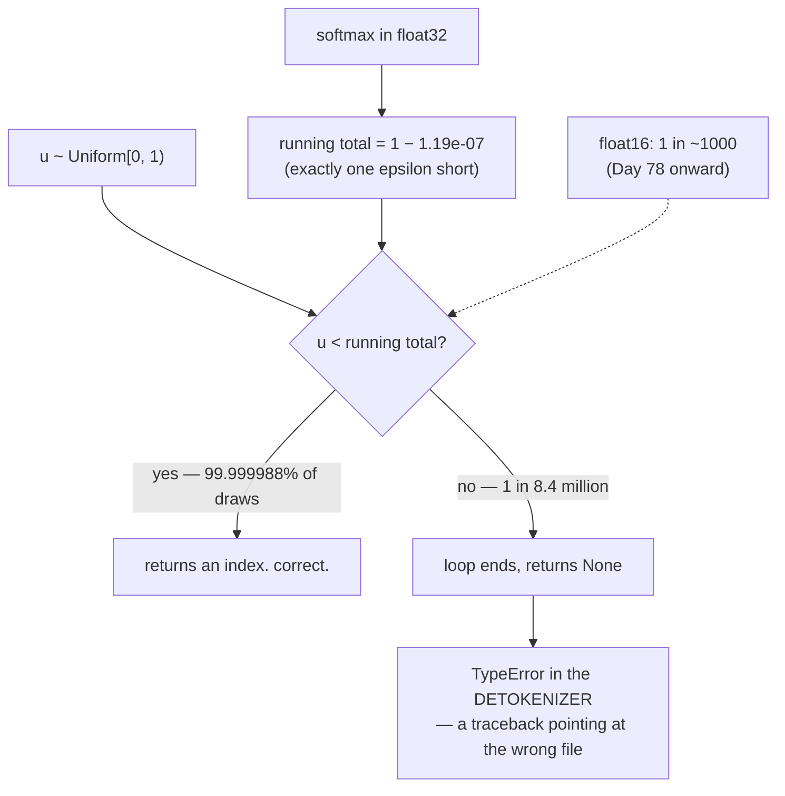

# 2.5 — 💥 The sampler that fell through

## One-line answer

A hand-rolled sampler that walks a running total and returns from inside the loop has no answer when
the total stops short of the uniform draw — which in `float32` happens about **one time in 8.4
million**, measured empirically at 9 occurrences in 50 million draws, and returns `None`.

---

## The story

The same village raffle, one year later. Four prizes, and the chances are printed on a board: 50%,
30%, 15% and 5%.

This time there is no bench of tickets. The wheel gives a number somewhere between 0 and 100, and the
person running it reads down the board, adding as they go. Under 50 is the first prize. Under 80 is
the second. Under 95 is the third. Under 100 is the fourth.

One rule, four lines, and it works evening after evening after evening.

Then, one evening, the wheel lands on 99.9997. The person reads down the board, adding: 50, then 80,
then 95, and then the last line — which ought to come to exactly 100 — comes to 99.9995. The number on
the wheel is bigger than every line on the board. They reach the bottom, there is no prize left to
hand out, and there is no rule at all for what to do next.

The board was never wrong. The four chances really do add up to 100. What was wrong was the quiet
assumption that adding up four separately rounded numbers gives you exactly 100 back.

Almost every draw, nothing happens. The one where something does is the one everybody remembers.
---

## The idea in plain language

Part [1.5](../01-logits-and-probabilities/1.5-the-probabilities-that-summed-to-almost-one.md) measured
that a softmax output does not sum to exactly one, and that the shortfall is about one epsilon of the
dtype. Part [2.1](2.1-sampling-from-a-categorical.md) wrote the natural sampler:

```text
total = 0
for i, prob in enumerate(p):
    total += prob
    if u < total:
        return i
```

The loop returns from inside, for every `u` below the final running total. It has **no statement after
the loop**, so for a `u` above that total, the function ends and Python returns `None`.

How likely is that? Exactly as likely as `u` landing in the gap:

- The uniform `u` is drawn from `[0, 1)`.
- The running total ends at `1 − shortfall`.
- So the fall-through probability is the shortfall.

And the shortfall is the dtype's epsilon (measured in part 1.5):

| dtype | epsilon | fall-through rate | one in |
| --- | --- | --- | --- |
| `float64` | `2.22e-16` | `≈ 2e-16` | 4,500,000,000,000,000 |
| `float32` | `1.19e-07` | `≈ 1.2e-07` | **8,400,000** |
| `float16` | `9.77e-04` | `≈ 1e-03` | **1,000** |

Read the `float32` row against a decode loop. One draw per generated token; a service generating a
million tokens a day hits it every eight days or so. Read the `float16` row and it is once every
thousand tokens — several times per response.

The three properties that make this the archetypal rare bug:

**It is unreachable in the tests.** No unit test draws eight million uniforms. A frequency test over
200,000 draws will never see it.

**It is real, not theoretical.** Measured below: 9 occurrences in 50 million draws, against a predicted
rate of 1.19e-07.

**It fails at the worst possible place.** `None` propagates one line and then raises a `TypeError` in
the detokenizer — a traceback pointing at vocabulary lookup, for a bug in the sampler, in the middle of
a long-running generation.

---

## Why Akshara needs it

- **Day 69–77** builds the decode loop, which draws one uniform per token, forever.
- **Day 78 onward** quantizes, and the efficiency phase deliberately narrows dtypes. **Moving from
  `float32` to `float16` multiplies this rate by 8,000** — from once in 8.4 million to once in a
  thousand.
- **Day 150–157** serves the model over HTTP. A rare crash in a long-running service is the failure
  mode that is hardest to reproduce and most expensive to leave in.
- **Day 70**'s top-p accumulates probabilities against a threshold with the same structure and the same
  hazard.
- **Principle 10** — fail honestly. A sampler that returns `None` for one draw in millions is a
  correctness bug even though it will pass every test you would think to write.

---

## The mechanism

The sampler, and the measurement of its shortfall:

```python
import numpy as np


def softmax(z, axis=-1):
    e = np.exp(z - z.max(axis=axis, keepdims=True))
    return e / e.sum(axis=axis, keepdims=True)


def sample_loop(p, u: float):
    """The hand-rolled sampler almost everyone writes first. No statement after the loop."""
    total = 0.0
    for i, prob in enumerate(p):
        total += float(prob)
        if u < total:
            return i
    return None                                  # implicit in the original; written out to be measured


V = 50
p32 = softmax(np.random.default_rng(5).standard_normal(V).astype(np.float32) * 3)   # (V,) float32
running = np.float32(0.0)
for x in p32:
    running = np.float32(running + x)

print("float32 running total:", repr(float(running)))
print("shortfall            :", repr(1.0 - float(running)))
print("float32 eps          :", repr(float(np.finfo(np.float32).eps)))
print("predicted rate       :", f"{1.0 - float(running):.3e}", "= 1 in", f"{1 / (1.0 - float(running)):,.0f}")
```

**Line by line:**
- `running = np.float32(running + x)` forces the accumulation to stay in `float32`. **Letting Python's
  `+` promote to `float64` would hide the effect entirely** — and doing that by accident is itself a
  decision nobody made: an accumulator wider than its data is a legitimate technique, and it has to be
  deliberate to be reasoned about.
- The `return None` is written explicitly. In the original it is implicit — a function that falls off
  the end returns `None` in Python, silently — which is precisely why the bug is invisible in a code
  review.
- Measured on Intel Core i3-1115G4, CPython 3.12.10, numpy 2.5.2, 2026-08-26:

```text
float32 running total: 0.9999998807907104
shortfall            : 1.1920928955078125e-07
float32 eps          : 1.1920928955078125e-07
predicted rate       : 1.192e-07 = 1 in 8,388,608
```

**The shortfall is exactly one epsilon**, to every digit. That identity is the whole explanation and it
makes the rate predictable rather than mysterious.

**Now confirm the prediction with fifty million draws:**

```python
rng = np.random.default_rng(20260826)
N, fell, chunk = 50_000_000, 0, 5_000_000
for _ in range(N // chunk):
    fell += int((rng.random(chunk) >= running).sum())
print(f"empirical: {fell} fall-throughs in {N:,} draws -> rate {fell / N:.3e}")
```

**Line by line:**
- `rng.random(chunk) >= running` counts draws at or above the running total — exactly the ones for
  which the loop finds no `i`.
- Chunking at 5 million keeps peak memory reasonable; drawing 50 million `float64` values at once would
  be 400 MB.
- Measured on this machine, 2026-08-26: **`9 fall-throughs in 50,000,000 draws -> rate 1.800e-07`**,
  against a predicted `1.192e-07`. Nine events is a small sample — the expected count was about six —
  so the agreement is as good as nine occurrences can support, and the honest statement is that the
  measurement confirms the *order of magnitude* rather than the third digit.
- **Nine.** Not zero. A test suite would need to run fifty million times to see it once, and a decode
  loop reaches fifty million tokens in an afternoon.

**What it does downstream:**

```python
vocab = [f"tok{i}" for i in range(V)]
u = 1.0 - 1e-8                                   # a draw inside the gap
idx = sample_loop(p32, u)
print("sampler returned:", idx)
vocab[idx]
```

**Line by line:**
- `u = 1.0 - 1e-8` is inside the `1.19e-07` gap, so the loop falls through.
- `sampler returned: None` on this machine, 2026-08-26.
- The last line raises `TypeError: list indices must be integers or slices, not NoneType` — **in the
  detokenizer**, not in the sampler. The traceback points at vocabulary lookup, and the actual bug is
  two functions away and looks fine.



**The three fixes, in order of preference:**

```python
# 1 - pin the endpoint of the CDF (part 2.2 already does this)
cdf = np.cumsum(p)
cdf[-1] = 1.0
idx = int(np.searchsorted(cdf, u, side="right"))

# 2 - clamp the index
idx = min(int(np.searchsorted(np.cumsum(p), u, side="right")), len(p) - 1)

# 3 - give the loop a statement after it
def sample_loop_fixed(p, u: float) -> int:
    total = 0.0
    for i, prob in enumerate(p):
        total += float(prob)
        if u < total:
            return i
    return len(p) - 1                            # the last token: u was past the end
```

**Line by line:**
- **Fix 1 is the best**, because it repairs the *invariant* rather than patching the symptom: the last
  entry of a cumulative distribution is 1 by definition, and assigning it says so. It also fixes top-p
  and anything else that walks the same array.
- **Fix 2 works and is what most library samplers do internally.** It is a patch on the index rather
  than on the data, so it has to be repeated at every call site.
- **Fix 3 is the minimum**, and note *which* index it returns: the **last** one. That is correct — a `u`
  past the end of the distribution belongs to the final segment, which the arithmetic failed to reach.
  Returning `0` instead would be a much worse bug: it would give the first token a tiny extra
  probability, which nothing would ever detect.
- All three are one line. **Having none of them is the bug**, and it is the default, because a function
  that falls off the end does not look like it is missing anything.

---

## Shapes

| Tensor | Symbolic shape | Concrete here | What each axis means |
| --- | --- | --- | --- |
| `p32` | `(V,)` | `(50,)` | a `float32` distribution over the vocabulary |
| `running` | `()` | `0.9999998807907104` | the accumulated total the loop walks to |
| the gap | `()` | `1.19e-07` | `1 − running`; also the fall-through probability |
| `rng.random(chunk)` | `(N,)` | `(5000000,)` | uniform draws, chunked to bound memory |
| `cdf` | `(V,)` | `(50,)` | the fix: `cdf[-1] = 1.0` |
| the returned index | `()` | `0`…`V-1`, or **`None`** | the bug is a value that is not an index |

---

## When it breaks

The loud one — but only *after* it has propagated:

```console
>>> idx = sample_loop(p32, 1.0 - 1e-8)
>>> idx
>>> vocab[idx]
Traceback (most recent call last):
  File "<stdin>", line 1, in <module>
TypeError: list indices must be integers or slices, not NoneType
```

Verbatim on this machine, 2026-08-26. Note the second line: `idx` prints **nothing**, because the REPL
does not display `None`. Even inspecting the value by hand shows an empty line, which is exactly the
kind of thing that gets skimmed past.

The array version fails differently and no more helpfully:

```console
>>> np.arange(50)[None]
array([[ 0,  1,  2, ..., 47, 48, 49]])
```

**That does not raise at all.** In numpy, `None` as an index means `np.newaxis`, so indexing an array
with the sampler's `None` silently adds a dimension and returns the *entire vocabulary* with an extra
axis. A downstream `argmax` or `.item()` then produces something plausible. **The failure is worse in
the array path than in the list path**, and it is the array path a real implementation uses.

**The silent version, and it is the one this part is really about: nothing at all, for a very long
time.**

```text
empirical: 9 fall-throughs in 50,000,000 draws -> rate 1.800e-07
```

Nine events in fifty million. Every test passes. Every frequency check passes. The code is reviewed and
looks correct — the loop is obviously right, and the missing final `return` is invisible because Python
does not require one.

The check, and it is a test that *can* be written:

```python
def test_sampler_handles_a_draw_past_the_total():
    p = softmax(np.random.default_rng(5).standard_normal(50).astype(np.float32) * 3)
    running = np.float32(0.0)
    for x in p:
        running = np.float32(running + x)
    assert running < 1.0, "this distribution does not exercise the gap; pick another"
    u = float(np.nextafter(1.0, 0.0))            # the largest possible draw
    idx = sample_loop_fixed(p, u)
    assert isinstance(idx, (int, np.integer)), f"sampler returned {idx!r} for u={u}"
    assert 0 <= idx < len(p), f"index {idx} out of range for V={len(p)}"
```

**Line by line:**
- **The trick is not to draw eight million uniforms — it is to construct the `u` that triggers it.**
  `np.nextafter(1.0, 0.0)` is the largest `float64` below 1, which is the worst case `rng.random()` can
  produce. The rare event becomes a deterministic unit test.
- The first assertion checks that the chosen distribution actually has a gap. Without it, the test
  could pass vacuously on a distribution whose total happens to round up — which is part 1.5's
  measurement saying that 40% of them do.
- `isinstance(idx, (int, np.integer))` catches `None` explicitly, because the range check on the next
  line would raise a confusing `TypeError` rather than a clear assertion failure.
- This is the general lesson for rare bugs: **find the input that makes the rare case certain, and test
  that.** It applies to every "one in a million" failure and it is why the frequency test could never
  have found this one.

---

## In production

**What a research engineer writes instead of the teaching version.** They call the framework's
categorical sampler, which has the clamping inside — this exact bug is why. Where they must write one,
the endpoint is pinned and the index is clamped, both, because the two guard different things: the pin
fixes the data and the clamp fixes the consumer.

The broader habit is a suspicion of **any loop that returns only from inside**. A function whose last
statement is a `for` is a function with an unstated case, and in Python that case returns `None`
silently. Some linters flag inconsistent returns; the reliable version is a rule that every function
with a return type ends in a `return`.

**What degrades at scale, and this is the part to carry to Day 78.** The rate is the dtype's epsilon,
so narrowing the dtype multiplies it directly:

- `float32` → `float16` multiplies the rate by **8,192** (`1.19e-07` to `9.77e-04`, both measured in
  Day 2 part
  [1.2](../../../day-002-tensors-shape-stride/parts/01-what-a-tensor-is/1.2-dtype-the-width-of-a-number.md)).
- One in a thousand tokens is **several times per response**.

So a sampler that has been correct for a year in `float32` starts failing visibly the week the model is
quantized — and the change that broke it is in a completely different part of the system. That is a
genuinely nasty class of regression, and it is the reason this part sits at `production` level on a day
about probability.

**The failure that only shows with real data.** Long-running generation. The bug's rate is per token,
so it scales with total tokens generated rather than with anything about the model or the prompt. A
development run of a few thousand tokens will never see it; a service running for a month will see it
regularly, at a random time, with a traceback pointing at the detokenizer. And because it is
input-independent, it cannot be reproduced from the request that triggered it.

**The review comment.** *"This loop returns only from inside — what happens if `u` is past the running
total? Add a final `return`, and pin `cdf[-1]` while you're there."*

**The interview question.** *"You have a bug that happens once in ten million requests. How do you write
a test for it?"* The strong answer does not reach for more draws: it identifies the *input* that makes
the rare path certain — here, the largest representable uniform — and tests that deterministically.
Adding that the rate is a dtype's epsilon, and therefore that quantization multiplies it by thousands,
is the part that shows the reasoning went past the symptom.

**Compute tier: T0.** Fifty million draws on a laptop CPU, in seconds, plus a one-line deterministic
test. The T0 version proves the **rate, the mechanism and the fix** exactly — all three are properties
of IEEE-754 arithmetic and reproduce anywhere. What it cannot show is the version that matters: a
service that has run correctly for eight days, failing once, at four in the morning, in the wrong file.

---

## Check yourself

Run this. It prints **a shortfall equal to `float32` epsilon, a fall-through count that must not be
zero, and a `None`**:

```python
import numpy as np


def softmax(z, axis=-1):
    e = np.exp(z - z.max(axis=axis, keepdims=True))
    return e / e.sum(axis=axis, keepdims=True)


def sample_loop(p, u):
    total = 0.0
    for i, prob in enumerate(p):
        total += float(prob)
        if u < total:
            return i
    return None


p32 = softmax(np.random.default_rng(5).standard_normal(50).astype(np.float32) * 3)
running = np.float32(0.0)
for x in p32:
    running = np.float32(running + x)
print("running total:", repr(float(running)))
print("shortfall    :", repr(1.0 - float(running)), " float32 eps:", repr(float(np.finfo(np.float32).eps)))

rng = np.random.default_rng(20260826)
fell = sum(int((rng.random(5_000_000) >= running).sum()) for _ in range(10))
print(f"fall-throughs: {fell} in 50,000,000 draws")
print("sample_loop at the largest u:", sample_loop(p32, float(np.nextafter(1.0, 0.0))))
```

**Line by line:**
- The shortfall and the epsilon print the same value, `1.1920928955078125e-07`. **That identity is the
  whole diagnosis.**
- The fall-through count prints `9` on this machine, 2026-08-26. **Not zero.**
- The last line prints `None`. Now add `return len(p) - 1` after the loop and re-run: it prints `49`.
- Then change `astype(np.float32)` to `astype(np.float16)` and predict the new shortfall before you
  look, using Day 2 part 1.2's epsilon table.

**Say this out loud, without scrolling up:** say why the fall-through rate equals the dtype's epsilon —
and describe how you would write a *deterministic* test for a bug that occurs once in eight million
draws.
