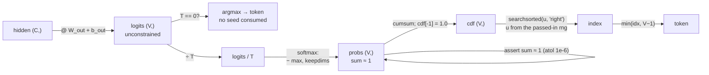

# 3.1 — The full path: hidden state to token, with every guard in place

## One-line answer

Assemble the day into one function — hidden state, logits, temperature, softmax, cumulative sum,
search, token — and note that **every guard in it exists because something measured today went wrong
without it**.

---

## The story

A chemist's shop hands over a prescription through five pairs of hands.

The doctor writes it. The chemist reads it back out loud. An assistant counts the tablets into the
box. A second chemist checks the count against the label. And the person at the counter asks for your
name and date of birth before handing the box over.

Five steps for one box of tablets, and on any ordinary day every one of them looks like a waste of
time. Not one of them is. Each was added after something specific went wrong, and each catches
something none of the others can. Reading it back catches bad handwriting. The recount catches a
miscount. The name check catches the right medicine going to the wrong person — which every single
earlier step would have happily let through.

Nobody in that shop remembers what went wrong. Everybody follows the five steps. That is the whole
design.
---

## The idea in plain language

Today produced two halves — a distribution (MATH-08) and a draw from it (MATH-09) — and six measured
failures between them. This part is the assembled path with each failure's guard in place, and the
point of assembling it is to see that **the guards are not defensive habit; each one is load-bearing
for a specific measured thing.**

The path, in order:

| Step | Operation | What can go wrong | Where it was measured |
| --- | --- | --- | --- |
| 1 | `logits = hidden @ W + b` | logits mistaken for probabilities | [1.2](../01-logits-and-probabilities/1.2-logits-are-not-probabilities.md) — `argmax` agrees, so nothing reveals it |
| 2 | `logits / T` | temperature applied after the softmax | [1.4](../01-logits-and-probabilities/1.4-temperature-is-a-scale-on-the-logits.md) — sum becomes `2.0` |
| 3 | `T == 0` | division by zero | [1.4](../01-logits-and-probabilities/1.4-temperature-is-a-scale-on-the-logits.md) — `[nan nan nan nan]` |
| 4 | `softmax` | overflow without the max subtraction | [1.3](../01-logits-and-probabilities/1.3-softmax-the-map-to-the-simplex.md) — `[nan nan nan]` at logits of 1000 |
| 5 | `keepdims` | wrong-axis broadcast | [1.3](../01-logits-and-probabilities/1.3-softmax-the-map-to-the-simplex.md) — silent when `V == T` |
| 6 | `cumsum` | endpoint below 1 | [1.5](../01-logits-and-probabilities/1.5-the-probabilities-that-summed-to-almost-one.md) — 1190 of 2000 |
| 7 | `searchsorted` | fall-through / out-of-range index | [2.5](../02-sampling/2.5-the-sampler-that-fell-through.md) — 9 in 50 million |
| 8 | the generator | unseeded or global | [2.3](../02-sampling/2.3-seeds-and-generators.md) — order-dependent results |

Eight steps, eight guards, and **not one of them would be found by testing the output**, because the
output of a sampler is supposed to be different every time.

The ordering matters too, and it is worth stating as a rule rather than as code: **everything that
reshapes the distribution happens in logit space, and there is exactly one softmax, at the end.**
Temperature, and later top-k, top-p and penalties (Day 70–71), are all logit operations. That is not
style — masking a token by setting its logit to `-inf` gives it exactly zero probability after the
softmax, whereas zeroing a probability leaves the distribution unnormalised.

---

## Why Akshara needs it

- **Day 25** generates from the first trained model, and this function is what stands between the
  weights and any qualitative judgement about them.
- **Day 39**'s model returns logits and stops. This is the code on the other side of that interface.
- **Day 69–77** extends exactly this function with top-k, top-p, penalties, beam search and a KV cache.
  Everything there is inserted at step 2, in logit space, in a documented order.
- **Day 150–157** serves it, where a rare `None` becomes a rare 500 response.

---

## The mechanism

The whole path, assembled:

```python
from __future__ import annotations

import numpy as np


def softmax(z: np.ndarray, axis: int = -1) -> np.ndarray:
    """Stable softmax. Shift-invariance makes the max subtraction exact (part 1.3)."""
    e = np.exp(z - z.max(axis=axis, keepdims=True))
    return e / e.sum(axis=axis, keepdims=True)


def next_token(hidden: np.ndarray,
               W_out: np.ndarray,
               b_out: np.ndarray,
               rng: np.random.Generator,
               temperature: float = 1.0) -> int:
    """Hidden state -> one token id. hidden (C,), W_out (C, V), b_out (V,)."""
    assert temperature >= 0.0, f"temperature must be non-negative, got {temperature}"

    logits = hidden @ W_out + b_out                       # (V,)  — step 1
    assert logits.ndim == 1, f"expected one distribution, got shape {logits.shape}"

    if temperature == 0.0:                                # step 3: greedy is the T -> 0 limit
        return int(logits.argmax())

    logits = logits / temperature                         # (V,)  — step 2, in LOGIT space
    probs = softmax(logits)                               # (V,)  — steps 4 and 5

    assert abs(float(probs.sum()) - 1.0) < 1e-6, f"not a distribution: sum {probs.sum():.9f}"

    cdf = np.cumsum(probs)                                # (V,)  — step 6
    cdf[-1] = 1.0                                         # pin the endpoint (part 1.5)

    idx = int(np.searchsorted(cdf, rng.random(), side="right"))   # step 7
    return min(idx, len(probs) - 1)                       # clamp (part 2.5)
```

**Line by line:**
- `rng` is a **parameter**, not a global. Part [2.3](../02-sampling/2.3-seeds-and-generators.md): a
  function reading module-level random state has an output that depends on what other code drew first,
  and Principle 9 requires the run's seed to reach here.
- `assert temperature >= 0.0` refuses a negative temperature. Part
  [1.4](../01-logits-and-probabilities/1.4-temperature-is-a-scale-on-the-logits.md) measured that a
  negative `T` produces a **perfectly valid distribution that is exactly reversed** — the model's least
  likely token becomes its most likely — which no downstream check would ever catch.
- `logits.ndim == 1` pins the contract: this function chooses **one** token from **one** distribution.
  A `(B, T, V)` tensor arriving here would broadcast through the softmax and produce something the
  `searchsorted` would silently mangle.
- The `temperature == 0.0` branch comes **before** the division. It is not an optimisation: part 1.4
  measured `softmax(z / 0.0)` giving `[nan nan nan nan]`, because `inf - inf` is `nan`. Greedy is the
  limit, computed directly.
- `logits / temperature` is applied to **logits**, before the softmax. Part 1.4 measured the
  alternative: dividing probabilities by `T` gives something summing to `2.0` or `0.5` with the ratios
  unchanged — no sharpening at all, and not a distribution.
- `softmax` carries the max subtraction and the `keepdims`. Part 1.3 measured `[nan nan nan]` without
  the first, and a silent wrong-axis broadcast without the second.
- The sum assertion uses `1e-6`, not exact equality. Part
  [1.5](../01-logits-and-probabilities/1.5-the-probabilities-that-summed-to-almost-one.md) measured
  1190 of 2000 softmax outputs failing an exact test — **the assertion would be red most of the time**.
  The tolerance is a thousand times `float32`'s epsilon and far below any real error.
- `cdf[-1] = 1.0` restores the definition floating point could not preserve.
- `min(idx, len(probs) - 1)` clamps. Belt and braces with the pin above, deliberately: the pin fixes
  the data, the clamp fixes the consumer, and part [2.5](../02-sampling/2.5-the-sampler-that-fell-through.md)
  measured 9 fall-throughs in 50 million draws when neither is present.

Run it end to end:

```python
rng_model = np.random.default_rng(1337)
C, V = 8, 50
W_out = rng_model.standard_normal((C, V))        # (C, V)
b_out = rng_model.standard_normal(V)             # (V,)
hidden = rng_model.standard_normal(C)            # (C,)

rng_sample = np.random.default_rng(2026)
for T in (0.0, 0.5, 1.0, 2.0):
    tokens = [next_token(hidden, W_out, b_out, rng_sample, T) for _ in range(12)]
    print(f"  T={T:4.1f} -> {tokens}   distinct {len(set(tokens))}")
```

**Line by line:**
- `rng_model` and `rng_sample` are **separate generators**, so drawing more samples does not perturb
  the "model". Part 2.3's independent-streams argument, applied.
- `hidden` is fixed, so the distribution is the same on every one of the twelve draws — which makes the
  effect of temperature visible without a model in the way.
- Measured on Intel Core i3-1115G4, CPython 3.12.10, numpy 2.5.2, 2026-08-26:

```text
  T= 0.0 -> [28, 28, 28, 28, 28, 28, 28, 28, 28, 28, 28, 28]   distinct 1
  T= 0.5 -> [18, 28, 28, 28, 28, 28, 28, 18, 28, 24, 37, 28]   distinct 4
  T= 1.0 -> [28, 28, 28, 37, 28, 20, 18, 18, 28, 24, 28,  8]   distinct 6
  T= 2.0 -> [24, 20, 18, 28, 24, 18, 18, 40, 37, 28, 19, 46]   distinct 8
```

Read the four rows as the dial from part
[1.4](../01-logits-and-probabilities/1.4-temperature-is-a-scale-on-the-logits.md), now with a real
`V = 50`:

- `T = 0` is greedy: twelve identical tokens, and **no randomness consumed at all** — the branch returns
  before touching `rng`.
- `T = 0.5` already breaks four ways, with token 28 still dominating.
- `T = 1` gives six distinct tokens, `T = 2` gives eight.
- The distinct count rises monotonically — `1, 4, 6, 8` — which is the dial doing exactly what part 1.4
  predicted, now on a 50-token vocabulary rather than a 4-token one.

**And a caution about reading that column.** Twelve draws is a tiny sample. The counts happen to be
monotone here; on a different seed they might not be, and a difference of one or two distinct tokens
between two settings would mean nothing. This is Silent Failure #4 (plan §6) in miniature — the trend
is real because it spans a factor of eight in temperature, not because the individual counts are
precise.



**The test that exercises the guards**, because each one has a measured trigger:

```python
def test_next_token_guards():
    rng = np.random.default_rng(0)
    C, V = 4, 7                                   # distinct, small
    W = np.zeros((C, V)); b = np.zeros(V); h = np.zeros(C)

    # greedy is deterministic and consumes no randomness
    before = np.random.default_rng(0).random()
    assert next_token(h, W, b, rng, 0.0) == 0     # all logits equal -> argmax is index 0
    assert next_token(h, W, b, np.random.default_rng(0), 1.0) in range(V)
    assert float(np.random.default_rng(0).random()) == float(before)

    # a negative temperature is refused
    try:
        next_token(h, W, b, rng, -1.0)
    except AssertionError as exc:
        assert "non-negative" in str(exc)
    else:
        raise AssertionError("negative temperature was accepted")

    # a batched input is refused
    try:
        next_token(np.zeros((2, C)), W, b, rng, 1.0)
    except AssertionError as exc:
        assert "one distribution" in str(exc)     # "expected one distribution, got shape (2, 7)"
    else:
        raise AssertionError("a batched hidden state was accepted")
```

**Line by line:**
- `W` and `b` are **zero**, so every logit is zero and the distribution is exactly uniform. That makes
  the greedy answer predictable (index 0, by `argmax`'s tie-breaking) and the sampled answer
  constrained to the valid range — a test with a known answer rather than a statistical one.
- The `before` / `after` comparison checks that the greedy branch consumed **no** randomness, which is
  a real property worth pinning: if greedy drew a uniform and discarded it, switching between greedy
  and sampled would shift every subsequent draw.
- `argmax` on all-equal values returns index 0 by tie-breaking. That is a **convention**, not a fact
  about the model, and pinning it in a test is how it stops being accidental — part
  [2.4](../02-sampling/2.4-argmax-versus-sampling.md) noted that ties are broken by index order.
- The `try / except / else: raise` shape is how you assert that something **must** fail. A bare `try` /
  `except` with nothing in the `else` passes silently when the guard is removed, which is the same
  class of vacuous test as part
  [2.5](../02-sampling/2.5-the-sampler-that-fell-through.md)'s "watch it go red first".
- `V = 7` and `C = 4` are distinct and coprime, for the reason Day 4 part
  [1.5](../../../day-004-backprop-and-gradcheck/parts/01-the-linear-layer/1.5-the-transpose-that-trained-anyway.md)
  gives.

---

## Shapes

| Tensor | Symbolic shape | Concrete here | What each axis means |
| --- | --- | --- | --- |
| `hidden` | `(C,)` | `(8,)` | the model's last hidden state, one position |
| `W_out` | `(C, V)` | `(8, 50)` | channel · vocabulary entry |
| `b_out` | `(V,)` | `(50,)` | one bias per vocabulary entry |
| `logits` | `(V,)` | `(50,)` | unconstrained reals |
| `logits / T` | `(V,)` | `(50,)` | same shape, gaps scaled by `1/T` |
| `probs` | `(V,)` | `(50,)` | non-negative, summing to `1 ± 1e-16` |
| `cdf` | `(V,)` | `(50,)` | sorted; last entry **assigned** `1.0` |
| the return | `()` | `0`…`49` | one token id |
| at real scale, batched | `(B, V)` | `(B, 32000)` | `B` distributions, one token each |

The last row is what Day 69 vectorises: this function does one sequence, and the real one does the
whole batch in a single `searchsorted`.

---

## When it breaks

The four loud ones, all reproduced on this machine, 2026-08-26 — one per guard:

```text
1. AssertionError: temperature must be non-negative, got -1.0
2. AssertionError: expected one distribution, got shape (2, 50)
3. AssertionError: not a distribution: sum 2.000000000
4. TypeError: list indices must be integers or slices, not NoneType
```

The fourth is the only one that is not an assertion, and it is the one from part
[2.5](../02-sampling/2.5-the-sampler-that-fell-through.md) — the failure that arrives **in a different
file**, once in 8.4 million draws, with a traceback pointing at the detokenizer.

**The silent versions, which are what the assertions exist to convert into the loud ones above.** Each
one runs and produces a plausible token:

| Remove | What happens instead of an error | Measured in |
| --- | --- | --- |
| the negative-`T` guard | a valid distribution, **reversed** — the least likely token becomes the most likely | [1.4](../01-logits-and-probabilities/1.4-temperature-is-a-scale-on-the-logits.md) |
| the `T == 0` branch | `[nan nan nan nan]`, then `searchsorted` on `NaN` | [1.4](../01-logits-and-probabilities/1.4-temperature-is-a-scale-on-the-logits.md) |
| the max subtraction | `[nan nan nan]` at logits of 1000 | [1.3](../01-logits-and-probabilities/1.3-softmax-the-map-to-the-simplex.md) |
| `keepdims=True` | a softmax over the wrong axis — **silent when `V == T`** | [1.3](../01-logits-and-probabilities/1.3-softmax-the-map-to-the-simplex.md) |
| `cdf[-1] = 1.0` and the clamp | `None`, once in 8.4 million in `float32` | [2.5](../02-sampling/2.5-the-sampler-that-fell-through.md) |
| the explicit `rng` | results depend on what other code drew first | [2.3](../02-sampling/2.3-seeds-and-generators.md) |

**Six removals, six silent failures, one exception between them.** That is the day's argument in one
table.

The check that ties them together is the pattern from Day 4 part
[3.1](../../../day-004-backprop-and-gradcheck/parts/03-together/3.1-gradcheck-the-layer-you-wrote.md):
break each guard on purpose, once, and write down which test caught it. Any guard whose removal breaks
no test is a guard with no test.

---

## In production

**What a research engineer writes instead of the teaching version.** The same function, batched over
`B`, with the logit transforms as a documented pipeline rather than a single division:
penalties → temperature → top-k → top-p → softmax → sample. **The order is part of the specification**,
because top-k truncation depends on the ranking's gaps and therefore on whether temperature has already
been applied. Two implementations that disagree about the order produce different text from identical
settings, and that is a genuine source of "the same model behaves differently in the two services".

They also pass the sampling generator in and log the seed with every generation, alongside the full
decoding configuration. A generated sample without its seed *and* its settings is not reproducible, and
`docs/RUNS.md` (Day 1 part
[3.2](../../../day-001-bootstrap-and-map/parts/03-the-ledgers/3.2-runs-md-turns-anecdote-into-result.md))
exists so that this is recorded at the time rather than reconstructed.

**What degrades at scale.** The per-token cost is dominated by the output projection — a `(C, V)`
matmul at every step — and by the `cumsum` over `V`, which is sequential. The assertions are `O(V)` and
negligible next to those, which is worth knowing because the instinct to strip assertions from a hot
loop is usually misplaced here: the sum check costs one pass over `V` against a matmul costing `C × V`.
Measure before removing a guard; Day 2 part
[3.4](../../../day-002-tensors-shape-stride/parts/03-matmul/3.4-why-hardware-loves-matmul.md) is the
method.

**The failure that only shows with real data.** The distribution's shape changes as the model trains.
At initialisation logits are near-uniform and every guard is comfortably satisfied; in a trained model
they are spread out, the softmax saturates, and the `cumsum` shortfall grows with `V`. So a decode path
validated on an untrained model has not been validated on the distributions it will actually meet, and
the checks that matter — the sum, the endpoint, the clamp — are precisely the ones whose margins shrink.

**The review comment.** *"`next_token` reads the module-level generator. Pass one in — otherwise the
run's seed doesn't reach it, and adding a shuffle anywhere changes the output."*

**The interview question.** *"Walk me through what happens between a model's last hidden state and a
generated token."* The strong answer is the eight steps in order, with the two rules that govern them:
everything that reshapes the distribution happens in logit space, and there is exactly one softmax at
the end. A very strong answer volunteers one of the failure modes with a number — the `NaN` at `T = 0`,
or the fall-through at one in 8.4 million — because that is what distinguishes having implemented it
from having read about it.

**Compute tier: T0.** The whole path is a `(8, 50)` matmul and one search, on a laptop CPU, in
microseconds. The T0 version proves the **structure and every guard** exactly, and all of it transfers.
What it does not show is the throughput of a real decode loop, which is Day 69's measurement and Day
154's problem.

---

## Check yourself

Run this. It prints **four rows whose distinct-token count must increase**, and one row where two
settings are indistinguishable:

```python
import numpy as np


def softmax(z, axis=-1):
    e = np.exp(z - z.max(axis=axis, keepdims=True))
    return e / e.sum(axis=axis, keepdims=True)


def next_token(hidden, W_out, b_out, rng, temperature=1.0):
    assert temperature >= 0.0, f"temperature must be non-negative, got {temperature}"
    logits = hidden @ W_out + b_out
    assert logits.ndim == 1, f"expected one distribution, got shape {logits.shape}"
    if temperature == 0.0:
        return int(logits.argmax())
    probs = softmax(logits / temperature)
    assert abs(float(probs.sum()) - 1.0) < 1e-6, f"not a distribution: sum {probs.sum():.9f}"
    cdf = np.cumsum(probs)
    cdf[-1] = 1.0
    return min(int(np.searchsorted(cdf, rng.random(), side="right")), len(probs) - 1)


rng_model = np.random.default_rng(1337)
C, V = 8, 50
W_out = rng_model.standard_normal((C, V))
b_out = rng_model.standard_normal(V)
hidden = rng_model.standard_normal(C)

rng_sample = np.random.default_rng(2026)
for T in (0.0, 0.5, 1.0, 2.0):
    toks = [next_token(hidden, W_out, b_out, rng_sample, T) for _ in range(12)]
    print(f"  T={T:4.1f} -> {toks}   distinct {len(set(toks))}")
```

**Line by line:**
- On this machine, 2026-08-26, the distinct counts are `1`, `4`, `6`, `8`.
- **The `T = 0` row is the only one that is identically repeated**, because it is the only one that is
  not sampling at all. Say out loud why twelve draws is too few to compare `T = 1` against `T = 2`
  quantitatively, even though the direction is clear.
- Now remove one guard at a time — the `T == 0` branch, the `ndim` assertion, the sum assertion, the
  `cdf[-1]` pin — and record what each removal produces. **Any guard whose removal changes nothing
  visible is the dangerous one.**

**Say this out loud, without scrolling up:** name the eight steps from hidden state to token — and state
the rule about where the distribution may be reshaped and how many softmaxes there are.
