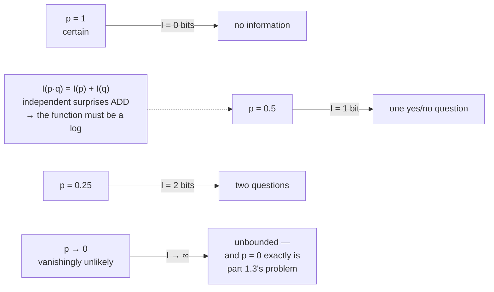

# 1.1 — Surprise, measured

## One-line answer

The surprise of an outcome is `−log(p)` — zero when it was certain, growing without bound as it becomes
unlikely — and it is the only measure that makes the surprise of two independent things **add** rather
than multiply, which is why every loss in this curriculum is built from it.

---

## The story

Two messages arrive on your phone.

The first one says: "the sun came up this morning." You do not even open it. There is nothing in it,
because you already knew.

The second one says: "the results are out, and you got through." You read that one four times, because
before it arrived there were several things that could have been true, and now there is one.

So what a message is worth has nothing to do with how long it is. The sunrise message could be a
hundred words and still be worth nothing at all. What you actually care about is **how much the
message cut down what was still possible**.

And here is the thing worth noticing. A message that cuts the possibilities in half is worth exactly
as much as a second message that cuts them in half again. So two halvings ought to cost twice as much
as one halving.

Worth that **adds up** while chances **multiply**. There is exactly one kind of function that does
that, and it is the logarithm.
---

## The idea in plain language

Start from what "informative" should mean, and derive the rest.

Suppose an outcome had probability `p` before you were told it happened. Define its **surprise** — its
*information content* — as some function `I(p)`. Three requirements, and they are enough:

1. **Certainty carries no information.** `I(1) = 0`. Being told what you already knew tells you
   nothing.
2. **Less likely is more informative.** `I` decreases as `p` increases.
3. **Independent surprises add.** If two unrelated things happen, with probabilities `p` and `q`, the
   joint outcome has probability `p·q` and should carry the sum of the two surprises:
   `I(p·q) = I(p) + I(q)`.

The third requirement is the one that does the work. A function turning multiplication into addition is
a logarithm, and requirement 2 fixes the sign:

> **`I(p) = −log(p)`**

That is the whole definition. Read it as: *how many halvings of the possibility space did this outcome
represent?*

The **base** of the logarithm is a choice of unit and nothing more:

- **Base 2** gives **bits**. `−log₂(1/2) = 1` bit: one yes/no question's worth.
- **Base e** gives **nats**. `−ln(1/2) = 0.693` nats.
- Converting is one multiplication: `nats = bits × ln(2)`, `bits = nats / ln(2)`.

Machine learning uses nats, everywhere, because `exp` and `log` are the natural functions for the
derivative work of Days 3 and 4 — `d/dx ln(x) = 1/x` with no stray constant. Information theory
traditionally uses bits, because they are interpretable. Part
[1.2](1.2-entropy-in-bits-and-nats.md) keeps both in play deliberately, and mixing them up silently
scales every number by `0.693`.

And then the quantity this leads to. A single outcome has a surprise; a whole *distribution* has an
**expected** surprise — the average over its outcomes, weighted by their own probabilities. That is
**entropy**, and it is part [1.2](1.2-entropy-in-bits-and-nats.md).

---

## Why Akshara needs it

- **Part [2.1](../02-cross-entropy/2.1-coding-with-the-wrong-distribution.md)** builds cross-entropy
  out of exactly this, and cross-entropy is the loss every model in this curriculum minimises from Day
  25 to Day 161.
- **Day 25's** "the loss went down" means "the model is less surprised by the data than it was", and
  that sentence is only meaningful once surprise has a definition.
- **Day 5 part [1.3](../../../day-005-logits-softmax-sampling/parts/01-logits-and-probabilities/1.3-softmax-the-map-to-the-simplex.md)**
  measured that a logit gap of `d` is a probability ratio of `e^d`. That is this document read
  backwards: **logits are unnormalised log-probabilities**, so they live in surprise units already.
- **Day 12's** BPE merges are chosen to reduce the corpus's description length, which is an information
  measure.
- **Day 17 (TOK-20)** chooses a vocabulary size, and the whole argument is an information trade: bigger
  vocabulary, fewer tokens, more bits per token.

---

## The mechanism

The surprise of a single outcome, in both units:

```python
import numpy as np

for p in (1.0, 0.5, 0.25, 0.1, 0.01, 0.001):
    print(f"  p={p:6.3f}  -log2(p) = {-np.log2(p):8.4f} bits   -ln(p) = {-np.log(p):8.4f} nats")
```

**Line by line:**
- `np.log2` is base 2 and `np.log` is base **e** — not base 10. That is a genuine trap in a language
  where `log` means base 10 on a calculator, and it is why every number in this curriculum that says
  "nats" comes from `np.log`.
- Measured on Intel Core i3-1115G4, CPython 3.12.10, numpy 2.5.2, 2026-08-26:

```text
  p= 1.000  -log2(p) =  -0.0000 bits   -ln(p) =  -0.0000 nats
  p= 0.500  -log2(p) =   1.0000 bits   -ln(p) =   0.6931 nats
  p= 0.250  -log2(p) =   2.0000 bits   -ln(p) =   1.3863 nats
  p= 0.100  -log2(p) =   3.3219 bits   -ln(p) =   2.3026 nats
  p= 0.010  -log2(p) =   6.6439 bits   -ln(p) =   4.6052 nats
  p= 0.001  -log2(p) =   9.9658 bits   -ln(p) =   6.9078 nats
```

Read three things off that table:

- **`p = 1` gives zero.** Requirement 1, satisfied. (It prints `-0.0000` rather than `0.0000` because
  `-log(1.0)` is `-0.0`, negative zero — which equals `0.0` and is worth recognising rather than being
  startled by.)
- **`p = 0.25` gives exactly 2 bits, and `p = 0.5` gives exactly 1.** Halving the probability adds
  exactly one bit, always. Requirement 3, visible.
- **The ratio between the two columns is constant**: `1.0/0.6931 = 3.3219/2.3026 = 1.4427`, which is
  `1/ln(2)`. The two columns are the same quantity in different units.

The additivity, which is the property the definition was built around:

```python
p, q = 0.25, 0.1
print("  I(p)      =", round(-np.log2(p), 6), "bits")
print("  I(q)      =", round(-np.log2(q), 6), "bits")
print("  I(p) + I(q)=", round(-np.log2(p) - np.log2(q), 6), "bits")
print("  I(p * q)  =", round(-np.log2(p * q), 6), "bits")
```

**Line by line:**
- `p * q` is the probability of both independent events happening.
- Measured on this machine, 2026-08-26: `I(p) = 2.0`, `I(q) = 3.321928094887362`, their sum
  `5.321928094887362`, and `I(p*q) = 5.321928094887363`. **They differ in the last bit**, and `==`
  prints `False` — which is Day 2 part
  [3.2](../../../day-002-tensors-shape-stride/parts/03-matmul/3.2-three-loops-then-one-call.md)
  arriving again: two correct routes to the same quantity round differently. The identity is exact in
  mathematics and approximate in `float64`, and comparing it with `np.isclose` rather than `==` is the
  only defensible test.
- That is the whole reason for the logarithm, and it is why the loss over a *sequence* of tokens is the
  **sum** of per-token losses rather than a product of probabilities. A product of ten thousand
  probabilities underflows to zero in any dtype; a sum of ten thousand surprises is a perfectly ordinary
  number. Day 5 part
  [1.5](../../../day-005-logits-softmax-sampling/parts/01-logits-and-probabilities/1.5-the-probabilities-that-summed-to-almost-one.md)
  is the neighbouring numerical argument.

The shape of the function:



The unit conversion, once, so it never has to be guessed:

```python
bits = 3.3219280948873626
nats = bits * np.log(2)
print("  bits -> nats:", nats)
print("  nats -> bits:", nats / np.log(2))
print("  ln(2)       :", np.log(2))
```

**Line by line:**
- Measured on this machine, 2026-08-26: `2.302585092994046` nats, back to `3.3219280948873626` bits,
  and `ln(2) = 0.6931471805599453`.
- **A loss reported in the wrong unit is out by a factor of 1.4427**, which is small enough to look like
  a real difference between two models and large enough to change a conclusion. Every number in this
  curriculum that is an information quantity states its unit.

---

## Shapes

| Tensor | Symbolic shape | Concrete here | What each axis means |
| --- | --- | --- | --- |
| `p` (one outcome) | `()` | scalar | the probability the outcome had *before* it happened |
| `-np.log(p)` | `()` | scalar | its surprise, in nats |
| a distribution | `(V,)` | `(4,)` | one probability per vocabulary entry (Day 5 part 1.1) |
| `-np.log(p)` on a distribution | `(V,)` | `(4,)` | the surprise of **each** outcome, elementwise |
| the per-token loss | `(B, T)` | `(4, 10)` | one surprise per position — part 2.2 builds it |

The fourth row is worth noting: applying `-log` to a distribution gives a surprise **per outcome**, not
one number. Collapsing it to one number is the next part's job, and *how* you collapse it is the whole
of part [2.4](../02-cross-entropy/2.4-the-mean-over-what.md).

---

## When it breaks

The loud one, and it is the subject of part [1.3](1.3-the-zero-probability-event.md):

```console
>>> import math
>>> math.log(0.0)
Traceback (most recent call last):
  File "<stdin>", line 1, in <module>
ValueError: math domain error
```

Verbatim on this machine, 2026-08-26. An outcome with probability exactly zero has **infinite**
surprise, and `math.log` refuses rather than returning an infinity. Note that numpy does not refuse — it
returns `-inf` with a warning — which is part 1.3's problem.

The quieter loud one — a probability above 1, which produces a *negative* surprise:

```console
>>> -np.log2(1.5)
np.float64(-0.5849625007211562)
```

No error. Negative surprise is meaningless — it would say the outcome told you *less than nothing* —
and its appearance means the input was not a probability. This is Day 5 part
[1.2](../../../day-005-logits-softmax-sampling/parts/01-logits-and-probabilities/1.2-logits-are-not-probabilities.md)'s
confusion arriving here: logits fed to a surprise calculation produce numbers that look like losses.

**The silent version, and it is the one that costs a paper: the wrong logarithm base.**

```console
>>> -np.log(0.1)
np.float64(2.302585092994046)
>>> -np.log2(0.1)
np.float64(3.321928094887362)
>>> -np.log10(0.1)
np.float64(1.0)
```

Three plausible numbers for the same outcome, differing by factors of 1.44 and 2.30. All three run.
None warns. A loss curve is equally smooth in any of them, and a number quoted without its unit cannot
be compared to anything — including to the same model measured last week by someone else.

The check is a naming and documentation discipline, plus one assertion where a probability arrives:

```python
def surprise_nats(p: np.ndarray) -> np.ndarray:
    """Information content in NATS. Use np.log2 for bits; do not mix them."""
    assert (p > 0).all(), f"zero or negative probability: min {p.min()}"
    assert (p <= 1).all(), f"probability above 1: max {p.max()} — are these logits?"
    return -np.log(p)
```

**Line by line:**
- **The unit is in the function's name**, not only in a comment. `surprise` and `surprise_bits` living
  side by side is how a codebase stops mixing them.
- `p > 0` rather than `p >= 0`, because zero is the failure part 1.3 is about and it must not slip
  through as `inf`.
- The upper assertion guesses the cause. `probability above 1: max 2.4 — are these logits?` is a fix,
  not a puzzle.
- Both assertions are cheap and belong at the boundary — where a distribution arrives from a model, a
  file or a library — not inside a training loop's inner iteration.

---

## In production

**What a research engineer writes instead of the teaching version.** They never compute `-log(p)` from
a probability at all. The framework's loss goes **directly from logits**, via a fused log-softmax, for
two reasons that Day 7 makes precise: it avoids forming a probability that might round to zero, and it
avoids a second pass over the largest tensor in the model. Part
[2.3](../02-cross-entropy/2.3-why-this-is-the-loss.md) shows the identity that makes it possible.

What they carry from this part is the *units* discipline and the *additivity* fact. When a loss is
reported, its unit is stated; when a sequence's total is needed, surprises are summed rather than
probabilities multiplied.

**What degrades at scale.** Nothing about the definition — but the additivity property becomes
load-bearing. The probability of a specific 1000-token sequence is a product of 1000 numbers each well
below 1; in `float64` that underflows to exactly zero long before the end (Day 2 part
[1.2](../../../day-002-tensors-shape-stride/parts/01-what-a-tensor-is/1.2-dtype-the-width-of-a-number.md)
gives the smallest normal value as `2.2e-308`, reached after roughly 700 tokens at `p = 0.36` each).
**The sequence probability is not representable and its surprise is an ordinary number around 1000
nats.** Every sequence-level computation in this curriculum works in log space for that reason.

**The failure that only shows with real data.** Rare tokens. Real text has a very long tail, and a token
the model has essentially never seen gets a probability near the smallest representable value — so its
surprise is enormous and a single such token can dominate an averaged loss. That is not a bug; it is
what the loss is supposed to say. It becomes a bug when someone clips or drops those terms to make the
curve look nicer, which removes exactly the signal that says the model has a hole in it.

**The review comment.** *"This logs a loss — in nats or bits? Put it in the name."*

**The interview question.** *"Why is information `−log(p)` and not, say, `1 − p`?"* The strong answer is
the derivation rather than the formula: certainty must carry zero information, less likely must carry
more, and **independent events must add** — and that third requirement forces a logarithm, because it
is the function that turns multiplication into addition. Adding the practical consequence — that this
is why sequence losses are sums rather than products, and why the product would underflow — is what
shows it has been used rather than memorised.

**Compute tier: T0.** Everything here is scalar arithmetic on a laptop CPU. The T0 version proves the
**definition, the additivity and the unit conversion** exactly; all three are mathematics and transfer
everywhere. What it does not show is the underflow argument at 1000 tokens, which is arithmetic on the
dtype's range rather than a measurement, and is worked in *In production* above.

---

## Check yourself

Run this. It prints **six surprises, one additivity check that must be exact, and one ratio that must
be `ln(2)`**:

```python
import numpy as np

for p in (1.0, 0.5, 0.25, 0.1, 0.01, 0.001):
    print(f"  p={p:6.3f}  {-np.log2(p):8.4f} bits   {-np.log(p):8.4f} nats")

p, q = 0.25, 0.1
print("I(p) + I(q) :", -np.log2(p) - np.log2(q))
print("I(p * q)    :", -np.log2(p * q))
print("equal       :", (-np.log2(p) - np.log2(q)) == (-np.log2(p * q)))
print("nats / bits :", (-np.log(0.1)) / (-np.log2(0.1)), " ln(2) =", np.log(2))
```

**Line by line:**
- The `p = 0.5` row prints exactly `1.0000` bits and the `p = 0.25` row exactly `2.0000`. **Halving the
  probability adds one bit** — say that out loud before reading on.
- The additivity check prints `5.321928094887362` and `5.321928094887363`, and `equal` prints
  **`False`**. They differ in the last bit. **That is not a failure of the identity** — it is Day 2 part
  [3.2](../../../day-002-tensors-shape-stride/parts/03-matmul/3.2-three-loops-then-one-call.md)'s
  lesson: two correct routes to one quantity round differently. Replace `==` with
  `np.isclose(..., rtol=1e-12)` and it passes.
- The last line prints `0.6931471805599453` twice. **The two columns are one quantity in two units.**
- Now try `-np.log(0.0)` and `-np.log(1.5)`. One is infinite and one is negative. Say what each means
  before reading part [1.3](1.3-the-zero-probability-event.md).

**Say this out loud, without scrolling up:** state the three requirements that force `I(p) = −log(p)` —
and say which of them is the reason a sequence's loss is a sum rather than a product.
