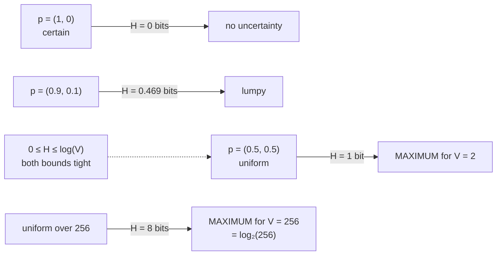

# 1.2 — Entropy: the average surprise of a distribution

## One-line answer

Entropy is the surprise you should *expect* from a distribution — each outcome's `−log(p)` weighted by
its own `p` — and it is bounded between zero for a certainty and `log(V)` for a uniform distribution,
measured here at exactly 8 bits for a uniform choice among 256.

---

## The story

Two people deliver post, and one of them has a much harder job than the other.

The first covers a small village. Nearly every letter goes to one of three streets, and the rest of
the addresses hardly ever come up. He barely has to read anything — most letters go into the same bag,
and being right is easy.

The second covers a city with two hundred and fifty-six areas, all equally busy. Every letter is a
fresh question with two hundred and fifty-six equally likely answers, and she has to read the whole
address every single time.

Both of them deliver letters. The second job is harder, and the difference is not how many letters
there are. It is that the village's letters are all bunched onto a few streets while the city's are
spread out evenly across everything.

To compare the two jobs, you need one number that says **how spread out the work is** — and that
number should come out as zero if every letter goes to the same street.
---

## The idea in plain language

Part [1.1](1.1-surprise-measured.md) gave the surprise of one outcome: `−log(p)`. A distribution has
many outcomes, each with its own surprise, so its summary is the **average** — weighted by how often
each outcome actually occurs, which is `p` itself:

> **`H(p) = − Σᵢ p[i] · log(p[i])`**

That is **entropy**. Read it in three pieces: for each outcome, take its surprise `−log(p[i])`, weight
it by how likely it is `p[i]`, and add them all up. It is an *expected value* — the surprise you should
budget for, per draw.

The bounds are the useful part, and both are tight:

- **Minimum: 0.** A distribution putting all its mass on one outcome has entropy exactly zero. There is
  nothing to be surprised by.
- **Maximum: `log(V)`.** A uniform distribution over `V` outcomes has entropy `log(V)` — 8 bits for
  256 outcomes, measured below — and nothing can exceed it. Spreading mass evenly is the most
  uncertain a distribution can be.

So entropy answers "how uncertain is this distribution", on a scale from 0 to `log(V)`, in whichever
unit part 1.1's logarithm base chooses. Day 5 part
[1.4](../../../day-005-logits-softmax-sampling/parts/01-logits-and-probabilities/1.4-temperature-is-a-scale-on-the-logits.md)
already used it as exactly that summary, sweeping from `0.000499` nats at `T = 0.1` to `1.386250` at
`T = 100` against a uniform ceiling of `ln(4) = 1.386294`.

One term more, because it is the number people actually quote: entropy is the **average number of
yes/no questions** needed to identify an outcome, if you ask the best possible questions. Eight bits for
256 equally likely outcomes means eight perfectly-chosen questions, which is what binary search over
256 items costs. That interpretation is exact for uniform distributions and a lower bound in general.

And the one caution: **`0 · log(0)` appears in the sum whenever an outcome has probability zero**, and
`log(0)` is `−inf`. The mathematical value of that term is 0 — the limit of `p log p` as `p → 0` — and
the floating-point value is `nan`. That gap is part [1.3](1.3-the-zero-probability-event.md), and it is
why the code below does not compute the sum naively.

---

## Why Akshara needs it

- **Part [2.1](../02-cross-entropy/2.1-coding-with-the-wrong-distribution.md)** defines cross-entropy as
  entropy's asymmetric cousin, and part
  [3.1](../03-kl-and-perplexity/3.1-kl-the-extra-bits.md) shows the exact identity linking the three.
  Entropy is the floor that cross-entropy cannot go below.
- **Day 5 part 1.4** used entropy to summarise what temperature does; this is where the number is
  defined.
- **Day 17 (TOK-20)** chooses a vocabulary size, and `log(V)` is the ceiling that argument runs into: a
  bigger vocabulary raises the maximum possible per-token uncertainty.
- **Day 34** studies attention distributions, whose entropy says whether a head is focused on one
  position or spread over all of them — a standard and genuinely informative diagnostic.
- **Day 69–77** reports the entropy of the model's output distribution during generation, which is the
  cheapest available signal that a model has become over-confident or has lost the plot.

---

## The mechanism

Entropy, computed safely from the start:

```python
import numpy as np


def entropy_bits(p: np.ndarray, axis: int = -1) -> np.ndarray:
    """Entropy in bits. Zero-probability outcomes contribute exactly zero."""
    safe = np.where(p > 0, p, 1.0)                  # 1.0 makes log(1) = 0; the mask discards it anyway
    terms = np.where(p > 0, p * np.log2(safe), 0.0)
    return -terms.sum(axis=axis)
```

**Line by line:**
- `safe = np.where(p > 0, p, 1.0)` replaces the zeros **before** the logarithm, with `1.0` rather than
  with anything else, because `log2(1.0)` is exactly `0.0` and cannot warn. Passing the zeros through
  to `np.log2` produces `-inf` and a `RuntimeWarning` — which, under this repository's
  `filterwarnings = ["error::RuntimeWarning"]` setting, is an exception.
- The second `np.where` discards those positions anyway. Both are needed: the first stops the warning,
  the second gets the value right. **This is the standard shape and it is worth writing once rather
  than rediscovering.**
- `p * np.log2(safe)` is **not** the same as `np.log2(safe ** p)`, which would overflow differently and
  is a real mistake people make when trying to be clever.
- `axis=-1` by default, matching the convention from Day 5 part
  [1.1](../../../day-005-logits-softmax-sampling/parts/01-logits-and-probabilities/1.1-a-distribution-over-a-vocabulary.md):
  a distribution lives on the last axis, so a `(B, T, V)` tensor gives a `(B, T)` of entropies.
- The `-` is outside the sum, which is one negation instead of `V` of them. Cosmetic here, not cosmetic
  at `V = 32,000`.

The bounds, checked on five distributions:

```python
for name, p in [("fair coin", np.array([0.5, 0.5])),
                ("biased coin", np.array([0.9, 0.1])),
                ("certain", np.array([1.0, 0.0])),
                ("uniform 4", np.full(4, 0.25)),
                ("uniform 256", np.full(256, 1 / 256))]:
    h = float(entropy_bits(p))
    print(f"  {name:12s} H = {h:.6f} bits = {h * np.log(2):.6f} nats   ceiling {np.log2(len(p)):.4f} bits")
```

**Line by line:**
- `h * np.log(2)` converts bits to nats, the conversion from part
  [1.1](1.1-surprise-measured.md).
- `np.log2(len(p))` is the ceiling `log₂(V)` for that distribution's support size.
- Measured on Intel Core i3-1115G4, CPython 3.12.10, numpy 2.5.2, 2026-08-26:

```text
  fair coin    H = 1.000000 bits = 0.693147 nats   ceiling 1.0000 bits
  biased coin  H = 0.468996 bits = 0.325083 nats   ceiling 1.0000 bits
  certain      H = -0.000000 bits = -0.000000 nats   ceiling 1.0000 bits
  uniform 4    H = 2.000000 bits = 1.386294 nats   ceiling 2.0000 bits
  uniform 256  H = 8.000000 bits = 5.545177 nats   ceiling 8.0000 bits
```

Four things to read off it:

**Every uniform row hits its ceiling exactly.** 1 bit for two outcomes, 2 for four, 8 for 256. That is
`log₂(V)`, and it is the maximum — nothing can beat a uniform distribution for uncertainty.

**The certain distribution gives `-0.000000`.** Negative zero, from `-(1.0 × 0.0)`. It **equals** `0.0`
and prints with a minus sign, which is a `float` formatting quirk rather than a value. Worth
recognising once so it never causes a moment's doubt.

**The biased coin sits at `0.469` bits against a ceiling of 1.** A 90/10 split carries less than half
the uncertainty of a fair coin, which is the village postman's round.

**And the certain row worked**, despite containing a zero probability. That is the `np.where` guard
earning its place; part [1.3](1.3-the-zero-probability-event.md) shows what the naive version does
instead.

The shape of the function, for two outcomes:



**And the connection to Day 5's temperature dial**, because it is the same number:

```python
def softmax(z, axis=-1):
    e = np.exp(z - z.max(axis=axis, keepdims=True))
    return e / e.sum(axis=axis, keepdims=True)


z = np.array([2.0, 1.0, 0.1, -0.5])                 # (V,) V = 4
for T in (0.1, 0.5, 1.0, 2.0, 100.0):
    p = softmax(z / T)
    print(f"  T={T:6.2f}  H = {float(entropy_bits(p)):.6f} bits   ceiling {np.log2(4):.4f}")
```

**Line by line:**
- Same logits and same temperatures as Day 5 part
  [1.4](../../../day-005-logits-softmax-sampling/parts/01-logits-and-probabilities/1.4-temperature-is-a-scale-on-the-logits.md),
  now measured in bits rather than nats.
- Measured on this machine, 2026-08-26: `0.000721`, `0.702053`, `1.450866`, `1.839941`, `1.999936`
  bits against a ceiling of `2.0`.
- **Temperature moves entropy from one end of its range to the other**, and at `T = 100` it has reached
  `1.999936` — within `6.4e-05` of the ceiling but *not* at it, because the logit gaps have been divided
  by 100 rather than erased. That is what "flattens the distribution" means, expressed as one number
  rather than as four.

---

## Shapes

| Tensor | Symbolic shape | Concrete here | What each axis means |
| --- | --- | --- | --- |
| `p` | `(V,)` | `(256,)` | one probability per outcome |
| `p * np.log2(safe)` | `(V,)` | `(256,)` | one weighted surprise per outcome |
| `entropy_bits(p)` | `()` | scalar | one number for the whole distribution |
| batched `p` | `(B, T, V)` | `(4, 10, 50)` | a distribution per position |
| `entropy_bits(p)` batched | `(B, T)` | `(4, 10)` | **one entropy per position** — the `axis=-1` reduction |
| the ceiling | `()` | `log₂(V)` | `8.0` bits at `V = 256` |

The `(B, T)` row is the useful one in practice: entropy per position is a per-token diagnostic, and
averaging it over the batch afterwards is a separate choice — part
[2.4](../02-cross-entropy/2.4-the-mean-over-what.md)'s subject.

---

## When it breaks

The loud one, which is the naive implementation under this repository's warning settings:

```console
>>> p = np.array([1.0, 0.0])
>>> -(p * np.log2(p)).sum()
RuntimeWarning: divide by zero encountered in log2
RuntimeWarning: invalid value encountered in multiply
np.float64(nan)
```

Verbatim on this machine, 2026-08-26. `log2(0)` is `-inf`, and `0.0 * -inf` is `nan` — not `0`. The
mathematics says that term is zero and the arithmetic says it is undefined, and the arithmetic wins.
That is part [1.3](1.3-the-zero-probability-event.md) in full.

The other loud one — the input is not a distribution:

```console
>>> entropy_bits(np.array([0.5, 0.3]))
np.float64(1.021089678249862)
```

**No error.** Entropy of something summing to `0.8` is a number, and it is meaningless. The formula
does not check its input, which is why the check below exists.

**The silent version, and it is the one that produces two incomparable papers: the wrong unit.**

```console
>>> entropy_bits(np.full(4, 0.25))
np.float64(2.0)
>>> -(np.full(4, 0.25) * np.log(np.full(4, 0.25))).sum()
np.float64(1.3862943611198906)
```

Same distribution, two correct answers, one in bits and one in nats, differing by a factor of
`1/ln(2) = 1.4427`. Both are smooth, both decrease when the model improves, and **a curve plotted in
one unit against a baseline reported in the other looks like a substantial difference.** This is
Silent Failure #4 (plan §6) arriving through a unit rather than through a seed.

The check, and it is two assertions plus a name:

```python
def entropy_bits(p: np.ndarray, axis: int = -1) -> np.ndarray:
    """Entropy in BITS. For nats, multiply by ln(2) — or use entropy_nats."""
    assert (p >= 0).all(), f"negative probability: {p.min()}"
    assert np.allclose(p.sum(axis=axis), 1.0, atol=1e-6), (
        f"not a distribution along axis {axis}: sums range "
        f"{p.sum(axis=axis).min():.6f}..{p.sum(axis=axis).max():.6f}"
    )
    safe = np.where(p > 0, p, 1.0)
    return -np.where(p > 0, p * np.log2(safe), 0.0).sum(axis=axis)
```

**Line by line:**
- **The unit is in the function's name**, as part [1.1](1.1-surprise-measured.md) argued. `entropy_bits`
  and `entropy_nats` as two functions is better than one function with a `base` argument that somebody
  will default wrongly.
- `atol=1e-6` rather than exact equality, because Day 5 part
  [1.5](../../../day-005-logits-softmax-sampling/parts/01-logits-and-probabilities/1.5-the-probabilities-that-summed-to-almost-one.md)
  measured 1190 of 2000 softmax outputs failing an exact test.
- The message prints the **range** of the sums, so on a batched input it says whether one distribution
  is broken or all of them.
- `p >= 0` and not `p > 0`: zeros are legal in a distribution and are handled by the `where`. It is
  *negatives* that are impossible.

---

## In production

**What a research engineer writes instead of the teaching version.** They rarely compute entropy of a
probability tensor at all during training, for the same reason they do not compute the loss from
probabilities: it means materialising the `(B, T, V)` softmax. Where entropy is wanted as a diagnostic —
and it often is, per attention head or per output position — it is computed from **log-probabilities**,
which the model already has: `H = −Σ p·log p = −Σ exp(logp)·logp`, with no `log` of a possibly-zero
number anywhere.

The unit convention is settled once per codebase and enforced by naming. Nats for losses (they are what
the framework returns), bits for anything reported to a human (they are interpretable). Converting at
the reporting boundary rather than throughout is what stops the two from mixing.

**What degrades at scale.** The ceiling rises. `log₂(32000) = 14.97` bits, so a model over a large
vocabulary starts from a much higher maximum uncertainty than one over a small vocabulary — which is
exactly why entropy and perplexity numbers cannot be compared across tokenizers, and part
[3.3](../03-kl-and-perplexity/3.3-the-perplexity-that-improved.md) measures that trap.

**The failure that only shows with real data.** Entropy collapse. As a model trains, its output
distributions sharpen, and a well-trained model's per-token entropy can fall very low — at which point
the gradient through the softmax nearly vanishes (Day 4 part
[2.5](../../../day-004-backprop-and-gradcheck/parts/02-gradient-checking/2.5-the-gradcheck-that-passed.md)
measured the same effect in `tanh`) and learning slows for reasons that look like a learning-rate
problem. Logging mean output entropy per step costs one reduction and is the standard early warning.

**The review comment.** *"This logs `entropy` — bits or nats? Rename it, and say which the dashboard
expects."*

**The interview question.** *"What is the entropy of a uniform distribution over a 32,000-token
vocabulary, and what does it mean?"* The strong answer computes it — `log₂(32000) ≈ 14.97` bits, or
`ln(32000) ≈ 10.37` nats — and then says what it is *for*: it is the maximum, the loss of a model that
has learned nothing, and therefore the number a training curve should be compared against on step zero.
A model whose initial loss is far from `ln(V)` has a bug in its initialisation or its loss, and that
check costs nothing.

**Compute tier: T0.** Everything here is arrays of at most 256 elements on a laptop CPU. The T0 version
proves the **definition, both bounds and the unit conversion** exactly — all three are mathematics and
transfer everywhere. What it does not show is the cost of computing entropy over a real `(B, T, V)`
tensor, which is one reduction over the largest axis and is why the *In production* note prefers the
log-probability form.

---

## Check yourself

Run this. It prints **five entropies; three must equal their ceilings exactly and one must be zero**:

```python
import numpy as np


def entropy_bits(p, axis=-1):
    safe = np.where(p > 0, p, 1.0)
    return -np.where(p > 0, p * np.log2(safe), 0.0).sum(axis=axis)


for name, p in [("fair coin", np.array([0.5, 0.5])),
                ("biased coin", np.array([0.9, 0.1])),
                ("certain", np.array([1.0, 0.0])),
                ("uniform 4", np.full(4, 0.25)),
                ("uniform 256", np.full(256, 1 / 256))]:
    h = float(entropy_bits(p))
    print(f"  {name:12s} {h:9.6f} bits  {h * np.log(2):9.6f} nats  ceiling {np.log2(len(p)):.4f}")

print("  ln(V) for V = 32000:", np.log(32000), "nats =", np.log2(32000), "bits")
```

**Line by line:**
- The three uniform rows print `1.000000`, `2.000000` and `8.000000` bits — **exactly their ceilings.**
- The `certain` row prints `-0.000000`. Negative zero; it equals zero.
- The last line prints `10.373491181781864` nats and `14.965784284662087` bits. **Write the nats
  figure down** — it is the loss a freshly-initialised model over a 32,000-token vocabulary should start
  at, and Day 25 checks against it.
- Now replace the `np.where` guards with a plain `-(p * np.log2(p)).sum()` and re-run. Predict which
  row breaks before you look.

**Say this out loud, without scrolling up:** define entropy in one sentence using the word *expected* —
and state both bounds, saying which distribution achieves each.
