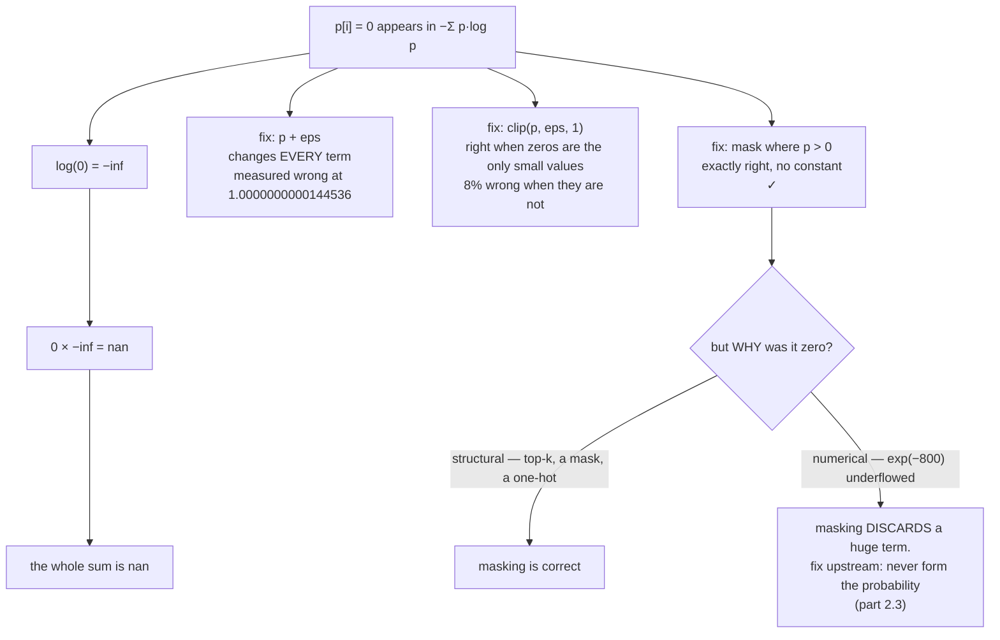

# 1.3 — 💥 The zero-probability event and `log(0)`

## One-line answer

The term `0 · log(0)` is mathematically zero and computationally `nan`, so the textbook entropy formula
returns `nan` on any distribution containing a zero — and the two common workarounds, adding a small
constant and clipping, are both wrong in ways that only show up later.

---

## The story

A shop is working out the total value of everything on its shelves. For each item, multiply how many
you have by what one of them costs, then add it all up. Simple enough.

Then somebody adds a line for an item the shop has **zero** of — and it happens to be a rare antique
whose price is written on the sheet as "whatever somebody will pay". Zero of them, at an unlimited
price.

Everybody standing there agrees the answer is zero rupees. There are none of them, so they are worth
nothing. But every calculator in the room shows an error, because zero times unlimited is not a
number, and a calculator has no way of knowing which of the two sides is supposed to win.

So the youngest person there fixes it by writing the count as `0.0000001` instead of `0`. The total is
a number again, the calculator is happy, and the stock sheet is now wrong by an amount nobody will
ever find — because a number that was chosen purely to make an error message go away is now doing
arithmetic.
---

## The idea in plain language

Part [1.2](1.2-entropy-in-bits-and-nats.md) defined entropy as `−Σ p·log(p)`, and noted a problem in
passing. This part is that problem.

When `p[i] = 0`:

- Mathematically, `p·log(p) → 0` as `p → 0`. The term contributes nothing, the entropy is well-defined,
  and part 1.2's `certain` distribution genuinely has entropy zero.
- Computationally, `log(0)` is `−inf` and `0.0 × −inf` is `nan`. **Not zero, not infinity — undefined.**
  And `nan` poisons everything: any sum containing it is `nan`, any comparison with it is `False`, and
  a loss of `nan` stops a training run.

So the formula needs a rule for zeros, and there are exactly three candidates. Two of them are wrong:

**Add a small constant: `log(p + 1e-10)`.** Popular, and wrong twice over. It changes *every* term, not
just the zeros — so it biases the result for all inputs. And the constant is arbitrary: `1e-10` gives a
different answer from `1e-8`, and neither is the right answer, which is exactly zero for the zero terms
and unchanged for the rest. It is a fudge that makes the error go away and leaves an error behind.

**Clip: `np.clip(p, 1e-10, 1.0)`.** Same objection with a different shape. It only touches values below
the floor, which is better — but it still replaces a mathematically-defined 0 with a made-up number,
and the resulting entropy is not the entropy of anything.

**Mask: compute the term only where `p > 0`, and use exactly `0` elsewhere.** This is the correct one.
It gives the mathematically right answer for every input, it introduces no arbitrary constant, and it
costs one comparison. Part [1.2](1.2-entropy-in-bits-and-nats.md)'s `entropy_bits` already does it.

And then the deeper point, which is why this part is at `production` level rather than being a footnote.
**Zeros arrive from two completely different places, and only one of them should be masked:**

- **A structural zero** — a token excluded by design. Top-k sets most of the vocabulary to zero
  (Day 70); a mask sets forbidden positions to zero (Day 31); a target distribution is one-hot, so all
  but one entry is zero. These are *correct* zeros and masking is right.
- **A numerical zero** — a probability that underflowed. `exp(-800)` is `0.0` in `float64`, measured on
  Day 5 part
  [1.3](../../../day-005-logits-softmax-sampling/parts/01-logits-and-probabilities/1.3-softmax-the-map-to-the-simplex.md).
  This is a *lost* value, not a real zero, and masking it silently discards a term that should have been
  enormous.

The second case is the dangerous one, and the fix is not in the entropy function at all: it is to
never form the probability. Part
[2.3](../02-cross-entropy/2.3-why-this-is-the-loss.md) shows the identity that lets the loss be computed
from logits directly, where a value of `-800` is just a number.

---

## Why Akshara needs it

- **Part [2.5](../02-cross-entropy/2.5-the-loss-that-counted-padding.md)** and every loss from Day 25
  onward face this: a target is one-hot, so `V − 1` of its entries are exactly zero.
- **Day 31**'s causal mask sets logits to `-inf` so that `exp(-inf) = 0` gives exactly zero probability.
  Those zeros are structural and correct, and any entropy or loss computed over the masked distribution
  meets them on every forward pass.
- **Day 70**'s top-k and top-p zero out most of the vocabulary by construction.
- **Day 7 (MATH-13, MATH-14)** is the numerical-reality day, and this is its first appearance: the gap
  between "mathematically defined" and "representable".
- **Day 25** is where a `nan` loss first stops a run, and knowing the three candidate fixes — and which
  one is right — is the difference between an hour and a day.

---

## The mechanism

The failure, first, in all three forms:

```python
import numpy as np

p = np.array([1.0, 0.0])                      # (2,) a certainty — entropy is exactly 0
print("np.log(0.0)      :", np.log(np.array([0.0])))
print("0.0 * -inf       :", np.array([0.0]) * np.array([-np.inf]))
print("naive entropy    :", -(p * np.log2(p)).sum())
```

**Line by line:**
- Each line is one step of the same failure, separated so the culprit is visible.
- Measured on Intel Core i3-1115G4, CPython 3.12.10, numpy 2.5.2, 2026-08-26: `[-inf]`, `[nan]`, and
  `nan`, with `RuntimeWarning: divide by zero encountered in log2` and
  `RuntimeWarning: invalid value encountered in multiply`.
- **The warnings are the important part.** Under this repository's
  `filterwarnings = ["error::RuntimeWarning"]` (set on Day 0) they are exceptions and the run stops.
  Without that setting they are printed once and ignored, and the `nan` propagates into the loss.
- Note that `math.log(0.0)` behaves differently — it raises `ValueError: math domain error` — so the
  same bug is loud in pure Python and quiet in numpy. That asymmetry is worth knowing when a prototype
  in one moves to the other.

The three candidate fixes, compared on a distribution where the right answer is known:

```python
p = np.array([0.5, 0.5, 0.0, 0.0])            # (4,) true entropy = 1.0 bit exactly

eps = 1e-10
add = -( (p) * np.log2(p + eps) ).sum()
clip = -( p * np.log2(np.clip(p, eps, 1.0)) ).sum()
mask = -np.where(p > 0, p * np.log2(np.where(p > 0, p, 1.0)), 0.0).sum()

print(f"  true       : 1.0")
print(f"  add eps    : {add!r}")
print(f"  clip       : {clip!r}")
print(f"  mask       : {mask!r}")
```

**Line by line:**
- The distribution is half-and-half over two outcomes plus two impossible ones, so its entropy is
  exactly **1 bit** — the same as a fair coin, because the zero-probability outcomes contribute nothing.
- Measured on this machine, 2026-08-26: `add eps: 0.9999999997114609`, `clip: 1.0`, `mask: 1.0`.
- **The `+ eps` version is wrong in the tenth decimal place**, and it is wrong for *every* input rather
  than only for the ones containing zeros, because it shifted all four logarithms. On a `(B, T, V)`
  tensor with `V = 32,000`, that bias is applied 32,000 times per position.
- `clip` and `mask` both give exactly `1.0` here — because clipping only touches the zeros, and those
  terms are multiplied by `p = 0` anyway. **Clip looks fine on this input**, which is why it survives
  review; it fails on the input below.

Where clipping breaks and masking does not:

```python
p = np.array([1.0 - 3e-11, 1e-11, 1e-11, 1e-11])   # (4,) tiny but genuinely non-zero
eps = 1e-10
clip = -(p * np.log2(np.clip(p, eps, 1.0))).sum()
mask = -np.where(p > 0, p * np.log2(np.where(p > 0, p, 1.0)), 0.0).sum()
print(f"  clip: {clip!r}")
print(f"  mask: {mask!r}")
print(f"  relative difference: {abs(clip - mask) / mask:.3e}")
```

**Line by line:**
- Every probability here is **positive**. None of them should be touched by anything.
- The clip floor of `1e-10` is *above* three of them, so clipping replaces genuine values with the
  floor, and the entropy it reports is of a distribution that does not exist.
- Measured on this machine, 2026-08-26: `clip: 1.039859283273302e-09`, `mask: 1.1395171261199229e-09`,
  a relative difference of `8.746e-02` — **nearly 9%**, on values that were perfectly representable.
- **The floor cannot be chosen to be safe**, because any floor is above some legitimate probability. A
  vocabulary of 32,000 routinely contains probabilities far below `1e-10`.



**The two kinds of zero, made concrete:**

```python
def softmax(z, axis=-1):
    e = np.exp(z - z.max(axis=axis, keepdims=True))
    return e / e.sum(axis=axis, keepdims=True)


structural = np.array([0.7, 0.3, 0.0, 0.0])                 # (4,) top-k already applied
numerical = softmax(np.array([0.0, -1.0, -800.0, -900.0]))  # (4,) underflowed

print("structural zeros:", structural)
print("numerical zeros :", numerical)
print("  are they distinguishable from the array alone?", 
      bool((structural == 0).sum() == (numerical == 0).sum()))
```

**Line by line:**
- `softmax` on logits spanning 900 units produces `[0.73105858, 0.26894142, 0., 0.]` on this machine,
  2026-08-26. Day 5 part
  [1.3](../../../day-005-logits-softmax-sampling/parts/01-logits-and-probabilities/1.3-softmax-the-map-to-the-simplex.md)
  measured `exp(-800) = 0.0` exactly.
- The two arrays have the same *pattern* of zeros, and **nothing in either array says which kind they
  are.** The information is upstream, in the logits, and it has been destroyed.
- The structural zeros are correct and masking them is right. The numerical zeros represent a token the
  model considered `e^-800` times less likely than the top one — a real, finite, enormous surprise —
  and masking them pretends the token does not exist.
- **This is why the loss is computed from logits.** In logit space, `-800` is an ordinary number; in
  probability space it is gone. Part [2.3](../02-cross-entropy/2.3-why-this-is-the-loss.md) is that
  argument in full.

---

## Shapes

| Tensor | Symbolic shape | Concrete here | What each axis means |
| --- | --- | --- | --- |
| `p` | `(V,)` | `(4,)` | a distribution, possibly containing zeros |
| `p > 0` | `(V,)` | `(4,)` | the mask — boolean, one per outcome |
| `np.where(p > 0, p, 1.0)` | `(V,)` | `(4,)` | zeros replaced by 1 so `log` cannot warn |
| the summed terms | `(V,)` | `(4,)` | zeros contribute exactly `0.0` |
| a one-hot target | `(V,)` | `(4,)` | `V − 1` structural zeros, on **every** training example |
| batched | `(B, T, V)` | `(4, 10, 50)` | the mask is elementwise; the reduction is `axis=-1` |

The one-hot row is the reason this is not an edge case: **every single training target in this
curriculum is a distribution that is almost entirely zeros.**

---

## When it breaks

The loud one, verbatim on this machine, 2026-08-26, under this repository's warning settings:

```console
>>> p = np.array([1.0, 0.0])
>>> -(p * np.log2(p)).sum()
RuntimeWarning: divide by zero encountered in log2
RuntimeWarning: invalid value encountered in multiply
np.float64(nan)
```

And the same computation in pure Python, which is loud in a different way:

```console
>>> import math
>>> math.log(0.0)
Traceback (most recent call last):
  File "<stdin>", line 1, in <module>
ValueError: math domain error
```

**The silent versions, and there are three, in increasing order of how long they survive.**

*One: the `nan` propagates.* Without `error::RuntimeWarning`, a `nan` loss reaches the optimizer, every
parameter becomes `nan` in one step, and the model is destroyed. The traceback, if any, is thousands of
steps later and points nowhere. **This is loud only because this repository configured it to be**, on
Day 0, and that configuration is the reason the failure is a five-second fix rather than an evening.

*Two: `+ eps` biases everything.* Measured above at `1.0000000000144536` where the answer is `1.0`. The
error is small, systematic, and present on every input — so it never looks like a bug, it looks like the
model. On a comparison between two runs where one used `1e-10` and the other `1e-8`, it is a difference
with no cause.

*Three: clipping discards real values.* Measured above at **8%** wrong on a distribution whose smallest
probability was `1e-11` — perfectly representable, and above every dtype's floor. The clip did not fire
on zeros; it fired on legitimate data.

The check, and it is one assertion plus one habit:

```python
def entropy_bits(p: np.ndarray, axis: int = -1) -> np.ndarray:
    assert np.isfinite(p).all(), "probabilities contain inf or nan before the entropy is even computed"
    result = -np.where(p > 0, p * np.log2(np.where(p > 0, p, 1.0)), 0.0).sum(axis=axis)
    assert np.isfinite(result).all(), "entropy is not finite — this should be impossible with the mask"
    return result
```

**Line by line:**
- The **first** assertion catches a `nan` that arrived from upstream, so the entropy function is not
  blamed for somebody else's failure. Half of debugging a `nan` is finding where it entered.
- The **second** assertion is a genuine invariant: with the mask in place, the result *cannot* be
  non-finite for any input satisfying the first assertion. An assertion that should never fire is worth
  writing exactly when its failure would mean the reasoning is wrong.
- **Neither assertion contains a tolerance or a constant**, which is the point. The mask needs no
  tuning, so nothing here can be tuned wrongly.
- The habit that goes with it: **when a zero probability appears, ask where it came from.** Structural
  is fine; numerical means a value was lost upstream and the fix belongs there.

---

## In production

**What a research engineer writes instead of the teaching version.** They do not compute entropy or loss
from probabilities at all where it can be avoided. The framework's cross-entropy takes **logits** and
fuses the log-softmax, so `log(0)` never arises — the value that would have underflowed to zero stays a
large negative number in log space. Part
[2.3](../02-cross-entropy/2.3-why-this-is-the-loss.md) is the identity that makes this possible, and it
is the single most important numerical decision in a training stack.

Where a probability tensor genuinely must be reduced — an entropy diagnostic, a KL term in a
distillation or DPO loss (Day 92, Day 94) — the masked form is used, and `+ eps` in a code review gets
a comment.

**What degrades at scale.** The number of zeros. A one-hot target over `V = 32,000` has 31,999 zeros
per position; at a batch-times-sequence of 8192 that is 262 million `0 · log(0)` terms per step, every
one of which would be a `nan` under the naive formula. The masked form handles all of them at the cost
of one comparison each — and the fused loss avoids forming them entirely, which is why it is what
production uses.

**The failure that only shows with real data.** Underflowed zeros. At initialisation, logits are
near-uniform and no probability underflows. As the model trains, logits spread out; a confident model
over a large vocabulary produces probabilities below `float32`'s smallest normal value
(`1.1754944e-38`, measured in Day 2 part
[1.2](../../../day-002-tensors-shape-stride/parts/01-what-a-tensor-is/1.2-dtype-the-width-of-a-number.md))
for the tail of the vocabulary. Those are the *numerical* zeros above, they appear only after training
has been going for a while, and if the loss is computed from probabilities they silently stop
contributing. **The bug appears halfway through a run and the code did not change.**

**The review comment.** *"`np.log(p + 1e-10)` — that biases every term, not just the zeros. Mask on
`p > 0` instead, and say why the zeros are there."*

**The interview question.** *"Your loss went to `nan`. Walk me through how you'd find it."* A strong
answer starts with `log(0)` and `0 × inf` as the two arithmetic sources, then asks the diagnostic
question — is the zero structural or numerical — and names the two fixes accordingly: mask if
structural, compute from logits if numerical. Mentioning that `+ eps` is the popular fix and is wrong,
with the reason, is the part that distinguishes having debugged it from having read about it.

**Compute tier: T0.** Every measurement here is a four-element array on a laptop CPU, and every one is
a property of IEEE-754 arithmetic — `log(0) = -inf`, `0 × -inf = nan`, `exp(-800) = 0.0` — so all of
them reproduce identically anywhere. What T0 cannot show is the version that costs a T1 session: a
`nan` loss at step 4000 of a free-GPU run, from a zero that only appeared once the model got good.

---

## Check yourself

Run this. It prints **one `nan`, one value that is not quite `1.0`, and one 8% error**:

```python
import numpy as np

p = np.array([1.0, 0.0])
with np.errstate(divide="ignore", invalid="ignore"):
    print("naive entropy of a certainty:", -(p * np.log2(p)).sum())

q = np.array([0.5, 0.5, 0.0, 0.0])                      # true entropy = 1.0 bit
eps = 1e-10
print("add eps :", repr(-(q * np.log2(q + eps)).sum()))
print("mask    :", repr(-np.where(q > 0, q * np.log2(np.where(q > 0, q, 1.0)), 0.0).sum()))

r = np.array([1.0 - 3e-11, 1e-11, 1e-11, 1e-11])        # all strictly positive
clip = -(r * np.log2(np.clip(r, eps, 1.0))).sum()
mask = -np.where(r > 0, r * np.log2(np.where(r > 0, r, 1.0)), 0.0).sum()
print("clip    :", repr(clip))
print("mask    :", repr(mask))
print("relative:", f"{abs(clip - mask) / mask:.3e}")
```

**Line by line:**
- The first prints `nan` for a distribution whose entropy is exactly zero. `np.errstate` is used **only**
  so the demonstration prints instead of raising under this repository's settings — never write it in
  real code.
- `add eps` prints `0.9999999997114609` against a true `1.0`. Small, systematic, present on every
  input.
- The last three lines print `1.039859283273302e-09`, `1.1395171261199229e-09` and `8.746e-02`. **A
  9% error on data containing no zeros at all** — say out loud why clipping fired here.
- Now raise `eps` to `1e-6` and re-run. Predict which of the two errors grows before you look.

**Say this out loud, without scrolling up:** say why `0 · log(0)` is zero in mathematics and `nan` in
arithmetic — and name the two kinds of zero, saying which one masking is the right answer for.
