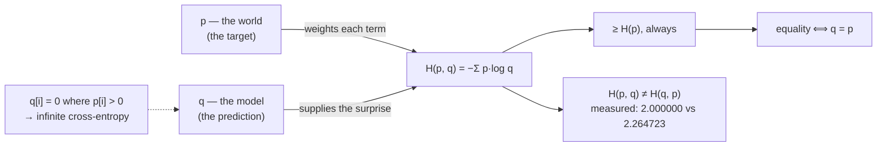

# 2.1 — Cross-entropy: the cost of coding with the wrong distribution

## One-line answer

Cross-entropy is the average surprise you actually experience when the world follows `p` and your
beliefs are `q` — `−Σ p·log(q)` — and it is always at least the entropy of `p`, with the gap being
exactly how wrong your beliefs were.

---

## The story

You set up text shortcuts on your phone. Type `brb` and it expands to "be right back". Type `omw` and
you get "on my way". You chose those shortcuts by looking at what you actually type most often, so
they save you a great deal of tapping.

Then you hand that phone, with exactly those shortcuts, to somebody whose life is nothing like yours.
They never say "on my way" in their life. They type the name of the company they work for forty times
a day, and there is no shortcut for it at all.

Nothing breaks. Every message they send comes out correctly. Nothing is lost or garbled. It is simply
that every day, they tap **more** than they needed to — by an amount nobody can name without sitting
down and counting.

Their own best set of shortcuts would cost them some number of taps per message. Your set costs them
more. That extra is not a bug in the shortcuts. It is the price of holding a belief about what
somebody types that does not match what they actually type.
---

## The idea in plain language

Part [1.2](../01-entropy/1.2-entropy-in-bits-and-nats.md) defined entropy as the average surprise of a
distribution, using its own probabilities for both the surprise and the weighting:

> `H(p) = − Σᵢ p[i] · log(p[i])`

Now separate the two roles. Suppose:

- The world genuinely follows `p` — that is how often each outcome actually occurs.
- Your model believes `q` — that is what you expected.

Your **experienced** surprise on any outcome is `−log(q[i])`, because that is what *you* thought its
probability was. But outcome `i` occurs with frequency `p[i]`, because that is the world. So the
average surprise you actually feel is:

> **`H(p, q) = − Σᵢ p[i] · log(q[i])`**

That is **cross-entropy**. The weighting comes from reality; the surprise comes from your beliefs. Note
the asymmetry: `H(p, q)` and `H(q, p)` are different quantities, and only one of them is the loss.

Two facts make it the right thing to minimise:

**It is never below `H(p)`.** Whatever `q` you choose, `H(p, q) ≥ H(p)`, with equality **only** when
`q = p`. So cross-entropy has a floor, the floor is the entropy of the data, and getting there requires
believing exactly the truth. Part [3.1](../03-kl-and-perplexity/3.1-kl-the-extra-bits.md) names the gap
and measures it.

**Minimising it is fitting `q` to `p`.** Since the floor is fixed by `p` and reached only at `q = p`,
driving cross-entropy down *is* driving your model's beliefs towards the world's behaviour. That is the
entire justification for the loss, and it is one line.

One caution carried from part [1.3](../01-entropy/1.3-the-zero-probability-event.md): the sum contains
`log(q[i])`, so **a zero in `q` is fatal** wherever `p[i] > 0`. If your model assigns zero probability to
something that actually happens, your cross-entropy is infinite — correctly, because you would need
infinitely many characters to encode an outcome your codebook has no entry for. Zeros in `p` are
harmless (their terms vanish); zeros in `q` are not. That asymmetry is why a softmax is used: it can
never output an exact zero in exact arithmetic.

---

## Why Akshara needs it

- **Every model in this curriculum, from Day 25 to Day 161, minimises this.** Part
  [2.3](2.3-why-this-is-the-loss.md) is the argument for why this and not something else.
- **Part [2.2](2.2-nll-is-cross-entropy-with-a-one-hot.md)** shows that with a one-hot target the whole
  sum collapses to one term, which is why the implementation looks nothing like the formula.
- **Part [3.1](../03-kl-and-perplexity/3.1-kl-the-extra-bits.md)** splits it into entropy plus KL, which
  is the identity that says what a loss curve's floor is.
- **Day 92**'s distillation trains a student against a *teacher's full distribution* rather than a
  one-hot — cross-entropy in its general form, with `p` a real distribution rather than a single token.
- **Day 94**'s DPO and every preference method compare log-probabilities between models, which is this
  quantity with both arguments being model outputs.

---

## The mechanism

The definition, on the two sets of phone shortcuts:

```python
import numpy as np

p = np.array([0.5, 0.25, 0.15, 0.10])       # (V,) what the world actually does
q = np.array([0.25, 0.25, 0.25, 0.25])      # (V,) what our model believes: uniform


def entropy_bits(x, axis=-1):
    safe = np.where(x > 0, x, 1.0)
    return -np.where(x > 0, x * np.log2(safe), 0.0).sum(axis=axis)


def cross_entropy_bits(p, q, axis=-1):
    """Average surprise when the world is p and beliefs are q. Requires q > 0 wherever p > 0."""
    assert (q[p > 0] > 0).all(), "q assigns zero probability to an outcome that occurs"
    return -np.where(p > 0, p * np.log2(np.where(p > 0, q, 1.0)), 0.0).sum(axis=axis)


print(f"  H(p)     = {float(entropy_bits(p)):.6f} bits   <- the floor")
print(f"  H(p, q)  = {float(cross_entropy_bits(p, q)):.6f} bits   <- what we actually pay")
print(f"  H(p, p)  = {float(cross_entropy_bits(p, p)):.6f} bits   <- equals H(p)")
```

**Line by line:**
- `cross_entropy_bits` takes the log of **`q`** and weights by **`p`**. Getting those two the wrong way
  round computes `H(q, p)`, a different and also-finite number — which is the silent failure below.
- The assertion checks `q > 0` only **where `p > 0`**. A zero in `q` at an outcome that never occurs is
  harmless; a zero where the outcome does occur makes the cross-entropy infinite, and saying so
  explicitly is better than returning `inf`.
- The `np.where` masking is part
  [1.3](../01-entropy/1.3-the-zero-probability-event.md)'s pattern, applied to the `p = 0` terms. Note
  it masks on `p`, not on `q`: it is `p[i] = 0` that makes a term vanish.
- Measured on Intel Core i3-1115G4, CPython 3.12.10, numpy 2.5.2, 2026-08-26:

```text
  H(p)     = 1.742738 bits   <- the floor
  H(p, q)  = 2.000000 bits   <- what we actually pay
  H(p, p)  = 1.742738 bits   <- equals H(p)
```

Three things to read:

**`H(p, q)` is exactly 2.000000.** That is not a coincidence: `q` is uniform over four outcomes, so
every `−log₂(q[i])` is exactly 2 bits, and a weighted average of a constant is that constant. **A
uniform belief costs `log₂(V)` bits per symbol regardless of the data**, which is why a
freshly-initialised model's loss should be `ln(V)` nats — the check Day 25 runs at step zero.

**`H(p, p)` equals `H(p)` to every digit.** The floor is reached exactly when the beliefs are right.

**The excess is `2.000000 − 1.742738 = 0.257262` bits per symbol.** That is the price of running your
shortcuts on somebody else's phone, and part
[3.1](../03-kl-and-perplexity/3.1-kl-the-extra-bits.md) gives it a name.

Now the asymmetry, which is the thing to be careful about:

```python
print(f"  H(p, q) = {float(cross_entropy_bits(p, q)):.6f} bits")
print(f"  H(q, p) = {float(cross_entropy_bits(q, p)):.6f} bits")
print(f"  equal?  = {np.isclose(cross_entropy_bits(p, q), cross_entropy_bits(q, p))}")
```

**Line by line:**
- Measured on this machine, 2026-08-26: `H(p, q) = 2.000000` and `H(q, p) = 2.264723`. **Different
  numbers, both finite, both plausible** — and note that the second is *larger* here, which is not a
  general rule: which way round the inequality goes depends on the pair.
- Swapping the arguments does not raise, does not warn, and gives an answer of the right order of
  magnitude. This is the whole hazard: **the wrong one still trains**, just towards a different
  objective.
- The one to remember: **the target goes first, the model's prediction goes second.** `H(target,
  prediction)`. It is the target that weights and the prediction that is logged.



**And the infinite case, because it is the one that stops a run:**

```python
q_bad = np.array([0.5, 0.5, 0.0, 0.0])       # (V,) model rules out outcomes 2 and 3
try:
    cross_entropy_bits(p, q_bad)
except AssertionError as exc:
    print("  assertion:", exc)

with np.errstate(divide="ignore", invalid="ignore"):
    naive = -(p * np.log2(q_bad)).sum()
print("  without the assertion:", naive)
```

**Line by line:**
- `q_bad` assigns zero to outcomes that occur with probability `0.15` and `0.10` under `p`.
- The assertion fires with `q assigns zero probability to an outcome that occurs`.
- Without it, the naive computation gives `inf` on this machine, 2026-08-26 — the mathematically
  **correct** answer. An event you declared impossible has occurred, and no codebook can encode it.
- `np.errstate` is used only so the demonstration prints under this repository's
  `error::RuntimeWarning` setting. **Never write it in real code**; it is what turns a caught overflow
  into a silent `nan`.
- This is why a model's output goes through a softmax: in exact arithmetic it can never be zero, so this
  case cannot arise from a well-formed model. It arises from *masking done wrong* — zeroing a
  probability rather than setting a logit to `-inf` — which Day 31 is careful about.

---

## Shapes

| Tensor | Symbolic shape | Concrete here | What each axis means |
| --- | --- | --- | --- |
| `p` | `(V,)` | `(4,)` | the target distribution — weights the sum |
| `q` | `(V,)` | `(4,)` | the model's distribution — supplies the `log` |
| `p * log(q)` | `(V,)` | `(4,)` | one term per outcome |
| `H(p, q)` | `()` | `2.000000` bits | one number for the pair |
| batched | `(B, T, V)` for both | `(4, 10, 50)` | one `(p, q)` pair per position |
| `H(p, q)` batched | `(B, T)` | `(4, 10)` | **one loss per position**; how to combine them is part 2.4 |

The last row is the point at which the loss stops being a formula and becomes a design decision, which
is part [2.4](2.4-the-mean-over-what.md).

---

## When it breaks

The loud one, from a model that rules something out:

```console
>>> p = np.array([0.5, 0.25, 0.15, 0.10])
>>> q = np.array([0.5, 0.5, 0.0, 0.0])
>>> -(p * np.log2(q)).sum()
RuntimeWarning: divide by zero encountered in log2
np.float64(inf)
```

Verbatim on this machine, 2026-08-26. **`inf` is the right answer**, and the warning is the mechanism
by which you find out. Under this repository's settings it is an exception and the run stops
immediately, which is the outcome you want.

**The silent version, and it is the argument order.**

```console
>>> cross_entropy_bits(p, q)
np.float64(2.0)
>>> cross_entropy_bits(q, p)
np.float64(2.264723422263392)
```

Two finite numbers of the same order. Nothing raises. A training loop built on the swapped version
**minimises the wrong objective** — it fits the target to the model rather than the model to the target
— and the loss curve looks completely normal while doing so. The 13% gap here would be invisible in
practice, because there is nothing to compare the number against: a loss curve is judged by its
*shape*, and both objectives produce a decreasing one.

The reason it is hard to spot is that both quantities decrease as the model improves and both are
minimised at `q = p`. They differ in *how* they penalise disagreement, and Day 92's distillation and
Day 94's DPO are exactly where that difference becomes the whole point.

The check is a signature and one assertion:

```python
def cross_entropy(target: np.ndarray, prediction: np.ndarray, axis: int = -1) -> np.ndarray:
    """H(target, prediction). The TARGET weights; the PREDICTION is logged."""
    assert target.shape == prediction.shape, f"{target.shape} vs {prediction.shape}"
    assert (prediction[target > 0] > 0).all(), "prediction rules out an outcome the target requires"
    ...
```

**Line by line:**
- **The parameters are named `target` and `prediction`**, not `p` and `q`. Positional confusion between
  two same-shaped arrays is prevented by making the call site read `cross_entropy(target=y, prediction=
  probs)` — and by never having the arguments be interchangeable in the reader's mind.
- The shape assertion is cheap and catches a mismatched vocabulary.
- The zero assertion is the `inf` case, converted into a message that says *which* side is wrong.
- The complementary discipline: **a test with an asymmetric `p` and `q`.** A test using two similar
  distributions cannot detect a swap, because the two answers are close. Use `p` lumpy and `q` uniform —
  as this part does — where the two differ by a measurable amount.

---

## In production

**What a research engineer writes instead of the teaching version.** They call the framework's
cross-entropy, which takes **logits and integer targets**, not two probability distributions — because
the one-hot case (part [2.2](2.2-nll-is-cross-entropy-with-a-one-hot.md)) collapses the sum to a single
term and the log-softmax (part [2.3](2.3-why-this-is-the-loss.md)) removes the numerical problem. The
general two-distribution form appears only where the target genuinely is a distribution: distillation,
label smoothing, and any loss against a soft teacher.

They also know which argument is which without thinking, because getting it backwards is a real and
recurring error in preference-learning code, where both arguments are model outputs and neither is
obviously "the target".

**What degrades at scale.** The `(B, T, V)` form. Computing cross-entropy from two probability tensors
means materialising both, which at realistic sizes is the largest allocation in the model — part
[1.1](../../../day-005-logits-softmax-sampling/parts/01-logits-and-probabilities/1.1-a-distribution-over-a-vocabulary.md)
of Day 5 computed 262 million numbers for a batch of 8 at sequence 1024 and vocabulary 32,000. The
one-hot form needs neither, which is why the loss you actually write looks like a lookup.

**The failure that only shows with real data.** A target distribution containing an outcome the model
has effectively ruled out. During training, model probabilities for rare tokens fall; when one of those
tokens appears in the data, the loss for that position spikes enormously. That is correct behaviour and
it is often mistaken for instability — the standard responses (gradient clipping, label smoothing) are
about controlling the *consequence*, not about the loss being wrong.

**The review comment.** *"`cross_entropy(probs, target)` — which argument is the target? Name the
parameters; `H(p, q) ≠ H(q, p)` and both are finite."*

**The interview question.** *"Why is cross-entropy the loss for classification?"* The strong answer has
two parts: it is the average surprise under your model of data drawn from the world, so minimising it is
literally making the model less surprised by reality; and it is bounded below by the data's own entropy
with equality only when the model is exactly right, so the minimum is at the truth. Adding that it is
**asymmetric**, and that the target must be the first argument, is the detail that shows it has been
implemented.

**Compute tier: T0.** Everything here is a four-element distribution on a laptop CPU. The T0 version
proves the **definition, the floor, the equality condition and the asymmetry** exactly — all four are
mathematics and transfer everywhere. What it does not show is the memory cost of the general form at
`(B, T, V)`, which is arithmetic on the shapes and is why part 2.2 exists.

---

## Check yourself

Run this. It prints **three numbers where the second must exceed the first, and two that must differ**:

```python
import numpy as np


def entropy_bits(x, axis=-1):
    safe = np.where(x > 0, x, 1.0)
    return -np.where(x > 0, x * np.log2(safe), 0.0).sum(axis=axis)


def cross_entropy_bits(p, q, axis=-1):
    return -np.where(p > 0, p * np.log2(np.where(p > 0, q, 1.0)), 0.0).sum(axis=axis)


p = np.array([0.5, 0.25, 0.15, 0.10])
q = np.array([0.25, 0.25, 0.25, 0.25])

print("H(p)    :", f"{float(entropy_bits(p)):.6f}")
print("H(p, q) :", f"{float(cross_entropy_bits(p, q)):.6f}")
print("H(p, p) :", f"{float(cross_entropy_bits(p, p)):.6f}")
print("H(q, p) :", f"{float(cross_entropy_bits(q, p)):.6f}")
print("excess  :", f"{float(cross_entropy_bits(p, q) - entropy_bits(p)):.6f}")
```

**Line by line:**
- `H(p)` prints `1.742738` and `H(p, q)` prints `2.000000`. **The second is larger, and it always will
  be.**
- `H(p, p)` prints `1.742738` — identical to `H(p)`. The floor is reached exactly at `q = p`.
- `H(q, p)` prints `2.264723`, **different** from `H(p, q)`. Say out loud which of the two is the
  loss.
- The excess prints `0.257262` bits. Write it down; part
  [3.1](../03-kl-and-perplexity/3.1-kl-the-extra-bits.md) gives it a name and shows the identity.

**Say this out loud, without scrolling up:** state which argument supplies the weighting and which
supplies the logarithm — and say what the floor of cross-entropy is and when it is reached.
