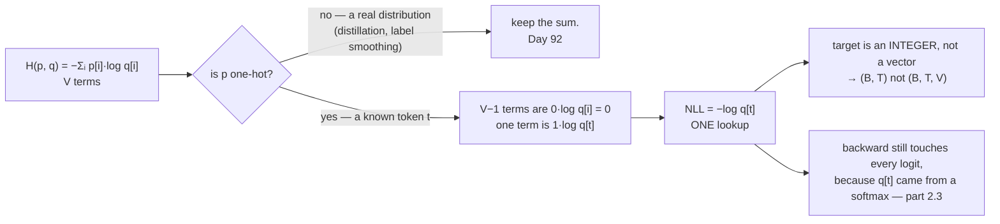

# 2.2 — Negative log-likelihood is cross-entropy with a one-hot target

## One-line answer

When the target is a single known token, `V − 1` of the cross-entropy's terms are multiplied by zero, so
the whole sum collapses to `−log(q[target])` — one lookup, no `V`-length loop — and that collapse is
why the loss you write looks nothing like the formula you derived.

---

## The story

A school raffle sells a hundred tickets and draws one winner.

The rule for working out the payout is written for the general case: for every ticket, multiply what
that ticket wins by the chance it was drawn, and add up all hundred results.

After the draw, ninety-nine of those chances are zero and one of them is one. So the sum of a hundred
numbers is just one of them — the winning ticket's — and everybody in the room knows that without
doing any arithmetic at all.

Nobody writes out ninety-nine zeros. They look up the winning number and read off the prize.

But the general rule is still the correct rule, and it earns its place the year the school runs a draw
with **two** winners sharing the pot, or gives some tickets double weight. **The lookup is a special
case of the sum, and knowing that is what lets you write the general version on the day you actually
need it.**
---

## The idea in plain language

Part [2.1](2.1-coding-with-the-wrong-distribution.md) defined cross-entropy over two full
distributions:

> `H(p, q) = − Σᵢ p[i] · log(q[i])`

In language modelling the target is not a distribution over guesses. It is a fact: *the next token was
token 4197*. Expressed as a distribution, that is **one-hot** — a vector with `1.0` at index 4197 and
`0.0` everywhere else.

Substitute it. Every term where `p[i] = 0` contributes exactly zero (part
[1.3](../01-entropy/1.3-the-zero-probability-event.md)'s masking rule, and here the mathematics agrees
with the arithmetic once you mask). The single term where `p[i] = 1` contributes `−1 · log(q[i])`. So:

> **`H(one-hot at t, q) = −log(q[t])`**

That right-hand side has a name of its own: the **negative log-likelihood**, or NLL. The likelihood of
the observed token under the model is `q[t]`; its log is negative; the negative of that is a positive
loss that falls as the model gets it right.

So **NLL and cross-entropy are the same quantity**, and which name gets used depends on which
tradition you came in through. In this curriculum:

- "Cross-entropy" is used when the *general* form matters — distillation (Day 92), label smoothing,
  soft targets.
- "NLL" is used for the one-hot case, which is everything else.

Three consequences of the collapse, and they are the whole practical content:

**The implementation is a lookup, not a sum.** No `V`-length loop, no one-hot vector ever built. At
`V = 32,000` that is a factor of 32,000 in both work and memory for this step.

**The target is an integer, not a vector.** Every framework's cross-entropy takes `(B, T)` integers
rather than `(B, T, V)` one-hots, for exactly this reason. The one-hot is a *conceptual* device.

**Only one entry of `q` is read.** The loss depends on `q[t]` alone — but note carefully that `q[t]` is
a **softmax output**, so it depends on *all* the logits through the normalisation. The gradient
therefore touches every logit, which is what part
[2.3](2.3-why-this-is-the-loss.md) makes precise. The forward pass reads one number; the backward pass
writes `V` of them.

---

## Why Akshara needs it

- **Day 25 onward**, every loss in this curriculum is this. The training loop indexes a
  log-probability tensor with the target ids and averages — three lines, and they come from here.
- **Day 51**'s training loop uses the `(B, T)` integer-target form, and part
  [2.5](2.5-the-loss-that-counted-padding.md)'s padding failure lives in exactly that indexing.
- **Day 92**'s distillation goes back to the **general** form, because the teacher supplies a full
  distribution rather than a token. Knowing NLL is a special case is what makes that a small change
  rather than a new loss.
- **Day 112 onward** reports the loss on held-out data, and "NLL per token" is the number quoted.
- **Part [3.2](../03-kl-and-perplexity/3.2-perplexity.md)** exponentiates it, which is only meaningful
  because it is a per-token average.

---

## The mechanism

The collapse, shown by computing it both ways:

```python
import numpy as np


def softmax(z, axis=-1):
    e = np.exp(z - z.max(axis=axis, keepdims=True))
    return e / e.sum(axis=axis, keepdims=True)


rng = np.random.default_rng(1337)
V = 8
logits = rng.standard_normal(V) * 2          # (V,)
q = softmax(logits)                           # (V,)
target = 3                                    # the token that actually occurred

onehot = np.zeros(V)                          # (V,)
onehot[target] = 1.0

ce_full = -float((onehot * np.log(q)).sum())  # the general formula, all V terms
nll = -float(np.log(q[target]))               # the collapsed form, one lookup

print("q         :", np.round(q, 6))
print("q[target] :", round(float(q[target]), 6))
print("CE (full) :", ce_full)
print("NLL       :", nll)
print("identical :", ce_full == nll)
```

**Line by line:**
- `onehot * np.log(q)` computes all `V` products, of which `V − 1` are `0.0 × (something finite)` — and
  those are safe, because `q` came from a softmax and is strictly positive. **If `q` had a zero
  anywhere, this line would produce `nan`** even at positions the target does not care about, which is
  part [1.3](../01-entropy/1.3-the-zero-probability-event.md)'s trap and one more reason the collapsed
  form is preferred.
- `-float(np.log(q[target]))` reads **one** element. No vector is built and no sum is taken.
- `ce_full == nll` uses exact equality, and here that is legitimate: the general form's extra terms are
  exactly `0.0`, so the two computations perform the same arithmetic on the same number.
- Measured on Intel Core i3-1115G4, CPython 3.12.10, numpy 2.5.2, seed 1337, 2026-08-26:

```text
q         : [5.39400e-03 1.28930e-02 3.79400e-03 3.10000e-04 7.72029e-01 6.68000e-04
             2.04879e-01 3.40000e-05]
q[target] : 0.00031
CE (full) : 8.077638785159463
NLL       : 8.077638785159463
identical : True
```

**Identical to every digit.** And note the value: `8.08` nats is a large loss, because the model gave
the true token a probability of `0.00031` while putting `0.772` on a different one. The loss is doing
its job — it is very surprised.

The batched form, which is what a training loop actually runs:

```python
B, T, V = 4, 6, 50
logits = rng.standard_normal((B, T, V)) * 2       # (B, T, V)
targets = rng.integers(0, V, size=(B, T))         # (B, T) integer token ids

log_q = np.log(softmax(logits))                    # (B, T, V)
nll = -np.take_along_axis(log_q, targets[..., None], axis=-1)[..., 0]   # (B, T)

print("logits ", logits.shape, "targets", targets.shape, "-> nll", nll.shape)
print("nll[0] :", np.round(nll[0], 4))
```

**Line by line:**
- `targets` is `(B, T)` **integers**, not `(B, T, V)` one-hots. That is the interface every framework
  uses and it is a direct consequence of the collapse.
- `targets[..., None]` adds a trailing axis, making it `(B, T, 1)` — the shape `take_along_axis` needs
  to index one element per position along the last axis. Day 2 part
  [2.1](../../../day-002-tensors-shape-stride/parts/02-broadcasting-and-indexing/2.1-broadcasting-the-rule.md)
  is the axis-insertion rule.
- `np.take_along_axis(log_q, idx, axis=-1)` is the **gather** from Day 2 part
  [2.2](../../../day-002-tensors-shape-stride/parts/02-broadcasting-and-indexing/2.2-indexing-view-or-copy.md):
  for each `(b, t)`, pick out `log_q[b, t, targets[b, t]]`. It returns `(B, T, 1)`, and `[..., 0]` drops
  the axis that was only there for the indexing.
- The result is `(B, T)` — **one loss per position**, not one number. Collapsing that to a scalar is a
  separate decision and it is part [2.4](2.4-the-mean-over-what.md).
- Measured on this machine, 2026-08-26: shapes `(4, 6, 50)`, `(4, 6)` and `(4, 6)`.

The collapse, drawn:



**What the collapse saves**, in arithmetic rather than in words:

```python
B, T, V = 8, 1024, 32000
print("one-hot targets   :", B * T * V, "numbers =", B * T * V * 4 / 1024**3, "GiB in float32")
print("integer targets   :", B * T, "numbers =", B * T * 8 / 1024**2, "MiB in int64")
print("ratio             :", (B * T * V * 4) / (B * T * 8))
```

**Line by line:**
- The one-hot form needs a `(B, T, V)` tensor of mostly zeros — the same size as the logits.
- The integer form needs `(B, T)`.
- Measured on this machine, 2026-08-26: `262144000` numbers (`0.9766` GiB in `float32`) against `8192`
  numbers (`0.0625` MiB in `int64`), a ratio of **16,000**.
- **A gigabyte not allocated, per step.** That is the practical content of "the sum collapses", and it
  is why no framework's cross-entropy has ever taken one-hot targets.

---

## Shapes

| Tensor | Symbolic shape | Concrete here | What each axis means |
| --- | --- | --- | --- |
| `logits` | `(B, T, V)` | `(4, 6, 50)` | batch item · position · vocabulary entry |
| `q = softmax(logits)` | `(B, T, V)` | `(4, 6, 50)` | a distribution per position |
| `log_q` | `(B, T, V)` | `(4, 6, 50)` | log-probabilities |
| `targets` | `(B, T)` | `(4, 6)` | **integer** token ids — not one-hots |
| `targets[..., None]` | `(B, T, 1)` | `(4, 6, 1)` | the shape `take_along_axis` requires |
| `take_along_axis(...)` | `(B, T, 1)` | `(4, 6, 1)` | one gathered log-probability per position |
| `nll` | `(B, T)` | `(4, 6)` | **one loss per position** — part 2.4 combines them |
| a one-hot target tensor | `(B, T, V)` | `(4, 6, 50)` | **never built** — 16,000× larger than the integers |

---

## When it breaks

The loud one, from a target outside the vocabulary:

```console
>>> np.take_along_axis(log_q, np.array([[50]]) [..., None], axis=-1)
Traceback (most recent call last):
  File "<stdin>", line 1, in <module>
IndexError: index 50 is out of bounds for axis 2 with size 50
```

Verbatim on this machine, 2026-08-26. Token ids run `0` to `V − 1`; an id of `V` is off the end. This
is the failure that catches an off-by-one in a vocabulary — and it is caught because the id is used as
an **index**, which is one of the quiet advantages of the integer form.

The other loud one, from forgetting the axis insertion:

```console
>>> np.take_along_axis(log_q, targets, axis=-1)
Traceback (most recent call last):
  File "<stdin>", line 1, in <module>
ValueError: `indices` and `arr` must have the same number of dimensions
```

`targets` is `(B, T)` and `log_q` is `(B, T, V)`. The `[..., None]` is not decoration.

**The silent version, and there are two.**

*One: indexing with the wrong axis.* If `targets` were transposed — `(T, B)` instead of `(B, T)` — and
`B` happened to equal `T`, the gather would succeed and pick the wrong token at every position. Day 2
part
[4.1](../../../day-002-tensors-shape-stride/parts/04-where-they-meet/4.1-the-shape-was-right-the-answer-was-wrong.md)
is the general form of this, and here it produces a loss that is finite, plausible and measuring
nothing.

*Two: an off-by-one between inputs and targets.* A language model predicts token `t+1` from tokens
`0..t`, so the targets are the inputs **shifted by one**. Shift the wrong way, or forget to shift, and
the model is trained to predict the token it was just given — which it learns to do perfectly, driving
the loss to near zero and producing a model that can only copy.

That second one is worth a check, because a near-zero loss looks like success:

```python
def assert_targets_are_shifted(inputs: np.ndarray, targets: np.ndarray) -> None:
    """A causal LM predicts the NEXT token: targets[:, i] == inputs[:, i + 1]."""
    assert inputs.shape == targets.shape, f"{inputs.shape} vs {targets.shape}"
    assert not np.array_equal(inputs, targets), "targets equal inputs — the shift is missing"
    np.testing.assert_array_equal(targets[:, :-1], inputs[:, 1:])
```

**Line by line:**
- The second assertion catches the completely-unshifted case, which is the common one and which
  otherwise shows up only as a suspiciously good loss.
- The third checks the shift is by **exactly one, in the right direction**. `targets[:, :-1]` against
  `inputs[:, 1:]` is the alignment a causal model requires; reversing the two slices tests for a shift
  the other way and would pass on wrong data.
- Run it once at the start of training, on one batch. It costs nothing and it removes the single most
  embarrassing failure mode in language modelling.
- **The complementary sanity check is against `ln(V)`**: an untrained model's loss should be close to
  `ln(V)` — `10.373491` nats at `V = 32,000`, from part
  [1.2](../01-entropy/1.2-entropy-in-bits-and-nats.md). A first-step loss far *below* that means the
  model is seeing the answer.

---

## In production

**What a research engineer writes instead of the teaching version.** They call the framework's
cross-entropy with `(B·T, V)` logits and `(B·T,)` integer targets, and the framework fuses the
log-softmax and the gather into one kernel — never materialising `log_q`, which as computed above is a
gigabyte at realistic sizes. Part [2.3](2.3-why-this-is-the-loss.md) is why that fusion is a numerical
requirement and not only a performance one.

They also treat the target-shift as a property of the *dataset* rather than of the loss, so it is
established once where the batches are built and asserted once at the start of training, rather than
being re-derived at every call site.

**What degrades at scale.** The one-hot form, catastrophically — a factor of 16,000 in memory, measured
above — which is why it is never used. The collapsed form scales fine: it is one gather, `O(B·T)`
lookups into a `(B, T, V)` tensor, and its cost is dominated by producing the logits in the first place.

**The failure that only shows with real data.** Targets and inputs that agree by accident. On synthetic
test data with random ids, an unshifted target produces a normal-looking loss, because a random token is
as hard to predict as any other. On **real** text, an unshifted target is trivially predictable — the
model just copies its input — and the loss collapses towards zero within a few hundred steps. The
symptom is a model that scores beautifully and generates nothing but repetitions of the prompt, and it
is caught in ten seconds by the `ln(V)` check at step 0 and by the shift assertion.

**The review comment.** *"This builds a one-hot target — the loss takes integer ids. That's a
`(B, T, V)` tensor you don't need."*

**The interview question.** *"What's the difference between cross-entropy and negative
log-likelihood?"* The strong answer is that there is none, in the case that matters: NLL is
cross-entropy against a one-hot target, and the one-hot collapses the sum to a single lookup. Then the
practical consequence — the target is an integer, the framework's loss takes integers, and building a
one-hot is a 16,000× memory mistake at realistic vocabulary sizes. Mentioning that the *general* form
is still needed for distillation and label smoothing is what shows the special case is understood as a
special case.

**Compute tier: T0.** Everything is `(4, 6, 50)` on a laptop CPU. The T0 version proves the **identity
and the shapes** exactly, and both transfer to any size. The 16,000× memory ratio is arithmetic on the
shapes rather than a measurement, and it is worked out above rather than asserted.

---

## Check yourself

Run this. It prints **two identical numbers and three shapes**:

```python
import numpy as np


def softmax(z, axis=-1):
    e = np.exp(z - z.max(axis=axis, keepdims=True))
    return e / e.sum(axis=axis, keepdims=True)


rng = np.random.default_rng(1337)
V, target = 8, 3
q = softmax(rng.standard_normal(V) * 2)
onehot = np.zeros(V); onehot[target] = 1.0

print("CE (full) :", -float((onehot * np.log(q)).sum()))
print("NLL       :", -float(np.log(q[target])))
print("identical :", -float((onehot * np.log(q)).sum()) == -float(np.log(q[target])))

B, T, V = 4, 6, 50
logits = rng.standard_normal((B, T, V)) * 2
targets = rng.integers(0, V, size=(B, T))
log_q = np.log(softmax(logits))
nll = -np.take_along_axis(log_q, targets[..., None], axis=-1)[..., 0]
print("logits", logits.shape, "targets", targets.shape, "-> nll", nll.shape)
print("one-hot would be:", B * T * V, "numbers vs", B * T, "integers")
```

**Line by line:**
- The first two print `8.077638785159463` twice and `identical : True`.
- The shapes print `(4, 6, 50)`, `(4, 6)` and `(4, 6)`. **The loss is per-position, not a scalar** — say
  out loud what still has to happen before it is one number.
- The last line prints `1200` against `24`. At real sizes that ratio is 16,000.
- Now drop the `[..., None]` and re-run. Read the error and say what shape `take_along_axis` wanted.

**Say this out loud, without scrolling up:** explain why `V − 1` of the cross-entropy's terms vanish for
a one-hot target — and say what shape and dtype the target therefore has in every real implementation.
