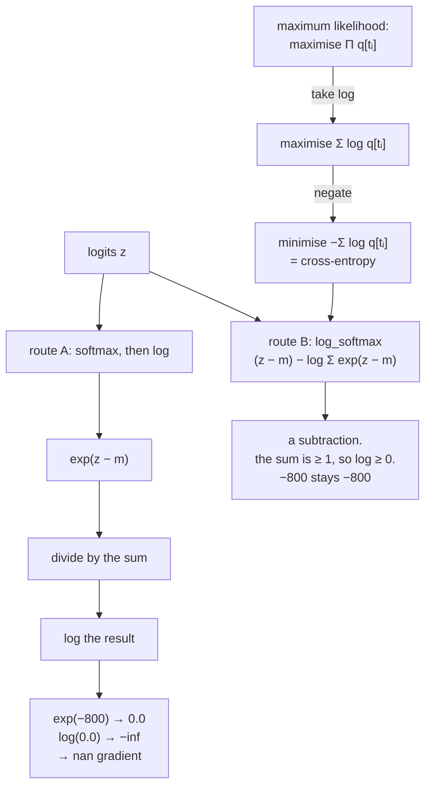

# 2.3 — Why this is the loss, and why it is computed from logits

## One-line answer

Cross-entropy is the loss because minimising it *is* maximising the probability the model assigns to
the data — and it is computed from logits rather than probabilities because `log(softmax(z))` collapses
to a subtraction that never underflows, measured here giving `−800` where the naive route gives `−inf`.

---

## The story

You want to know how likely it is that a coin comes up heads forty times in a row.

You can work it out: multiply one half by itself, forty times over. The answer is a number with twelve
zeros after the decimal point before the first real digit shows up. Now try writing that in a notebook
whose column has room for six decimal places. It comes out as `0.000000` — which reads exactly like
"impossible", and it is not impossible at all.

So people stop writing the chance and start writing something else: **how many halvings**. Forty.

Look at what that changes. Multiplying turns into adding. The numbers stay small enough to read. The
total across a long run of tosses is a sum you can do in your head instead of a product that runs off
the edge of the page.

Nothing about the coin changed. The notebook changed.

And there is a second thing you get for free. When a chance is extremely small, the chance itself
rounds to zero in the notebook and the information is destroyed. "Forty halvings" is just `40` — an
ordinary, comfortable number, recorded perfectly.
---

## The idea in plain language

Two questions, and they have the same answer.

**Why is cross-entropy the loss and not something else?**

Because of what "training" means. You have data — a sequence of tokens that actually occurred — and a
model with parameters. The natural thing to want is the parameters that make the observed data **most
likely** under the model. That is the *maximum likelihood* principle, and it is not a machine-learning
invention; it is the standard way to fit any probabilistic model to any data.

The likelihood of a whole dataset is the product of the per-token probabilities. Part
[1.1](../01-entropy/1.1-surprise-measured.md) established why nobody works with that product: a
thousand numbers below 1, multiplied, underflows to exactly zero. So take the logarithm, which turns
the product into a sum, and negate it so that "better" means "smaller":

> maximise `Π q[tᵢ]` ⟺ maximise `Σ log q[tᵢ]` ⟺ **minimise `−Σ log q[tᵢ]`**

That last expression is the sum of the per-token NLLs from part
[2.2](2.2-nll-is-cross-entropy-with-a-one-hot.md), which is cross-entropy. **Cross-entropy is not one
loss among many; it is maximum likelihood written so a computer can use it.**

**Why is it computed from logits rather than from probabilities?**

Because the two-step route destroys information that the one-step route keeps. Write out what
`log(softmax(z))` actually is:

```text
    softmax(z)[i]      = exp(z[i] − m) / Σⱼ exp(z[j] − m)          where m = max(z)
    log softmax(z)[i]  = (z[i] − m) − log Σⱼ exp(z[j] − m)
```

The second line has **no division and no exponential of the result** — just a subtraction and one
logarithm of a sum that is guaranteed to be at least 1 (because the largest term is `exp(0) = 1`). The
term `log Σ exp(...)` has a name, **log-sum-exp**, and Day 7 (MATH-14) is the day it becomes the
subject.

The consequence is measured below: at logits spanning 800 units, the naive route gives `−inf` and the
fused route gives `−800`. **The value was never small; it was only small after being exponentiated.**

---

## Why Akshara needs it

- **Day 25 onward**, the training loop calls a loss that takes logits. This is why the interface is
  that way, and why Day 39's model returns logits and stops.
- **Day 7 (MATH-14)** is log-sum-exp as a whole day. This part is its motivation.
- **Part [1.3](../01-entropy/1.3-the-zero-probability-event.md)** distinguished structural zeros from
  numerical ones and said the fix for numerical zeros is upstream. **This is upstream.**
- **Day 94**'s DPO works entirely in log-probability space, comparing `log q` between two models. The
  quantities it manipulates are exactly the ones this part produces.
- **Day 66**'s memory budget: not materialising the `(B, T, V)` probability tensor is a gigabyte saved
  per step at realistic sizes (part [2.2](2.2-nll-is-cross-entropy-with-a-one-hot.md) computed it).

---

## The mechanism

The maximum-likelihood argument, made concrete on four tokens:

```python
import numpy as np


def softmax(z, axis=-1):
    e = np.exp(z - z.max(axis=axis, keepdims=True))
    return e / e.sum(axis=axis, keepdims=True)


rng = np.random.default_rng(1337)
V, T = 8, 4
logits = rng.standard_normal((T, V)) * 2      # (T, V) four positions
targets = np.array([3, 0, 6, 1])              # (T,)
q = softmax(logits)                            # (T, V)

per_token = q[np.arange(T), targets]           # (T,) the probability of each observed token
likelihood = float(per_token.prod())
nll_sum = -float(np.log(per_token).sum())

print("per-token probabilities:", np.round(per_token, 8))
print("likelihood (product)   :", likelihood)
print("−log likelihood (sum)  :", nll_sum)
print("−log(likelihood)       :", -np.log(likelihood))
```

**Line by line:**
- `q[np.arange(T), targets]` is the gather from part
  [2.2](2.2-nll-is-cross-entropy-with-a-one-hot.md), written with explicit index arrays rather than
  `take_along_axis` because at rank 2 it reads more directly.
- `per_token.prod()` is the likelihood of the whole four-token sequence — the thing maximum likelihood
  wants to maximise.
- Measured on Intel Core i3-1115G4, CPython 3.12.10, numpy 2.5.2, seed 1337, 2026-08-26: the
  probabilities are `[3.1040000e-04, 1.0684100e-02, 3.1327803e-01, 3.9604429e-01]`, the product is
  `4.1146946679319367e-07`, the sum of `−log`s is `14.703531019355754`, and `−log(product)` is
  `14.703531019355752`. **They agree to fifteen digits and differ in the last** — Day 2 part
  [3.2](../../../day-002-tensors-shape-stride/parts/03-matmul/3.2-three-loops-then-one-call.md)'s lesson
  again: two correct routes, different rounding.
- **Four tokens and the likelihood is already `4.1e-07`.** At forty tokens it would be around `1e-65`;
  at seven hundred it underflows to exactly zero in `float64` (Day 2 part
  [1.2](../../../day-002-tensors-shape-stride/parts/01-what-a-tensor-is/1.2-dtype-the-width-of-a-number.md)
  gives the smallest normal value as `2.2250738585072014e-308`). The sum of logs is `14.7` and stays
  ordinary forever.

Now the second question — the numerical one. `log_softmax`, written as the subtraction it is:

```python
def log_softmax(z, axis=-1):
    m = z.max(axis=axis, keepdims=True)
    shifted = z - m
    return shifted - np.log(np.exp(shifted).sum(axis=axis, keepdims=True))
```

**Line by line:**
- `m = z.max(...)` and `shifted = z - m` is the same shift-invariance trick as the softmax (Day 5 part
  [1.3](../../../day-005-logits-softmax-sampling/parts/01-logits-and-probabilities/1.3-softmax-the-map-to-the-simplex.md)),
  and it is exact rather than approximate for the same reason.
- After the shift, the largest entry of `shifted` is `0`, so `exp(shifted)` is in `(0, 1]` and its sum
  is **at least 1**. `np.log` of something at least 1 is at least 0 — no `log(0)`, ever.
- The return is `shifted − log(sum)`: **a subtraction**, not a division followed by a logarithm. Nothing
  is exponentiated after the sum, so nothing can underflow on the way out.
- `keepdims=True` on both reductions, for the broadcast reason from Day 2 part
  [2.1](../../../day-002-tensors-shape-stride/parts/02-broadcasting-and-indexing/2.1-broadcasting-the-rule.md).

The comparison, at three scales:

```python
for scale in (1.0, 100.0, 800.0):
    z = np.array([0.0, -1.0, -2.0]) * scale       # (3,)
    with np.errstate(divide="ignore", invalid="ignore"):
        naive = np.log(softmax(z))
    print(f"  scale {scale:6.1f}: log(softmax) {np.round(naive, 4)}   log_softmax {np.round(log_softmax(z), 4)}")
```

**Line by line:**
- The logits are `[0, −s, −2s]`, so the gaps grow with the scale. Attention scores before the `√d_k`
  division (Day 30) reach this range routinely, and a diverging run reaches it faster.
- `np.errstate` is used **only** so the demonstration prints instead of raising under this repository's
  `filterwarnings = ["error::RuntimeWarning"]`. Never write it in real code.
- Measured on this machine, 2026-08-26:

```text
  scale    1.0: log(softmax) [-0.4076 -1.4076 -2.4076]   log_softmax [-0.4076 -1.4076 -2.4076]
  scale  100.0: log(softmax) [   0. -100. -200.]         log_softmax [   0. -100. -200.]
  scale  800.0: log(softmax) [  0. -inf -inf]            log_softmax [    0.  -800. -1600.]
```

**At scale 800 the naive route returns `−inf` twice and the fused route returns `−800` and `−1600`.**
Those are ordinary, finite, correct numbers. What happened is exactly part
[1.3](../01-entropy/1.3-the-zero-probability-event.md)'s *numerical zero*: `exp(−800)` rounds to `0.0`,
the probability is destroyed, and then its logarithm is `−inf`. The fused route never forms the
probability, so there is nothing to destroy.

And an `-inf` in the loss is not a curiosity — it is a `nan` gradient one step later and a dead run.



**And the identity that the two routes agree when both are representable:**

```python
logits = rng.standard_normal(8) * 2
print("log(softmax)[3] :", repr(float(np.log(softmax(logits))[3])))
print("log_softmax[3]  :", repr(float(log_softmax(logits)[3])))
print("difference      :", abs(float(np.log(softmax(logits))[3]) - float(log_softmax(logits)[3])))
```

**Line by line:**
- Measured on this machine, 2026-08-26: both print `-2.8631156198060923` and the difference is exactly
  `0.0`.
- **The fused route is not an approximation.** It is the same value, computed by a route that has fewer
  ways to lose it. That is the whole claim, and it is worth checking rather than believing.

---

## Shapes

| Tensor | Symbolic shape | Concrete here | What each axis means |
| --- | --- | --- | --- |
| `logits` | `(T, V)` | `(4, 8)` | position · vocabulary entry |
| `targets` | `(T,)` | `(4,)` | integer token ids |
| `per_token` | `(T,)` | `(4,)` | the probability of each observed token |
| `per_token.prod()` | `()` | `4.1147e-07` | the sequence likelihood — **underflows at ~700 tokens** |
| `np.log(per_token).sum()` | `()` | `−14.7035` | the log-likelihood — ordinary at any length |
| `log_softmax(logits)` | `(T, V)` | `(4, 8)` | log-probabilities; same shape, no division |
| `z.max(axis=-1, keepdims=True)` | `(T, 1)` | `(4, 1)` | **kept**, so the shift broadcasts |

---

## When it breaks

The loud one, and it is the whole argument:

```console
>>> z = np.array([0.0, -800.0, -1600.0])
>>> np.log(softmax(z))
RuntimeWarning: divide by zero encountered in log
array([  0., -inf, -inf])
>>> log_softmax(z)
array([    0.,  -800., -1600.])
```

Verbatim on this machine, 2026-08-26. Under this repository's settings the first is an exception.

The other loud one, from a missing `keepdims`:

```console
>>> z = np.zeros((4, 8))
>>> z - z.max(axis=-1)
Traceback (most recent call last):
  File "<stdin>", line 1, in <module>
ValueError: operands could not be broadcast together with shapes (4,8) (4,)
```

Caught here because `T = 4` and `V = 8` differ. **Silent when they are equal** — Day 2 part
[4.1](../../../day-002-tensors-shape-stride/parts/04-where-they-meet/4.1-the-shape-was-right-the-answer-was-wrong.md).

**The silent version, and it is the reason this part is not optional: the `-inf` becomes a `nan` one
step later.**

```console
>>> loss = -np.log(softmax(z))[1]
>>> loss
np.float64(inf)
>>> loss * 0.0
np.float64(nan)
```

An infinite loss multiplied by anything — a mask, a scale factor, a `1/n` averaging term — becomes
`nan`. And `nan` propagates: one position in one batch item poisons the whole loss, the whole gradient,
and every parameter after one optimizer step. The traceback, if there is one at all, is thousands of
steps later.

The check, and it belongs at the loss:

```python
def nll_from_logits(logits: np.ndarray, targets: np.ndarray) -> np.ndarray:
    """Per-position NLL, computed without ever forming a probability."""
    assert np.isfinite(logits).all(), "logits contain inf or nan before the loss is computed"
    log_q = log_softmax(logits, axis=-1)                                    # (..., V)
    nll = -np.take_along_axis(log_q, targets[..., None], axis=-1)[..., 0]   # (...,)
    assert np.isfinite(nll).all(), "loss is not finite — with log_softmax this should be impossible"
    return nll
```

**Line by line:**
- The **first** assertion blames upstream: if the logits already contain `nan`, the loss is not the
  culprit and saying so saves the wrong investigation.
- The **second** is a genuine invariant. With `log_softmax`, a finite input **cannot** produce a
  non-finite output — the shift bounds the exponentials and the sum is at least 1. An assertion that
  should never fire is worth writing exactly when its firing would mean the reasoning is wrong.
- **No `eps`, no clipping, no clamping anywhere.** Part
  [1.3](../01-entropy/1.3-the-zero-probability-event.md) argued that those are fudges; this function is
  the reason they are unnecessary.
- Neither assertion costs more than a pass over the tensor, and both belong at the boundary rather than
  inside an inner loop.

---

## In production

**What a research engineer writes instead of the teaching version.** They call the framework's
cross-entropy on **logits** and integer targets, which fuses the shift, the log-sum-exp, the gather and
the reduction into one kernel. That fusion is why the interface looks the way it does: it is not a
convenience, it is the only formulation that is numerically safe *and* avoids materialising the
`(B, T, V)` probability tensor.

The habit that generalises beyond this loss is **stay in log space**. Log-probabilities add where
probabilities multiply, they do not underflow, and every sequence-level quantity in this curriculum —
sequence log-likelihood, beam search scores (Day 74), DPO's log-ratio (Day 94) — is computed there.
Converting to probabilities is done once, at the last moment, only when a probability is what is wanted.

**What degrades at scale.** Two things, both measured elsewhere in this day. The probability tensor is
`(B, T, V)`, computed at 262 million numbers and 0.98 GiB for a batch of 8 at sequence 1024 and
vocabulary 32,000 (part [2.2](2.2-nll-is-cross-entropy-with-a-one-hot.md)) — never allocated by the
fused form. And the underflow gets *more* likely as a model trains and its logits spread out, so the
naive route is safest at initialisation and least safe once the run matters.

**The failure that only shows with real data.** Rare tokens plus a confident model. Early in training,
no probability underflows. Later, a confident model over a large vocabulary assigns the tail
probabilities below the dtype's floor — and when one of those tail tokens actually appears in the data,
the naive loss is `inf` for that position. **The bug appears at step 4000 of a run, with no code
change**, and on a free notebook session (Day 67) that is the session.

**The review comment.** *"This does `log(softmax(x))` — use the fused `log_softmax`. It's the same value
and it can't underflow."*

**The interview question.** *"Why do loss functions take logits rather than probabilities?"* The strong
answer has both halves: numerically, `log(softmax(z))` reduces to a subtraction that cannot underflow,
whereas the two-step route destroys any probability below the dtype's floor and then takes `log(0)`; and
practically, the fused form never materialises the largest tensor in the model. Adding the maximum
likelihood derivation — that minimising cross-entropy *is* maximising the probability of the data, and
the log is there because the product underflows — is what turns a recipe into a reason.

**Compute tier: T0.** Everything is a `(4, 8)` tensor on a laptop CPU, and every result is a property
of IEEE-754 arithmetic — the `−inf` at scale 800, the `1.19e-09` likelihood at four tokens, the exact
agreement between the two routes when both are representable. All of it reproduces anywhere. What T0
does not show is the gigabyte the fused form does not allocate, which is arithmetic on the shapes.

---

## Check yourself

Run this. It prints **two identical numbers, one `-inf` and one `-800`**:

```python
import numpy as np


def softmax(z, axis=-1):
    e = np.exp(z - z.max(axis=axis, keepdims=True))
    return e / e.sum(axis=axis, keepdims=True)


def log_softmax(z, axis=-1):
    m = z.max(axis=axis, keepdims=True)
    s = z - m
    return s - np.log(np.exp(s).sum(axis=axis, keepdims=True))


rng = np.random.default_rng(1337)
logits = rng.standard_normal(8) * 2
print("log(softmax)[3]:", repr(float(np.log(softmax(logits))[3])))
print("log_softmax[3] :", repr(float(log_softmax(logits)[3])))

big = np.array([0.0, -800.0, -1600.0])
with np.errstate(divide="ignore", invalid="ignore"):
    print("naive at scale 800 :", np.log(softmax(big)))
print("fused at scale 800 :", log_softmax(big))

per_token = np.array([3.1e-04, 3.9e-03, 1.5e-02, 6.6e-02])
print("likelihood of 4 tokens:", per_token.prod())
print("...of 700 such tokens :", per_token.prod() ** 175, " (float64 floor:", np.finfo(np.float64).tiny, ")")
```

**Line by line:**
- The first two print `-2.8631156198060923` twice — **identical**, so the fused route is not an
  approximation.
- The naive route prints `[0., -inf, -inf]` and the fused one `[0., -800., -1600.]`. Say out loud which
  step destroyed the value.
- The last line raises a four-token likelihood of `1.19691e-09` to the 175th power, giving a 700-token
  sequence's likelihood: it prints `0.0` on this machine, against a `float64` floor of
  `2.2250738585072014e-308`. **The probability of a perfectly ordinary sentence is not representable**,
  and its log is `−3595.11645520427`, which is fine.

**Say this out loud, without scrolling up:** give the chain from "maximise the likelihood" to "minimise
cross-entropy" in three steps — and say what `log(softmax(z))` simplifies to and why that form cannot
underflow.
