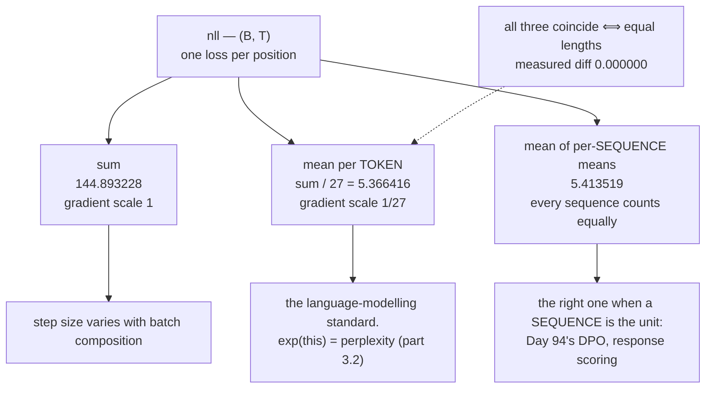

# 2.4 — The mean over what? Tokens, sequences and batches

## One-line answer

Cross-entropy produces one number per position, and turning that `(B, T)` tensor into a scalar is a
**choice** — sum, mean per token, or mean of per-sequence means — that changes the gradient scale by
the token count and changes what the model is optimising, measured here at `5.366416` against
`5.413519` on the same batch.

---

## The story

A school reports the exam results of its four classes.

The first class has a hundred students in it. The fourth has eight.

Somebody asks for "the average score", and the person holding the marks sheet asks back: which
average? Because there are two of them, and they are different numbers.

**Average per student.** Add up every student's score, then divide by the total number of students.
The big class decides almost the entire answer, simply because most of the students are in it.

**Average per class.** Work out each class's average first, then average those four numbers. Now every
class counts the same, so the eight-student class has exactly as much say as the hundred-student one.

Neither of these is wrong. They answer two different questions — *how is the typical student doing*
and *how is the typical class doing* — and a report that hands you one while you assume the other is
misleading without containing a single false number.
---

## The idea in plain language

Part [2.2](2.2-nll-is-cross-entropy-with-a-one-hot.md) produced a `(B, T)` tensor: one loss per
position, per sequence. An optimizer needs a **scalar**. There are three standard ways to get there and
they are genuinely different.

**Sum.** `nll.sum()`. The total surprise over the batch. Its size grows with the batch and with the
sequence length, so the same learning rate means different things at different batch sizes — which is
occasionally what you want and usually not.

**Mean per token.** `nll.sum() / number_of_real_tokens`. Every token counts equally, so a long sequence
influences the loss more than a short one, in proportion to its length. **This is the standard for
language modelling**, and it is the one whose exponential is perplexity (part
[3.2](../03-kl-and-perplexity/3.2-perplexity.md)).

**Mean of per-sequence means.** Average within each sequence, then average those. Every *sequence*
counts equally regardless of length. This is the standard when a sequence is the unit you care about —
a classification, a preference pair (Day 94), a generated answer being scored.

They coincide exactly when every sequence has the same length, which is why the difference is invisible
in a toy setting and appears the moment real data arrives with real length variation.

Two consequences that decide which to use:

**The gradient scale differs by the token count.** The derivative of a sum with respect to one token's
loss is `1`; of a mean, `1/n`. Measured below at `n = 27`, so the same learning rate produces steps 27
times larger with the sum. A change from `sum` to `mean` in a loss function is a 27-fold change in
effective learning rate, and it does not look like one.

**The choice must be consistent between training and evaluation.** A model trained on per-token mean
and evaluated on per-sequence mean is being judged by a different quantity from the one it optimised —
which is legitimate if deliberate and a bug if not.

And one thing that is *not* a choice: **padding must be excluded from every one of them**. That is part
[2.5](2.5-the-loss-that-counted-padding.md), and it is Silent Failure #3 from the plan's §6.

---

## Why Akshara needs it

- **Day 51**'s training loop reduces `(B, T)` to a scalar, and this is the line it does it on.
- **Day 67**'s pretraining run uses **gradient accumulation** over micro-batches, and Day 3 part
  [2.5](../../../day-003-derivatives-and-autograd/parts/02-the-autograd-engine/2.5-zero-grad-the-state-that-leaks.md)
  named the scale factor as the most commonly forgotten line. Which factor is right depends entirely on
  the reduction chosen here.
- **Part [3.2](../03-kl-and-perplexity/3.2-perplexity.md)** exponentiates the loss, and that is only
  meaningful for the **per-token** mean.
- **Day 112 onward** compares models, and two numbers computed with different reductions are not
  comparable.
- **Day 94**'s DPO scores whole responses, so the per-sequence form is the right one there and the
  per-token form is not.

---

## The mechanism

One batch, three reductions:

```python
import numpy as np


def log_softmax(z, axis=-1):
    m = z.max(axis=axis, keepdims=True)
    s = z - m
    return s - np.log(np.exp(s).sum(axis=axis, keepdims=True))


rng = np.random.default_rng(1337)
B, T, V, PAD = 4, 10, 50, 0
logits = rng.standard_normal((B, T, V)) * 2         # (B, T, V)
targets = rng.integers(1, V, size=(B, T))           # (B, T) real ids are 1..V-1
lengths = np.array([10, 6, 3, 8])                   # (B,)
for b, L in enumerate(lengths):
    targets[b, L:] = PAD
mask = targets != PAD                               # (B, T)

nll = -np.take_along_axis(log_softmax(logits), targets[..., None], axis=-1)[..., 0]   # (B, T)

total = float(nll[mask].sum())
n_tokens = int(mask.sum())
per_sequence = np.array([float(nll[b, :L].mean()) for b, L in enumerate(lengths)])    # (B,)

print(f"  real tokens               : {n_tokens} of {B * T}")
print(f"  sum                       : {total:.6f}")
print(f"  mean per token            : {total / n_tokens:.6f}")
print(f"  per-sequence means        : {np.round(per_sequence, 6)}")
print(f"  mean of per-sequence means: {float(per_sequence.mean()):.6f}")
```

**Line by line:**
- `lengths` are deliberately unequal — `10, 6, 3, 8`. **With equal lengths the two means coincide
  exactly** and this whole document would have nothing to show, which is why a toy batch hides the
  issue.
- `nll[mask]` selects the real positions. It returns a rank-1 array (Day 2 part
  [2.2](../../../day-002-tensors-shape-stride/parts/02-broadcasting-and-indexing/2.2-indexing-view-or-copy.md)
  measured that boolean selection always flattens), which is fine here because a sum does not care about
  shape.
- `nll[b, :L].mean()` averages within one sequence, over its real positions only.
- Measured on Intel Core i3-1115G4, CPython 3.12.10, numpy 2.5.2, seed 1337, 2026-08-26:

```text
  real tokens               : 27 of 40
  sum                       : 144.893228
  mean per token            : 5.366416
  per-sequence means        : [4.772125 7.48645  4.582143 4.813357]
  mean of per-sequence means: 5.413519
```

**Three numbers from one batch: `144.893228`, `5.366416` and `5.413519`.** All three are correct
answers to different questions, and only one of them is what your training loop should be minimising —
whichever one you decided on, written down.

The gradient consequence, which is the one that bites:

```python
print(f"  d(sum)/d(one token's nll)  = 1")
print(f"  d(mean)/d(one token's nll) = 1/{n_tokens} = {1 / n_tokens:.6f}")
print(f"  ratio                      = {n_tokens}")
```

**Line by line:**
- The loss is linear in each token's NLL, so these derivatives are exact and need no calculus.
- Measured on this machine: `1/27 = 0.037037`, a ratio of **27**.
- **Switching a loss from `sum` to `mean` multiplies every gradient by `1/27`**, which is
  indistinguishable from dividing the learning rate by 27. A run that diverges after such a change is
  usually diagnosed as a learning-rate problem, and it is — just not one anybody chose.
- The ratio is not fixed: it is the number of real tokens in the batch, so it **varies between batches**
  when lengths vary. With `sum`, the effective step size fluctuates with batch composition; with `mean`,
  it does not. That is the strongest argument for `mean` and it is rarely the one given.

How the two means diverge as lengths become unequal:

```python
for lens in ([10, 10, 10, 10], [10, 8, 6, 4], [10, 6, 3, 8], [10, 2, 2, 2]):
    m = np.zeros((B, T), dtype=bool)
    for b, L in enumerate(lens):
        m[b, :L] = True
    per_token = float(nll[m].mean())
    per_seq = float(np.mean([nll[b, :L].mean() for b, L in enumerate(lens)]))
    print(f"  lengths {str(lens):16s} per-token {per_token:.6f}  per-seq {per_seq:.6f}  diff {abs(per_token - per_seq):.6f}")
```

**Line by line:**
- The same `nll` tensor throughout; only the mask changes. So every difference is attributable to the
  reduction and nothing else.
- Measured on this machine, 2026-08-26:

```text
  lengths [10, 10, 10, 10] per-token 5.343374  per-seq 5.343374  diff 0.000000
  lengths [10, 8, 6, 4]    per-token 5.198079  per-seq 4.984051  diff 0.214028
  lengths [10, 6, 3, 8]    per-token 5.366416  per-seq 5.413519  diff 0.047103
  lengths [10, 2, 2, 2]    per-token 4.802210  per-seq 4.832296  diff 0.030086
```

**The first row is exactly zero.** Equal lengths, identical answers — which is precisely why this never
shows up in a unit test written with a fixed-length batch.

**And the second row differs by `0.214`**, which on a loss around 5 is a 4% difference. That is larger
than most improvements anyone reports, and it comes from a choice rather than from the model.

Note also that the sign is not consistent: per-token is *higher* in row three and *lower* in row two.
Which reduction gives the bigger number depends on whether the long sequences happen to be the harder
ones, so **there is no rule of thumb to substitute for knowing which you used.**



---

## Shapes

| Tensor | Symbolic shape | Concrete here | What each axis means |
| --- | --- | --- | --- |
| `logits` | `(B, T, V)` | `(4, 10, 50)` | batch · position · vocabulary |
| `targets` | `(B, T)` | `(4, 10)` | integer ids; `0` marks padding |
| `mask` | `(B, T)` | `(4, 10)` | boolean; `27` of `40` are real |
| `nll` | `(B, T)` | `(4, 10)` | **one loss per position** |
| `nll[mask]` | `(K,)` | `(27,)` | flattened — boolean selection always is |
| `nll[mask].sum()` | `()` | `144.893228` | the total surprise |
| `nll[mask].mean()` | `()` | `5.366416` | per-token mean — **the LM standard** |
| per-sequence means | `(B,)` | `(4,)` | one number per sequence |
| their mean | `()` | `5.413519` | per-sequence mean |

---

## When it breaks

The loud one, from reducing before masking:

```console
>>> nll.mean(axis=1).shape
(4,)
>>> nll[mask].mean(axis=1)
Traceback (most recent call last):
  File "<stdin>", line 1, in <module>
numpy.exceptions.AxisError: axis 1 is out of bounds for array of dimension 1
```

Verbatim on this machine, 2026-08-26. `nll[mask]` is rank 1, so `axis=1` does not exist. This is the
useful failure: it forces you to notice that **the per-sequence mean cannot be computed after
flattening**, because the sequence boundaries are gone. It has to be done per row, which is why the
code above loops.

**The silent versions, and there are three.**

*One: `nll.mean()` without the mask.* Averages over the padded positions too. That is part
[2.5](2.5-the-loss-that-counted-padding.md), and it is the day's named silent failure.

*Two: the wrong reduction for the metric being reported.* `exp(loss)` is perplexity **only** for the
per-token mean (part [3.2](../03-kl-and-perplexity/3.2-perplexity.md)). Exponentiating a per-sequence
mean gives a number that looks like a perplexity, is in the right range, and is not one.

*Three: a change of reduction inside a refactor.* Someone rewrites the loss and switches `sum` to `mean`
for tidiness. Every gradient is now `1/27` of what it was; the loss curve looks smoother; convergence is
slower; the diagnosis goes to the learning rate. **No test catches this**, because both versions are
correct losses.

The check, and it is a documented choice plus one assertion:

```python
def reduce_loss(nll: np.ndarray, mask: np.ndarray, how: str = "token_mean") -> float:
    """Reduce a (B, T) loss to a scalar. `how` is a deliberate choice, not a default to ignore."""
    assert nll.shape == mask.shape, f"{nll.shape} vs {mask.shape}"
    assert mask.any(), "no real tokens in this batch — the mask is empty"
    if how == "sum":
        return float(nll[mask].sum())
    if how == "token_mean":
        return float(nll[mask].sum() / mask.sum())
    if how == "sequence_mean":
        rows = [nll[b][mask[b]].mean() for b in range(nll.shape[0]) if mask[b].any()]
        return float(np.mean(rows))
    raise ValueError(f"unknown reduction {how!r}")
```

**Line by line:**
- `how` is a **required concept with a stated default**, and the docstring says it is a choice. A loss
  function whose reduction is implicit is a loss function nobody can compare across codebases.
- `mask.any()` catches an entirely-padded batch, which produces `0/0 = nan` under `token_mean` and an
  empty list under `sequence_mean`. It happens with a ragged final batch and it is worth one line.
- `sequence_mean` skips rows whose mask is empty rather than averaging a `nan` into the result — an
  entirely-padded *sequence* is real, and including it would poison the mean.
- `raise ValueError` on an unknown string rather than falling through to a default. A typo in a config
  should stop the run, not silently select a different objective.
- **Log the reduction alongside the loss.** A number in a run ledger without its reduction cannot be
  compared to anything, which is Day 1 part
  [3.2](../../../day-001-bootstrap-and-map/parts/03-the-ledgers/3.2-runs-md-turns-anecdote-into-result.md)'s
  argument applied to this particular column.

---

## In production

**What a research engineer writes instead of the teaching version.** They set the reduction once, in
configuration, log it with every run, and use **per-token mean** for language modelling because it is
what perplexity is defined against and what every published number assumes. Where a sequence-level
objective is wanted — preference learning, response scoring — the per-sequence form is used and *named
differently*, so the two never share a variable.

The subtlety they carry is **gradient accumulation**. When a batch is split into micro-batches (Day 51,
Day 67), each micro-batch's loss must be scaled so the accumulated gradient equals what the full batch
would have produced. For `sum` that scale is `1`; for `token_mean` it is `micro_tokens / total_tokens`,
which is **not** `1/num_micro_batches` unless the micro-batches have equal token counts. Getting that
wrong weights short micro-batches too heavily, and it is invisible.

**What degrades at scale.** Length variation. A corpus with uniform-length documents makes all three
reductions agree; real corpora have length distributions spanning orders of magnitude, and the gap
between per-token and per-sequence grows with that spread — measured above at `0.214` on a loss of `5`
with lengths spanning 4 to 10. On a real corpus the spread is far larger.

**The failure that only shows with real data.** The ragged final batch. Most batches are full and every
reduction behaves; the last batch of an epoch is short, and under `sum` its gradient is proportionally
smaller, giving one anomalous step per epoch. It looks like periodic noise in the loss curve and it is
Silent Failure #4 (plan §6) with a completely mundane cause. Under `token_mean` it does not happen,
which is one more reason that is the default.

**The review comment.** *"`loss.mean()` — over which axis, and does it include padding? Name the
reduction and put it in the config."*

**The interview question.** *"Your loss function returns `(B, T)`. How do you get a scalar?"* The strong
answer names all three options and says what each is for, then adds the two consequences: the gradient
scale differs by the token count, so changing reduction is a stealth learning-rate change; and
perplexity is only `exp(loss)` for the per-token mean. Mentioning that they coincide exactly at equal
lengths — and that this is why the bug never shows up in tests — is the detail from having been caught.

**Compute tier: T0.** A `(4, 10, 50)` tensor on a laptop CPU. The T0 version proves the **three
reductions, their exact agreement at equal lengths and the gradient-scale ratio** — all arithmetic, all
transferring to any size. What it does not show is the effect on a real corpus's length distribution,
which is Day 64's data work.

---

## Check yourself

Run this. It prints **three numbers from one batch, and a fourth row where two of them are identical**:

```python
import numpy as np


def log_softmax(z, axis=-1):
    m = z.max(axis=axis, keepdims=True)
    s = z - m
    return s - np.log(np.exp(s).sum(axis=axis, keepdims=True))


rng = np.random.default_rng(1337)
B, T, V, PAD = 4, 10, 50, 0
logits = rng.standard_normal((B, T, V)) * 2
targets = rng.integers(1, V, size=(B, T))
lengths = np.array([10, 6, 3, 8])
for b, L in enumerate(lengths):
    targets[b, L:] = PAD
mask = targets != PAD
nll = -np.take_along_axis(log_softmax(logits), targets[..., None], axis=-1)[..., 0]

print("sum        :", f"{float(nll[mask].sum()):.6f}")
print("token mean :", f"{float(nll[mask].sum() / mask.sum()):.6f}")
print("seq mean   :", f"{float(np.mean([nll[b, :L].mean() for b, L in enumerate(lengths)])):.6f}")

equal = np.ones((B, T), dtype=bool)
print("equal lengths -> token", f"{float(nll[equal].mean()):.6f}",
      " seq", f"{float(np.mean([nll[b].mean() for b in range(B)])):.6f}")
```

**Line by line:**
- The three print `144.893228`, `5.366416` and `5.413519` on this machine, 2026-08-26.
- The last row prints the same number twice — `5.343374`. **Equal lengths make the choice invisible**,
  which is why it has to be decided deliberately rather than discovered.
- Now compute `1 / mask.sum()` and say out loud what changing `token mean` to `sum` would do to your
  learning rate.

**Say this out loud, without scrolling up:** name the three reductions and say which question each
answers — and say what changing from `sum` to `mean` does to the gradient, with the factor.
