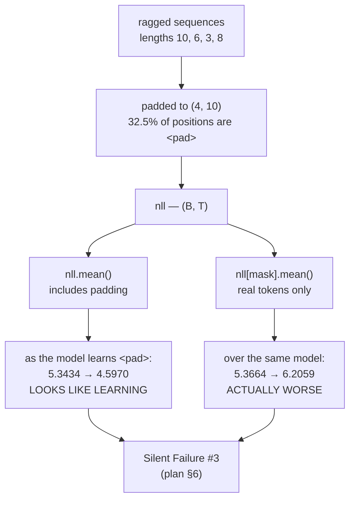

# 2.5 — 💥 The loss that counted padding

## One-line answer

Averaging the loss over padded positions makes the model's easiest possible prediction — "the next
token is `<pad>`" — count towards the reported number, so as the model learns that trick the reported
loss **falls** while the real loss on actual tokens **rises**: measured here at `4.5970` against
`6.2059`, in opposite directions.

---

## The story

A coaching class reports its pass rate.

To keep every batch the same size, the teachers sit the test alongside the students whenever a batch
is short of twenty. The teachers pass, obviously. Nobody thinks of them as students; they are only
there to fill the room.

The pass rate is worked out over everybody who sat the test.

For a while, nothing is wrong, because the teachers are a small part of each batch. Then the class
starts running smaller batches, so more teachers are needed to fill each one — and the reported pass
rate climbs beautifully while the students' pass rate falls.

Every number in that report is a real number about a real test that real people really sat. The
coaching class is getting worse at teaching, and its headline figure is going up.

Nobody lied. The bottom of the fraction included people who were never the point.
---

## The idea in plain language

Real batches are rectangular and real sequences are not. A batch of four sequences of length 10, 6, 3
and 8 is stored as a `(4, 10)` tensor, and the short rows are filled out with a **padding token** —
conventionally id `0`, written `<pad>` — so that the tensor has a shape.

Padding is a storage convention. It carries no information and it is not part of the data. So the loss
must be computed over the **real** positions only, which means:

1. Build a **mask**: `mask = targets != PAD`, a boolean `(B, T)`.
2. Reduce over the masked positions only: `nll[mask].sum() / mask.sum()`, from part
   [2.4](2.4-the-mean-over-what.md).

Miss step 2 and the loss includes a per-position term for predicting `<pad>` given `<pad>`, which is
the easiest prediction in the entire problem. Three things follow, and the third is the one that makes
this Silent Failure #3 from the plan's §6:

**The reported loss is biased downwards**, because the padded terms are easier than the real ones.

**The gradient is polluted.** The model receives a training signal telling it to predict `<pad>` — and
it learns to, quickly, because that pattern is trivially predictable. Capacity that should have gone
into language goes into padding.

**And the two losses move in opposite directions.** As the model gets better at padding, the reported
number falls; but the capacity spent there is capacity not spent on real tokens, so the real loss
rises. Measured below: the unmasked loss goes from `5.3434` to `4.5970` — an apparent 14% improvement —
while the masked loss over the same model goes from `5.3664` to `6.2059`, a 16% *degradation*.

**Nothing raises. The loss curve goes down. The model gets worse.**

The plan's §6 gives the detection directly: *print the label tensor for one batch and count the `-100`s
by hand*. That convention — replacing padded labels with `-100` so the loss function skips them — is
the standard alternative to an explicit mask, and it exists precisely because the mask is so easy to
forget.

---

## Why Akshara needs it

- **Day 51** builds the training loop and this is the failure it must not have. Its checklist requires
  naming which of the five silent failures a run could have hit and how it was ruled out.
- **Day 64** prepares the corpus, where padding first appears, and Day 65 batches it.
- **Day 16 (TOK-16, TOK-17)** introduces `<pad>` alongside the other special tokens and the chat
  template; this part is why `<pad>` needs a plan rather than a value.
- **Day 88 onward**, instruction tuning masks the *prompt* as well as the padding — the loss is computed
  only on the response — which is the same mechanism doing more work, and getting it wrong trains the
  model on its own prompts.
- **Part [3.3](../03-kl-and-perplexity/3.3-the-perplexity-that-improved.md)** shows the same
  contamination reaching perplexity, where it looks even better.

---

## The mechanism

The setup — a realistic ragged batch:

```python
import numpy as np


def log_softmax(z, axis=-1):
    m = z.max(axis=axis, keepdims=True)
    s = z - m
    return s - np.log(np.exp(s).sum(axis=axis, keepdims=True))


rng = np.random.default_rng(1337)
B, T, V, PAD = 4, 10, 50, 0
logits = rng.standard_normal((B, T, V)) * 2          # (B, T, V)
targets = rng.integers(1, V, size=(B, T))            # (B, T) real ids are 1..V-1
lengths = np.array([10, 6, 3, 8])                    # (B,)
for b, L in enumerate(lengths):
    targets[b, L:] = PAD                             # pad the tails
mask = targets != PAD                                # (B, T)

nll = -np.take_along_axis(log_softmax(logits), targets[..., None], axis=-1)[..., 0]   # (B, T)

print(f"  lengths            : {lengths}")
print(f"  real tokens        : {int(mask.sum())} of {B * T}   ({1 - mask.mean():.2%} padding)")
print(f"  loss over ALL      : {float(nll.mean()):.6f}")
print(f"  loss over REAL only: {float(nll[mask].mean()):.6f}")
```

**Line by line:**
- `rng.integers(1, V, ...)` generates ids from `1` upwards, leaving `0` free for `PAD`. Reserving an id
  is how padding is done, and Day 16 is where the reservation is made properly.
- `targets[b, L:] = PAD` fills each row's tail. **This is what a real collate function does**, and it is
  the only thing that makes a rectangular tensor possible.
- `mask = targets != PAD` is the boolean the loss needs. One line, and the whole document is about
  forgetting it.
- Measured on Intel Core i3-1115G4, CPython 3.12.10, numpy 2.5.2, seed 1337, 2026-08-26:

```text
  lengths            : [10  6  3  8]
  real tokens        : 27 of 40   (32.50% padding)
  loss over ALL      : 5.343374
  loss over REAL only: 5.366416
```

**At initialisation the gap is 0.43%** — `5.343374` against `5.366416`. Small. Easy to dismiss. The
model has not yet learned anything, so predicting `<pad>` is exactly as hard as predicting anything
else, and the padded terms are unremarkable.

**That is the trap.** The bug is nearly invisible at step 0 and gets worse from there. Simulate a model
that is learning to predict `<pad>` by raising the `<pad>` logit:

```python
for boost in (0.0, 2.0, 5.0, 10.0):
    lg = logits.copy()
    lg[..., PAD] += boost                            # the model gets better at predicting <pad>
    n = -np.take_along_axis(log_softmax(lg), targets[..., None], axis=-1)[..., 0]
    print(f"  <pad> logit +{boost:4.1f}:  reported (all) {float(n.mean()):.4f}   "
          f"real (masked) {float(n[mask].mean()):.4f}")
```

**Line by line:**
- `lg[..., PAD] += boost` raises the logit of the padding token at **every** position, which is exactly
  what a model trained on padded targets learns to do — `<pad>` follows `<pad>` with near-certainty, so
  the gradient pushes that logit up everywhere.
- The masked loss is computed from the **same** logits, so any difference between the two columns is
  attributable to the reduction alone.
- Measured on this machine, 2026-08-26:

```text
  <pad> logit + 0.0:  reported (all) 5.3434   real (masked) 5.3664
  <pad> logit + 2.0:  reported (all) 4.8301   real (masked) 5.4892
  <pad> logit + 5.0:  reported (all) 4.5970   real (masked) 6.2059
  <pad> logit +10.0:  reported (all) 6.5903   real (masked) 9.7443
```

Read the two columns against each other, because this is the whole document:

**Between `+0` and `+5`, the reported loss falls from `5.3434` to `4.5970`** — a 14% improvement, a
smooth curve, exactly what a training run should look like.

**Over the same range, the real loss rises from `5.3664` to `6.2059`** — a 16% degradation.

**The two curves point in opposite directions**, and only one of them is on the dashboard. A run in this
state looks like it is training well and is destroying itself. It is the plan's §6 Silent Failure #3
exactly: *the loss counted padding or the prompt*.

(At `+10` both columns rise, because the `<pad>` logit has become so large that it distorts every
distribution — including at real positions, where it steals probability mass from the correct token.
So the reported curve eventually turns around too. By then the model is far gone.)



**The two implementations of the fix**, because both are standard and they differ in one important way:

```python
# 1 - an explicit mask
mask = targets != PAD                                 # (B, T)
loss = float(nll[mask].sum() / mask.sum())

# 2 - the -100 label convention
labels = targets.copy()                               # (B, T)
labels[~mask] = -100                                  # the loss function skips these
print("  labels[1]      :", labels[1])
print("  count of -100  :", int((labels == -100).sum()), "  padded positions:", int((~mask).sum()))
```

**Line by line:**
- **Form 1** is explicit and local: the mask is visible at the loss, and anyone reading the line can see
  what is excluded.
- **Form 2** moves the decision to where the labels are built. `-100` is the conventional sentinel
  because it is not a valid token id — it is negative, so it cannot collide with a vocabulary entry —
  and every major framework's cross-entropy has an `ignore_index` defaulting to it.
- **Form 2's advantage is that it composes.** Day 88's instruction tuning masks the *prompt* as well as
  the padding: the same `-100` mechanism covers both, and the loss function does not need to know why a
  position is excluded.
- Measured on this machine, 2026-08-26: `labels[1]` prints
  `[17 9 25 48 28 27 -100 -100 -100 -100]`, and the count of `-100` is `13`, equal to the number of
  padded positions. **That equality is the check**, and it is the plan's §6 detection — *count the
  `-100`s by hand* — written as an assertion.

---

## Shapes

| Tensor | Symbolic shape | Concrete here | What each axis means |
| --- | --- | --- | --- |
| `targets` | `(B, T)` | `(4, 10)` | integer ids; `0` is `<pad>` |
| `lengths` | `(B,)` | `(4,)` | the real length of each sequence |
| `mask` | `(B, T)` | `(4, 10)` | `True` at real positions — `27` of `40` |
| `nll` | `(B, T)` | `(4, 10)` | one loss per position, **including padded ones** |
| `nll.mean()` | `()` | `5.343374` | **wrong** — averages over 40 |
| `nll[mask]` | `(K,)` | `(27,)` | real positions only |
| `nll[mask].mean()` | `()` | `5.366416` | **right** — averages over 27 |
| `labels` with `-100` | `(B, T)` | `(4, 10)` | 13 entries are `-100`, matching `(~mask).sum()` |

The two mean rows differ by `0.43%` at step 0 and by `35%` after the model has learned to predict
`<pad>`. **Both are computed from the same `nll` tensor.**

---

## When it breaks

**It does not break. The loss goes down.** That is the entire failure, and here is what a dashboard
shows:

```text
  step  100  loss 5.3434
  step  500  loss 4.8301
  step 1000  loss 4.5970
```

A clean, monotone, believable curve. Every number is a real average of real per-position losses. The
model behind it is getting **worse** at the only task anybody cares about, measured over the same steps
at `5.3664 → 5.4892 → 6.2059`.

The loud cousin exists and it is worth provoking, because it is the one case that does raise:

```console
>>> mask = np.zeros((4, 10), dtype=bool)
>>> float(nll[mask].sum() / mask.sum())
RuntimeWarning: invalid value encountered in scalar divide
nan
```

An entirely-padded batch gives `0/0`. It happens with a ragged final batch or a filtering step that
removed everything, and under this repository's `filterwarnings = ["error::RuntimeWarning"]` it is an
exception. Part [2.4](2.4-the-mean-over-what.md)'s `mask.any()` assertion is the guard.

**The three checks, and the plan's §6 asks for the first one by name:**

```python
def assert_loss_ignores_padding(targets: np.ndarray, labels: np.ndarray, pad_id: int = 0) -> None:
    """The §6 detection, as an assertion: count the ignored positions by hand."""
    n_pad = int((targets == pad_id).sum())
    n_ignored = int((labels == -100).sum())
    assert n_ignored == n_pad, f"{n_ignored} positions ignored but {n_pad} are padding"
    print(f"  batch: {targets.size} positions, {n_pad} padding, {targets.size - n_pad} counted")
```

**Line by line:**
- This is the plan's §6 check written down: *print the label tensor for one batch and count the `-100`s
  by hand.* Making it an assertion means it runs every time instead of the once somebody remembers.
- The `print` is deliberate and belongs in the run log. **Three numbers — total, padded, counted —
  logged once at step 0** make the whole class of bug visible for the cost of one line.
- Run it on the **first** batch of every run, not in the inner loop.

The second check is a comparison that costs one extra reduction:

```python
masked = float(nll[mask].mean())
unmasked = float(nll.mean())
if abs(masked - unmasked) / masked > 0.01:
    print(f"  WARNING: masked {masked:.4f} vs unmasked {unmasked:.4f} — is the mask applied?")
```

**Line by line:**
- Computing **both** and comparing them turns an invisible difference into a logged number. At step 0
  they differ by 0.43% here; if the mask is applied correctly the reported one is the masked one and the
  gap is *expected* — the point is that the gap is **visible** rather than being a thing nobody looked
  at.
- The threshold is a judgement, and the value matters less than logging both numbers. A gap that
  **grows** over training is the signature; a constant gap is just the padding fraction.

The third is a property of the run rather than of the batch: **track the padding fraction**. At 32.5%
here, a third of every batch is padding, which is worth knowing on its own — it is a third of the
compute spent on nothing, and Day 65's batching-by-length exists to reduce it.

---

## In production

**What a research engineer writes instead of the teaching version.** They use the `-100` label
convention, set where the batch is built, and they never write a mask at the loss — because the same
mechanism has to cover padding *and* prompt masking *and* any other excluded position, and having one
place for it is what keeps those consistent. The loss function's `ignore_index` is checked once against
the collate function's sentinel, in a test.

They also log the three numbers — positions, padded, counted — at step 0 of every run, and record the
padding fraction alongside the loss in the run ledger. Day 1 part
[3.2](../../../day-001-bootstrap-and-map/parts/03-the-ledgers/3.2-runs-md-turns-anecdote-into-result.md)
put a "silent failure ruled out" column in `docs/RUNS.md` for exactly this: *"#3 padding: label tensor
inspected, 13 of 40 are -100"* is a claim somebody can re-run.

**What degrades at scale.** The padding fraction, and therefore the size of the bug. A batch sorted by
length has little padding; a batch drawn at random from a corpus with a wide length distribution can be
majority padding. So the same code has a small bug on one dataset and a dominant one on another, with
nothing in the code changed. **Length-bucketed batching (Day 65) reduces the padding fraction and
therefore reduces the damage — which is a good reason to do it and a terrible reason to skip the mask.**

**The failure that only shows with real data.** Prompt masking, on Day 88. Instruction tuning trains
only on the response, so the prompt's positions must be excluded too. Get that wrong and the model is
trained to predict its own prompt — which it can do very well, since the prompt is right there in the
context — so the loss falls beautifully and the model learns to continue instructions rather than to
follow them. It is the same mechanism as this part, on a much larger fraction of the tokens, and it is
the reason Day 88's checklist asks for the same `-100` count.

**The review comment.** *"`loss = nll.mean()` — that includes the padded positions. Use `ignore_index`
or mask, and log the counted-token count at step 0."*

**The interview question.** *"Your training loss is falling nicely but the model's outputs are getting
worse. Name three causes."* A strong answer has padding contamination on the list, with the mechanism:
padded positions are trivially predictable, so the model learns them fast and the averaged loss falls
while real performance does not. The detail that shows it has happened to them is the observation that
**the two curves move in opposite directions**, and the cheap check — log the masked and unmasked loss
together and watch the gap grow.

**Compute tier: T0.** A `(4, 10, 50)` batch on a laptop CPU, in milliseconds, and the whole failure is
visible in an eight-number table. That is the good news: this bug's complete diagnosis costs nothing at
T0, and its production form costs a Day 67 session and a model that is quietly worse than the
architecture on the whiteboard.

---

## Check yourself

Run this. It prints **two columns that must move in opposite directions**:

```python
import numpy as np


def log_softmax(z, axis=-1):
    m = z.max(axis=axis, keepdims=True)
    s = z - m
    return s - np.log(np.exp(s).sum(axis=axis, keepdims=True))


rng = np.random.default_rng(1337)
B, T, V, PAD = 4, 10, 50, 0
logits = rng.standard_normal((B, T, V)) * 2
targets = rng.integers(1, V, size=(B, T))
for b, L in enumerate([10, 6, 3, 8]):
    targets[b, L:] = PAD
mask = targets != PAD
print(f"real tokens: {int(mask.sum())} of {B * T}  ({1 - mask.mean():.2%} padding)")

for boost in (0.0, 2.0, 5.0, 10.0):
    lg = logits.copy()
    lg[..., PAD] += boost
    n = -np.take_along_axis(log_softmax(lg), targets[..., None], axis=-1)[..., 0]
    print(f"  <pad> logit +{boost:4.1f}:  reported {float(n.mean()):.4f}   real {float(n[mask].mean()):.4f}")

labels = targets.copy()
labels[~mask] = -100
print("labels[1]     :", labels[1])
print("count of -100 :", int((labels == -100).sum()), " padded:", int((~mask).sum()))
```

**Line by line:**
- The four boost rows print `5.3434/5.3664`, `4.8301/5.4892`, `4.5970/6.2059`, `6.5903/9.7443` on this
  machine, 2026-08-26.
- **Between the first and third rows the left column falls 14% and the right column rises 16%.** Say
  out loud which one a dashboard would be showing.
- `labels[1]` prints `[17 9 25 48 28 27 -100 -100 -100 -100]` and the two counts both print `13`. That
  equality is the plan's §6 check — **run it on the first batch of every run you ever do.**

**Say this out loud, without scrolling up:** explain why the reported loss falls while the real loss
rises — and name the two standard fixes, saying which one also covers prompt masking.
