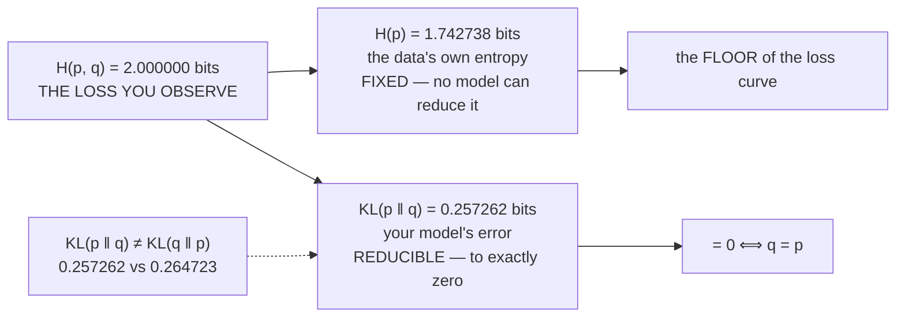

# 3.1 — KL divergence: the extra bits

## One-line answer

KL divergence is exactly the excess of cross-entropy over entropy — `KL(p‖q) = H(p, q) − H(p)` — so it
measures how much your beliefs cost you *above the unavoidable minimum*, it is zero only when the
beliefs are right, and it is **not symmetric**: measured here at `0.257262` one way and `0.264723` the
other.

---

## The story

You take a taxi across town and the meter reads ₹340.

Two completely different things went into that number. First, the distance: there is a shortest route
between where you got in and where you got out, and you were always going to have to pay for that.
Second, whatever this particular driver added on top by going a longer way round.

The meter only shows you the total. You would like the split, because the two halves mean entirely
different things. The distance is the journey itself. The extra is the driver. A better driver can
push the second one all the way down to zero, and can never touch the first.

Cross-entropy is the meter. Entropy is the shortest route. KL is the driver.
---

## The idea in plain language

Part [2.1](../02-cross-entropy/2.1-coding-with-the-wrong-distribution.md) measured three numbers on one
pair of distributions: `H(p) = 1.742738` bits, `H(p, q) = 2.000000` bits, and an excess of `0.257262`.
This part names that excess.

> **`KL(p ‖ q) = H(p, q) − H(p) = Σᵢ p[i] · log( p[i] / q[i] )`**

It is called the **Kullback–Leibler divergence**, or *relative entropy*. Read the second form directly:
for each outcome, the log-ratio of how likely it really is to how likely you thought, weighted by how
often it occurs.

Four properties, and every one of them is used later:

**It is non-negative.** `KL(p ‖ q) ≥ 0` always. That is the same fact as "cross-entropy is at least
entropy" from part 2.1, restated — and it is why entropy is a *floor* rather than a target.

**It is zero exactly when `q = p`.** Not approximately, not usually — exactly, and only. So driving KL
to zero is the same thing as making the beliefs correct.

**It is not a distance.** `KL(p ‖ q) ≠ KL(q ‖ p)` in general, measured below at `0.257262` versus
`0.264723`, and it does not satisfy the triangle inequality either. The word "divergence" rather than
"distance" is doing real work. **Which argument goes first is a modelling decision**, not a
convention — the two orderings penalise different mistakes, and part *In production* below says how.

**It splits the loss into a fixed part and a learnable part.** `H(p, q) = H(p) + KL(p ‖ q)`, and `H(p)`
does not depend on the model at all. So of the loss you observe, one component is the data's own
irreducible uncertainty and the other is your model's error — and **only the second can be reduced.**

That last property is the practically important one, because it answers a question everybody asks:
*how low should the loss go?* Not to zero. To `H(p)` — the entropy of the data — and no lower, ever,
however good the model.

---

## Why Akshara needs it

- **Day 68** is the phase gate where you defend the loss curve. "It plateaued at 3.4" needs the
  companion sentence "and the data's entropy is around X", or it is not a defence.
- **Day 92**'s distillation minimises the KL between a student and a teacher — the general
  two-distribution form, not the one-hot one.
- **Day 94**'s DPO and every RLHF method includes a KL term against a reference model, explicitly, to
  stop the policy drifting. That term is this quantity with two model outputs as its arguments, and
  **its direction is a design choice with consequences.**
- **Day 96** measures the alignment tax, which is a before-and-after comparison whose meaning depends on
  knowing what part of the loss is irreducible.
- **Day 119** makes significance formal, and "is this difference bigger than the floor allows" is a
  question this identity answers.

---

## The mechanism

The identity, verified rather than asserted:

```python
import numpy as np

p = np.array([0.5, 0.25, 0.15, 0.10])       # (V,) the world
q = np.array([0.25, 0.25, 0.25, 0.25])      # (V,) our model: uniform


def H(x):
    return -float(np.where(x > 0, x * np.log2(np.where(x > 0, x, 1.0)), 0.0).sum())


def CE(p, q):
    return -float(np.where(p > 0, p * np.log2(np.where(p > 0, q, 1.0)), 0.0).sum())


def KL(p, q):
    return float(np.where(p > 0, p * np.log2(np.where(p > 0, p / q, 1.0)), 0.0).sum())


print(f"  H(p)       = {H(p):.6f} bits")
print(f"  H(p, q)    = {CE(p, q):.6f} bits")
print(f"  KL(p || q) = {KL(p, q):.6f} bits")
print(f"  H(p) + KL  = {H(p) + KL(p, q):.6f}   equals H(p, q)? {abs(H(p) + KL(p, q) - CE(p, q)) < 1e-12}")
```

**Line by line:**
- All three functions use part
  [1.3](../01-entropy/1.3-the-zero-probability-event.md)'s masking pattern, so a zero in `p` contributes
  exactly nothing rather than a `nan`.
- In `KL`, the masking is on `p` — a zero in `p` kills the term. A zero in **`q`** where `p > 0` makes
  the ratio infinite, correctly: your model ruled out something that happens. That asymmetry is the
  same one part 2.1 discussed.
- `p / q` inside the log, not `q / p`. Getting that backwards computes `−KL`, which is **negative** —
  and a negative divergence is impossible, so it is at least a loud kind of wrong.
- Measured on Intel Core i3-1115G4, CPython 3.12.10, numpy 2.5.2, 2026-08-26:

```text
  H(p)       = 1.742738 bits
  H(p, q)    = 2.000000 bits
  KL(p || q) = 0.257262 bits
  H(p) + KL  = 2.000000   equals H(p, q)? True
```

**`1.742738 + 0.257262 = 2.000000`**, exactly. The loss splits cleanly into the part the data forces on
you and the part your model is responsible for.

The three properties, checked:

```python
print(f"  KL(p || p) = {KL(p, p):.6f}          <- zero exactly at q = p")
print(f"  KL(p || q) = {KL(p, q):.6f} bits")
print(f"  KL(q || p) = {KL(q, p):.6f} bits     <- NOT symmetric")

rng = np.random.default_rng(1337)


def softmax(z, axis=-1):
    e = np.exp(z - z.max(axis=axis, keepdims=True))
    return e / e.sum(axis=axis, keepdims=True)


violations = sum(1 for _ in range(200)
                 if KL(softmax(rng.standard_normal(8) * 2), softmax(rng.standard_normal(8) * 2)) < -1e-12)
print(f"  negative KL in 200 random pairs: {violations}")
```

**Line by line:**
- `KL(p, p)` prints `0.000000` — exactly zero, because every log-ratio is `log(1) = 0`.
- `KL(p, q)` and `KL(q, p)` print `0.257262` and `0.264723`. **Different numbers**, close enough to be
  confusable and far enough apart to matter.
- The 200-pair check tests non-negativity empirically rather than taking it on faith, and prints `0`
  violations. A tolerance of `-1e-12` allows for floating-point rounding around zero; demanding `>= 0`
  exactly would fail occasionally on correct code, which is Day 4 part
  [2.2](../../../day-004-backprop-and-gradcheck/parts/02-gradient-checking/2.2-the-relative-error-criterion.md)'s
  lesson again.

The split, drawn, because it is the picture to carry into every loss curve you ever look at:



**And the two directions, because the choice is real.** The two orderings penalise different failures:

```python
truth = np.array([0.5, 0.5, 0.0, 0.0])                # (V,) mass on two outcomes only
narrow = np.array([0.98, 0.02, 0.0, 0.0])             # (V,) commits, but stays on the support
broad = np.array([0.25, 0.25, 0.25, 0.25])            # (V,) hedges onto impossible outcomes

for name, model in (("narrow", narrow), ("broad", broad)):
    print(f"  {name:7s} forward KL(truth||model) = {KL(truth, model):.6f}   "
          f"reverse KL(model||truth) = {KL(model, truth)}")
```

**Line by line:**
- `truth` has two impossible outcomes. `narrow` bets almost everything on one of the possible ones;
  `broad` spreads evenly, including onto the impossible ones.
- `KL(truth ‖ model)` — the **forward** direction, the one cross-entropy training uses — weights by the
  *truth*, so it punishes a model that assigns low probability to something that happens. It is
  **mode-covering**: to score well, the model must put mass everywhere the truth does.
- `KL(model ‖ truth)` — the **reverse** direction — weights by the *model*, so it punishes a model that
  puts mass where the truth has none. It is **mode-seeking**: the model is safest concentrating on one
  region the truth supports.
- Measured on this machine, 2026-08-26:

```text
  narrow  forward KL(truth||model) = 1.836501   reverse KL(model||truth) = 0.8585594574581793
  broad   forward KL(truth||model) = 1.000000   reverse KL(model||truth) = inf
```

- **Read the two rows against each other and the directions swap their verdict.** Forward KL prefers
  `broad` (`1.000` against `1.837`): hedging is safe because the truth's mass is covered. Reverse KL
  prefers `narrow` (`0.859` against `inf`): committing is safe because no mass is placed where the
  truth has none.
- **The `inf` is the sharpest form of it.** `broad` puts probability on outcomes the truth calls
  impossible, and the reverse KL — which logs `truth/model` weighted by `model` — divides by zero
  there. The forward direction does not care, because those terms are weighted by `truth = 0`.
- So training with the forward direction (which is what cross-entropy does) tolerates a model that
  hedges; the reverse direction punishes hedging severely and tolerates a model that ignores whole
  modes. Day 94's RLHF penalty uses this deliberately.

---

## Shapes

| Tensor | Symbolic shape | Concrete here | What each axis means |
| --- | --- | --- | --- |
| `p`, `q` | `(V,)` | `(4,)` | two distributions over the same outcomes |
| `p / q` | `(V,)` | `(4,)` | the likelihood ratio, elementwise |
| `KL(p, q)` | `()` | `0.257262` bits | one number for the pair |
| batched | `(B, T, V)` each | `(4, 10, 50)` | one pair per position |
| `KL` batched | `(B, T)` | `(4, 10)` | one divergence per position; reduce as in part 2.4 |

---

## When it breaks

The loud one, from a model that rules out something possible:

```console
>>> KL(np.array([0.5, 0.5, 0.0, 0.0]), np.array([0.25, 0.25, 0.25, 0.25]))
1.0
>>> KL(np.array([0.25, 0.25, 0.25, 0.25]), np.array([0.5, 0.5, 0.0, 0.0]))
RuntimeWarning: divide by zero encountered in divide
inf
```

Verbatim on this machine, 2026-08-26. Reversing the arguments turns a finite `1.0` into `inf`, because
the second argument now has zeros where the first has mass. **`inf` is the correct answer** and it is
also, under this repository's warning settings, an exception that stops the run — which is what you
want when a KL term in a loss becomes infinite.

The other loud one, from inverting the ratio:

```console
>>> -KL(p, q)
-0.2572616...
```

A **negative** divergence. Not an error, but impossible — KL is non-negative by construction. Any
negative value means the ratio is the wrong way up or the arguments are swapped, and asserting
non-negativity catches it immediately.

**The silent version, and it is the argument order.**

```console
>>> KL(p, q)
0.257262...
>>> KL(q, p)
0.264723...
```

Two finite numbers within 3% of each other. Nothing raises. In a distillation or RLHF loss, both
directions are used in the literature for different reasons, both decrease as the models converge, and
a codebase using the wrong one **trains successfully towards a different objective**. The symptom is a
model that is subtly more or less hedged than intended, which nobody attributes to a KL direction.

The checks, and there are three:

```python
def kl_divergence(p: np.ndarray, q: np.ndarray, axis: int = -1) -> np.ndarray:
    """KL(p || q): the extra cost of believing q when the world is p. Forward = mode-covering."""
    assert p.shape == q.shape, f"{p.shape} vs {q.shape}"
    assert (q[p > 0] > 0).all(), "q assigns zero probability where p does not — KL is infinite"
    ratio = np.where(p > 0, p / np.where(p > 0, q, 1.0), 1.0)
    result = np.where(p > 0, p * np.log2(ratio), 0.0).sum(axis=axis)
    assert (result >= -1e-12).all(), f"KL is negative ({result.min()}) — arguments swapped?"
    return result
```

**Line by line:**
- The docstring states **which direction** and **what it implies** (`mode-covering`), because the name
  alone does not.
- The `q > 0` assertion converts an `inf` into a message naming the cause. In a training loss, an `inf`
  KL term is not recoverable and finding out why immediately is worth the check.
- `-1e-12` rather than `0` in the non-negativity assertion, for the rounding reason above.
- **The non-negativity assertion is the one that catches a swap**, because a swap that produces a
  negative value is caught instantly — and a swap that does not is caught by the docstring being read.
- The `where` guards are part 1.3's pattern, applied twice: once inside the ratio to stop the division
  warning, once outside to zero the term.

---

## In production

**What a research engineer writes instead of the teaching version.** They compute KL from
**log-probabilities**, never from probabilities: `KL = Σ p · (log p − log q)`, with both logs coming
from a `log_softmax` (part [2.3](../02-cross-entropy/2.3-why-this-is-the-loss.md)). That avoids the
division, avoids `log(0)`, and avoids materialising either probability tensor. Every framework's KL
loss has an interface built around log-inputs for this reason, and passing probabilities where logs are
expected is a classic and silent error — the result is finite and wrong.

The direction is stated in the code and in the paper. In distillation, forward KL against the teacher is
usual (the student should cover everything the teacher does). In RLHF, the penalty is against a
reference policy and the direction is a deliberate choice affecting how much the policy is allowed to
narrow.

**What degrades at scale.** Nothing about the definition, but the **floor** matters more as models get
better. Early in training, `KL(p ‖ q)` dominates the loss and `H(p)` is a rounding detail; late in
training the reverse is true, and improvements get smaller because most of what is left is irreducible.
A team that does not know `H(p)` will read that flattening as a failure of the model rather than as the
model approaching the data's entropy. Day 68's gate exists to force that number to be estimated.

**The failure that only shows with real data.** An infinite KL from a truncated distribution. Any
sampling truncation (Day 70's top-k, top-p) sets probabilities to exactly zero; if a KL is then computed
against an untruncated reference, the term is `inf` wherever the reference has mass and the truncated
model has none. That combination arises naturally in RLHF pipelines, it is not obvious from either
component, and it produces a `nan` loss on some batches and not others.

**The review comment.** *"`kl(a, b)` — which is the reference? Say the direction in the name or the
docstring; the two are different objectives and both are finite."*

**The interview question.** *"How low can a language model's loss go?"* The strong answer is the
identity: cross-entropy is `H(p) + KL(p ‖ q)`, the KL term goes to zero for a perfect model, so the
floor is the data's entropy `H(p)` — not zero. Then the practical consequence: a loss curve flattening
near that floor is a model that has learned what there is to learn, and a curve flattening far above it
has not. Adding that KL is asymmetric and that the direction is a modelling choice is what separates
having used it from having defined it.

**Compute tier: T0.** Four-element distributions on a laptop CPU. The T0 version proves the **identity,
the non-negativity, the zero-at-equality and the asymmetry** exactly — all four are mathematics and
transfer everywhere. What it does not show is estimating `H(p)` for a real corpus, which is a genuinely
hard problem and is Day 68's.

---

## Check yourself

Run this. It prints **an identity that must hold exactly, two asymmetric numbers, and one `inf`**:

```python
import numpy as np


def H(x):
    return -float(np.where(x > 0, x * np.log2(np.where(x > 0, x, 1.0)), 0.0).sum())


def CE(p, q):
    return -float(np.where(p > 0, p * np.log2(np.where(p > 0, q, 1.0)), 0.0).sum())


def KL(p, q):
    with np.errstate(divide="ignore", invalid="ignore"):
        return float(np.where(p > 0, p * np.log2(np.where(p > 0, p / q, 1.0)), 0.0).sum())


p = np.array([0.5, 0.25, 0.15, 0.10])
q = np.array([0.25, 0.25, 0.25, 0.25])
print(f"H(p) {H(p):.6f} + KL {KL(p, q):.6f} = {H(p) + KL(p, q):.6f}   H(p,q) = {CE(p, q):.6f}")
print(f"KL(p||p) = {KL(p, p):.6f}")
print(f"KL(p||q) = {KL(p, q):.6f}   KL(q||p) = {KL(q, p):.6f}")

truth = np.array([0.5, 0.5, 0.0, 0.0])
broad = np.array([0.25, 0.25, 0.25, 0.25])
print(f"forward KL(truth||broad) = {KL(truth, broad):.6f}")
print(f"reverse KL(broad||truth) = {KL(broad, truth)}")
```

**Line by line:**
- The first line prints `1.742738 + 0.257262 = 2.000000` against `H(p,q) = 2.000000`. **Exact.**
- `KL(p||p)` prints `0.000000`.
- The two directions print `0.257262` and `0.264723`. Say out loud which one cross-entropy training
  uses.
- The last line prints `inf`. **The forward direction is finite and the reverse is not**, on the same
  pair — say why before moving on.

**Say this out loud, without scrolling up:** state the identity linking entropy, cross-entropy and KL —
and say what it tells you about how low a loss curve can go.
