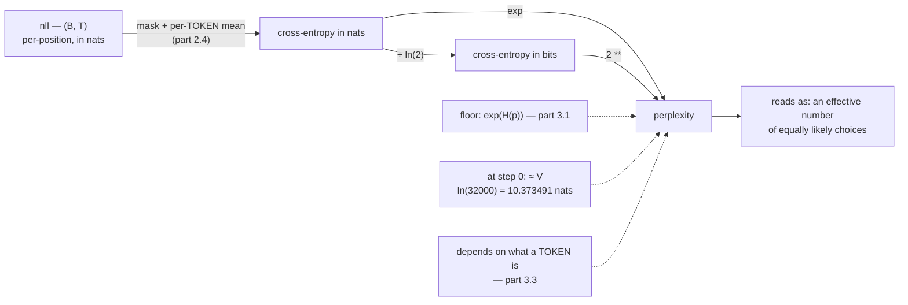

# 3.2 — Perplexity: cross-entropy wearing an exponent

## One-line answer

Perplexity is `exp` of the per-token cross-entropy in nats, and it reads as an **effective number of
equally likely choices** — a model with perplexity 50 is as uncertain as one guessing uniformly among
50 tokens, measured exactly at `50.00` for a uniform distribution over 50.

---

## The story

A quiz night reports how a team did, in two different ways.

The scorekeeper's number is worked out from the answer probabilities, and it is exactly the number
somebody doing statistics would want. It gets read out to the room, and nothing happens. Nobody
reacts, because nobody has any feel at all for `3.912`.

So the host converts it. "This team is answering as though every question had fifty equally likely
answers and they were just picking one." The room laughs, because everybody can picture a question
with fifty possible answers, and everybody knows exactly what guessing feels like.

It is the same information both times. One number is for computing with, the other is for talking
about, and getting from one to the other is a single button on a calculator.
---

## The idea in plain language

Part [2.4](../02-cross-entropy/2.4-the-mean-over-what.md) produced a per-token cross-entropy in nats.
Perplexity is:

> **`perplexity = exp(cross-entropy in nats) = 2 ^ (cross-entropy in bits)`**

Both forms give the same number — they are the same quantity in different log bases, exactly as part
[1.1](../01-entropy/1.1-surprise-measured.md) described.

The interpretation is what makes it useful. If a model's per-token cross-entropy equals that of a
uniform distribution over `k` outcomes, its perplexity is exactly `k`. So perplexity is the **effective
branching factor**: the number of equally likely alternatives the model is effectively choosing among
at each step. Measured below: a uniform distribution over 50 gives perplexity `50.00`, and over 32,000
gives `32000.00`.

Three properties follow:

**Its floor is `exp(H(p))`**, not 1 — because part [3.1](3.1-kl-the-extra-bits.md) established that
cross-entropy cannot go below the data's entropy. A perplexity of 1 would mean a model that predicts
every token with certainty, which is only possible for data with no uncertainty in it.

**Its ceiling at initialisation is `V`.** An untrained model is roughly uniform, so its perplexity is
about the vocabulary size — which is a genuinely useful check at step 0.

**It is monotone in the loss**, so it never ranks two models differently from the loss does. It carries
no extra information; it is a presentation choice.

And the property that causes all the trouble, which part
[3.3](3.3-the-perplexity-that-improved.md) is about: **it is defined per token, so it depends on what a
token is.** Two tokenizations of the same text give different perplexities for the same underlying
model quality — measured in part 3.3 at a factor of 42 — so a perplexity number without its tokenizer
is not comparable to anything.

Two more conditions that are easy to violate:

- It must be `exp` of the **per-token mean** (part 2.4), not of a sum and not of a per-sequence mean.
  Exponentiating either of the others gives a number in a plausible range that is not a perplexity.
- The cross-entropy must be in **nats** if you use `exp`. Using `exp` on a bits figure gives a number
  wrong by a power, which is Day 6 part
  [1.1](../01-entropy/1.1-surprise-measured.md)'s unit trap arriving with real consequences.

---

## Why Akshara needs it

- **Day 68** is the phase gate where the loss curve is defended, and perplexity is how the number is
  communicated.
- **Day 112–119** is the evaluation phase, where perplexity on held-out data is one of the headline
  numbers — and where part [3.3](3.3-the-perplexity-that-improved.md)'s trap has to be understood
  before any comparison is made.
- **Day 17 (TOK-20)** chooses a vocabulary size, and part 3.3 shows why that choice moves perplexity
  without moving model quality.
- **Day 78 onward** quantizes, and "how many points of perplexity did that cost" is the standard way
  the damage is reported — Principle 10 requires it be reported honestly.

---

## The mechanism

The definition, and the interpretation check:

```python
import numpy as np

for name, ce_nats in [("uniform over 2", np.log(2)),
                      ("uniform over 4", np.log(4)),
                      ("uniform over 50", np.log(50)),
                      ("uniform over 32000", np.log(32000))]:
    print(f"  {name:20s} CE {ce_nats:8.4f} nats -> perplexity {np.exp(ce_nats):10.2f}")
```

**Line by line:**
- The cross-entropy of a uniform distribution over `k` outcomes is `ln(k)` nats (part
  [1.2](../01-entropy/1.2-entropy-in-bits-and-nats.md) measured entropy at exactly `log(V)` for a
  uniform, and for a uniform model against any data the cross-entropy is the same `log(V)` — part
  [2.1](../02-cross-entropy/2.1-coding-with-the-wrong-distribution.md) measured that too).
- Measured on Intel Core i3-1115G4, CPython 3.12.10, numpy 2.5.2, 2026-08-26:

```text
  uniform over 2       CE   0.6931 nats -> perplexity       2.00
  uniform over 4       CE   1.3863 nats -> perplexity       4.00
  uniform over 50      CE   3.9120 nats -> perplexity      50.00
  uniform over 32000   CE  10.3735 nats -> perplexity   32000.00
```

**Exact, every row.** `exp(ln(k)) = k`, so the interpretation is not an analogy — for a uniform
distribution the perplexity *is* the number of choices. For a non-uniform one it is the number of
equally-likely choices that would be **equally hard**, which is the "effective branching factor"
reading.

The two units, giving the same answer:

```python
ce_nats = 2.5
ce_bits = ce_nats / np.log(2)
print(f"  CE {ce_nats} nats -> exp    : {np.exp(ce_nats):.6f}")
print(f"  CE {ce_bits:.6f} bits -> 2** : {2 ** ce_bits:.6f}")
```

**Line by line:**
- Measured on this machine, 2026-08-26: both print `12.182494`.
- **`exp` pairs with nats and `2 **` pairs with bits.** Mixing them — `exp` of a bits figure — gives
  `exp(3.6067) = 36.85` instead of `12.18`, a factor of three, from one unit confusion. That is part
  [1.1](../01-entropy/1.1-surprise-measured.md)'s trap, and here it produces a number that is still in a
  plausible range for a perplexity.

The step-zero check, which is the most useful thing this document contains:

```python
V = 32000
print(f"  an untrained model over V={V} should have:")
print(f"    loss       ~ ln(V) = {np.log(V):.6f} nats")
print(f"    perplexity ~ V     = {V}")
```

**Line by line:**
- A freshly-initialised model has near-uniform output (small random logits), so its cross-entropy is
  near `ln(V)`.
- Measured on this machine, 2026-08-26: `ln(32000) = 10.373491`.
- **Check this at step 0 of every run.** A first-step loss much *below* `ln(V)` means the model is
  seeing the answer — part
  [2.2](../02-cross-entropy/2.2-nll-is-cross-entropy-with-a-one-hot.md)'s unshifted-target bug, or
  padding contamination from part [2.5](../02-cross-entropy/2.5-the-loss-that-counted-padding.md). A
  first-step loss much *above* it means the initialisation is broken. It is one line and it catches two
  entire classes of bug before any compute is spent.

Turning a real batch's loss into perplexity, with the conditions enforced:

```python
def perplexity(nll: np.ndarray, mask: np.ndarray) -> float:
    """exp of the per-token mean NLL, in nats. Both conditions are asserted, not assumed."""
    assert nll.shape == mask.shape, f"{nll.shape} vs {mask.shape}"
    assert mask.any(), "no real tokens — perplexity is undefined for an empty batch"
    per_token_mean = float(nll[mask].sum() / mask.sum())
    return float(np.exp(per_token_mean))
```

**Line by line:**
- The function takes `nll` **and** `mask`, so padding cannot be forgotten — the interface makes the
  right thing the only thing. Part [2.5](../02-cross-entropy/2.5-the-loss-that-counted-padding.md) is
  why.
- `nll[mask].sum() / mask.sum()` is the **per-token** mean specifically, not any of part 2.4's other
  reductions. The docstring says so, because exponentiating a different reduction gives a
  plausible-looking non-perplexity.
- `np.exp`, so the input must be in nats. The function name does not say "nats" and it should — that is
  a real weakness of this signature and naming it `perplexity_from_nats` would be better.
- `mask.any()` guards the `0/0` from part 2.4.



---

## Shapes

| Tensor | Symbolic shape | Concrete here | What each axis means |
| --- | --- | --- | --- |
| `nll` | `(B, T)` | `(4, 10)` | per-position loss in nats |
| `mask` | `(B, T)` | `(4, 10)` | real positions only |
| per-token mean | `()` | scalar | the **only** reduction perplexity is defined against |
| `perplexity` | `()` | scalar | `exp` of the above |
| step-0 expectation | `()` | `V` | `32000`, with loss `ln(V) = 10.373491` |

---

## When it breaks

The loud one, from an empty mask:

```console
>>> perplexity(nll, np.zeros((4, 10), dtype=bool))
Traceback (most recent call last):
  File "<stdin>", line 1, in <module>
AssertionError: no real tokens — perplexity is undefined for an empty batch
```

Without the assertion this is `exp(nan) = nan`, which propagates into a logged metric and looks like a
diverged run rather than an empty batch.

The other loud one, from a loss that has already gone wrong:

```console
>>> np.exp(np.inf)
np.float64(inf)
>>> np.exp(800.0)
RuntimeWarning: overflow encountered in exp
np.float64(inf)
```

Verbatim on this machine, 2026-08-26. **A cross-entropy above about 709 nats overflows `exp` in
`float64`** — `np.log(np.finfo(np.float64).max)` is `709.782712893384`, measured here. That never
happens for a sane model (a loss of 709 nats over a 32,000-token vocabulary would be absurd) but it
happens immediately for a diverged one, so `inf` perplexity is a symptom of an upstream problem rather
than a perplexity problem.

**The silent versions, and there are three, all producing a plausible number.**

*One: the wrong unit.* `exp` applied to a bits figure. Measured above: `12.18` becomes `36.85`, a factor
of three, and both are believable perplexities.

*Two: the wrong reduction.* `exp` of a per-sequence mean rather than a per-token mean. Part
[2.4](../02-cross-entropy/2.4-the-mean-over-what.md) measured those at `5.366416` and `5.413519` on one
batch — so the two perplexities are `214.09` and `224.42`, a 5% difference from a choice nobody
recorded.

*Three: padding included.* Part [2.5](../02-cross-entropy/2.5-the-loss-that-counted-padding.md) measured
losses of `4.5970` and `6.2059` on the same model, giving perplexities of `99.19` and `495.66` — a
factor of five. **The contaminated one looks far better**, and part
[3.3](3.3-the-perplexity-that-improved.md) is that failure in full.

The check that covers all three is a habit rather than an assertion: **report the loss and the
perplexity together, with the unit and the reduction named.**

```python
print(f"step {step:6d}  loss {loss:.4f} nats/token (masked, {n_tokens} tokens)  ppl {np.exp(loss):.2f}")
```

**Line by line:**
- The unit (`nats/token`), the reduction (`masked`, per token), and the token count are all in the log
  line. **A number with its definition attached can be compared; one without cannot.**
- Printing both the loss and the perplexity costs nothing and makes a unit error visible: if the loss is
  `3.9` and the perplexity is `36.85` rather than `50`, something is wrong with the exponent.
- The token count is the third number from part
  [2.5](../02-cross-entropy/2.5-the-loss-that-counted-padding.md)'s check, and having it in the same
  line is how padding contamination becomes visible over a run.

---

## In production

**What a research engineer writes instead of the teaching version.** They report perplexity **with its
tokenizer named**, because part [3.3](3.3-the-perplexity-that-improved.md) shows the number is
meaningless without it. Where models with different tokenizers must be compared, they report
**bits per byte** or bits per character instead — a per-*byte* figure is tokenizer-independent, since a
byte is a byte whatever the vocabulary — and that is the standard fix.

They also never compute perplexity from a sum, and they treat it as a presentation of the loss rather
than a separate metric: it is monotone in the loss, so it ranks nothing differently. Where a decision
depends on it, the loss is what is actually compared.

**What degrades at scale.** Nothing in the arithmetic, but the *interpretation* stretches. At `V =
32,000`, a perplexity of 20 means the model is effectively choosing among 20 of 32,000 tokens — an
enormous reduction — while at `V = 256` (a byte-level tokenizer, Day 10) a perplexity of 20 is much
weaker. **The same perplexity means different things at different vocabulary sizes**, which is the
shallow version of part 3.3's trap.

**The failure that only shows with real data.** Perplexity on a held-out set that is not held out.
Contamination (Silent Failure #1, plan §6) makes perplexity fall dramatically, because the model has
memorised the text rather than learned the language. It looks exactly like a better model. Day 118's
n-gram overlap check exists for this, and no amount of care with the perplexity computation itself
substitutes for it.

**The review comment.** *"This reports perplexity — from which reduction, in which unit, and with which
tokenizer? None of those are in the log line."*

**The interview question.** *"What does a perplexity of 20 mean?"* The strong answer is the effective
branching factor: the model is as uncertain as one choosing uniformly among 20 options. Then the
qualifications that show it has been used: it depends on the tokenizer, so it is not comparable across
them; its floor is the data's entropy rather than 1; and at step 0 it should be about the vocabulary
size, which is a free sanity check.

**Compute tier: T0.** Scalar arithmetic on a laptop CPU. Every number here — `exp(ln(k)) = k`, the
overflow threshold at `709.782712893384`, the unit conversion — is exact IEEE-754 arithmetic and
transfers everywhere.

---

## Check yourself

Run this. It prints **four perplexities that must equal their vocabulary sizes exactly, and two numbers
that must be identical**:

```python
import numpy as np

for k in (2, 4, 50, 32000):
    print(f"  uniform over {k:6d}: CE {np.log(k):8.4f} nats -> perplexity {np.exp(np.log(k)):10.2f}")

ce_nats = 2.5
print("exp of nats :", f"{np.exp(ce_nats):.6f}")
print("2** of bits :", f"{2 ** (ce_nats / np.log(2)):.6f}")
print("exp of BITS (wrong):", f"{np.exp(ce_nats / np.log(2)):.6f}")

print("ln(float64 max):", np.log(np.finfo(np.float64).max))
```

**Line by line:**
- The four perplexities print `2.00`, `4.00`, `50.00` and `32000.00` — **exactly** their vocabulary
  sizes.
- The two correct conversions both print `12.182494`. The deliberately wrong one prints `36.845651` —
  a factor of three, and a perfectly plausible perplexity. **Say out loud which unit each exponent
  pairs with.**
- The last line prints `709.782712893384`. A cross-entropy above that overflows `exp`; write it down as
  the point where an `inf` perplexity means "the loss diverged", not "the perplexity code is broken".

**Say this out loud, without scrolling up:** state what perplexity means in one sentence with the word
*choices* in it — and give the two things a perplexity number is meaningless without.
