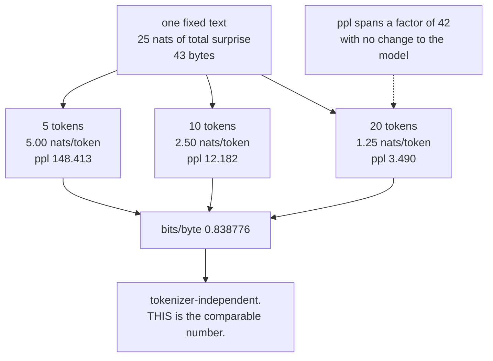

# 3.3 — 💥 The perplexity that improved because the vocabulary changed

## One-line answer

Perplexity is *per token*, so the same text carrying the same total information gives perplexities of
`148.413`, `12.182` and `3.490` under three tokenizations — a factor of **42** from a change that
touched no model weights at all.

---

## The story

Two shops quote for cutting the same length of cloth, and both of them quote "per piece".

The first shop cuts small pieces. Ninety pieces, and each one is cheap.

The second shop cuts large pieces. Six pieces, and each one is expensive.

You compare the two per-piece prices, see that the first shop is fifteen times cheaper, and place your
order there. The bill arrives, and it is for ninety pieces.

Nothing was misquoted. Both of those numbers really are correct prices per piece. It is just that "a
piece" was never the same thing in the two quotes — and "per piece" reads as though it were.
---

## The idea in plain language

Part [3.2](3.2-perplexity.md) defined perplexity as `exp` of the **per-token** cross-entropy. The
per-token part is the whole of this document.

Consider a fixed piece of text carrying a fixed amount of information — say 25 nats' worth. Tokenize it
three ways:

- A coarse tokenizer produces **5** tokens. Each carries `25/5 = 5.0` nats.
- A middling one produces **10** tokens, at `2.5` nats each.
- A fine one, close to characters, produces **20** tokens, at `1.25` nats each.

The perplexities are `exp(5.0) = 148.413`, `exp(2.5) = 12.182` and `exp(1.25) = 3.490`. **The same
text. The same total surprise. The same model quality. A factor of 42 between the first and third
number.**

Two consequences, and both are load-bearing:

**Perplexity is not comparable across tokenizers.** Not "roughly comparable", not "comparable with a
caveat" — a change in vocabulary size moves it by a factor with no relation to model quality. A
comparison between two models with different tokenizers is meaningless unless the number is converted
to a tokenizer-independent unit.

**The direction is counter-intuitive.** A *finer* tokenizer gives a *lower* perplexity, because each
token carries less information and is therefore easier to predict. So "we improved perplexity from 30
to 12" can mean "we made the vocabulary smaller", which is not an improvement in anything.

The fix is a unit that does not depend on the segmentation. **Bits per byte** — total bits divided by
the number of *bytes* of original text — is the standard one, because a byte is a byte under any
tokenizer (Day 10, TOK-04, is where bytes become the floor everything stands on). Bits per character
works the same way where character counts are meaningful.

And then the second contamination, which is the same failure arriving through part
[2.5](../02-cross-entropy/2.5-the-loss-that-counted-padding.md): **padding is easy, so including it
lowers perplexity too**. Measured below: a model whose real-token perplexity is `197.41` reports
`37.29` once a third of its positions are padding. That is a fivefold "improvement" from a batching
decision.

---

## Why Akshara needs it

- **Day 17 (TOK-20)** chooses a vocabulary size, and this is the trap that makes the choice look like a
  free win. **A bigger vocabulary raises perplexity and is often the better choice**; a smaller one
  lowers it and is often worse.
- **Day 14 and Day 15** compare tokenizers directly. Any perplexity number quoted across that comparison
  needs the conversion below.
- **Day 112–119** is the evaluation phase, where perplexity is reported and compared. Every comparison
  there has to state its tokenizer or convert.
- **Day 68**'s gate defends a loss curve, and "the perplexity went down" is not a defence if the
  tokenizer changed between the two runs.
- **Day 78 onward** quantizes and reports perplexity damage — a comparison that is only valid because
  the tokenizer is held fixed, which is worth saying out loud.

---

## The mechanism

The same text, three tokenizations:

```python
import numpy as np

total_nats = 25.0                                  # the information in one fixed piece of text

for n_tokens in (5, 10, 20):
    per_token = total_nats / n_tokens
    print(f"  {n_tokens:3d} tokens: {per_token:.4f} nats/token -> perplexity {np.exp(per_token):8.3f}")
```

**Line by line:**
- `total_nats` is held **fixed**. That is the whole construction: the text is the same, the model's
  total surprise at it is the same, and only the segmentation changes.
- Dividing by `n_tokens` is the per-token reduction from part
  [2.4](../02-cross-entropy/2.4-the-mean-over-what.md) — the one perplexity is defined against.
- Measured on Intel Core i3-1115G4, CPython 3.12.10, numpy 2.5.2, 2026-08-26:

```text
    5 tokens: 5.0000 nats/token -> perplexity  148.413
   10 tokens: 2.5000 nats/token -> perplexity   12.182
   20 tokens: 1.2500 nats/token -> perplexity    3.490
```

**Three numbers, one text, one model.** `148.413 / 3.490 = 42.5`. If those were two rows of a results
table, the second model would look transformatively better and the only difference would be its
tokenizer.

Note also that the effect is **exponential in the token count**, not linear: halving the tokens per
unit of text squares the perplexity. So the trap gets worse the further apart the tokenizers are, and a
byte-level tokenizer (Day 10) versus a 32,000-token BPE (Day 12) is very far apart.

The fix — a unit that does not move:

```python
text = "the quick brown fox jumps over the lazy dog"
n_bytes = len(text.encode("utf-8"))
total_bits = total_nats / np.log(2)

for n_tokens in (5, 10, 20):
    print(f"  {n_tokens:3d} tokens: ppl {np.exp(total_nats / n_tokens):8.3f}   "
          f"bits/byte {total_bits / n_bytes:.6f}")
```

**Line by line:**
- `text.encode("utf-8")` gives the byte length, which Day 10 (TOK-04) establishes as the one
  representation every tokenizer agrees on. `len(text)` would give *characters*, which is also
  reasonable and is **not** the same number for non-ASCII text — Day 10 part 1.4 is the difference.
- `total_bits / n_bytes` divides the same total information by a count that **does not depend on the
  tokenizer**.
- Measured on this machine, 2026-08-26: `n_bytes = 43`, and the bits/byte column prints `0.838776` on
  **all three rows** while the perplexity column spans a factor of 42.
- **That is the fix in one column.** Bits per byte is the number to report when tokenizers differ, and
  it is why published comparisons across tokenizers use it.



**The second contamination: padding.** A model that is good at predicting `<pad>` and bad at everything
else:

```python
def softmax(z, axis=-1):
    e = np.exp(z - z.max(axis=axis, keepdims=True))
    return e / e.sum(axis=axis, keepdims=True)


rng = np.random.default_rng(1337)
V = 50
z = np.zeros(V); z[0] = 5.0                        # (V,) most mass on token 0 = <pad>
p_model = softmax(z)

real = rng.integers(1, V, size=1000)               # (1000,) real tokens, never 0
pads = np.zeros(500, dtype=int)                    # (500,)  padding


def ce_of(targets):
    return float(-np.log(p_model[targets]).mean())


for name, targets in (("real tokens only", real), ("padding only", pads),
                      ("the mixture", np.concatenate([real, pads]))):
    ce = ce_of(targets)
    print(f"  {name:17s} CE {ce:.4f} nats -> perplexity {np.exp(ce):7.2f}")
```

**Line by line:**
- `z[0] = 5.0` makes token `0` — the padding token — far more likely than any other. Measured:
  `p_model[0] = 0.75179`. This is what a model trained on unmasked padded targets learns, and part
  [2.5](../02-cross-entropy/2.5-the-loss-that-counted-padding.md) measured the loss doing exactly that.
- `real` draws ids from `1` upwards, so the padding token never appears as a real target.
- The three rows use the **same model**; only the set of positions changes.
- Measured on this machine, 2026-08-26:

```text
  real tokens only  CE 5.2853 nats -> perplexity  197.41
  padding only      CE 0.2853 nats -> perplexity    1.33
  the mixture       CE 3.6186 nats -> perplexity   37.29
```

**Perplexity `1.33` on the padding.** That is close to the theoretical minimum of 1 — the model is
almost certain, because predicting `<pad>` after `<pad>` is trivial. And it drags the mixture down from
`197.41` to `37.29`, a factor of **5.3**, on a model that is genuinely terrible at the actual task.

A report saying "perplexity 37" is not lying. It is quoting the mixture, which nobody asked for.

---

## Shapes

| Tensor | Symbolic shape | Concrete here | What each axis means |
| --- | --- | --- | --- |
| the text | — | 43 bytes | the tokenizer-independent quantity |
| token counts | — | `5`, `10`, `20` | three segmentations of the same text |
| per-token nats | `()` | `5.0`, `2.5`, `1.25` | the same total, divided three ways |
| perplexity | `()` | `148.413`, `12.182`, `3.490` | spans a factor of 42 |
| bits per byte | `()` | `0.838776` | **identical in all three** — the comparable number |
| `real` targets | `(N,)` | `(1000,)` | ids `1..V-1` |
| `pads` targets | `(M,)` | `(500,)` | id `0` |
| mixture perplexity | `()` | `37.29` | against `197.41` on real tokens alone |

---

## When it breaks

**It does not break. The number improves.** Here is what a results table looks like:

```text
  model A (32k vocab):  perplexity 148.41
  model B (8k vocab) :  perplexity  12.18
```

Model B looks eleven times better. It is the same model. Nothing in the table is false and nothing in
it is comparable.

And the padded version:

```text
  before batching change:  perplexity 197.41
  after  batching change:  perplexity  37.29
```

A fivefold improvement from a change to how sequences are padded.

**The three checks, in order of how much they buy:**

```python
def report_perplexity(total_nats: float, n_tokens: int, n_bytes: int, tokenizer_name: str) -> dict:
    """Report perplexity WITH the two things that make it comparable."""
    assert n_tokens > 0 and n_bytes > 0, "empty text"
    per_token = total_nats / n_tokens
    return {
        "tokenizer": tokenizer_name,
        "nats_per_token": per_token,
        "perplexity": float(np.exp(per_token)),
        "bits_per_byte": total_nats / np.log(2) / n_bytes,
        "tokens_per_byte": n_tokens / n_bytes,
    }
```

**Line by line:**
- **The tokenizer's name is part of the result**, not metadata attached elsewhere. A perplexity in a
  dict without its tokenizer is a number that will be compared to something incomparable.
- `bits_per_byte` is computed alongside, always. It costs one division and it is the only field in that
  dict that can be compared across tokenizers.
- `tokens_per_byte` is the **compression ratio**, and it is the number that explains any perplexity
  difference between two tokenizers. Reporting it means a reader can see immediately whether a
  perplexity gap is a model difference or a segmentation difference.
- The assertion catches an empty document, which gives `0/0`.

And the padding check, which is part 2.5's, restated for this metric:

```python
assert mask.all() or "masked" in reduction_name, "perplexity computed over padded positions"
```

**Line by line:**
- Perplexity inherits **every** condition from part
  [2.4](../02-cross-entropy/2.4-the-mean-over-what.md) and part
  [2.5](../02-cross-entropy/2.5-the-loss-that-counted-padding.md), because it is a function of the
  per-token mean. There is no separate "perplexity is right" check — if the loss was computed over
  padding, so was the perplexity, and by a larger factor because the exponential amplifies it.
- Measured: a loss difference of `5.3664` versus `4.5970` (part 2.5) becomes a perplexity difference of
  `214.09` versus `99.19` — **the exponential turns a 14% loss difference into a 54% perplexity
  difference.** Perplexity is the *more* sensitive metric to this contamination, not the less.

---

## In production

**What a research engineer writes instead of the teaching version.** They report **bits per byte**
whenever tokenizers might differ, and perplexity only within a fixed tokenizer. Where perplexity is
reported at all, the tokenizer, the vocabulary size and the evaluation set are named in the same
sentence — and the reader is expected to check them before comparing.

They also know the direction of the bias, which stops the trap being a surprise: **a smaller vocabulary
gives a lower perplexity**, so a tokenizer change that "improves" perplexity is the first thing to be
suspicious of. Day 17's vocabulary-size decision is made on sequence length, embedding memory and
downstream quality — never on perplexity.

**What degrades at scale.** The size of the gap. As vocabularies have grown, the spread between
tokenizations of the same text has widened, so the factor of 42 measured here is not an extreme case.
A byte-level tokenizer (Day 10, `V = 256`) against a large BPE vocabulary produces token counts
differing by several times, and perplexity therefore differing by orders of magnitude — for identical
models.

**The failure that only shows with real data.** Multilingual text. A tokenizer trained mostly on one
language produces far more tokens per byte on another — **token inflation**, which is Day 17's TOK-18 —
so the same model evaluated on two languages has perplexities that differ largely because of
segmentation rather than because of competence. Comparing them without converting to bits per byte
produces a confident and wrong conclusion about which language the model handles better.

**The review comment.** *"This table compares perplexity across two tokenizers. Convert to bits per
byte, or the numbers aren't comparable — a smaller vocabulary lowers perplexity by itself."*

**The interview question.** *"Model A has perplexity 30 and model B has perplexity 12. Which is
better?"* The strong answer refuses the question until two things are known: the tokenizer and the
evaluation set. Then it explains the mechanism — perplexity is per token, so a finer segmentation
lowers it without any change in quality — with a number if possible, and names the fix, bits per byte.
Adding the padding contamination as a second way the number moves without the model changing is what
shows both of today's failures are understood as the same failure.

**Compute tier: T0.** Scalar arithmetic and a 1,500-element array on a laptop CPU. Every number here —
the factor of 42, the identical bits-per-byte column, the `1.33` perplexity on padding — is exact
arithmetic and reproduces anywhere. What T0 does not show is the version that wastes a month: two teams
comparing perplexities across tokenizers and concluding one architecture is better.

---

## Check yourself

Run this. It prints **three perplexities spanning a factor of 42 and three identical bits-per-byte
figures**:

```python
import numpy as np

total_nats = 25.0
text = "the quick brown fox jumps over the lazy dog"
n_bytes = len(text.encode("utf-8"))

for n_tokens in (5, 10, 20):
    ppl = np.exp(total_nats / n_tokens)
    bpb = total_nats / np.log(2) / n_bytes
    print(f"  {n_tokens:3d} tokens: ppl {ppl:8.3f}   bits/byte {bpb:.6f}   tokens/byte {n_tokens / n_bytes:.4f}")

print("  ratio of the extreme perplexities:", round(np.exp(5.0) / np.exp(1.25), 1))


def softmax(z):
    e = np.exp(z - z.max())
    return e / e.sum()


rng = np.random.default_rng(1337)
V = 50
z = np.zeros(V); z[0] = 5.0
p = softmax(z)
real = rng.integers(1, V, size=1000)
pads = np.zeros(500, dtype=int)
for name, tg in (("real only", real), ("padding only", pads), ("mixture", np.concatenate([real, pads]))):
    ce = float(-np.log(p[tg]).mean())
    print(f"  {name:13s} CE {ce:.4f} -> ppl {np.exp(ce):7.2f}")
```

**Line by line:**
- The three perplexities print `148.413`, `12.182` and `3.490`, and the ratio prints `42.5`.
- **The bits-per-byte column prints `0.838776` three times.** That invariance is the point — say out
  loud why it does not move.
- The three padding rows print `197.41`, `1.33` and `37.29`. A perplexity of `1.33` means the model is
  nearly certain, and what it is nearly certain about is padding.
- Now change the vocabulary in the second block from 50 to 5000 and predict what happens to the
  `real only` perplexity before you look.

**Say this out loud, without scrolling up:** explain why a finer tokenizer gives a lower perplexity for
the same model — and name the unit to report instead when tokenizers differ.
