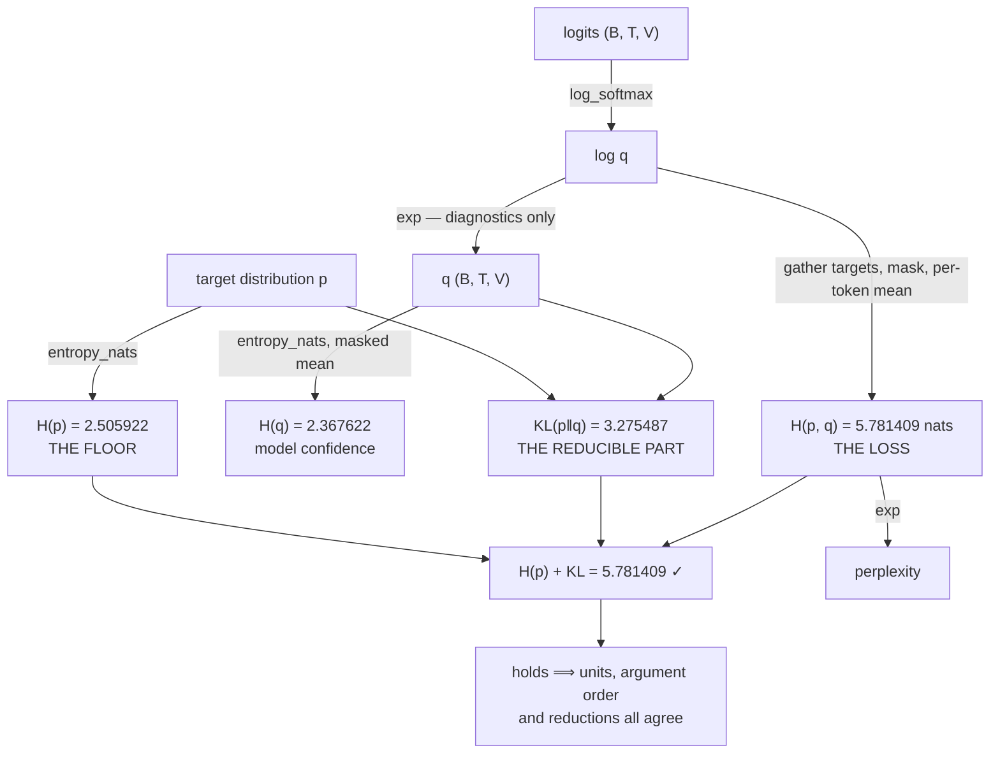

# 3.4 — One batch, four numbers, one identity

## One-line answer

Entropy, cross-entropy, KL and perplexity are four views of one computation, related by
`H(p, q) = H(p) + KL(p‖q)` and `perplexity = exp(H(p, q))` — so computing all four on one batch and
checking the identity is a five-line test that catches unit errors, argument swaps and padding
contamination at once.

---

## The story

At the end of the day, a shop writes down four numbers: the cash in the till, the total on the printed
bills, the stock counted on the shelves, and the stock recorded in the book.

Not one of those is a check on its own. You can miscount a till confidently. You can miscount a shelf
confidently. A wrong number does not look any different from a right one.

What makes them into a check is that the four are **related to each other**. The cash in the till
should match the total on the bills. The stock that left the shelves should match what the bills say
was sold. Those relationships have to hold, and everybody knows what they are.

So nobody stands there asking "is the till count right?". You write all four numbers down, write down
what the relationship between them ought to be, and see whether it holds.

When it holds, all four are probably fine. When it does not, the *way* they disagree usually tells you
which one to go back and count again.
---

## The idea in plain language

Today produced four quantities. They are not four independent things to remember — they are one
computation viewed four ways, tied together by two identities:

> **`H(p, q) = H(p) + KL(p ‖ q)`**  (part [3.1](3.1-kl-the-extra-bits.md))
>
> **`perplexity = exp(H(p, q))`** in nats  (part [3.2](3.2-perplexity.md))

Which gives a routine worth running on the first batch of every training run:

| Quantity | What it says | Where it comes from |
| --- | --- | --- |
| `H(p)` | the data's irreducible uncertainty — **the floor** | part [1.2](../01-entropy/1.2-entropy-in-bits-and-nats.md) |
| `H(p, q)` | the loss you observe | part [2.1](../02-cross-entropy/2.1-coding-with-the-wrong-distribution.md) |
| `KL(p ‖ q)` | your model's error — **the reducible part** | part [3.1](3.1-kl-the-extra-bits.md) |
| `exp(H(p, q))` | the same loss, as an effective branching factor | part [3.2](3.2-perplexity.md) |

The identity is what makes them a *check* rather than four numbers. If `H(p) + KL` does not equal
`H(p, q)`, exactly one of three things is wrong: the units are mixed (part
[1.1](../01-entropy/1.1-surprise-measured.md)), the arguments are swapped somewhere (part
[2.1](../02-cross-entropy/2.1-coding-with-the-wrong-distribution.md)), or the reductions differ (part
[2.4](../02-cross-entropy/2.4-the-mean-over-what.md)). **Three of today's failures, caught by one
comparison.**

And in the one-hot case — which is language modelling — the identity says something specific and
useful: a one-hot target has `H(p) = 0`, so `H(p, q) = KL(p ‖ q)` exactly. **The whole loss is
reducible in principle.** The floor of a per-token loss on one-hot targets is zero, not `H(p)` — the
`H(p)` floor appears only when the *data* is genuinely stochastic, which for real text it is, because
the same context is followed by different tokens in different places. That distinction is the whole of
Day 68's "how low should this go" conversation.

---

## Why Akshara needs it

- **Day 25**'s first training run, and every run after it, should print these four at step 0. Three of
  today's failures are visible there and nowhere else.
- **Day 51** builds the training loop, and this is the block of code that goes at the top of it.
- **Day 68** is the gate where the loss curve is defended: the defence is the identity plus the `ln(V)`
  check, and neither is available without today.
- **Day 92** and **Day 94** use KL as an explicit loss term, so the four have to agree in the *same*
  units and reductions across two different loss functions in the same step.
- **Day 118** checks for contamination, which shows up as a loss below the plausible floor — a question
  only answerable if you know what the floor is.

---

## The mechanism

The whole routine, on one batch, with everything today established:

```python
import numpy as np


def log_softmax(z, axis=-1):
    m = z.max(axis=axis, keepdims=True)
    s = z - m
    return s - np.log(np.exp(s).sum(axis=axis, keepdims=True))


def entropy_nats(p, axis=-1):
    safe = np.where(p > 0, p, 1.0)
    return -np.where(p > 0, p * np.log(safe), 0.0).sum(axis=axis)


rng = np.random.default_rng(1337)
B, T, V, PAD = 4, 10, 50, 0
logits = rng.standard_normal((B, T, V)) * 2                # (B, T, V)
targets = rng.integers(1, V, size=(B, T))                  # (B, T)
for b, L in enumerate([10, 6, 3, 8]):
    targets[b, L:] = PAD
mask = targets != PAD                                       # (B, T)

log_q = log_softmax(logits)                                 # (B, T, V)
q = np.exp(log_q)                                           # (B, T, V) only for the diagnostics

nll = -np.take_along_axis(log_q, targets[..., None], axis=-1)[..., 0]   # (B, T)
loss = float(nll[mask].sum() / mask.sum())                  # per-token mean, nats

print(f"  tokens counted     : {int(mask.sum())} of {B * T}   ({1 - mask.mean():.1%} padding)")
print(f"  cross-entropy      : {loss:.6f} nats/token")
print(f"  perplexity         : {np.exp(loss):.4f}")
print(f"  ln(V)              : {np.log(V):.6f} nats   (an untrained model's expected loss)")
print(f"  model output H(q)  : {float(entropy_nats(q)[mask].mean()):.6f} nats/token")
```

**Line by line:**
- `log_softmax` first, `q = np.exp(log_q)` only afterwards and **only for the diagnostics**. The loss
  itself never touches `q`, which is part
  [2.3](../02-cross-entropy/2.3-why-this-is-the-loss.md)'s rule; the entropy of the model's own output
  is a diagnostic and it genuinely needs the probabilities.
- `nll[mask].sum() / mask.sum()` is the per-token mean over real positions — parts
  [2.4](../02-cross-entropy/2.4-the-mean-over-what.md) and
  [2.5](../02-cross-entropy/2.5-the-loss-that-counted-padding.md) together, in one line.
- `entropy_nats(q)` gives the entropy of the **model's** distribution at each position, which is a
  different quantity from the data's entropy and is the one you can actually measure. It says how
  confident the model is.
- Measured on Intel Core i3-1115G4, CPython 3.12.10, numpy 2.5.2, seed 1337, 2026-08-26:

```text
  tokens counted     : 27 of 40   (32.5% padding)
  cross-entropy      : 5.366416 nats/token
  perplexity         : 214.0941
  ln(V)              : 3.912023 nats   (an untrained model's expected loss)
  model output H(q)  : 2.367622 nats/token
```

**Four numbers, and the third one is the alarm.** The loss is `5.366416` against an expected `3.912023`
for an untrained model — **the loss is above `ln(V)`**, which for a real run at step 0 would mean the
logits are far too spread out, and here means exactly that: these logits were generated with a scale of
2, which is much wider than a sensible initialisation. On a real model, a step-0 loss above `ln(V)` is
an initialisation bug and a loss far below it is a data leak.

**The `model output H(q)` line** is the diagnostic worth keeping. At `2.367622` nats against a ceiling
of `ln(50) = 3.912023`, this model is *more confident than uniform* — which is the normal state — and
watching that number fall over training is how entropy collapse (part
[1.2](../01-entropy/1.2-entropy-in-bits-and-nats.md)'s *In production* note) becomes visible.

**Now the identity, on a case where all four are computable.** Language-model targets are one-hot, so
`H(p) = 0` and the identity is trivial; to exercise it properly, use a *soft* target — which is exactly
what Day 92's distillation does:

```python
teacher = np.exp(log_softmax(rng.standard_normal((B, T, V)) * 2))    # (B, T, V) soft targets
student = q                                                          # (B, T, V)


def cross_entropy_nats(p, q, axis=-1):
    return -np.where(p > 0, p * np.log(np.where(p > 0, q, 1.0)), 0.0).sum(axis=axis)


def kl_nats(p, q, axis=-1):
    ratio = np.where(p > 0, p / np.where(p > 0, q, 1.0), 1.0)
    return np.where(p > 0, p * np.log(ratio), 0.0).sum(axis=axis)


H_p = float(entropy_nats(teacher)[mask].mean())
H_pq = float(cross_entropy_nats(teacher, student)[mask].mean())
KL_pq = float(kl_nats(teacher, student)[mask].mean())

print(f"  H(p)        = {H_p:.6f}")
print(f"  KL(p || q)  = {KL_pq:.6f}")
print(f"  H(p) + KL   = {H_p + KL_pq:.6f}")
print(f"  H(p, q)     = {H_pq:.6f}")
print(f"  identity holds: {np.isclose(H_p + KL_pq, H_pq, rtol=1e-12)}")
```

**Line by line:**
- All three functions use **nats** (`np.log`), consistently. Mixing one `np.log2` in would break the
  identity by a factor of `1/ln(2)` and the check would catch it — which is the point.
- All three are reduced the **same way**: `[mask].mean()`, the per-token mean over real positions.
  Reducing one differently would break the identity, and the check would catch that too.
- `rtol=1e-12` rather than exact equality, because the two routes to `H(p, q)` round differently — Day 2
  part [3.2](../../../day-002-tensors-shape-stride/parts/03-matmul/3.2-three-loops-then-one-call.md)'s
  lesson.
- Measured on this machine, 2026-08-26:

```text
  H(p)        = 2.505922
  KL(p || q)  = 3.275487
  H(p) + KL   = 5.781409
  H(p, q)     = 5.781409
  identity holds: True
```

**`2.505922 + 3.275487 = 5.781409`, exactly the measured cross-entropy.** Four numbers, one
relationship, and when it holds you have simultaneous evidence that the units match, the arguments are
in the right order and the reductions agree.



**The five-line check that goes at the top of every run:**

```python
def report_step_zero(loss_nats: float, n_tokens: int, n_total: int, V: int) -> None:
    """Print what a run needs to be defensible. Four numbers and one comparison."""
    print(f"  counted {n_tokens} of {n_total} positions ({1 - n_tokens / n_total:.1%} excluded)")
    print(f"  loss {loss_nats:.4f} nats/token   perplexity {np.exp(loss_nats):.2f}")
    print(f"  ln(V) = {np.log(V):.4f}   ratio loss/ln(V) = {loss_nats / np.log(V):.3f}")
    if loss_nats < 0.8 * np.log(V):
        print("  WARNING: step-0 loss well below ln(V) — unshifted targets, or a data leak?")
    if loss_nats > 1.5 * np.log(V):
        print("  WARNING: step-0 loss well above ln(V) — initialisation too wide?")
```

**Line by line:**
- **The excluded-position count is first**, because it is part
  [2.5](../02-cross-entropy/2.5-the-loss-that-counted-padding.md)'s check and the plan's §6 detection:
  *count the ignored positions by hand.* Printing it once at step 0 makes padding contamination
  impossible to miss.
- The loss **and** the perplexity together, so a unit error is visible (part
  [3.2](3.2-perplexity.md)).
- `loss / ln(V)` as a **ratio**, because that is the number that transfers between vocabularies. A ratio
  near 1 at step 0 is healthy; the two thresholds bracket it.
- The low warning catches the unshifted-target bug from part
  [2.2](../02-cross-entropy/2.2-nll-is-cross-entropy-with-a-one-hot.md) and contamination (Silent
  Failure #1, plan §6). The high warning catches an initialisation whose logits are too wide.
- `0.8` and `1.5` are judgement calls and are **printed as warnings rather than raised**, because a
  legitimate run can start slightly outside them. What matters is that the number is looked at at all.

---

## Shapes

| Tensor | Symbolic shape | Concrete here | What each axis means |
| --- | --- | --- | --- |
| `logits` | `(B, T, V)` | `(4, 10, 50)` | batch · position · vocabulary |
| `log_q` | `(B, T, V)` | `(4, 10, 50)` | log-probabilities — what the loss uses |
| `q` | `(B, T, V)` | `(4, 10, 50)` | probabilities — **diagnostics only** |
| `targets` | `(B, T)` | `(4, 10)` | integer ids; `0` is `<pad>` |
| `mask` | `(B, T)` | `(4, 10)` | `27` real of `40` |
| `nll` | `(B, T)` | `(4, 10)` | per-position loss |
| `loss` | `()` | `5.366416` | per-token mean over real positions, nats |
| `entropy_nats(q)` | `(B, T)` | `(4, 10)` | model confidence per position |
| `H_p`, `KL_pq`, `H_pq` | `()` each | `2.505922`, `3.275487`, `5.781409` | the identity's three terms |

---

## When it breaks

The loud one — the identity failing:

```console
>>> np.isclose(H_p + KL_pq, H_pq, rtol=1e-12)
np.False_
```

No exception; a `False`. And the **pattern** of the failure names the cause, which is what makes the
check worth running:

| What you see | Most likely cause | Where |
| --- | --- | --- |
| the three terms differ by a factor of `1.4427` | one is in bits, the others in nats | part [1.1](../01-entropy/1.1-surprise-measured.md) |
| `H(p) + KL ≠ H(p, q)` and KL is *negative* | the KL arguments are swapped or the ratio inverted | part [3.1](3.1-kl-the-extra-bits.md) |
| the identity holds per position but not after reduction | the three were reduced differently | part [2.4](../02-cross-entropy/2.4-the-mean-over-what.md) |
| any term is `inf` | a zero in the second argument where the first has mass | part [2.1](../02-cross-entropy/2.1-coding-with-the-wrong-distribution.md) |
| any term is `nan` | `0 · log(0)` unmasked | part [1.3](../01-entropy/1.3-the-zero-probability-event.md) |

**Five of today's failures, distinguished by one check and a lookup table.**

**The silent version, and it is the one this document exists to prevent: not computing the four at all.**
A training loop that prints only the loss has one number and no way to interpret it. Is `5.37` good?
Against what? The answer needs `ln(V)` at minimum and ideally an estimate of the data's entropy, and
both are one line.

Here is what the omission looks like in practice, using today's own measurements:

```text
  step 0  loss 5.3664        <- indistinguishable from a healthy run
```

against

```text
  counted 27 of 40 positions (32.5% excluded)
  loss 5.3664 nats/token   perplexity 214.09
  ln(V) = 3.9120   ratio loss/ln(V) = 1.372
  WARNING: step-0 loss well above ln(V) — initialisation too wide?
```

**The same run.** One line of output tells you nothing; five lines tell you the padding fraction, the
unit, the comparison point and a named suspicion. The cost is four `print` statements executed once.

---

## In production

**What a research engineer writes instead of the teaching version.** They log the loss, the token count,
the perplexity and the `loss/ln(V)` ratio at step 0 and periodically thereafter, and they estimate the
data's entropy once per corpus so the floor is known. In a distillation or RLHF setting where a KL term
is an explicit part of the loss, they assert the identity in a test — because a KL term computed in
different units or with a different reduction from the cross-entropy term silently reweights the two,
which is a hyperparameter change nobody made.

They also keep the discipline about **which tensor the diagnostics use**. The loss comes from
`log_softmax`; anything needing probabilities (output entropy, top-k statistics) exponentiates
deliberately and is understood to cost a `(B, T, V)` allocation.

**What degrades at scale.** The diagnostics, not the loss. `q = np.exp(log_q)` materialises the full
probability tensor — 262 million numbers at realistic sizes (part
[2.2](../02-cross-entropy/2.2-nll-is-cross-entropy-with-a-one-hot.md)) — so the model-entropy diagnostic
is computed on a **subsample** of positions in a real training loop, or only every `n` steps. The loss
never needs it.

**The failure that only shows with real data.** The floor moving. `H(p)` for real text depends on the
corpus and on the tokenizer, and it is genuinely hard to estimate — so the honest form of "how low
should the loss go" is a comparison against a strong baseline on the same data with the same tokenizer,
rather than an absolute number. Day 68's gate is written that way for this reason, and part
[3.3](3.3-the-perplexity-that-improved.md) is why the tokenizer has to be held fixed for the comparison
to mean anything.

**The review comment.** *"The training loop logs the loss and nothing else. Add the token count, the
perplexity and `ln(V)` — three prints, and they'd have caught the padding bug at step 0."*

**The interview question.** *"You see a language model's step-0 loss. What should it be, and what does
it tell you if it isn't?"* The strong answer is `ln(V)` — an untrained model is roughly uniform — and
then both directions: well below means the model is seeing the answer (unshifted targets, leaked data,
or padding contamination), well above means the initialisation is producing logits that are far too
spread out. Adding that this is a free check requiring one line is what makes it advice rather than
trivia.

**Compute tier: T0.** A `(4, 10, 50)` batch on a laptop CPU. The T0 version proves the **identity and
the whole diagnostic routine** exactly; both are arithmetic and transfer to any size. What it does not
show is estimating `H(p)` on a real corpus, which is Day 68's genuinely hard problem.

---

## Check yourself

Run this. It prints **four numbers and one identity that must hold**:

```python
import numpy as np


def log_softmax(z, axis=-1):
    m = z.max(axis=axis, keepdims=True)
    s = z - m
    return s - np.log(np.exp(s).sum(axis=axis, keepdims=True))


def entropy_nats(p, axis=-1):
    safe = np.where(p > 0, p, 1.0)
    return -np.where(p > 0, p * np.log(safe), 0.0).sum(axis=axis)


def cross_entropy_nats(p, q, axis=-1):
    return -np.where(p > 0, p * np.log(np.where(p > 0, q, 1.0)), 0.0).sum(axis=axis)


def kl_nats(p, q, axis=-1):
    ratio = np.where(p > 0, p / np.where(p > 0, q, 1.0), 1.0)
    return np.where(p > 0, p * np.log(ratio), 0.0).sum(axis=axis)


rng = np.random.default_rng(1337)
B, T, V, PAD = 4, 10, 50, 0
logits = rng.standard_normal((B, T, V)) * 2
targets = rng.integers(1, V, size=(B, T))
for b, L in enumerate([10, 6, 3, 8]):
    targets[b, L:] = PAD
mask = targets != PAD

log_q = log_softmax(logits)
q = np.exp(log_q)
nll = -np.take_along_axis(log_q, targets[..., None], axis=-1)[..., 0]
loss = float(nll[mask].sum() / mask.sum())

print(f"counted {int(mask.sum())} of {B * T}   loss {loss:.6f} nats   ppl {np.exp(loss):.4f}")
print(f"ln(V) = {np.log(V):.6f}   ratio {loss / np.log(V):.3f}")

teacher = np.exp(log_softmax(rng.standard_normal((B, T, V)) * 2))
H_p = float(entropy_nats(teacher)[mask].mean())
KL_pq = float(kl_nats(teacher, q)[mask].mean())
H_pq = float(cross_entropy_nats(teacher, q)[mask].mean())
print(f"H(p) {H_p:.6f} + KL {KL_pq:.6f} = {H_p + KL_pq:.6f}   H(p,q) {H_pq:.6f}")
print("identity holds:", np.isclose(H_p + KL_pq, H_pq, rtol=1e-12))
```

**Line by line:**
- The first two lines print `counted 27 of 40   loss 5.366416 nats   ppl 214.0941` and
  `ln(V) = 3.912023   ratio 1.372` on this machine, 2026-08-26.
- **The ratio of `1.372` is a warning sign**, and here it is expected: the logits were generated with a
  scale of 2, which is far wider than a real initialisation. Say out loud what a ratio of `0.3` would
  have meant instead.
- The identity line prints `2.505922 + 3.275487 = 5.781409` against `H(p,q) 5.781409`, and
  `identity holds: True`.
- Now change **one** of the three functions to use `np.log2` and re-run. The identity fails, and the
  factor between the terms is `1.4427`. **That is the unit check working**, and it is why all three are
  computed rather than just the loss.

**Say this out loud, without scrolling up:** state the two identities linking today's four quantities —
and name three different bugs that a single failure of the first identity would distinguish between.
