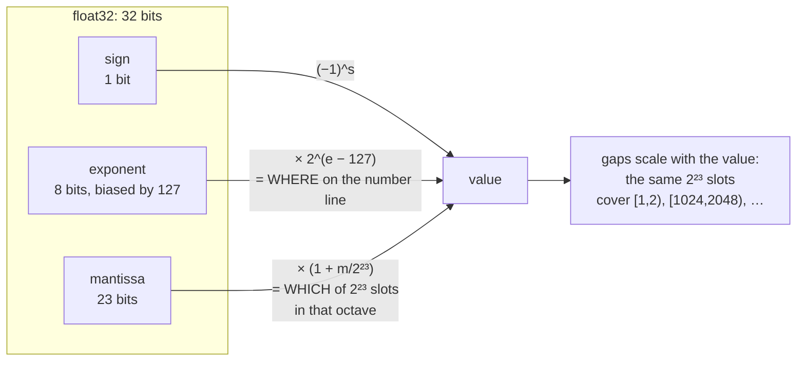

# 1.1 — A float is sign, exponent and mantissa

## One-line answer

A floating-point number is three fields packed into a fixed width — a sign bit, an exponent saying
roughly how big, and a mantissa saying the digits — so its value is `±(1 + mantissa) × 2^exponent`, and
every property that surprises you about floats follows from that one formula.

---

## The story

Listen to how people actually say numbers out loud.

Nobody says "four million, seven hundred and eighteen thousand, three hundred and twenty-one rupees".
They say "about 4.7 million". Nobody says "zero point zero zero four seven kilograms" either. They say
"4.7 grams".

Look at what happened both times. **Three digits, and a unit.** The digits carry the detail, the unit
carries the size, and the very same three digits work whether you are talking about grams or millions
or tonnes. That is how one person, with one mouth, can talk about a grain of sand and a mountain in
the same sentence.

What nobody says is "4.7183 million", because three digits is what fits comfortably in a head.

So this way of talking covers an enormous range of sizes, and it cannot say everything inside that
range. Which numbers it can say depends completely on where you are standing. Up at the million end,
the nearest thing you can say jumps in steps of a hundred thousand. Down at the gram end, it jumps in
steps of a hundredth of a gram.

That is a float. The unit is the exponent, the three digits are the mantissa, and the gap that opens up
at the big end is the single most important fact in this whole day.
---

## The idea in plain language

Day 2 part
[1.2](../../../day-002-tensors-shape-stride/parts/01-what-a-tensor-is/1.2-dtype-the-width-of-a-number.md)
said a float stores "a sign, an exponent and a mantissa" and moved on. This part opens the box.

A `float32` is 32 bits, split as:

| Field | Bits | What it does |
| --- | --- | --- |
| **sign** | 1 | `0` for positive, `1` for negative |
| **exponent** | 8 | how big — stored with a *bias* of 127, so `127` means `2⁰` |
| **mantissa** | 23 | the significant digits, as a fraction |

And the value is:

> **`value = (−1)^sign × (1 + mantissa / 2²³) × 2^(exponent − 127)`**

Three things in that formula are worth naming:

**The leading 1 is implied.** Any non-zero binary number can be written with exactly one `1` before the
point — `1.0110…` — so that `1` is never stored. It is free, and it buys one extra bit of precision.
Numbers too small to be written that way are *subnormal*, a special case with reduced precision, and
they are the `tiny` boundary Day 2 measured.

**The exponent is biased, not signed.** Storing `127` for `2⁰` means the raw field is always a
non-negative integer, which makes float comparison work as integer comparison — a genuinely useful
property, and the reason the layout is this way rather than something more obvious.

**The mantissa is a fraction, not an integer.** It contributes between `0` and just under `1`, so the
significand `(1 + mantissa/2²³)` is always in `[1, 2)`. That is what makes the *relative* precision
constant: every number in `[2ᵏ, 2ᵏ⁺¹)` gets the same 2²³ evenly-spaced slots, whatever `k` is.

That last point is the whole day in one sentence. **The gaps between representable numbers scale with
the numbers themselves.** Near 1 the gap is about `10⁻⁷` in `float32`; near 10,000 it is about `10⁻³`.
Part [1.3](1.3-the-gap-between-representable-numbers.md) measures it and part
[1.4](1.4-accumulation-error.md) shows what it does to a sum.

---

## Why Akshara needs it

- **Part [1.2](1.2-range-versus-precision.md)** compares `fp32`, `fp16` and `bf16`, and the comparison
  *is* the exponent/mantissa split: two 16-bit formats differing only in where the boundary sits.
- **Part [2.1](../02-stable-softmax/2.1-the-softmax-that-returns-nan.md)** shows `exp` overflowing, and
  the threshold is `ln(max)` — a number that comes straight from the exponent field's width.
- **Day 78 onward** quantizes to 8 and 4 bits, which is this trade taken further: fewer bits means a
  choice about how many go to range and how many to precision, and integer quantization abandons the
  exponent entirely.
- **Day 2 part [3.2](../../../day-002-tensors-shape-stride/parts/03-matmul/3.2-three-loops-then-one-call.md)**
  measured two correct matmuls disagreeing at `10⁻¹⁴`; this is why.
- **Day 51's** test suite must not be flaky, and every tolerance in it is chosen from the numbers this
  section produces.

---

## The mechanism

Open a `float32` and read its three fields:

```python
import struct

for x in (1.0, 0.5, 2.0, -1.0, 0.1):
    bits = "".join(f"{c:08b}" for c in struct.pack(">f", x))
    sign, exponent, mantissa = bits[0], bits[1:9], bits[9:]
    print(f"  {x:6} -> {bits}   sign {sign}  exp {exponent} ({int(exponent, 2)}, "
          f"unbiased {int(exponent, 2) - 127})  mantissa {mantissa}")
```

**Line by line:**
- `struct.pack(">f", x)` converts a Python float to its four-byte `float32` representation. `>` means
  big-endian, which puts the sign bit first and makes the string readable left to right; without it the
  byte order depends on the machine and the output is scrambled.
- `f"{c:08b}"` formats each byte as eight binary digits with leading zeros. Dropping the `08` gives a
  ragged string and the field boundaries no longer line up.
- The slices `[0]`, `[1:9]`, `[9:]` are the three fields. Those boundaries are the `float32` standard
  and they are the only thing this code assumes.
- Measured on Intel Core i3-1115G4, CPython 3.12.10, 2026-08-26:

```text
     1.0 -> 00111111100000000000000000000000   sign 0  exp 01111111 (127, unbiased 0)  mantissa 00000000000000000000000
     0.5 -> 00111111000000000000000000000000   sign 0  exp 01111110 (126, unbiased -1)  mantissa 00000000000000000000000
     2.0 -> 01000000000000000000000000000000   sign 0  exp 10000000 (128, unbiased 1)  mantissa 00000000000000000000000
    -1.0 -> 10111111100000000000000000000000   sign 1  exp 01111111 (127, unbiased 0)  mantissa 00000000000000000000000
     0.1 -> 00111101110011001100110011001101   sign 0  exp 01111011 (123, unbiased -4)  mantissa 10011001100110011001101
```

Read the first four rows as a set:

- `1.0`, `0.5` and `2.0` all have **mantissa zero**. They are exact powers of two, so the significand is
  exactly `1` and only the exponent changes: `0`, `−1`, `+1`. Halving a number decrements the exponent
  and touches nothing else, which is why multiplying and dividing by powers of two is exact.
- `-1.0` differs from `1.0` in **one bit** — the sign. Negation is a bit flip, which is why `-0.0`
  exists and equals `0.0`.
- `0.1` has a mantissa of `10011001100110011001101`, a **repeating pattern**. One tenth is not a finite
  binary fraction, the same way one third is not a finite decimal one, so it is stored as the nearest
  representable value and the repetition is cut off at 23 bits with the last bit rounded up.

Reconstruct a value from its fields, to prove the formula:

```python
import numpy as np

x = 0.1
bits = "".join(f"{c:08b}" for c in struct.pack(">f", x))
s, e, m = int(bits[0]), int(bits[1:9], 2), int(bits[9:], 2)
value = ((-1) ** s) * (1 + m / 2 ** 23) * 2 ** (e - 127)

print(f"  sign {s}, exponent {e} (unbiased {e - 127}), mantissa {m}")
print(f"  reconstructed : {value!r}")
print(f"  np.float32(0.1): {float(np.float32(0.1))!r}")
```

**Line by line:**
- `int(bits[1:9], 2)` reads the exponent field as a plain integer; `- 127` removes the bias.
- `m / 2 ** 23` turns the 23-bit mantissa into a fraction in `[0, 1)`, and the `1 +` adds the implied
  leading bit.
- `float(np.float32(0.1))` widens the 32-bit value back to 64 bits **without changing it**, so printing
  it shows exactly what the 32-bit slot holds — the same trick Day 2 part 1.2 used.
- Measured on this machine, 2026-08-26: `sign 0, exponent 123 (unbiased -4), mantissa 5033165`, and
  both the reconstruction and numpy print `0.10000000149011612`. **Identical**, which means the formula
  is the whole story and there is nothing else hidden in the representation.



Why the gaps scale — the observation that everything else follows from:

```python
for k in (0, 10, 20):
    lo, hi = 2.0 ** k, 2.0 ** (k + 1)
    gap = (hi - lo) / 2 ** 23
    print(f"  [{lo:12.0f}, {hi:12.0f}) : 2^23 = 8388608 slots, gap {gap:.6e}")
```

**Line by line:**
- Every interval `[2ᵏ, 2ᵏ⁺¹)` — an *octave* — has the same exponent, so the same 2²³ mantissa values
  spread across it.
- The interval's width doubles with each `k`, so the gap doubles too.
- Measured on this machine, 2026-08-26: the gap is `1.192093e-07` on `[1, 2)`, `1.220703e-04` on
  `[1024, 2048)` and `1.250000e-01` on `[1048576, 2097152)`.
- **At a million, consecutive `float32` values are an eighth apart.** Adding `0.05` to a million in
  `float32` does nothing at all, and part [1.4](1.4-accumulation-error.md) is what that does to a long
  sum.

---

## Shapes

| Tensor | Symbolic shape | Concrete here | What each axis means |
| --- | --- | --- | --- |
| a `float32` value | `()` | scalar | 32 bits: 1 sign + 8 exponent + 23 mantissa |
| `struct.pack(">f", x)` | 4 bytes | `b'?\x80\x00\x00'` for `1.0` | the raw representation |
| a `(V,)` array of `float32` | `(V,)` | `(32000,)` | `V × 4` bytes — Day 2 part 1.2's arithmetic |
| the gap at value `v` | `()` | `≈ v × 2⁻²³` | **scales with `v`** — the day's central fact |

---

## When it breaks

The loud one, from asking for a bit pattern that has no value:

```console
>>> import struct
>>> struct.unpack(">f", b"\x7f\x80\x00\x00")
(inf,)
>>> struct.unpack(">f", b"\x7f\xc0\x00\x00")
(nan,)
```

Verbatim on this machine, 2026-08-26. **`inf` and `nan` are not errors — they are bit patterns**, with
the exponent field all ones. An all-ones exponent with a zero mantissa is infinity; with a non-zero
mantissa it is `nan`. That is why `nan` propagates through arithmetic rather than raising: it is a
perfectly ordinary value that the hardware knows how to carry.

The other loud one, from `float16`'s much narrower exponent:

```console
>>> np.float16(1e30)
RuntimeWarning: overflow encountered in cast
np.float16(inf)
```

Eight exponent bits reach `10³⁸`; five reach `65504`. Part [1.2](1.2-range-versus-precision.md) is that
difference in full.

**The silent version, and it is the one everybody meets first:**

```console
>>> 0.1 + 0.2 == 0.3
False
>>> f"{0.1 + 0.2:.20f}"
'0.30000000000000004441'
```

Nothing is wrong. `0.1`, `0.2` and `0.3` are each stored as the nearest representable value, the sum of
the first two rounds to a different nearest value from the third, and the comparison is exact and
therefore `False`.

**The consequence for this repository is a rule, not a curiosity:** never compare floats for equality.
Day 2 part
[3.2](../../../day-002-tensors-shape-stride/parts/03-matmul/3.2-three-loops-then-one-call.md) measured
two correct matmuls disagreeing at `10⁻¹⁴`; Day 5 part
[1.5](../../../day-005-logits-softmax-sampling/parts/01-logits-and-probabilities/1.5-the-probabilities-that-summed-to-almost-one.md)
measured 1190 of 2000 softmax outputs failing `sum() == 1.0`; Day 6 part
[1.1](../../../day-006-entropy-cross-entropy-perplexity/parts/01-entropy/1.1-surprise-measured.md)
measured an exact identity failing in its last bit. **All three are this document.**

The check, and it has two halves:

```python
import numpy as np

np.testing.assert_allclose(a, b, rtol=1e-7, atol=0)          # for values of similar magnitude
assert abs(a - b) < atol                                      # only when a comparison to ZERO is meant
```

**Line by line:**
- `rtol` scales with the values, which is right because **the representable gaps scale with the
  values** — that is this document's central fact, and it is why relative tolerance is the natural
  choice rather than a convention.
- `atol=0` in the first line is deliberate: with an absolute floor, a comparison of two numbers near
  zero passes vacuously. Set `atol` only when zero is genuinely one of the expected values.
- The right `rtol` comes from the dtype's epsilon and the number of operations: roughly
  `n × eps` for a sum of `n` terms. Part [1.4](1.4-accumulation-error.md) measures that growth.
- **Exact float equality is correct in exactly two places** in this whole curriculum: comparing a value
  that was *assigned* rather than computed (Day 5's `cdf[-1] = 1.0`), and comparing two runs of a
  deterministic generator from the same seed (Day 5 part
  [2.3](../../../day-005-logits-softmax-sampling/parts/02-sampling/2.3-seeds-and-generators.md)).
  Everywhere else it is a bug.

---

## In production

**What a research engineer writes instead of the teaching version.** Nobody unpacks bit patterns
routinely — but the *model* of three fields is what makes the rest predictable. Someone who carries it
can answer, without measuring: why `bf16` has the same range as `fp32` (same exponent width), why
`fp16` overflows at 65504 (five exponent bits), why a large accumulator loses small increments (the gap
scales), and why relative tolerance is the right comparison.

The one place the bits are read directly is when implementing a cast that numpy does not have — as part
[1.2](1.2-range-versus-precision.md) does for `bf16`, which is literally a `float32` with 16 bits
chopped off the mantissa. That is a five-line function precisely because the layout is this simple.

**What degrades at scale.** Nothing about the representation — but the *consequences* compound. A model
with a billion parameters performs on the order of `10¹²` floating-point operations per step, each
rounding, and the errors accumulate in ways part [1.4](1.4-accumulation-error.md) quantifies. That is
why reductions are done in wider precision than the data even in mixed-precision training, and why the
optimizer keeps a `float32` copy of weights it updates in lower precision.

**The failure that only shows with real data.** Large activation magnitudes. At initialisation, values
are near 1 and gaps are `10⁻⁷`; in a trained model some activations reach the thousands, where the
`float32` gap is `10⁻⁴` and a `float16` gap is `1`. **The same code loses different amounts of
information at different points in training**, which is why numerical problems appear at step 4000 of a
run and not at step 1.

**The review comment.** *"`assert x == 0.5` on a computed float. Use `assert_allclose` with a tolerance
derived from the dtype."*

**The interview question.** *"Why is `0.1 + 0.2 != 0.3`?"* The weak answer says "floating point is
inexact". The strong answer is the representation: a float is `(1 + mantissa) × 2^exponent`, one tenth
is not a finite binary fraction, so each of the three literals is already the nearest representable
value and the arithmetic rounds again. Then the consequence that matters — the gaps scale with
magnitude, so tolerances must be relative — which is what turns trivia into a rule.

**Compute tier: T0.** Bit manipulation on a laptop CPU. Every number here is fixed by the IEEE-754
standard and reproduces on any machine that implements it, which is every machine you will meet. This
is one of the few days where "measured on this machine" and "true everywhere" coincide.

---

## Check yourself

Run this. It prints **three bit patterns whose mantissas are all zero, and one reconstruction that must
match numpy exactly**:

```python
import struct

import numpy as np

for x in (1.0, 0.5, 2.0):
    bits = "".join(f"{c:08b}" for c in struct.pack(">f", x))
    print(f"  {x:4} exp {int(bits[1:9], 2) - 127:+3d}  mantissa {int(bits[9:], 2)}")

bits = "".join(f"{c:08b}" for c in struct.pack(">f", 0.1))
s, e, m = int(bits[0]), int(bits[1:9], 2), int(bits[9:], 2)
print("  reconstructed 0.1 :", repr(((-1) ** s) * (1 + m / 2 ** 23) * 2 ** (e - 127)))
print("  np.float32(0.1)   :", repr(float(np.float32(0.1))))

for k in (0, 10, 20):
    print(f"  gap on [2^{k}, 2^{k + 1}) : {(2.0 ** (k + 1) - 2.0 ** k) / 2 ** 23:.6e}")
```

**Line by line:**
- The three powers of two print mantissas of `0` and exponents `+0`, `−1`, `+1`. **Powers of two are
  exact, and only the exponent moves.**
- The two `0.1` lines both print `0.10000000149011612`. The formula is the whole representation.
- The three gaps print `1.192093e-07`, `1.220703e-04` and `1.250000e-01`. **Say out loud what adding
  `0.05` to `1048576.0` does in `float32`**, then check with
  `np.float32(1048576.0) + np.float32(0.05) == np.float32(1048576.0)`.

**Say this out loud, without scrolling up:** give the formula for a float's value naming all three
fields — and say why the gap between representable numbers is not constant.
