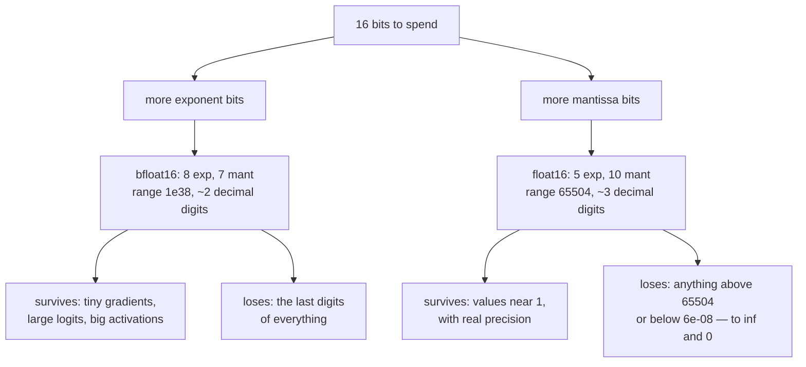

# 1.2 — Range versus precision: fp32, fp16 and bf16

## One-line answer

Sixteen bits can be spent on *how big a number may get* or on *how many digits it keeps*, never both —
`fp16` buys digits and overflows at 65504, `bf16` buys range and keeps barely two decimal digits, and
choosing between them is choosing which of your numbers you are willing to lose.

---

## The story

Somebody gives you fifteen boxes to write any number in, and lets you decide once, before you start,
how to split them: some boxes for the unit, and the rest for the digits.

**Split A**: five boxes for the unit, ten for the digits. Now you can write a distance down to the
millimetre, which is lovely. But your biggest available unit is "tens of kilometres", so the first
time somebody asks you to write down the distance to the moon, there is nowhere to put it. You write
"far".

**Split B**: eight boxes for the unit, seven for the digits. Now the moon fits. So does the sun, and
so does anything else you will ever be asked for. But your millimetres are gone: every distance you
write is correct to about two digits. "Roughly four hundred metres."

Same fifteen boxes. You did not get to keep both. And whether you made the right call depends
entirely on whether you spend your days measuring fence posts or measuring mountains.

`fp16` is split A. `bf16` is split B. And the reason both of them exist is that a neural network does
both jobs at the same time.
---

## The idea in plain language

Part [1.1](1.1-sign-exponent-mantissa.md) established the formula: a float is
`±(1 + mantissa) × 2^exponent`, and the bits are split between the exponent field and the mantissa
field. That split is a **budget**, and the whole of this part is what happens when the budget shrinks
from 32 bits to 16.

Two words, defined once and used for the rest of the curriculum:

- **Range** is how far the numbers reach — the largest and smallest magnitudes representable before
  you hit `inf` or `0`. Range is bought with **exponent** bits, and each extra exponent bit *squares*
  the reach.
- **Precision** is how many significant digits survive — how finely the numbers in any given octave
  are spaced. Precision is bought with **mantissa** bits, and each extra mantissa bit *halves* the gap.

Here are the three formats side by side. `bfloat16` is "brain float", a 16-bit format that keeps
`float32`'s exponent field and throws away mantissa bits instead:

| Format | Total | Sign | Exponent | Mantissa | Buys |
| --- | --- | --- | --- | --- | --- |
| `float32` | 32 | 1 | **8** | **23** | both — the reference |
| `float16` | 16 | 1 | **5** | **10** | precision |
| `bfloat16` | 16 | 1 | **8** | **7** | range |

Read the exponent column first, because it is the one that decides whether your program produces a
number at all. `fp16` has five exponent bits; `fp32` and `bf16` have eight. **That single difference is
why `bf16` reaches the same magnitudes as `fp32` and `fp16` does not** — and it is why the two 16-bit
formats fail in completely different ways.

Then read the mantissa column, because it decides whether the number you produced is any good. `fp32`
keeps about seven decimal digits, `fp16` about three, `bf16` about two. A `bf16` number is a `float32`
number with the last sixteen bits swept off the end — which is exactly how you build one when your
library does not have the type.

The trade is not a matter of taste. It is decided by what your numbers actually look like:

- **Weights and activations** at initialisation cluster near 1. Both formats hold them.
- **Attention logits** before scaling can reach the twenties and beyond, and `exp` of those is where
  `fp16` dies — part [2.1](../02-stable-softmax/2.1-the-softmax-that-returns-nan.md) measures the exact
  threshold.
- **Gradients** in a deep network can be `10⁻⁸` or smaller, which is below `fp16`'s reach entirely and
  well inside `bf16`'s.

---

## Why Akshara needs it

- **Part [2.1](../02-stable-softmax/2.1-the-softmax-that-returns-nan.md)** computes the overflow threshold of
  `exp` for each of these formats, and the `fp16` answer — a logit of about eleven — is small enough
  to be reached by an ordinary attention score.
- **Part [1.5](1.5-mixed-precision.md)** shows a weight update disappearing entirely in `fp16`, which
  is this part's mantissa column doing damage rather than its exponent column.
- **Day 8** writes the optimizer. Its state is stored per parameter, and part
  [2.4](../../../day-008-gradient-descent-and-adam/parts/02-adam/2.4-the-optimizers-memory.md) works
  out the memory bill in bytes — a bill that this part's `bytes-per-number` column decides.
- **Day 66** sizes Akshara against a free notebook GPU. The arithmetic is
  `parameters × bytes-per-parameter`, and whether a model fits is often exactly the difference between
  4 and 2.
- **Days 78–85** quantize to 8 and 4 bits. That is this part's trade pushed past the point where an
  exponent field is affordable at all, which is why integer quantization needs a separate scale factor
  bolted on the side.

---

## The mechanism

First, what the library will tell you. `np.finfo` reports the machine limits of a float type:

```python
import numpy as np

for name, dt in (("float64", np.float64), ("float32", np.float32), ("float16", np.float16)):
    fi = np.finfo(dt)
    print(f"{name:8} bits={fi.bits:3} eps={fi.eps!r:26} max={fi.max!r:24} tiny={fi.tiny!r}")
```

**Line by line:**
- `np.finfo(dt)` is the standard way to ask a float type about itself. Every number below comes from
  the IEEE-754 standard, not from numpy's opinion, so it is the same on any machine.
- `fi.eps` is **machine epsilon**: the gap between `1.0` and the next representable number above it.
  It is the honest measure of precision, because part 1.1 showed gaps scale — so a gap quoted at 1.0
  is a *relative* precision that holds everywhere.
- `fi.max` is the largest finite value. Above it there is only `inf`.
- `fi.tiny` is the smallest **normal** positive value — the smallest number that still gets the
  implied leading `1`. Below `tiny` there are *subnormals*, which trade precision for a little extra
  reach, and part [2.1](../02-stable-softmax/2.1-the-softmax-that-returns-nan.md) uses them.
- Measured on Intel Core i3-1115G4 (2 cores / 4 threads), 11.7 GB RAM, Windows 11, CPython 3.12.12,
  numpy 2.5.2, on 2026-08-26:

```text
float64  bits= 64 eps=np.float64(2.220446049250313e-16) max=np.float64(1.7976931348623157e+308) tiny=np.float64(2.2250738585072014e-308)
float32  bits= 32 eps=np.float32(1.1920929e-07)         max=np.float32(3.4028235e+38)           tiny=np.float32(1.1754944e-38)
float16  bits= 16 eps=np.float16(0.000977)              max=np.float16(6.55e+04)                tiny=np.float16(6.104e-05)
```

**Stop on `float16`'s `max`.** It is `65504` — a number you can reach by accident. Not `10³⁸`, not
`10⁶`. Sixty-five thousand.

Numpy has no `bfloat16`, so build one. Part 1.1 promised this would be five lines, and the reason it is
five lines is that `bf16` *is* a `float32` with the low sixteen mantissa bits removed:

```python
import numpy as np

def to_bf16(x):
    """float32 -> bfloat16 (round-to-nearest-even), returned in a float32 container."""
    u = np.float32(x).view(np.uint32)                                  # ()
    rounding = np.uint32(0x7FFF) + ((u >> np.uint32(16)) & np.uint32(1))
    return ((u + rounding) & np.uint32(0xFFFF0000)).view(np.float32)   # ()
```

**Line by line:**
- `.view(np.uint32)` reinterprets the same 32 bits as an unsigned integer **without converting the
  value**. This is the standard trick for bit manipulation on floats, and it is why the function needs
  no `struct` call: `view` is free.
- `& np.uint32(0xFFFF0000)` clears the low 16 bits — the bottom sixteen mantissa bits. That alone
  would be *truncation*, which is biased downward; every value would be a little too small.
- The `rounding` line fixes that bias. `0x7FFF` is half of the discarded range, so adding it rounds
  up whenever the discarded part is more than half. `((u >> 16) & 1)` is the lowest *surviving* bit,
  and adding it implements **round-half-to-even** — the IEEE default tie-break, which avoids the
  slow upward drift that round-half-up produces over millions of operations.
- The result is `.view`ed back to `float32`, so it is a `float32` variable that happens to hold a
  value `bf16` can represent exactly. That is what every `bf16` emulation does.
- The sign and exponent bits live in the top 16 bits and are **never touched**, which is the whole
  point: `bf16` inherits `float32`'s range untouched.

Now run all three formats against the same numbers:

```python
for x in (1.0, 0.1, 3.14159265, 65505.0, 1e30, 1e-30):
    with np.errstate(over="ignore", under="ignore"):
        print(f"  x={x:<12} fp32={np.float32(x)!r:<22} bf16={float(to_bf16(x))!r:<24} fp16={np.float16(x)!r}")
```

**Line by line:**
- `np.errstate(over="ignore", under="ignore")` suppresses the overflow and underflow warnings **for
  this demonstration only**. This repository sets `filterwarnings = ["error::RuntimeWarning"]` in
  `pyproject.toml`, so without it the `1e30` row would stop the program — which is the correct
  behaviour in real code and the wrong behaviour in a table meant to show what overflow looks like.
  **Never write `errstate` in library code**; it is how a `nan` gets into production silently.
- `float(np.float16(x))` widens back to 64 bits without changing the value, so the printed digits are
  what the 16-bit slot actually holds — the same widening trick part 1.1 used.
- Measured on this machine, 2026-08-26:

```text
  x=1.0          fp32=np.float32(1.0)       bf16=1.0                    fp16=np.float16(1.0)
  x=0.1          fp32=np.float32(0.1)       bf16=0.10009765625          fp16=np.float16(0.1)
  x=3.14159265   fp32=np.float32(3.1415927) bf16=3.140625               fp16=np.float16(3.14)
  x=65505.0      fp32=np.float32(65505.0)   bf16=65536.0                fp16=np.float16(6.55e+04)
  x=1e+30        fp32=np.float32(1e+30)     bf16=1.0002555517425873e+30 fp16=np.float16(inf)
  x=1e-30        fp32=np.float32(1e-30)     bf16=9.98402083170343e-31   fp16=np.float16(0.0)
```

Four rows carry the whole argument:

- **`3.14159265`** — `fp32` keeps `3.1415927`, `fp16` keeps `3.14`, `bf16` keeps `3.140625`. `bf16` is
  the *worst* of the three at holding a number it can easily reach.
- **`65505.0`** — `bf16` rounds it to `65536`, off by 31, and carries on. `fp16` clamps it to its
  maximum, `65504`. Neither is exact, and only one of them is about to fail.
- **`1e30`** — `bf16` holds it to three digits. **`fp16` returns `inf`.** The number is gone, and
  everything computed from it afterwards is `inf` or `nan`.
- **`1e-30`** — **`fp16` returns exactly `0.0`.** A gradient of that size, in `fp16`, is not small.
  It does not exist. The parameter it belonged to receives no update at all and no error is raised.



The precision half of the trade, measured directly. `eps` is the smallest number you can add to `1.0`
and still see a change:

```python
print("fp32: 1+eps  ->", np.float32(1.0) + np.finfo(np.float32).eps,
      " 1+eps/2 ->", np.float32(1.0) + np.float32(np.finfo(np.float32).eps / 2))
print("fp16: 1+eps  ->", np.float16(1.0) + np.finfo(np.float16).eps,
      " 1+eps/2 ->", np.float16(1.0) + np.float16(np.finfo(np.float16).eps / 2))
print("bf16: 1+2^-7 ->", float(to_bf16(1.0 + 2.0 ** -7)),
      " 1+2^-8 ->", float(to_bf16(1.0 + 2.0 ** -8)))
```

**Line by line:**
- Adding `eps` changes the value; adding `eps/2` does not, because it rounds back to `1.0`. That pair
  of lines *is* the definition of machine epsilon, made observable.
- `bf16`'s epsilon is `2⁻⁷ = 0.0078125`, because it has seven mantissa bits. There is no `np.finfo`
  for it, so the number is computed from the format's definition rather than looked up.
- Measured on this machine, 2026-08-26: `fp32` gives `1.0000001` then `1.0`; `fp16` gives `1.001` then
  `1.0`; `bf16` gives `1.0078125` then `1.0`.
- **`bf16` cannot distinguish `1.0` from `1.005`.** In a format used to train billion-parameter
  models. That is survivable only because the gradient signal is an *average* over a large batch, and
  averaging is what recovers the bits that rounding threw away.

---

## Shapes

| Tensor | Symbolic shape | Concrete here | What each axis means |
| --- | --- | --- | --- |
| a scalar in any format | `()` | one value | 32 or 16 bits, split per the table above |
| a weight matrix `W` | `(C, C)` | `(768, 768)` | `589,824` numbers — `2.25 MB` in fp32, `1.13 MB` in fp16/bf16 |
| logits | `(B, T, V)` | `(4, 10, 50)` | batch · position · vocabulary — the tensor part 2.1 overflows |
| `to_bf16(x)` output | same as input | `()` here | a `float32` **container** holding a `bf16`-representable value |

The bytes-per-number column is the one that decides what fits: `fp32` is 4 bytes, both 16-bit formats
are 2. Halving the dtype halves every one of these.

---

## When it breaks

The loud one — `fp16` overflowing on a value that is not remotely extreme:

```console
>>> import numpy as np
>>> np.float16(70000.0)
RuntimeWarning: overflow encountered in cast
np.float16(inf)
>>> np.float16(1e30)
RuntimeWarning: overflow encountered in cast
np.float16(inf)
```

Verbatim on this machine, 2026-08-26. **Note that it is a `RuntimeWarning`, not an exception.** In an
ordinary Python program this prints once and execution continues with `inf` in the array. This
repository turns it into an error via `filterwarnings = ["error::RuntimeWarning"]` in `pyproject.toml`,
which is a deliberate choice made on Day 0 and is exactly the choice that makes this class of bug
loud instead of silent.

Under a warning filter that raises, the same line becomes:

```console
>>> np.float16(1e30)
Traceback (most recent call last):
  File "<stdin>", line 1, in <module>
RuntimeWarning: overflow encountered in cast
```

**The silent version, and it is much worse than the loud one:**

```console
>>> np.float16(1e-30)
np.float16(0.0)
>>> np.float16(1e-30) == 0.0
True
```

**No warning at all** on this machine for this value — underflow to zero is so routine that it is not
worth reporting, and a gradient that has become exactly zero looks identical to a gradient that was
genuinely zero. The parameter stops learning. The loss curve keeps moving, because the *other*
parameters are still fine. You find out weeks later that a whole layer never trained.

The check that catches it, and it belongs in any code that narrows a dtype:

```python
def assert_representable(x, dtype, name="tensor"):
    """Fail loudly if narrowing to `dtype` would turn a finite value into inf or 0."""
    narrowed = np.asarray(x).astype(dtype)                     # same shape as x
    lost_high = np.isinf(narrowed) & np.isfinite(x)
    lost_low = (narrowed == 0) & (np.asarray(x) != 0)
    if lost_high.any():
        raise ValueError(f"{name}: {int(lost_high.sum())} value(s) overflowed to inf in {dtype}")
    if lost_low.any():
        raise ValueError(f"{name}: {int(lost_low.sum())} value(s) underflowed to 0 in {dtype}")
```

**Line by line:**
- `np.isinf(narrowed) & np.isfinite(x)` is the overflow test, and the second half matters: a value
  that was *already* `inf` before the cast is not this function's problem, and flagging it would
  mask where the real `inf` came from.
- `(narrowed == 0) & (x != 0)` is the underflow test, and it is the half people leave out — because
  underflow does not warn, so nobody is reminded it exists.
- Raising `ValueError` rather than warning is Principle 10 and the plan's §2: a silent numerical loss
  is the failure mode this whole day exists to prevent, so it gets an exception.
- **This is a debugging tool, not a production one.** It doubles the memory of the tensor it checks
  and it runs on every element. It belongs behind a flag, in the run where you are proving a dtype
  change was safe — which is the run part [1.5](1.5-mixed-precision.md) tells you to do.

---

## In production

**What a research engineer writes instead of the teaching version.** Nobody implements `to_bf16` —
PyTorch has `torch.bfloat16` and the hardware has it natively. What they *do* carry is the table, and
they use it to answer a question that comes up constantly: *"can we train this in 16 bits?"* The answer
is almost always "in `bf16`, yes; in `fp16`, only with loss scaling" — and the reason is one column of
one table. `bf16` has `fp32`'s exponent, so nothing overflows that would not have overflowed anyway,
and no scaling machinery is needed.

The honest historical note: `fp16` came first because the hardware did, and the loss-scaling machinery
in every mixed-precision trainer exists to work around its five-bit exponent. When hardware with `bf16`
support arrived, that machinery became optional. **A great deal of complexity in training frameworks is
a workaround for three missing exponent bits.**

**What degrades at scale.** Two things, in opposite directions. Memory pressure grows with model size,
which pushes toward 16 bits — a `(768, 768)` weight matrix is `2.25 MB` in `fp32` and `1.13 MB` in
either 16-bit format, and that halving is applied to every tensor at once. Meanwhile activation
magnitudes grow during training, which pushes `fp16` toward its `65504` ceiling. The two pressures
meet in the middle of a long run, and that is why numerical failures appear at step 4000 and not at
step 1.

**The failure that only shows with real data.** Activation outliers. A model trained on a real corpus
develops a small number of dimensions with magnitudes far above the rest — and it is those, not the
average, that decide whether `fp16` overflows. A dtype change validated on a toy batch will pass, and
fail on the corpus, because the toy batch had no outliers in it. **Validate a narrowing on real data or
you have validated nothing** — and this is also the whole subject of Days 78–85, where the outliers
are what makes quantization hard.

**The review comment.** *"This casts to `fp16` before the reduction. Reduce in `fp32` and cast after —
and say in the PR what the max activation magnitude was on a real batch."*

**The interview question.** *"What is the difference between `fp16` and `bf16`?"* The weak answer is
"`bf16` is more stable". The strong answer is the bit budget: same total width, but `bf16` spends 8
bits on the exponent and 7 on the mantissa where `fp16` spends 5 and 10 — so `bf16` has `fp32`'s
dynamic range and about two decimal digits, while `fp16` has three digits and a ceiling of `65504`.
Then the consequence that shows you have used it: `fp16` needs loss scaling to keep small gradients
from underflowing, `bf16` does not, and that is why `bf16` became the default on hardware that
supports it.

**Compute tier: T0.** Every number in this part is IEEE-754 arithmetic on a laptop CPU, and every one
reproduces exactly on any machine that implements the standard. What T0 *cannot* show is the reason
anyone cares: on a GPU, 16-bit matmuls run on dedicated hardware and are several times faster than
32-bit ones. **The correctness argument is here; the speed argument needs hardware this curriculum does
not assume you have**, and Day 66 is where it gets measured on a free notebook GPU rather than
asserted.

---

## Check yourself

Run this. It prints **one format's maximum that you can reach by accident, and one value that becomes
exactly zero without a warning**:

```python
import numpy as np

print("  fp16 max        :", np.finfo(np.float16).max)
with np.errstate(over="ignore", under="ignore"):
    print("  fp16(70000)     :", repr(np.float16(70000.0)))
    print("  fp16(1e-30)     :", repr(np.float16(1e-30)))
print("  fp16 eps        :", np.finfo(np.float16).eps)
print("  fp32 eps        :", np.finfo(np.float32).eps)
print("  bf16 eps (2^-7) :", 2.0 ** -7)
```

**Line by line:**
- The first three lines print `6.55e+04`, `inf` and `0.0`. **One of those three came with a warning
  and one did not** — say which, and say which of the two is more dangerous.
- The three epsilons print `0.000977`, `1.1920929e-07` and `0.0078125`. Put them in order and notice
  that the *widest-ranging* 16-bit format is the *least precise* of the three.
- Now compute, on paper, how many megabytes a `(50257, 768)` embedding matrix takes in each of `fp32`,
  `fp16` and `bf16`. It is one multiplication and it is the arithmetic Day 66 runs to decide whether
  Akshara fits on a free GPU.

**Say this out loud, without scrolling up:** name the bit split of all three formats, and say which one
you would train in on hardware that supports both — and what you would have to add if you were forced
to use the other.
