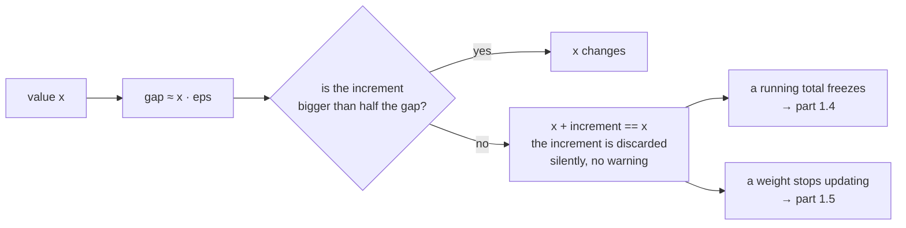

# 1.3 — The gap between representable numbers

## One-line answer

Between any two neighbouring floats there is a gap that grows in proportion to the numbers themselves,
so every float carries a built-in resolution limit — and past a certain magnitude, adding `1` to a
number does not change it at all.

---

## The story

A shop has a note-counting machine. It is a good machine, and it has one limit: it reports totals to
three digits.

Feed it nine notes and it says nine. Feed it ninety-nine and it says ninety-nine. Feed it a hundred
thousand and one, and it says one hundred thousand.

The customer at the counter insists that the extra note is there. The shopkeeper agrees — she is
holding it. She puts that one note through on its own and the machine says one. She drops it back on
the pile and the machine says one hundred thousand.

Neither the machine nor the shopkeeper is broken. The note is real, and the count is real. The machine
simply has no way of writing down the number that is one more than a hundred thousand, so it writes
the nearest number it *can* write — which happens to be the number it already had.

The customer walks out unhappy. Nothing anywhere records that anything went wrong.
---

## The idea in plain language

Part [1.1](1.1-sign-exponent-mantissa.md) established that a float's mantissa gives each *octave* — each
interval `[2ᵏ, 2ᵏ⁺¹)` — the same number of evenly-spaced slots. Part
[1.2](1.2-range-versus-precision.md) established how many slots each format gets. Put those together
and you get the fact this part is about:

> **The gap between one representable float and the next is roughly the value itself times epsilon.**

For `float32`, epsilon is about `1.2 × 10⁻⁷`. So near `1` the gap is about `10⁻⁷`; near `1000` it is
about `10⁻⁴`; near a million it is about `0.06`. The float line is not a ruler with even markings — it
is a ruler whose markings spread out as you move right.

Three consequences, and each is a rule you will use for the rest of the curriculum.

**First: precision is relative, so tolerances must be too.** Asking "is this answer within `0.001` of
the right answer?" is a meaningless question until you say how big the answer is. `0.001` is enormous
near zero and invisible near a million. This is why `np.testing.assert_allclose` takes `rtol` — a
*relative* tolerance — as its main knob, and why part 1.1 said `atol=0` unless you genuinely mean a
comparison against zero.

**Second: there is a magnitude past which small additions do nothing.** When the gap grows larger than
the thing you are adding, the sum rounds back to where it started. The exact crossover point is
`1 / eps`: for `float32` that is `2²⁴ = 16,777,216`, and for `float16` it is `2¹¹ = 2048`. Above those
values, `x + 1 == x` is `True`. Not approximately — exactly.

**Read that `float16` number again.** Two thousand and forty-eight. A `float16` counter cannot count
past two thousand. A `float16` running total of anything — token counts, a loss accumulated over a
batch, a sum of attention weights — stops moving at a number you will pass in the first seconds of a
run.

**Third: a difference of two nearby large numbers keeps almost no digits.** If `a` and `b` agree to
six digits and you have seven, the difference `a - b` has one significant digit left. This is called
**catastrophic cancellation**, and it is the reason a numerically careful implementation avoids
subtracting things that are nearly equal — or rearranges the algebra so it never has to.

---

## Why Akshara needs it

- **Part [1.4](1.4-accumulation-error.md)** is this fact applied to a long sum: the running total grows,
  its gap grows with it, and eventually the increments fall into the gap. That is one paragraph away
  from being the reason a `float16` loss accumulator silently freezes.
- **Part [2.1](../02-stable-softmax/2.1-the-softmax-that-returns-nan.md)** subtracts the maximum from a
  vector of logits. That subtraction is exact *because* of where the values sit relative to their gaps,
  and this part is where "exact" gets its meaning.
- **Day 4 part [2.2](../../../day-004-backprop-and-gradcheck/parts/02-gradient-checking/2.2-the-relative-error-criterion.md)**
  chose a *relative* error criterion for gradient checking. This part is why that choice is forced
  rather than stylistic.
- **Day 51** builds the test suite, and every tolerance in it must be derived rather than guessed. A
  tolerance that is too tight makes a flaky test — which the plan's §6 treats as indistinguishable from
  Silent Failure #4.
- **Day 71** implements top-p sampling, which compares a cumulative sum against a threshold. Whether
  the cumulative sum reaches exactly `1.0` is decided by the gaps measured here.

---

## The mechanism

Numpy will tell you the gap at any value directly. `np.spacing(x)` returns the distance from `x` to the
next representable number away from zero:

```python
import numpy as np

for dt, name in ((np.float32, "fp32"), (np.float16, "fp16"), (np.float64, "fp64")):
    print(f"-- {name}")
    for v in (1.0, 100.0, 1024.0, 10000.0, 1e6):
        with np.errstate(over="ignore"):
            x = dt(v)
            if np.isinf(x):
                print(f"   at {v:>10}: overflows this format")
                continue
            print(f"   at {v:>10}: gap {np.spacing(x)!r}")
```

**Line by line:**
- `np.spacing(x)` is the *measured* gap, taken from the representation rather than estimated. It is
  more trustworthy than `x * eps`, which is a good approximation but wrong at octave boundaries.
- The `np.isinf` guard is there because `float16` cannot represent `1e6` at all — part 1.2's ceiling
  of `65504` — and the row that would print a gap instead prints why there is no gap to print.
- Measured on Intel Core i3-1115G4 (2 cores / 4 threads), 11.7 GB RAM, Windows 11, CPython 3.12.12,
  numpy 2.5.2, on 2026-08-26:

```text
-- fp32
   at        1.0: gap np.float32(1.1920929e-07)
   at      100.0: gap np.float32(7.6293945e-06)
   at     1024.0: gap np.float32(0.00012207031)
   at    10000.0: gap np.float32(0.0009765625)
   at  1000000.0: gap np.float32(0.0625)
-- fp16
   at        1.0: gap np.float16(0.000977)
   at      100.0: gap np.float16(0.0625)
   at     1024.0: gap np.float16(1.0)
   at    10000.0: gap np.float16(8.0)
   at  1000000.0: overflows this format
-- fp64
   at        1.0: gap np.float64(2.220446049250313e-16)
   at      100.0: gap np.float64(1.4210854715202004e-14)
   at     1024.0: gap np.float64(2.2737367544323206e-13)
   at    10000.0: gap np.float64(1.8189894035458565e-12)
   at  1000000.0: gap np.float64(1.1641532182693481e-10)
```

Two rows are worth stopping on.

**`fp16` at 1024: the gap is `1.0`.** At a thousand, consecutive `float16` values are one apart. The
format has become an integer type. And at ten thousand the gap is `8.0` — the nearest `float16` values
to `10000` are eight apart, so `10001` through `10007` do not exist.

**`fp32` at a million: the gap is `0.0625`.** One sixteenth. Anything smaller than one thirty-second
added to a million disappears entirely, which is the concrete version of part 1.1's closing remark.

You can also ask for the literal next float, which removes any doubt about what "next" means:

```python
print("fp32 next after 1.0 :", repr(np.nextafter(np.float32(1.0), np.float32(2.0))))
print("fp32 next after 1e6 :", repr(np.nextafter(np.float32(1e6), np.float32(2e6))))
print("fp16 next after 1.0 :", repr(np.nextafter(np.float16(1.0), np.float16(2.0))))
```

**Line by line:**
- `np.nextafter(x, direction)` steps exactly one representable value from `x` toward `direction`. The
  second argument only supplies a direction; its magnitude is irrelevant.
- This is the function to reach for when you need "the smallest number strictly greater than `x`" —
  for an exclusive bound, or for the smallest positive subnormal via `np.nextafter(0.0, 1.0)`.
- Measured on this machine, 2026-08-26: `1.0000001`, `1.00000006e+06` and `1.001`. The middle one
  prints in a form that hides its own point — the value after a million differs in the seventh digit,
  which is all `float32` has.

Now the crossover, computed rather than asserted:

```python
for dt, name in ((np.float16, "fp16"), (np.float32, "fp32"), (np.float64, "fp64")):
    n = dt(1.0)
    steps = 0
    while n + dt(1.0) != n and steps < 200:
        n = n * dt(2.0)
        steps += 1
    print(f"  {name}: x + 1 == x first at x = {n!r} (2**{steps})")
```

**Line by line:**
- The loop doubles `n` until adding `1.0` stops changing it. Doubling is exact in floating point — part
  1.1 showed it only touches the exponent — so the search introduces no error of its own.
- `n + dt(1.0) != n` is deliberate exact float comparison, which part 1.1 called a bug almost
  everywhere. This is one of the exceptions: the *question being asked* is literally "are these two
  floats the same value?", so exact comparison is the correct operator rather than a mistake.
- The `steps < 200` guard stops the loop reaching `inf` if a format ever failed to converge. It never
  fires here; it is there so a copy of this loop in someone's code cannot hang.
- Measured on this machine, 2026-08-26:

```text
  fp16: x + 1 == x first at x = np.float16(2.048e+03) (2**11)
  fp32: x + 1 == x first at x = np.float32(1.6777216e+07) (2**24)
  fp64: x + 1 == x first at x = np.float64(9007199254740992.0) (2**53)
```

`2¹¹`, `2²⁴`, `2⁵³` — one more than the mantissa width in each case, because the implied leading bit
buys one. **The `fp64` number, 9,007,199,254,740,992, is why JSON integers are unsafe above about
`9 × 10¹⁵`** — the same fact, met in a completely different context.



And the concrete case part 1.1 asked you to predict:

```python
a = np.float32(1048576.0)                       # 2**20
print("  a + 0.05    == a :", a + np.float32(0.05) == a)
print("  a + 0.0625  == a :", a + np.float32(0.0625) == a)
print("  a + 0.125        :", repr(a + np.float32(0.125)))
```

**Line by line:**
- The gap at `2²⁰` is `0.125`, so `0.0625` is exactly half a gap and rounds to even — back to `a`.
- `0.05` is well under half a gap and disappears without argument.
- `0.125` is a full gap and lands on the next representable value, `1.0485761e+06`.
- Measured on this machine, 2026-08-26: `True`, `True`, `np.float32(1.0485761e+06)`. **Two of those
  three additions had no effect and neither produced a warning.**

---

## Shapes

| Tensor | Symbolic shape | Concrete here | What each axis means |
| --- | --- | --- | --- |
| `x` | `()` | `1.0` … `1e6` | a single value whose gap is being measured |
| `np.spacing(x)` | same as `x` | `1.19e-07` at `1.0` | elementwise — one gap per element |
| a probability vector `p` | `(V,)` | `(50,)` | vocabulary; entries near `1` have gaps of `1e-07`, entries near `1e-20` have gaps of `1e-27` |
| `cumsum(p)` | `(V,)` | `(50,)` | the running total whose gap grows as it approaches `1.0` — Day 71's top-p threshold |

The probability row is the one that matters later: **a vector can hold values whose gaps differ by
twenty orders of magnitude**, so a single absolute tolerance applied across it is meaningless in one
direction or the other.

---

## When it breaks

The loud version does not exist. There is no warning for this — that is the entire problem. What you
get instead is a test that fails for reasons that look impossible:

```console
>>> import numpy as np
>>> a = np.float32(2 ** 24)
>>> b = a + np.float32(1.0)
>>> b == a
True
>>> np.spacing(a)
np.float32(2.0)
>>> assert b > a
Traceback (most recent call last):
  File "<stdin>", line 1, in <module>
AssertionError
```

Verbatim on this machine, 2026-08-26. **The assertion that `b > a` fails after adding a positive number
to `a`.** Nothing was corrupted; `b` and `a` are the same float, because the gap at `2²⁴` is `2.0` and
`1.0` is only half of it, so the sum rounded back down. One power of two lower — at `2²³`, where the
gap is `1.0` — the same addition works, which is what makes this boundary so easy to test on the wrong
side of.

**The silent version, which is the one that reaches production:**

```console
>>> total = np.float16(0.0)
>>> for _ in range(10000):
...     total = np.float16(total + np.float16(0.1))
>>> total
np.float16(256.0)
```

Verbatim on this machine, 2026-08-26. The loop asked for ten thousand additions of `0.1` and expected
`1000.0`. It got `256.0`, and it would get `256.0` for a hundred thousand additions too — the total
reached a magnitude where the gap is `0.25`, `0.1` rounds away, and the accumulator froze. **No warning,
no exception, a perfectly plausible-looking number**, and part [1.4](1.4-accumulation-error.md) is that
failure taken apart properly.

The check that catches it, and it is one line:

```python
def assert_increment_survives(total, increment, name="accumulator"):
    """Fail if `increment` is too small to change `total` in its own dtype."""
    if type(total)(total + increment) == total and increment != 0:
        raise ValueError(
            f"{name}: increment {increment!r} is below the representable gap "
            f"{np.spacing(total)!r} at total {total!r} — it will be discarded"
        )
```

**Line by line:**
- `type(total)(total + increment)` forces the sum back into the accumulator's own dtype before
  comparing. Without that cast, numpy may promote the addition to a wider type and the check would
  pass while the real accumulation still fails.
- `and increment != 0` keeps a genuinely zero increment from being reported as a bug. Adding zero is
  supposed to do nothing.
- Reporting `np.spacing(total)` in the message is what makes the error actionable: it tells you the
  magnitude at which the accumulator gave up, which points straight at the fix — accumulate wider.
- **In real code you do not call this per element.** You accumulate in `float32` or `float64` and the
  problem never arises. This function is for the moment you are debugging a frozen metric and need
  the failure named.

---

## In production

**What a research engineer writes instead of the teaching version.** They do not call `np.spacing` in
anger. What they carry is one rule and one number: *accumulate in a wider dtype than you compute in*,
and *`float16` cannot count past 2048*. Those two facts prevent essentially every bug in this part.
Concretely, that means reductions — sums, means, norms, loss accumulation, metric accumulation — take
an explicit accumulator dtype, and the framework APIs all provide one: numpy's `.sum(dtype=...)` and
PyTorch's `.sum(dtype=...)` both exist for exactly this reason, and leaving them at the default is the
bug.

**What degrades at scale.** The number of accumulated terms. Everything here is fine for ten additions
and fatal for ten million — and the number of terms grows with batch size, sequence length and step
count all at once. A metric that was accurate in a 100-step smoke test can be wrong in a 100,000-step
run **with no code change at all**, which is why "it worked in the small run" is not evidence.

**The failure that only shows with real data.** Long sequences. Attention over 8192 positions sums 8192
terms per row; a toy test with `T = 8` sums eight. The gap-driven error grows with the number of terms,
so the toy test cannot see it. This is one of several reasons Day 32 tests attention at more than one
sequence length rather than one convenient one.

**The review comment.** *"`losses.append(loss)` then `sum(losses)` in `fp16`. Accumulate in `fp32` —
this freezes at 2048 and your reported loss will be wrong after the first few hundred steps."*

**The interview question.** *"When is `x + 1 == x` true for a float?"* The weak answer is "when `x` is
very large". The strong answer is the threshold and where it comes from: when `1` is smaller than half
the gap at `x`, which happens at `1/eps` — `2²⁴` for `float32`, `2¹¹` for `float16`, `2⁵³` for
`float64` — because the gap is `x · eps` and each format's epsilon is set by its mantissa width. The
follow-up that shows you have hit it: *and that is why you never accumulate a long sum in the dtype you
computed it in.*

**Compute tier: T0.** Pure IEEE-754 arithmetic on a laptop CPU; every number reproduces exactly on any
conforming machine. There is nothing here a GPU would change — **except that a GPU makes the problem
worse in practice**, because it makes long reductions cheap enough that you do far more of them. The
hardware does not change the arithmetic; it changes how many times you run it.

---

## Check yourself

Run this. It prints **three gaps that differ by six orders of magnitude, and one addition that has no
effect**:

```python
import numpy as np

for v in (1.0, 1024.0, 1e6):
    print(f"  fp32 gap at {v:>10}: {np.spacing(np.float32(v))!r}")
print("  fp16 gap at     1024.0:", repr(np.spacing(np.float16(1024.0))))

a = np.float32(1048576.0)
print("  1048576 + 0.05 == 1048576 :", a + np.float32(0.05) == a)

n = np.float32(1.0)
while n + np.float32(1.0) != n:
    n = n * np.float32(2.0)
print("  fp32: x + 1 == x from x =", repr(n))
```

**Line by line:**
- The three `fp32` gaps print `1.1920929e-07`, `0.00012207031` and `0.0625`. They grow with the value,
  by the same factor the value grew.
- The `fp16` gap at 1024 prints `1.0`. **Say out loud what that means for a `float16` token counter.**
- The addition prints `True` — a positive number was added and nothing happened.
- The loop prints `1.6777216e+07`. Now work out on paper what the equivalent number is for `float16`,
  check it, and say whether a `float16` step counter would survive a training run.

**Say this out loud, without scrolling up:** state the rule that connects a float's value to the gap
beside it, and give the magnitude at which `float32` stops being able to count by ones.
