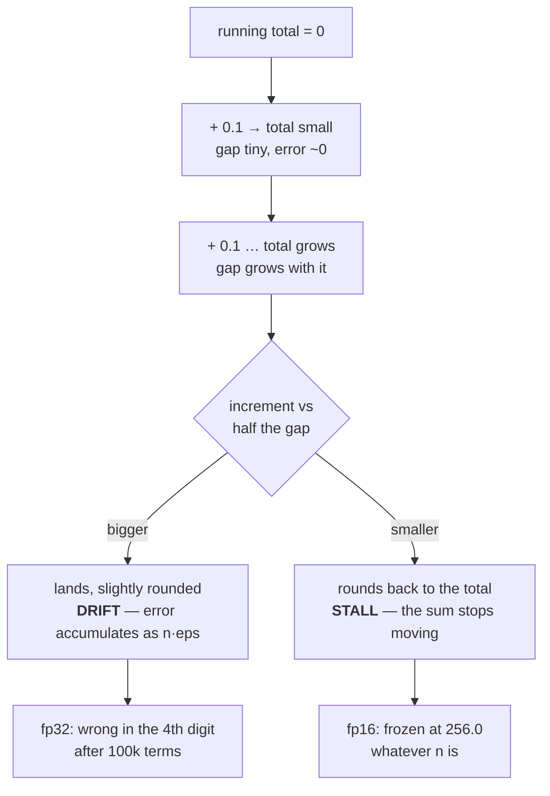

# 1.4 — 💥 The sum that was wrong by fourteen hundred

## One-line answer

Adding numbers one at a time lets the rounding error of every addition pile onto the same running
total, so a long sum in a narrow dtype drifts — and in `float16` it does not merely drift, it stops
entirely at a number that looks like a plausible answer.

---

## The story

A shop takes delivery of a hundred thousand identical screws, each weighing a tenth of a gram, and the
owner wants the total weight.

Two people could work it out. The first stands at the door with a calculator, keeping a running total,
adding 0.1 every time a screw goes past. The second waits until everything is inside, splits the pile
into two halves, weighs each half, and adds the two numbers together.

Both are doing correct arithmetic. Both are using the same scale, with the same three-digit limit.

The second person gets ten thousand grams. The first gets nine thousand nine hundred and ninety-eight
and a half.

The difference is not the scale and it is not the arithmetic. It is that the first person's running
total spent most of the afternoon being a big number that a tenth of a gram could barely shift, while
the second person only ever added two numbers of roughly the same size — and *roughly the same size*
is exactly the condition under which a rounding scale does its best work.

The owner, naturally, believes the first number, because somebody stood there and watched every single
screw go in.
---

## The idea in plain language

Part [1.3](1.3-the-gap-between-representable-numbers.md) established that the gap beside a float grows
with the float. This part is the consequence, and it is the most common numerical bug in practice.

When you add a small number to a large running total, the result must be rounded to the nearest
representable value — and that rounding throws away up to half a gap. Do it once and the error is
invisible. Do it `n` times and **the errors accumulate onto the same total**, because each addition
starts from the already-slightly-wrong result of the last one.

Two failure regimes, and they are qualitatively different:

**Drift.** While the increment is still bigger than the gap, every addition lands somewhere, but each
one is a little off. The errors partly cancel and partly do not, and the total error grows roughly like
`n × eps × total` in the worst case. This is a `float32` problem: annoying, bounded, and fixable.

**Stall.** Once the running total grows large enough that the increment is smaller than *half* the gap,
every subsequent addition rounds straight back to the current total. **The sum stops.** Adding a
million more terms changes nothing. This is a `float16` problem and it is not a drift — it is a wall.

The fix has three levels, and knowing which one you need is the actual skill:

1. **Accumulate in a wider dtype.** Compute in whatever you like, add up in `float32` or `float64`.
   This costs one keyword argument and solves the overwhelming majority of cases.
2. **Sum pairwise.** Instead of one running total, add neighbours in pairs, then pairs of pairs. No
   accumulator ever gets far ahead of the terms being added to it, so the error grows like `log n`
   rather than `n`. **numpy already does this** — which is why the naive Python loop and `np.sum` in
   this part disagree so dramatically.
3. **Compensate.** Keep a second variable holding the error that the last addition threw away, and
   feed it back into the next one. This is *Kahan summation*, it costs about three extra operations
   per element, and it is what you reach for when you genuinely cannot afford a wider accumulator.

---

## Why Akshara needs it

- **Day 6 part [2.4](../../../day-006-entropy-cross-entropy-perplexity/parts/02-cross-entropy/2.4-the-mean-over-what.md)**
  reduces a `(B, T)` loss tensor to a scalar with a mean — which is a sum. At `B × T = 4096` in `fp16`
  that mean is not merely imprecise; it is stalled.
- **Part [2.1](../02-stable-softmax/2.1-the-softmax-that-returns-nan.md)** sums `exp` values across a
  vocabulary of tens of thousands. That is exactly the long-sum-of-small-numbers shape this part warns
  about, and it is why the softmax denominator is a place to be careful.
- **Day 8** accumulates gradients over micro-batches before a step. The accumulator is a sum, it runs
  in whatever dtype the tensors are in, and a stalled accumulator means the later micro-batches
  contribute nothing at all.
- **Day 32**'s attention sums `T` weighted value vectors per position. At `T = 8192` that is a long sum
  in the hot path of the whole model.
- **Day 114**'s eval harness averages a metric over thousands of examples, and a metric that drifts is
  a metric that cannot resolve the difference between two checkpoints — the plan's Silent Failure #4
  wearing a numerical disguise.

---

## The mechanism

The experiment: add `0.1` to itself a hundred thousand times, four different ways, and compare against
the exact answer of `10000.0`.

```python
import numpy as np

N = 100_000

def naive(a):
    """One running total, one addition at a time — what a hand-written loop does."""
    s = a.dtype.type(0.0)
    for v in a:
        s += v
    return s

x32 = np.full(N, 0.1, dtype=np.float32)                  # (N,)
print(f"  naive fp32 loop            : {naive(x32)!r}")
print(f"  np.sum fp32 (pairwise)     : {np.full(1_000_000, 0.1, dtype=np.float32).sum()!r}")
print(f"  np.sum fp32 data, fp64 acc : {np.full(1_000_000, 0.1, dtype=np.float32).sum(dtype=np.float64)!r}")
print(f"  np.sum fp64                : {np.full(1_000_000, 0.1, dtype=np.float64).sum()!r}")
```

**Line by line:**
- `a.dtype.type(0.0)` creates the accumulator **in the array's own dtype**. Writing `s = 0.0` instead
  would make it a Python float — a `float64` — and numpy would promote every addition, quietly fixing
  the bug this code exists to demonstrate. That one line is the difference between reproducing the
  failure and not seeing it.
- `s += v` is the running total. This is the shape of every hand-written accumulation loop, and it is
  the worst possible order for floating-point addition.
- `.sum(dtype=np.float64)` keeps the *data* in `float32` and the *accumulator* in `float64`. This is
  the one-keyword fix, and it is available on every reduction in numpy and PyTorch.
- The pairwise and fp64 rows use `N = 1,000,000` rather than `100,000`, because the Python loop at a
  million elements is slow enough to be tedious and the vectorized versions are not. **The exact
  answers differ (`100000.0` vs `10000.0`), so compare each row against its own exact value, not
  against each other.**
- Measured on Intel Core i3-1115G4 (2 cores / 4 threads), 11.7 GB RAM, Windows 11, CPython 3.12.12,
  numpy 2.5.2, on 2026-08-26:

```text
  naive fp32 loop,   N=  100,000 : np.float32(9998.557)          exact    10000.0   abs err 1.443359
  np.sum fp32 (pairwise), N=1,000,000 : np.float32(100000.01)    exact   100000.0   abs err 0.007812
  np.sum fp32 data, fp64 accumulator  : np.float64(100000.00149011612)        abs err 1.490116e-03
  np.sum fp64                         : np.float64(100000.00000000003)        abs err 2.910383e-11
```

The naive loop is wrong by **1.44 kilograms out of ten thousand** after a hundred thousand additions —
and it is wrong in the direction that makes it look like the parts were lighter than specified. The
pairwise sum, over *ten times as many terms*, is wrong by `0.0078`. That is not a small improvement;
it is a different algorithm.

Watch the error grow with `n`, which is what tells you it is systematic rather than luck:

```python
def naive_n(n):
    s = np.float32(0.0)
    v = np.float32(0.1)
    for _ in range(n):
        s = np.float32(s + v)
    return float(s)

for n in (10, 100, 1000, 10_000, 100_000):
    got, exact = naive_n(n), n * 0.1
    print(f"  n={n:>7}  naive {got:>14.6f}  exact {exact:>10.1f}  rel err {abs(got - exact) / exact:.3e}")
```

**Line by line:**
- `np.float32(s + v)` forces the result back to `float32` after every addition. Without the wrapper,
  numpy scalar arithmetic can promote and the drift disappears — the same trap as the accumulator
  dtype above, and the reason this demonstration is fussier than it looks.
- Reporting **relative** error rather than absolute is deliberate: part 1.3 established that precision
  is relative, so the relative column is the one that can be compared across the rows.
- Measured on this machine, 2026-08-26:

```text
  n=     10  naive       1.000000  exact        1.0  rel err 1.192e-07
  n=    100  naive      10.000002  exact       10.0  rel err 1.907e-07
  n=   1000  naive      99.999046  exact      100.0  rel err 9.537e-06
  n=  10000  naive     999.902893  exact     1000.0  rel err 9.711e-05
  n= 100000  naive    9998.556641  exact    10000.0  rel err 1.443e-04
```

Ten terms: the error is one epsilon, which is as good as arithmetic gets. A hundred thousand terms: the
relative error is **a thousand times epsilon**. The error grows with the number of terms, exactly as
the model predicts, and by `n = 100,000` a `float32` sum has lost three of its seven digits.



Now the same experiment in `float16`, which is where drift becomes a wall:

```python
for n in (1000, 2048, 10000, 100000):
    s = np.float16(0.0)
    v = np.float16(0.1)
    for _ in range(n):
        s = np.float16(s + v)
    print(f"  fp16 sequential sum of {n:>6} x 0.1 -> {s!r}   exact {n * 0.1:>8.1f}")
```

**Line by line:**
- `np.float16(0.1)` is not `0.1`. It is `0.0999755859375` — measured on this machine — so even a
  perfect summation would land slightly low. That is a *second*, smaller error, and it is not the one
  this code is about.
- Everything else is the naive loop from above with the dtype changed. **Only the dtype changed.**
- Measured on this machine, 2026-08-26:

```text
  fp16 sequential sum of   1000 x 0.1 -> np.float16(105.2)   exact    100.0
  fp16 sequential sum of   2048 x 0.1 -> np.float16(236.1)   exact    204.8
  fp16 sequential sum of  10000 x 0.1 -> np.float16(256.0)   exact   1000.0
  fp16 sequential sum of 100000 x 0.1 -> np.float16(256.0)   exact  10000.0
```

**The last two rows are the same number.** Ten thousand terms and a hundred thousand terms both give
`256.0`. The accumulator reached 256, where the `float16` gap is `0.25`, and `0.1` is less than half of
that — so every remaining addition rounded back. Ninety thousand parts went past the door and the
clipboard did not move.

Here is the wall, isolated:

```python
s = np.float16(256.0)
print("  gap at 256 in fp16     :", repr(np.spacing(s)))
print("  256 + 0.1              :", repr(np.float16(s + np.float16(0.1))))
print("  256 + 0.125 (half gap) :", repr(np.float16(s + np.float16(0.125))))
print("  256 + 0.25  (full gap) :", repr(np.float16(s + np.float16(0.25))))
```

**Line by line:**
- The gap at 256 is `0.25`, so anything under `0.125` rounds away and anything at exactly `0.125` ties
  — and round-half-to-even sends it back down to `256.0`, which has an even mantissa.
- Measured on this machine, 2026-08-26: `0.25`, `256.0`, `256.0`, `256.2`. **Three of those four lines
  added a positive number and produced no change.**

And the compensated version, for the case where you cannot widen the accumulator:

```python
def kahan(a):
    """Kahan compensated summation: carry the lost low-order bits forward."""
    s = np.float32(0.0)
    c = np.float32(0.0)                       # the error the last addition discarded
    for v in a:
        y = np.float32(v - c)                 # correct this term by the outstanding error
        t = np.float32(s + y)                 # the rounded sum
        c = np.float32((t - s) - y)           # what the rounding actually threw away
        s = t
    return s
```

**Line by line:**
- `c` holds the *compensation*: the part of the previous addition that did not fit. It starts at zero
  and is subtracted from each new term before it is added.
- `(t - s) - y` is the trick, and the parentheses are not optional. `t - s` recovers the amount that
  actually made it into the sum; subtracting `y` leaves the amount that did not. **A compiler or a
  library allowed to reassociate this expression would simplify it to zero and silently delete the
  algorithm** — which is why Kahan summation is written with explicit temporaries and why aggressive
  fast-math flags break it.
- The three extra operations per element are the price. That is roughly a 4× slowdown on a
  memory-bound reduction, which is why "accumulate in `float64`" is almost always the better trade.
- Measured on this machine, 2026-08-26, for `N = 100,000`: `np.float32(10000.0)`, absolute error
  **`0.000000`**. In the same dtype, in the same loop shape, that the naive version got wrong by
  `1.44`.

---

## Shapes

| Tensor | Symbolic shape | Concrete here | What each axis means |
| --- | --- | --- | --- |
| `x32` | `(N,)` | `(100000,)` | the terms — all `0.1`, all `float32` |
| the accumulator `s` | `()` | scalar | one value, in the **array's** dtype, holding the running total |
| a loss tensor to reduce | `(B, T)` | `(4, 10)` | batch · position — Day 6's mean is a sum over `B × T` terms |
| attention weights per row | `(T,)` | `(8192,)` | one weight per key position; Day 32 sums `T` of them per query |

The `(B, T)` row is the one to keep: a mean over a `(32, 1024)` batch is a sum of `32,768` terms, which
is well past the `float16` wall and comfortably inside the range where `float32` drift is measurable.

---

## When it breaks

There is no loud version. Not one line of this part raised an exception or printed a warning. The
closest thing to an error message is a test that fails at a tolerance you thought was generous:

```console
>>> import numpy as np
>>> s = np.float32(0.0)
>>> for _ in range(100_000):
...     s = np.float32(s + np.float32(0.1))
>>> np.testing.assert_allclose(s, 10000.0, rtol=1e-6)
Traceback (most recent call last):
  File "<stdin>", line 1, in <module>
AssertionError:
Not equal to tolerance rtol=1e-06, atol=0

Mismatched elements: 1 / 1 (100%)
Max absolute difference among violations: 1.44335938
Max relative difference among violations: 0.00014434
 ACTUAL: array(9998.557, dtype=float32)
 DESIRED: array(10000.)
```

Verbatim on this machine, 2026-08-26. The relative difference is `1.4e-04` where `float32`'s epsilon is
`1.2e-07` — **a thousand epsilons**, from arithmetic that is individually correct at every step.

**The silent version is the whole point of this document:**

```console
>>> total = np.float16(0.0)
>>> for _ in range(100_000):
...     total = np.float16(total + np.float16(0.1))
>>> total
np.float16(256.0)
>>> np.isfinite(total)
np.True_
```

Verbatim on this machine, 2026-08-26. `256.0` is finite, positive, not `nan`, not `inf`, and passes
every sanity check anybody writes. **A metric that reports `256.0` forever looks like a metric that has
converged.** That is the shape of this failure in a real run: a training loss that flattens beautifully
at some plausible value and never moves again, while the model behind it is fine.

The check, and it is a property test rather than a value test:

```python
def check_sum_is_stable(values, dtype, rtol=1e-4):
    """Compare a dtype's own sum against a float64 reference. Fails loudly on drift or stall."""
    ref = np.asarray(values, dtype=np.float64).sum()                 # ()
    got = np.asarray(values, dtype=dtype).sum(dtype=dtype)           # ()
    rel = abs(float(got) - ref) / max(abs(ref), 1e-30)
    if rel > rtol:
        raise ValueError(
            f"sum in {np.dtype(dtype).name} is off by {rel:.3e} relative "
            f"({got!r} vs {ref!r}) over {len(values)} terms — widen the accumulator"
        )
```

**Line by line:**
- `.sum(dtype=np.float64)` on the reference line is what makes it a reference. Comparing a dtype
  against itself proves nothing.
- `.sum(dtype=dtype)` on the second line **forces** the accumulator to the narrow type. Numpy's default
  for `float16` input is to accumulate in `float16`, so this line is reproducing the real behaviour
  rather than pessimising it — but writing it explicitly means the test still tests what it claims if
  that default ever changes.
- `max(abs(ref), 1e-30)` prevents a division by zero when the terms genuinely sum to nothing, which is
  the degenerate case every relative-error check needs to handle.
- `len(values)` in the message is there because **the number of terms is the diagnosis**. A failure at
  100 terms means something else is wrong; a failure at 100,000 terms means exactly this.
- Run this once, on the real batch shape, when you change a dtype. It is not a per-step check.

---

## In production

**What a research engineer writes instead of the teaching version.** They write `.sum(dtype=torch.float32)`
and move on. The whole of this document collapses into a habit: **reductions get an explicit accumulator
dtype, always, even when the current input dtype makes it unnecessary** — because the input dtype is
exactly the thing that changes when somebody enables mixed precision six months later, and a reduction
without an explicit accumulator silently changes behaviour when it does.

The second habit is structural: **do not hand-write accumulation loops over tensors.** `np.sum` is
pairwise and a hand-written `for` loop is not, so the library version is both faster and more accurate
— an unusually clean win, and the reason Day 2 part
[3.2](../../../day-002-tensors-shape-stride/parts/03-matmul/3.2-three-loops-then-one-call.md)'s
"three loops then one call" argument has a numerical half as well as a speed half.

**What degrades at scale.** Every axis at once, and they multiply. Longer sequences mean more terms per
attention row; larger batches mean more terms per loss mean; more steps mean more gradient
accumulations; more eval examples mean more terms per metric. A pipeline validated at `T = 128`,
`B = 8`, 100 steps has been validated at roughly one ten-thousandth of the term count it will see, and
the error grows with that count.

**The failure that only shows with real data.** Skewed magnitudes. This part summed a hundred thousand
*identical* values, which is the friendly case. Real data has a few large terms and a long tail of tiny
ones, and if the large ones come first the running total is already big when the small ones arrive — so
the tail contributes far less than it should, or nothing. **Sorting ascending before summing measurably
improves accuracy**, which is a genuinely surprising fact and a good sign that someone has met this
problem: it is the same insight as pairwise summation, applied by hand.

**The review comment.** *"This averages the loss over the epoch in the model's dtype. Accumulate in
`fp32` — and add the term count to the log line, because a frozen average and a converged average look
identical."*

**The interview question.** *"You are averaging a metric over a million examples in `float16` and the
average stops changing halfway through. What happened?"* The weak answer is "precision loss". The
strong answer names the mechanism: the accumulator grew until the increment fell below half the gap at
that magnitude, so every subsequent addition rounded back to the current value — `float16` hits that
wall at 2048 for increments of 1. Then the fix, in order of preference: accumulate in `float32`, or sum
pairwise, or compensate with Kahan if the accumulator dtype is genuinely fixed.

**Compute tier: T0.** Every figure here is IEEE-754 arithmetic on a laptop CPU and reproduces exactly
on any conforming machine. What T0 does **not** show is the ordering effect: on a GPU, a reduction is
performed by many threads in parallel and combined in an order that depends on the hardware's block
scheduling, so **two runs of the same GPU reduction can give different last bits**. That is a real
source of run-to-run non-determinism, it is not a bug, and Day 51 has to choose tolerances that
survive it.

---

## Check yourself

Run this. It prints **one sum that drifts and one that stops moving entirely**:

```python
import numpy as np

s = np.float32(0.0)
for _ in range(100_000):
    s = np.float32(s + np.float32(0.1))
print("  fp32 naive  :", repr(s), " exact 10000.0")
print("  fp32 np.sum :", repr(np.full(100_000, 0.1, dtype=np.float32).sum()))

t = np.float16(0.0)
for _ in range(10_000):
    t = np.float16(t + np.float16(0.1))
print("  fp16 naive  :", repr(t), " exact 1000.0")
print("  fp16 gap at that value:", repr(np.spacing(t)))
```

**Line by line:**
- The `fp32` naive line prints `9998.557`; `np.sum` over the same terms prints `10000.001`. **The two
  lines differ only in the order of the additions** — same dtype, same terms, same total count.
- The `fp16` line prints `256.0` and the gap beside it prints `0.25`. Divide `0.25` by two and compare
  against `0.1`: that inequality is the entire failure.
- Now change `10_000` to `1_000_000` in the `fp16` loop and predict the answer **before** you run it.
  If your prediction is `256.0`, you have understood this part.

**Say this out loud, without scrolling up:** name the two regimes of accumulation error, say which
dtype gets which, and give the three fixes in the order you would try them.
