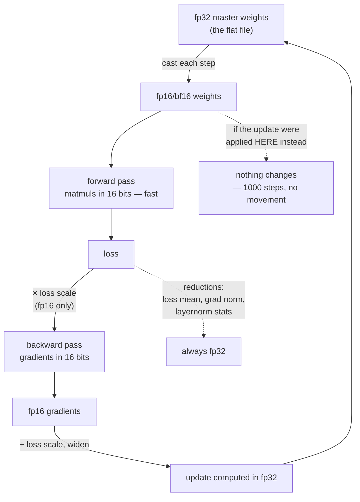

# 1.5 — Mixed precision: what is kept in fp32, and why

## One-line answer

Training in 16 bits works by keeping a `float32` copy of the weights and doing every *reduction* in
`float32` while the expensive matrix multiplications run narrow — because a `float16` weight cannot
absorb a `float16` update, and a run that skips the master copy trains for a thousand steps and changes
nothing.

---

## The story

A restaurant keeps its master recipes in a book, written down to a quarter of a spoon. Every morning
those recipes are copied onto small cards that the cooks carry around, and the cards only have room
for whole spoons.

For a year this works perfectly well. The cooks read the cards, cook, and at the end of each day they
report back — "this one wants a quarter spoon less salt" — and the correction goes into the **book**,
where a quarter of a spoon still means something.

Then somebody decides the book is a waste of space. From now on the cards are the recipes, and
corrections get written straight onto the cards.

The first correction comes in: a quarter spoon less salt. The cook looks at the card, which is written
in whole spoons. He rounds. The card does not change.

The next day: a quarter spoon less. The card does not change. Every day for a year, every correction
is real, every cook does the job correctly, and the recipes never move at all.

Nobody notices, because nothing ever *fails*. The food comes out exactly the way it came out
yesterday.
---

## The idea in plain language

Everything in this section has been building to a single practical question: **can a model be trained
in 16 bits?** The answer is yes, and the way it is done is called *mixed precision* — some things in
16 bits, some in 32, and the interesting part is which is which.

Three quantities are involved and each has a different requirement:

- **The weights.** These change by tiny relative amounts each step. A typical update is a fraction of
  a percent of the weight's own value, sometimes far less. Part [1.3](1.3-the-gap-between-representable-numbers.md)
  gave the fatal number: `float16`'s gap at `1.0` is about `0.001`, so **an update smaller than about
  `0.0005` on a weight of `1.0` cannot land at all.**
- **The gradients.** These can be extremely small in absolute terms, and part
  [1.2](1.2-range-versus-precision.md) showed `float16` flushing `1e-30` to exactly zero. Small
  gradients are not merely imprecise in `fp16`; they cease to exist.
- **The activations and the matmuls.** These are large, well-scaled, and enormously expensive. They are
  the reason anybody wants 16 bits in the first place, and they are the part that tolerates it best.

So the standard arrangement, and every mixed-precision trainer implements some version of it:

1. Keep a **master copy of the weights in `float32`**. This is the flat file, and it is the single most
   important piece.
2. Cast a 16-bit copy for the forward and backward pass. The matmuls run narrow and fast.
3. Compute the gradients in 16 bits.
4. **Apply the update to the `float32` master**, not to the 16-bit copy. Small updates land, because
   `float32`'s gap at `1.0` is `1.2e-07` rather than `0.001`.
5. Do every **reduction** — the loss mean, the gradient norm, the softmax denominator, the layer-norm
   statistics — in `float32`, for the reason part [1.4](1.4-accumulation-error.md) measured.

And one extra piece that is needed for `fp16` and **not** for `bf16`:

6. **Loss scaling.** Multiply the loss by a large constant before the backward pass, so every gradient
   is scaled up out of `fp16`'s underflow region; divide it back out in `float32` before the update.
   The chain rule makes this exact — scaling the loss scales every gradient by the same factor — so it
   costs nothing but bookkeeping. It exists purely to work around `fp16`'s five-bit exponent, which is
   why hardware with `bf16` made it optional.

The memory bill is the thing people get wrong when they first meet this. Mixed-precision training does
**not** halve memory. You now hold a `float32` master copy *and* a 16-bit working copy, so the weights
cost `4 + 2 = 6` bytes per parameter rather than `4`. What actually shrinks is the *activations*, which
in a deep network dominate — and the matmuls get faster, which is the real prize. Day 8 part
[2.4](../../../day-008-gradient-descent-and-adam/parts/02-adam/2.4-the-optimizers-memory.md) works the
whole bill out with the optimizer's share included.

---

## Why Akshara needs it

- **Day 8** writes the optimizer step `w ← w − lr · g`. That line is where the update either lands or
  does not, and this part is the reason its dtype is a decision rather than a detail.
- **Day 8 part [2.4](../../../day-008-gradient-descent-and-adam/parts/02-adam/2.4-the-optimizers-memory.md)**
  counts the bytes. The `4 + 2` above is one row of that table; Adam's two moment buffers are the rest
  of it.
- **Day 66** is the pretraining run on a free notebook GPU, where whether the model fits and whether it
  finishes in one session are both decided by this arrangement.
- **Days 78–85** quantize below 16 bits, and every technique there is this idea taken further: keep the
  sensitive parts wide, narrow the expensive parts, and **measure the damage rather than assume it**.
- **Part [2.4](../02-stable-softmax/2.4-the-softmax-that-returned-all-zeros.md)** is the same lesson
  applied to the softmax rather than the optimizer: the operation is fine in 16 bits until a reduction
  inside it is not.

---

## The mechanism

The failure first, because it is three lines and it is decisive:

```python
import numpy as np

lr = 1e-3
for dt, name in ((np.float16, "fp16"), (np.float32, "fp32")):
    w = dt(1.0)                                   # ()  one weight
    g = dt(0.01)                                  # ()  its gradient
    step = dt(lr) * g                             # ()  the update
    print(f"  {name}: w={float(w)}  lr*g={float(step):.3e}  "
          f"w-step={float(dt(w - step)):.10f}  changed: {dt(w - step) != w}")
```

**Line by line:**
- `w = dt(1.0)` is a weight of typical initialised magnitude. Nothing here is a pathological value.
- `g = dt(0.01)` is a perfectly ordinary gradient, and `lr = 1e-3` is an ordinary learning rate. The
  product is `1e-05` — small, but not remotely close to `fp16`'s underflow floor of `6e-08`.
- `dt(w - step)` forces the subtraction result back into the weight's own dtype, which is what an
  in-place optimizer update does. Without that cast numpy promotes and the failure vanishes.
- `dt(w - step) != w` is exact float comparison, used deliberately: the question is literally "did the
  weight change?", so exact equality is the right operator here for the same reason it was in part
  [1.3](1.3-the-gap-between-representable-numbers.md).
- Measured on Intel Core i3-1115G4 (2 cores / 4 threads), 11.7 GB RAM, Windows 11, CPython 3.12.12,
  numpy 2.5.2, on 2026-08-26:

```text
  fp16: w=1.0  lr*g=1.001e-05  w-step=1.0000000000  changed: False
  fp32: w=1.0  lr*g=1.000e-05  w-step=0.9999899864  changed: True
```

**`changed: False`.** The gradient is fine, the learning rate is fine, the update is `1e-05` and it is
representable in `fp16` with room to spare — and the weight does not move, because `1e-05` is a
hundredth of the *gap* at `1.0`, which part 1.3 measured as `0.000977`.

Now run it a thousand times, which is what a training loop does:

```python
for dt, name in ((np.float16, "fp16"), (np.float32, "fp32")):
    w, g = dt(1.0), dt(0.01)
    for _ in range(1000):
        w = dt(w - dt(lr) * g)                    # ()  the optimizer step, in the weight's dtype
    print(f"  {name}: after 1000 steps w = {float(w):.10f}   (exact: {1.0 - 1000 * lr * 0.01:.10f})")
```

**Line by line:**
- This is the entire inner loop of gradient descent with a constant gradient — the simplest possible
  training run, with no optimizer state, no schedule and no noise to hide behind.
- The exact answer is `1 − 1000 × 0.001 × 0.01 = 0.99`. Any implementation that works should land near
  it.
- Measured on this machine, 2026-08-26:

```text
  fp16: after 1000 steps w = 1.0000000000   (exact: 0.9900000000)
  fp32: after 1000 steps w = 0.9899864197   (exact: 0.9900000000)
```

**A thousand training steps in `fp16` changed the weight by exactly nothing.** Not "trained poorly".
Not "converged slowly". The parameter has the value it was initialised with, to the last bit, and every
individual step in that loop was arithmetically correct.

And the fix, which is one changed dtype:

```python
w32 = np.float32(1.0)                             # ()  the fp32 MASTER weight
g16 = np.float16(0.01)                            # ()  the gradient, computed in fp16
for _ in range(1000):
    w32 = np.float32(w32 - np.float32(lr) * np.float32(g16))   # ()  update applied in fp32
print(f"  fp32 master, fp16 gradient: after 1000 steps w = {float(w32):.10f}")
```

**Line by line:**
- The gradient is still `float16` — it came from a 16-bit backward pass and nothing pretends otherwise.
- `np.float32(g16)` widens it at the moment of use. Widening is exact: every `float16` value is
  representable in `float32`, so this conversion loses nothing.
- **The accumulator `w32` never becomes `float16`.** That is the whole technique. The 16-bit copy used
  in the forward pass is derived from `w32` each step and thrown away; it is never the thing that is
  updated.
- Measured on this machine, 2026-08-26: `0.9899864197` — **identical to the pure-`fp32` run above, to
  every printed digit**, while the gradient was computed in half the width.



Loss scaling, measured, so the mechanism is not just described:

```python
g_small = 1e-8                                    # a small but real gradient
with np.errstate(under="ignore"):
    print("  fp16(1e-8)        :", repr(np.float16(g_small)))
    scaled = np.float16(g_small * 1024)            # scale up BEFORE the cast
    print("  fp16(1e-8 * 1024) :", repr(scaled),
          " then /1024 in fp32 ->", float(np.float32(scaled) / np.float32(1024)))
```

**Line by line:**
- `1e-8` is not an unusual gradient magnitude in a deep network; it is what a small gradient looks like
  a few layers back.
- The multiplication by `1024` happens **in `float64`, before the cast**, which is what the real
  implementation does too: the loss is scaled while it is still wide, and the chain rule carries the
  factor through the whole backward pass.
- The division happens **after widening back to `float32`**, so the scale is removed at full precision
  and the recovered gradient is usable.
- `1024` is a power of two, which makes both the multiply and the divide exact — they only touch the
  exponent, as part [1.1](1.1-sign-exponent-mantissa.md) showed. **Every real loss scaler uses powers
  of two for this reason**, and it adapts the exponent up and down when it detects `inf`.
- Measured on this machine, 2026-08-26: `np.float16(0.0)`, then `np.float16(1.025e-05)`, then
  `1.001172e-08`. **The unscaled gradient was destroyed; the scaled one survived and came back within
  0.1% of its original value.**

---

## Shapes

| Tensor | Symbolic shape | Concrete here | What each axis means |
| --- | --- | --- | --- |
| master weight `w32` | `()` | one value | `float32` — 4 bytes per parameter, never narrowed |
| working weight `w16` | same as `w32` | one value | `float16`/`bf16` — 2 bytes, recreated each step |
| gradient `g` | same as `w` | one value | computed narrow, widened before the update |
| a real weight matrix | `(C, C)` | `(768, 768)` | `589,824` parameters — `2.25 MB` master **plus** `1.13 MB` working copy |
| logits | `(B, T, V)` | `(4, 10, 50)` | batch · position · vocabulary — cast to `fp32` **before** the softmax, per part 2.4 |

The weight-matrix row is the memory point stated concretely: mixed precision makes that matrix cost
`3.38 MB` rather than `2.25 MB`. **The weights get bigger.** The saving is elsewhere.

---

## When it breaks

The loud version, from the `fp16` gradient that overflowed rather than underflowed:

```console
>>> import numpy as np
>>> np.float16(70000.0)
RuntimeWarning: overflow encountered in cast
np.float16(inf)
>>> w = np.float16(1.0) - np.float16(0.001) * np.float16(np.inf)
>>> w
np.float16(-inf)
```

Verbatim on this machine, 2026-08-26. One `inf` gradient poisons its weight, and from the next forward
pass onward the poison spreads: `inf` times zero is `nan`, `nan` propagates through every operation it
touches, and within a step or two the entire loss is `nan`. **This is the good outcome.** It is
obvious, it stops the run, and every mixed-precision trainer handles it by checking for non-finite
gradients and skipping the step — which is also how the loss scaler learns to lower its scale.

**The silent version is this part's subject and it has no error text at all:**

```console
>>> w = np.float16(1.0)
>>> for _ in range(1000):
...     w = np.float16(w - np.float16(1e-3) * np.float16(0.01))
>>> w
np.float16(1.0)
>>> np.isfinite(w)
np.True_
```

Verbatim on this machine, 2026-08-26. The weight is finite, correct-looking, and exactly what it was a
thousand steps ago. In a real run this does not produce a flat loss curve either — the *other*
parameters, the ones whose gradients happen to be large enough, keep training, so the loss goes down
and the run looks healthy. **A fraction of the model is frozen and the loss curve does not say which
fraction.**

The check, and it is one line in the training loop:

```python
def assert_weights_moved(before, after, step, name="params"):
    """Fail if a step left some parameters bit-identical — the frozen-weight failure."""
    unchanged = int(np.sum(np.asarray(before) == np.asarray(after)))    # same shape as params
    total = int(np.asarray(before).size)
    if unchanged == total:
        raise ValueError(f"{name}: step {step} changed NOTHING — {total} params bit-identical")
    if unchanged > total // 2:
        raise ValueError(
            f"{name}: step {step} left {unchanged}/{total} params bit-identical — "
            "updates are falling below the representable gap; widen the master copy"
        )
```

**Line by line:**
- `before == after` is exact equality on floats, which everywhere else in this curriculum is a bug and
  here is the entire measurement: the question is "did these bits change?"
- The two thresholds separate two different diagnoses. **Nothing** changed means the update path is
  broken outright — wrong dtype, or a `zero_grad` in the wrong place, which Day 3 part
  [2.5](../../../day-003-derivatives-and-autograd/parts/02-the-autograd-engine/2.5-zero-grad-the-state-that-leaks.md)
  covers. **Most but not all** changed means precision, which is this part.
- `total // 2` is a threshold chosen for this check, not a law — some parameters legitimately receive
  a zero gradient on a given step. Tune it to your model, and **log the fraction every step rather than
  only raising**, because the trend is more informative than any single threshold.
- Run it on the first few steps of any run where you have changed a dtype. It costs one comparison per
  parameter and it catches the failure at step 2 rather than at hour six.

---

## In production

**What a research engineer writes instead of the teaching version.** They write
`torch.autocast(device_type="cuda", dtype=torch.bfloat16)` around the forward pass and let the
framework decide, per operation, what runs narrow and what runs wide. The framework carries a list:
matmuls and convolutions run in 16 bits; softmax, layer norm, and every reduction run in `fp32`. **That
list is this document.** Someone who has read it can predict what `autocast` will do to an operation
they have just written, and — more importantly — can tell when a custom operation needs to opt out.

`bf16` deserves a specific note, because it changes the recipe. With `bf16` you still keep the `fp32`
master weights, for exactly the reason measured above — the mantissa problem is *worse* in `bf16`, not
better, since it has seven mantissa bits to `fp16`'s ten. What you drop is loss scaling, because
`bf16`'s eight-bit exponent means gradients no longer underflow. **The master copy is not the optional
part; the loss scaler is.**

**What degrades at scale.** The number of frozen parameters grows as the learning rate decays. Late in
a run, with a cosine schedule near its floor, updates are at their smallest relative to the weights —
so a precision problem that was invisible at step 100 with a warm learning rate becomes a majority of
the model at step 90,000. **This failure gets worse over the course of a run**, which is the opposite
of what people expect from a numerical bug and the reason it survives short validation runs.

**The failure that only shows with real data.** Layer-dependent gradient scale. In a deep network the
gradient magnitude varies by orders of magnitude between the first and last layers, so a dtype that is
adequate for the output head starves the embedding layer. **A single global dtype decision has
different consequences per layer**, and the layers that suffer are usually the ones nobody is watching
the metrics for.

**The review comment.** *"This applies the optimizer update to the autocast weights. Keep an `fp32`
master copy and update that — and log the fraction of parameters that changed on the first ten steps."*

**The interview question.** *"Why does mixed-precision training keep a `float32` copy of the weights?"*
The weak answer is "for stability". The strong answer is the arithmetic: weight updates are a tiny
relative fraction of the weight, `float16`'s gap at `1.0` is about `1e-03`, so an update of `1e-05`
rounds away entirely — I have measured a thousand steps leaving a weight bit-identical. The master copy
is `float32` so the update lands. The follow-up that separates people who have run this from people who
have read about it: *and that is also why mixed precision does not save memory on the weights — you now
store both copies. It saves on activations, and it buys matmul throughput.*

**Compute tier: T0.** All of it is CPU arithmetic and every number reproduces on any conforming
machine. What T0 **cannot** show is the entire reason mixed precision exists: on hardware with 16-bit
matmul units, the narrow forward pass is several times faster than the wide one. **This part proves the
correctness half of the argument and cannot touch the speed half** — that is Day 66's measurement on a
free notebook GPU, and until then the honest statement is "this is why it is correct", not "this is why
it is fast".

---

## Check yourself

Run this. It prints **a thousand training steps that changed a weight by exactly nothing, and the same
thousand steps that worked**:

```python
import numpy as np

lr, grad = 1e-3, 0.01

w = np.float16(1.0)
for _ in range(1000):
    w = np.float16(w - np.float16(lr) * np.float16(grad))
print("  fp16 weight after 1000 steps :", repr(w), "  exact 0.99")

m = np.float32(1.0)
for _ in range(1000):
    m = np.float32(m - np.float32(lr) * np.float32(np.float16(grad)))
print("  fp32 master, fp16 grad       :", repr(m))

print("  fp16 gap at 1.0              :", repr(np.spacing(np.float16(1.0))))
print("  the update size              :", lr * grad)
```

**Line by line:**
- The first line prints `np.float16(1.0)`. **A thousand steps, no movement, no warning.**
- The second prints `np.float32(0.9899864)` — the correct answer, from a gradient that was still computed in
  `fp16`.
- The last two lines are the explanation: the gap is `0.000977` and the update is `1e-05`, which is
  about a hundredth of it.
- Now work out the largest learning rate that *would* have moved that `fp16` weight, and say whether it
  is a learning rate you would ever want to use.

**Say this out loud, without scrolling up:** name the three things mixed-precision training keeps in
`float32` and say why each one needs the extra bits — and say whether mixed precision makes the weights
take more memory or less.
