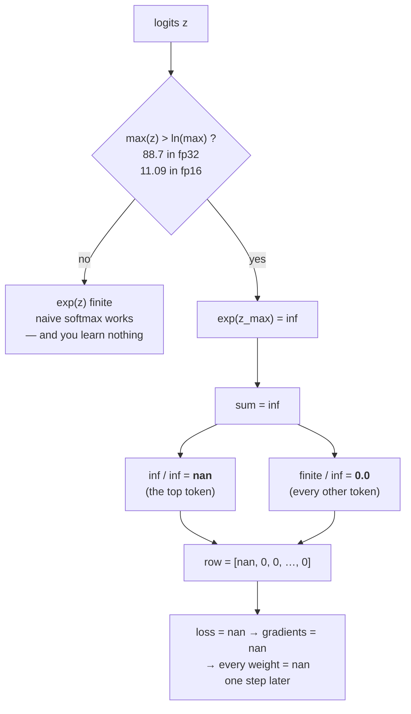

# 2.1 — 💥 The softmax that returns NaN: where `exp` overflows, exactly

## One-line answer

`exp(x)` overflows to `inf` the moment `x` exceeds `ln(max)` for its dtype — `88.7` in `float32` and
only **`11.09`** in `float16` — and since a softmax computes `exp` of raw logits, that threshold is the
exact number at which a model stops producing probabilities and starts producing `nan`.

---

## The story

A shop's weighing scale has four digits on its display. 9999 grams is the largest thing it can say.

For years that is plenty. Then a customer brings in a sack, and the display shows `Err`. The
shopkeeper takes the sack off, checks the plug, puts it back on. `Err`.

The scale is not broken. The sack genuinely weighs more than ten kilograms. And here is the part that
matters: she cannot tell from `Err` **how much** more. She gets `Err` at 10,001 grams, and she gets
`Err` at ten tonnes. The reading is not blurry or approximate. It is gone.

She writes `Err` in her notebook anyway and carries it down to the next line, which asks her to divide
it by another `Err`. That line produces nothing at all. Not a big number, not a small one — nothing,
because one unknowable divided by another unknowable is unknowable.

She now has a result that is not wrong. It is *missing*, and it is sitting in a column where a number
is supposed to be.
---

## The idea in plain language

Day 5 part
[1.3](../../../day-005-logits-softmax-sampling/parts/01-logits-and-probabilities/1.3-softmax-the-map-to-the-simplex.md)
built the softmax and showed why subtracting the maximum before exponentiating is *exact* rather than
approximate — the same value of `exp(zᵢ − m)` divided by the same sum gives the same answer, because
the shared factor `exp(−m)` cancels top and bottom. That part established **the fix**.

This part establishes **the threshold**: the number at which you need it. Because "subtract the max for
stability" is advice, and advice you cannot quantify is advice you will skip.

Softmax computes `exp(z)`. Part [1.2](../01-floating-point/1.2-range-versus-precision.md) established
that every float format has a largest finite value, `max`. So `exp(z)` overflows to `inf` exactly when
`z > ln(max)`, and `ln(max)` is a fixed constant per dtype that you can compute in one line.

Once one entry is `inf`, the sum is `inf`, and the division produces two different disasters at once:

- `inf / inf` is **`nan`** — the entry that overflowed becomes "not a number".
- `finite / inf` is **`0.0`** — every *other* entry becomes exactly zero.

So a single overflowing logit turns the entire row into `[nan, 0, 0, …, 0]`. Note the asymmetry: the
token the model was most confident about is the one that becomes `nan`, and every alternative becomes
impossible. **The output is not a slightly-wrong distribution. It is not a distribution at all.**

Three thresholds, and the third is the one that matters:

| dtype | `max` | `ln(max)` — `exp` overflows above this |
| --- | --- | --- |
| `float64` | `1.8e+308` | `709.78` |
| `float32` | `3.4e+38` | `88.72` |
| `float16` | `65504` | **`11.09`** |

**Eleven.** An attention score before scaling is a dot product of two vectors of length `hs`; with
`hs = 64` and entries of order 1, it lands in the tens routinely. A logit produced by an output head
over a 50,000-token vocabulary is often larger still. `float32`'s ceiling of `88.72` is comfortable and
occasionally reached; `float16`'s ceiling of `11.09` is reached **by ordinary values, in ordinary
models, on the first forward pass**.

---

## Why Akshara needs it

- **Day 30** implements scaled dot-product attention. The `1/√hs` scaling in that formula exists partly
  for gradient reasons and partly for this one — it is what keeps attention logits away from this
  threshold, and this part is where the threshold gets a number.
- **Day 6 part [2.3](../../../day-006-entropy-cross-entropy-perplexity/parts/02-cross-entropy/2.3-why-this-is-the-loss.md)**
  established that the loss takes logits rather than probabilities. Part
  [2.3](2.3-log-softmax-is-a-subtraction.md) is how it can do that safely, and it needs this part's
  threshold to explain what it is avoiding.
- **Part [1.5](../01-floating-point/1.5-mixed-precision.md)** listed "softmax runs in `fp32`" as one of
  the standard mixed-precision rules. **This table is the entire reason for that rule.**
- **Day 71** applies a repetition penalty by adding to logits before sampling. Additions to logits move
  them toward this threshold, and a penalty implementation that ignores it can push a well-behaved model
  over the edge.
- **Day 96**'s DPO loss takes differences of log-probabilities across two models, which is a larger
  dynamic range than a single softmax and therefore closer to the ceiling.

---

## The mechanism

Compute the threshold rather than quoting it:

```python
import numpy as np

for dt, name in ((np.float16, "fp16"), (np.float32, "fp32"), (np.float64, "fp64")):
    mx = np.finfo(dt).max
    thr = np.log(np.float64(mx))
    print(f"  {name}: max={mx!r}   ln(max)={thr!r}")
    with np.errstate(over="ignore"):
        lo, hi = dt(np.floor(thr)), dt(np.ceil(thr))
        print(f"        exp({float(lo):.0f}) = {np.exp(lo)!r}   exp({float(hi):.0f}) = {np.exp(hi)!r}")
```

**Line by line:**
- `np.log(np.float64(mx))` widens to `float64` **before** taking the logarithm. Taking `np.log` of a
  `float16` value would compute the log in `float16` and give a threshold accurate to three digits,
  which is not good enough for a boundary you intend to test against.
- `np.floor(thr)` and `np.ceil(thr)` bracket the threshold with the two nearest integers, so the pair
  of `exp` calls straddles it — one finite, one `inf`. That is the demonstration: not a claim about
  where the boundary is, but the boundary itself, printed from both sides.
- `np.errstate(over="ignore")` suppresses the overflow warning **for this demonstration only**. This
  repository sets `filterwarnings = ["error::RuntimeWarning"]` in `pyproject.toml`, so without it the
  `inf` line would raise. **Never write `errstate` in library code** — it is how a `nan` reaches
  production without anybody being told.
- Measured on Intel Core i3-1115G4 (2 cores / 4 threads), 11.7 GB RAM, Windows 11, CPython 3.12.12,
  numpy 2.5.2, on 2026-08-26:

```text
  fp16: max=np.float16(6.55e+04)      ln(max)=np.float64(11.089866488461016)
        exp(11) = np.float16(5.987e+04)   exp(12) = np.float16(inf)
  fp32: max=np.float32(3.4028235e+38)  ln(max)=np.float64(88.72283905206835)
        exp(88) = np.float32(1.6516363e+38)   exp(89) = np.float32(inf)
  fp64: max=np.float64(1.7976931348623157e+308)  ln(max)=np.float64(709.782712893384)
        exp(709) = np.float64(8.218407461554972e+307)   exp(710) = np.float64(inf)
```

The other end of the range matters too, and it is not symmetric:

```python
for dt, name in ((np.float16, "fp16"), (np.float32, "fp32"), (np.float64, "fp64")):
    smallest = np.nextafter(dt(0.0), dt(1.0))
    print(f"  {name}: smallest subnormal={smallest!r}  ln(it)={np.log(np.float64(smallest)):.6f}")
    with np.errstate(under="ignore"):
        for v in (-10, -20, -50, -100, -800):
            e = np.exp(dt(v))
            print(f"        exp({v}) = {e!r}" + ("   <-- EXACTLY zero" if float(e) == 0.0 else ""))
            if float(e) == 0.0:
                break
```

**Line by line:**
- `np.nextafter(dt(0.0), dt(1.0))` is the smallest positive value the format can represent at all — a
  *subnormal*, below `finfo.tiny`, which part 1.2 introduced. `exp` underflows to exactly zero below
  the log of this number.
- The loop breaks at the first exact zero, so the printed row is the boundary rather than a list of
  ever-smaller numbers.
- Measured on this machine, 2026-08-26: `fp16` reaches exactly zero by `exp(-20)`; `fp32` survives to
  `exp(-100) = 3.8e-44` and is zero by `exp(-800)`; `fp64` likewise.
- **The asymmetry is the point.** In `fp32`, overflow needs a logit above `88.7` but underflow needs one
  below `−103.3` — and after subtracting the max, every shifted logit is `≤ 0`, so **the stable form
  trades a fatal overflow for a benign underflow.** An underflowed `exp` contributes `0` to the sum,
  which is very nearly its true contribution. An overflowed one contributes `inf`, which destroys
  everything.

Now the failure itself, in `float32`, at logit scales a real model produces:

```python
def softmax_naive(z):
    e = np.exp(z)                                     # (V,)  <-- overflows here
    return e / e.sum()                                # (V,)

def softmax_stable(z):
    e = np.exp(z - z.max())                           # (V,)  largest exponent is exactly 0
    return e / e.sum()                                # (V,)

for scale in (1.0, 90.0, 100.0, 1000.0):
    z = (np.array([2.0, 1.0, 0.1], dtype=np.float32) / 2.1 * scale).astype(np.float32)   # (3,)
    with np.errstate(over="ignore", invalid="ignore"):
        n = softmax_naive(z)
    print(f"  max logit {float(z.max()):>8.2f}: naive {n}   stable {softmax_stable(z)}")
```

**Line by line:**
- The logits are one fixed direction scaled up, so **the correct answer changes with `scale` but never
  becomes undefined** — the true softmax of these logits is a perfectly ordinary distribution at every
  scale shown.
- `z - z.max()` makes the largest entry exactly `0`, so the largest `exp` is exactly `1`. Every other
  term is in `(0, 1]`. Overflow becomes impossible by construction, for any input whatsoever.
- `np.errstate(invalid="ignore")` is needed as well as `over` here, because `inf / inf` raises an
  *invalid* warning rather than an overflow one. Two different warnings, one line apart.
- Measured on this machine, 2026-08-26:

```text
  max logit     0.95: naive [0.49363625 0.30661973 0.19974409]   stable [0.49363622 0.30661973 0.19974406]
  max logit    85.71: naive [1.0000000e+00 2.4399305e-19 4.3253087e-36]   stable [1.0000000e+00 2.4399303e-19 4.3253023e-36]
  max logit    95.24: naive [nan  0.  0.]   stable [1.000000e+00 2.085978e-21 5.089642e-40]
  max logit   952.38: naive [nan nan  0.]   stable [1. 0. 0.]
```

Read the third row carefully. At a maximum logit of `95.24` — just past `88.72` — the naive softmax
returns `[nan, 0, 0]` while the stable one returns a completely ordinary distribution whose largest
entry is `1.0` and whose smallest is `5e-40`. **Nothing about the problem was hard.** The answer was
always available; one implementation threw it away.



---

## Shapes

| Tensor | Symbolic shape | Concrete here | What each axis means |
| --- | --- | --- | --- |
| `z` (logits) | `(V,)` | `(3,)` | one score per vocabulary entry |
| `z` in a real model | `(B, T, V)` | `(4, 10, 50257)` | batch · position · vocabulary — softmax over the last axis |
| `z.max(axis=-1, keepdims=True)` | `(B, T, 1)` | `(4, 10, 1)` | one maximum per row; `keepdims` is what makes it broadcast back |
| attention scores | `(B, H, T, T)` | `(4, 12, 1024, 1024)` | batch · head · query · key — softmax over the last axis, `T` of them per row |
| `exp(z − max)` | same as `z` | — | every entry in `(0, 1]`, by construction |

The attention row is where the threshold bites hardest: `(4, 12, 1024, 1024)` is **50 million** softmax
rows in a single forward pass. One of them exceeding the threshold is enough to `nan` the loss, and at
fifty million rows per step, "unlikely per row" is not a defence.

---

## When it breaks

The loud version — and note that it takes *two* warnings to describe one broken line:

```console
>>> import numpy as np
>>> z = np.array([1000.0, 999.0, 998.0], dtype=np.float32)
>>> e = np.exp(z)
RuntimeWarning: overflow encountered in exp
>>> e
array([inf, inf, inf], dtype=float32)
>>> e / e.sum()
RuntimeWarning: invalid value encountered in divide
array([nan, nan, nan], dtype=float32)
```

Verbatim on this machine, 2026-08-26. In an ordinary Python program **both of those are warnings, not
errors** — printed once each, by default, and then never again for the rest of the process. A training
loop that overflows on step 3000 prints two lines into a log nobody is reading and continues with `nan`
weights.

This repository turns them into exceptions with `filterwarnings = ["error::RuntimeWarning"]` in
`pyproject.toml`, set on Day 0. That is not a stylistic choice; it is the difference between finding
this at step 3000 and finding it at the end of the run.

**The silent version, and it is the one that survives a code review:**

```console
>>> z = np.array([90.0, 89.0, 88.0], dtype=np.float32)
>>> p = np.exp(z) / np.exp(z).sum()
RuntimeWarning: overflow encountered in exp
>>> p
array([nan, nan,  0.], dtype=float32)
>>> p.sum()
np.float32(nan)
>>> np.isnan(p).any()
np.True_
```

Verbatim on this machine, 2026-08-26. Two things make this dangerous. First, **the surviving `0.`
looks like a confident model**, not like a broken one — a reader skimming a wider row sees a peaked
distribution with a couple of odd entries. Second, and worse: in a `(B, T, V)` batch, **only the rows whose maximum crossed
the threshold break.** The rest are fine. So the array contains real probabilities *and* `nan`s, the
mean loss is `nan`, and the traceback — when it eventually arrives — points at the loss function rather
than at the row that overflowed.

The check, and it is the one to put in the softmax itself:

```python
def softmax(z, axis=-1):
    """Softmax that cannot overflow, and that refuses to return a non-distribution."""
    z = np.asarray(z)
    e = np.exp(z - np.max(z, axis=axis, keepdims=True))          # (..., V)  max is exactly 0
    p = e / np.sum(e, axis=axis, keepdims=True)                  # (..., V)
    if not np.all(np.isfinite(p)):
        bad = int(np.sum(~np.isfinite(p)))
        raise ValueError(f"softmax produced {bad} non-finite value(s) — check for nan/inf in the logits")
    return p
```

**Line by line:**
- `np.max(..., keepdims=True)` keeps the reduced axis as length 1 so it broadcasts back against `z`.
  Dropping `keepdims` gives shape `(B, T)` against `(B, T, V)`, and the broadcast either fails loudly
  or — worse, when `T == V` — succeeds against the wrong axis. Day 2 part
  [2.3](../../../day-002-tensors-shape-stride/parts/02-broadcasting-and-indexing/2.3-the-n1-versus-n-bug.md)
  is that bug in full.
- The subtraction is exact and free, per Day 5 part 1.3. **This is not a numerical approximation with a
  cost; it is the same function, computed in an order that cannot overflow.**
- The `isfinite` guard cannot fire from overflow any more — the subtraction made that impossible. It
  fires when the *input* already contained `nan` or `inf`, which is the genuinely useful case: it puts
  the error at the softmax, one step downstream of whatever produced the `nan`, instead of at the loss,
  fifty operations later.
- **It does not guard against the underflow case**, where the output is finite and still wrong. That is
  part [2.4](2.4-the-softmax-that-returned-all-zeros.md), and it needs a different check.

---

## In production

**What a research engineer writes instead of the teaching version.** They call the framework's fused
softmax and never write `exp` themselves — `torch.softmax` subtracts the row maximum internally, and
under `autocast` it is one of the operations that is forced to `float32` regardless of the surrounding
dtype. **That forcing is this part's table, encoded in a framework.** The thing to carry is not the
implementation but the threshold, because the moment you write a custom kernel, a fused attention
variant, or anything that touches logits before the softmax, you own this problem again.

The related habit is logit hygiene: **keep logits centred.** Scaled dot-product attention's `1/√hs`,
the standard initialisation scales, and the practice of clamping logits in a few production decoders
are all keeping `max(z)` far from `ln(max)`. It is cheaper to bound the input than to detect the `nan`.

**What degrades at scale.** The number of softmax rows per step, which grows as `B × H × T²` for
attention. That quadratic is unforgiving: doubling the sequence length quadruples the number of chances
to cross the threshold. A model that trained cleanly at `T = 512` and produces `nan` at `T = 2048` has
not developed a new bug — it has taken sixteen times as many draws from the same distribution.

**The failure that only shows with real data.** Outlier activations, again — the same mechanism part
1.2 flagged. A model trained on real text develops a few dimensions with very large magnitudes, and
those dimensions produce the large attention scores. **A toy batch of random data has no outliers and
will never reproduce this**, which is why `nan` appears at step 3000 on the corpus and never in the
unit tests.

**The review comment.** *"This computes `exp(logits)` directly. Subtract the row max — and if this runs
under `autocast`, cast the logits to `fp32` first: `ln(65504)` is 11.09 and attention scores clear that
routinely."*

**The interview question.** *"Your loss goes to `nan` at step 3000 of a `fp16` run. Where do you look
first?"* The weak answer is "lower the learning rate". The strong answer names the threshold: `exp`
overflows above `ln(max)`, which is `11.09` in `float16`, so any softmax over unscaled logits is a
candidate — check whether the softmax runs in `fp32`, check the attention scaling, and print
`max(|logits|)` per step to see whether it was drifting upward before the failure. The follow-up that
shows you have debugged it for real: *and `nan` in the loss means the gradients were `nan` a step
earlier, so I would checkpoint the last finite step and re-run from there with the non-finite check
enabled, rather than restart from zero.*

**Compute tier: T0.** Every threshold here is a property of IEEE-754 and reproduces exactly on any
conforming machine — the `11.09` and `88.72` are not measurements of this laptop, they are
`ln(finfo.max)`. What T0 cannot reproduce is the *context*: this failure matters because real training
runs in `fp16`/`bf16` on GPUs, and a laptop run in `float32` will never hit it. **The arithmetic is here
and the exposure is not**, which is why the day teaches the threshold rather than waiting for you to
meet it.

---

## Check yourself

Run this. It prints **the exact logit at which each dtype's softmax dies, and one `nan` produced from
three perfectly ordinary numbers**:

```python
import numpy as np

for dt, name in ((np.float16, "fp16"), (np.float32, "fp32"), (np.float64, "fp64")):
    print(f"  {name}: exp overflows above {np.log(np.float64(np.finfo(dt).max)):.4f}")

z = np.array([90.0, 89.0, 88.0], dtype=np.float32)
with np.errstate(over="ignore", invalid="ignore"):
    print("  naive :", np.exp(z) / np.exp(z).sum())
print("  stable:", np.exp(z - z.max()) / np.exp(z - z.max()).sum())
```

**Line by line:**
- The three thresholds print `11.0899`, `88.7228` and `709.7827`. **Say the `fp16` one out loud** and
  then say what a typical unscaled attention score is.
- The naive line prints `[nan nan  0.]` and the stable line prints
  `[0.66524094 0.24472846 0.09003057]`. The inputs were `90`, `89` and `88` — three integers a dozen
  lines apart on a plot.
- Now compute, on paper, the largest logit `float16` can exponentiate, then work out what `1/√hs`
  scaling with `hs = 64` does to a raw dot product of `100` — and say whether that scaling alone is
  enough to keep you under `11.09`.

**Say this out loud, without scrolling up:** give the overflow threshold of `exp` for `float32` and
`float16`, say what a softmax row looks like after one entry overflows, and say why the *other* entries
become zero rather than staying correct.
