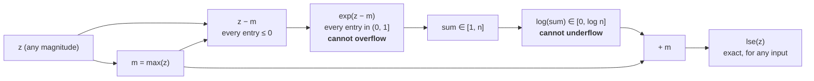

# 2.2 — log-sum-exp: the function the trick is named after

## One-line answer

`logsumexp(z) = log(Σ exp(zᵢ))` is a soft maximum that turns "multiply these likelihoods" into "add
these log-likelihoods", and it can be computed for *any* input without overflowing because
`lse(z + c) = lse(z) + c` lets you shift the whole vector down by its maximum first.

---

## The story

Two people are asked the same question about a line of hills: *how high is it?*

The first gives the height of the tallest hill. It is a clean answer, it is easy to defend, and it
throws away every other hill on the horizon. A line with one 3000-metre hill and a line with forty
2999-metre hills come out with exactly the same answer.

The second says: *a bit more than three thousand.* Pressed to explain, they say they are not reporting
the tallest hill at all. They are reporting the height of one single hill that would be worth the same
as the whole line put together — and a line with lots of nearly-tall hills is worth more than a line
with only one. Their answer is always at least the tallest hill, and never more than the tallest hill
plus a small allowance that depends on how many others there are.

Their method has one odd property that the first person's does not. If the entire line is lifted by a
hundred metres — every hill, by the same amount — their answer goes up by exactly a hundred metres.
Not roughly. Exactly.

Which means they can subtract the tallest hill's height first, do all their sums on numbers close to
zero where a tape measure is at its most accurate, and add it back on at the end. That property is why
they can measure lines of hills that the first person's instruments cannot even read.
---

## The idea in plain language

Part [2.1](2.1-the-softmax-that-returns-nan.md) established that `exp` overflows above a fixed
threshold. This part introduces the function that makes that threshold irrelevant.

**log-sum-exp**, written `lse`, is exactly what its name says:

> `lse(z) = log(exp(z₁) + exp(z₂) + … + exp(z_n))`

Two ways to understand it, and you need both.

**As a soft maximum.** If one `zᵢ` is much bigger than the rest, its `exp` dominates the sum and
`lse(z) ≈ max(z)`. If several are comparable, the sum is larger and so is the answer. It is bounded,
tightly, on both sides:

> `max(z) ≤ lse(z) ≤ max(z) + log(n)`

The lower bound is reached when one entry dominates completely; the upper bound is reached when all `n`
entries are equal. So `lse` is the maximum, plus *at most* `log n` — a smooth, differentiable stand-in
for `max`, which is exactly why it appears wherever a gradient has to flow through something
max-shaped.

**As the bridge between products and sums.** Probabilities multiply. Day 6 part
[2.3](../../../day-006-entropy-cross-entropy-perplexity/parts/02-cross-entropy/2.3-why-this-is-the-loss.md)
measured what that costs: the likelihood of a four-token sequence is already `4e-07`, and by seven
hundred tokens it is exactly `0.0` in `float64`. Logs turn those products into sums, which do not
underflow — but the moment you need to *add* two probabilities rather than multiply them, you are stuck
in log space with no way to add. `lse` is the way: **it is addition, performed on numbers that are
stored as logarithms.**

And then the identity that makes it computable:

> **`lse(z + c) = lse(z) + c`** for any constant `c`

The proof is one line — `exp(zᵢ + c) = exp(zᵢ)·exp(c)`, so `exp(c)` factors out of the sum, and `log`
turns that factor into `+ c`. But the *consequence* is the whole of numerical stability: choose
`c = −max(z)`, and every shifted entry is `≤ 0`, so every `exp` is in `(0, 1]` and **overflow is
impossible for any input whatsoever**. Add the max back at the end, exactly.

This is the same shift Day 5 used inside the softmax. The difference is that here it is stated as a
property of a named function, which is what lets it be reused — in the loss, in beam search, in a
mixture model, in DPO — rather than rediscovered each time.

---

## Why Akshara needs it

- **Part [2.3](2.3-log-softmax-is-a-subtraction.md)** is `log_softmax(z) = z − lse(z)`. One
  subtraction, and it is the form Akshara's loss uses from Day 25 to the end.
- **Day 6 part [2.3](../../../day-006-entropy-cross-entropy-perplexity/parts/02-cross-entropy/2.3-why-this-is-the-loss.md)**
  showed the loss must take logits. `lse` is the function that lets it.
- **Day 70**'s beam search keeps running log-probabilities for several candidate sequences and must
  combine them. Combining log-probabilities is `lse`, not addition.
- **Day 96**'s DPO objective is a log-sigmoid of a difference of log-probability ratios, and
  `log(1 + exp(x))` — the softplus — is `lse([0, x])`. The stable implementation of softplus is this
  part's shift, applied to a two-element vector.
- **Day 138**'s diffusion training objective involves a variational bound whose terms are combined in
  log space for exactly the underflow reason above.

---

## The mechanism

The implementation is four lines, and every one of them is doing something:

```python
import numpy as np

def logsumexp(z, axis=-1, keepdims=False):
    """log(sum(exp(z))) computed so that no exp can overflow."""
    m = np.max(z, axis=axis, keepdims=True)                    # (..., 1)  the shift
    s = np.log(np.sum(np.exp(z - m), axis=axis, keepdims=True))  # (..., 1)  all exponents <= 0
    out = m + s                                                # (..., 1)  put the shift back
    return out if keepdims else np.squeeze(out, axis=axis)
```

**Line by line:**
- `np.max(z, axis=axis, keepdims=True)` finds the shift. `keepdims=True` is **not optional**: it keeps
  the reduced axis at length 1 so `z - m` broadcasts correctly against the full shape. Without it, a
  `(B, T, V)` input reduces to `(B, T)` and the subtraction either fails or — if two axes happen to
  match — silently subtracts along the wrong one.
- `np.exp(z - m)` is the safe exponential. The largest entry of `z - m` is exactly `0`, so the largest
  `exp` is exactly `1`. **This line cannot overflow for any finite input**, which is the entire design.
- The `np.log` of the sum is safe too: the sum is at least `1` (the maximum's own term) and at most
  `n`, so the log is between `0` and `log n`. **Both operations have been moved into the range where
  floating point is at its best.**
- `m + s` restores the shift, using the identity. This is exact — it is one addition of two `float64`
  values, not an approximation.
- `np.squeeze(out, axis=axis)` removes the length-1 axis when the caller did not ask to keep it.
  Passing `axis=axis` explicitly rather than bare `np.squeeze(out)` matters: the bare form removes
  **every** length-1 axis, so a batch of one would lose its batch dimension too — a shape bug that only
  appears when `B == 1`, which is exactly when you are debugging something else.

Now the comparison that justifies the four lines:

```python
for z in (np.array([1.0, 2.0, 3.0]),
          np.array([1000.0, 1001.0, 1002.0]),
          np.array([-1000.0, -1001.0, -1002.0])):
    with np.errstate(over="ignore", divide="ignore"):
        naive = np.log(np.sum(np.exp(z)))
    print(f"  z={z}  naive {naive!r:>22}   lse {logsumexp(z)!r}")
```

**Line by line:**
- The three vectors are the *same shape of problem* — three values one apart — placed at three
  different points on the number line. The correct answer differs by exactly the offset each time.
- `divide="ignore"` is needed alongside `over` because the third row produces `log(0.0)`, which is a
  *divide* warning in numpy, not an overflow one.
- Measured on Intel Core i3-1115G4 (2 cores / 4 threads), 11.7 GB RAM, Windows 11, CPython 3.12.12,
  numpy 2.5.2, on 2026-08-26:

```text
  z=[1. 2. 3.]           naive np.float64(3.40760596)   lse array(3.40760596)
  z=[1000. 1001. 1002.]  naive        np.float64(inf)   lse array(1002.40760596)
  z=[-1000. -1001. -1002.]  naive    np.float64(-inf)   lse array(-999.59239404)
```

**Both failure directions in one table.** The naive form overflows to `inf` at large logits and
underflows to `-inf` at small ones. The stable form gets both right, and — look at the decimals —
returns `1002.40760596` and `-999.59239404`, which are the first row's `3.40760596` shifted by exactly
`+999` and `−1003`. The function did the same arithmetic in all three cases.

The identity, checked rather than asserted:

```python
z = np.array([1.0, 2.0, 3.0])
for c in (0.0, 100.0, -100.0, 1e6):
    print(f"  c={c:>10}: lse(z+c) = {logsumexp(z + c):.10f}   "
          f"lse(z)+c = {logsumexp(z) + c:.10f}   equal: {logsumexp(z + c) == logsumexp(z) + c}")
```

**Line by line:**
- The two columns are computed by genuinely different routes: the left shifts the input, the right
  shifts the output.
- `==` is exact float comparison, which part [1.1](../01-floating-point/1.1-sign-exponent-mantissa.md)
  called a bug almost everywhere. Here it is the strongest possible claim, and it is worth making
  because the identity is *algebraically* exact — so if it held only approximately, that would tell
  you something had gone wrong in the implementation rather than in the mathematics.
- Measured on this machine, 2026-08-26: `True` for all four values of `c`, including `c = 1e6`. The
  shift identity is not a good approximation; it is an identity, and it survives being carried into
  floating point because both sides reduce to the same sequence of operations.

The bounds, which are what make `lse` a *soft* maximum rather than a mysterious formula:

```python
rng = np.random.default_rng(1337)
z = rng.normal(size=8) * 3                                     # (8,)
print(f"  max(z)      = {z.max():.6f}")
print(f"  lse(z)      = {logsumexp(z):.6f}")
print(f"  max + ln(8) = {z.max() + np.log(8):.6f}")
print(f"  uniform z=0: lse = {logsumexp(np.zeros(8)):.10f}   ln(8) = {np.log(8):.10f}")
```

**Line by line:**
- `np.random.default_rng(1337)` seeds the generator explicitly, per Day 5 part
  [2.3](../../../day-005-logits-softmax-sampling/parts/02-sampling/2.3-seeds-and-generators.md) and
  Principle 9. **An unseeded demonstration is not a measurement**, because nobody else can get the
  number you printed.
- The last line is the upper bound at its tightest: when every entry is equal, `lse` is exactly
  `max + log n`, because the sum is exactly `n`.
- Measured on this machine, seed **1337**, 2026-08-26: `max(z) = 7.560356`, `lse(z) = 7.691234`,
  `max + ln(8) = 9.639798`; and the uniform case gives `2.0794415417` against `ln(8) = 2.0794415417`
  — **identical to ten decimal places**, because it is the same number.
- Read the first three: `lse` sits `0.13` above the maximum. Seven of the eight values contributed
  almost nothing, because the largest was well clear. **That gap is a measure of how much competition
  the maximum had**, and it is exactly the quantity part [2.3](2.3-log-softmax-is-a-subtraction.md)
  turns into a loss.



---

## Shapes

| Tensor | Symbolic shape | Concrete here | What each axis means |
| --- | --- | --- | --- |
| `z` | `(V,)` | `(8,)` | one score per candidate; the demonstrations above |
| `z` in the loss | `(B, T, V)` | `(4, 10, 50)` | batch · position · vocabulary — `lse` reduces the last axis |
| `m = max(z, keepdims=True)` | `(B, T, 1)` | `(4, 10, 1)` | one shift per row; the `1` is what makes `z - m` broadcast |
| `lse(z)` with `keepdims=False` | `(B, T)` | `(4, 10)` | one number per position — the normaliser |
| `lse(z)` with `keepdims=True` | `(B, T, 1)` | `(4, 10, 1)` | the form part 2.3 needs, so `z - lse(z)` broadcasts |

The last two rows are the same number in two shapes, and choosing wrongly is the most common bug when
writing this function. **`keepdims=True` is what you want whenever the result is going back into an
expression with `z` in it.**

---

## When it breaks

The loud one, and it is a shape error rather than a numerical one:

```console
>>> import numpy as np
>>> z = np.zeros((4, 10, 50))
>>> m = np.max(z, axis=-1)                    # keepdims forgotten
>>> z - m
Traceback (most recent call last):
  File "<stdin>", line 1, in <module>
ValueError: operands could not be broadcast together with shapes (4,10,50) (4,10)
```

Verbatim on this machine, 2026-08-26. This is the good outcome — it stops immediately and the shapes in
the message point straight at the missing `keepdims`.

**The silent version is the same mistake on a square shape, where it broadcasts against the wrong
axis instead of failing:**

```console
>>> rng = np.random.default_rng(1337)
>>> z = rng.normal(size=(50, 50))             # T == V, by coincidence
>>> m = np.max(z, axis=-1)                    # (50,)
>>> (z - m[:, None]).shape                    # what you meant
(50, 50)
>>> (z - m).shape                             # what you wrote — no error
(50, 50)
>>> np.allclose(z - m[:, None], z - m)
False
>>> np.abs((z - m[:, None]) - (z - m)).max()
np.float64(2.2616469602874405)
```

Verbatim on this machine, seed **1337**, 2026-08-26. **Both expressions produce the same shape and
different numbers** — the correct one subtracts each row's maximum from that row, the wrong one
subtracts the whole vector of maxima from *every* row. When the sequence length equals the vocabulary
size — which happens in exactly the small square test cases people write by hand — nothing complains.
Day 2 part
[2.3](../../../day-002-tensors-shape-stride/parts/02-broadcasting-and-indexing/2.3-the-n1-versus-n-bug.md)
is this class of bug in full; here it is enough to note that **a square test shape is the one that
hides it**, so make `T != V` in tests deliberately.

The other silent one, from a vector that is entirely `-inf` — a fully masked attention row:

```console
>>> z = np.array([-np.inf, -np.inf, -np.inf])
>>> m = z.max()
>>> z - m
RuntimeWarning: invalid value encountered in subtract
array([nan, nan, nan])
>>> np.exp(z - m)
array([nan, nan, nan])
```

Verbatim on this machine, 2026-08-26. `-inf − (-inf)` is `nan`, so a row where every entry is masked
poisons itself. This is not hypothetical: it is what a causal mask does to a padded position, and
Day 31 meets it when the mask and the padding interact.

The check, which handles both:

```python
def logsumexp_checked(z, axis=-1, keepdims=False):
    """logsumexp with the all-masked row named rather than silently returned as nan."""
    m = np.max(z, axis=axis, keepdims=True)                     # (..., 1)
    if np.any(np.isneginf(m)):
        raise ValueError(
            f"{int(np.sum(np.isneginf(m)))} row(s) are entirely -inf — "
            "an all-masked row has no distribution; fix the mask, do not clamp the result"
        )
    s = np.log(np.sum(np.exp(z - m), axis=axis, keepdims=True))  # (..., 1)
    out = m + s
    return out if keepdims else np.squeeze(out, axis=axis)
```

**Line by line:**
- `np.isneginf(m)` catches the all-masked row **before** the subtraction that would produce `nan`,
  which is what puts the error message at the cause rather than three operations downstream.
- The message says *fix the mask* rather than offering a fallback deliberately. A row with no
  unmasked entries has no correct answer — returning `-inf`, or zeros, or a uniform distribution are
  all lies of different sizes, and the honest move is to refuse. That is Principle 10.
- The check costs one reduction over an already-computed array. It is cheap enough to leave on.

---

## In production

**What a research engineer writes instead of the teaching version.** They call
`scipy.special.logsumexp` or `torch.logsumexp`, both of which implement exactly the four lines above
with the shift built in. The reason to have written it once is that `lse` shows up in places where no
library function is waiting — a custom loss, a mixture over experts, a beam scorer, an importance
weight — and the recognisable shape is *"I need to add things that are stored as logs"*. Someone who
has written the shift knows to reach for it; someone who has only imported `torch.logsumexp` writes
`torch.log(torch.sum(torch.exp(x)))` in the one place the library did not cover.

Two production details the teaching version leaves out. First, `logsumexp` is often fused with what
comes next — `log_softmax`, cross-entropy — because computing `exp(z − m)` twice is wasteful and the
fused kernel keeps the intermediate in registers. Second, **its backward pass is the softmax**:
`∂lse(z)/∂zᵢ = softmax(z)ᵢ`. That is an unusually pretty fact, and it is why a framework can implement
`log_softmax` forward and backward without ever materialising a probability tensor. Day 30 uses it.

**What degrades at scale.** The reduction length. `lse` over a 50,000-entry vocabulary is a sum of
50,000 terms, which is squarely inside part [1.4](../01-floating-point/1.4-accumulation-error.md)'s
accumulation-error territory — so the *sum* inside `lse` wants a `float32` accumulator even when the
logits are 16-bit. And in attention it is worse: `lse` over `T` keys, for `B × H × T` rows, is the
inner loop of the whole model, which is why flash attention computes a *running* `lse` that updates its
shift as new blocks arrive rather than making two passes over the data.

**The failure that only shows with real data.** Masked rows. Synthetic tests rarely include a fully
padded sequence; real batches, bucketed by length, produce them constantly — and the `-inf − (-inf)`
`nan` above is the result. It shows up as an occasional `nan` loss that depends on how the batch was
shuffled, which is the worst possible debugging experience because it is not reproducible without the
seed.

**The review comment.** *"`log(sum(exp(x)))` — use `logsumexp`. And pass `keepdims=True` here, because
the result is subtracted from `x` two lines down."*

**The interview question.** *"What is log-sum-exp for?"* The weak answer is "numerical stability". The
strong answer gives both jobs: it is the smooth maximum, bounded between `max(z)` and `max(z) + log n`,
and it is how you *add* quantities that are stored as logarithms — which you need because
probabilities underflow when multiplied. Then the mechanism: `lse(z + c) = lse(z) + c`, so subtracting
the maximum makes every exponent non-positive and overflow impossible, and you add the maximum back
exactly. The follow-up that shows real use: *and its gradient is the softmax, which is why frameworks
fuse it with cross-entropy.*

**Compute tier: T0.** All numpy on a laptop CPU; the identity check and both bounds are exact
arithmetic that reproduces on any conforming machine. What T0 does not show is the fused-kernel and
running-`lse` engineering that matters at scale — those are throughput arguments, not correctness ones,
and they need hardware this curriculum does not assume. **The mathematics here is complete; the
performance story starts at Day 30.**

---

## Check yourself

Run this. It prints **one `inf`, one `-inf`, and two finite numbers that are the same answer shifted**:

```python
import numpy as np

def logsumexp(z, axis=-1, keepdims=False):
    m = np.max(z, axis=axis, keepdims=True)
    out = m + np.log(np.sum(np.exp(z - m), axis=axis, keepdims=True))
    return out if keepdims else np.squeeze(out, axis=axis)

for z in (np.array([1.0, 2.0, 3.0]), np.array([1000.0, 1001.0, 1002.0])):
    with np.errstate(over="ignore"):
        print(f"  naive {np.log(np.sum(np.exp(z))):>10}   lse {logsumexp(z)}")

z = np.array([1.0, 2.0, 3.0])
print("  lse(z + 1e6) == lse(z) + 1e6 :", logsumexp(z + 1e6) == logsumexp(z) + 1e6)
print("  lse(zeros(8)) :", logsumexp(np.zeros(8)), " ln(8) :", np.log(8))
```

**Line by line:**
- The first pair prints `3.40760596444438` and `3.4076059644443806`; the second prints `inf` and
  `1002.4076059644444`. **The two `lse` values differ by exactly `999`**, which is the shift between
  the two inputs.
- The identity line prints `True` — at a shift of a million, with exact float equality.
- The last line prints `2.0794415416798357` twice. That is the upper bound reached exactly.
- Now predict `lse([0, 0, 0, 0])` before running it, then check. If your prediction was `log(4)`, you
  have the bound; if it was `0`, you have `max` and not `lse`.

**Say this out loud, without scrolling up:** state the two bounds on `lse(z)`, state the shift identity,
and say why that identity is what makes the function safe rather than merely convenient.
