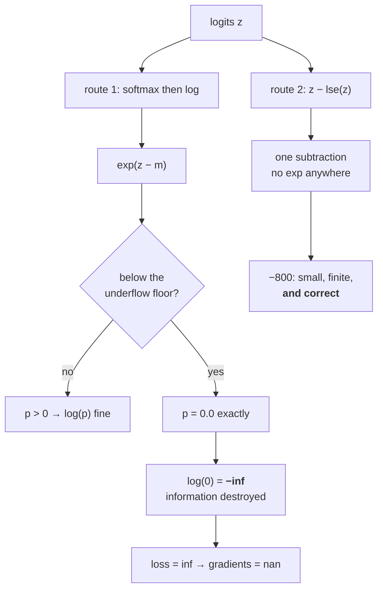

# 2.3 — `log_softmax` is a subtraction

## One-line answer

`log_softmax(z) = z − lse(z)` — the logarithm and the exponential cancel algebraically, leaving one
subtraction that can never produce `−inf`, which is why every loss function in every framework takes
logits and computes the log-probability itself rather than accepting probabilities from you.

---

## The story

Somebody hands you a letter written in your own language and asks you to translate it into a second
language. An hour later they call back and say the client actually wanted it in the original language
after all.

You could do exactly what you were asked. Translate every sentence out, then translate every sentence
back. What comes back would be perfectly readable, and it would not be the letter you started with.
The turns of phrase would have flattened out. A couple of names would have picked up odd spellings.
And one sentence that had a joke in it would have turned into nonsense on the way out and stayed
nonsense on the way back.

Or you could just hand back the original.

The two routes are supposed to end up in the same place. One of them loses a sentence.
---

## The idea in plain language

Day 6 part
[2.2](../../../day-006-entropy-cross-entropy-perplexity/parts/02-cross-entropy/2.2-nll-is-cross-entropy-with-a-one-hot.md)
established that the loss needs the **log** of the predicted probability, not the probability itself.
And the softmax produces probabilities. So the obvious route is: softmax, then log.

Write it out:

> `log(softmax(z)ᵢ) = log( exp(zᵢ) / Σⱼ exp(zⱼ) ) = zᵢ − log Σⱼ exp(zⱼ) = zᵢ − lse(z)`

The `log` and the `exp` cancel. **There is no exponential in the answer at all.** The whole operation
is: take the logits, subtract one number per row, done.

That is not a clever rearrangement for speed. It is a different numerical object:

- **The two-step route** computes `exp(zᵢ − m)`, divides, then takes a log. If a probability underflows
  to exactly `0` — and part [2.1](2.1-the-softmax-that-returns-nan.md) showed `exp` reaching exact zero
  below `−103` in `float32` — then `log(0)` is `−inf`. The information about *how* unlikely that token
  was is destroyed by the underflow and cannot be recovered by the log.
- **The fused route** never exponentiates the thing it returns. `zᵢ − lse(z)` is a subtraction of two
  ordinary-sized numbers, and it returns `−800` where the two-step route returns `−inf`. The number
  `−800` is a perfectly good log-probability. It means "about `10⁻³⁴⁷`", which is small but is not
  nothing.

The difference matters because **`−inf` is contagious and `−800` is not**. A `−inf` log-probability
makes the loss `inf`; multiplied by a zero weight it becomes `nan`; and one `nan` in a batch makes the
whole gradient `nan`. Day 6 part
[1.3](../../../day-006-entropy-cross-entropy-perplexity/parts/01-entropy/1.3-the-zero-probability-event.md)
made the same distinction from the other side: there are structural zeros and numerical zeros, and
turning the second kind into the first is a bug.

One more property, and it is the cheapest check in this whole day: **every entry of `log_softmax(z)` is
`≤ 0`**, because every probability is `≤ 1`. If you ever see a positive value in a log-probability
tensor, something upstream is wrong, and that is a one-line assertion.

---

## Why Akshara needs it

- **Day 25** writes Akshara's first training loop, and its loss is
  `-log_softmax(logits)[target]`, averaged. That line is this part.
- **Day 6 part [2.3](../../../day-006-entropy-cross-entropy-perplexity/parts/02-cross-entropy/2.3-why-this-is-the-loss.md)**
  measured `log(softmax(z))` giving `-inf` where the fused form gives `-800`. This part is why, and
  the mechanism behind that measurement.
- **Day 70**'s sampling path needs log-probabilities for beam scoring; **Day 71**'s top-p needs
  probabilities. Knowing that one is a subtraction and the other is an exponential tells you which to
  compute and when.
- **Day 96**'s DPO loss is built entirely from differences of log-probabilities, and a single `-inf`
  anywhere in that expression makes the batch unusable.
- **Day 114**'s evaluation computes per-token log-probabilities over a whole corpus, where the rare
  tokens — precisely the ones with tiny probabilities — are the ones that discriminate between models.

---

## The mechanism

Both routes, side by side, on three inputs:

```python
import numpy as np

def logsumexp(z, axis=-1, keepdims=False):
    m = np.max(z, axis=axis, keepdims=True)                      # (..., 1)
    out = m + np.log(np.sum(np.exp(z - m), axis=axis, keepdims=True))   # (..., 1)
    return out if keepdims else np.squeeze(out, axis=axis)

def softmax_stable(z):
    e = np.exp(z - z.max())                                      # (V,)
    return e / e.sum()                                           # (V,)

def log_softmax(z):
    return z - logsumexp(z, keepdims=True)                       # (V,)  one subtraction

for z in (np.array([1.0, 2.0, 3.0]),
          np.array([0.0, -100.0, -200.0]),
          np.array([0.0, -400.0, -800.0])):
    with np.errstate(divide="ignore"):
        two_step = np.log(softmax_stable(z))
    print(f"  z={z}")
    print(f"     log(softmax(z)) = {two_step}")
    print(f"     z - lse(z)      = {log_softmax(z)}")
```

**Line by line:**
- `softmax_stable` is already the *good* softmax — it subtracts the maximum, so it cannot overflow.
  **The failure below is not the overflow failure from part 2.1.** It is a second, independent one,
  and using the stable softmax here is what isolates it.
- `logsumexp(z, keepdims=True)` returns shape `(..., 1)` so that `z - lse(z)` broadcasts back to `z`'s
  full shape. This is the case part 2.2's shapes table flagged: the result is going straight back into
  an expression containing `z`, so `keepdims=True` is the form you want.
- `np.errstate(divide="ignore")` is needed for the two-step route only, because `log(0.0)` raises a
  *divide* warning. The fused route needs no `errstate` at all — **which is itself the result.**
- The three inputs are chosen to straddle the boundary: the first is ordinary, the second spans 200
  (survivable in `float64`), the third spans 800 (not).
- Measured on Intel Core i3-1115G4 (2 cores / 4 threads), 11.7 GB RAM, Windows 11, CPython 3.12.12,
  numpy 2.5.2, on 2026-08-26:

```text
  z=[1. 2. 3.]
     log(softmax(z)) = [-2.40760596 -1.40760596 -0.40760596]
     z - lse(z)      = [-2.40760596 -1.40760596 -0.40760596]
  z=[   0. -100. -200.]
     log(softmax(z)) = [   0. -100. -200.]
     z - lse(z)      = [   0. -100. -200.]
  z=[   0. -400. -800.]
     log(softmax(z)) = [   0. -400.  -inf]
     z - lse(z)      = [   0. -400. -800.]
```

The first two rows agree to every printed digit — **the two routes really are the same function.** The
third row is where they part: the two-step route returns `-inf` for a token whose true log-probability
is `-800`.

And notice *where* it broke. The second entry, `-400`, survived. `exp(-400)` in `float64` is around
`10⁻¹⁷⁴`, which is above the underflow floor. `exp(-800)` is around `10⁻³⁴⁸`, which is below it, so it
became exactly `0.0` and the log of that is `-inf`. **The boundary is not at the token you would
suspect; it is at whatever the dtype's underflow floor happens to be**, which part 2.1 measured as
`ln(smallest subnormal)`: about `−744` in `float64`, `−103` in `float32`, and `−17` in `float16`.

**Read that `float16` number.** In `fp16`, the two-step route destroys the log-probability of any token
below about `e⁻¹⁷ ≈ 4 × 10⁻⁸`. In a 50,000-token vocabulary, that is most of the vocabulary.



The loss built on it, which is the form Day 25 uses:

```python
def nll_from_logits(z, targets):
    """Negative log-likelihood straight from logits. No probability tensor is ever created."""
    lp = z - logsumexp(z, axis=-1, keepdims=True)                # (B, T, V)
    picked = np.take_along_axis(lp, targets[..., None], axis=-1) # (B, T, 1)
    return -picked.squeeze(-1)                                   # (B, T)
```

**Line by line:**
- `z - logsumexp(...)` is the whole of `log_softmax`, inline. There is no intermediate probability
  tensor at any point — which matters for memory as well as accuracy, because a `(B, T, V)` probability
  tensor at `V = 50257` is the largest thing in the forward pass.
- `np.take_along_axis(lp, targets[..., None], axis=-1)` gathers one entry per position: the
  log-probability the model assigned to the token that actually occurred. The `[..., None]` promotes
  `targets` from `(B, T)` to `(B, T, 1)` so its rank matches `lp`, which `take_along_axis` requires.
  Day 6 part
  [2.2](../../../day-006-entropy-cross-entropy-perplexity/parts/02-cross-entropy/2.2-nll-is-cross-entropy-with-a-one-hot.md)
  derives why a one-hot dot product collapses to this single gather.
- `.squeeze(-1)` drops the gathered axis, giving one loss per position. The reduction to a scalar is
  deliberately **not** here — Day 6 part
  [2.4](../../../day-006-entropy-cross-entropy-perplexity/parts/02-cross-entropy/2.4-the-mean-over-what.md)
  showed that choosing the reduction is where Silent Failure #3 lives, so this function returns the
  `(B, T)` tensor and lets the caller mask before averaging.
- The negation is at the end, once. Negating `picked` rather than negating inside `lp` keeps
  `log_softmax`'s sign convention intact, so `lp` can be reused for anything else — entropy, KL, a
  sampling path — without a sign error.

The free assertion:

```python
lp = log_softmax(np.array([1.0, 2.0, 3.0]))
print("  max log-prob (must be <= 0):", lp.max())
print("  exp(lp).sum() (must be 1)  :", np.exp(lp).sum())
```

**Line by line:**
- `lp.max() <= 0` is true by construction for any correct `log_softmax`, because probabilities do not
  exceed 1. It costs one reduction and it catches a whole class of errors — a sign flip, a missing
  subtraction, logits mistaken for log-probabilities by a caller.
- `np.exp(lp).sum() == 1` is the round-trip. It is the *weaker* check of the two: it can pass on a
  distribution that has silently lost its tail, which is exactly the failure part
  [2.4](2.4-the-softmax-that-returned-all-zeros.md) is about.
- Measured on this machine, 2026-08-26: `-0.4076059644443806` and `0.9999999999999997`. The second is
  not exactly `1.0`, and Day 5 part
  [1.5](../../../day-005-logits-softmax-sampling/parts/01-logits-and-probabilities/1.5-the-probabilities-that-summed-to-almost-one.md)
  is why — which is also why the check is written with a tolerance in real code rather than `== 1.0`.

---

## Shapes

| Tensor | Symbolic shape | Concrete here | What each axis means |
| --- | --- | --- | --- |
| `z` (logits) | `(B, T, V)` | `(4, 10, 50)` | batch · position · vocabulary |
| `lse(z, keepdims=True)` | `(B, T, 1)` | `(4, 10, 1)` | one normaliser per position; the `1` is what makes the subtraction broadcast |
| `lp = z − lse(z)` | `(B, T, V)` | `(4, 10, 50)` | log-probabilities — **same shape as the logits**, all `≤ 0` |
| `targets` | `(B, T)` | `(4, 10)` | integer token ids, **not** one-hot |
| `targets[..., None]` | `(B, T, 1)` | `(4, 10, 1)` | rank matched to `lp` for `take_along_axis` |
| `nll` | `(B, T)` | `(4, 10)` | one loss per position, before any reduction |

The row that never appears is the point: **there is no `(B, T, V)` probability tensor.** At
`V = 50257` and `(B, T) = (8, 1024)` that tensor would be 1.6 GB in `float32`, and the fused form
never creates it.

---

## When it breaks

The loud one, from feeding probabilities to a function that expects logits:

```console
>>> import numpy as np
>>> p = np.array([0.7, 0.2, 0.1])           # already a distribution
>>> lp = p - logsumexp(p, keepdims=True)
>>> lp
array([-0.76794955, -1.26794955, -1.36794955])
>>> np.exp(lp).sum()
np.float64(1.0)
>>> np.exp(lp)                              # the distribution you actually got
array([0.46396343, 0.28140804, 0.25462853])
```

Verbatim on this machine, 2026-08-26. **Nothing raised.** The output is a valid log-probability vector,
it sums to one, every check passes — and it is the wrong distribution: `[0.464, 0.281, 0.255]` where the
caller believed `[0.7, 0.2, 0.1]`. Softmax of small logits is nearly uniform, so a `0.7` that was
already a probability comes back as `0.46`. Day 5 part
[1.2](../../../day-005-logits-softmax-sampling/parts/01-logits-and-probabilities/1.2-logits-are-not-probabilities.md)
is this confusion in full, and the reason it is worth repeating here is that **the fused form gives you
no signal at all** — the naive route would at least have produced something obviously strange.

**The silent version, which is the subject of this part:**

```console
>>> z = np.array([0.0, -400.0, -800.0])
>>> p = np.exp(z - z.max()); p = p / p.sum()
>>> p
array([1.0000000e+000, 1.9151696e-174, 0.0000000e+000])
>>> np.log(p)
RuntimeWarning: divide by zero encountered in log
array([  0., -400.,  -inf])
>>> np.log(p).sum()
np.float64(-inf)
```

Verbatim on this machine, 2026-08-26. Look at which entry survived. The middle token's probability,
`1.9e-174`, is **representable** in `float64` and its log comes back as a clean `-400`. The third
token's true probability is about `10⁻³⁴⁸`, which is below the smallest subnormal, so it stored as
exactly `0.0` — and `log(0)` is `-inf`. **The distribution and its log disagree about how many tokens
are impossible**, and only the log says so. That `-inf` then propagates: in a batch, one `-inf` makes
the summed loss `-inf`, and one optimizer step later every weight is `nan`.

The check:

```python
def assert_log_probs(lp, axis=-1, atol=1e-5, name="log_probs"):
    """Three properties every log-probability tensor has. Cheap enough to leave on."""
    if not np.all(np.isfinite(lp)):
        raise ValueError(f"{name}: {int(np.sum(~np.isfinite(lp)))} non-finite entries — "
                         "did you compute log(softmax(z)) instead of z - lse(z)?")
    if lp.max() > atol:
        raise ValueError(f"{name}: max is {lp.max()!r} > 0 — these are not log-probabilities")
    total = np.exp(lp).sum(axis=axis)                            # (...,)
    if not np.allclose(total, 1.0, atol=atol):
        raise ValueError(f"{name}: rows sum to {total.min()!r}..{total.max()!r}, not 1")
```

**Line by line:**
- The `isfinite` check is first because it is the one that distinguishes the two routes, and the error
  message names the likely cause rather than just reporting the symptom.
- `lp.max() > atol` rather than `> 0` allows for the last-bit rounding Day 5 part 1.5 measured. Using
  strict `> 0` would make this check fire spuriously, which is how a good assertion gets deleted.
- `np.allclose(total, 1.0)` is the round-trip, and it is deliberately **last** because it is the
  weakest: part [2.4](2.4-the-softmax-that-returned-all-zeros.md) shows a badly broken distribution
  that passes it.
- This runs in `O(size)` with one temporary. On a `(B, T, V)` tensor that temporary is the thing the
  fused form was avoiding, so **turn it on in tests and in the first steps of a run, not in the hot
  loop.**

---

## In production

**What a research engineer writes instead of the teaching version.** They call
`torch.nn.functional.cross_entropy(logits, targets)` and never see any of this. That function takes
**logits** — not probabilities, not log-probabilities — and does the fused `z − lse(z)` and the gather
internally, in one kernel, with a hand-written backward pass. The reason to know what is inside it is
that the API is a trap in exactly one direction: a model that ends with a softmax layer and then calls
`cross_entropy` applies the softmax twice. That produces a valid-looking loss that trains slowly and
badly, and it is one of the most common bugs in first implementations. **The symptom is a loss that
descends and then plateaus far above `ln(V)`'s neighbourhood**, and the fix is deleting a line.

The fused kernel also exists for a memory reason, not only a numerical one. The `(B, T, V)`
log-probability tensor is the largest intermediate in the forward pass, and a fused cross-entropy can
avoid materialising it at all — which is why recent implementations chunk the vocabulary dimension and
why "the loss is the memory bottleneck at large vocabularies" is a real statement rather than a
surprising one.

**What degrades at scale.** The vocabulary. `lse` over `V = 50257` is a 50,000-term reduction per
position (part [1.4](../01-floating-point/1.4-accumulation-error.md)'s territory, so it wants a
`float32` accumulator), and the log-probability tensor grows linearly with `V`. Both pressures point
the same way: at large `V`, the loss computation stops being a rounding detail and becomes a design
constraint.

**The failure that only shows with real data.** Rare tokens. A toy vocabulary of 50 has no token whose
log-probability reaches `−800`; a real vocabulary has thousands, because a trained model assigns
genuinely tiny probabilities to most of the vocabulary at most positions. **The two-step route passes
every unit test and destroys information on the corpus** — and the information it destroys is
concentrated in exactly the rare tokens that evaluation is most sensitive to.

**The review comment.** *"`torch.log(torch.softmax(x, -1))` — use `log_softmax`. This returns `-inf`
for any token below the underflow floor, and in `fp16` that floor is `e⁻¹⁷`."*

**The interview question.** *"Why does `cross_entropy` take logits instead of probabilities?"* The weak
answer is "convenience". The strong answer is the algebra and its consequence: `log(softmax(z))`
simplifies to `z − lse(z)`, so the exponential cancels entirely and the computation becomes a
subtraction that cannot underflow — where the two-step route returns `−inf` for any token whose
probability fell below the dtype's smallest subnormal. I have measured that boundary: in `float64` the
two-step route gives `−inf` where the fused form gives `−800`. The follow-up that shows you have
shipped it: *and it means a model must not end with a softmax layer if the loss is `cross_entropy`,
because that applies it twice.*

**Compute tier: T0.** numpy on a laptop CPU; every number is `float64` or `float32` arithmetic that
reproduces on any conforming machine. What T0 cannot show is the fused-kernel memory saving, which only
becomes visible at vocabulary sizes and batch shapes that do not fit on this machine — **the
correctness argument is complete here and the memory argument is Day 66's**.

---

## Check yourself

Run this. It prints **one `-inf` and one `-800.0`, from the same logits**:

```python
import numpy as np

def logsumexp(z, axis=-1, keepdims=False):
    m = np.max(z, axis=axis, keepdims=True)
    out = m + np.log(np.sum(np.exp(z - m), axis=axis, keepdims=True))
    return out if keepdims else np.squeeze(out, axis=axis)

z = np.array([0.0, -400.0, -800.0])
p = np.exp(z - z.max())
p = p / p.sum()
with np.errstate(divide="ignore"):
    print("  probabilities   :", p)
    print("  log(softmax(z)) :", np.log(p))
print("  z - lse(z)      :", z - logsumexp(z, keepdims=True))
print("  max log-prob    :", (z - logsumexp(z, keepdims=True)).max())
```

**Line by line:**
- The probability line prints `[1.0000000e+000 1.9151696e-174 0.0000000e+000]`. **Say out loud which
  of those three entries is a lie**, then look at the next two lines.
- `log(softmax(z))` prints `[   0. -400.  -inf]`; `z - lse(z)` prints `[   0. -400. -800.]`. Same
  input, same function, one route lost a number.
- The max prints `0.0`, which is the free assertion: every log-probability is at most zero.
- Now change `-800.0` to `-100.0` and re-run. Both routes will agree. **Then work out, from part 2.1's
  underflow table, the exact value at which they would start to disagree in `float32` rather than
  `float64`** — and say what that value is in `float16`.

**Say this out loud, without scrolling up:** write `log_softmax` as an expression with no exponential
in it, and say what the two-step route returns for a token whose probability underflowed — and why that
value is worse than a very negative number.
