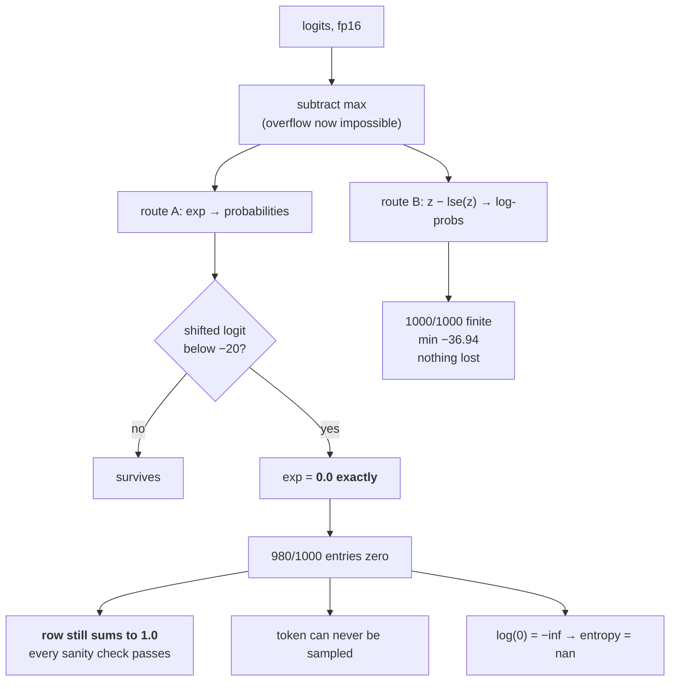

# 2.4 — 💥 The softmax that summed to one and was still wrong

## One-line answer

A `float16` softmax over a thousand-token vocabulary can flush 980 of its probabilities to exactly zero
and still sum to `1.0000000000` — so the check everybody runs passes, no warning fires, and the model
has silently become incapable of ever producing those tokens.

---

## The story

A shop prints a report of what sold last month. There are two hundred items on the shelves; the report
lists four of them, with percentages that add up to a hundred.

Nobody questions it. The percentages add up. That is the check.

What the report does not say is that the other hundred and ninety-six items did not sell nothing. They
sold — hundreds of units between them — and the software rounds every figure to the nearest whole per
cent before printing. Everything under half a per cent became 0, and 0 got printed as plain `0`,
rather than as "less than we can show here".

A year later somebody uses that report to decide what to reorder, and applies the obvious rule: an
item that sold zero does not get reordered. A hundred and ninety-six items come off the shelves.

The arithmetic was never wrong. Every number in that report was correct to the precision it was worked
out at. The mistake was reading `0` as "none", when what it meant was "less than we can write down".
---

## The idea in plain language

Part [2.1](2.1-the-softmax-that-returns-nan.md) was the loud failure: `exp` overflows, the row becomes
`nan`, and eventually somebody notices. This part is the quiet one, and it is the day's centre of
gravity.

The stable softmax cannot overflow — part 2.2 proved that. But it can still **underflow**. After
subtracting the maximum, every shifted logit is `≤ 0`, so every `exp` is in `(0, 1]`, and any shifted
logit below the dtype's underflow threshold gives exactly `0.0`. Part 2.1 measured those thresholds:
about `−744` in `float64`, `−103` in `float32`, and — the one that matters —

> **`float16` reaches exactly zero by `exp(−20)`.**

A shifted logit of `−20` is nothing. It means "this token is `e²⁰ ≈ 5 × 10⁸` times less likely than the
best one", which for a language model over fifty thousand tokens describes the overwhelming majority of
the vocabulary at every position.

So the `fp16` softmax returns a distribution in which most entries are exactly zero. And here is the
part that makes it a *silent* failure rather than an obvious one: **the row still sums to one.** It has
to. The entries that survived are divided by the sum of the entries that survived, and the tiny ones
that vanished contributed essentially nothing to that sum anyway. **The standard sanity check — "do the
probabilities sum to 1?" — cannot detect this failure**, because the failure is invisible to it by
construction.

What it costs, concretely:

- **A token with probability exactly `0` can never be sampled.** Not at temperature 2, not with top-p
  at `0.99`, not ever. The model's tail has been amputated rather than dampened, and the diversity of
  its output is silently reduced.
- **`log(0)` is `−inf`.** Anything computed downstream from these probabilities — an entropy, a KL, a
  perplexity — becomes `nan` one operation later, and the traceback points at the entropy function
  rather than at the softmax.
- **The damage is invisible in aggregate metrics.** Loss, accuracy and perplexity are dominated by the
  tokens that survived. A run can be materially worse and report almost identical numbers.

The fix is one line, and it is the reason part [1.5](../01-floating-point/1.5-mixed-precision.md)
listed "softmax in `fp32`" as a standing rule: **cast the logits to `float32` before the softmax, not
after.** After is too late; the zeros are already there.

---

## Why Akshara needs it

- **Part [1.5](../01-floating-point/1.5-mixed-precision.md)** gave the rule. This part is the
  measurement that makes the rule non-negotiable rather than a habit.
- **Day 30**'s attention softmax runs over `T` keys, in whatever dtype the model is in. A `bf16`
  attention row that has lost its tail attends to fewer positions than the model computed — and `bf16`
  is *worse* than `fp16` here, because its seven-bit mantissa makes the surviving values coarser still.
- **Day 71**'s top-p sampling sorts probabilities and takes a prefix. A tail of exact zeros changes
  which tokens are in that prefix, so **a decoding parameter tuned in `fp32` behaves differently in
  `fp16`** with no change to the model.
- **Day 6 part [1.3](../../../day-006-entropy-cross-entropy-perplexity/parts/01-entropy/1.3-the-zero-probability-event.md)**
  distinguished a structural zero from a numerical one. This part manufactures numerical zeros in bulk
  and shows what the confusion costs.
- **Days 78–85** quantize below 16 bits, where this effect is far stronger, and where "the metrics
  barely moved" is the claim that has to be disproved rather than trusted.

---

## The mechanism

A thousand-token vocabulary, one dominant token, three dtypes:

```python
import numpy as np

def stable_softmax(z, dtype):
    z = z.astype(dtype)
    e = np.exp(z - z.max(axis=-1, keepdims=True))          # (V,)  all exponents <= 0
    return e / e.sum(axis=-1, keepdims=True)               # (V,)

rng = np.random.default_rng(1337)
V = 1000
z = rng.normal(size=V) * 4.0                               # (V,)  spread-out logits
z[0] = z.max() + 12.0                                      # one clearly dominant token

for dt, name in ((np.float16, "fp16"), (np.float32, "fp32"), (np.float64, "fp64")):
    p = stable_softmax(z, dt)                              # (V,)
    print(f"  {name}: exact zeros {int((p == 0).sum()):>4}/{V}   "
          f"sum {float(p.sum()):.10f}   min nonzero {float(p[p > 0].min()):.3e}")
```

**Line by line:**
- `stable_softmax` is the **correct** implementation — it subtracts the row maximum, so part 2.1's
  overflow is impossible. Every failure below happens to code that is already doing the recommended
  thing.
- `rng.normal(size=V) * 4.0` gives logits with a standard deviation of 4, which is an ordinary spread
  for a trained model. Nothing here is adversarial.
- `z[0] = z.max() + 12.0` makes one token clearly the best, which is what a confident next-token
  prediction looks like. **That single line is what pushes the rest of the vocabulary below the
  underflow threshold**, because the shift is relative to the maximum.
- `(p == 0).sum()` counts *exact* zeros. Exact float equality against zero, used deliberately: the
  question is "how many entries are the literal value 0.0", and that is what `==` answers.
- Measured on Intel Core i3-1115G4 (2 cores / 4 threads), 11.7 GB RAM, Windows 11, CPython 3.12.12,
  numpy 2.5.2, seed **1337**, on 2026-08-26:

```text
  fp16: exact zeros  980/1000   sum 1.0000000000   min nonzero 5.960e-08
  fp32: exact zeros    0/1000   sum 1.0000000000   min nonzero 9.259e-17
  fp64: exact zeros    0/1000   sum 1.0000000000   min nonzero 9.259e-17
```

**Read the three columns across.** In `fp16`, 980 of 1000 tokens have probability exactly zero — and
the row sums to `1.0000000000`, to ten decimal places, exactly as it does in `fp64`. The sanity check
passes perfectly. Meanwhile `fp32` and `fp64` agree with each other to every printed digit and have no
zeros at all: the smallest surviving probability in both is `9.259e-17`, a number `fp16` cannot go
anywhere near.

What was actually lost:

```python
p64 = stable_softmax(z, np.float64)                        # (V,)  the reference
p16 = stable_softmax(z, np.float16)                        # (V,)
print(f"  tokens zeroed in fp16       : {int((p16 == 0).sum())}")
print(f"  their TRUE total mass (fp64): {p64[p16 == 0].sum():.6e}")
```

**Line by line:**
- `p64[p16 == 0]` uses the `fp16` zero mask to index the `fp64` reference — so it selects exactly the
  probabilities that `fp16` destroyed and reads their real values.
- Measured on this machine, seed 1337, 2026-08-26: `980` tokens zeroed, carrying a true total mass of
  **`5.150288e-07`**.
- That number cuts both ways and both halves matter. **The mass is genuinely negligible** — five parts
  in ten million — so no loss, perplexity or accuracy figure will move detectably. **And 980 tokens can
  now never be produced**, at any temperature, by any sampler. A negligible probability and an
  impossible event are not the same thing, and this is the operation that converts one into the other.

Log space keeps them:

```python
def logsumexp(z, axis=-1, keepdims=False):
    m = np.max(z, axis=axis, keepdims=True)
    out = m + np.log(np.sum(np.exp(z - m), axis=axis, keepdims=True))
    return out if keepdims else np.squeeze(out, axis=axis)

lp16 = z.astype(np.float16) - logsumexp(z.astype(np.float32)).astype(np.float16)   # (V,)
print(f"  log_softmax fp16: -inf count {int(np.isinf(lp16).sum())}   min {float(lp16.min()):.4f}")
print(f"  log_softmax fp64: min {float(z.min() - logsumexp(z)):.4f}")
```

**Line by line:**
- The `logsumexp` is computed in `float32` and the result cast down, which is the mixed-precision
  arrangement part 1.5 described: **the reduction runs wide, the elementwise subtraction runs narrow.**
- Measured on this machine, seed 1337, 2026-08-26: **zero `-inf` entries**, minimum `-36.9375` in
  `fp16` against `-36.9183` in `fp64`.
- **Not one token was lost.** The same information that produced 980 exact zeros as probabilities
  produces 1000 finite log-probabilities, agreeing with the `float64` reference to three decimal
  places — in the same 16-bit dtype. Part [2.3](2.3-log-softmax-is-a-subtraction.md)'s subtraction is
  what makes the difference.



The `nan` that arrives one operation later:

```python
p = stable_softmax(z, np.float16).astype(np.float32)       # (V,)
with np.errstate(divide="ignore", invalid="ignore"):
    naive_entropy = -(p * np.log(p)).sum()
    masked_entropy = -np.sum(np.where(p > 0, p * np.log(np.where(p > 0, p, 1.0)), 0.0))
print("  entropy, naive :", repr(naive_entropy))
print("  entropy, masked:", repr(masked_entropy))
```

**Line by line:**
- `.astype(np.float32)` widens the *already broken* distribution. **Widening after the damage does not
  undo it** — the zeros are still zeros, they are just 32-bit zeros now. That is the whole reason the
  cast has to happen before the softmax.
- The naive entropy is `-(p * log(p)).sum()`, which hits `0 × log(0)` = `0 × -inf` = `nan`. Day 6 part
  [1.3](../../../day-006-entropy-cross-entropy-perplexity/parts/01-entropy/1.3-the-zero-probability-event.md)
  is that trap and its two wrong fixes.
- The masked version is Day 6's `np.where` guard. The inner `np.where(p > 0, p, 1.0)` is what keeps
  `log` from ever seeing a zero at all — replacing the value *inside* the log rather than clamping the
  result, because a clamp biases every term.
- Measured on this machine, seed 1337, 2026-08-26: `np.float32(nan)` and `np.float32(0.00017908149)`.
- **The masked answer is not a rescue.** `0.000179` nats is the entropy of a distribution that has had
  980 of its tokens deleted. The correct entropy of the real distribution is larger. Masking stopped
  the `nan`; it did not recover the information, because the information was destroyed in the softmax.

And the case that started this — attention in `fp16`, unscaled:

```python
rng = np.random.default_rng(1337)
T, hs = 8, 64
q = rng.normal(size=(T, hs)).astype(np.float16)            # (T, hs)
k = rng.normal(size=(T, hs)).astype(np.float16)            # (T, hs)
with np.errstate(over="ignore", invalid="ignore"):
    att = (q @ k.T).astype(np.float16)                     # (T, T)  NO 1/sqrt(hs) scaling
    print("  max attention logit:", repr(att.max()))
    e = np.exp(att)                                        # the naive route
    naive = e / e.sum(axis=-1, keepdims=True)              # (T, T)
    print("  naive row sums     :", naive.sum(axis=-1))
```

**Line by line:**
- `q @ k.T` with `hs = 64` is the raw attention score: a dot product of 64 terms, each of order 1, so
  the result is of order `√64 = 8` and routinely larger. **The `1/√hs` scaling is deliberately omitted
  here** to show what it is protecting against; Day 30 puts it back.
- Measured on this machine, seed 1337, 2026-08-26: the maximum logit is `25.81` — **more than twice
  `fp16`'s overflow threshold of `11.09`** — and the naive row sums come back as
  `[nan, nan, 0.9995, 1., 1., nan, 1., nan]`.
- **Four rows are `nan` and four are fine.** That is what makes this hard to debug: the array is not
  obviously broken, the failure depends on the data, and a batch that happens to contain no large
  scores passes.

---

## Shapes

| Tensor | Symbolic shape | Concrete here | What each axis means |
| --- | --- | --- | --- |
| `z` (logits) | `(V,)` | `(1000,)` | one score per vocabulary entry |
| `p` (probabilities) | `(V,)` | `(1000,)` | 980 of them exactly `0.0` in `fp16` |
| `lp` (log-probabilities) | `(V,)` | `(1000,)` | 1000 finite values in the same dtype |
| `q`, `k` | `(T, hs)` | `(8, 64)` | position · head size — the vectors attention scores |
| `att = q @ kᵀ` | `(T, T)` | `(8, 8)` | query · key — softmax over the last axis |
| a real attention tensor | `(B, H, T, T)` | `(4, 12, 1024, 1024)` | batch · head · query · key — 50 million rows per forward pass |

The last row is the exposure: at fifty million softmax rows per step, an effect that hits one row in a
thousand hits fifty thousand rows every step.

---

## When it breaks

The loud version — the entropy, one operation downstream:

```console
>>> import numpy as np
>>> p = np.array([1.0, 0.0, 0.0], dtype=np.float32)
>>> -(p * np.log(p)).sum()
RuntimeWarning: divide by zero encountered in log
RuntimeWarning: invalid value encountered in multiply
np.float32(nan)
```

Verbatim on this machine, 2026-08-26. **Two warnings for one expression**, and neither of them mentions
the softmax that produced the zeros. Under this repository's `filterwarnings = ["error::RuntimeWarning"]`
this raises, which is the correct behaviour and still points at the wrong line: the bug is in the
softmax, thirty operations upstream.

**The silent version is this document's subject, and it produces no output at all:**

```console
>>> rng = np.random.default_rng(1337)
>>> z = rng.normal(size=1000) * 4.0
>>> z[0] = z.max() + 12.0
>>> zh = z.astype(np.float16)
>>> e = np.exp(zh - zh.max()); p = e / e.sum()
>>> float(p.sum())
1.0
>>> int((p == 0).sum())
980
>>> np.isfinite(p).all()
np.True_
```

Verbatim on this machine, seed 1337, 2026-08-26. **`p.sum()` is `1.0`. Everything is finite. 980 of a
thousand probabilities are gone.** There is no warning to suppress, no exception to catch, and no
traceback to read. The only way to know is to count the zeros, and nobody counts the zeros.

The check that catches it, and it is the one to add:

```python
def assert_tail_survived(p, axis=-1, max_zero_fraction=0.5, name="probs"):
    """A distribution should not be mostly exact zeros. Summing to 1 does not prove it is intact."""
    zeros = np.sum(p == 0, axis=axis)                          # (...)
    n = p.shape[axis]
    frac = zeros / n
    if np.any(frac > max_zero_fraction):
        worst = float(frac.max())
        raise ValueError(
            f"{name}: {worst:.1%} of one row is exactly 0 in {p.dtype} — "
            f"the tail underflowed; compute the softmax in float32"
        )
```

**Line by line:**
- `p == 0` is exact comparison against zero and is correct here for the same reason as above: the
  question is about the literal value `0.0`.
- **Notice what this check does *not* do.** It does not check the sum. The sum is `1.0` in the failing
  case, which is precisely why the usual check is useless and this one is needed.
- `max_zero_fraction=0.5` is a threshold for this check, not a law. A genuinely peaked distribution
  over a large vocabulary can legitimately have some exact zeros in `float32` too; the signal is the
  *fraction*, and the right value depends on `V`. **Log the fraction every N steps rather than only
  raising** — the trend across a run is far more informative than any single threshold.
- The error message names the fix, because the fix is not obvious from the symptom: someone reading
  "50% of one row is exactly 0" does not immediately think "cast to `float32` before the softmax".
- Better still, do not produce probabilities at all where you can avoid it. Part
  [2.3](2.3-log-softmax-is-a-subtraction.md) showed the same information survives intact as
  log-probabilities in the same dtype — **the best check is an operation you did not perform.**

---

## In production

**What a research engineer writes instead of the teaching version.** They rely on `autocast`, which
keeps softmax in `float32` automatically, and they know why: this failure. The moment that reliance
becomes dangerous is when someone writes a custom attention kernel, a custom sampling path, or an
export to an inference runtime with different casting rules — and then the guarantee quietly stops
applying while the code looks unchanged. **The rule to carry is: every softmax's input is cast to
`float32` explicitly, even under `autocast`, because the explicit cast is free and the assumption is
not.**

The second habit is to stay in log space as long as possible. Probabilities are needed at exactly one
place in a decoder — the sampler — and everything before it (the loss, the KL, the beam scores, the
DPO ratios) works better on log-probabilities. **Each conversion to probability space is a chance to
lose the tail; do it once, as late as possible.**

**What degrades at scale.** The vocabulary size and the model's confidence, and they compound. A larger
`V` means more tokens far below the maximum. A better-trained model means a *larger* gap between the
top logit and the rest — so **this failure gets worse as the model gets better**, which is exactly
backwards from intuition and the reason it appears late in a run rather than at the start.

**The failure that only shows with real data.** Confident predictions. A randomly initialised model
produces nearly uniform logits and no underflow whatsoever; the demonstration above needed a deliberate
`+12` on one entry to reproduce what training produces on its own. **A test on an untrained model
cannot see this**, which is why it has to be checked on a real checkpoint at a real step.

**The review comment.** *"This softmax runs in the model dtype. Cast the logits to `fp32` first — and
log the fraction of exact zeros in the output for the first few steps, because summing to 1 does not
mean the row is intact."*

**The interview question.** *"Your `fp16` model produces less diverse text than the `fp32` one, but the
loss and perplexity are nearly identical. What is happening?"* The weak answer is "`fp16` is less
precise". The strong answer is the mechanism: after the max subtraction the shifted logits are all
`≤ 0`, and `exp` in `float16` reaches exactly zero by `−20`, so most of the vocabulary gets probability
exactly `0` — which the sampler can never select, while the aggregate metrics are dominated by the
tokens that survived and barely move. I have measured 980 of 1000 tokens zeroed with the row still
summing to `1.0000000000`. The follow-up that shows you have shipped it: *and summing to 1 is not a
check for this — you have to count the exact zeros, or better, stay in log space until the sampler.*

**Compute tier: T0.** All of it reproduces on any conforming machine, seed 1337, because it is IEEE-754
arithmetic and a seeded generator. What T0 cannot show is the consequence people actually care about —
the difference in generated text between a `fp16` and a `fp32` decoder — because that needs a trained
model, which arrives at Day 66. **This part proves the mechanism and Day 71 is where the sampling
consequence gets measured.**

---

## Check yourself

Run this. It prints **a distribution that sums to exactly 1.0 with most of its entries missing**:

```python
import numpy as np

rng = np.random.default_rng(1337)
z = rng.normal(size=1000) * 4.0
z[0] = z.max() + 12.0

for dt, name in ((np.float16, "fp16"), (np.float32, "fp32")):
    zz = z.astype(dt)
    e = np.exp(zz - zz.max())
    p = e / e.sum()
    print(f"  {name}: sum {float(p.sum()):.10f}   exact zeros {int((p == 0).sum())}/1000   "
          f"min nonzero {float(p[p > 0].min()):.3e}")
```

**Line by line:**
- The `fp16` row prints `sum 1.0000000000` and `exact zeros 980/1000`. **Both facts are true at the
  same time**, and that is the entire lesson.
- The `fp32` row prints the same sum and `exact zeros 0/1000`.
- Now compute `p64[p16 == 0].sum()` for yourself and say whether the lost mass is large. Then answer
  the harder question out loud: **if the lost mass is negligible, why does it matter?**

**Say this out loud, without scrolling up:** say why "the probabilities sum to 1" does not prove a
softmax is correct, name the check that does, and say where in the pipeline the `float32` cast has to
happen for it to help.
