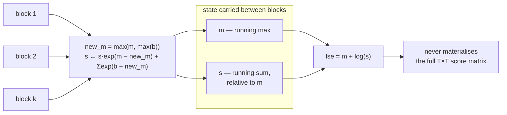

# 2.5 — log-sum-exp everywhere else: softplus, beams and streaming

## One-line answer

Once you can recognise `log(Σ exp(·))` you find it in the softplus, the log-sigmoid, beam search
scoring, mixture models and the DPO objective — and the same shift makes all of them stable, including
in a *streaming* form that never sees the whole vector at once, which is how flash attention works.

---

## The story

Somebody learns to cook one dish properly. It takes a week: how hot the oil should be, the exact point
where the onions are done, when to stop stirring and leave it alone.

Then they are asked to make a second dish, and they complain that nobody has taught them that one. The
person teaching them points out that the second dish is the same two steps they already know, in a
different order, with one ingredient swapped.

Then a third dish. Then a fourth. Then a fifth.

By the end of the year they have stopped asking to be taught dishes. They have stopped seeing dishes
at all. They see a small number of steps, and an arrangement.
---

## The idea in plain language

Parts 2.2 through 2.4 built `lse` and used it for one thing: the softmax and its loss. This part is
about **recognising the shape**, because the same four lines are the answer to a surprising number of
apparently unrelated problems.

The recognition rule is short: **whenever you need to add quantities that are stored as logarithms, you
need `lse`.** Not `+`, which multiplies them. Not `exp` then `+` then `log`, which overflows. `lse`.

Five places it shows up, and you will meet all five in this curriculum:

**1. Softplus.** `softplus(x) = log(1 + exp(x))` — the smooth version of `max(0, x)`. Written as a
`lse` it is `lse([0, x])`, because `log(exp(0) + exp(x))` is exactly that. The naive form overflows for
large `x`; the `lse` form does not.

**2. Log-sigmoid.** `log σ(x) = −softplus(−x)`. Every binary-classification loss and every preference
objective is built from this, and the naive `log(1/(1+exp(−x)))` underflows to `−inf` for very negative
`x` — precisely the confidently-wrong examples that carry the most gradient.

**3. Beam search.** A beam holds several candidate sequences, each with a running log-probability. To
ask "how much probability mass is on this beam in total" you must add probabilities that are stored as
logs. That is `lse` over the beam.

**4. Mixture models.** The log-density of a mixture is `lse(log wᵢ + log pᵢ(x))` — the log-weights and
the log-component-densities added inside, then combined by `lse`. Day 138's diffusion bound and every
Gaussian mixture you will ever fit have this shape.

**5. Streaming.** `lse` can be computed **online**, over blocks, without ever holding the whole vector.
Keep a running maximum and a running sum; when a new block arrives with a bigger maximum, rescale the
old sum by `exp(old_max − new_max)` and carry on. This is not a curiosity — it is the core of flash
attention, and it is why attention can run over sequences whose full `T × T` score matrix would never
fit in memory.

The fifth is worth pausing on, because it changes what `lse` *is*. It is not "a function you apply to a
vector". It is **a reduction with an associative update rule**, which means it can be parallelised,
chunked, and streamed exactly like a sum.

---

## Why Akshara needs it

- **Day 30 and Day 32** implement attention; **Day 80**'s efficiency work meets the streaming form,
  where the running-maximum update below is the algorithm.
- **Day 70**'s beam search must combine and normalise candidate scores. Doing it in probability space
  underflows after a few dozen tokens, for the reason Day 6 part
  [2.3](../../../day-006-entropy-cross-entropy-perplexity/parts/02-cross-entropy/2.3-why-this-is-the-loss.md)
  measured.
- **Day 96**'s DPO loss is `−log σ(β·(Δ_policy − Δ_reference))`, which is a log-sigmoid of a difference
  of log-probability differences. Every term in that expression is an `lse` or a subtraction of them.
- **Day 138**'s diffusion training objective combines per-timestep terms in log space.
- **Day 45**'s mixture-of-experts routing computes a log-normalised gate, which is a softmax — and the
  auxiliary load-balancing losses are built on the same log-space quantities.

---

## The mechanism

Softplus, three ways:

```python
import numpy as np

def logsumexp(z, axis=-1, keepdims=False):
    m = np.max(z, axis=axis, keepdims=True)                     # (..., 1)
    out = m + np.log(np.sum(np.exp(z - m), axis=axis, keepdims=True))
    return out if keepdims else np.squeeze(out, axis=axis)

for x in (0.0, 10.0, 50.0, 800.0, -800.0):
    with np.errstate(over="ignore"):
        naive = np.log(1.0 + np.exp(np.float64(x)))
    via_lse = logsumexp(np.array([0.0, x]))
    idiom = max(0.0, x) + np.log1p(np.exp(-abs(x)))
    print(f"  x={x:>8}: naive {naive!r:>22}  lse([0,x]) {float(via_lse)!r:>10}  idiom {idiom!r}")
```

**Line by line:**
- `logsumexp(np.array([0.0, x]))` is the recognition in code: `log(1 + exp(x))` **is** `lse` of a
  two-element vector whose first entry is `0`, because `exp(0) = 1`.
- The third form, `max(0, x) + log1p(exp(-|x|))`, is the specialised idiom every framework's `softplus`
  actually uses. It is the same shift written out by hand for the two-element case, and it uses
  `np.log1p` — which computes `log(1 + y)` accurately for tiny `y`, where `log(1 + y)` would lose every
  significant digit to the `1`. That is catastrophic cancellation from part
  [1.3](../01-floating-point/1.3-the-gap-between-representable-numbers.md), avoided by a dedicated
  function.
- Measured on Intel Core i3-1115G4 (2 cores / 4 threads), 11.7 GB RAM, Windows 11, CPython 3.12.12,
  numpy 2.5.2, on 2026-08-26:

```text
  x=     0.0: naive     0.6931471805599453  lse([0,x]) 0.6931471805599453  idiom 0.6931471805599453
  x=    10.0: naive     10.000045398899218  lse([0,x]) 10.000045398899218  idiom 10.000045398899218
  x=    50.0: naive                   50.0  lse([0,x])               50.0  idiom 50.0
  x=   800.0: naive                    inf  lse([0,x])              800.0  idiom 800.0
  x=  -800.0: naive                    0.0  lse([0,x])                0.0  idiom 0.0
```

All three agree everywhere except `x = 800`, where the naive form returns `inf` and the other two
return `800.0`. And `800.0` is *right*: for large `x`, `log(1 + exp(x)) ≈ x`, because the `1` is
negligible beside `exp(x)`. **The correct answer was the input, and the naive route could not find
it.**

Log-sigmoid, which is where this reaches a real loss function:

```python
for x in (0.0, -50.0, -100.0, -800.0):
    with np.errstate(over="ignore", divide="ignore"):
        naive = np.log(1.0 / (1.0 + np.exp(np.float64(-x))))
    stable = -logsumexp(np.array([0.0, -x]))
    print(f"  x={x:>8}: naive {naive!r:>22}  stable {stable!r}")
```

**Line by line:**
- `log σ(x) = −softplus(−x)` is the identity being used, and it is worth deriving once rather than
  memorising: `σ(x) = 1/(1 + e⁻ˣ)`, so `log σ(x) = −log(1 + e⁻ˣ) = −softplus(−x)`.
- The negative `x` values are the interesting ones: they are the examples the model got *confidently
  wrong*, which is where a preference or classification loss has the most to say.
- Measured on this machine, 2026-08-26: agreement at `0.0`, `−50.0` and `−100.0`; at `x = −800` the
  naive route gives `-inf` and the stable one gives `-800.0`.
- **`-inf` in a loss is a dead batch.** Its gradient is `nan`, and one `nan` gradient makes every
  parameter `nan` at the next step. The confidently-wrong example — the most informative one in the
  batch — is the one that kills the run.

Beam search, where the shift matters because scores drift downward without bound:

```python
lp = np.array([-12.5, -13.1, -20.0, -45.0])                     # (beams,)  running log-probs
with np.errstate(under="ignore", divide="ignore"):
    print("  total (naive)   :", np.log(np.sum(np.exp(lp))))
    print("  total (lse)     :", logsumexp(lp))
    lp_long = lp - 800.0                                        # (beams,)  after a long sequence
    print("  after 800 more nats — naive:", np.log(np.sum(np.exp(lp_long))),
          " lse:", logsumexp(lp_long))
```

**Line by line:**
- A beam's log-probability is a **running sum** over the tokens generated so far, so it decreases
  monotonically. `lp - 800.0` is not a contrived input; it is the same beam a few hundred tokens later.
- Measured on this machine, 2026-08-26: both routes give `-12.062155010848539` on the fresh beam. After
  the shift, the naive route gives `-inf` and `lse` gives `-812.0621550108485`.
- **The two `lse` answers differ by exactly `800`**, which is the shift — the function did identical
  arithmetic in both cases. The naive route worked at the start of a sequence and stopped working part
  way through, which is the worst kind of bug: it passes every short test.

The streaming form, which is the one worth actually understanding:

```python
def online_lse(blocks):
    """logsumexp over blocks, never holding the whole vector. The flash-attention update."""
    m = -np.inf                                                 # running maximum
    s = 0.0                                                     # running sum, scaled relative to m
    for b in blocks:                                            # each b is (block_size,)
        new_m = max(m, b.max())
        s = s * np.exp(m - new_m) + np.sum(np.exp(b - new_m))   # rescale the old sum, add the new
        m = new_m
    return m + np.log(s)
```

**Line by line:**
- `s` is not the sum of `exp(b)` — it is the sum of `exp(b - m)`, i.e. **the sum expressed relative to
  the current maximum**. That is the invariant, and everything else follows from maintaining it.
- `s * np.exp(m - new_m)` is the rescale. When a block arrives containing a larger value, the old
  running sum was expressed relative to the old, smaller maximum, so it must be scaled down by
  `exp(old − new)` to be expressed relative to the new one. **`m - new_m` is always `≤ 0`, so this
  `exp` can never overflow** — it can only underflow to zero, which correctly says "the old blocks are
  negligible beside this one".
- `np.sum(np.exp(b - new_m))` adds the new block, already relative to the new maximum. Same argument:
  every exponent is `≤ 0`.
- `m` starts at `-inf` so the first block's maximum wins unconditionally. The first iteration computes
  `s * exp(-inf - new_m)`, which is `0 * 0 = 0` — correct, and it avoids a special case for the first
  block. (If a block were entirely `-inf`, `new_m` would be `-inf` too and this would produce `nan`;
  part [2.2](2.2-log-sum-exp.md)'s all-masked-row check is what guards that.)
- The whole thing is **associative**: the state `(m, s)` from two halves can be merged with the same
  rescale rule, which is why this parallelises across threads and blocks.
- Measured on this machine, seed **1337**, on a `(4096,)` vector split into eight `(512,)` blocks,
  2026-08-26: one-pass `lse` gives `36.23903243`, the online form gives `36.239032427749464`, and the
  absolute difference is **`0.0`** — bit-identical, not merely close.



---

## Shapes

| Tensor | Symbolic shape | Concrete here | What each axis means |
| --- | --- | --- | --- |
| `[0, x]` for softplus | `(2,)` | `(2,)` | the two terms `exp(0)=1` and `exp(x)` |
| beam log-probs | `(beams,)` | `(4,)` | one running log-probability per candidate sequence |
| a full attention row | `(T,)` | `(4096,)` | one score per key position |
| one streamed block | `(block,)` | `(512,)` | the slice that fits in fast memory |
| streaming state `(m, s)` | `()`, `()` | two scalars | **constant** in `T` — the whole point |
| a full score matrix | `(B, H, T, T)` | `(4, 12, 4096, 4096)` | what the streaming form never allocates |

The last two rows together are the argument for flash attention: the state is `O(1)` per row where the
materialised matrix is `O(T²)`, and at `T = 4096` that `(4, 12, 4096, 4096)` tensor is **3.2 GB in
`float32`** — for one layer, for one forward pass.

---

## When it breaks

The loud one, from the streaming form's first-block edge case:

```console
>>> import numpy as np
>>> m, s = -np.inf, 0.0
>>> b = np.array([-np.inf, -np.inf])          # a fully masked block
>>> new_m = max(m, b.max())
>>> s * np.exp(m - new_m) + np.sum(np.exp(b - new_m))
RuntimeWarning: invalid value encountered in subtract
np.float64(nan)
```

Verbatim on this machine, 2026-08-26. `-inf − (-inf)` is `nan`, so a fully masked block poisons the
running state — and once `s` is `nan` every later block is `nan` too, because `nan` propagates through
addition. **The failure is not in the block that caused it**, which is what makes streaming reductions
awkward to debug: the state carries the damage forward.

**The silent version, and it is the one that bites in beam search:**

```console
>>> lp = np.array([-12.5, -13.1, -20.0, -45.0]) - 800.0
>>> np.log(np.sum(np.exp(lp)))
RuntimeWarning: divide by zero encountered in log
np.float64(-inf)
>>> np.exp(lp)
array([0., 0., 0., 0.])
>>> np.exp(lp).argmax()
np.int64(0)
```

Verbatim on this machine, 2026-08-26. Look at the last two lines. Every beam's probability underflowed
to exactly `0.0`, so **`argmax` returns index `0` — not because beam 0 is best, but because `argmax`
returns the first maximum when everything ties.** A beam searcher that ranks in probability space
silently degenerates into "always pick the first beam" after a few hundred tokens, and the output is
still fluent text, so nothing looks broken.

The check, for any code that ranks or normalises in log space:

```python
def assert_log_space(scores, name="scores"):
    """Refuse to rank quantities that have already collapsed. Cheap; run it before every argmax."""
    scores = np.asarray(scores)
    if np.any(np.isnan(scores)):
        raise ValueError(f"{name}: contains nan — check for an all-masked row upstream")
    finite = scores[np.isfinite(scores)]
    if finite.size == 0:
        raise ValueError(f"{name}: every entry is -inf — nothing to rank")
    if np.ptp(finite) == 0 and finite.size > 1:
        raise ValueError(f"{name}: all {finite.size} finite entries are identical — "
                         "did these underflow to 0 before the log?")
```

**Line by line:**
- The `nan` check is first because `nan` breaks comparison itself: `nan > x` is `False` and `nan < x`
  is `False`, so **a `nan` in a scoring array does not sort to either end — it sorts wherever the
  algorithm happens to put it.** That is why a `nan` score is worse than an `inf` one.
- `np.ptp(finite)` is peak-to-peak, the range. A range of exactly zero across many entries means every
  score is identical, which for real log-probabilities essentially never happens by chance — so it is a
  reliable signature of a collapse that has already occurred.
- The check works on **log-space** scores, which is where it belongs. Once you are in probability space
  the collapse has already happened and the array of zeros is indistinguishable from a legitimate one.
- It is `O(n)` on an array you are about to sort anyway, so the cost is irrelevant next to the ranking.

---

## In production

**What a research engineer writes instead of the teaching version.** They use
`torch.nn.functional.softplus`, `torch.nn.functional.logsigmoid`, `torch.logsumexp` — every one of
which implements the shift internally. What the framework does *not* provide is the recognition. When
you write a custom preference loss, a custom router, a custom scorer, the expression on the whiteboard
is `log(Σ exp(·))` and it is your job to notice. **The single most valuable habit from this part is
reading an expression and seeing an `lse` in it**, because the naive transcription will be correct on
the test case and wrong in production.

The streaming form is the one to know by name. Flash attention — **arXiv:2205.14135**,
*FlashAttention: Fast and Memory-Efficient Exact Attention with IO-Awareness*, abstract read at
`https://arxiv.org/abs/2205.14135` on **2026-08-26** — is built on exactly the running-maximum update
above. Its abstract describes "an IO-aware **exact** attention algorithm that uses tiling to reduce the
number of memory reads/writes between GPU high bandwidth memory (HBM) and GPU on-chip SRAM", and the
word *exact* is the one to notice: the rescale is an algebraic identity, so the answer is bit-for-bit
the same as the one-pass version rather than an approximation. That is what distinguishes it from the
approximate-attention literature it replaced. The paper is worth reading at Day 80; the update rule is worth understanding now, because it
is nine lines and you have just written them.

**What degrades at scale.** For the streaming form, nothing — that is the point, and it is why it
exists. For everything else, the same two pressures as the rest of this section: longer sequences mean
more accumulated log-probability (so beams drift further down and underflow sooner), and larger
vocabularies mean longer reductions inside each `lse`.

**The failure that only shows with real data.** Long generations. A beam searcher tested on
twenty-token outputs never reaches the underflow region; a production system generating a thousand
tokens reaches it constantly. **The bug is a function of output length, and output length is exactly
what nobody varies in a unit test.**

**The review comment.** *"`torch.log(torch.sigmoid(x))` — use `logsigmoid`. This returns `-inf` for
confidently-wrong examples, which are the ones carrying the gradient you care about."*

**The interview question.** *"Where else does log-sum-exp show up besides the softmax?"* The weak answer
is "in the loss". The strong answer names the pattern and two instances: it is how you *add* quantities
stored as logs, so it appears as softplus (`lse([0, x])`), log-sigmoid (`−softplus(−x)`), beam-score
combination, and mixture densities — and it has an online form with a running maximum that makes it
computable in blocks, which is what flash attention uses to avoid materialising the `T × T` score
matrix. The follow-up that shows depth: *and that online form is why flash attention is exact rather
than approximate — the rescale is algebraically an identity, not a truncation.*

**Compute tier: T0.** All numpy on a laptop CPU, and the streaming form's bit-exact agreement with the
one-pass form reproduces on any conforming machine at seed 1337. What T0 cannot show is the reason
anyone streams: **the memory saving only matters when the `T × T` matrix does not fit**, which needs
sequence lengths and hardware this curriculum does not assume. The arithmetic is complete here; the
`(4, 12, 4096, 4096)` figure above is a multiplication, not a measurement, and Day 80 is where it gets
run.

---

## Check yourself

Run this. It prints **three functions that are the same function, and one beam search that has
collapsed**:

```python
import numpy as np

def logsumexp(z, axis=-1, keepdims=False):
    m = np.max(z, axis=axis, keepdims=True)
    out = m + np.log(np.sum(np.exp(z - m), axis=axis, keepdims=True))
    return out if keepdims else np.squeeze(out, axis=axis)

x = 800.0
with np.errstate(over="ignore"):
    print("  softplus naive :", np.log(1.0 + np.exp(x)))
print("  softplus lse   :", float(logsumexp(np.array([0.0, x]))))
print("  softplus idiom :", max(0.0, x) + np.log1p(np.exp(-abs(x))))

lp = np.array([-12.5, -13.1, -20.0, -45.0]) - 800.0
with np.errstate(under="ignore", divide="ignore"):
    print("  beam probs     :", np.exp(lp))
    print("  beam total naive:", np.log(np.sum(np.exp(lp))))
print("  beam total lse  :", logsumexp(lp))
```

**Line by line:**
- The three softplus lines print `inf`, `800.0` and `800.0`. **Two of them are the same function
  written differently and one of them is unusable.**
- The beam lines print `[0. 0. 0. 0.]`, then `-inf`, then `-812.0621550108485`. Say out loud what
  `argmax` returns on that array of zeros, and what a beam searcher would then do.
- Now write `log(1 + exp(x))` for `x = -800` and predict the answer before running it. If you said
  `0.0`, say **why that is correct here and `inf` was not correct for `x = 800`** — the asymmetry is
  the whole of part 2.1's underflow-versus-overflow argument.

**Say this out loud, without scrolling up:** state the rule for when you need `lse`, name three places
other than the softmax where it appears, and describe the one-line update that lets it be computed over
blocks.
