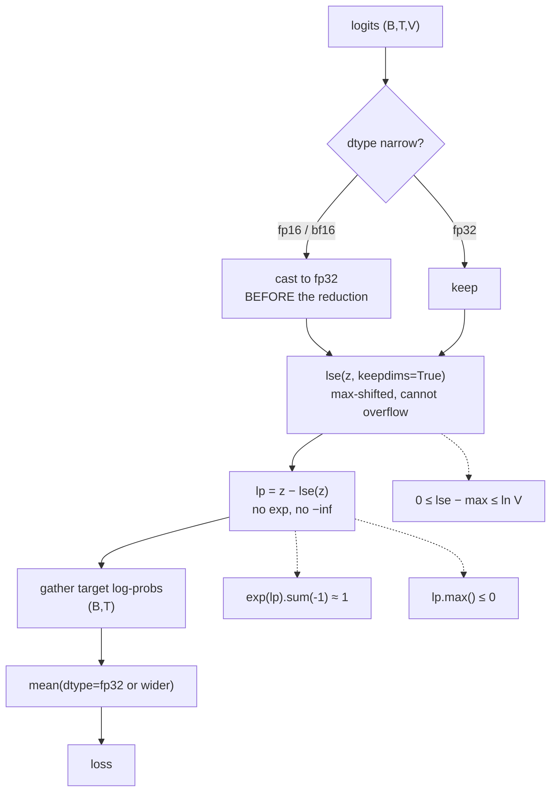

# 3.1 — One batch, three dtypes, one stable path

## One-line answer

Put a `(4, 10, 50)` batch of logits through the naive loss and the stable loss in `fp16`, `fp32` and
`fp64`, and four numbers plus three invariants tell you whether your whole numerical path is sound —
which is the check to run before any training run, not after it fails.

---

## The story

A shop has a list of things to do before pulling the shutter down at night, and the person who does it
has locked up eight hundred times.

The list is not there because they might have forgotten how to run a shop. It is there because there
are about a dozen things you cannot see once the shutter is down — a tap left running, the fridge door
not quite shut, cash left in the drawer — and every single one of them is on that list because at some
point it happened, and somebody had to open up in the morning and deal with it.

Going through the list takes two minutes. It gets read on the eight-hundred-and-first night exactly
the way it was read on the first. And the person who resents it most is the one it has never yet
caught anything for.
---

## The idea in plain language

This section is one part, and its job is to assemble the day's two ideas into something you run.

Everything so far has been isolated: a gap, a threshold, an underflow, an identity. A real forward pass
puts them in sequence — logits, a max subtraction, an `exp`, a sum, a log, a gather, a mean — and a
failure anywhere in that chain shows up as one wrong number at the end. So the check has to be a
*battery*, not a single assertion.

Four numbers and three invariants:

**The four numbers** are the loss computed the naive way and the stable way, in each dtype, against a
`float64` reference. Agreement across all of them means the path is sound at this logit scale.
Disagreement tells you where it broke, and — this is the useful part — *which* dtype it broke in first
tells you what kind of failure it was.

**The three invariants** hold for any correct implementation, at any dtype, on any input:

1. `exp(log_softmax(z)).sum(-1) == 1` — the log-probabilities exponentiate back to a distribution.
2. `log_softmax(z).max() <= 0` — no probability exceeds one.
3. `0 <= lse(z) − max(z) <= ln(V)` — part [2.2](../02-stable-softmax/2.2-log-sum-exp.md)'s bounds.

The third is the sharpest. It is a two-sided bound that catches an axis error, a missing `keepdims`, a
vocabulary size that is not what you think it is, and a shift that was applied twice — **four different
bugs, one comparison.** And unlike the sum-to-one check, part
[2.4](../02-stable-softmax/2.4-the-softmax-that-returned-all-zeros.md) cannot slip past it, because
`lse − max` is computed in log space where the tail still exists.

The one thing this battery cannot do is tell you your logits are the wrong logits. It checks the
numerics, not the model. Day 25 adds the check that does: at step zero, an untrained model's loss must
be `ln(V)`, and Day 6 part
[3.2](../../../day-006-entropy-cross-entropy-perplexity/parts/03-kl-and-perplexity/3.2-perplexity.md)
is why.

---

## Why Akshara needs it

- **Day 25** runs Akshara's first training loop. This battery is what you run before it, so that a
  `nan` at step 40 is known not to be a numerical path problem.
- **Day 51** builds the test suite, and every check here becomes a test with a tolerance derived from
  part [1.3](../01-floating-point/1.3-the-gap-between-representable-numbers.md) rather than guessed.
- **Day 66** is the pretraining run in mixed precision on a free notebook GPU. Running this battery in
  the *notebook*, in the run's actual dtype, before launching, is the difference between losing a free
  session to a `nan` and not.
- **Days 78–85** quantize, and every quantization is validated by re-running exactly this comparison
  with a narrower dtype in the loop.
- **Day 161**'s cold end-to-end audit re-runs the whole curriculum's checks, and this is the numerical
  one.

---

## The mechanism

The whole battery, in one script:

```python
import numpy as np

B, T, V = 4, 10, 50
rng = np.random.default_rng(1337)
logits64 = rng.normal(size=(B, T, V)) * 2.0                       # (B, T, V)
targets = rng.integers(0, V, size=(B, T))                         # (B, T)

def logsumexp(z, axis=-1, keepdims=False):
    m = np.max(z, axis=axis, keepdims=True)                       # (B, T, 1)
    out = m + np.log(np.sum(np.exp(z - m), axis=axis, keepdims=True))
    return out if keepdims else np.squeeze(out, axis=axis)

def loss_stable(z, tgt):
    lp = z - logsumexp(z, axis=-1, keepdims=True)                 # (B, T, V)
    nll = -np.take_along_axis(lp, tgt[..., None], axis=-1).squeeze(-1)   # (B, T)
    return nll.mean()

def loss_naive(z, tgt):
    e = np.exp(z)                                                 # (B, T, V)  <-- the bug
    p = e / e.sum(axis=-1, keepdims=True)                         # (B, T, V)
    return -np.log(np.take_along_axis(p, tgt[..., None], axis=-1).squeeze(-1)).mean()
```

**Line by line:**
- `rng = np.random.default_rng(1337)` and every random draw beneath it: **seeded**, per Principle 9.
  A battery you cannot reproduce on someone else's machine is a battery whose failures cannot be
  discussed.
- `* 2.0` gives logits with a standard deviation of 2 — an ordinary, well-behaved scale, chosen so the
  *first* comparison passes. A test suite whose first case fails teaches nothing.
- `loss_stable` is part [2.3](../02-stable-softmax/2.3-log-softmax-is-a-subtraction.md)'s fused form:
  one subtraction, one gather, one mean, and no probability tensor at any point.
- `loss_naive` exponentiates raw logits. It is the implementation this day exists to retire, and it is
  here as the *control* — you cannot show a fix works without showing the thing it fixes.
- `tgt[..., None]` promotes `(B, T)` to `(B, T, 1)` so `take_along_axis` has matching rank; `.squeeze(-1)`
  removes the gathered axis afterwards. Day 6 part
  [2.2](../../../day-006-entropy-cross-entropy-perplexity/parts/02-cross-entropy/2.2-nll-is-cross-entropy-with-a-one-hot.md)
  derives why this gather is the whole of cross-entropy for an integer target.

The well-behaved case first:

```python
for dt, name in ((np.float16, "fp16"), (np.float32, "fp32"), (np.float64, "fp64")):
    z = logits64.astype(dt)                                       # (B, T, V)
    zs = z.astype(np.float32) if dt is np.float16 else z          # reductions in fp32 for fp16 data
    with np.errstate(over="ignore", divide="ignore", invalid="ignore"):
        print(f"  {name}: naive {float(loss_naive(z, targets)):.8f}   "
              f"stable {float(loss_stable(zs, targets)):.8f}   ln(V) = {np.log(V):.8f}")
```

**Line by line:**
- `zs = z.astype(np.float32) if dt is np.float16 else z` is part
  [1.5](../01-floating-point/1.5-mixed-precision.md)'s rule made explicit: **the data may be `fp16`;
  the reduction is not.** This one line is the whole of the mixed-precision recipe as it applies to a
  loss.
- `ln(V)` is printed alongside because it is the reference every step-zero loss is compared against —
  Day 6 part
  [3.2](../../../day-006-entropy-cross-entropy-perplexity/parts/03-kl-and-perplexity/3.2-perplexity.md)
  established that an untrained model over `V` tokens starts at `ln(V)`.
- Measured on Intel Core i3-1115G4 (2 cores / 4 threads), 11.7 GB RAM, Windows 11, CPython 3.12.12,
  numpy 2.5.2, seed **1337**, on 2026-08-26:

```text
  fp16: naive 5.85546875   stable 5.85415602   ln(V) = 3.91202301
  fp32: naive 5.85420322   stable 5.85420322   ln(V) = 3.91202301
  fp64: naive 5.85420283   stable 5.85420283   ln(V) = 3.91202301
```

Two things to read here, and the second is the one people miss.

**The naive and stable columns agree.** At this logit scale the naive route is fine, which is exactly
why it survives in codebases: it is correct until it is catastrophically not. The `fp16` row differs in
the fourth digit — `5.8555` against `5.8542` — which is part
[1.4](../01-floating-point/1.4-accumulation-error.md)'s accumulation error over `V = 50` and `B×T = 40`
terms, and it is the size of error you should *expect* rather than be alarmed by.

**All three losses are far above `ln(V)` = `3.912`.** These logits are random, not from a trained
model, so the "predictions" are actively wrong rather than merely uninformed — and a loss above `ln(V)`
is what that looks like. **Day 25's step-zero check is that the loss is close to `ln(V)`**, and a value
of `5.85` there would mean the initialisation is broken.

Now the same batch at a realistic logit scale:

```python
big = logits64 * 40.0                                             # (B, T, V)  max |logit| = 279
for dt, name in ((np.float16, "fp16"), (np.float32, "fp32"), (np.float64, "fp64")):
    z = big.astype(dt)
    zs = z.astype(np.float32) if dt is np.float16 else z
    with np.errstate(over="ignore", divide="ignore", invalid="ignore"):
        print(f"  {name}: naive {float(loss_naive(z, targets)):>22}   "
              f"stable {float(loss_stable(zs, targets)):.8f}")
```

**Line by line:**
- `* 40.0` puts the maximum absolute logit at `279`, which is above `float32`'s `exp` threshold of
  `88.72` and far above `float16`'s `11.09`. This is not an adversarial input: output-head logits over
  a large vocabulary reach these magnitudes in trained models.
- Measured on this machine, seed 1337, 2026-08-26:

```text
  fp16: naive                    nan   stable 185.76542664
  fp32: naive                    nan   stable 185.76358032
  fp64: naive     185.76357943567   stable 185.76357944
  max |logit| = 279.052794310113
```

**`float32` gives `nan`.** Not `float16` — `float32`, the default dtype of nearly everything, on a
batch of fifty tokens. Meanwhile the stable route returns `185.7636` in all three dtypes, agreeing with
the `float64` reference to six significant figures even in `fp16`.

The three invariants, which are the part to keep:

```python
lp = logits64 - logsumexp(logits64, axis=-1, keepdims=True)       # (B, T, V)
print(f"  |exp(lp).sum(-1) - 1| max : {float(np.abs(np.exp(lp).sum(-1) - 1.0).max()):.3e}")
print(f"  lp.max() (must be <= 0)   : {float(lp.max()):.3e}")
gap = logsumexp(logits64) - logits64.max(-1)                      # (B, T)
print(f"  lse - max, min (>= 0)     : {float(gap.min()):.6f}")
print(f"  lse - max, max (<= ln V)  : {float(gap.max()):.6f}   ln(V) = {np.log(V):.6f}")
```

**Line by line:**
- `np.abs(... - 1.0).max()` reports the **worst** row rather than an average. An average hides a single
  broken row in a batch of forty, which is precisely the failure mode part 2.1 described.
- `lp.max() <= 0` is free — one reduction on a tensor you already have — and it catches a sign error,
  a missing subtraction, and a caller who passed probabilities instead of logits.
- `gap = lse(z) - max(z)` is the two-sided bound. Computing it as a `(B, T)` tensor and taking `min`
  and `max` checks **every row**, not the batch average.
- Measured on this machine, seed 1337, 2026-08-26:

```text
  |exp(lp).sum(-1) - 1| max : 7.772e-16
  lp.max() (must be <= 0)   : -1.503e-01
  lse - max, min (>= 0)     : 0.150263
  lse - max, max (<= ln V)  : 2.294880   ln(V) = 3.912023
```

Every invariant holds. The round-trip is off by `8e-16`, which is about three `float64` epsilons —
the right order for a `V = 50` reduction, and **not** zero, which is Day 5 part
[1.5](../../../day-005-logits-softmax-sampling/parts/01-logits-and-probabilities/1.5-the-probabilities-that-summed-to-almost-one.md)'s
point and the reason this check needs a tolerance. The `lse − max` gap runs from `0.15` to `2.29`,
comfortably inside `[0, 3.912]`.

And the reduction dtype, one more time, because it is the line people delete:

```python
z32 = logits64.astype(np.float32)                                 # (B, T, V)
lp32 = z32 - logsumexp(z32, axis=-1, keepdims=True)               # (B, T, V)
nll = -np.take_along_axis(lp32, targets[..., None], axis=-1).squeeze(-1)   # (B, T)
print(f"  nll.mean() in fp32         : {float(nll.mean()):.10f}")
print(f"  nll.mean(dtype=np.float64) : {float(nll.mean(dtype=np.float64)):.10f}")
print(f"  fp64 end to end            : {float(loss_stable(logits64, targets)):.10f}")
```

**Line by line:**
- The three lines differ only in where the accumulator lives. The data is `float32` in the first two
  and `float64` in the third.
- Measured on this machine, seed 1337, 2026-08-26: `5.8542032242`, `5.8542028069`, `5.8542028329`. The
  `float64` accumulator over `float32` data lands within `3e-08` of the full-`float64` answer; the
  `float32` accumulator is off by `4e-07`, ten times further.
- At `B × T = 40` that difference is cosmetic. **At `B × T = 32768` it is not**, and part 1.4 is why —
  which is the argument for writing `dtype=` on the reduction now, while the batch is small enough that
  it does not matter.



---

## Shapes

| Tensor | Symbolic shape | Concrete here | What each axis means |
| --- | --- | --- | --- |
| `logits64` | `(B, T, V)` | `(4, 10, 50)` | batch · position · vocabulary |
| `targets` | `(B, T)` | `(4, 10)` | integer token ids, one per position |
| `lse(z, keepdims=True)` | `(B, T, 1)` | `(4, 10, 1)` | one normaliser per position |
| `lp` | `(B, T, V)` | `(4, 10, 50)` | log-probabilities, all `≤ 0` |
| `targets[..., None]` | `(B, T, 1)` | `(4, 10, 1)` | rank matched for `take_along_axis` |
| `nll` | `(B, T)` | `(4, 10)` | one loss per position, before reduction |
| `gap = lse − max` | `(B, T)` | `(4, 10)` | one bound check per row — `min` and `max` over all 40 |
| the loss | `()` | scalar | the number in the log line |

Note that `B`, `T` and `V` are all different here — `4`, `10` and `50`. That is deliberate: part
[2.2](../02-stable-softmax/2.2-log-sum-exp.md) showed a square test shape hides a broadcasting bug, so
**a test batch should have three distinct sizes**, and this one does.

---

## When it breaks

The loud one, from the naive path at a realistic logit scale:

```console
>>> import numpy as np
>>> z = np.random.default_rng(1337).normal(size=(4, 10, 50)) * 80.0
>>> e = np.exp(z.astype(np.float32))
RuntimeWarning: overflow encountered in exp
>>> p = e / e.sum(axis=-1, keepdims=True)
RuntimeWarning: invalid value encountered in divide
>>> np.isnan(p).any()
np.True_
```

Verbatim on this machine, seed 1337, 2026-08-26. Two warnings, one `nan` tensor. Under this
repository's `filterwarnings = ["error::RuntimeWarning"]` this raises at the `exp`, which is the right
place — one line after the cause.

**The silent version is the one this battery exists for, and it passes every check except the third:**

```console
>>> lp = z - logsumexp(z, axis=-1)            # keepdims forgotten, but B != T != V so it errors
Traceback (most recent call last):
  File "<stdin>", line 1, in <module>
ValueError: operands could not be broadcast together with shapes (4,10,50) (4,10)
```

Verbatim on this machine, 2026-08-26. **This is the good case, and it is good only because the test
shape has three distinct sizes.** On a square batch the same mistake broadcasts silently, produces a
full-sized tensor of plausible log-probabilities, and passes the sum-to-one check — because a
consistently-wrong normaliser still normalises. The invariant that catches it is the third one:
`lse − max` computed along the wrong axis leaves the `[0, ln V]` range immediately.

The battery as a function, which is the artifact to keep:

```python
def check_numerics(logits, targets, dtype, name="path"):
    """Run the day's whole battery on one batch. Raises on the first failure."""
    V = logits.shape[-1]
    z = logits.astype(dtype)
    zs = z.astype(np.float32) if z.dtype.itemsize < 4 else z      # reductions never narrower than fp32
    lp = zs - logsumexp(zs, axis=-1, keepdims=True)               # (B, T, V)

    if not np.all(np.isfinite(lp)):
        raise ValueError(f"{name}/{np.dtype(dtype).name}: non-finite log-probs")
    if lp.max() > 1e-5:
        raise ValueError(f"{name}: max log-prob {lp.max()!r} > 0")
    total = np.exp(lp).sum(axis=-1)                               # (B, T)
    if not np.allclose(total, 1.0, atol=1e-5):
        raise ValueError(f"{name}: rows sum to {total.min()!r}..{total.max()!r}")
    gap = logsumexp(zs) - zs.max(-1)                              # (B, T)
    if gap.min() < -1e-6 or gap.max() > np.log(V) + 1e-6:
        raise ValueError(f"{name}: lse-max is {gap.min()!r}..{gap.max()!r}, outside [0, {np.log(V)!r}]")

    ref = float(loss_stable(logits.astype(np.float64), targets))
    got = float(loss_stable(zs, targets))
    return {"loss": got, "reference": ref, "rel_error": abs(got - ref) / abs(ref)}
```

**Line by line:**
- `z.dtype.itemsize < 4` is the widening rule expressed once: **anything narrower than four bytes gets
  reductions in `float32`.** Writing it as a size comparison rather than `dtype is np.float16` means it
  covers `bfloat16` too, without needing to know which 16-bit format arrived.
- The four checks are ordered cheapest-and-most-diagnostic first. `isfinite` names the two-step-route
  bug; `max > 0` names a sign error; the sum names a normalisation error; **the `lse − max` bound names
  an axis error**, which is the one the others miss.
- `+ 1e-6` on the `ln(V)` bound allows for the last-bit rounding that Day 5 part 1.5 measured. A bound
  checked with no tolerance is a bound that fires spuriously and then gets deleted.
- It **returns** the loss and the relative error rather than only raising, so the caller can log the
  trend. A battery that only speaks when it fails cannot show you a drift.
- Run it once per dtype before a run, and on the first step of the run itself. It is `O(B·T·V)` with a
  couple of temporaries — negligible once, unaffordable every step.

---

## In production

**What a research engineer writes instead of the teaching version.** They do not write `check_numerics`
— they write a much smaller thing and put it in the training loop: a per-step assertion that the loss
is finite, and a per-step log line carrying `loss`, `max|logits|` and the fraction of non-finite
gradients. **The full battery runs once, at startup, in the run's real dtype and real batch shape**,
and the cheap version runs forever. That split is the actual practice: expensive checks at the
boundary, cheap invariants in the loop.

The second habit is that the reference is always a *wider dtype of the same code*, not a different
implementation. Comparing your `fp16` path against your `fp64` path isolates the numerics; comparing it
against a second implementation confounds numerical error with a logic difference, and you learn
nothing when they disagree.

**What degrades at scale.** The battery itself, in the ordinary way — `O(B·T·V)` at `V = 50257` and a
real batch is a large temporary — which is why it is a startup check. And the *thing being checked*
degrades in every direction at once: more terms per reduction (part 1.4), more softmax rows per step
(part 2.1), larger logit magnitudes as the model trains (part 2.4). **A battery that passed at step 0
is not a proof that it passes at step 90,000**, which is why the cheap in-loop invariants exist.

**The failure that only shows with real data.** Logit growth. The `* 40.0` above was applied by hand to
simulate what training does over tens of thousands of steps. On real data the growth is gradual, so the
run is fine for hours and then is not — and the `max|logits|` log line is the only thing that would
have shown it coming. **Log the magnitude, not just the loss.**

**The review comment.** *"Add the numerics battery to the startup path and run it in the training
dtype, not `fp32`. And log `max|logits|` per step — the failure this catches arrives gradually."*

**The interview question.** *"How would you convince yourself a new loss implementation is numerically
sound before you spend a day of compute on it?"* The weak answer is "unit tests". The strong answer is
the battery: run the same batch through the implementation and a `float64` reference of the same code,
in each dtype you intend to use, and check three invariants that hold for any correct implementation —
the log-probabilities exponentiate to 1, their maximum is at most 0, and `lse − max` lies in
`[0, ln V]`. Then repeat at a logit scale ten to fifty times larger than the current one, because that
is where the model will be after training. The follow-up that shows you have done it: *and use a test
batch whose `B`, `T` and `V` are all different, because a square batch hides broadcasting bugs.*

**Compute tier: T0.** The whole battery runs on a laptop CPU in a fraction of a second at
`(4, 10, 50)`, and every number reproduces at seed 1337 on any conforming machine. What T0 proves is
**the entire numerical argument of this day** — the thresholds, the invariants, the dtype comparison
— because it is all IEEE-754 arithmetic. What it does not prove is that your *model* is right; that
needs Day 25's overfit-one-batch and the step-zero `ln(V)` check, and neither is a numerical
question.

---

## Check yourself

Run this. It prints **one `nan` from `float32` and three stable losses that agree to six figures**:

```python
import numpy as np

def logsumexp(z, axis=-1, keepdims=False):
    m = np.max(z, axis=axis, keepdims=True)
    out = m + np.log(np.sum(np.exp(z - m), axis=axis, keepdims=True))
    return out if keepdims else np.squeeze(out, axis=axis)

B, T, V = 4, 10, 50
rng = np.random.default_rng(1337)
z64 = rng.normal(size=(B, T, V)) * 2.0 * 40.0
tgt = rng.integers(0, V, size=(B, T))

for dt, name in ((np.float16, "fp16"), (np.float32, "fp32"), (np.float64, "fp64")):
    z = z64.astype(dt)
    zs = z.astype(np.float32) if z.dtype.itemsize < 4 else z
    with np.errstate(over="ignore", divide="ignore", invalid="ignore"):
        e = np.exp(z)
        naive = -np.log(np.take_along_axis(e / e.sum(-1, keepdims=True),
                                           tgt[..., None], -1)).mean()
    lp = zs - logsumexp(zs, axis=-1, keepdims=True)
    stable = -np.take_along_axis(lp, tgt[..., None], -1).mean()
    print(f"  {name}: naive {float(naive):>20}   stable {float(stable):.6f}")

gap = logsumexp(z64) - z64.max(-1)
print(f"  lse - max in [0, {np.log(V):.4f}] : {float(gap.min()):.4f} .. {float(gap.max()):.4f}")
```

**Line by line:**
- The three naive values include `nan` for `fp16` **and** `fp32`; the stable column prints
  `185.765427`, `185.763580` and `185.763579`. Same batch, same targets, same function.
- The `lse − max` line prints `0.0000 .. 0.1391`, inside `[0, 3.9120]`. **If it were outside, you have
  an axis bug**, and no amount of staring at the loss value will find it. Notice the gap is much
  smaller here than the `0.15 .. 2.29` measured on the unscaled logits above: at forty times the
  scale, one token dominates every row completely, so `lse` collapses onto `max`.
- Now change `B, T, V = 4, 10, 50` to `4, 50, 50` and re-run with `keepdims=True` removed from the
  `logsumexp` call inside `lp`. Watch what happens — and say why the original shape would have caught
  it.

**Say this out loud, without scrolling up:** name the three invariants that hold for any correct
log-softmax, say which one catches an axis error, and say why a test batch should never be square.
