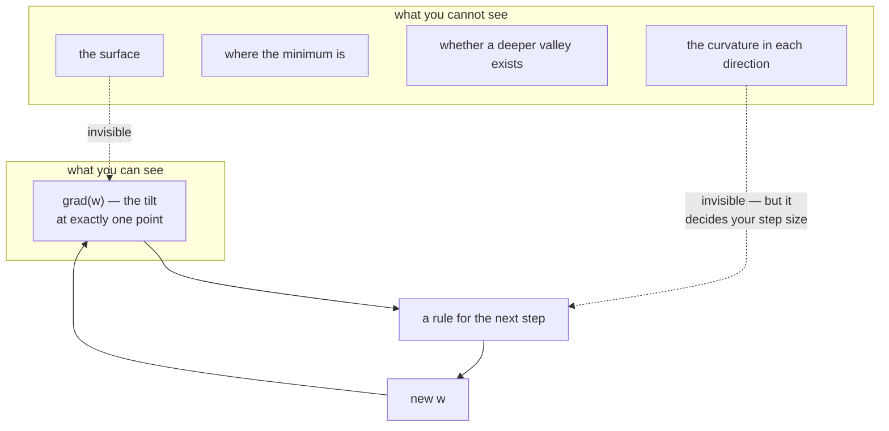

# 1.1 — The loss surface you cannot see

## One-line answer

Training is a walk on a landscape whose height is the loss and whose horizontal directions are the
parameters — you can never see it, you can only feel the slope under your feet, and every optimizer in
this curriculum is a different rule for what to do with that one piece of information.

---

## The story

You are dropped somewhere in the hills at night, in thick fog, and told to get to the lowest point.

You have no map and no view. Your torch lights up the ground for about an arm's length and nothing
beyond it. What you do have is your own feet: stand still, and you can feel exactly which way the
ground tilts underneath you, and roughly how steeply.

That is everything you get. Not where the valley is. Not whether the slope keeps going. Not whether
the dip you are standing in is *the* lowest point or one of ten thousand shallow ones. Just this: from
here, downhill is that way, and it is this steep.

The surprising thing is that it turns out to be enough — as long as two things are true. You have to
take steps of a sensible size, because one big stride can land you further up the opposite slope than
you started. And you have to keep going long after it stops feeling like you are getting anywhere.

Everything else in this day is a refinement of how you choose your next step. Nobody ever hands you
the map.
---

## The idea in plain language

Days 3 and 4 built the machinery to compute a gradient. Day 6 built the thing to compute the gradient
*of*. This day is what you do with the answer, and the useful mental picture is a landscape.

Three words, defined once:

- **The loss surface** is the function that takes every parameter of the model and returns one number:
  the loss. If the model had two parameters you could draw it as a hilly landscape — two horizontal
  axes for the parameters, height for the loss. Akshara will have millions of parameters, so the
  landscape has millions of horizontal directions and cannot be drawn or imagined. **The picture is
  still correct; it is just not viewable.**
- **The gradient** is the direction of steepest *increase* on that surface, at the point where you are
  standing, with a length that says how steep. Day 3 part
  [1.3](../../../day-003-derivatives-and-autograd/parts/01-the-derivative/1.3-partial-derivatives.md)
  defined it as the vector of partial derivatives; here it is the tilt of the ground.
- **Curvature** is how fast the slope itself changes as you move. A narrow steep valley has high
  curvature across it and low curvature along it, and that difference — not the steepness — is what
  makes optimization hard.

Two facts follow immediately, and they set up the rest of the day.

**First: you only ever know the local slope.** Not the shape of the valley, not where the bottom is,
not whether there is a deeper one elsewhere. Every optimizer here is built from the gradient at the
current point plus a little remembered history — nothing else. When you read a new optimizer for the
first time, that is the question to ask: *what does it remember, and what does it do with it?*

**Second: the surface is not round.** In almost every real problem the curvature differs enormously
between directions — some directions are steep-walled canyons, others are nearly flat floors. The
ratio between the steepest and shallowest curvature is the **condition number**, and it is the single
number that predicts how painful optimization will be. A condition number of 1 is a bowl and any method
works. A condition number of 100 means a step size that is safe in the steep direction is a hundred
times too small in the flat one — which is the entire reason section 2 of this day exists.

Throughout section 1 the landscape is deliberately simple and known:

> `f(w) = ½ (a₀·w₀² + a₁·w₁²)` with `a = [1, 100]`

An elongated bowl with its minimum at the origin, curvature `1` along one axis and `100` along the
other, condition number `100`. It is not a language model. It is a surface where **every claim can be
checked against the exact answer**, which is what a teaching example is for — and the failure it
produces is the same failure a real model produces, at a scale you can print.

---

## Why Akshara needs it

- **Part [1.2](1.2-gradient-descent-one-step.md)** turns the slope into a step. It needs "downhill is
  the negative gradient" to have a meaning before it can have a formula.
- **Part [1.3](1.3-the-learning-rate.md)** shows the largest safe step is `2/L`, where `L` is the
  *curvature* — a quantity that only exists because the surface is not flat.
- **Part [2.1](../02-adam/2.1-one-learning-rate-is-not-enough.md)** is entirely about the condition
  number defined here: one learning rate cannot suit two directions whose curvatures differ by 100.
- **Day 25** trains Akshara for the first time, and the loss curve you watch is a one-dimensional
  shadow of this surface — the only view of it you will ever get.
- **Day 55**'s learning-rate schedule is a claim about what the surface looks like *far* from the
  start versus near the end, and it is unjustifiable without this picture.

---

## The mechanism

The surface, evaluated at four points:

```python
import numpy as np

A = np.array([1.0, 100.0])                     # (2,)  curvature along each axis

def f(w):
    return 0.5 * np.sum(A * w ** 2)            # ()   the height

def grad(w):
    return A * w                               # (2,)  the tilt

for w in ([1.0, 1.0], [1.0, 0.0], [0.0, 1.0], [0.5, 0.1]):
    w = np.array(w)
    print(f"  w={w}  f={f(w):.6f}  grad={grad(w)}")
print("  curvature per axis:", A, " condition number:", A.max() / A.min())
```

**Line by line:**
- `f(w) = ½ Σ aᵢ wᵢ²` is a quadratic — the simplest surface that is not flat and not round. Its
  minimum is at the origin, its value there is `0`, and both facts are known exactly, so every number
  below can be checked rather than believed.
- `grad(w) = A * w` follows from differentiating: `∂/∂wᵢ [½ aᵢ wᵢ²] = aᵢ wᵢ`. This is Day 3 part
  [1.1](../../../day-003-derivatives-and-autograd/parts/01-the-derivative/1.1-the-slope-from-the-definition.md)'s
  power rule, one line, and you can verify it with the finite-difference check Day 4 part
  [2.1](../../../day-004-backprop-and-gradcheck/parts/02-gradient-checking/2.1-finite-differences-as-an-oracle.md)
  built.
- `A.max() / A.min()` is the **condition number** for this surface. For a quadratic it is exactly the
  ratio of curvatures; for a real loss it is the ratio of the largest to smallest eigenvalue of the
  second-derivative matrix, and it varies from point to point.
- Measured on Intel Core i3-1115G4 (2 cores / 4 threads), 11.7 GB RAM, Windows 11, CPython 3.12.12,
  numpy 2.5.2, on 2026-08-26:

```text
  w=[1. 1.]   f=50.500000  grad=[  1. 100.]
  w=[1. 0.]   f=0.500000   grad=[1. 0.]
  w=[0. 1.]   f=50.000000  grad=[  0. 100.]
  w=[0.5 0.1] f=0.625000   grad=[ 0.5 10. ]
  curvature per axis: [  1. 100.]  condition number: 100.0
```

Read the first row and the problem of this whole day is in front of you. At `w = [1, 1]` — both
parameters equally far from their optimum — the gradient is `[1, 100]`. **The two components differ by
a factor of a hundred.** Any single step size multiplies both. Whatever you choose is either far too
big for one direction or far too small for the other, and there is no third option.

Row three makes the same point differently: moving parameter 1 from `0` to `1` costs `50` units of
loss; moving parameter 0 the same distance costs `0.5`. **The same distance in parameter space is not
the same distance in loss.**



The one-dimensional shadow, which is the only view you ever get in practice:

```python
w = np.array([1.0, 1.0])
lr = 0.01
for step in range(5):
    g = grad(w)
    w = w - lr * g                             # (2,)  the update; part 1.2 derives it
    print(f"  step {step}: f={f(w):.6f}  w={w}")
```

**Line by line:**
- `w - lr * g` is gradient descent, used here before it is derived, because the point of this snippet
  is what the *printout* looks like rather than what the rule is. Part
  [1.2](1.2-gradient-descent-one-step.md) is the derivation.
- `lr = 0.01` is chosen to be safe in the steep direction: part [1.3](1.3-the-learning-rate.md) shows
  the largest stable value here is `2/100 = 0.02`.
- Measured on this machine, 2026-08-26:

```text
  step 0: f=0.490050  w=[0.99 0.  ]
  step 1: f=0.480298  w=[0.9801 0.    ]
  step 2: f=0.470740  w=[0.970299 0.      ]
  step 3: f=0.461372  w=[0.96059601 0.        ]
  step 4: f=0.452191  w=[0.95099005 0.        ]
```

**Read that first row carefully.** The loss went from `50.5` to `0.49` — 99% gone — in one step, and
then fell by about 2% per step afterwards. Look at `w` to see why: `w₁` is **exactly `0.0`** after step
0, because `1 − 0.01 × 100 = 0` lands precisely on the optimum, while `w₀` has moved from `1.0` to
`0.99` and will need hundreds of steps to arrive.

Nothing is broken and nothing has converged. The steep direction was solved immediately; the flat
direction has barely started. **The loss curve cannot tell you that**, because it is one number where
the problem has two directions — and every loss curve you will ever stare at is this lossy a summary.

---

## Shapes

| Tensor | Symbolic shape | Concrete here | What each axis means |
| --- | --- | --- | --- |
| `w` (parameters) | `(P,)` | `(2,)` | one coordinate per parameter — the horizontal directions |
| `f(w)` (the loss) | `()` | scalar | the height of the surface at `w` |
| `grad(w)` | `(P,)` | `(2,)` | **same shape as `w`, always** — one partial derivative per parameter |
| `A` (curvature) | `(P,)` | `(2,)` | the diagonal of the second-derivative matrix, for this surface only |
| a real model's `w` | `(P,)` | `(124000000,)` | the same picture, 124 million horizontal directions |

The third row is the invariant to hold onto: **the gradient always has the same shape as the thing it
is the gradient of.** Day 4 part
[1.2](../../../day-004-backprop-and-gradcheck/parts/01-the-linear-layer/1.2-the-three-gradients.md)
made it an assertion inside `linear_backward`, and every optimizer in this day relies on it — an
optimizer is elementwise arithmetic between a parameter and its gradient, and elementwise arithmetic
between mismatched shapes is either an error or, worse, a broadcast.

---

## When it breaks

The loud one, from a gradient whose shape does not match its parameter:

```console
>>> import numpy as np
>>> w = np.zeros((8, 4))
>>> g = np.zeros((4, 8))            # transposed by mistake
>>> w - 0.1 * g
Traceback (most recent call last):
  File "<stdin>", line 1, in <module>
ValueError: operands could not be broadcast together with shapes (8,4) (4,8)
```

Verbatim on this machine, 2026-08-26. This is the good outcome: it stops, and the two shapes in the
message name the bug. Day 4 part
[1.3](../../../day-004-backprop-and-gradcheck/parts/01-the-linear-layer/1.3-the-transpose-everyone-gets-wrong.md)
is where that transpose comes from.

**The silent version, which is the one this part exists to warn about:**

```console
>>> w = np.zeros((8, 4))
>>> g = np.ones(4)                  # per-output gradient, not per-weight
>>> (w - 0.1 * g).shape
(8, 4)
>>> np.unique(w - 0.1 * g)
array([-0.1])
```

Verbatim on this machine, 2026-08-26. **No error.** The `(4,)` gradient broadcast across all eight
rows, so every weight in a column received the same update — and the result has the right shape, the
right dtype, and finite values. The model will train; it will just train a model with far fewer
effective degrees of freedom than you think it has, and the only symptom is a loss that plateaus higher
than it should.

The check, and it belongs inside every optimizer you write:

```python
def assert_step_shapes(params, grads):
    """A gradient must have exactly its parameter's shape. Broadcasting here is always a bug."""
    for name, p in params.items():
        g = grads[name]
        if g.shape != p.shape:
            raise ValueError(f"{name}: grad shape {g.shape} != param shape {p.shape} — "
                             "this would broadcast, not error")
```

**Line by line:**
- `g.shape != p.shape` is an **exact tuple comparison**, not a broadcast-compatibility check. That is
  the whole point: broadcast-compatible-but-different is precisely the failure above, so a check that
  permits it permits the bug.
- Iterating a `params` dict rather than a list means the error message can name the parameter. In a
  model with two hundred tensors, "grad shape mismatch" without a name is nearly useless.
- This costs two attribute reads per parameter per step — negligible beside the arithmetic — so unlike
  most checks in this curriculum, **leave it on**.

---

## In production

**What a research engineer writes instead of the teaching version.** Nothing — the framework holds the
gradient in `p.grad`, allocated with `p`'s own shape, so the mismatch above cannot arise for
autograd-produced gradients. What they carry instead is the *picture*, and they use it constantly:
"the loss plateaued" becomes "we are in a flat direction", "the loss spiked" becomes "we stepped across
a narrow valley", "it diverged" becomes "the step exceeded `2/L`". **The vocabulary is the tool.** The
shape check earns its place again the moment gradients are produced by hand — a custom backward, a
manual gradient accumulation, a communication step in distributed training.

The honest caveat about the picture: a quadratic bowl is a *local* model of a real loss surface and
nothing more. Real surfaces are non-convex, their curvature changes as you move, and they contain
saddle points — places that are a minimum in some directions and a maximum in others. In high
dimensions saddles vastly outnumber local minima, which is why the classical worry about "getting
stuck in a local minimum" turns out to be much less important in practice than the worry about crawling
across a flat region. The quadratic picture explains the crawling. It does not explain everything.

**What degrades at scale.** Nothing about the concept; everything about your access to it. With two
parameters you can plot the surface. With 124 million you get one number per step, and that number is
an average over every direction at once — so a direction that has stopped improving is invisible unless
you measure it deliberately. **This is why gradient norms, per-layer statistics and update-to-weight
ratios get logged**, and Day 55 is where that instrumentation is built.

**The failure that only shows with real data.** Condition numbers in real models are not `100`; they
are far larger and they *change during training*. A learning rate that was appropriate at step 0 can be
badly wrong at step 50,000 — not because anything broke, but because the local shape of the surface
changed underneath a constant hyperparameter. That is the entire justification for a schedule.

**The review comment.** *"Add a shape assertion in the optimizer step. A `(4,)` gradient against an
`(8, 4)` parameter broadcasts silently and the model still trains."*

**The interview question.** *"What makes an optimization problem hard, if it isn't the number of
parameters?"* The weak answer is "it's high-dimensional". The strong answer is the condition number:
the ratio of the largest to smallest curvature decides everything, because a single step size has to
serve every direction at once — at a condition number of 100, a step that is stable in the steep
direction is a hundred times too small in the flat one. Then the consequence that shows you have
watched it happen: *and the loss curve cannot show you this, because it averages over all directions —
a curve that flattens might be converged or might be crawling along a flat floor, and those need
different fixes.*

**Compute tier: T0.** Two parameters, a laptop CPU, and a surface whose exact minimum is known. What T0
proves is every structural claim in this section — the effect of curvature, the stability threshold,
what momentum fixes — because those are properties of the *geometry* rather than of the hardware. What
it cannot show is a real loss surface, which is non-convex and 124 million dimensional and cannot be
evaluated at four points and printed. **Day 25 is the first real one**, and this picture is what you
will use to read its curve.

---

## Check yourself

Run this. It prints **one gradient whose two components differ by a factor of a hundred, and a loss
curve that flattens without converging**:

```python
import numpy as np

A = np.array([1.0, 100.0])
f = lambda w: 0.5 * np.sum(A * w ** 2)
grad = lambda w: A * w

w = np.array([1.0, 1.0])
print("  f(w) =", f(w), "  grad(w) =", grad(w), "  condition number =", A.max() / A.min())

for step in range(5):
    w = w - 0.01 * grad(w)
    print(f"  step {step}: f={f(w):.6f}  w={w}")
```

**Line by line:**
- The first line prints `50.5`, `[1. 100.]` and `100.0`. **Say out loud what a single learning rate has
  to do for those two components.**
- The five steps print `0.490050`, `0.480298`, `0.470740`, `0.461372`, `0.452191`. The loss fell by
  99% on step 0 and by about 2% per step after that.
- Now print `w` at each step instead of just `f`, and say **which coordinate stopped moving and which
  one never really started**. Then say which one the loss curve told you about.

**Say this out loud, without scrolling up:** describe what an optimizer can and cannot see, and say
what the condition number is and why it — rather than the number of parameters — is what makes
optimization hard.
