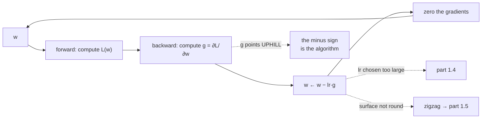

# 1.2 — Gradient descent, one step at a time

## One-line answer

`w ← w − lr · ∂L/∂w` is the whole algorithm: the gradient points uphill, so subtracting it goes
downhill, and the learning rate decides how far — three symbols that train every model in this
curriculum and one minus sign that will cost you an afternoon if you get it wrong.

---

## The story

You are standing in the shower and the water is too cold. There is one tap.

The rule is obvious, and it is completely correct: too cold, turn it towards hot; too hot, turn it
towards cold. Nobody has ever needed to be taught this.

What nobody tells you is *how far* to turn it. So you turn it a long way, because you are cold and you
want this over with. Ten seconds later the water is scalding, so you turn it a long way back, and now
it is freezing again. You spend two minutes swinging between the two extremes, and not once in those
two minutes did you turn the tap the wrong way.

The rule was right the whole time. **How far to turn was never part of the rule** — and that turns out
to be the entire difficulty.
---

## The idea in plain language

Part [1.1](1.1-the-loss-surface.md) established the picture: a surface, and a gradient that says which
way is uphill. This part turns that into a rule.

The gradient `∂L/∂w` points in the direction of **steepest increase**. You want the loss to decrease.
So go the other way:

> **`w ← w − lr · ∂L/∂w`**

That is gradient descent. Three things in it, and each deserves a sentence.

**The minus sign** is the entire algorithm. Get it wrong and you have gradient *ascent* — the loss goes
up, smoothly and confidently, and the printout looks exactly like training except the number increases.
Day 3 part
[1.1](../../../day-003-derivatives-and-autograd/parts/01-the-derivative/1.1-the-slope-from-the-definition.md)
gave the check that catches it in one step: compute the loss, take a step, compute the loss again. If
it went up, the sign is wrong.

**`lr`, the learning rate,** is how far to go. The gradient gives a *direction* and a *steepness*, but
not a distance — nothing in the mathematics says how far the downhill continues, because the gradient
is a purely local fact. So the distance is a choice you make, and part
[1.3](1.3-the-learning-rate.md) is what happens when you make it badly.

**The assignment is in-place.** `w` is overwritten. This matters more than it looks: Day 3 part
[2.1](../../../day-003-derivatives-and-autograd/parts/02-the-autograd-engine/2.1-a-value-that-remembers.md)
distinguished `data` from `grad` precisely so this line could mutate one without disturbing the other,
and Day 2 part
[1.5](../../../day-002-tensors-shape-stride/parts/01-what-a-tensor-is/1.5-the-view-that-changed-the-original.md)
showed what happens when an in-place write lands on a view someone else is holding.

Why does subtracting a small multiple of the gradient *guarantee* the loss goes down? Because for a
small enough step, the surface looks like a plane, and on a plane moving against the slope always
descends. Written out: `L(w − lr·g) ≈ L(w) − lr·‖g‖²`, and `‖g‖²` is never negative — so the loss falls
by about `lr·‖g‖²`. **The approximation is the catch.** It holds for small `lr` and fails for large
`lr`, and "small enough" is set by the curvature, which is part 1.3.

One more thing that makes descent slower than it looks. The gradient is the steepest direction *in
parameter space*, which is not the direction that points at the minimum unless the surface is round.
On part 1.1's elongated bowl, the steepest direction at almost every point is nearly perpendicular to
the walls rather than along the valley floor — so the path zigzags across the valley and creeps along
it. That zigzag is what momentum, in part [1.5](1.5-momentum.md), exists to cancel.

---

## Why Akshara needs it

- **Day 25** is Akshara's first training loop, and this line is in it. Every subsequent day that trains
  anything runs this line, or a refinement of it, millions of times.
- **Part [1.4](1.4-the-step-that-diverged.md)** is what happens when the "small enough" condition is
  violated, measured.
- **Part [1.5](1.5-momentum.md)** and everything in section 2 are modifications of exactly this
  expression: they change what gets multiplied by `lr`, never the minus sign.
- **Day 4 part [1.2](../../../day-004-backprop-and-gradcheck/parts/01-the-linear-layer/1.2-the-three-gradients.md)**
  produced `dW` and `db` and said the optimizer consumes them. This is the consumer.
- **Day 3 part [2.5](../../../day-003-derivatives-and-autograd/parts/02-the-autograd-engine/2.5-zero-grad-the-state-that-leaks.md)**
  established that gradients accumulate. The four-line loop below is where `zero_grad` has to go, and
  putting it in the wrong place is one of the two classic bugs.

---

## The mechanism

The simplest possible case: `f(w) = w²`, whose derivative is `2w` and whose minimum is at `w = 0`.

```python
w = 3.0
lr = 0.1
for i in range(6):
    grad = 2 * w                                   # ()  df/dw for f(w) = w^2
    print(f"  step {i}: w={w:+.6f}  f={w * w:.6f}  grad={grad:+.6f}  next w={w - lr * grad:+.6f}")
    w = w - lr * grad                              # ()  the whole algorithm
```

**Line by line:**
- `grad = 2 * w` is the exact derivative, computed by hand rather than by the engine, so nothing in
  this demonstration depends on Day 3's code being correct. Verify it with the finite-difference check
  from Day 4 part
  [2.1](../../../day-004-backprop-and-gradcheck/parts/02-gradient-checking/2.1-finite-differences-as-an-oracle.md)
  if you want the belt as well as the braces.
- `w - lr * grad` — note the **minus**, and note that `grad` is positive when `w` is positive, so the
  step moves `w` toward zero. That is the sign working.
- The print happens **before** the update, so each line shows the state the step was computed from.
  Printing after would show `grad` and `w` from different moments, which is a small thing that makes a
  log genuinely hard to read.
- Measured on Intel Core i3-1115G4 (2 cores / 4 threads), 11.7 GB RAM, Windows 11, CPython 3.12.12,
  numpy 2.5.2, on 2026-08-26:

```text
  step 0: w=+3.000000  f=9.000000  grad=+6.000000  next w=+2.400000
  step 1: w=+2.400000  f=5.760000  grad=+4.800000  next w=+1.920000
  step 2: w=+1.920000  f=3.686400  grad=+3.840000  next w=+1.536000
  step 3: w=+1.536000  f=2.359296  grad=+3.072000  next w=+1.228800
  step 4: w=+1.228800  f=1.509949  grad=+2.457600  next w=+0.983040
  step 5: w=+0.983040  f=0.966368  grad=+1.966080  next w=+0.786432
```

Every column is doing something. `w` shrinks by exactly 20% per step, because
`w − 0.1·2w = w(1 − 0.2) = 0.8w`. The gradient shrinks in proportion, so **the steps get smaller as you
approach** — nobody had to arrange that, it falls out of the gradient being proportional to the
distance from the minimum. And the loss shrinks by 36% per step, because it is quadratic in `w` and
`0.8² = 0.64`.

That last observation is the useful one: **gradient descent slows down near the minimum automatically**,
which is why it converges rather than orbiting. It is also why the last few percent of loss takes the
majority of the steps.



The loop as it will actually appear, from Day 25 onward:

```python
for step in range(num_steps):
    loss, grads = forward_and_backward(params, batch)   # Days 3-6 built this
    for name in params:
        params[name] -= lr * grads[name]                # (same shape as params[name])
    zero_grads(grads)                                   # Day 3 part 2.5
```

**Line by line:**
- `for name in params` iterates the model's tensors. The update is **elementwise and independent per
  parameter** — no parameter's update depends on any other's, which is why this parallelises trivially
  and why every optimizer in this day is written as elementwise arithmetic.
- `params[name] -= lr * grads[name]` uses `-=`, an **in-place** subtraction. This matters for memory: a
  124-million-parameter model updated with `params[name] = params[name] - ...` allocates a second copy
  of every tensor, transiently doubling weight memory. In-place avoids it.
- `zero_grads` is **after** the update, not before the backward pass. Day 3 part
  [2.5](../../../day-003-derivatives-and-autograd/parts/02-the-autograd-engine/2.5-zero-grad-the-state-that-leaks.md)
  is the argument: gradients accumulate, so a forgotten zero means step `n` is applied with the sum of
  every gradient since the last zeroing — which does not error, and does not obviously diverge either.
- `loss` is captured but not used in the update. **The optimizer never sees the loss value.** It sees
  only the gradient. That is worth saying aloud because it explains why an optimizer cannot detect
  divergence on its own — the number that is exploding is not an input to it.

The sanity check that catches the sign, in three lines:

```python
loss_before, grads = forward_and_backward(params, batch)
for name in params:
    params[name] -= lr * grads[name]
loss_after, _ = forward_and_backward(params, batch)
print(f"  before {loss_before:.6f}  after {loss_after:.6f}  "
      f"{'OK' if loss_after < loss_before else 'WRONG SIGN or lr too large'}")
```

**Line by line:**
- Two forward passes on **the same batch**, with one step between them. Comparing against a *different*
  batch measures batch-to-batch variation instead, and that noise is easily larger than one step's
  improvement — so this check must use the same data twice or it proves nothing.
- The step is deliberately taken between the two evaluations rather than reusing a cached loss, because
  the point is to observe the effect of the step.
- A rise means one of exactly two things: **the sign is wrong**, or **the learning rate is too large**.
  Part [1.3](1.3-the-learning-rate.md) tells them apart — halve `lr` and repeat; if it still rises, it
  is the sign.
- This is the first thing to run on any new training loop, and it takes one batch.

---

## Shapes

| Tensor | Symbolic shape | Concrete here | What each axis means |
| --- | --- | --- | --- |
| `w` (a scalar parameter) | `()` | one value | the toy case above |
| `params[name]` | `(C, V)` | `(8, 4)` | a real weight matrix — input features · outputs |
| `grads[name]` | `(C, V)` | `(8, 4)` | **the same shape, always** — part 1.1's invariant |
| `lr` | `()` | scalar | one number, shared by every parameter in the model |
| `lr * grads[name]` | `(C, V)` | `(8, 4)` | the update, elementwise |

The `lr` row is the one to notice: **a single scalar multiplies every parameter's gradient.** Part 1.1
showed the gradient components can differ by a factor of a hundred; one scalar has to serve all of
them. That tension is unresolved until part [2.2](../02-adam/2.2-adam.md).

---

## When it breaks

The loud one, from gradients that were never zeroed:

```console
>>> import numpy as np
>>> w = np.array([1.0]); g = np.array([0.0])
>>> for step in range(5):
...     g += np.array([2.0]) * w        # accumulate, as autograd does
...     w -= 0.1 * g
...     print(step, w, g)
0 [0.8] [2.]
1 [0.44] [3.6]
2 [-0.008] [4.48]
3 [-0.4544] [4.464]
4 [-0.80992] [3.5552]
```

Verbatim on this machine, 2026-08-26. **Nothing raised**, and the first two steps look like ordinary
training — `w` descending from `1.0` toward zero, a little faster than it should. Then step 2 lands
*past* zero and the parameter walks away in the other direction, because the accumulated gradient is
now more than twice the true one. Day 3 part
[2.5](../../../day-003-derivatives-and-autograd/parts/02-the-autograd-engine/2.5-zero-grad-the-state-that-leaks.md)
is this bug in full; the reason it reappears here is that **the optimizer is where you notice it**, and
by then it looks like a learning-rate problem.

**The silent version is the sign, and it is the more embarrassing one:**

```console
>>> w = 3.0
>>> for i in range(5):
...     w = w + 0.1 * (2 * w)           # plus, not minus
...     print(f"{i}: w={w:.6f}  f={w * w:.6f}")
0: w=3.600000  f=12.960000
1: w=4.320000  f=18.662400
2: w=5.184000  f=26.873856
3: w=6.220800  f=38.698353
4: w=7.464960  f=55.725628
```

Verbatim on this machine, 2026-08-26. The numbers are finite, smooth, and monotone — **it looks exactly
like a training curve, printed upside down.** In a real run with a noisy loss and a log scale, an early
rise is easy to mistake for warmup. The three-line check above finds it in one step.

The guard, for a training loop rather than a demonstration:

```python
def assert_step_descends(loss_before, loss_after, step, lr, tol=1e-9):
    """On a full-batch step, the loss must not increase. On a minibatch, log rather than raise."""
    if loss_after > loss_before + tol:
        raise ValueError(
            f"step {step}: loss rose {loss_before:.6f} -> {loss_after:.6f} at lr={lr}. "
            "Halve lr and retry: if it still rises, the update sign is wrong."
        )
```

**Line by line:**
- `+ tol` allows for the floating-point noise Day 7 part
  [1.3](../../../day-007-floating-point-and-logsumexp/parts/01-floating-point/1.3-the-gap-between-representable-numbers.md)
  measured. Without it, a step that genuinely descended by less than an epsilon fires the check, and a
  check that cries wolf is a check that gets deleted.
- The message contains **the experiment that distinguishes the two causes**, not just the symptom. An
  error message that tells you what to try next is worth three that tell you what happened.
- **This is only valid full-batch.** On a minibatch the loss legitimately rises on individual steps,
  because each step is evaluated on different data — so in a real loop this becomes a logged warning on
  a moving average, not an exception. Raising on a minibatch would make the check fire constantly and
  it would be gone within a day.

---

## In production

**What a research engineer writes instead of the teaching version.** `optimizer.step()`. The three
symbols are inside `torch.optim.SGD`, along with momentum, weight decay, and a `foreach` implementation
that fuses the update across all parameters into a handful of kernel launches rather than one per
tensor — which matters because a 124-million-parameter model has hundreds of tensors and the
per-tensor Python overhead is real.

What survives from this part is the **debugging order**. When a run misbehaves, the first three
questions are always: does the loss fall on a single full-batch step (sign), does halving `lr` fix it
(step size), and are the gradients being zeroed (accumulation). Those three cover the overwhelming
majority of first-implementation failures, and each is a one-batch experiment.

**What degrades at scale.** The update itself is `O(P)` and embarrassingly parallel — it is never the
bottleneck. What does become a problem is **memory traffic**: the step reads the parameter, reads the
gradient, and writes the parameter, so it is bandwidth-bound rather than compute-bound, and at 124
million parameters that is a gigabyte of traffic per step for plain SGD. This is why fused and
`foreach` optimizers exist, and part [2.4](../02-adam/2.4-the-optimizers-memory.md) counts the bytes.

**The failure that only shows with real data.** Minibatch noise. Everything in this part used the full
loss, where every step provably descends. Real training uses a sample, so the gradient is an *estimate*
and individual steps go up — meaning the clean guarantee "the loss decreases" becomes "the loss
decreases in expectation", and every diagnostic built on the strict version has to be relaxed. **A
rising loss is evidence at batch size 16 and noise at batch size 1.**

**The review comment.** *"`params[name] = params[name] - lr * grad` allocates a new tensor every step
for every parameter. Use `-=`."*

**The interview question.** *"Write gradient descent."* The weak answer writes the line. The strong
answer writes the line and says what each piece is doing: the gradient points uphill so the sign is
subtraction, the learning rate supplies a distance the gradient cannot because the gradient is purely
local, and the update is in-place per parameter with no coupling between parameters. Then the check:
*on a full batch, one step must lower the loss — if it rises, halve the learning rate, and if it still
rises the sign is wrong.*

**Compute tier: T0.** A scalar and a laptop. Every number here is exact arithmetic on a known function
and reproduces anywhere. What T0 cannot show is the thing that makes real optimization interesting —
gradient noise from minibatching, and a surface whose curvature changes as you move — because both
require a real model and real data. **Day 25 is the first place this loop meets both**, and this part
is the vocabulary you will read that run with.

---

## Check yourself

Run this. It prints **one sequence descending by exactly 20% per step, and one ascending sequence that
looks just as much like training**:

```python
w = 3.0
for i in range(6):
    grad = 2 * w
    w = w - 0.1 * grad
    print(f"  descent  {i}: w={w:+.6f}  f={w * w:.6f}")

w = 3.0
for i in range(5):
    w = w + 0.1 * (2 * w)
    print(f"  ASCENT   {i}: w={w:+.6f}  f={w * w:.6f}")
```

**Line by line:**
- The descent lines print `+2.400000`, `+1.920000`, `+1.536000`, … — `w` multiplied by `0.8` each time.
  **Work out from `lr` and the derivative why the factor is exactly `0.8`.**
- The ascent lines print `+3.600000`, `+4.320000`, `+5.184000`, … — `w` multiplied by `1.2`. On a log
  plot with a noisy loss, say honestly whether you would spot that in the first ten steps.
- Now set `lr = 0.5` in the descent loop and predict `w` after one step **before** running it. Then set
  `lr = 1.0` and predict again. Part [1.3](1.3-the-learning-rate.md) is the second prediction.

**Say this out loud, without scrolling up:** write the update rule, say why the sign is a minus, say
what the learning rate supplies that the gradient cannot — and name the one-batch experiment that tells
a wrong sign from a too-large step.
