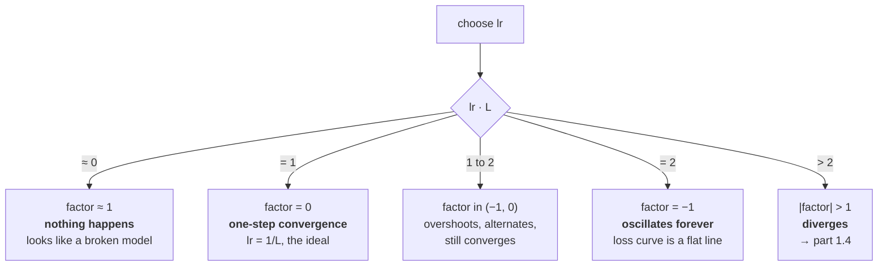

# 1.3 — The learning rate is the whole algorithm

## One-line answer

For a quadratic with curvature `L`, gradient descent converges if and only if `lr < 2/L` — a sharp
boundary you can compute, cross, and watch, and the reason the learning rate is the hyperparameter that
matters more than every other one combined.

---

## The story

Somebody starts running to get fit, and has to decide how far to go each day.

Go too easy, and nothing changes. Six months later they have run every single day, exactly as planned,
and they are exactly as fit as they were at the start. Nothing went wrong. Nothing happened either.

Go too hard, and their knees hurt by the next morning, so the following day starts from a worse place
than the day before it did. Two days in, they are going backwards — and doing *more* only makes them
go backwards faster.

In between there is a range. Not one correct number, a range — wide enough that you can find it, and
narrow enough that you cannot ignore it. And everybody finds it the same way everybody has always
found it: start small, increase until something complains, then back off a little.

The interesting part is that the range moves. What was right in week one is far too easy by week six.
Nobody keeps the week-one distance for six months and calls that a plan.
---

## The idea in plain language

Part [1.2](1.2-gradient-descent-one-step.md) established that the gradient supplies a direction and the
learning rate supplies a distance. This part is about what happens across the whole range of that
choice, and it has an exact answer for the surface we can analyse.

Take `f(w) = ½ a w²`, whose curvature is `a` and whose gradient is `a·w`. One step:

> `w ← w − lr·a·w = w·(1 − lr·a)`

So each step multiplies `w` by the factor `(1 − lr·a)`. Everything follows from that single number:

| `lr·a` | factor `(1 − lr·a)` | behaviour |
| --- | --- | --- |
| tiny | just under `1` | converges, very slowly |
| `1` | `0` | **converges in one step** — the perfect step |
| between `1` and `2` | negative, magnitude `< 1` | overshoots, alternates sign, converges |
| exactly `2` | `−1` | **oscillates forever**, never converges, never diverges |
| above `2` | negative, magnitude `> 1` | alternates sign and grows — **diverges** |

Read the last two rows together and you have the rule:

> **Gradient descent on a quadratic converges if and only if `lr < 2/L`, where `L` is the largest
> curvature.**

Three things make this the most important fact in the day.

**It is a hard boundary, not a guideline.** At `lr = 2/L` exactly, the iterate bounces between two
points forever. A hair below, it converges. A hair above, it diverges. There is no gradual degradation
to warn you.

**`L` is the *largest* curvature, across every direction.** On part 1.1's surface with curvatures
`[1, 100]`, the limit is `2/100 = 0.02` — set entirely by the steep direction, even though the flat
direction would happily accept a step fifty times larger. **The most sensitive parameter in the model
sets the learning rate for all of them.** That is the condition-number problem in one sentence, and it
is what section 2 attacks.

**The best `lr` is not the largest stable one.** `lr = 1/L` is the perfect step for a quadratic; larger
than that is still stable up to `2/L` but overshoots and oscillates on the way in. In practice the
useful range is roughly `1/L` to `2/L`, and since you do not know `L`, you find the boundary by
experiment: increase until it diverges, then back off.

And the reason this matters more than every other hyperparameter: **the learning rate is the only one
that can make training fail completely.** A wrong batch size trains slower. A wrong initialisation
trains slower. A wrong learning rate either does nothing at all or produces `nan`, and both are total
failures rather than degradations.

---

## Why Akshara needs it

- **Part [1.4](1.4-the-step-that-diverged.md)** crosses the boundary deliberately and watches what
  divergence actually looks like — which is slower and more plausible than you expect.
- **Part [2.1](../02-adam/2.1-one-learning-rate-is-not-enough.md)** starts from "`L` is the largest
  curvature across all directions" and asks what to do when the directions disagree by a factor of a
  hundred.
- **Day 25**'s first training run needs a learning rate, and the only honest way to pick one is the
  sweep in this part, run on your own model.
- **Day 55** builds warmup and cosine decay, both of which are claims that the right `lr` **changes
  during training** — warmup because the surface early on is not yet the surface you will be
  optimising, decay because the useful step shrinks as you approach.
- **Day 66**'s pretraining run gets one free GPU session, and a learning rate found by guessing is the
  cheapest way to waste it.

---

## The mechanism

The sweep. `f(w) = w²` has curvature `L = 2`, so the predicted boundary is `lr = 2/2 = 1.0`:

```python
import numpy as np

for lr in (0.01, 0.1, 0.5, 0.9, 1.0, 1.01, 1.1):
    w = 3.0
    for i in range(50):
        w = w - lr * (2 * w)                        # ()  gradient descent on f(w) = w^2
    print(f"  lr={lr:<5}: after 50 steps w={w!r}")
```

**Line by line:**
- `f(w) = w²` gives `f''(w) = 2`, so `L = 2` and the predicted boundary is `2/L = 1.0`. **The number is
  derived before the experiment**, which is what makes this a test rather than an observation.
- The values straddle the boundary deliberately: three well below, one just below, one exactly on it,
  and two just above.
- Fifty steps is enough to make each regime unmistakable and short enough that divergence has not yet
  reached `inf` — part [1.4](1.4-the-step-that-diverged.md) runs it further.
- Measured on Intel Core i3-1115G4 (2 cores / 4 threads), 11.7 GB RAM, Windows 11, CPython 3.12.12,
  numpy 2.5.2, on 2026-08-26:

```text
  lr=0.01 : after 50 steps w=1.0925090402613513
  lr=0.1  : after 50 steps w=4.281743078117882e-05
  lr=0.5  : after 50 steps w=0.0
  lr=0.9  : after 50 steps w=4.281743078117898e-05
  lr=1.0  : after 50 steps w=3.0
  lr=1.01 : after 50 steps w=8.074764087220824
  lr=1.1  : after 50 steps w=27301.31445000665
```

Five things in seven lines, and every one is worth stopping on.

**`lr=0.01` barely moved.** After fifty steps `w` is `1.09`, down from `3.0`. Nothing is wrong; the
factor is `0.98` per step and fifty of those is `0.36`. **This is what a learning rate that is too
small looks like — not a failure, just an absence.**

**`lr=0.5` gives exactly `0.0`.** Because `1 − 0.5×2 = 0`: the perfect step, `lr = 1/L`, which lands on
the minimum in **one** step and stays there. Not approximately zero. Exactly.

**`lr=0.1` and `lr=0.9` give the same magnitude.** `4.2817e-05` both, to fifteen digits. Their factors
are `+0.8` and `−0.8` — the same size, opposite signs — so one approaches monotonically and the other
oscillates in, and after an even number of steps they agree. **They are equally good and they look
completely different in a log.**

**`lr=1.0` gives `3.0` — the starting value.** The factor is exactly `−1`, so `w` alternates between
`+3` and `−3` forever. Fifty steps, no progress, no divergence, no error, and if you happened to print
every other step you would see a perfectly constant `w = 3.0` and conclude the model was frozen.

**`lr=1.1` gives `27301`.** Above the boundary. Growing by 20% per step, sign alternating.

The boundary itself, printed step by step:

```python
for lr in (0.99, 1.0, 1.001):
    w = 3.0
    hist = []
    for i in range(6):
        w = w - lr * (2 * w)
        hist.append(w)
    print(f"  lr={lr}: {[f'{h:+.4f}' for h in hist]}")
```

**Line by line:**
- Three learning rates within 1% of each other, on either side of `2/L = 1.0`.
- Printing the signed values rather than the loss is the point: **the loss hides the alternation**,
  because `w²` is the same for `+3` and `−3`. A loss curve for `lr = 1.0` is a flat line at `9.0`.
- Measured on this machine, 2026-08-26:

```text
  lr=0.99 : ['-2.9400', '+2.8812', '-2.8236', '+2.7671', '-2.7118', '+2.6575']
  lr=1.0  : ['-3.0000', '+3.0000', '-3.0000', '+3.0000', '-3.0000', '+3.0000']
  lr=1.001: ['-3.0060', '+3.0120', '-3.0180', '+3.0241', '-3.0301', '+3.0362']
```

**All three alternate sign.** All three look, on any single step, like a system in trouble. The only
difference between converging and diverging is whether the magnitudes shrink or grow by two parts in a
thousand — and a 0.2% drift per step is invisible for the first hundred steps and fatal by the
thousandth.



And the sweep as you will actually run it, on a model where `L` is unknown:

```python
def lr_range_test(train_one_step, lrs, steps=30):
    """Run a few steps at each lr from the SAME starting parameters. Report the best."""
    results = {}
    for lr in lrs:
        losses = train_one_step(lr, steps)          # must reset params each call
        final = losses[-1]
        results[lr] = final if np.isfinite(final) else float("inf")
        print(f"  lr={lr:<10}: start {losses[0]:.6f}  final {final!r}")
    best = min(results, key=results.get)
    print(f"  -> best {best}; the boundary is just above the largest lr that did not diverge")
    return best
```

**Line by line:**
- `train_one_step(lr, steps)` must **reset the parameters each call**. Sweeping without a reset
  measures "lr B applied after lr A" rather than lr B, and the results are meaningless in a way that is
  not visible from the output.
- Thirty steps is deliberately short. The purpose is to find the boundary, not to train — and the
  boundary shows itself within a few steps, because divergence is multiplicative.
- `np.isfinite(final)` maps a `nan` to `inf` so that `min` does not select it. **`nan` compares `False`
  against everything**, so a raw `min` over a list containing `nan` can return the `nan` — Day 7 part
  [2.5](../../../day-007-floating-point-and-logsumexp/parts/02-stable-softmax/2.5-log-sum-exp-everywhere-else.md)
  is that trap.
- Spacing the `lrs` **geometrically** — `1e-5, 1e-4, 1e-3, …` — rather than linearly is what makes a
  short sweep informative: the useful range spans orders of magnitude, so a linear grid wastes almost
  every point.
- The recommendation is *the largest that did not diverge, backed off* — usually by a factor of two or
  three — because the boundary moves as training proceeds and sitting on it is not a plan.

---

## Shapes

| Tensor | Symbolic shape | Concrete here | What each axis means |
| --- | --- | --- | --- |
| `w` | `()` | one value | the toy parameter |
| `lr` | `()` | scalar | **one number for the entire model** |
| `L` (largest curvature) | `()` | `2` for `w²`, `100` for part 1.1's surface | the largest eigenvalue of the second-derivative matrix |
| `lrs` in a sweep | `(k,)` | `(7,)` | geometrically spaced candidate rates |
| a model's parameters | `(P,)` | `(124000000,)` | all sharing the same `lr` |

The second and last rows together are the tension: **one scalar, 124 million parameters, and a bound
set by whichever one of them has the largest curvature.**

---

## When it breaks

The loud one, at a learning rate well above the boundary:

```console
>>> w = 3.0
>>> for i in range(1022):
...     w = w - 1.5 * (2 * w)
>>> w
inf
>>> w - 1.5 * (2 * w)
nan
```

Verbatim on this machine, 2026-08-26 — `w` first becomes `inf` at step **1021**. It doubles in magnitude
every step at `lr = 1.5` (factor `−2`), so it takes just over a thousand steps to climb from `3.0` to
`float64`'s ceiling of `1.8e308`, and then the next subtraction is `inf − inf`,
which Day 7 part [2.1](../../../day-007-floating-point-and-logsumexp/parts/02-stable-softmax/2.1-the-softmax-that-returns-nan.md)
identified as `nan`. **`nan` in the weights is the loud, obvious version of this failure and you should
be grateful for it.**

**There are two silent versions and they are opposites.**

The first is `lr` too small:

```console
>>> w = 3.0
>>> for i in range(50):
...     w = w - 0.001 * (2 * w)
>>> w
2.7142404540121086
```

Verbatim on this machine, 2026-08-26. Fifty steps, `w` moved by 10%, and every step was correct. There
is no error, no warning, and no way to distinguish this from "the model is hard" without a comparison
run at a higher rate. **A run that is doing nothing looks exactly like a run that is doing something
slowly**, and the only difference is a hyperparameter you chose.

The second is `lr` exactly on the boundary:

```console
>>> w = 3.0
>>> for i in range(1000):
...     w = w - 1.0 * (2 * w)
>>> w
3.0
>>> w * w
9.0
```

Verbatim on this machine, 2026-08-26. A thousand steps, and the loss is **exactly** its starting value.
Not approximately — `9.0`. In a real run this appears as a loss curve that is perfectly flat, which
everybody reads as "the model has converged" or "the gradients are zero", and it is neither: the
gradients are large and the parameter is bouncing between two points.

The check, which is cheap and belongs in every training loop:

```python
def log_step_health(loss, params, prev_params, step):
    """Three numbers that distinguish too-small, too-large and on-the-boundary."""
    update = np.concatenate([(params[k] - prev_params[k]).ravel() for k in params])
    weights = np.concatenate([prev_params[k].ravel() for k in params])
    ratio = np.linalg.norm(update) / (np.linalg.norm(weights) + 1e-12)
    print(f"  step {step}: loss {loss:.6f}  update/weight {ratio:.3e}")
    if not np.isfinite(loss):
        raise ValueError(f"step {step}: loss is {loss!r} — lr is above the stability boundary")
    return ratio
```

**Line by line:**
- The **update-to-weight ratio** is the diagnostic, not the loss. It is the size of the step relative to
  the size of the thing being stepped, so it is comparable across layers, across models and across
  training stages in a way that a raw gradient norm is not.
- A ratio around `1e-3` is the neighbourhood where things usually work — **and that number is a
  heuristic from this ratio's construction, not a measurement**: it says the parameters move by about a
  tenth of a percent per step, so a thousand steps is a substantial change. Measure your own on a run
  that worked; do not adopt a number you read.
- `+ 1e-12` guards the division when a parameter group is all zeros, which happens for a freshly
  initialised bias.
- A ratio near `1e-8` and falling means the learning rate is too small; a ratio near `1` means the
  parameters are being rewritten every step. **Both are visible here and neither is visible in the
  loss.**
- `np.isfinite(loss)` raises rather than warns, because a `nan` loss means every subsequent step is
  wasted compute — and on Day 66 that is a free GPU session.

---

## In production

**What a research engineer writes instead of the teaching version.** They run a **learning-rate range
test**: start at a very small `lr` and increase it geometrically over a few hundred steps, plotting the
loss against `lr`. The plot has a characteristic shape — flat while `lr` is too small, descending
through the useful band, then turning sharply upward at the boundary — and the rate they pick is
roughly an order of magnitude below the turning point, because the boundary moves as training
proceeds.

The other half of the practice is that **the learning rate is never quoted alone.** It is quoted with
the batch size, the schedule, the warmup length and the optimizer, because changing any of those
changes what value is appropriate. A learning rate copied from a paper without its batch size is a
number with no meaning, and this is one of the most common ways a reproduction fails.

**What degrades at scale.** `L` grows with depth and width, so a rate that worked for a small model
diverges for a larger one, in the same code. This is not a bug and it is not a surprise — it is the
`2/L` bound with a different `L` — and it is why every scaling study re-tunes the learning rate rather
than transferring it, and why the literature on transferring hyperparameters across model sizes exists
at all.

**The failure that only shows with real data.** The boundary is not constant. Early in training the
surface is dominated by the initialisation and `L` is often *larger* than it will be later — which is
exactly why warmup exists: start below the boundary, let the surface settle, then increase. A rate
found by sweeping at step 0 can be too aggressive at step 0 and too timid at step 50,000. **The single
value you found is right for one moment of a run**, and Day 55 is the schedule that admits it.

**The review comment.** *"`lr=3e-4` with no batch size in the config comment. And log the
update-to-weight ratio — a flat loss curve at the stability boundary looks exactly like convergence."*

**The interview question.** *"How do you pick a learning rate?"* The weak answer names a number. The
strong answer gives the mechanism and the procedure: for a quadratic, gradient descent converges if and
only if `lr < 2/L` where `L` is the largest curvature, so the boundary is sharp and set by the single
most sensitive direction in the model — which means you find it by a geometric sweep, take the largest
value that did not diverge, and back off by a factor of a few. Then the detail that shows you have
debugged one: *and I log the update-to-weight ratio rather than only the loss, because a rate exactly
at the boundary makes the parameter oscillate between two points and produces a perfectly flat loss
curve that reads as convergence.*

**Compute tier: T0.** A scalar on a laptop, and the boundary at `lr = 1.0` is *derived* from
`f''(w) = 2` before it is observed — so this part predicts rather than reports. What T0 cannot supply
is `L` for a real model, which has no closed form and must be found empirically. **The rule is exact
here and becomes a search procedure on Day 25**, which is the honest shape of most numerical analysis
in this field.

---

## Check yourself

Run this. It prints **one learning rate that converges in a single step and one that runs a thousand
steps to nowhere**:

```python
for lr in (0.001, 0.5, 1.0, 1.1):
    w = 3.0
    for i in range(50):
        w = w - lr * (2 * w)
    print(f"  lr={lr:<6}: w after 50 steps = {w!r}")

w = 3.0
for i in range(1000):
    w = w - 1.0 * (2 * w)
print("  lr=1.0 after 1000 steps: w =", w, " loss =", w * w)
```

**Line by line:**
- `lr=0.001` prints `2.7142404540121086` — barely moved. `lr=0.5` prints `0.0` — exact, in one step.
  **Say why `0.5` is special for this particular `f`.**
- `lr=1.0` prints `3.0` and `lr=1.1` prints `27301.31445000665`. A 10% change in the hyperparameter is
  the difference between frozen and exploded.
- The thousand-step line prints `w = 3.0` and `loss = 9.0`. **Say out loud what that loss curve looks
  like and what you would wrongly conclude from it.**
- Now compute `2/L` for `f(w) = 5w²` on paper, then verify by sweeping. If your prediction is `0.2`,
  you have the rule.

**Say this out loud, without scrolling up:** state the convergence condition for gradient descent on a
quadratic, say which curvature sets it when directions disagree, and describe what a learning rate
exactly at the boundary does to a loss curve.
