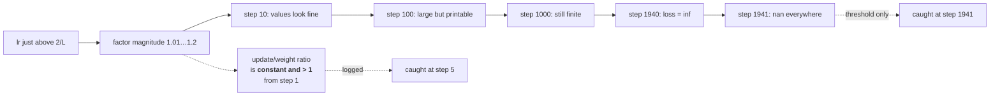

# 1.4 — 💥 The step that diverged, and took 1940 steps to admit it

## One-line answer

Divergence is not an explosion — it is a constant percentage growth that stays inside plausible numbers
for hundreds of steps before it becomes `inf`, so by the time you see a `nan` the run has been wrong
for longer than you were watching.

---

## The story

A shop's fridge is set one degree too warm. Nothing happens.

Nothing happens for a week. The milk is cold, the little thermometer on the door reads inside the
green band, and anybody glancing at it would sign it off. In the second week, things at the back start
to soften overnight and firm up again by morning, which nobody can see through the packaging. In the
third week the texture has changed all the way through — and it is still cold, still inside the green
band, still passing.

In the fifth week, a customer complains.

Somebody goes looking for the day it broke, and there is no such day. There is a setting that was
wrong from the very first hour, and a shop with no way at all to notice a slow, steady drift — only an
alarm, which went off thirty days after the mistake and eleven days after the food became unsellable.

The failure was not that the alarm was late. The failure was that the alarm was the only instrument in
the building.
---

## The idea in plain language

Part [1.3](1.3-the-learning-rate.md) gave the boundary: `lr < 2/L`. This part crosses it and watches,
because the *shape* of the failure is not what people expect.

Above the boundary each step multiplies the parameter by a factor whose magnitude exceeds 1. That is
**geometric growth**, and geometric growth has two properties that make it a bad thing to detect by
threshold:

**It is slow at first.** At `lr` 10% above the boundary, the factor is `−1.2`, so the parameter grows
by 20% per step. Starting from `3.0`, after ten steps it is about `18` — a number nobody would look
at twice. After a hundred steps it is around `10⁹`, which still prints. It takes **1940 steps** to reach
`float64`'s ceiling and become `inf`. Nearly two thousand steps of a run that was already doomed at
step 1.

**It is invisible in a loss curve on a log scale, which is how everyone plots loss.** Geometric growth
is a straight line on a log plot. So is geometric *decay*. The only difference is the sign of the
slope, and against a noisy background an upward drift of a few percent per step is easy to read as "not
converged yet".

Then the sign alternation, which makes it worse. Above the boundary the factor is *negative*, so the
parameter flips sign every step. The loss — a function of `w²` — does not see the sign, so **the loss
looks like smooth growth while the parameters are oscillating violently.** If you happen to log every
other step, the parameters look like they are drifting steadily in one direction.

The practical conclusion is the one from the story: **`nan` is a threshold, not an instrument.** By the
time it fires, the useful information — when the drift started, which layer started it, what the
learning rate was doing — is a thousand steps in the past. The instrument is a logged *rate of change*:
the update-to-weight ratio, the gradient norm, and `max|param|`, every step, from step 1.

And one honest complication, measured below: **not every too-large learning rate diverges.** On a
convex problem where the gradient shrinks as you overshoot — which includes softmax cross-entropy on a
linear model — an enormous learning rate produces a violent first step and then *recovers*, ending up
converging faster than a sensible rate would. That is not a reason to use enormous rates. It is a
reason not to conclude "it converged, so the rate was fine."

---

## Why Akshara needs it

- **Day 25**'s first training run will diverge at some point, and this part is what it will look like
  when it does.
- **Day 55** builds gradient clipping and warmup, both of which are direct responses to this failure —
  clipping bounds the step when the gradient spikes, warmup keeps `lr` below the boundary while the
  surface is at its worst.
- **Day 66** is a single free GPU session. A run that diverges at step 1 and is noticed at step 2000
  has spent the session.
- **Day 7 part [2.1](../../../day-007-floating-point-and-logsumexp/parts/02-stable-softmax/2.1-the-softmax-that-returns-nan.md)**
  measured what happens once a value reaches `inf`: the next operation gives `nan`, and `nan` spreads
  to every parameter. This part is how the value got there.
- **`docs/RUNS.md`** has an `Outcome` column with `diverged` in its vocabulary, because Principle 10
  requires a diverged run to be **reported as diverged** rather than quietly re-run.

---

## The mechanism

Ten steps past the boundary, printed:

```python
w = 3.0
for i in range(9):
    w = w - 1.1 * (2 * w)                       # ()  lr = 1.1, boundary is 1.0
    print(f"  step {i}: w = {w!r}   f = {w * w!r}")
```

**Line by line:**
- `lr = 1.1` is **10% above** the boundary of `2/L = 1.0` for `f(w) = w²`. Not ten times above. Ten
  percent.
- The factor is `1 − 1.1 × 2 = −1.2`: sign flips, magnitude grows by 20%.
- Printing `w` **and** `f` together is the point of the demonstration — one alternates, the other does
  not, and only one of them is usually logged.
- Measured on Intel Core i3-1115G4 (2 cores / 4 threads), 11.7 GB RAM, Windows 11, CPython 3.12.12,
  numpy 2.5.2, on 2026-08-26:

```text
  step 0: w = -3.6000000000000005   f = 12.960000000000004
  step 1: w = 4.320000000000001     f = 18.66240000000001
  step 2: w = -5.184000000000002    f = 26.87385600000002
  step 3: w = 6.220800000000003     f = 38.69835264000004
  step 4: w = -7.464960000000006    f = 55.72562780160008
  step 5: w = 8.95795200000001      f = 80.24490403430417
  step 6: w = -10.749542400000013   f = 115.55266180939805
  step 7: w = 12.899450880000018    f = 166.39583300553323
  step 8: w = -15.479341056000024   f = 239.60999952796794
```

Nine steps. The loss went from `9` to `240` — a factor of 27, which on a log-scale plot is less than
one and a half decades and could be a run that has not warmed up. **The `w` column alternates sign
every single step and the `f` column does not show it at all.**

Now run it to the end:

```python
import numpy as np

for lr in (1.01, 1.1, 1.5):
    w = 3.0
    overflow_at = None
    hist = []
    for i in range(4000):
        w = w - lr * (2 * w)
        hist.append(w)
        if not np.isfinite(w * w):              # the LOSS overflows before w does
            overflow_at = i
            break
    print(f"  lr={lr}: |w| after 10 steps {abs(hist[9]):.6e}   loss overflows at step {overflow_at}")
```

**Line by line:**
- The check is on `w * w`, not on `w`, because **the loss is what you are watching** and `w²` reaches
  `float64`'s ceiling at around `1.3e154` while `w` itself survives to `1.8e308`. The loss goes `inf`
  first, roughly twice as early.
- `4000` is an upper bound chosen so the slowest case terminates; the loop breaks as soon as the
  overflow happens.
- Measured on this machine, 2026-08-26:

```text
  lr=1.01: |w| after 10 steps 3.656983e+00   loss overflows at step None
  lr=1.1 : |w| after 10 steps 1.857521e+01   loss overflows at step 1940
  lr=1.5 : |w| after 10 steps 3.072000e+03   loss overflows at step 510
```

**`lr = 1.1` takes 1940 steps to produce a non-finite loss.** And `lr = 1.01` — one percent above the
boundary — does not overflow within four thousand steps at all: after ten steps `w` is `3.66`, barely
distinguishable from where it started, and it will need tens of thousands of steps to blow up. **A run
that is one percent past the stability boundary looks completely normal for its entire first hour.**



And the honest complication — a real loss where a huge learning rate does **not** diverge:

```python
def train(lr, steps=200):
    """16 examples, a linear layer, softmax cross-entropy. Losses only."""
    W, b = init()                                    # (C, V), (V,)
    hist = []
    for t in range(steps):
        loss, gW, gb = forward_and_backward(W, b)    # (), (C, V), (V,)
        hist.append(loss)
        if not np.isfinite(loss):
            return hist, t
        W -= lr * gW
        b -= lr * gb
    return hist, None

for lr in (0.5, 5.0, 50.0, 500.0, 5000.0):
    h, blew = train(lr)
    print(f"  lr={lr:<8}: step0 {h[0]:.6f}  step5 {h[5]:.6e}  -> "
          + (f"nan/inf at step {blew}" if blew else f"final {h[-1]:.6e}"))
```

**Line by line:**
- The model is a `(8, 4)` linear layer over 16 examples with softmax cross-entropy — Day 4's layer,
  Day 6's loss, and Day 7's stable `log_softmax`. It is the smallest thing that is a real training
  problem rather than a quadratic.
- `forward_and_backward` returns the loss and both gradients; `init()` reseeds so each learning rate
  starts from **identical parameters**, which is what makes the comparison a comparison.
- Measured on this machine, seed **1337**, 2026-08-26:

```text
  lr=0.5     : step0 1.615341  step5 7.580018e-01  -> final 1.234632e-01
  lr=5.0     : step0 1.615341  step5 2.624556e-01  -> final 1.370948e-02
  lr=50.0    : step0 1.615341  step5 1.531621e+00  -> final 1.181788e-04
  lr=500.0   : step0 1.615341  step5 2.554727e+01  -> final 3.282707e-12
  lr=5000.0  : step0 1.615341  step5 2.515915e+02  -> final -0.000000e+00
```

**None of them diverged.** At `lr = 5000` the loss went from `1.6` to `1494` on the first step and
`252` by step 5 — and then came back and reached `-0.0` by step 200, a *better* final loss than the
sensible rate achieved.

Why: this loss is convex and its gradient **saturates**. Overshooting into a region of confidently
wrong predictions produces a gradient bounded by the softmax, not one proportional to the distance —
so the runaway feedback that makes a quadratic diverge is absent. **Read that as a warning about what
you can conclude, not as licence.** The final loss of `-0.0` means the model has driven its logits to
infinity to fit sixteen examples exactly; on a real problem with more than one batch, the same rate
would be catastrophic, and the "recovery" here is an artifact of a convex problem with a saturating
gradient.

The instrument, rather than the alarm:

```python
def log_divergence_signals(loss, params, prev_params, grads, step):
    """Log a RATE, not a threshold. These catch divergence at step 5, not step 1940."""
    upd = np.concatenate([(params[k] - prev_params[k]).ravel() for k in params])
    wts = np.concatenate([prev_params[k].ravel() for k in params])
    gs = np.concatenate([grads[k].ravel() for k in grads])
    ratio = np.linalg.norm(upd) / (np.linalg.norm(wts) + 1e-12)
    print(f"  step {step}: loss {loss:.6f}  |g| {np.linalg.norm(gs):.3e}  "
          f"update/weight {ratio:.3e}  max|w| {np.abs(wts).max():.3e}")
    if not np.isfinite(loss):
        raise ValueError(f"step {step}: loss is {loss!r} — already diverged, look upstream in this log")
    return ratio
```

**Line by line:**
- **Four numbers, and the loss is the least useful of them.** The loss is the last to move; the
  update-to-weight ratio moves on step 1.
- `update/weight` above about `1` means the parameters are being rewritten every step, which is the
  signature of a rate past the boundary. A converging run's ratio *falls*; a diverging run's stays
  constant or rises. **The trend is the signal, not the value.**
- `max|w|` is the cheapest possible early warning: it grows geometrically from step 1 in a diverging
  run and is bounded in a healthy one. One reduction per step.
- The raise is deliberately worded to say **the diagnosis is upstream in this log**, because by the
  time the loss is `nan` the cause is hundreds of steps old and the natural instinct — look at the
  current step — is wrong.
- Print every step for the first fifty, then every N. The first fifty are where the boundary shows
  itself.

---

## Shapes

| Tensor | Symbolic shape | Concrete here | What each axis means |
| --- | --- | --- | --- |
| `w` (toy) | `()` | one value | the diverging parameter |
| `W` (linear layer) | `(C, V)` | `(8, 4)` | input features · output classes |
| `gW` | `(C, V)` | `(8, 4)` | the same shape, always |
| `hist` | `(steps,)` | `(200,)` | one loss per step — the curve you plot |
| `update` (flattened) | `(P,)` | `(36,)` | every parameter's change, concatenated for one norm |
| `ratio` | `()` | scalar | **one number per step; the signal** |

The `update`/`ratio` rows are the working part: flattening every parameter into one vector gives a
single comparable number per step, which is what you want in a log line. Per-layer ratios are more
informative and are Day 55's instrumentation.

---

## When it breaks

The loud one, arriving 1941 steps late:

```console
>>> import numpy as np
>>> w = 3.0
>>> for i in range(1022):
...     w = w - 1.5 * (2 * w)
>>> w
inf
>>> w - 1.5 * (2 * w)
nan
>>> np.array([1.0, 2.0]) * np.nan
array([nan, nan])
```

Verbatim on this machine, 2026-08-26. **The last line is why this is not recoverable**: once one
parameter is `nan`, every operation that touches it produces `nan`, so the next forward pass makes the
loss `nan`, the backward pass makes every gradient `nan`, and one step later **every parameter in the
model** is `nan`. There is no partial damage.

**The silent version is the whole subject of this part:**

```console
>>> w = 3.0
>>> for i in range(10):
...     w = w - 1.01 * (2 * w)
>>> w
3.6569832599842726
>>> w * w
13.373526563805198
```

Verbatim on this machine, 2026-08-26. Ten steps at 1% past the boundary. The loss went from `9.0` to
`13.4` — a 49% rise over ten steps, which in a real run with minibatch noise is **completely
indistinguishable from normal fluctuation.** And note the sign: after an even number of steps `w` is
back to positive, so a log that samples every other step sees a parameter drifting smoothly upward
rather than flipping. Nothing here is `nan`, nothing is large, nothing warns.
And the run is already unrecoverable: it will not converge, ever, at any point in the future, and no
amount of patience fixes it.

The check that catches it at step 10 rather than step 1940:

```python
def assert_not_diverging(ratios, window=20, name="run"):
    """A converging run's update/weight ratio trends DOWN. A diverging one does not."""
    if len(ratios) < 2 * window:
        return
    early = float(np.median(ratios[-2 * window:-window]))
    late = float(np.median(ratios[-window:]))
    if late > early * 1.5:
        raise ValueError(
            f"{name}: update/weight ratio rose {early:.3e} -> {late:.3e} over {window} steps. "
            "This is geometric growth, not noise — lower lr now; the loss will look fine for "
            "another thousand steps."
        )
```

**Line by line:**
- `np.median` rather than `mean` because minibatch gradients are noisy and a single outlier step should
  not fire the check. A check that fires on noise gets deleted, which is worse than no check.
- Comparing two **windows** rather than two points is the same reasoning: the signal here is a trend,
  and a trend needs more than two samples to be a trend.
- `1.5×` over twenty steps is a threshold for this check, chosen loose enough to ignore noise and tight
  enough to catch a 20%-per-step growth (which would be `38×` over twenty steps). **It is a heuristic,
  not a measurement** — calibrate it on a run that worked.
- The message says *the loss will look fine for another thousand steps*, because the natural response
  to this warning is to glance at the loss, see nothing wrong, and dismiss it. **That is exactly the
  mistake, and the message should say so.**

---

## In production

**What a research engineer writes instead of the teaching version.** Two things, and neither is a
divergence detector. First, **gradient clipping** — bound the global gradient norm, so a single large
gradient cannot produce an unbounded step. This does not fix a learning rate above the boundary, but it
does contain the spikes that turn a survivable rate into a fatal one, and it is close to free. Second,
**warmup** — start `lr` near zero and ramp it up, because the surface early in training has the largest
curvature and therefore the tightest bound. Day 55 builds both.

Third, and it is a process rather than a technique: **checkpoint often enough that divergence costs you
minutes rather than a session.** The standard recovery is to reload the last checkpoint with a finite
loss, lower the learning rate, and resume — which is only possible if such a checkpoint exists. Day 60
is where checkpointing and resume get built, and Day 66 is where it stops being optional because a free
session can be revoked at any moment.

**What degrades at scale.** The cost of noticing late. At laptop scale, 1940 wasted steps is a few
seconds. At Day 66's scale it is a substantial fraction of a free GPU session, and at production scale
it is a meaningful amount of money. **The failure is identical; only the price of the 1940 steps
changes**, which is why the instrumentation that would be over-engineering here is mandatory there.

**The failure that only shows with real data.** Gradient spikes. Everything in this part diverged from a
learning rate that was constant and slightly too large. Real runs more often diverge from a rate that
was *fine* meeting an unusually large gradient — a bad batch, a rare token, a long sequence — which
produces one enormous step that lands somewhere the model cannot recover from. **That failure cannot be
reproduced on a quadratic**, it requires real data, and gradient clipping is the response to it
specifically.

**The review comment.** *"The only divergence check is `assert not math.isnan(loss)`. Log the
update-to-weight ratio and `max|param|` from step 1 — by the time the loss is `nan` the cause is a
thousand steps back."*

**The interview question.** *"Your loss becomes `nan` at step 4000. Where do you start?"* The weak
answer is "lower the learning rate". The strong answer starts earlier: `nan` is a threshold, so the
first job is to find when the run actually went wrong, which is much earlier — look at the
update-to-weight ratio and `max|param|` and find where they stopped trending down. Divergence is
geometric, so a rate 10% past the boundary takes on the order of two thousand steps to overflow while
being unrecoverable from step one. Then the two causes: a learning rate above `2/L`, or a fine rate
meeting a gradient spike — and they have different fixes, warmup and decay for the first, clipping for
the second. The follow-up that shows you have lived it: *and I would reload the last finite checkpoint
rather than restart, and log the batch indices so I can find out whether one batch did it.*

**Compute tier: T0.** A scalar and a `(8, 4)` linear layer on a laptop; every number reproduces at seed
1337 on any conforming machine, and the `inf` at step 1940 is a property of `float64` rather than of
this hardware. What T0 cannot reproduce is the gradient-spike failure above, which needs real data —
**so this part teaches the mechanism it can measure and names the one it cannot**, rather than
pretending a quadratic covers both.

---

## Check yourself

Run this. It prints **nine steps of a diverging run that look completely ordinary, and the step number
at which it finally admits it**:

```python
import numpy as np

w = 3.0
for i in range(9):
    w = w - 1.1 * (2 * w)
    print(f"  step {i}: w={w:+.6f}  f={w * w:.6f}")

for lr in (1.01, 1.1, 1.5):
    w = 3.0
    at = None
    for i in range(4000):
        w = w - lr * (2 * w)
        if not np.isfinite(w * w):
            at = i
            break
    print(f"  lr={lr}: loss overflows at step {at}")
```

**Line by line:**
- The nine steps print a loss rising `12.96 → 18.66 → 26.87 → … → 239.61`. **On a log plot, say
  honestly whether you would call that a problem or a slow start.**
- The `w` column alternates sign every step and the `f` column never shows it. Say which of those two
  your training loop logs.
- The overflow line prints `None`, `1940` and `510`. **A one-percent error in the learning rate does
  not overflow in four thousand steps** — and it never converges either.
- Now add a print of `abs(w)` divided by its previous value each step, and say what that number is for
  each of the three learning rates. That ratio is the instrument this part is arguing for.

**Say this out loud, without scrolling up:** describe the shape of divergence, say why `nan` is a bad
detector, and name the two quantities you would log from step 1 to catch it in ten steps instead of two
thousand.
