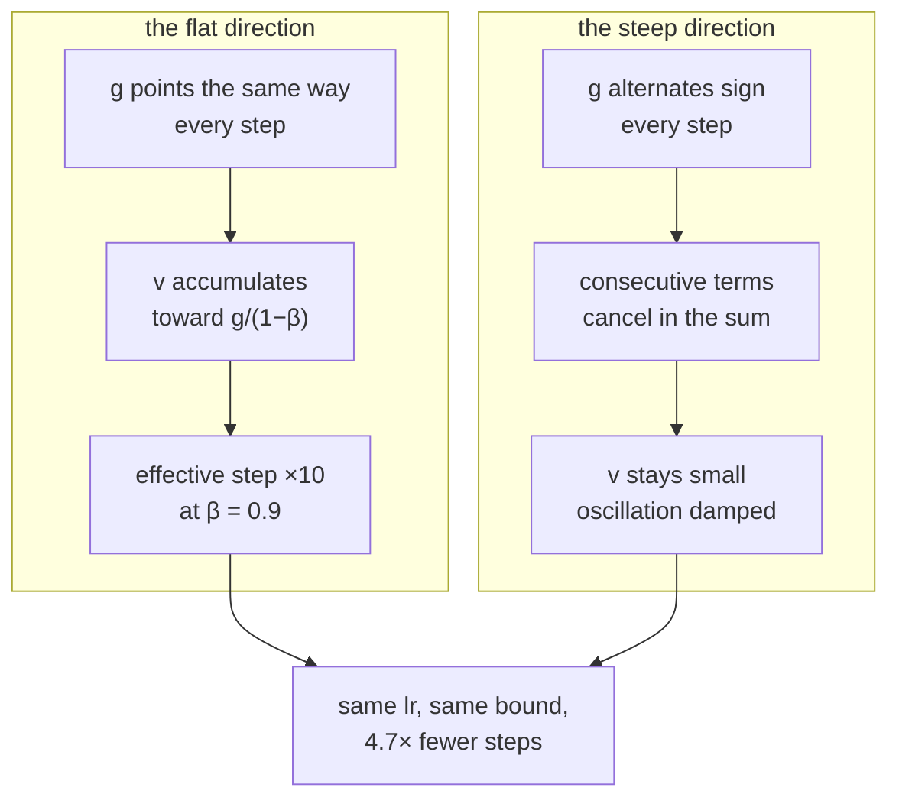

# 1.5 — Momentum: the ball with inertia

## One-line answer

Momentum replaces the raw gradient with a running average of recent gradients, so directions that keep
pointing the same way accumulate and directions that alternate cancel — which on an ill-conditioned
surface reached the same accuracy in 138 steps where plain gradient descent needed 653.

---

## The story

Two people have to push a heavy shopping trolley the whole length of a long corridor. Both are
blindfolded, and both are told exactly one thing: which way the floor tilts under their feet, right
now.

The first pushes precisely as instructed. The floor slopes a little towards the left wall, so he
pushes right. Then he is past the middle and it slopes the other way, so he pushes left. Then right
again. He zig-zags across the corridor the entire way down, and he only gets anywhere at all because
the corridor happens to run very slightly downhill. It takes a long time.

The second gets tired and starts letting the trolley roll instead of stopping it between pushes. Now
each push adds to what the trolley is already doing, instead of replacing it. The left-and-right
pushes still happen — but they point opposite ways on one stride and the next, so they largely cancel
each other out, while the small forward push points the same way every single time and quietly builds
up.

She gets there first, and she was not pushing any harder. She was pushing something that remembered.
---

## The idea in plain language

Part [1.2](1.2-gradient-descent-one-step.md) noted the zigzag: on an elongated bowl, the steepest
direction is mostly *across* the valley rather than along it, so gradient descent bounces between the
walls and creeps along the floor. Part [1.3](1.3-the-learning-rate.md) explained why you cannot just
use a bigger step — the bound `2/L` is set by the steep direction, which is the one you want to move in
*less*.

Momentum attacks this without touching the bound. Instead of stepping along the current gradient, keep
a running **velocity** and step along that:

> `v ← β·v + g`
> `w ← w − lr·v`

`β` is the momentum coefficient, between 0 and 1. At `β = 0` this is exactly gradient descent. At
`β = 0.9` the velocity is a decaying sum of every gradient so far, with the most recent weighted most
heavily.

Why that helps is the whole idea, and it is worth stating twice:

**Consistent directions accumulate.** Along the valley floor, every gradient points roughly the same
way. The velocity in that direction builds up toward `g/(1 − β)` — at `β = 0.9`, **ten times** the
individual gradient. The effective step in the flat direction is ten times larger without `lr`
changing.

**Alternating directions cancel.** Across the valley, consecutive gradients point in opposite
directions. Adding them into a running sum makes them largely destroy each other, so the velocity in
the oscillating direction stays small.

So one number, `β`, amplifies exactly the directions that were too slow and damps exactly the ones that
were bouncing. **It is the zigzag itself that supplies the cancellation** — the failure mode is the
mechanism of the fix.

Two practical notes that matter more than they look.

**`1/(1 − β)` is the memory length.** `β = 0.9` averages over roughly the last 10 gradients, `β = 0.99`
over roughly the last 100. That is the number to think in, not `β` itself: raising `β` from `0.9` to
`0.99` is not a 10% change, it is a tenfold change in how far back the optimizer remembers.

**There are two conventions and they scale differently.** The form above accumulates the raw gradient,
so at steady state the step is about `lr/(1 − β)` times the gradient — meaning **raising `β` raises the
effective learning rate**, and `lr` must usually be lowered to compensate. The other common form,
`v ← β·v + (1 − β)·g`, is a proper weighted average whose steady state is `g` itself, so `β` and `lr`
are independent. PyTorch's `SGD` uses the first; Adam's first moment uses the second. **Reading a
learning rate without knowing which convention produced it is how a reproduction quietly fails**, and
part [2.2](../02-adam/2.2-adam.md) is where the second form arrives properly.

---

## Why Akshara needs it

- **Part [2.2](../02-adam/2.2-adam.md)** builds Adam, whose first moment `m` **is** momentum in the
  averaging convention. Adam is momentum plus one more idea, and this part is the first half.
- **Part [1.3](1.3-the-learning-rate.md)** showed the step bound is set by the steep direction.
  Momentum is the cheapest way to go faster in the flat directions without touching that bound.
- **Day 25** trains Akshara, and whatever optimizer that loop uses carries a momentum term.
- **Day 55** tunes `β` alongside the schedule, and the `1/(1 − β)` memory length is what makes that
  tuning interpretable rather than a random search.
- **Day 90**'s fine-tuning runs are short, which makes momentum's warm-up period — the first
  `1/(1 − β)` steps, during which the velocity has not built up — a measurable fraction of the run.

---

## The mechanism

Both optimizers on part 1.1's ill-conditioned surface, from the same start:

```python
import numpy as np

A = np.array([1.0, 100.0])                          # (2,)  curvatures; condition number 100
f = lambda w: 0.5 * np.sum(A * w ** 2)              # ()
g = lambda w: A * w                                 # (2,)

def run(kind, lr, steps=200, beta=0.9):
    w = np.array([1.0, 1.0])                        # (2,)
    v = np.zeros(2)                                 # (2,)  the velocity
    for _ in range(steps):
        grad = g(w)                                 # (2,)
        if kind == "gd":
            w = w - lr * grad                       # (2,)
        else:
            v = beta * v + grad                     # (2,)  accumulate, do not replace
            w = w - lr * v                          # (2,)
    return w, f(w)
```

**Line by line:**
- `v = np.zeros(2)` — the velocity starts at zero, **the same shape as the parameters**. Every
  optimizer state buffer in this curriculum has that property, and part
  [2.4](../02-adam/2.4-the-optimizers-memory.md) counts what it costs.
- `v = beta * v + grad` is the accumulating convention. Note it is `+ grad`, not `+ (1 - beta) * grad`
  — so at steady state `v ≈ g/(1 − β)` and the effective step is ten times larger at `β = 0.9`.
- `w = w - lr * v` — the update uses the velocity, and **the minus sign and the `lr` are unchanged
  from part 1.2.** Every optimizer in this day changes only what is being multiplied by `lr`.
- `beta = 0.9` is the value used throughout this part. It is a *choice*, not a measurement, made so the
  memory length `1/(1 − 0.9) = 10` is easy to reason about; part 1.3's advice applies here too —
  sweep it, do not adopt it.
- The maximum stable `lr` for plain gradient descent on this surface is `2/L = 2/100 = 0.02`, so the
  rates below are chosen around it.
- Measured on Intel Core i3-1115G4 (2 cores / 4 threads), 11.7 GB RAM, Windows 11, CPython 3.12.12,
  numpy 2.5.2, on 2026-08-26, after 200 steps from `w = [1, 1]`:

```text
  lr=0.019: GD             final f=2.325803e-04  w=[2.15675829e-02 7.05507911e-10]
            momentum(0.9)  final f=3.544899e-08  w=[1.86332090e-05 2.65613989e-05]
  lr=0.01 : GD             final f=8.975277e-03  w=[0.13397967 0.        ]
            momentum(0.9)  final f=1.499709e-08  w=[-4.30992909e-06 -1.73134619e-05]
  lr=0.001: GD             final f=3.350930e-01  w=[8.18648829e-01 7.05507911e-10]
            momentum(0.9)  final f=7.249288e-03  w=[1.20410031e-01 1.39485466e-06]
```

Read the `w` column, not the loss, because the `w` column shows *which* direction was the problem.

At `lr = 0.01`, plain gradient descent ends at `w = [0.134, 0.0]`. **The steep coordinate is exactly
zero and the flat one has moved 87% of the way in 200 steps.** Momentum ends at `[-4.3e-06, -1.7e-05]`
— both coordinates essentially solved. The loss differs by a factor of six hundred thousand, and the
*only* difference in the code is three characters.

At `lr = 0.001` — ten times too small — momentum still reaches `7.2e-03` where gradient descent reaches
`3.4e-01`, a factor of forty-six. **Momentum partially rescues a learning rate that is much too small**,
which is the everyday reason it is on by default.

The same comparison as a count of steps, which is the number people actually care about:

```python
def steps_to(kind, lr, tol=1e-6, cap=100000, beta=0.9):
    w = np.array([1.0, 1.0]); v = np.zeros(2)
    for i in range(cap):
        grad = g(w)
        if kind == "gd":
            w = w - lr * grad
        else:
            v = beta * v + grad
            w = w - lr * v
        if not np.isfinite(f(w)):
            return None
        if f(w) < tol:
            return i + 1
    return None

for lr in (0.019, 0.01, 0.001):
    print(f"  lr={lr}: GD {steps_to('gd', lr)}  momentum {steps_to('mom', lr)}")
```

**Line by line:**
- `tol = 1e-6` is a fixed accuracy target, so the two optimizers are compared on **the same finish
  line** rather than on where each happened to be after an arbitrary number of steps.
- `np.isfinite` returns `None` on divergence rather than looping forever — part 1.4's failure, handled.
- `cap = 100000` bounds the search so a very slow configuration terminates instead of hanging.
- Measured on this machine, 2026-08-26:

```text
  lr=0.019: GD 343   momentum 169
  lr=0.01 : GD 653   momentum 138
  lr=0.001: GD 6558  momentum 598
```

**At `lr = 0.01`, momentum needs 138 steps where gradient descent needs 653** — 4.7× fewer, on the same
surface, from the same start, with the same learning rate. At `lr = 0.001` the ratio is 11×.

And notice the row that does *not* fit the pattern: at `lr = 0.019`, close to the stability boundary,
momentum's advantage shrinks to 2×. Momentum helps most when the learning rate is conservative, which
is the situation you are usually in — because part 1.3's boundary is set by the worst direction and you
back off from it.



Why the velocity reaches `g/(1 − β)`, since the factor of ten is the whole quantitative claim:

```python
beta, grad = 0.9, 1.0
v = 0.0
for i in range(1, 61):
    v = beta * v + grad                             # ()  constant gradient
    if i in (1, 5, 10, 20, 40, 60):
        print(f"  after {i:>2} steps: v = {v:.6f}   limit g/(1-beta) = {grad / (1 - beta):.6f}")
```

**Line by line:**
- A **constant** gradient of `1.0` isolates the accumulation from any change in the surface — this is
  the flat-direction case in its purest form.
- `v` after `n` steps is `1 + β + β² + … + β^(n−1)`, a geometric series whose limit is `1/(1 − β)`.
  That is where the `10` comes from; it is algebra, not a tuning result.
- Measured on this machine, 2026-08-26: `1.0` after one step, `4.095` after five, `6.513` after ten,
  `8.784` after twenty, `9.852` after forty, `9.982` after sixty.
- **It takes about 20–40 steps to reach most of the limit**, not one. That is momentum's warm-up: for
  the first `1/(1 − β)` steps or so the optimizer is weaker than its steady state, which is why very
  short runs see less benefit than long ones — and why part 1.4's first-step behaviour is worth
  watching separately from the rest.

---

## Shapes

| Tensor | Symbolic shape | Concrete here | What each axis means |
| --- | --- | --- | --- |
| `w` | `(P,)` | `(2,)` | the parameters |
| `g` | `(P,)` | `(2,)` | the gradient — same shape, always |
| `v` (velocity) | `(P,)` | `(2,)` | **one extra buffer, the same shape as `w`** |
| `beta` | `()` | `0.9` | one scalar for the whole model |
| a real model's `v` | `(P,)` | `(124000000,)` | 496 MB in `float32` — part 2.4 counts it |

The `v` row is the cost, and it is the whole cost: momentum needs exactly one extra tensor per
parameter tensor. **That is a 50% increase in optimizer memory over plain SGD** — from 8 bytes per
parameter to 12 — and part [2.4](../02-adam/2.4-the-optimizers-memory.md) puts it in a table with
Adam's two.

---

## When it breaks

The loud one, from a velocity buffer that was never allocated per parameter:

```console
>>> import numpy as np
>>> w = {"W": np.zeros((8, 4)), "b": np.zeros(4)}
>>> v = np.zeros((8, 4))                    # one buffer for two parameters
>>> v = 0.9 * v + np.ones(4)                # the bias gradient
>>> v.shape
(8, 4)
```

Verbatim on this machine, 2026-08-26. **No error** — the `(4,)` gradient broadcast into the `(8, 4)`
buffer, so the bias's momentum has been mixed into the weight's. This is part
[1.1](1.1-the-loss-surface.md)'s broadcast trap, met again, and it is why every optimizer allocates
state **per parameter tensor** with `np.zeros_like(p)` rather than a shared buffer.

**The silent version is the interaction between `β` and `lr`, and it is subtler than "it diverges":**

```console
>>> A = np.array([1.0, 100.0])
>>> f = lambda w: 0.5 * np.sum(A * w ** 2)
>>> for beta, steps in ((0.9, 200), (0.99, 200), (0.99, 2000)):
...     w, v = np.array([1.0, 1.0]), np.zeros(2)
...     for _ in range(steps):
...         v = beta * v + A * w
...         w = w - 0.019 * v
...     print(beta, steps, f(w))
0.9 200 3.5448985...e-08
0.99 200 2.3037789...
0.99 2000 7.1774523...e-09
```

Verbatim on this machine, 2026-08-26 (digits truncated for width). Raising `β` from `0.9` to `0.99` at
the same learning rate made the run **eight orders of magnitude worse at 200 steps** — `2.30` against
`3.5e-08` — and it needed 2000 steps to get back to where `β = 0.9` was at 200.

**It did not diverge**, and that is the trap. The instinct is that raising `β` multiplies the effective
step by `1/(1−β)` and therefore blows past part 1.3's bound of `2/L = 0.02` — but momentum *also* raises
the bound, to `lr < 2(1+β)/L`. Measured on this machine by sweeping `lr` on a `0.0005` grid until the
loss exceeded `1e12`:

| `β` | predicted bound `2(1+β)/L` | first diverging `lr` observed |
| --- | --- | --- |
| `0.0` | `0.02000` | `0.0205` |
| `0.9` | `0.03800` | `0.0385` |
| `0.99` | `0.03980` | `0.0400` |

So `lr = 0.019` is comfortably stable at every `β`. What changed is not stability but **settling time**:
a memory of 100 steps means the velocity carries the early, large gradients long after they are wrong,
and the optimizer spends hundreds of steps unwinding them. A run tuned by comparing losses at a fixed
step count would reject `β = 0.99` as broken when it is merely slower to start — and a run tuned at a
step count past the crossover would prefer it.

The check:

```python
def effective_lr(lr, beta, convention="accumulate"):
    """The step size momentum actually applies at steady state. Print this, not lr."""
    if convention == "accumulate":
        return lr / (1.0 - beta)          # v <- b*v + g        (PyTorch SGD)
    return lr                             # v <- b*v + (1-b)*g  (Adam's first moment)

for beta in (0.0, 0.9, 0.95, 0.99):
    print(f"  lr=0.019 beta={beta:<5}: effective {effective_lr(0.019, beta):.6f}  "
          f"memory {1 / (1 - beta) if beta < 1 else float('inf'):.1f} steps")
```

**Line by line:**
- The function exists to make the coupling **visible in the log**, because `lr` alone does not describe
  the step being taken and everybody reads `lr` alone.
- The `convention` argument is not decoration: the two forms differ by a factor of `1/(1 − β)`, which
  at `β = 0.99` is a hundred. **A learning rate transplanted between the two conventions is wrong by
  that factor**, and nothing errors.
- Measured on this machine, 2026-08-26: effective rates `0.019`, `0.190`, `0.380`, `1.900` for the four
  `β` values — and memory lengths `1.0`, `10.0`, `20.0`, `100.0` steps.
- **Read both columns, not just the first.** The effective rate says how large the steady-state step
  is; the memory length says how long the optimizer takes to reach that steady state *and* how long it
  keeps carrying a direction after it stops being right. The `β = 0.99` row's 100-step memory is what
  the console block above is measuring, and it is the half people forget.

---

## In production

**What a research engineer writes instead of the teaching version.** `torch.optim.SGD(params, lr=...,
momentum=0.9)`, and in practice for a transformer they write `AdamW` instead — momentum survives inside
it as the first moment. What carries forward is the two-line habit: **quote `β` with its convention,
and quote the effective learning rate `lr/(1 − β)` next to `lr`** whenever the accumulating form is in
use. A config that says `lr: 0.1, momentum: 0.9` is describing an effective step of `1.0`, and half the
confusion about "why does this paper use such a large learning rate" dissolves once that is written
down.

The variant worth knowing by name is **Nesterov momentum**, which evaluates the gradient at the point
the velocity is about to carry you to rather than where you are — a look-ahead that damps the overshoot
slightly better. It is a flag on the same optimizer, it costs nothing extra in memory, and the
improvement is real but modest. **It does not change anything in this part's reasoning**, which is why
it is a footnote here rather than a section.

**What degrades at scale.** Memory, in the way part [2.4](../02-adam/2.4-the-optimizers-memory.md)
counts: one extra full-size buffer per parameter tensor. On a laptop that is invisible; on Day 66's
free GPU it is a term in the equation that decides whether the model fits. And the buffer is read and
written every step, so it adds memory *traffic* as well as footprint — the update was already
bandwidth-bound and momentum makes it more so.

**The failure that only shows with real data.** Stale velocity across a discontinuity. If the data
distribution changes sharply — a new data shard, a curriculum change, a resumed run with a different
batch composition — the velocity is still carrying the previous distribution's direction for about
`1/(1 − β)` steps. The result is a loss spike right after the transition that looks alarming and
resolves on its own, and part
[2.6](../02-adam/2.6-the-optimizer-state-that-outlived-its-parameters.md) is the more dangerous version
of the same idea.

**The review comment.** *"`momentum=0.99` with the same `lr` as the `0.9` run. That is a 10× effective
learning-rate increase in PyTorch's convention — log `lr/(1-momentum)` so the comparison is honest."*

**The interview question.** *"Why does momentum help?"* The weak answer is "it smooths the updates". The
strong answer names the asymmetry: on an ill-conditioned surface the gradient alternates across the
narrow direction and is consistent along the flat one, so a running sum cancels the first and
accumulates the second toward `g/(1−β)` — a tenfold amplification of exactly the direction that was too
slow, without touching the `2/L` stability bound that the steep direction imposes. I measured 138 steps
against 653 at the same learning rate on a condition-number-100 quadratic. The follow-up that shows you
have configured it: *and in PyTorch's convention `β` and `lr` are coupled, so raising momentum without
lowering the learning rate is a step-size increase — I have diverged a stable run that way.*

**Compute tier: T0.** Two parameters on a laptop CPU, and every number here is exact arithmetic on a
known surface, reproducible anywhere. What T0 cannot show is momentum's interaction with **gradient
noise**, which is arguably its more important job in real training: averaging over the last ten
minibatch gradients reduces the variance of the estimate as well as damping the oscillation. **A
full-batch quadratic has no noise to average**, so this part demonstrates the geometric half of the
argument and names the statistical half, which needs Day 25's real minibatches.

---

## Check yourself

Run this. It prints **the same accuracy reached in 138 steps and in 653 steps by two optimizers that
differ by one line**:

```python
import numpy as np

A = np.array([1.0, 100.0])
f = lambda w: 0.5 * np.sum(A * w ** 2)

def steps_to(kind, lr, beta=0.9, tol=1e-6, cap=100000):
    w, v = np.array([1.0, 1.0]), np.zeros(2)
    for i in range(cap):
        grad = A * w
        if kind == "gd":
            w = w - lr * grad
        else:
            v = beta * v + grad
            w = w - lr * v
        if not np.isfinite(f(w)):
            return None
        if f(w) < tol:
            return i + 1
    return None

for lr in (0.019, 0.01, 0.001):
    print(f"  lr={lr}: GD {steps_to('gd', lr)}  momentum {steps_to('mom', lr)}")

v = 0.0
for i in range(1, 41):
    v = 0.9 * v + 1.0
print("  velocity after 40 steps of a constant gradient:", round(v, 6), " limit:", 1 / (1 - 0.9))
```

**Line by line:**
- The three rows print `343/169`, `653/138` and `6558/598`. **The middle row is the headline; say why
  the first row's advantage is smaller.**
- The velocity line prints `9.852`, approaching `10.0`. That factor of ten is the amplification, and it
  took forty steps to arrive.
- Now set `beta = 0.99` in `steps_to` and re-run at `lr = 0.019`. **Predict first** whether it will
  diverge — then check it against the `2(1+β)/L` bound in *When it breaks* and say whether your
  prediction used the right bound.

**Say this out loud, without scrolling up:** say why momentum speeds up the flat direction and damps the
steep one using the *same* mechanism, give the memory length in terms of `β`, and say what happens to
the effective learning rate when you raise `β` in PyTorch's convention.
