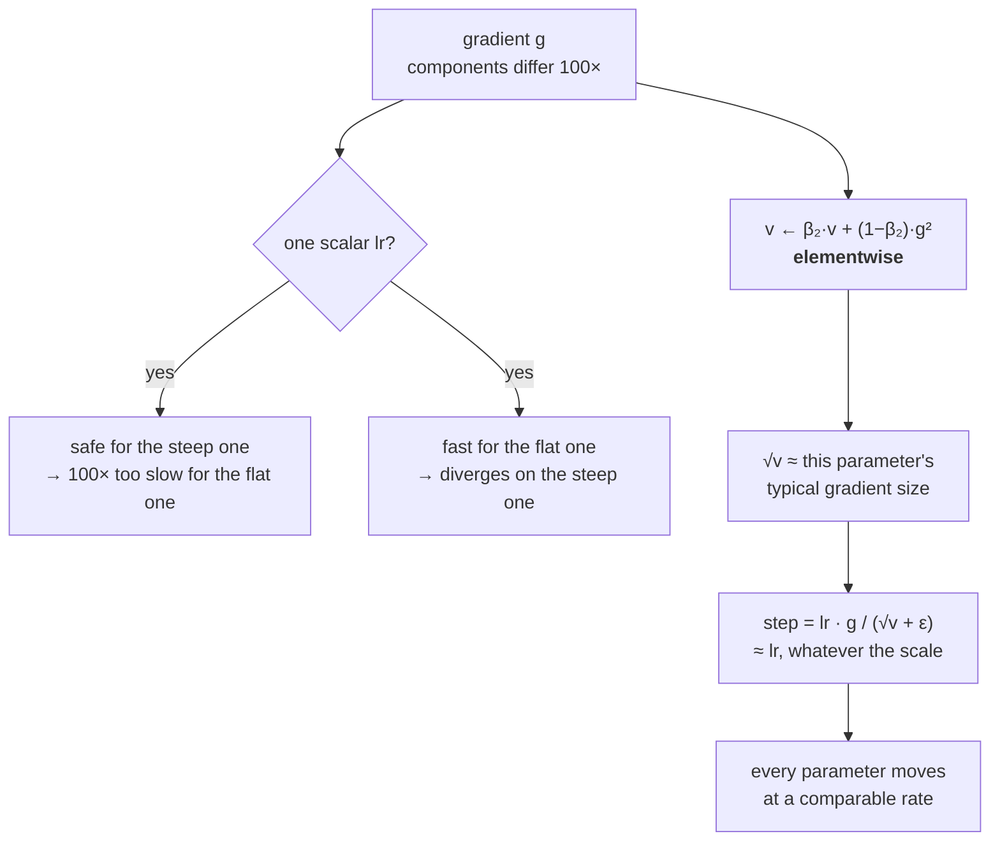

# 2.1 — One learning rate cannot fit every parameter

## One-line answer

When two parameters' gradients differ by a factor of a hundred, no single step size serves both — so
the fix is to give each parameter its own scale, estimated from the size of *its own* recent gradients,
which is the idea underneath every optimizer used to train a transformer.

---

## The story

Somebody waters three plants with one hose on one setting: a money plant, a cactus and a small lemon
tree.

Set it for the money plant, which drinks constantly, and the cactus rots inside a month. Set it for
the cactus, and the money plant is brown by the second week. Split the difference and you lose both,
just more slowly.

The problem is not the amount of water, and it is not bad judgement. It is one dial for three plants
whose needs are ten times apart from each other, and any single number you pick is wrong for at least
two of them.

The fix is not a better setting. It is a separate dial per pot — or, more practically, a way of
noticing how fast each pot dries out and watering each one to match. You do not have to know anything
about cacti to do that. You only have to know that this pot dried out fast last week and that one did
not.
---

## The idea in plain language

Part [1.3](../01-gradient-descent/1.3-the-learning-rate.md) established the bound `lr < 2/L`, where `L`
is the **largest** curvature across every direction. Part [1.1](../01-gradient-descent/1.1-the-loss-surface.md)
established that curvatures in a real model differ enormously. Put those together and the problem is
stated:

> The learning rate is bounded by the most sensitive parameter in the model, and applied to all of
> them.

On the surface used throughout this day — curvatures `[1, 100]` — the gradient at `w = [1, 1]` is
`[1, 100]`. A step size of `0.5` would be ideal for the first coordinate and catastrophic for the
second. A step size of `0.01` is safe for the second and a hundred times too small for the first. There
is no value that is right for both, and momentum improves the situation without removing it.

The idea that removes it is simple to state: **divide each parameter's step by a measure of how large
its own gradients have been.** If a parameter consistently receives large gradients, its steps are
divided by a large number; if it receives small ones, by a small number. The result is that every
parameter moves at a comparable *relative* rate regardless of its gradient scale.

The measure used is the **root mean square** of recent gradients, kept as a running average:

> `v ← β₂·v + (1 − β₂)·g²`
> `w ← w − lr · g / (√v + ε)`

Three pieces:

- **`g²` is elementwise.** Each parameter accumulates the squares of *its own* gradients, so `v` is a
  per-parameter quantity with the same shape as `w`.
- **`√v` is roughly the typical magnitude of that parameter's gradient.** Dividing by it makes the
  step approximately `lr` in size, whatever the gradient's scale — so `lr` stops meaning "how much
  gradient to apply" and starts meaning "how far to move".
- **`ε` prevents a division by zero** for a parameter whose gradients have all been zero, and it also
  quietly caps how large the step can become for a parameter with vanishingly small gradients. It is
  usually `1e-8`, and part [2.2](2.2-adam.md) explains why it sits *outside* the square root.

This is **RMSProp**, and the family it belongs to starts with **AdaGrad**, which used a plain sum of
squared gradients rather than a decaying average. AdaGrad's sum only ever grows, so its steps only ever
shrink — which is correct for a convex problem and fatal for a long non-convex one, where the effective
learning rate reaches zero long before training is finished. **Replacing the sum with a decaying
average is the fix, and it is the only difference.**

What this buys, and what it does not:

- It buys **scale invariance per parameter**. Multiply one parameter's gradients by 1000 and its
  updates are unchanged, because `√v` scales by 1000 too.
- It does **not** buy a solution to the curvature problem in general. Curvature is about the second
  derivative; this uses the first. It is a cheap approximation that happens to work extremely well in
  practice, and being honest that it *is* an approximation is what stops you from being surprised when
  it does not.

---

## Why Akshara needs it

- **Part [2.2](2.2-adam.md)** is Adam, which is exactly this plus momentum from part
  [1.5](../01-gradient-descent/1.5-momentum.md). Everything below is half of Adam.
- **Day 35** builds the transformer block, whose parameters — embeddings, attention projections, layer
  norm gains, the output head — receive gradients of wildly different scale by construction. Plain SGD
  on a transformer is not a tuning inconvenience; it is a different research problem.
- **Day 25**'s first training loop needs an optimizer whose learning rate does not have to be
  re-tuned every time the architecture changes, and this is the property that provides it.
- **Part [2.4](2.4-the-optimizers-memory.md)** counts what `v` costs: one more full-size buffer per
  parameter tensor.
- **Day 88**'s instruction tuning updates a pretrained model whose parameter gradient scales are far
  more varied than at initialisation, which is where per-parameter scaling stops being a convenience.

---

## The mechanism

The problem, stated in one printout:

```python
import numpy as np

A = np.array([1.0, 100.0])                     # (2,)  curvatures
g = lambda w: A * w                            # (2,)

w = np.array([1.0, 1.0])
print("  grad at w=[1,1]:", g(w))
print("  a step suiting axis 0 (lr=0.5) moves axis 1 by", 0.5 * g(w)[1])
print("  a step suiting axis 1 (lr=0.01) moves axis 0 by", 0.01 * g(w)[0])
```

**Line by line:**
- `w = [1, 1]` puts both parameters the **same distance** from their optimum, so any difference in the
  gradient is entirely due to curvature rather than position. That isolation is the point of the
  example.
- `0.5` is the ideal step for the first coordinate (`1/L₀ = 1/1`); `0.01` is a safe step for the second
  (`1/L₁ = 1/100`).
- Measured on Intel Core i3-1115G4 (2 cores / 4 threads), 11.7 GB RAM, Windows 11, CPython 3.12.12,
  numpy 2.5.2, on 2026-08-26:

```text
  grad at w=[1,1]: [  1. 100.]
  a step suiting axis 0 (lr=0.5) moves axis 1 by 50.0
  a step suiting axis 1 (lr=0.01) moves axis 0 by 0.01
```

**A step of 50 for a parameter that needs to move by 1.** And in the other direction, a step of `0.01`
for a parameter that needs to move by `1` — a hundred steps to cover the ground the other coordinate
covers in one. That is the whole problem, and it does not get better with a cleverer scalar.

The fix, implemented:

```python
def rmsprop(lr, steps=200, beta2=0.999, eps=1e-8):
    w = np.array([1.0, 1.0])                   # (2,)
    v = np.zeros(2)                            # (2,)  per-parameter squared-gradient average
    for _ in range(steps):
        grad = g(w)                            # (2,)
        v = beta2 * v + (1 - beta2) * grad ** 2          # (2,)  elementwise
        w = w - lr * grad / (np.sqrt(v) + eps)           # (2,)  divided per parameter
    return w
```

**Line by line:**
- `grad ** 2` is **elementwise**, so `v[0]` accumulates only parameter 0's gradients and `v[1]` only
  parameter 1's. Writing `np.sum(grad ** 2)` instead — a single scalar — would give every parameter the
  same divisor and reproduce exactly the problem this is fixing. **That is the most common way to get
  this wrong.**
- `(1 - beta2) * grad ** 2` is the *averaging* convention from part
  [1.5](../01-gradient-descent/1.5-momentum.md), not the accumulating one. It matters here: with this
  form `v` converges to the mean squared gradient itself, so `√v` is directly interpretable as "the
  typical magnitude of this parameter's gradient". With the accumulating form it would converge to
  `1000×` that, and `lr` would have to absorb the difference.
- `beta2 = 0.999` gives a memory of `1/(1 − 0.999) = 1000` steps. **The second moment is deliberately
  much slower than the first**: it is estimating a scale, and a scale estimate should be stable rather
  than responsive. Part [2.3](2.3-bias-correction.md) is what that long memory costs at the start.
- `np.sqrt(v) + eps` — the `ε` is added **after** the square root, so it is directly comparable to the
  gradient magnitude. Adding it inside would make it comparable to the *squared* magnitude, and `1e-8`
  inside a square root is `1e-4` outside, which is four orders of magnitude larger than intended.
- `lr * grad / (√v + ε)` — for a parameter whose gradients are consistently of size `s`, `√v ≈ s` and
  the step is about `lr`. **The step size stops depending on the gradient scale**, which is the
  property being bought.

Both, side by side, on the same surface:

```python
for kind, lr in (("gd", 0.019), ("rmsprop", 0.01)):
    w = rmsprop(lr) if kind == "rmsprop" else gd(lr)
    print(f"  {kind:8} lr={lr:<6}: final f={0.5 * np.sum(A * w ** 2):.6e}  w={w}")
```

**Line by line:**
- `lr = 0.019` for gradient descent is just under its stability bound of `0.02` — the best it can
  legally do. Comparing against a handicapped baseline would be dishonest.
- `lr = 0.01` for RMSProp is **not** bounded by `2/L`, because the division has removed the dependence
  on curvature scale. That is why the two can use different rates and the comparison is still fair:
  each is near its own best.
- Measured on this machine, 2026-08-26, 200 steps from `w = [1, 1]`:

```text
  gd       lr=0.019: final f=2.325803e-04  w=[2.15675829e-02 7.05507911e-10]
  rmsprop  lr=0.01 : final f=1.202282e-44  w=[1.54300469e-23 1.54296967e-23]
```

**Look at the two coordinates of the RMSProp result.** `1.5430e-23` and `1.5430e-23` — identical to
five significant figures. The two parameters, whose gradients differ by a factor of a hundred, are
converging at **exactly the same rate**. That is what per-parameter scaling does, and it is why the
final loss is forty orders of magnitude below gradient descent's.



---

## Shapes

| Tensor | Symbolic shape | Concrete here | What each axis means |
| --- | --- | --- | --- |
| `w` | `(P,)` | `(2,)` | the parameters |
| `g` | `(P,)` | `(2,)` | the gradient — same shape |
| `v` (second moment) | `(P,)` | `(2,)` | **per-parameter**, same shape as `w` — the whole point |
| `np.sum(g ** 2)` | `()` | scalar | the **wrong** thing — one divisor for all parameters |
| `lr`, `beta2`, `eps` | `()` | scalars | three numbers for the entire model |
| a real model's `v` | `(P,)` | `(124000000,)` | 496 MB in `float32` |

Rows three and four are the same expression written two ways, and only one of them works. **If `v` is
not the same shape as `w`, this is not per-parameter scaling** — it is a global gradient-norm
normalisation, which is a different (and also useful) technique that does not solve this problem.

---

## When it breaks

The loud one, from `v` accumulated as a scalar:

```console
>>> import numpy as np
>>> w = np.array([1.0, 1.0]); v = 0.0
>>> g = np.array([1.0, 100.0])
>>> v = 0.999 * v + 0.001 * np.sum(g ** 2)
>>> v
10.001
>>> w - 0.01 * g / (np.sqrt(v) + 1e-8)
array([0.99683788, 0.68378805])
>>> 0.01 * g / (np.sqrt(v) + 1e-8)           # the two step sizes
array([0.00316212, 0.31621195])
```

Verbatim on this machine, 2026-08-26. **No error** — `v` is a scalar, the division broadcasts, and the
answer has the right shape. But look at the two step sizes: `0.00316` and `0.316`, still a factor of a
hundred apart. **The code runs, the shapes are right, and the technique has been switched off.** The
symptom is that it behaves like SGD with an oddly-scaled learning rate, which is exactly what it now
is.

**The silent version is `ε` in the wrong place:**

```console
>>> v = np.array([1e-12, 1e-12])
>>> 0.01 * 1.0 / (np.sqrt(v) + 1e-8)         # eps outside — correct
array([9900.99009901, 9900.99009901])
>>> 0.01 * 1.0 / np.sqrt(v + 1e-8)           # eps inside — wrong
array([99.99500037, 99.99500037])
```

Verbatim on this machine, 2026-08-26. A factor of **ninety-nine** between the two placements, from
moving one parenthesis. Neither errors, both produce finite plausible numbers, and the difference only appears
for parameters whose gradients have been very small — which is a minority of parameters, so the run
trains and merely trains differently. **`1e-8` inside a square root is `1e-4` outside**, and that is
the whole discrepancy.

The check:

```python
def assert_per_parameter_state(state, params):
    """Optimizer state must be per-parameter. A scalar or a wrong shape silently disables scaling."""
    for name, p in params.items():
        for key in ("v", "m"):
            if key not in state[name]:
                continue
            s = state[name][key]
            if np.ndim(s) == 0 or s.shape != p.shape:
                raise ValueError(
                    f"{name}.{key}: state shape {np.shape(s)} != param shape {p.shape} — "
                    "this broadcasts and turns per-parameter scaling into a global scalar"
                )
```

**Line by line:**
- `np.ndim(s) == 0` catches the scalar case explicitly, because a scalar broadcasts against everything
  and would pass a naive compatibility check.
- `s.shape != p.shape` is exact-tuple equality, for the reason part
  [1.1](../01-gradient-descent/1.1-the-loss-surface.md) gave: broadcast-compatible-but-different is
  precisely the bug.
- The message names the *consequence* — "turns per-parameter scaling into a global scalar" — rather
  than only the shapes, because the shapes alone do not tell a reader why they should care.
- Run it once, after the optimizer is constructed. The shapes do not change during training, so there
  is no reason to pay for this every step.

---

## In production

**What a research engineer writes instead of the teaching version.** They use Adam or AdamW and never
write RMSProp — but the reason this part exists separately is that **the second moment is the half of
Adam that does the heavy lifting**, and people who learn Adam as one opaque formula cannot reason about
it. Someone who has this part can answer questions the formula alone cannot: why Adam's learning rate
is roughly architecture-independent (because the division removed the gradient scale), why Adam needs a
much smaller `lr` than SGD (because `lr` is now a distance rather than a gradient multiplier), and why
Adam sometimes generalises slightly worse than well-tuned SGD (because it has thrown away gradient
magnitude information that carried a useful signal).

The historical line is worth carrying too, because it is short and each step fixed one thing: AdaGrad
accumulated squared gradients forever and its steps decayed to nothing; RMSProp replaced the sum with a
decaying average and fixed that; Adam added momentum and bias correction. **Three ideas, in order, each
one a repair of the last.**

**What degrades at scale.** Memory, and it is the dominant cost — `v` is a full-size buffer, so
per-parameter scaling costs 4 bytes per parameter in `float32`, on top of the parameter and its
gradient. Part [2.4](2.4-the-optimizers-memory.md) is that arithmetic, and it is the reason
memory-efficient optimizer variants exist at all.

**The failure that only shows with real data.** Parameters that receive **zero** gradient for long
stretches — a rare token's embedding row, an expert in a mixture-of-experts model that the router stops
selecting. Their `v` decays toward zero, so `√v + ε` approaches `ε`, and the next non-zero gradient they
receive produces a step of about `lr · g / ε` — enormous. **A quadratic with dense gradients cannot
reproduce this**; it needs sparse real data, and it is why sparse-aware optimizer variants exist.

**The review comment.** *"`v = beta2 * v + (1 - beta2) * (g ** 2).sum()` — the `.sum()` makes this a
global scalar. Drop it; `v` must have the parameter's shape."*

**The interview question.** *"Why does Adam use a different learning rate from SGD?"* The weak answer is
"Adam is adaptive". The strong answer is what the division does: the step is `lr · g / √v`, and `√v` is
an estimate of that parameter's own gradient magnitude, so the ratio is roughly unit-sized and `lr`
becomes a *distance in parameter space* rather than a multiplier on the gradient. That is why Adam's
useful range clusters around `1e-4` to `1e-3` almost regardless of architecture, where SGD's depends
entirely on the gradient scale. The follow-up that shows real use: *and it is why Adam's learning rate
transfers between models far better than SGD's — the thing that varied has been divided out.*

**Compute tier: T0.** Two parameters on a laptop, on a surface whose exact optimum is known, so the
40-orders-of-magnitude gap between the two optimizers is a verifiable fact rather than an impression.
What T0 cannot show is the case that actually motivated these methods — a model whose parameter groups
differ in gradient scale for *architectural* reasons rather than because a curvature was written down.
**Day 35 is the first model with that structure**, and this part is the vocabulary for it.

---

## Check yourself

Run this. It prints **two parameters converging at identical rates despite gradients that differ by a
hundred**:

```python
import numpy as np

A = np.array([1.0, 100.0])
f = lambda w: 0.5 * np.sum(A * w ** 2)

w = np.array([1.0, 1.0])
print("  gradient at [1,1]:", A * w)

w, v = np.array([1.0, 1.0]), np.zeros(2)
for _ in range(200):
    g = A * w
    v = 0.999 * v + 0.001 * g ** 2
    w = w - 0.01 * g / (np.sqrt(v) + 1e-8)
print("  rmsprop after 200 steps:", w, " f =", f(w))

w = np.array([1.0, 1.0])
for _ in range(200):
    w = w - 0.019 * (A * w)
print("  gd      after 200 steps:", w, " f =", f(w))
```

**Line by line:**
- The gradient line prints `[1. 100.]`. **Say out loud what a single learning rate has to do with those
  two numbers.**
- RMSProp prints `[1.54300469e-23 1.54296967e-23]` — the two coordinates agreeing to five figures.
  Gradient descent prints `[2.16e-02, 7.06e-10]` — seven orders of magnitude apart.
- Now replace `g ** 2` with `np.sum(g ** 2)` and re-run. **Predict first** what the two coordinates
  will look like, then check.

**Say this out loud, without scrolling up:** say what `√v` is estimating, say why it is computed
elementwise, and say what happens to the meaning of `lr` once you divide by it.
