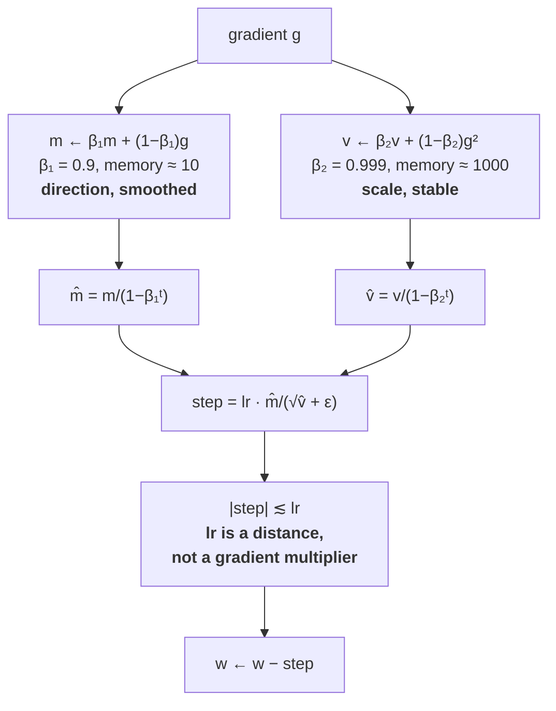

# 2.2 — Adam: momentum and per-parameter scale together

## One-line answer

Adam keeps two running averages per parameter — the gradient itself and its square — and steps along
the first divided by the square root of the second, which is momentum from part 1.5 and per-parameter
scaling from part 2.1 in the same five lines.

---

## The story

Somebody is riding a bicycle down an unfamiliar road at night, and they have two things to go on.

The first is a settled sense of direction. Not "which way did that gust just push me", which changes
every second and is useless — but "which way have I actually been heading for the last minute or so".

The second is their memory of how rough the road has been over the last few hundred metres. Not which
way it slopes: how **bumpy** it is. On smooth tarmac that memory is quiet, and they let the bike run.
On broken ground it is loud, and they slow down — without needing to know the first thing about why
the ground is broken.

Neither of those tells them where they are going. Put together, they let the rider go fast on the
smooth stretches and carefully on the rough ones, with one hand on one brake lever, and never have to
decide in advance what kind of road is coming.
---

## The idea in plain language

Part [1.5](../01-gradient-descent/1.5-momentum.md) built a running average of the gradient. Part
[2.1](2.1-one-learning-rate-is-not-enough.md) built a running average of the gradient *squared*. Adam
keeps both and divides one by the square root of the other:

> `m ← β₁·m + (1 − β₁)·g` — the **first moment**: which way, averaged
> `v ← β₂·v + (1 − β₂)·g²` — the **second moment**: how big, averaged
> `m̂ ← m / (1 − β₁ᵗ)`, `v̂ ← v / (1 − β₂ᵗ)` — bias correction, part [2.3](2.3-bias-correction.md)
> `w ← w − lr · m̂ / (√v̂ + ε)`

That is the entire algorithm. The name is from "adaptive moment estimation", and the paper is
**arXiv:1412.6980**, *Adam: A Method for Stochastic Optimization*, whose abstract describes the method
as "based on adaptive estimates of lower-order moments" — the first moment being the mean and the second
the uncentred variance.

Three things about the shape of it are worth saying explicitly.

**Both moments use the averaging convention**, `β·x + (1 − β)·new`, not the accumulating one. Part
[1.5](../01-gradient-descent/1.5-momentum.md) flagged the two conventions and why they matter; here it
means `m` converges to the mean gradient itself and `v` to the mean squared gradient, so their
interpretations are direct and `lr` is not secretly multiplied by `1/(1 − β)`.

**The two `β`s are deliberately different.** `β₁ = 0.9` gives the first moment a memory of about 10
steps — it should be responsive, because direction changes matter. `β₂ = 0.999` gives the second a
memory of about 1000 — it should be stable, because it is estimating a *scale*, and a scale estimate
that jumps around makes the step size jump around. **Those two numbers are the defaults every
framework ships**, and they are conventions rather than derivations — part
[1.3](../01-gradient-descent/1.3-the-learning-rate.md)'s advice applies: sweep them if the run
misbehaves, do not treat them as physics.

> `TODO(verify)` — this document confirmed the paper's *title* and its abstract's description of the
> method by opening `https://arxiv.org/abs/1412.6980` on 2026-08-26. **The abstract does not state
> default hyperparameter values**, so `β₁ = 0.9`, `β₂ = 0.999` and `ε = 1e-8` are quoted here as the
> framework defaults, not as the paper's. To attribute them, read the paper body:
> `curl -sL https://arxiv.org/abs/1412.6980` and find the section that states the defaults.


**The step size is bounded.** Because `m` and `√v` are averages of the same quantity, their ratio is
roughly `±1` for any parameter whose gradients are consistent, so the step is roughly `±lr`. That is a
genuinely useful property: **`lr` is an upper bound on how far any parameter moves in one step**,
regardless of how large its gradient is. It is also why a gradient spike hurts Adam much less than it
hurts SGD — the spike inflates `v` at the same time as `m`.

And the property this buys, which is why Adam is the default for transformers: the learning rate stops
depending on the model. With SGD, changing the width, the depth or the initialisation changes the
gradient scale and therefore the right `lr`. With Adam, that scale has been divided out, so a rate that
worked for one configuration usually works for the next.

---

## Why Akshara needs it

- **Day 25** trains Akshara for the first time and uses this optimizer. Every training day after it
  does too.
- **Part [2.3](2.3-bias-correction.md)** is the two lines above that have not yet been justified, and
  they matter most in exactly the first steps of a run.
- **Part [2.4](2.4-the-optimizers-memory.md)** counts what `m` and `v` cost: two full-size buffers per
  parameter, which doubles the memory of the model plus its gradients.
- **Part [2.5](2.5-adamw.md)** changes one line of this to get AdamW, which is what Akshara will
  actually use.
- **Day 90**'s LoRA fine-tuning is attractive partly *because* of part 2.4's arithmetic: fewer trainable
  parameters means far less optimizer state, and the optimizer state is the dominant term.

---

## The mechanism

The whole optimizer, in the form you will write on Day 25:

```python
import numpy as np

def adam_step(w, g, m, v, t, lr=1e-3, b1=0.9, b2=0.999, eps=1e-8):
    """One Adam step. Returns the new parameter and the new state, all the same shape as w."""
    m = b1 * m + (1 - b1) * g                     # (P,)  first moment: direction
    v = b2 * v + (1 - b2) * g ** 2                # (P,)  second moment: scale
    m_hat = m / (1 - b1 ** t)                     # (P,)  part 2.3
    v_hat = v / (1 - b2 ** t)                     # (P,)  part 2.3
    w = w - lr * m_hat / (np.sqrt(v_hat) + eps)   # (P,)
    return w, m, v
```

**Line by line:**
- `m` and `v` are **returned, not mutated in place**, so this function is easy to test — but a real
  implementation updates them in place to avoid allocating two full-size tensors per parameter per
  step. Part [2.4](2.4-the-optimizers-memory.md) is why that allocation would matter.
- `g ** 2` is elementwise, for the reason part [2.1](2.1-one-learning-rate-is-not-enough.md) laboured:
  a `.sum()` here silently converts per-parameter scaling into a global scalar.
- `t` is the **step count, starting at 1**. Starting it at 0 makes `1 - b1**0 = 0` and the bias
  correction divides by zero. This is the single most common bug in a hand-written Adam.
- `np.sqrt(v_hat) + eps` — `ε` outside the root, for the factor-of-ninety-nine reason part 2.1
  measured.
- **The store order matters**: `m` and `v` are updated *before* the correction, and the correction is
  applied to a temporary. Writing `m = m / (1 - b1 ** t)` would corrupt the state, because the
  correction would then be applied again — compounding — at every subsequent step.
- `lr = 1e-3` is the framework default. **It is a default, not a measurement**, and it is roughly three
  orders of magnitude below where SGD lives for the same models — because part 2.1's division changed
  what `lr` means, from a gradient multiplier to a distance.

The comparison, on part 1.1's surface:

```python
A = np.array([1.0, 100.0])
f = lambda w: 0.5 * np.sum(A * w ** 2)

def run(kind, lr, steps=200):
    w, m, v = np.array([1.0, 1.0]), np.zeros(2), np.zeros(2)
    for t in range(1, steps + 1):
        g = A * w                                  # (2,)
        if kind == "gd":
            w = w - lr * g
        elif kind == "rmsprop":
            v = 0.999 * v + 0.001 * g ** 2
            w = w - lr * g / (np.sqrt(v) + 1e-8)
        else:
            w, m, v = adam_step(w, g, m, v, t, lr=lr)
    return w, f(w)
```

**Line by line:**
- All three start from the same `w = [1, 1]` and run the same number of steps, so the comparison is a
  comparison.
- Each is given a learning rate near its own best rather than a shared one — `0.019` is just under
  gradient descent's stability bound of `2/L = 0.02`, and the adaptive methods are not bounded by `L`
  at all. **Handicapping the baseline would make the result meaningless.**
- Measured on Intel Core i3-1115G4 (2 cores / 4 threads), 11.7 GB RAM, Windows 11, CPython 3.12.12,
  numpy 2.5.2, on 2026-08-26, 200 steps from `w = [1, 1]`:

```text
  gd       lr=0.019: final f=2.325803e-04  w=[2.15675829e-02 7.05507911e-10]
  rmsprop  lr=0.01 : final f=1.202282e-44  w=[1.54300469e-23 1.54296967e-23]
  adam     lr=0.01 : final f=1.224636e-02  w=[0.01557249 0.01557248]
  adam     lr=0.1  : final f=2.631006e-09  w=[-7.21800100e-06 -7.21797225e-06]
```

**Adam at `lr = 0.01` is worse than plain RMSProp, and worse than gradient descent.** That is not a
typo and it is the honest result on this surface: `f = 1.2e-02` against RMSProp's `1.2e-44`. Adam at
`lr = 0.1` reaches `2.6e-09`.

Two things explain it, and both are worth carrying.

**Adam's `lr` is a distance, so `0.01` here is a small distance.** With the bound-step property above,
each parameter moves at most about `lr` per step; from `w = 1.0`, reaching `1e-6` needs on the order of
`1/lr` steps just to cover the ground. At `lr = 0.01` that is a hundred steps of *pure travel* before
convergence can even begin, out of two hundred.

**Momentum with a 10-step memory overshoots on a surface this clean.** RMSProp has no first moment, so
it never carries a stale direction; on a noiseless quadratic that is an advantage. **Adam's momentum is
insurance against gradient noise, and this surface has none.** Day 25's minibatches are where it starts
paying for itself, and this measurement is a useful corrective to the idea that Adam is simply better
than everything.

Look at the two coordinates in both adaptive rows: `1.54300469e-23` and `1.54296967e-23`;
`-7.21800100e-06` and `-7.21797225e-06`. **Agreeing to five and six significant figures respectively,
for parameters whose gradients differ by a factor of a hundred.** That is the per-parameter scaling
working, and it is what neither gradient descent nor momentum can do.



Why the step is bounded by roughly `lr`, since that is the property that makes Adam's learning rate
transferable:

```python
for scale in (1e-6, 1.0, 1e6):
    m, v = 0.0, 0.0
    for t in range(1, 201):
        g = scale                                  # a constant gradient of this magnitude
        m = 0.9 * m + 0.1 * g
        v = 0.999 * v + 0.001 * g ** 2
        step = 1e-3 * (m / (1 - 0.9 ** t)) / (np.sqrt(v / (1 - 0.999 ** t)) + 1e-8)
    print(f"  gradient magnitude {scale:>8.0e}: final step = {step:.9f}")
```

**Line by line:**
- A **constant** gradient isolates the scale invariance: the only thing changing between the three runs
  is the magnitude, by twelve orders of magnitude in total.
- The step is computed with the bias correction applied, because without it the early steps are not yet
  at steady state — part [2.3](2.3-bias-correction.md).
- Measured on this machine, 2026-08-26:

```text
  gradient magnitude    1e-06: final step = 0.000990099
  gradient magnitude    1e+00: final step = 0.001000000
  gradient magnitude    1e+06: final step = 0.001000000
```

- **A gradient of `1` and a gradient of `1e6` produce exactly the same step.** That is the sentence to
  take away, and it is also the one that explains Adam's weakness: **the magnitude of the gradient has
  been thrown away**, and sometimes magnitude was information.
- The `1e-6` row is 1% short, and that is `ε` showing itself: `√v̂` is about `1e-6`, so the `+ 1e-8` in
  the denominator is no longer negligible — it is 1% of it. **`ε` is not only a divide-by-zero guard;
  it is a soft ceiling on the step for parameters whose gradients are very small**, and `1e-8` is where
  that ceiling starts to bite.

---

## Shapes

| Tensor | Symbolic shape | Concrete here | What each axis means |
| --- | --- | --- | --- |
| `w` | `(P,)` | `(2,)` | the parameters |
| `g` | `(P,)` | `(2,)` | the gradient — same shape, always |
| `m` (first moment) | `(P,)` | `(2,)` | one per parameter, initialised to zeros |
| `v` (second moment) | `(P,)` | `(2,)` | one per parameter, initialised to zeros |
| `t` | `()` | integer | the step count — **a scalar, shared, starting at 1** |
| `lr`, `b1`, `b2`, `eps` | `()` | scalars | four numbers for the entire model |
| a real model's `m` + `v` | `2 × (P,)` | `2 × (124000000,)` | 992 MB in `float32` — part 2.4 |

The `t` row is the only piece of Adam's state that is **not** per-parameter, and part
[2.6](2.6-the-optimizer-state-that-outlived-its-parameters.md) is what happens when it is
reset by mistake.

---

## When it breaks

The loud one, from `t` starting at zero:

```console
>>> import numpy as np
>>> t = 0
>>> m = np.array([1.0]) / (1 - 0.9 ** t)
RuntimeWarning: divide by zero encountered in divide
>>> m
array([inf])
```

Verbatim on this machine, 2026-08-26. `0.9 ** 0` is `1`, so the denominator is exactly `0`. Under this
repository's `filterwarnings = ["error::RuntimeWarning"]` this raises immediately, which is the correct
behaviour; in an ordinary program it warns once and puts `inf` into the first step, which then becomes
`nan` and poisons the model. **`t` starts at 1.**

**The silent version is the state being updated in the wrong order:**

```console
>>> m, v, t = 0.0, 0.0, 1
>>> g = 1.0
>>> m = 0.9 * m + 0.1 * g
>>> m = m / (1 - 0.9 ** t)          # WRONG: correction written back into the state
>>> m
1.0
>>> t = 2
>>> m = 0.9 * m + 0.1 * g
>>> m / (1 - 0.9 ** t)
5.263157894736845
```

Verbatim on this machine, 2026-08-26. The correct value at `t = 2` is `1.0` for a constant gradient —
the corrected first moment of a constant gradient is that constant, always. Writing the correction back
into `m` gives `5.26` instead: **more than five times too large**, and it compounds with every
subsequent step. Nothing raises; the
optimizer simply takes steps that are a few percent wrong and then a few percent more wrong, and the
run trains slightly badly forever.

The check, which catches both and one more:

```python
def assert_adam_state(m, v, t, w, name="param"):
    """Four invariants that hold for any correct Adam state."""
    if t < 1:
        raise ValueError(f"{name}: t={t} — Adam's step counter starts at 1, not 0")
    if m.shape != w.shape or v.shape != w.shape:
        raise ValueError(f"{name}: state shapes {m.shape}/{v.shape} != param shape {w.shape}")
    if np.any(v < 0):
        raise ValueError(f"{name}: v has negative entries — v is an average of squares")
    if not (np.all(np.isfinite(m)) and np.all(np.isfinite(v))):
        raise ValueError(f"{name}: non-finite optimizer state — the run diverged earlier than the loss")
```

**Line by line:**
- `t < 1` is the zero-denominator bug, named directly.
- The shape checks are part [2.1](2.1-one-learning-rate-is-not-enough.md)'s, applied to both buffers.
- `np.any(v < 0)` looks redundant — `v` is an average of squares — and it is exactly the check that
  catches a sign error or a corrupted load, because **there is no legitimate way for it to fire**. An
  invariant that cannot be violated by correct code is the most valuable kind of assertion.
- The finiteness check is the useful one in practice: **the optimizer state goes non-finite before the
  loss does**, because `v` accumulates squares and squares overflow at the square root of where the
  values do. It is an earlier warning than a `nan` loss, for free.

---

## In production

**What a research engineer writes instead of the teaching version.** `torch.optim.AdamW(...)` — part
[2.5](2.5-adamw.md) is the `W` — and they will never write the five lines. What they carry is the
shape of the update, because it answers questions that come up constantly: why is the learning rate
`3e-4` and not `0.1` (because `lr` is a distance now), why does a gradient spike hurt less than with
SGD (because `v` rises with `m`), why does the run need a warmup (because at small `t` the second
moment is estimated from very few samples), and why does optimizer state dominate the memory budget
(because there are two full-size buffers).

The implementation detail that matters at scale is **fusion**. A naive Adam performs about a dozen
elementwise operations per parameter per step, each reading and writing full-size tensors, so it is
entirely memory-bandwidth-bound. Framework implementations fuse them into one or two kernels and
process many tensors per launch, and the difference is a measurable fraction of step time for a large
model. **This is why `foreach` and `fused` flags exist on the optimizer**, and why they are worth
turning on.

**What degrades at scale.** Memory, decisively — part [2.4](2.4-the-optimizers-memory.md) is the whole
arithmetic. And a subtler thing: `β₂ = 0.999` means a memory of a thousand steps, which is a large
fraction of a *short* fine-tuning run and a negligible fraction of a long pretraining run. **The same
default means different things at different run lengths**, and short runs often want a smaller `β₂`.

**The failure that only shows with real data.** Sparse gradients. An embedding row for a rare token
receives a gradient only when that token appears. Between appearances `v` decays toward zero, so when
the gradient finally arrives the step is `lr · m̂/(√v̂ + ε)` with a very small `√v̂` — a much larger step
than intended. **A dense quadratic cannot show this**; it needs a real vocabulary with a real
distribution, and it is one of the reasons embedding layers sometimes get their own optimizer settings.

**The review comment.** *"`t` starts at 0 in this loop, so the first bias correction divides by zero.
And update `m` and `v` before correcting — the corrected values must not be written back into the
state."*

**The interview question.** *"What is Adam doing?"* The weak answer recites the formula. The strong
answer names the two ideas and what each fixes: the first moment is momentum, which cancels oscillation
and accumulates consistent directions; the second moment is a per-parameter estimate of gradient
magnitude, which makes the step size independent of gradient scale. Dividing one by the square root of
the other gives a step bounded by roughly `lr`, so the learning rate becomes a distance rather than a
gradient multiplier — which is why Adam's learning rate transfers across architectures where SGD's does
not. The follow-up that shows real use: *and the cost is two full-size state buffers, so Adam's memory
is roughly four times the parameter count in `fp32`; and it discards gradient magnitude, which is part
of why well-tuned SGD sometimes generalises slightly better.*

**Compute tier: T0.** Two parameters and a laptop, on a surface whose optimum is known — which is what
makes the "Adam is worse than RMSProp here" result trustworthy rather than a misconfiguration. What T0
cannot show is the thing Adam is actually for: **gradient noise**. A full-batch quadratic has none, so
this part demonstrates the scale-invariance half of Adam's value and can only assert the
variance-reduction half. **Day 25's minibatches are where the missing half appears**, and it is worth
re-running this comparison there.

---

## Check yourself

Run this. It prints **the same step size for gradients twelve orders of magnitude apart**:

```python
import numpy as np

for scale in (1e-6, 1.0, 1e6):
    m, v = 0.0, 0.0
    for t in range(1, 201):
        g = scale
        m = 0.9 * m + 0.1 * g
        v = 0.999 * v + 0.001 * g ** 2
        step = 1e-3 * (m / (1 - 0.9 ** t)) / (np.sqrt(v / (1 - 0.999 ** t)) + 1e-8)
    print(f"  gradient {scale:>8.0e}: step = {step:.9f}")

A = np.array([1.0, 100.0])
w, m, v = np.array([1.0, 1.0]), np.zeros(2), np.zeros(2)
for t in range(1, 201):
    g = A * w
    m = 0.9 * m + 0.1 * g
    v = 0.999 * v + 0.001 * g ** 2
    w = w - 0.1 * (m / (1 - 0.9 ** t)) / (np.sqrt(v / (1 - 0.999 ** t)) + 1e-8)
print("  adam after 200 steps:", w)
```

**Line by line:**
- The three step sizes print `0.000990099`, `0.001000000` and `0.001000000`. **Say out loud what the
  agreement between the last two means for how you choose a learning rate when you change the model's
  width — and what the first one's 1% shortfall is caused by.**
- The two coordinates print `-7.21800100e-06` and `-7.21797225e-06` — agreeing to six figures despite
  gradients a hundred apart.
- Now set `t = 1` for every step (never incrementing it) and re-run. **Predict first** whether the
  result gets better or worse, then check — and say which of the two moments the frozen `t` damages
  more.

**Say this out loud, without scrolling up:** write Adam's four lines from memory, say what each moment
is estimating, and say why its learning rate is roughly a thousand times smaller than SGD's for the
same model.
