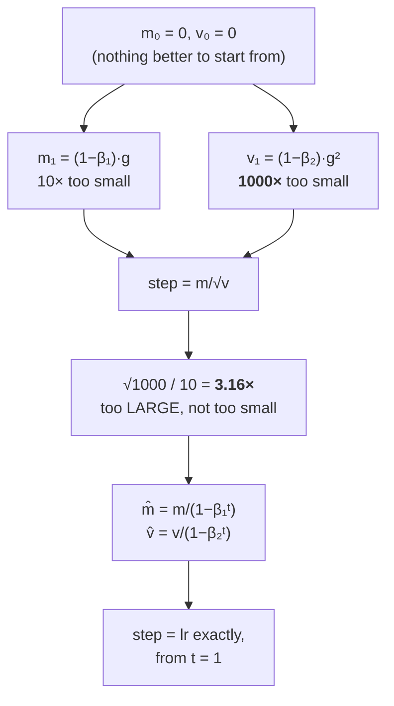

# 2.3 — Bias correction: the two lines everyone deletes

## One-line answer

Both of Adam's moments start at zero and are therefore biased toward zero, and because `β₂` is much
closer to 1 than `β₁` the *second* moment is biased far harder — so the uncorrected first step is about
**3.16× too large**, not too small, and the two correction lines exist to fix a bias in the ratio rather
than in either average.

---

## The story

You reset the "average fuel economy" reading on a car's dashboard and drive off.

For the first minute it shows numbers that are obviously nonsense — absurdly high, then absurdly low —
because it is averaging over a window it has barely begun to fill, and the empty part of that window
is being counted as zero.

Nobody worries about this. You know it will settle down within a few minutes, and it does.

Now imagine a second gauge on the same dashboard. It averages over a much longer window — a whole
tank's worth — and, unlike the first one, it is not there for you to look at. It quietly adjusts how
the engine runs.

How long is *that* one wrong for? And what exactly is the engine doing in the meantime?
---

## The idea in plain language

Part [2.2](2.2-adam.md) showed the two moments and the two lines that correct them:

> `m̂ ← m / (1 − β₁ᵗ)` and `v̂ ← v / (1 − β₂ᵗ)`

Here is where the bias comes from. Both `m` and `v` are initialised to **zero**, because there is
nothing better to initialise them to. At step 1 with a gradient `g`:

- `m₁ = 0.9 × 0 + 0.1 × g = 0.1·g` — a tenth of the true value.
- `v₁ = 0.999 × 0 + 0.001 × g² = 0.001·g²` — a **thousandth** of the true value.

Both are dragged toward zero by the initialisation, and the correction is the fraction of the window
that has actually been filled: after `t` steps of a constant gradient, `m` has reached `(1 − β₁ᵗ)·g`
exactly, so dividing by `(1 − β₁ᵗ)` recovers `g`. Same for `v`. **The correction is exact for a
constant gradient, which is what makes it a correction rather than a heuristic.**

Now the part that is almost always taught wrongly, and which this part exists for.

The intuition "the moments start small, so the first steps are too small" is **wrong**, because Adam
does not use either moment on its own — it uses the *ratio*. Work it out at `t = 1` with no correction:

> `step = lr · m₁ / √v₁ = lr · (0.1·g) / √(0.001·g²) = lr · 0.1·g / (0.0316·|g|) = lr · 3.162 · sign(g)`

**The uncorrected first step is 3.16 times too large.** The second moment is biased down by a factor of
1000 and the first by a factor of 10, and the square root turns `1000` into `31.6` — so the denominator
shrinks more than the numerator and the ratio grows. The correction divides that back out:
`(1/(1−β₁)) / √(1/(1−β₂)) = 10/31.62 = 0.316`, which is exactly the factor of `3.162` removed.

Three consequences worth carrying:

**The bias is in the ratio, not in either moment.** Which is why deleting *both* correction lines is
worse than a wash, and why deleting only one is far worse still — dropping just the `v̂` line multiplies
the first step by 31.6.

**It decays, but at the rate of the slower `β`.** `1/(1 − β₁ᵗ)` is within 0.003% of 1 by step 100.
`1/(1 − β₂ᵗ)` is still `10.5` at step 100 and `1.58` at step 1000. **The second moment's bias persists
for about a thousand steps**, which is negligible in a 100,000-step pretraining run and a large fraction
of a 500-step fine-tune.

**It interacts with warmup.** Both bias correction and a learning-rate warmup make the early steps
smaller than they would otherwise be, and they are solving different problems — correction fixes a
statistical artefact of the initialisation, warmup keeps `lr` under the stability bound while the
surface is at its worst. Having both is normal; assuming either one makes the other unnecessary is not.

---

## Why Akshara needs it

- **Day 25**'s training loop writes Adam, and these are the two lines most likely to be omitted or
  written in the wrong place.
- **Part [2.2](2.2-adam.md)** used `m̂` and `v̂` without justifying them. This is the justification.
- **Part [2.6](2.6-the-optimizer-state-that-outlived-its-parameters.md)** is what happens when `t` — the
  only shared piece of Adam's state — is reset while `m` and `v` are not, which is this part's
  machinery pointed at the wrong values.
- **Day 55** builds warmup, and the two are routinely confused; this part is what distinguishes them.
- **Day 90**'s fine-tuning runs are short enough that `β₂`'s thousand-step bias covers a large fraction
  of them, which is a real argument for lowering `β₂` on short runs.

---

## The mechanism

The correction factors, tabulated, because the asymmetry is the whole point:

```python
b1, b2 = 0.9, 0.999
for t in (1, 2, 10, 100, 1000, 10000):
    print(f"  t={t:>6}: 1/(1-b1^t)={1 / (1 - b1 ** t):.6f}   "
          f"1/(1-b2^t)={1 / (1 - b2 ** t):.6f}   sqrt of that={np.sqrt(1 / (1 - b2 ** t)):.6f}")
```

**Line by line:**
- The third column is the one that matters, because `v̂` enters the update **under a square root**. A
  factor of 1000 on `v` is a factor of 31.6 on the step, not 1000.
- Measured on Intel Core i3-1115G4 (2 cores / 4 threads), 11.7 GB RAM, Windows 11, CPython 3.12.12,
  numpy 2.5.2, on 2026-08-26:

```text
  t=     1: 1/(1-b1^t)=10.000000   1/(1-b2^t)=1000.000000   sqrt of that=31.622777
  t=     2: 1/(1-b1^t)=5.263158    1/(1-b2^t)=500.250125    sqrt of that=22.366272
  t=    10: 1/(1-b1^t)=1.535340    1/(1-b2^t)=100.450825    sqrt of that=10.022516
  t=   100: 1/(1-b1^t)=1.000027    1/(1-b2^t)=10.503335     sqrt of that=3.240885
  t=  1000: 1/(1-b1^t)=1.000000    1/(1-b2^t)=1.581516      sqrt of that=1.257584
  t= 10000: 1/(1-b1^t)=1.000000    1/(1-b2^t)=1.000045      sqrt of that=1.000023
```

**Read the two correction columns against each other.** At `t = 100` the first moment's correction is
`1.000027` — effectively finished — while the second's is still `3.24` under the square root. The first
moment's bias is gone in a hundred steps; **the second moment's is still a factor of 1.26 at step
1000.** They are not the same correction on a different scale; one has retired and the other is still
working.

The ratio, which is what Adam actually applies:

```python
for t in (1, 10, 100, 1000):
    ratio = (1 / (1 - b1 ** t)) / np.sqrt(1 / (1 - b2 ** t))
    print(f"  t={t:>5}: correction applied to the STEP = {ratio:.6f}  "
          f"(uncorrected step is {1 / ratio:.4f}x too large)")
```

**Line by line:**
- `(1/(1−β₁ᵗ)) / √(1/(1−β₂ᵗ))` is the net factor the two lines apply to the step, since one multiplies
  the numerator and the other divides the denominator.
- Measured on this machine, 2026-08-26: `0.316228` at `t = 1`, `0.153189` at `t = 10`, `0.308566` at
  `t = 100`, `0.795176` at `t = 1000` — so the uncorrected step is `3.16×`, `6.53×`, `3.24×` and
  `1.26×` too large at those four points.
- **The correction is not monotone.** It is `0.316` at step 1, dips to `0.153` around step 10, and
  climbs back toward 1. That is because the two moments' biases decay at very different rates and their
  ratio has a minimum in between. Nobody designs this shape; it falls out of `β₁ ≠ β₂`.

Both, on the surface from part 1.1:

```python
A = np.array([1.0, 100.0])
f = lambda w: 0.5 * np.sum(A * w ** 2)

for correct in (True, False):
    w, m, v = np.array([1.0, 1.0]), np.zeros(2), np.zeros(2)
    print(f"  bias correction = {correct}")
    for t in range(1, 6):
        g = A * w                                        # (2,)
        m = 0.9 * m + 0.1 * g                            # (2,)
        v = 0.999 * v + 0.001 * g ** 2                   # (2,)
        mh, vh = (m / (1 - 0.9 ** t), v / (1 - 0.999 ** t)) if correct else (m, v)
        step = 0.01 * mh / (np.sqrt(vh) + 1e-8)          # (2,)
        w = w - step
        print(f"    t={t}: |step|={np.abs(step)}  f={f(w):.6e}")
```

**Line by line:**
- The `if correct` is the **only** difference between the two runs — same seed-free deterministic
  surface, same `lr`, same `β`s, same starting point.
- `np.abs(step)` is printed rather than `step`, because the sign is the same in both and the magnitude
  is the finding.
- Measured on this machine, 2026-08-26:

```text
  bias correction = True
    t=1: |step|=[0.01 0.01]           f=4.949505e+01
    t=2: |step|=[0.009997 0.009997]   f=4.850047e+01
    t=3: |step|=[0.009993 0.009993]   f=4.751644e+01
    t=4: |step|=[0.009986 0.009986]   f=4.654312e+01
    t=5: |step|=[0.009978 0.009978]   f=4.558068e+01
  bias correction = False
    t=1: |step|=[0.031623 0.031623]   f=4.735660e+01
    t=2: |step|=[0.042455 0.042455]   f=4.329528e+01
    t=3: |step|=[0.049346 0.049346]   f=3.880353e+01
    t=4: |step|=[0.05404 0.05404]     f=3.416665e+01
    t=5: |step|=[0.057246 0.057246]   f=2.957639e+01
```

**With correction, the first step is exactly `0.01` — which is `lr`.** That is the property part 2.2
promised: the corrected step size is the learning rate, from step one, for any gradient magnitude.

**Without correction, the first step is `0.031623` — `3.162×` too large**, exactly the factor predicted
above, and it *grows* to `0.057` by step 5 as `v`'s underestimate deepens relative to `m`'s.

And now the honest complication, which is why this failure is silent rather than loud: **the
uncorrected run reached a lower loss.** `2.96e+01` against `4.56e+01` after five steps. Of course it
did — it took steps five times larger on a surface where larger steps were still safe. **The
uncorrected optimizer is not taking the steps you asked for**, and on this benign surface that happened
to help. On a surface where `3.16 × lr` is past part [1.3](../01-gradient-descent/1.3-the-learning-rate.md)'s
stability boundary, it is a divergence at step 1 that you will diagnose as a learning-rate problem.



---

## Shapes

| Tensor | Symbolic shape | Concrete here | What each axis means |
| --- | --- | --- | --- |
| `m`, `v` | `(P,)` | `(2,)` | per-parameter state |
| `m̂`, `v̂` | `(P,)` | `(2,)` | **temporaries** — never written back into `m` and `v` |
| `1 − β₁ᵗ` | `()` | scalar | the same correction for every parameter |
| `t` | `()` | integer ≥ 1 | **shared across the whole model** — the only non-per-parameter state |
| `step` | `(P,)` | `(2,)` | `≈ lr` in magnitude once corrected |

Row two is the one to enforce in code: **`m̂` and `v̂` are temporaries.** Part 2.2's silent failure was
exactly this — writing the correction back into the state, so it compounds. Row four is part
[2.6](2.6-the-optimizer-state-that-outlived-its-parameters.md)'s subject.

---

## When it breaks

The loud one, from `t = 0`:

```console
>>> import numpy as np
>>> t = 0
>>> 1 / (1 - 0.9 ** t)
Traceback (most recent call last):
  File "<stdin>", line 1, in <module>
ZeroDivisionError: float division by zero
>>> np.array([1.0]) / (1 - 0.9 ** t)
RuntimeWarning: divide by zero encountered in divide
array([inf])
```

Verbatim on this machine, 2026-08-26. **Note that the two lines behave differently**: plain Python
raises `ZeroDivisionError`, numpy warns and returns `inf`. So whether this bug is loud or silent depends
on whether your correction happens to be written in Python or numpy — and in numpy, under a default
warning filter, it puts `inf` into the first step and `nan` into every parameter one step later.

**The silent version is deleting the correction entirely:**

```console
>>> import numpy as np
>>> g = np.array([1.0]); m = np.zeros(1); v = np.zeros(1)
>>> m = 0.9 * m + 0.1 * g
>>> v = 0.999 * v + 0.001 * g ** 2
>>> 1e-3 * m / (np.sqrt(v) + 1e-8)                     # no correction
array([0.00316228])
>>> 1e-3 * (m / (1 - 0.9)) / (np.sqrt(v / (1 - 0.999)) + 1e-8)   # corrected
array([0.001])
```

Verbatim on this machine, 2026-08-26. Both are finite, both are small, both look like plausible Adam
steps. The uncorrected one is **3.16 times larger than the learning rate you configured** — so a run
with `lr = 3e-4` is actually taking `9.5e-4` steps for its first hundred, and if that crosses the
stability bound the run diverges immediately and you go looking at the learning rate, which is not
where the bug is.

The check, and it is a property test rather than a value test:

```python
def assert_bias_correction(lr=1e-3, b1=0.9, b2=0.999, eps=1e-8, atol=1e-9):
    """A correct Adam takes a step of exactly `lr` on the first step of a constant gradient."""
    for g in (1e-3, 1.0, 1e3):
        m = (1 - b1) * g
        v = (1 - b2) * g ** 2
        step = lr * (m / (1 - b1 ** 1)) / (np.sqrt(v / (1 - b2 ** 1)) + eps)
        if abs(step - lr) > atol + 1e-4 * lr:
            raise ValueError(f"first step is {step!r}, expected ~{lr} for gradient {g} — "
                             "bias correction is missing, misplaced, or applied to only one moment")
```

**Line by line:**
- Testing the **first** step is what makes this sharp: that is where the correction factor is largest
  (`3.162`) and where an omission is most visible. By step 1000 a missing correction is a 26% error,
  which is inside the range you might attribute to anything.
- Three gradient magnitudes across six orders of magnitude, because the corrected answer is `lr`
  **regardless of gradient scale** — that is part 2.2's bounded-step property, so a test that used one
  magnitude could pass on a coincidence.
- The tolerance has a relative term `1e-4 * lr` as well as an absolute one, per Day 7 part
  [1.3](../../../day-007-floating-point-and-logsumexp/parts/01-floating-point/1.3-the-gap-between-representable-numbers.md):
  the `+ eps` in the denominator makes the answer very slightly less than `lr`, and a strict equality
  check would fail on correct code.
- The error message lists **all three** ways to get it wrong — missing, misplaced, or applied to only
  one moment — because the symptom is identical and the fixes are different.

---

## In production

**What a research engineer writes instead of the teaching version.** Nothing — `torch.optim.Adam` has
the correction built in, and it is not optional. The reason to understand it anyway is that the two
lines are the first thing that gets omitted when someone writes a custom optimizer, a distributed
optimizer, or a sharded one, and the symptom of omitting them is *a learning rate that behaves
differently from the one in the config*. That is an expensive thing to debug from the outside.

The related production fact is **warmup**, and it is worth stating the relationship precisely, because
the two get conflated constantly. Bias correction fixes an artefact of initialising the moments to zero
and is exact for a constant gradient. Warmup keeps the learning rate below the stability bound while
the surface's curvature is at its highest, early in training. **They both shrink early steps and they
are not substitutes**: a correctly bias-corrected Adam still needs warmup on a transformer, and a
warmed-up Adam with the correction deleted still takes steps `3.16×` larger than configured on step 1.

**What degrades at scale.** Nothing about the correction itself — it is two scalar operations per step
for the whole model. What changes with scale is how much the `β₂` bias matters: **a thousand-step bias
is 1% of a 100,000-step pretraining run and 200% of a 500-step fine-tune.** Short runs are where this
is a live consideration, and lowering `β₂` for them is a legitimate response.

**The failure that only shows with real data.** Resumption. Checkpointing `m` and `v` but not `t` — or
restarting `t` at 1 on resume — reapplies the full correction to moments that are already at steady
state, which multiplies the first post-resume step by `1/0.316 = 3.16`. Part
[2.6](2.6-the-optimizer-state-that-outlived-its-parameters.md) measures it. **This cannot happen in a
run that never restarts**, and every real run restarts.

**The review comment.** *"`m_hat` is being written back into `m`. Keep the correction in a temporary —
otherwise it compounds every step. And `t` starts at 1."*

**The interview question.** *"What does Adam's bias correction do?"* The weak answer is "it fixes the
moments being initialised at zero, so early steps aren't too small". **The second half of that is
backwards, and saying so is the answer that stands out**: because `β₂ = 0.999` biases the second moment
by 1000 while `β₁ = 0.9` biases the first by only 10, and the second enters under a square root, the
uncorrected first step is `√1000/10 = 3.16` times *too large*. The correction makes the first step
exactly `lr`. The follow-up that shows real use: *and the `β₂` correction is still a factor of 1.26 at
step 1000, so it matters on short fine-tunes in a way it does not on long pretraining runs.*

**Compute tier: T0.** Scalar arithmetic on a laptop; the `3.162` is `√(1/(1−β₂)) / (1/(1−β₁))` computed
exactly, so it is derived and then confirmed rather than observed and generalised. Every number here
reproduces on any machine. What T0 cannot show is the case where the `3.16×` first step actually breaks
something, since that needs a surface whose stability bound the inflated step crosses — **the mechanism
is provable here and the consequence is Day 25's**.

---

## Check yourself

Run this. It prints **a first step of exactly `lr`, and the same step 3.16× too large with two lines
removed**:

```python
import numpy as np

lr, b1, b2, eps = 1e-3, 0.9, 0.999, 1e-8
g = np.array([1.0])
m = (1 - b1) * g
v = (1 - b2) * g ** 2

print("  uncorrected first step:", lr * m / (np.sqrt(v) + eps))
print("  corrected   first step:", lr * (m / (1 - b1)) / (np.sqrt(v / (1 - b2)) + eps))
print("  predicted ratio sqrt(1/(1-b2))/(1/(1-b1)):", np.sqrt(1 / (1 - b2)) / (1 / (1 - b1)))

for t in (1, 10, 100, 1000):
    print(f"  t={t:>5}: v-correction under the root = {np.sqrt(1 / (1 - b2 ** t)):.6f}")
```

**Line by line:**
- The uncorrected step prints `[0.00316228]` and the corrected one prints `[0.001]`. **The second is
  the learning rate you configured; the first is not.**
- The predicted ratio prints `3.1622776601683773`, matching the two step sizes. It was computed from
  `β₁` and `β₂` alone, with no gradient in it — **the inflation does not depend on the data.**
- The four `t` rows print `31.622777`, `10.022516`, `3.240885`, `1.257584`. Say out loud how many steps
  it takes for the second moment's correction to reach within 1% of 1 — and compare that to the length
  of a fine-tuning run.
- Now delete only the `v̂` line and re-run. **Predict the first step before you look**, from the table.

**Say this out loud, without scrolling up:** say why both moments are biased toward zero, say which one
is biased harder and why, and say whether the uncorrected first step is too large or too small — with
the factor.
