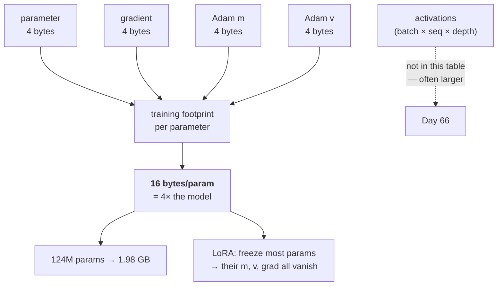

# 2.4 — The optimizer's memory

## One-line answer

Adam stores two extra full-size buffers per parameter, so training costs **16 bytes per parameter** in
`float32` against SGD's 8 — the optimizer, not the model, is usually the largest single item in a
training memory budget, and this arithmetic is what decides whether a model fits on the hardware you
have.

---

## The story

You lay your clothes out on the bed for a week away, look at the pile, look at the small suitcase, and
decide the small one will do.

On the morning of the trip, the case is full before the shoes go in.

Nobody measured the packing. Everything gets folded, the fragile things get wrapped, the shoes go in a
bag of their own, and there are corners you simply cannot fill. The clothes really are exactly the
size you judged them to be — and the *packed* clothes are a bit over twice that, because a thing in
transit is not the same size as a thing lying flat on a bed.

People who travel a lot book on the packed size, which is why their cases look too big and why they
are never the ones sitting on a suitcase at midnight. The judgement that went wrong was not wrong
about the clothes. It was answering a different question from the one that actually mattered.
---

## The idea in plain language

Day 2 part
[1.2](../../../day-002-tensors-shape-stride/parts/01-what-a-tensor-is/1.2-dtype-the-width-of-a-number.md)
established that a tensor's memory is `elements × bytes-per-element`, and pointed forward to this part
for the optimizer's share. Here it is.

Every optimizer in this day keeps some state **per parameter**, with the same shape as the parameter:

- **SGD** keeps nothing. Just the parameter and its gradient.
- **SGD with momentum** keeps one buffer: the velocity `v` from part
  [1.5](../01-gradient-descent/1.5-momentum.md).
- **Adam and AdamW** keep two: `m` and `v` from part [2.2](2.2-adam.md).

So the bill per parameter, in `float32`, is:

| Optimizer | parameter | gradient | state | **total** |
| --- | --- | --- | --- | --- |
| SGD | 4 | 4 | 0 | **8 bytes** |
| SGD + momentum | 4 | 4 | 4 | **12 bytes** |
| Adam / AdamW | 4 | 4 | 8 | **16 bytes** |

**Adam doubles the cost of training relative to plain SGD**, and the model itself — the thing everyone
quotes when they say "a 124-million-parameter model" — is only a quarter of it.

Three things this table does not include, and each matters:

**Activations.** The forward pass stores intermediate values so the backward pass can use them, and for
a deep model with a long sequence these often exceed everything in the table. They scale with batch
size and sequence length rather than with parameter count, which is why *batch size* is the knob people
reach for when a run does not fit. Day 66 is that arithmetic.

**Mixed precision does not shrink this table at all.** Day 7 part
[1.5](../../../day-007-floating-point-and-logsumexp/parts/01-floating-point/1.5-mixed-precision.md)
measured why the `float32` master weights cannot be dropped. So a mixed-precision Adam holds a 4-byte
master weight, a 2-byte working copy, a 2-byte gradient, and — in the common arrangement — `m` and `v`
in `float32`: `4 + 2 + 2 + 8 = 16` bytes per parameter, **exactly the same total as the `fp32` case**,
because the two bytes saved on the gradient are spent on the working copy. **The saving is in the
activations, which this table does not count.**

**Transient allocations.** An optimizer written as `m = b1 * m + (1 - b1) * g` allocates a new
full-size tensor for the result before rebinding the name. Do that for both moments and you have
transiently allocated two extra full-size buffers at peak — which is why real implementations use
in-place operations and why a memory error can appear in the optimizer step of a model that fits
everywhere else.

The consequence worth internalising: **the question "will this model fit?" is never answered by the
parameter count.** It is answered by parameter count × bytes-per-parameter-for-this-optimizer, plus
activations, plus overhead — and getting the first term wrong by a factor of four is the most common
way the estimate fails.

---

## Why Akshara needs it

- **Day 66** sizes Akshara against a free notebook GPU's actual VRAM. That calculation is this table
  times the parameter count, plus activations, and the answer decides the model's width and depth.
- **Day 2 part [1.2](../../../day-002-tensors-shape-stride/parts/01-what-a-tensor-is/1.2-dtype-the-width-of-a-number.md)**
  and part
  [1.4](../../../day-002-tensors-shape-stride/parts/01-what-a-tensor-is/1.4-device-where-the-bytes-live.md)
  both pointed here for the optimizer's share of the memory equation. This is it.
- **Day 90**'s LoRA fine-tuning trains a small number of adapter parameters and freezes the rest —
  which removes the optimizer state for every frozen parameter. **That saving is the main reason LoRA
  fits where full fine-tuning does not**, and it is this table that says so.
- **Days 78–85** quantize the *weights*, which reduces the first column and leaves the optimizer state
  alone — so quantization helps inference far more than it helps training, and this table is why.
- **`docs/RUNS.md`** wants a hardware line on every run, and "did it fit" is only reproducible if the
  arithmetic that predicted it is written down.

---

## The mechanism

The table, computed rather than quoted:

```python
P = 124_000_000                                   # parameters
BYTES = {"fp32": 4, "fp16": 2, "bf16": 2}

rows = [("SGD", 0), ("SGD+momentum", 1), ("Adam / AdamW", 2)]
for name, buffers in rows:
    per_param = 4 + 4 + buffers * 4               # param + grad + state, all fp32
    print(f"  {name:14}: 4 + 4 + {buffers * 4:>2} = {per_param:>2} bytes/param  "
          f"-> {P * per_param / 1e9:.3f} GB at {P / 1e6:.0f}M params")
```

**Line by line:**
- `4 + 4 + buffers * 4` is the three terms named separately rather than as a single constant, because
  **which term you can shrink is a different question for each**: the gradient can be freed after the
  step, the state cannot, and the parameter is the model.
- `buffers` is the count of full-size state tensors — 0, 1, 2 — which is the only thing that varies
  between optimizers. **Everything else in this arithmetic is the same for all of them.**
- `P = 124_000_000` is a size chosen to be concrete, and it is *chosen*, not measured — it is a
  round-ish figure for a small transformer, and every conclusion below is a multiplication that you
  should redo with your own `P`.
- `/1e9` reports gigabytes as `10⁹` bytes rather than `2³⁰`. **Say which you mean**: the two differ by
  7%, which is enough to turn a fits into a does-not-fit at the margin.
- Measured on Intel Core i3-1115G4 (2 cores / 4 threads), 11.7 GB RAM, Windows 11, CPython 3.12.12,
  numpy 2.5.2, on 2026-08-26:

```text
  SGD           : 4 + 4 +  0 =  8 bytes/param  -> 0.992 GB at 124M params
  SGD+momentum  : 4 + 4 +  4 = 12 bytes/param  -> 1.488 GB at 124M params
  Adam / AdamW  : 4 + 4 +  8 = 16 bytes/param  -> 1.984 GB at 124M params
```

**Two gigabytes to train a model whose weights are half a gigabyte.** The weights are `124e6 × 4 =
0.496 GB`; the training footprint is four times that, and three quarters of it is machinery that is
thrown away when training ends.

The mixed-precision version, because the intuition "16-bit halves it" is wrong:

```python
def training_bytes_per_param(optimizer_buffers, mixed_precision):
    """Bytes per parameter for one training step, excluding activations."""
    if not mixed_precision:
        return 4 + 4 + 4 * optimizer_buffers          # master, grad, state — all fp32
    return 4 + 2 + 2 + 4 * optimizer_buffers          # fp32 master + fp16 working + fp16 grad + fp32 state

for name, b in (("SGD", 0), ("SGD+momentum", 1), ("Adam / AdamW", 2)):
    full = training_bytes_per_param(b, False)
    mixed = training_bytes_per_param(b, True)
    print(f"  {name:14}: fp32 {full:>2} B/param   mixed {mixed:>2} B/param   "
          f"change {mixed - full:+d}")
```

**Line by line:**
- The mixed-precision line is `4 + 2 + 2 + 4·buffers`: the `float32` master weight **stays** (Day 7 part
  1.5 measured why), a 2-byte working copy is added, the gradient shrinks to 2 bytes, and the optimizer
  state stays `float32` in the common arrangement.
- **The `4` for the master weight is the term people delete when they reason about this**, and deleting
  it is what produces the "mixed precision halves memory" claim.
- Measured on this machine, 2026-08-26: SGD `8 → 8` (`+0`), SGD+momentum `12 → 12` (`+0`), Adam
  `16 → 16` (`+0`).
- **Mixed precision changes this table by exactly nothing.** The `4 + 2 + 2` of master, working copy
  and narrow gradient is the same eight bytes as the `4 + 4` it replaces. It is still the right choice,
  because activations — which this table excludes — *do* halve and they usually dominate. But the
  parameter-side saving that people assume is there is not, and being able to say so is the difference
  between a memory estimate that holds and one that does not.



What LoRA buys, since it is the clearest application of this table:

```python
P_total, P_trainable = 124_000_000, 1_000_000     # a small adapter on a frozen backbone
frozen = P_total - P_trainable
full_ft = P_total * 16                            # every parameter trained with Adam
lora = frozen * 4 + P_trainable * 16              # frozen: weights only; trainable: full Adam
print(f"  full fine-tune : {full_ft / 1e9:.3f} GB")
print(f"  LoRA-style     : {lora / 1e9:.3f} GB   ({full_ft / lora:.2f}x less)")
```

**Line by line:**
- `frozen * 4` — a frozen parameter costs only its own weight. **No gradient, no `m`, no `v`**, because
  nothing is computed for it and nothing is stored.
- `P_trainable = 1_000_000` is an illustrative adapter size, chosen for the arithmetic. Day 90 derives
  a real one from the rank and the layer shapes; **do not carry this number forward as a fact.**
- Measured on this machine, 2026-08-26: `1.984 GB` full against `0.508 GB` LoRA-style — **3.91× less**.
- Note where the saving comes from: the frozen weights still cost `0.492 GB` and cannot be avoided. The
  entire `1.476 GB` saving is **gradients and optimizer state that no longer exist.** That is why LoRA
  is a memory technique before it is anything else.

The transient allocation, which is the term nobody counts:

```python
import numpy as np

w = np.zeros(1_000_000, dtype=np.float32)         # (P,)
m = np.zeros_like(w)                              # (P,)
g = np.ones_like(w)                               # (P,)
print("  each buffer:", w.nbytes / 1e6, "MB")

m_new = 0.9 * m + 0.1 * g                         # allocates TWO temporaries, then a third
print("  out-of-place `m = 0.9*m + 0.1*g` peaks at ~3 extra buffers")

m *= 0.9                                          # in place
m += 0.1 * g                                      # one temporary for 0.1*g
print("  in-place version peaks at ~1 extra buffer")
```

**Line by line:**
- `0.9 * m` allocates a full-size temporary; `0.1 * g` allocates another; their sum allocates a third.
  Only then is the name `m_new` bound. **Peak memory during that one line is about four full-size
  buffers where the algorithm needs two.**
- `m *= 0.9` writes into `m`'s existing storage — Day 2 part
  [1.5](../../../day-002-tensors-shape-stride/parts/01-what-a-tensor-is/1.5-the-view-that-changed-the-original.md)
  is what in-place means and when it bites.
- `m += 0.1 * g` still allocates one temporary for `0.1 * g`. Removing even that needs a fused kernel,
  which is what the framework's `foreach`/`fused` optimizer implementations provide.
- Measured on this machine, 2026-08-26: each buffer is `4.0 MB` at `P = 1e6`. **Scaled to 124M
  parameters that is 496 MB per transient**, which is the difference between a run that fits and an
  out-of-memory error that appears only during the optimizer step.

---

## Shapes

| Tensor | Symbolic shape | Concrete here | What each axis means |
| --- | --- | --- | --- |
| `w` | `(P,)` | `(124000000,)` | the model — `496 MB` in `fp32` |
| `g` | `(P,)` | `(124000000,)` | same shape — another `496 MB` |
| `m` | `(P,)` | `(124000000,)` | Adam's first moment — another `496 MB` |
| `v` | `(P,)` | `(124000000,)` | Adam's second moment — another `496 MB` |
| a transient `0.9 * m` | `(P,)` | `(124000000,)` | **496 MB that exists for one line** |
| activations | `(B, T, C, layers)` | not in this table | scales with batch and sequence, not with `P` |

Every row except the last has **exactly the same shape**, which is the structural fact behind the whole
table: optimizer state is not "some overhead", it is `k` more copies of the model, and `k` is decided
entirely by which optimizer you chose.

---

## When it breaks

The loud one, and it arrives at the optimizer step rather than the forward pass:

```console
>>> import numpy as np
>>> big = np.zeros(20_000_000_000, dtype=np.float32)
Traceback (most recent call last):
  File "<stdin>", line 1, in <module>
numpy._core._exceptions.MemoryError: Unable to allocate 74.5 GiB for an array with shape (20000000000,) and data type float32
```

Verbatim on this machine (11.7 GB RAM), 2026-08-26 — and note that `2_000_000_000` floats, 8 GB,
*did* allocate here, because the operating system hands out pages lazily and `np.zeros` never touches
them. **A successful allocation is not proof the memory exists**, which is its own trap on a machine
with swap. The equivalent on a GPU is a CUDA
out-of-memory error, and the important detail is **when** it arrives: the model loaded, the forward
pass ran, the backward pass ran, and it failed allocating `m` or `v`. So the natural conclusion — "the
model is too big" — is wrong by a factor of four, and the natural fix — shrink the model — is the
expensive one when switching optimizer or freezing parameters would have done it.

**The silent version is an estimate that was never checked:**

```console
>>> P = 124_000_000
>>> P * 4 / 1e9                  # "the model is 0.5 GB, it'll be fine on a 4 GB card"
0.496
>>> P * 16 / 1e9                 # what training actually costs, before activations
1.984
```

Verbatim on this machine, 2026-08-26. Nothing errors, because nothing ran. **The estimate was made,
believed, and was wrong by 4×** — and the failure only appears hours later at the point of allocation,
usually on rented or time-limited hardware. Day 66's free GPU session is exactly that situation.

The check, which belongs in the run's startup path:

```python
def training_memory_report(param_counts, optimizer="adam", dtype_bytes=4, mixed=False):
    """Print the memory bill BEFORE allocating anything. Excludes activations - say so."""
    buffers = {"sgd": 0, "momentum": 1, "adam": 2, "adamw": 2}[optimizer]
    per = (4 + 2 + 2 + 4 * buffers) if mixed else (dtype_bytes * (2 + buffers))
    total_p = sum(param_counts.values())
      print(f"  optimizer={optimizer} mixed={mixed}: {per} bytes/param")
    for name, n in sorted(param_counts.items(), key=lambda kv: -kv[1])[:5]:
        print(f"    {name:24} {n:>12,}  {n * per / 1e9:.3f} GB")
    print(f"  TOTAL {total_p:,} params -> {total_p * per / 1e9:.3f} GB "
          f"(weights+grads+state only; activations NOT included)")
    return total_p * per
```

**Line by line:**
- It runs **before** allocation, from the parameter counts alone, which is the only time the number is
  useful. A memory report produced after the allocation succeeded tells you nothing you did not already
  know.
- The per-parameter breakdown by tensor, sorted descending, is what makes it actionable: it usually
  reveals that one or two tensors — the embedding and the output head — dominate, and those are the
  ones worth attacking (by tying them, by shrinking the vocabulary) rather than the hundred small ones.
- **The message says activations are not included, in capitals**, because a memory report that silently
  omits the largest term is worse than no report — it converts an unknown into a confident wrong
  answer.
- `mixed` implements the `4 + 2 + 2 + 4·buffers` arrangement above rather than halving everything,
  which is the mistake this function exists to prevent.

---

## In production

**What a research engineer writes instead of the teaching version.** They keep the number `16 bytes per
parameter for Adam in fp32` in their head and do the multiplication before opening an editor. It is
the single most useful piece of arithmetic in training infrastructure: parameter count → training
footprint → which hardware → what batch size is left over for activations.

When the number does not fit, the levers are, roughly in order of what they cost you:

- **Freeze parameters** (LoRA and friends) — removes gradient *and* state for everything frozen. Best
  ratio, and Day 90.
- **Shard the optimizer state across devices** — the state is per-parameter and never needed all at
  once on one device, which is what makes this possible; it costs communication.
- **Keep the optimizer state in a narrower dtype** — halves the `8` down to `4`, at some quality cost
  that has to be measured rather than assumed.
- **Use a lower-state optimizer** — momentum instead of Adam saves 4 bytes per parameter and usually
  costs convergence speed on a transformer.
- **Shrink the model.** Last, because it changes what you are building.

**What degrades at scale.** The table is linear in `P`, so nothing degrades — it simply gets large.
What *does* change qualitatively is that above a certain size the state no longer fits on one device at
all, and the sharding option stops being an optimisation and becomes a requirement. **The arithmetic
that was a sanity check at 124M is an architecture decision at 10B.**

**The failure that only shows with real data.** Activations, which this whole part has excluded. They
scale with `batch × sequence × depth` rather than with `P`, so a memory budget validated at `T = 128`
fails at `T = 2048` with the identical model and the identical optimizer. **Nothing in this table
changes and the run stops fitting**, which is why the report above has to say what it is not counting.

**The review comment.** *"The memory estimate uses `params × 4`. Adam is `params × 16` — plus
activations. Re-run the sizing before we book the instance."*

**The interview question.** *"How much memory does it take to train a 7-billion-parameter model?"* The
weak answer multiplies by 2 or 4 for the weights. The strong answer builds it up: in `fp32` with Adam
it is 16 bytes per parameter — 4 for the weight, 4 for the gradient, 8 for the two moments — so **112
GB before activations**, which does not fit on any single accelerator, which is why optimizer-state
sharding exists. Then the qualification that shows you have done it: *mixed precision does not reduce
that number at all — the `fp32` master weight has to stay, so `4 + 2 + 2` is the same eight bytes as
`4 + 4`, and the saving is entirely in activations; freezing most of the parameters is the biggest
single lever, because a frozen parameter costs its weight and nothing else.*

**Compute tier: T0.** Multiplication on a laptop, and the `numpy._core._exceptions._ArrayMemoryError`
above is a genuine allocation failure on this machine's 11.7 GB. Every figure here is arithmetic from
the byte counts Day 2 part 1.2 established, so it is exact rather than measured — **which is the point:
this is a calculation you do instead of an experiment you run**, and the experiment costs a GPU session
to fail. Day 66 is where the prediction gets tested against real hardware.

---

## Check yourself

Run this. It prints **a model that is four times bigger to train than to store**:

```python
P = 124_000_000
for name, buffers in (("SGD", 0), ("SGD+momentum", 1), ("Adam / AdamW", 2)):
    per = 4 + 4 + buffers * 4
    print(f"  {name:14}: {per:>2} bytes/param -> {P * per / 1e9:.3f} GB")

print("  weights alone :", P * 4 / 1e9, "GB")

frozen, trainable = P - 1_000_000, 1_000_000
print("  LoRA-style    :", (frozen * 4 + trainable * 16) / 1e9, "GB")
```

**Line by line:**
- The three rows print `0.992`, `1.488` and `1.984` GB. The weights-alone line prints `0.496`.
  **Adam's row is exactly four times it.**
- The LoRA line prints `0.508` GB. Say out loud where the `1.476 GB` saving came from — and note that
  it is **not** the weights, which are still there.
- Now redo the Adam row for a 7-billion-parameter model, in your head, and say whether it fits on a
  card with 80 GB.

**Say this out loud, without scrolling up:** give the bytes per parameter for SGD, momentum and Adam,
say which term mixed precision *adds* rather than removes, and name the one term this whole table
leaves out.
