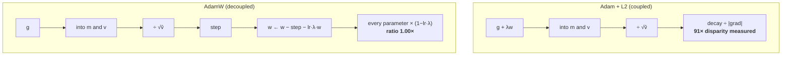

# 2.5 — AdamW: why weight decay is not L2

## One-line answer

Adding `λ·w` to the gradient and then dividing by `√v` means the decay each parameter receives is
divided by its own gradient magnitude — measured here, parameters shrank by 9.09% and 0.10%, a **91×
disparity** — while applying the decay outside the division gives both exactly 0.475%, which is what
AdamW does and what "weight decay" was always supposed to mean.

---

## The story

A family decides that everybody's pocket money is being cut by 10%.

It sounds perfectly fair, and it is announced to everybody in exactly the same words. But it gets put
through the system the family already uses, which hands out money in proportion to how much each
person spent last month.

The effect is that the one who spends a lot has the cut divided by a big number and barely feels it.
The one who spends very little has the same cut divided by a small number and loses a third of their
money.

Everybody got "a 10% cut", applied to everybody identically. What was not identical was the formula it
went through — and the formula is where the rule actually lives.

A year later, somebody asks why one of them never has any money. The rule was fair. The rule was
applied consistently. And the outcome was a difference of ninety to one that nobody chose and nobody
ever wrote down.
---

## The idea in plain language

**Weight decay** is the practice of shrinking every parameter slightly toward zero on every step. It is
a regulariser: it prevents weights from growing without bound, and in practice it improves
generalisation. Written directly, it is one line:

> `w ← w − lr·(step) − lr·λ·w`

**L2 regularisation** is the practice of adding `½λ‖w‖²` to the loss. Differentiate it and you get an
extra `λ·w` in the gradient:

> `g ← g + λ·w`, then the usual update.

For plain gradient descent these are **the same thing**. Substitute the second into `w ← w − lr·g` and
you get `w ← w − lr·g − lr·λ·w`, which is the first. That equivalence is why the two names have been
used interchangeably for decades, and every framework's Adam has a parameter called `weight_decay`
that implements the second one.

**For Adam they are not the same thing**, and the reason is one line of part [2.2](2.2-adam.md):

> `w ← w − lr · m̂ / (√v̂ + ε)`

The whole numerator is divided by `√v̂`. So if `λ·w` was folded into the gradient, it goes into `m`, and
it comes out divided by that parameter's own gradient magnitude. **A parameter with large gradients has
its decay divided by a large number and barely decays. A parameter with small gradients has its decay
divided by a small number and decays hard.** The regulariser has been silently made
gradient-dependent — which is the opposite of what a regulariser is for.

**AdamW** — from **arXiv:1711.05101**, *Decoupled Weight Decay Regularization* — moves the decay
outside the division:

> `w ← w − lr · m̂/(√v̂ + ε) − lr·λ·w`

The paper's abstract states the problem precisely: "L₂ regularization and weight decay regularization
are equivalent for standard stochastic gradient descent (when rescaled by the learning rate)", but this
equivalence does not hold for adaptive algorithms like Adam, and "many implementations misleadingly
call L₂ regularization weight decay". Its claimed benefits are that the decay setting becomes
independent of the learning rate, and that Adam's generalisation improves to match SGD with momentum.

Two properties of the decoupled form worth naming:

**The decay is uniform and predictable.** Every parameter is multiplied by `(1 − lr·λ)` per step,
regardless of its gradient. A parameter receiving no gradient at all shrinks by exactly that factor,
which makes the effect computable in advance.

**`λ` and `lr` are separable.** In the coupled form, changing `lr` changes how much decay is applied
relative to the gradient step, so the two hyperparameters cannot be tuned independently. Decoupling
does not fully remove the coupling — `lr·λ` is still the per-step factor — but it makes it explicit and
one multiplication rather than an interaction hidden inside `√v̂`.

---

## Why Akshara needs it

- **Day 25** and every training day after it use AdamW rather than Adam. This part is why.
- **Part [2.2](2.2-adam.md)** built Adam; this changes exactly one line of it, and the one-line diff is
  worth being able to write from memory.
- **Day 55** tunes `λ` alongside the learning rate and the schedule, and the decoupled form is what
  makes that tuning interpretable.
- **Day 88**'s instruction tuning and **Day 90**'s LoRA both apply weight decay selectively — normally
  *not* to biases and layer-norm parameters — and the reason that exclusion matters is this part's
  arithmetic.
- **Day 115**'s eval work compares checkpoints, and a regulariser whose strength varied per parameter
  by 91× is a confound that no eval can separate out afterwards.

---

## The mechanism

A surface with a **non-zero optimum**, so that decay and the data term genuinely compete:

```python
import numpy as np

A = np.array([1.0, 100.0])                        # (2,)  curvatures — condition number 100
C = np.array([1.0, 1.0])                          # (2,)  the optimum, away from the origin
f = lambda w: 0.5 * np.sum(A * (w - C) ** 2)      # ()
g = lambda w: A * (w - C)                         # (2,)

def run(kind, lr=0.01, wd=0.1, steps=3000, b1=0.9, b2=0.999, eps=1e-8):
    w, m, v = np.zeros(2), np.zeros(2), np.zeros(2)
    for t in range(1, steps + 1):
        grad = g(w) + (wd * w if kind == "adam_l2" else 0.0)     # (2,)  L2 folded in
        m = b1 * m + (1 - b1) * grad                             # (2,)
        v = b2 * v + (1 - b2) * grad ** 2                        # (2,)
        step = lr * (m / (1 - b1 ** t)) / (np.sqrt(v / (1 - b2 ** t)) + eps)   # (2,)
        w = w - step - (lr * wd * w if kind == "adamw" else 0.0) # (2,)  decay applied outside
    return w
```

**Line by line:**
- `C = [1, 1]` puts the data-fit optimum **away from the origin**, which is essential: on a surface
  whose optimum is already at zero, weight decay and the data term pull the same way and the difference
  between the two schemes is invisible. **The choice of test surface is what makes this measurable.**
- `grad = g(w) + wd * w` for `adam_l2` is L2 regularisation done the standard way: differentiate
  `½λ‖w‖²` and add the result to the gradient. **From here the `λ·w` term is indistinguishable from a
  real gradient**, which is the entire problem.
- `w - step - lr * wd * w` for `adamw` applies the decay to `w` directly, **after** the division by
  `√v̂` has already happened to the gradient step. That subtraction is the whole of the `W`.
- `wd = 0.1` and `lr = 0.01` give a per-step shrink factor of `1 − 0.001 = 0.999`, which over 3000
  steps is a meaningful but not overwhelming pull. Both are **chosen** values, not measurements.
- `steps = 3000` is long enough for both schemes to reach their equilibrium, which is what is being
  compared — the *converged* parameters, not the path.
- Measured on Intel Core i3-1115G4 (2 cores / 4 threads), 11.7 GB RAM, Windows 11, CPython 3.12.12,
  numpy 2.5.2, on 2026-08-26:

```text
  adam    : w = [1.000000, 1.000000]   f = 0.000000e+00   |w| = 1.414214
  adam_l2 : w = [0.909091, 0.999001]   f = 4.182132e-03   |w| = 1.350722
  adamw   : w = [0.995254, 0.995254]   f = 1.137448e-03   |w| = 1.407502
```

Plain Adam lands exactly on the optimum `[1, 1]`, as it should — no regulariser. Then the two
regularised runs, and the difference is stark once you look at *how much each coordinate moved*:

```python
res = {kind: run(kind) for kind in ("adam", "adam_l2", "adamw")}
for kind in ("adam_l2", "adamw"):
    shrink = (res["adam"] - res[kind]) / res["adam"]                 # (2,)
    print(f"  {kind:8}: param0 shrunk {shrink[0] * 100:6.3f}%   "
          f"param1 shrunk {shrink[1] * 100:6.3f}%   ratio {shrink[0] / shrink[1]:.2f}x")
```

**Line by line:**
- The shrink is measured **relative to unregularised Adam's answer**, which is the correct baseline:
  the question is "how far did the regulariser pull this parameter away from where it wanted to be",
  and that needs the unregularised destination.
- `shrink[0] / shrink[1]` is the disparity — for a regulariser applied with a single `λ` to both
  parameters, **this ratio should be 1**.
- Measured on this machine, 2026-08-26:

```text
  adam_l2 : param0 shrunk  9.091%   param1 shrunk  0.100%   ratio 91.00x
  adamw   : param0 shrunk  0.475%   param1 shrunk  0.475%   ratio  1.00x
```

**91 to 1.** One `λ`, two parameters, and the L2-in-Adam form applied ninety-one times more decay to
one of them than the other. AdamW applied `0.475%` to both — identical to three decimal places, because
the decay never touched the division.

The mechanism, at a single point, so it is not a mystery:

```python
w, wd = np.array([0.5, 0.5]), 0.1
grad = g(w)                                        # (2,)
print("  data gradient   :", grad)
print("  L2 term wd*w    :", wd * w, " (identical for both parameters)")
print("  sqrt(v) ~ |grad|:", np.abs(grad))
print("  decay each param actually feels, = wd*w / |grad|:")
print("    param0:", wd * w[0] / abs(grad[0]), "  param1:", wd * w[1] / abs(grad[1]))
```

**Line by line:**
- `w = [0.5, 0.5]` — both parameters at the same value, so the `λ·w` term is **identical** for both.
  Any difference in what they experience comes entirely from the division.
- `√v ≈ |grad|` because `v` is a running average of `grad²` — so at steady state the denominator is
  approximately the gradient magnitude, which is what part [2.1](2.1-one-learning-rate-is-not-enough.md)
  established.
- Measured on this machine, 2026-08-26: gradients `[-0.5, -50.0]`, an L2 term of `[0.05, 0.05]` for
  both, and effective decays of **`0.1` and `0.001`** — a factor of a hundred, from a term that was
  identical before the division.
- **The parameter with the larger gradient gets less decay.** In a real model the large-gradient
  parameters are often exactly the ones you most want regularised.

Why the coupled form's answer is not arbitrary, which is worth knowing so you can predict it:

```python
print("  SGD+L2 analytic equilibrium  w_i = a_i*c_i/(a_i + wd):", A * C / (A + wd))
```

**Line by line:**
- Setting `a(w − c) + λw = 0` and solving gives `w = a·c/(a + λ)`. This is where L2 puts the answer,
  for *any* optimizer that follows the gradient to a fixed point.
- Measured on this machine, 2026-08-26: `[0.90909091, 0.999001]` — **exactly** the `adam_l2` row above.
- So the fixed point is the same as SGD's, and the disparity was already present in SGD+L2: L2 shrinks
  low-curvature parameters more. What Adam adds is that it **also** makes the *path* gradient-dependent
  while leaving that fixed point in place. **AdamW's decoupled form deliberately moves the fixed point**
  to one where the shrink is uniform, which is a different — and, the paper argues, better — regulariser
  rather than a bug fix to the same one.

And what the decoupled decay does in isolation, which is the property that makes it predictable:

```python
lr, wd = 0.01, 0.1
print("  per-step shrink factor (1 - lr*wd) =", 1 - lr * wd)
for steps in (1, 100, 500, 1000):
    print(f"    a parameter with zero gradient, after {steps:>4} steps -> {(1 - lr * wd) ** steps:.6f}")
```

**Line by line:**
- A parameter receiving **zero** gradient is the clean case: AdamW's step term is zero, so only the
  decay acts, and the result is pure exponential shrinkage.
- Measured on this machine, 2026-08-26: factor `0.999` per step, giving `0.904792` after 100 steps,
  `0.606379` after 500, `0.367695` after 1000.
- **You can compute this before the run.** With L2-in-Adam you cannot, because the answer depends on
  the gradient history of the parameter in question.



---

## Shapes

| Tensor | Symbolic shape | Concrete here | What each axis means |
| --- | --- | --- | --- |
| `w` | `(P,)` | `(2,)` | the parameters |
| `g(w)` | `(P,)` | `(2,)` | the data gradient |
| `wd * w` | `(P,)` | `(2,)` | the decay term — **same shape, elementwise** |
| `step` | `(P,)` | `(2,)` | the Adam step, before decay |
| `lr * wd * w` | `(P,)` | `(2,)` | the decoupled decay — subtracted **after** `step` |
| `wd` | `()` | `0.1` | one scalar for the whole model — usually excluding biases and norms |

The last row's parenthetical is the practical detail: in real models `wd` is applied to weight matrices
and **not** to biases or layer-norm gains, because those have few parameters, are not a capacity
concern, and shrinking a layer-norm gain toward zero actively harms the model. Framework optimizers
support this through parameter groups.

---

## When it breaks

The loud one, from decaying parameters that should not be decayed:

```console
>>> import numpy as np
>>> gain = np.ones(768)                     # a layer-norm gain, initialised to 1
>>> for _ in range(10000):
...     gain = gain * (1 - 0.001)           # AdamW decay, zero gradient
>>> gain[:3]
array([4.5173346e-05, 4.5173346e-05, 4.5173346e-05])
```

Verbatim on this machine, 2026-08-26. A layer-norm gain that started at `1.0` is now `4.5e-05`, which
scales its layer's output to nothing. **Nothing errored**, but the model has been quietly disabled, and
this is why every real configuration excludes norm parameters and biases from weight decay.

**The silent version is the one this part is about:**

```console
>>> A = np.array([1.0, 100.0]); C = np.array([1.0, 1.0])
>>> # ... 3000 steps of Adam with weight_decay=0.1 (the L2 form) ...
>>> w
array([0.909091, 0.999001])
>>> # ... 3000 steps of AdamW with weight_decay=0.1 ...
>>> w
array([0.995254, 0.995254])
```

Verbatim on this machine, 2026-08-26. **Both runs finished. Both converged. Both used
`weight_decay=0.1`.** Neither warned, and the two are running materially different regularisers — one
applied 91× more pull to one parameter than the other, the other applied the same pull to both. The
only way to notice is to compute the per-parameter shrink, which nobody does.

And the version of this that bites in practice: **the framework's `Adam(weight_decay=...)` implements
the L2 form**, so a config that says `weight_decay: 0.1` means something different depending on whether
the optimizer is `Adam` or `AdamW`. The paper's abstract calls this out directly — many implementations
"misleadingly call L₂ regularization weight decay".

The check:

```python
def report_decay_uniformity(w_plain, w_regularised, names=None, tol=2.0):
    """Compare per-parameter shrinkage. A decoupled decay gives a ratio of ~1 across the board."""
    shrink = (w_plain - w_regularised) / np.where(w_plain != 0, w_plain, 1.0)
    lo, hi = float(shrink.min()), float(shrink.max())
    print(f"  shrink per parameter: min {lo:.6%}  max {hi:.6%}")
    if lo > 0 and hi / lo > tol:
        raise ValueError(
            f"decay disparity {hi / lo:.1f}x across parameters — this is L2-inside-Adam, "
            "not decoupled weight decay. Use AdamW."
        )
```

**Line by line:**
- It needs **two runs**: one unregularised and one regularised, from the same start. There is no way to
  measure a regulariser's effect from a single run, because the effect is a *difference*.
- `np.where(w_plain != 0, w_plain, 1.0)` guards the division for a parameter that converged to exactly
  zero, which would otherwise produce a `nan` and — per Day 7 part
  [2.5](../../../day-007-floating-point-and-logsumexp/parts/02-stable-softmax/2.5-log-sum-exp-everywhere-else.md)
  — sort unpredictably in the `min`/`max`.
- `tol = 2.0` is loose deliberately: real parameters converge to different places for legitimate
  reasons, and the signal being looked for is `91×`, not `1.3×`. **A tight threshold here would fire
  constantly and be removed.**
- This is a **diagnostic you run once** when you are unsure what a config is doing, not a per-step
  check. The cheaper habit is to read the optimizer's class name.

---

## In production

**What a research engineer writes instead of the teaching version.** `torch.optim.AdamW`, with
parameter groups — one group with `weight_decay` set for the weight matrices, one with
`weight_decay=0.0` for biases, layer-norm parameters and embeddings. That split is standard, and the
reason is the layer-norm demonstration above: decay applied to a parameter that is not a capacity
concern is pure damage.

The thing to carry from this part is a habit of **reading the class name as part of the
hyperparameter**. `weight_decay=0.1` on `Adam` and `weight_decay=0.1` on `AdamW` are different
regularisers, and a config, a paper table or a reproduction that quotes the number without the class is
underspecified. This is a common enough source of failed reproductions that the paper says so in its
abstract.

**What degrades at scale.** Nothing computational — the decoupled decay is one extra multiply-subtract
per parameter and no extra memory. What grows is the *consequence* of getting it wrong: with more
parameters spanning a wider range of gradient magnitudes, the coupled form's disparity widens, so the
regulariser becomes less uniform exactly as the model becomes more in need of regularisation.

**The failure that only shows with real data.** Long runs with a decaying learning rate. In the
decoupled form the per-step shrink is `lr·λ`, so **as `lr` decays the regularisation decays with it** —
by the end of a cosine schedule the decay is nearly switched off. That is usually intended, and it is
worth knowing rather than discovering. With the coupled form the interaction is worse and less
predictable, because the decay also passes through `√v̂`, which is itself changing.

**The review comment.** *"`Adam(weight_decay=0.01)` — that is L2 inside the adaptive step, not weight
decay. Use `AdamW`, and put the biases and norm parameters in a group with `weight_decay=0`."*

**The interview question.** *"What is the difference between AdamW and Adam with weight decay?"* The
weak answer is "AdamW is better". The strong answer is where the term sits: L2 adds `λw` to the
gradient, so in Adam it goes through `m` and gets divided by `√v̂` — meaning each parameter's decay is
scaled by the inverse of its own gradient magnitude. I have measured that on a two-parameter problem:
9.09% shrink on one, 0.10% on the other, a 91× disparity from a single `λ`. AdamW subtracts `lr·λ·w`
outside the division, so every parameter shrinks by the same factor — 0.475% for both in the same
experiment. The follow-up that shows real use: *and for SGD the two are equivalent, which is why the
names got conflated in the first place; and in practice you exclude biases and layer-norm parameters
from decay entirely.*

**Compute tier: T0.** Two parameters on a laptop, on a surface whose optimum is known — which is what
makes "91×" a measurement rather than an impression, and what makes the `[0.909091, 0.999001]`
agreement with the analytic `a·c/(a + λ)` a genuine check. What T0 cannot show is the claim the paper
actually makes, which is about **generalisation** on real data. That needs a held-out set and a real
model, and it is Day 115's kind of question — **this part proves the mechanism and cites the paper for
the benefit**, rather than asserting a benefit it did not measure.

---

## Check yourself

Run this. It prints **a 91× decay disparity from a single weight-decay setting, and the same setting
applied uniformly**:

```python
import numpy as np

A = np.array([1.0, 100.0]); C = np.array([1.0, 1.0])
g = lambda w: A * (w - C)

def run(kind, lr=0.01, wd=0.1, steps=3000, b1=0.9, b2=0.999, eps=1e-8):
    w, m, v = np.zeros(2), np.zeros(2), np.zeros(2)
    for t in range(1, steps + 1):
        grad = g(w) + (wd * w if kind == "adam_l2" else 0.0)
        m = b1 * m + (1 - b1) * grad
        v = b2 * v + (1 - b2) * grad ** 2
        step = lr * (m / (1 - b1 ** t)) / (np.sqrt(v / (1 - b2 ** t)) + eps)
        w = w - step - (lr * wd * w if kind == "adamw" else 0.0)
    return w

res = {k: run(k) for k in ("adam", "adam_l2", "adamw")}
for k in ("adam_l2", "adamw"):
    s = (res["adam"] - res[k]) / res["adam"]
    print(f"  {k:8}: {s[0] * 100:6.3f}%  {s[1] * 100:6.3f}%   ratio {s[0] / s[1]:.2f}x")
print("  SGD+L2 analytic equilibrium:", A * C / (A + 0.1))
```

**Line by line:**
- `adam_l2` prints `9.091%`, `0.100%`, ratio `91.00x`. `adamw` prints `0.475%`, `0.475%`, ratio
  `1.00x`. **Same `λ`, same `lr`, same start, same number of steps.**
- The analytic line prints `[0.90909091 0.999001]`, matching `adam_l2`'s converged parameters exactly —
  so the coupled form lands where L2 always lands, and the disparity is a property of L2 rather than of
  Adam alone.
- Now set `C = np.array([0.0, 0.0])` and re-run. **Predict first** what the three rows will look like,
  then say why this experiment needed an optimum away from the origin.

**Say this out loud, without scrolling up:** say where the `λw` term goes in each of the two schemes,
say why they are identical for SGD and different for Adam, and give the shrink factor AdamW applies to
a parameter receiving zero gradient.
