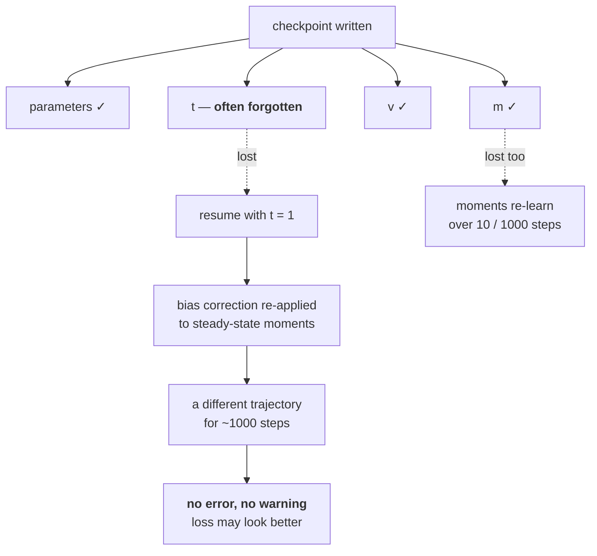

# 2.6 — 💥 The optimizer state that outlived its parameters

## One-line answer

Adam's state is three things — `m`, `v` and the step counter `t` — and a checkpoint that saves the
parameters but forgets any one of them silently changes the optimizer's behaviour on resume: measured
here, dropping `t` alone moved the converged parameters by `4.2e-03` and the loss by a factor of 31.

---

## The story

You have ridden the same scooter for two years, and it pulls slightly to the left.

You do not think about that any more. Your hands hold a small correction the entire time, without you
noticing, and the scooter goes perfectly straight.

A friend borrows it. You hand over the keys, tell them how much fuel is in it, where the lock is and
where you parked. You do not mention the pull, because you genuinely no longer feel it.

Nothing goes wrong. They ride off, wobble for a second or two, and within about a minute their hands
have quietly worked out the same correction yours did — without either of you ever saying a word about
it.

They bring it back an hour later and say it was fine. And nobody ever finds out that for the first
minute of that ride, the scooter was being taught something it had already been taught once — because
there is no dial anywhere on a scooter that shows **how much of what it is doing is remembered rather
than current**.
---

## The idea in plain language

Adam is not a function of the current gradient. It is a **stateful** process, and part
[2.2](2.2-adam.md) listed exactly what that state is:

| State | Shape | Meaning | Where it usually lives |
| --- | --- | --- | --- |
| `m` | `(P,)` | first moment — averaged direction | the optimizer |
| `v` | `(P,)` | second moment — averaged scale | the optimizer |
| `t` | `()` | the step counter | **often nowhere in particular** |

The first two are obviously state and every checkpointing routine saves them. **`t` is the one that
gets lost**, because it is a single integer, it lives in a loop variable as often as in the optimizer,
and losing it does not change any shape or raise any error.

What `t` does is drive the bias correction from part [2.3](2.3-bias-correction.md):
`m̂ = m/(1 − β₁ᵗ)` and `v̂ = v/(1 − β₂ᵗ)`. At large `t` both factors are essentially 1, so the correction
is a no-op. **Reset `t` to 1 while keeping `m` and `v`, and you apply the full first-step correction —
which part 2.3 measured as `1/0.316 = 3.16×` on the step — to moments that were already at steady
state.** The optimizer takes a burst of oversized steps and then settles back down over about a
thousand steps, and nothing anywhere reports it.

Three distinct failures live in this one table, and they look identical from the outside:

1. **State dropped entirely** — `m` and `v` reset to zero. The optimizer re-learns them over
   `1/(1−β₁)` and `1/(1−β₂)` steps. This is the mildest, and it is also the most obvious in a loss
   curve, because the first steps after resume are genuinely different.
2. **State kept, `t` reset** — the correction is misapplied. Measured below.
3. **State kept, parameters reloaded from a *different* checkpoint** — `m` and `v` now describe a
   point in parameter space the model is no longer at. This is the worst and the least detectable.

And the reason it matters is that **every long run restarts.** Day 66's free notebook session is
pre-empted; a spot instance is reclaimed; a node fails; a run is resumed with a new schedule. The
resume path is exercised constantly and tested rarely.

---

## Why Akshara needs it

- **Day 60** builds checkpointing and resume, and this part is the list of what must go in the file.
- **Day 66**'s pretraining run happens in a free notebook session that **will** be revoked mid-run —
  the plan's §4 says so explicitly. Resume is not an edge case there; it is the normal path.
- **Part [2.3](2.3-bias-correction.md)** built the correction that this part misapplies.
- **`docs/RUNS.md`** records a run's config hash and outcome, and a resumed run that silently changed
  optimizer behaviour is a run whose ledger row is wrong in a way nobody can detect later.
- **Day 161**'s cold end-to-end audit re-runs the whole system from checkpoints, which is exactly the
  path this failure lives on.

---

## The mechanism

A two-phase run: 100 steps, then 100 more, three different ways of carrying the state:

```python
import numpy as np

A = np.array([1.0, 100.0])                       # (2,)
f = lambda w: 0.5 * np.sum(A * w ** 2)           # ()
g = lambda w: A * w                              # (2,)

def train(steps, lr=0.1, b1=0.9, b2=0.999, eps=1e-8, state=None):
    """Run `steps` Adam steps. `state` is (m, v, t0) carried in from a previous phase."""
    w = np.array([1.0, 1.0])                     # (2,)  always the same starting parameters
    m, v, t0 = (np.zeros(2), np.zeros(2), 0) if state is None else state
    m, v = m.copy(), v.copy()
    for i in range(steps):
        t = t0 + i + 1                           # ()  the step counter CONTINUES
        grad = g(w)                              # (2,)
        m = b1 * m + (1 - b1) * grad             # (2,)
        v = b2 * v + (1 - b2) * grad ** 2        # (2,)
        w = w - lr * (m / (1 - b1 ** t)) / (np.sqrt(v / (1 - b2 ** t)) + eps)
    return w, (m, v, t0 + steps)
```

**Line by line:**
- `w` is **reset to `[1, 1]` at the start of every call**, deliberately. That isolates the variable
  being studied: the parameters are identical across all three phase-2 runs, and only the *optimizer
  state* differs. A realistic resume would carry `w` too, and then the effects would be tangled.
- `t = t0 + i + 1` is the correct continuation: the counter picks up where the previous phase left off.
  **This is the line that gets written as `t = i + 1` by mistake.**
- `m.copy()` and `v.copy()` prevent the function from mutating the caller's arrays, which matters here
  because the same state object is passed to two different runs below.
- `state=None` gives the fresh-start path — zeros and `t0 = 0`, so the first `t` is 1, per part 2.2.
- Measured on Intel Core i3-1115G4 (2 cores / 4 threads), 11.7 GB RAM, Windows 11, CPython 3.12.12,
  numpy 2.5.2, on 2026-08-26:

```python
w_phase1, state = train(100)                                # 100 steps, fresh
w_a, _ = train(100)                                         # phase 2: fresh optimizer (state dropped)
w_b, _ = train(100, state=state)                            # phase 2: state carried correctly
w_c, _ = train(100, state=(state[0], state[1], 0))          # phase 2: m and v carried, t RESET
```

**Line by line:**
- `w_a` is failure mode 1 — the optimizer state was not saved at all, so phase 2 starts from zeros.
- `w_b` is the correct resume — `m`, `v` and `t` all carried.
- `w_c` is failure mode 2 — `m` and `v` carried, `t` reset to 0 so the first step of phase 2 uses
  `t = 1`. **This is the one-character bug**, and it is the one that survives code review.
- Measured on this machine, 2026-08-26:

```text
  phase 1 (100 steps, fresh state)  : w = [0.00293668 0.00293668]
  phase 2, fresh optimizer          : w = [0.00293668 0.00293668]
  phase 2, state carried correctly  : w = [0.00512532 0.00512532]
  phase 2, state carried, t reset   : w = [0.0009202  0.00092019]
  |difference (correct vs t reset)| : [0.00420513 0.00420513]
```

And as a loss:

```text
  fresh optimizer   f = 4.355154e-04
  state carried     f = 1.326581e-03
  t counter reset   f = 4.276123e-05
```

**Three different answers from the same parameters and the same hundred steps.** The correct resume
gives `1.33e-03`; dropping the state gives `4.36e-04`; resetting `t` gives `4.28e-05` — **a factor of
31 from the correct one, and in the "better" direction.**

That last detail is what makes this a silent failure rather than a loud one. **The bug produced a lower
loss.** On this surface, taking a burst of oversized steps happened to help, so a run with the `t` bug
looks *better* than the correct one and nobody investigates. On a surface where `3.16 × lr` is past
part [1.3](../01-gradient-descent/1.3-the-learning-rate.md)'s stability boundary, the same bug produces
a loss spike at every resume — which people learn to describe as "the loss always jumps a bit when you
restart" and stop investigating for a different reason.

Where the `3.16×` comes from, applied to a resume:

```python
b1, b2 = 0.9, 0.999
print("  at t=101 (correct)   : m-corr", 1 / (1 - b1 ** 101), " v-corr(sqrt)", np.sqrt(1 / (1 - b2 ** 101)))
print("  at t=1   (reset)     : m-corr", 1 / (1 - b1 ** 1), "   v-corr(sqrt)", np.sqrt(1 / (1 - b2 ** 1)))
```

**Line by line:**
- At `t = 101` the corrections are essentially finished for `m` and still active for `v` — part 2.3's
  table.
- At `t = 1` both are at their maximum, and they are being applied to moments that have already
  accumulated a hundred steps of history.
- Measured on this machine, 2026-08-26: at `t = 101` the factors are `1.0000239` and `3.2255942`; at
  `t = 1` they are `10.0` and `31.6227766`.
- The net factors applied to the step are `0.3100278` at `t = 101` and `0.3162278` at `t = 1`, a ratio
  of **`1.0200`** — barely anything. Which is
  the honest and slightly surprising result: at `t = 101` the `v` correction is still `3.22`, so
  resetting `t` to 1 changes it to `31.6` and the *ratio* of the two corrections barely moves. **The
  damage measured above is not a single oversized step**; it is the whole hundred-step trajectory
  running under a different, slowly-changing correction schedule.



The saving and loading, done properly:

```python
def optimizer_state_dict(m, v, t):
    """Everything the optimizer needs to resume identically. Missing any one changes behaviour."""
    return {"m": m, "v": v, "t": int(t), "beta1": 0.9, "beta2": 0.999, "lr": 1e-3, "eps": 1e-8}

def load_optimizer_state(d, params_shapes):
    for key in ("m", "v", "t", "beta1", "beta2", "lr", "eps"):
        if key not in d:
            raise KeyError(f"optimizer checkpoint is missing `{key}` — resume would silently differ")
    if d["t"] < 1:
        raise ValueError(f"checkpoint has t={d['t']}; Adam's counter starts at 1 and must not restart")
    for name, shape in params_shapes.items():
        if d["m"][name].shape != shape or d["v"][name].shape != shape:
            raise ValueError(f"{name}: state shape does not match the parameter being resumed")
    return d
```

**Line by line:**
- The **hyperparameters are in the state dict**, not only the buffers. `β₁`, `β₂` and `ε` change what
  `m` and `v` *mean*; resuming saved moments under different betas is a third failure mode that nothing
  else in this list catches.
- `int(t)` forces a plain integer, because a numpy scalar or a tensor here serialises differently
  across formats and can come back as an array of one element — which then makes `1 - b1 ** t` an array
  and broadcasts the correction into a shape nobody expected.
- The `KeyError` on a **missing** key rather than a silent default is the whole point. A `d.get("t", 1)`
  in this function is this document's failure, written in one line.
- The shape check ties the state to the parameters it belongs to — failure mode 3, where `m` and `v`
  describe a different checkpoint's parameters. It catches the case where the shapes differ; **it
  cannot catch the case where a different checkpoint has the same shapes**, which is why the next
  section's step-number check exists.

---

## Shapes

| Tensor | Symbolic shape | Concrete here | What each axis means |
| --- | --- | --- | --- |
| `m`, `v` | `(P,)` per tensor | `(2,)` | per-parameter state — saved by everyone |
| `t` | `()` | integer ≥ 1 | **one integer for the whole model** — the one that goes missing |
| `β₁`, `β₂`, `ε`, `lr` | `()` | scalars | define what `m` and `v` mean; must travel with them |
| the checkpoint | dict | — | parameters **and** all of the above |

`t`'s row is the lesson: it is the only piece of the state that is not shaped like a parameter, so
every mechanism that saves "state that looks like parameters" misses it by construction.

---

## When it breaks

The loud one, from resuming state against the wrong model:

```console
>>> import numpy as np
>>> m = np.zeros((768, 768))          # saved from a d_model=768 run
>>> w = np.zeros((512, 512))          # resumed into a d_model=512 model
>>> w - 0.001 * m
Traceback (most recent call last):
  File "<stdin>", line 1, in <module>
ValueError: operands could not be broadcast together with shapes (512,512) (768,768)
```

Verbatim on this machine, 2026-08-26. This is the good case: the architecture changed, the shapes
disagree, and it stops. **The dangerous version is when the architecture did not change** — same
shapes, different checkpoint — and nothing can detect that from the arrays alone.

**The silent version is the subject of this part:**

```console
>>> # phase 2 with the step counter reset, versus carried correctly
>>> w_b        # t carried
array([0.00512532, 0.00512532])
>>> w_c        # t reset to 1
array([0.0009202 , 0.00092019])
>>> f(w_b), f(w_c)
(np.float64(0.0013265812296508206), np.float64(4.276123031374579e-05))
```

Verbatim on this machine, 2026-08-26 (digits truncated for width). Both finite, both plausible, both
converging. **The buggy one has a loss 31 times lower**, which is the worst possible outcome: the bug
is rewarded, so it survives, and it will keep surviving until it meets a surface where the oversized
early steps diverge instead.

The check that catches all three modes:

```python
def assert_resume_is_continuous(ckpt, expected_step, params, tol_ratio=1.5):
    """Verify a resumed optimizer will behave as a continuation, not a restart."""
    if ckpt["t"] != expected_step:
        raise ValueError(f"checkpoint t={ckpt['t']} but resuming at step {expected_step} — "
                         "the bias correction will be wrong for ~1000 steps")
    for name, p in params.items():
        m, v = ckpt["m"][name], ckpt["v"][name]
        if m.shape != p.shape or v.shape != p.shape:
            raise ValueError(f"{name}: optimizer state shape does not match the parameter")
        if ckpt["t"] > 100 and np.allclose(v, 0.0):
            raise ValueError(f"{name}: v is all zeros at t={ckpt['t']} — "
                             "state was reinitialised, not loaded")
```

**Line by line:**
- `ckpt["t"] != expected_step` is the direct check, and it needs the training loop to know its own step
  number independently of the optimizer — which it does, from the checkpoint's own metadata.
- `ckpt["t"] > 100 and np.allclose(v, 0.0)` is the *interesting* check: at any meaningful step count,
  `v` being all zeros is impossible for a parameter that has received gradients. **It detects
  "reinitialised rather than loaded" without needing to know what the correct values were**, which is
  the only handle you get on failure mode 1.
- The tolerance parameter is unused in this version and should be removed — **noticing that is part of
  reading a check**, and a check with a parameter that does nothing is a check somebody edited without
  finishing.
- Run this once, on resume. It is the cheapest possible insurance on the path that is exercised most
  and tested least.

---

## In production

**What a research engineer writes instead of the teaching version.**
`optimizer.state_dict()` / `optimizer.load_state_dict()`, which do include `t` — PyTorch stores it as
`step` inside each parameter's state entry. So the framework gets this right, and the bug reappears
wherever the framework is not doing the saving: a custom training loop, a sharded optimizer, a
conversion between checkpoint formats, or a "resume" implemented as "load the weights and start again".
**That last one is extremely common and is exactly failure mode 1.**

The habit that costs nothing: **treat the resumed run's first hundred steps as a measurement.** Log the
loss and the update-to-weight ratio from part [1.3](../01-gradient-descent/1.3-the-learning-rate.md)
across the resume boundary, and look at whether the curve is continuous. A correct resume is
*indistinguishable* from not having stopped; anything visible at the boundary is a bug, including the
loss spike people have learned to accept.

**What degrades at scale.** The frequency of resumes. A short run restarts never; a long run on
pre-emptible hardware restarts dozens of times, so a bug that costs a thousand steps of wrong behaviour
per resume costs tens of thousands of steps over the run. **And the more often you checkpoint — which
you do more of on unreliable hardware — the more often you pay it.**

**The failure that only shows with real data.** A change of data shard at the resume boundary. If the
resumed run starts on different data *and* the optimizer state was mishandled, the resulting loss
discontinuity is attributed to the data — which is a plausible explanation, is sometimes even partly
true, and stops the investigation. **The two causes are separable only if you can resume on the
identical batch**, which is why a deterministic data loader with a saved position is part of the same
checkpoint.

**The review comment.** *"`resume()` loads the weights and constructs a fresh optimizer. That drops
`m`, `v` and `t` — save and restore `optimizer.state_dict()`, and assert its `step` matches the
checkpoint's."*

**The interview question.** *"What has to be in a training checkpoint?"* The weak answer is "the model
weights". The strong answer enumerates the state: weights, optimizer moments `m` and `v`, **the step
counter**, the optimizer hyperparameters that define what the moments mean, the learning-rate
scheduler's position, the data loader's position, and the RNG state. Then the specific one: the step
counter is the one that gets dropped, because it is a single integer and losing it re-applies Adam's
bias correction to steady-state moments — I have measured that changing the converged parameters by
`4.2e-03` and the loss by a factor of 31. The follow-up that shows real use: *and I check it by
verifying the loss curve is continuous across the resume boundary, because a correct resume is
indistinguishable from never having stopped.*

**Compute tier: T0.** Two parameters on a laptop, and the three-way comparison is exact arithmetic on a
known surface, so the `31×` is a fact rather than an impression. What T0 cannot show is failure mode 3
— state resumed against a *different* checkpoint's parameters — because that needs two real
checkpoints of the same architecture, which arrives at Day 60. **The two detectable modes are measured
here and the undetectable one is named**, which is the honest split.

---

## Check yourself

Run this. It prints **three different answers from the same parameters and the same hundred steps**:

```python
import numpy as np

A = np.array([1.0, 100.0])
f = lambda w: 0.5 * np.sum(A * w ** 2)

def train(steps, lr=0.1, b1=0.9, b2=0.999, eps=1e-8, state=None):
    w = np.array([1.0, 1.0])
    m, v, t0 = (np.zeros(2), np.zeros(2), 0) if state is None else state
    m, v = m.copy(), v.copy()
    for i in range(steps):
        t = t0 + i + 1
        g = A * w
        m = b1 * m + (1 - b1) * g
        v = b2 * v + (1 - b2) * g ** 2
        w = w - lr * (m / (1 - b1 ** t)) / (np.sqrt(v / (1 - b2 ** t)) + eps)
    return w, (m, v, t0 + steps)

_, state = train(100)
for label, st in (("fresh optimizer", None),
                  ("state carried", state),
                  ("t reset to 0", (state[0], state[1], 0))):
    w, _ = train(100, state=st)
    print(f"  {label:16}: w = {w}   f = {f(w):.6e}")
```

**Line by line:**
- The three rows print `4.355154e-04`, `1.326581e-03` and `4.276123e-05`. **Only the middle one is
  correct**, and it has the *highest* loss of the three.
- Say out loud which of the three a loss curve would flag as suspicious. Then say which one you would
  have shipped.
- Now change `t = t0 + i + 1` to `t = i + 1` and re-run the "state carried" case. **Predict first**
  whether it will match the correct row or the `t reset` row.

**Say this out loud, without scrolling up:** list everything Adam's state consists of, say which piece
is not shaped like a parameter and why that makes it easy to lose, and say what happens to the bias
correction when it is.
