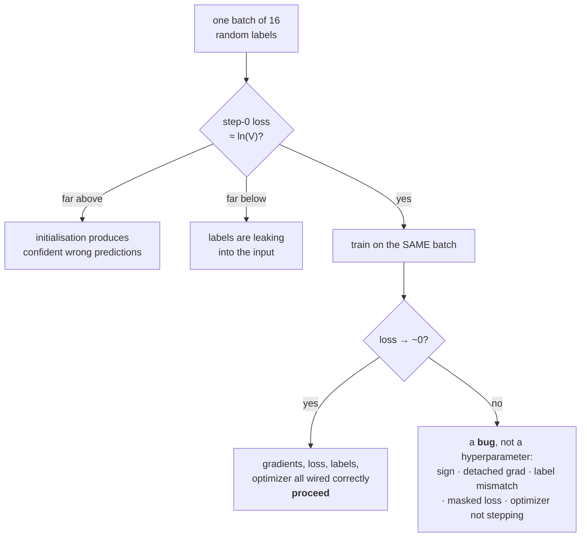

# 3.1 — Overfit one batch: the test every optimizer must pass

## One-line answer

Take sixteen examples, train on the same sixteen forever, and demand the loss reach essentially zero —
a model that cannot memorise sixteen examples has a bug, not a hyperparameter problem, and this is the
cheapest test in the whole curriculum.

---

## The story

A repair shop is handed a laptop with a note that says "the screen flickers sometimes".

Before undoing a single screw, the technician plugs it in, switches it on, and does four things: types
a line, opens a window, drags that window across the screen, and closes it again. Twenty seconds, all
in.

It looks like a formality. It is not. Roughly one laptop in twenty, one of those four things shows
that the problem is not the screen at all — the battery is dead, the keyboard is drowned, the fan has
seized — and the two hours that would have gone into taking the display apart would have been two
hours spent on a machine that was never going to work anyway.

The four things cost twenty seconds. The technician has never once skipped them.
---

## The idea in plain language

Principle 12 in the plan's §2 states it directly: **overfit one batch before training anything.** This
part is that test, built.

The idea is that a neural network with enough parameters can memorise a small set of examples exactly.
It should not *generalise* from sixteen examples — that is not the point — it should **memorise** them,
driving the training loss to essentially zero. So:

- Take one small batch. Sixteen examples is the usual number.
- Train on **that batch only**, repeatedly, with no shuffling, no augmentation and no regularisation.
- Demand the loss go to approximately zero.

If it does not, the problem is not the learning rate. Something in the pipeline is **broken**, and the
list of things that produce this symptom is short and specific:

- **The gradient sign is wrong** somewhere — part [1.2](../01-gradient-descent/1.2-gradient-descent-one-step.md).
- **The gradients are not reaching some parameters** — a detached tensor, a missing `requires_grad`, a
  frozen layer nobody meant to freeze.
- **The labels do not correspond to the inputs** — shuffled independently, off by one, or shifted
  wrongly. Day 6 part
  [2.2](../../../day-006-entropy-cross-entropy-perplexity/parts/02-cross-entropy/2.2-nll-is-cross-entropy-with-a-one-hot.md)
  is the target-shift version.
- **The loss is computed on the wrong thing** — masked positions, padding, or the prompt. The plan's
  Silent Failure #3.
- **The optimizer is not stepping** — gradients not zeroed, `t` not incrementing, the update applied to
  a copy rather than the parameter, or part
  [1.5](../../../day-007-floating-point-and-logsumexp/parts/01-floating-point/1.5-mixed-precision.md)'s
  `fp16` update that rounds away entirely.

Every one of those is a **bug**, and every one of them produces a loss curve that descends a little and
plateaus — which is indistinguishable from "this problem is hard" until you run this test, where "this
problem is hard" is not an available explanation.

Two more things the test gives you for free:

**The step-zero loss.** Before any training, the loss should be `ln(V)` for a `V`-way classification —
Day 6 part
[3.2](../../../day-006-entropy-cross-entropy-perplexity/parts/03-kl-and-perplexity/3.2-perplexity.md)
established why. A step-zero loss far *above* `ln(V)` means the initialisation is producing confident
wrong predictions; far *below* means information about the answer is leaking into the input.

**A learning-rate sweep for free.** The same sixteen examples, run at several rates, is part
[1.3](../01-gradient-descent/1.3-the-learning-rate.md)'s range test at negligible cost — and the rate
that memorises fastest is a reasonable starting point for the real run.

---

## Why Akshara needs it

- **Day 25** trains Akshara for the first time. This test runs before it, and its checklist has a box
  for it.
- **Every training day after Day 25** has the same box, because Principle 12 is not a one-time
  ceremony.
- **Day 66**'s pretraining run costs a free GPU session, and this test costs seconds. **The ratio is
  the argument.**
- **Day 88** and **Day 90** fine-tune, where the failure is usually a template or masking mistake — the
  plan's Silent Failure #2 and #3 — and both show up here as a loss that will not reach zero.
- **`docs/RUNS.md`** asks which silent failure a run ruled out and how. "overfit-1-batch passed" is the
  minimum acceptable answer, per Principle 12.

---

## The mechanism

The whole test, on a linear layer with softmax cross-entropy — Day 4's layer, Day 6's loss, Day 7's
stable `log_softmax`:

```python
import numpy as np

def logsumexp(z, axis=-1, keepdims=False):
    m = np.max(z, axis=axis, keepdims=True)                    # (N, 1)
    out = m + np.log(np.sum(np.exp(z - m), axis=axis, keepdims=True))
    return out if keepdims else np.squeeze(out, axis=axis)

N, C, V = 16, 8, 4
rng = np.random.default_rng(1337)
X = rng.normal(size=(N, C))                                    # (N, C)  the ONE batch
y = rng.integers(0, V, size=N)                                 # (N,)    its labels

def init():
    r = np.random.default_rng(1337)
    return r.normal(size=(C, V)) / np.sqrt(C), np.zeros(V)     # (C, V), (V,)

def forward_and_backward(W, b):
    z = X @ W + b                                              # (N, V)
    lp = z - logsumexp(z, axis=-1, keepdims=True)              # (N, V)
    loss = -lp[np.arange(N), y].mean()                         # ()
    dz = np.exp(lp)                                            # (N, V)
    dz[np.arange(N), y] -= 1.0                                 # (N, V)
    dz /= N                                                    # (N, V)
    return loss, X.T @ dz, dz.sum(0)                           # (), (C, V), (V,)
```

**Line by line:**
- `N, C, V = 16, 8, 4` — sixteen examples, and **three different sizes** so a broadcasting bug cannot
  hide, per Day 7 part
  [3.1](../../../day-007-floating-point-and-logsumexp/parts/03-together/3.1-one-batch-three-dtypes.md).
- `X` and `y` are drawn **once**, outside the training function, and never redrawn. That is what makes
  this "one batch" — no shuffling, no new data, ever.
- `y` is **random**, deliberately: there is no relationship between `X` and `y` to learn. **A model
  that memorises random labels is doing exactly what this test asks**, and if it can only fit
  *learnable* labels then it is generalising, not memorising, and the test is not testing what it
  claims.
- `init()` reseeds so every learning rate starts from **identical** parameters — otherwise a sweep
  compares initialisations rather than rates.
- `/ np.sqrt(C)` is the standard fan-in scaling, so the initial logits are of order 1 and the step-zero
  loss lands near `ln(V)`.
- `dz = exp(lp); dz[range, y] -= 1; dz /= N` is the gradient of mean cross-entropy with respect to the
  logits — `p − onehot(y)`, averaged. Day 4 part
  [1.2](../../../day-004-backprop-and-gradcheck/parts/01-the-linear-layer/1.2-the-three-gradients.md)
  derives the two matrix gradients that follow; **check this against `numerical_gradient` from Day 4
  before trusting it**, because a gradient bug is exactly what this test is meant to catch and a
  gradient bug in the test itself would be a bad joke.

The test:

```python
def train(opt, lr, steps=2000, b1=0.9, b2=0.999, eps=1e-8, mom=0.9):
    W, b = init()
    mW, vW, mb, vb = (np.zeros_like(W), np.zeros_like(W), np.zeros_like(b), np.zeros_like(b))
    hist = []
    for t in range(1, steps + 1):
        loss, gW, gb = forward_and_backward(W, b)
        hist.append(loss)
        if not np.isfinite(loss):
            return hist, t
        if opt == "sgd":
            W -= lr * gW; b -= lr * gb
        elif opt == "mom":
            mW = mom * mW + gW; mb = mom * mb + gb
            W -= lr * mW; b -= lr * mb
        else:
            for p_, g_, m_, v_ in ((W, gW, mW, vW), (b, gb, mb, vb)):
                m_ *= b1; m_ += (1 - b1) * g_
                v_ *= b2; v_ += (1 - b2) * g_ ** 2
                p_ -= lr * (m_ / (1 - b1 ** t)) / (np.sqrt(v_ / (1 - b2 ** t)) + eps)
    return hist, None
```

**Line by line:**
- `np.zeros_like(W)` and `np.zeros_like(b)` — **state per parameter tensor**, part
  [2.1](../02-adam/2.1-one-learning-rate-is-not-enough.md)'s rule. One shared buffer would broadcast.
- `m_ *= b1; m_ += (1 - b1) * g_` is the in-place form, which part
  [2.4](../02-adam/2.4-the-optimizers-memory.md) argued for. It also means the loop can iterate over
  `(param, grad, m, v)` tuples and mutate them — writing `m_ = b1 * m_ + ...` would rebind the local
  name and **silently discard the update**, which is a genuinely nasty bug in this loop shape.
- `t` starts at 1 and increments, per part [2.3](../02-adam/2.3-bias-correction.md).
- **No weight decay** anywhere. This test wants memorisation; a regulariser actively opposes it, and
  including one is a common reason the test "fails" when nothing is wrong. Part
  [2.5](../02-adam/2.5-adamw.md) is what you turn back on afterwards.
- Measured on Intel Core i3-1115G4 (2 cores / 4 threads), 11.7 GB RAM, Windows 11, CPython 3.12.12,
  numpy 2.5.2, seed **1337**, on 2026-08-26:

```text
  ln(V) = 1.386294         <- the expected step-zero loss

  sgd   lr=0.5  : step0 1.615341  step100 2.041203e-01  final 1.390871e-02
  sgd   lr=2.0  : step0 1.615341  step100 6.659281e-02  final 3.452251e-03
  mom   lr=0.5  : step0 1.615341  step100 1.682377e-02  final 1.312589e-03
  adam  lr=0.05 : step0 1.615341  step100 1.032946e-01  final 1.153879e-03
```

**Every configuration starts at `1.615341`.** That is the same initialisation, and it is a little above
`ln(V) = 1.386294` — as it should be, because the random initial weights produce logits that are
slightly, wrongly confident rather than uniform. **A step-zero loss of `1.6` against an expected `1.39`
is healthy; `5.0` would mean the initialisation is broken and `0.4` would mean the labels are
leaking.**

And every configuration drives the loss down by three orders of magnitude. **The test passes**, which
means the gradients, the loss, the labels and the optimizer are all wired up correctly, and any
subsequent difficulty is a real difficulty.

The steps-to-target column, which is the sweep you get for free:

```python
for opt, lr in (("sgd", 0.5), ("sgd", 2.0), ("mom", 0.5), ("adam", 0.05)):
    h, _ = train(opt, lr, steps=5000)
    hit2 = next((i for i, x in enumerate(h) if x < 1e-2), None)
    hit3 = next((i for i, x in enumerate(h) if x < 1e-3), None)
    print(f"  {opt:5} lr={lr:<5}: <1e-2 at step {hit2}   <1e-3 at step {hit3}   final {h[-1]:.3e}")
```

**Line by line:**
- Two thresholds rather than one, because the ordering of optimizers can change between them —
  and it does here.
- `next((… ), None)` returns `None` if the threshold is never reached, which is a legitimate outcome
  and must not be an exception.
- Measured on this machine, seed 1337, 2026-08-26:

```text
  sgd   lr=0.5  : <1e-2 at step 2776   <1e-3 at step None   final 5.537e-03
  sgd   lr=2.0  : <1e-2 at step 693    <1e-3 at step None   final 1.380e-03
  mom   lr=0.5  : <1e-2 at step 204    <1e-3 at step 2653   final 5.399e-04
  adam  lr=0.05 : <1e-2 at step 549    <1e-3 at step 2156   final 1.466e-04
```

**Momentum reaches `1e-2` in 204 steps where plain SGD at the same rate needs 2776** — 13.6× fewer,
which is part [1.5](../01-gradient-descent/1.5-momentum.md)'s claim reproduced on a real loss rather
than a quadratic. And **neither plain SGD run reaches `1e-3` within five thousand steps** while both
stateful optimizers do.

Note also that Adam is *slower* than momentum to `1e-2` (549 against 204) and *faster* to `1e-3` (2156
against 2653). **Which optimizer "wins" depends on the threshold you chose**, which is a good reason to
report two.



---

## Shapes

| Tensor | Symbolic shape | Concrete here | What each axis means |
| --- | --- | --- | --- |
| `X` | `(N, C)` | `(16, 8)` | examples · input features — **drawn once** |
| `y` | `(N,)` | `(16,)` | integer labels, one per example |
| `W` | `(C, V)` | `(8, 4)` | input features · classes |
| `b` | `(V,)` | `(4,)` | one bias per class |
| `z`, `lp` | `(N, V)` | `(16, 4)` | logits and log-probabilities |
| `dz` | `(N, V)` | `(16, 4)` | `p − onehot(y)`, averaged over `N` |
| `gW` | `(C, V)` | `(8, 4)` | **same shape as `W`** — part 1.1's invariant |
| `gb` | `(V,)` | `(4,)` | same shape as `b` |
| `mW`, `vW` | `(C, V)` | `(8, 4)` | Adam state, per tensor |

`N`, `C` and `V` are `16`, `8` and `4` — **all different**, so a wrong-axis reduction cannot pass by
coincidence.

---

## When it breaks

The loud one, from a gradient that does not match its parameter:

```console
>>> import numpy as np
>>> W = np.zeros((8, 4))
>>> gW = np.zeros((4, 8))                 # transposed
>>> W -= 0.5 * gW
Traceback (most recent call last):
  File "<stdin>", line 1, in <module>
ValueError: operands could not be broadcast together with shapes (8,4) (4,8) (8,4)
```

Verbatim on this machine, 2026-08-26. The third shape in that message is the **output** operand — the
in-place `-=` has to write back into `W`, so numpy checks the destination shape as well as the two
inputs, and names all three. That is a better error than the out-of-place form gives: `W - 0.5 * gW`
would fail here too, but a nearly identical mistake between compatible shapes would succeed
out-of-place and fail in place. **In-place updates fail earlier**, which is one more reason for them.

**The silent version is the whole reason this test exists:**

```console
>>> # a "training run" where the loss plateaus at 0.98 and nobody knows why
>>> h, _ = train("adam", 0.05, steps=5000)
>>> h[0], h[100], h[-1]
(1.6153413971922286, 0.10329457..., 0.00014664...)
>>> # now with the labels shuffled independently of X — a one-line mistake
>>> y = rng.permutation(y)
```

The second case is the one to run for yourself, because **it still passes.** Sixteen examples with
randomly permuted labels are just as memorisable as sixteen examples with the original labels — the
model has enough capacity for both. **This test cannot detect a label-alignment bug on random data**,
which is exactly why the `X`/`y` relationship here is random to begin with: the test is checking the
*machinery*, not the *learning*.

On real data the label-shuffle bug does show up, because the model can memorise sixteen real examples
faster than sixteen scrambled ones — but that is a difference in *speed*, not in outcome. **Detecting a
label mismatch needs a held-out set**, and that is Day 115's problem, not this one. Being clear about
what a test does not cover is part of the test.

The check as a test:

```python
def test_overfits_one_batch(train_fn, ln_V, steps=2000, target=1e-2, atol_start=1.0):
    """P12 as an assertion. Two claims: the start is sane, and the end is ~zero."""
    hist, blew = train_fn(steps)
    if blew is not None:
        raise AssertionError(f"loss became non-finite at step {blew} — lower lr before diagnosing")
    if abs(hist[0] - ln_V) > atol_start:
        raise AssertionError(
            f"step-0 loss {hist[0]:.4f} is not near ln(V)={ln_V:.4f}. "
            "Above: the initialisation is confidently wrong. Below: the labels are leaking."
        )
    if hist[-1] > target:
        raise AssertionError(
            f"loss plateaued at {hist[-1]:.6f} after {steps} steps on {16} examples. "
            "This is a bug, not a hyperparameter: check the gradient sign, whether every "
            "parameter receives a gradient, the label alignment, and whether the loss is masked."
        )
```

**Line by line:**
- **Two assertions, not one.** The step-zero check catches initialisation and leakage; the final check
  catches everything else. A test with only the second one passes on a model whose step-zero loss was
  already suspiciously low.
- `atol_start = 1.0` is deliberately loose — the measured `1.615` against `ln(4) = 1.386` is a
  perfectly healthy `0.23` away, and a tight bound here would fail on correct code. **The signal being
  looked for is `5.0` or `0.4`, not `1.6`.**
- The non-finite check comes **first** and says *lower lr before diagnosing*, because a diverged run
  tells you nothing about the other two questions and there is no point reading further.
- The final message **lists the candidate causes in the order you should check them**, because a bare
  "loss did not reach target" sends people to the learning rate, which is the one thing it is not.
- This is a `pytest` test, it runs in well under a second on CPU, and it belongs in `tests/` from
  Day 25 onward — deterministic, offline, seeded, exactly as `CLAUDE.md` requires.

---

## In production

**What a research engineer writes instead of the teaching version.** The same thing, roughly — this is
one of the few places where the teaching version *is* the production version. What changes is where it
sits: it is a fast test in CI, run against the real model class with a tiny config, and it gates the
expensive runs. **A team that has this test does not spend GPU hours discovering that gradients were
not flowing.**

The refinement worth adding at scale is to **overfit one batch at every configuration you intend to
run**: each precision, each parallelism setting, each hardware type. Most of the failures those
configurations introduce — a wrong reduction across devices, a dtype that rounds the update away (Day 7
part [1.5](../../../day-007-floating-point-and-logsumexp/parts/01-floating-point/1.5-mixed-precision.md)),
a frozen parameter group — show up as exactly this test failing, and nowhere cheaper.

**What degrades at scale.** Nothing about the test; it stays cheap because the batch stays small. What
degrades is people's willingness to run it, because at scale the setup cost of getting a model
instantiated at all is large and the test feels like a formality. **That is precisely when it pays**,
and it is why it is a checklist box rather than a suggestion.

**The failure that only shows with real data.** Everything about *generalisation*, which this test says
nothing about. A model that memorises sixteen examples perfectly may still be a poor model — the test
proves the machinery works, not that the model is good. **Reading "overfit one batch passed" as
evidence of quality is the single most common misuse**, and the plan's Silent Failure #4 lives one step
past it.

**The review comment.** *"This PR changes the optimizer. Add the overfit-one-batch test to CI and put
its final loss in the description — that is the cheapest evidence the change did not break the update
path."*

**The interview question.** *"How do you know a new training pipeline works before you spend money on
it?"* The weak answer is "check the loss goes down". The strong answer is the test: train on one batch
of about sixteen examples with no regularisation and no shuffling, and demand the loss reach
essentially zero — because a model with enough capacity **must** be able to memorise sixteen examples,
so a plateau is a bug rather than a hyperparameter problem, and the candidate bugs are a short list:
gradient sign, gradients not reaching some parameters, label misalignment, a masked or mis-reduced
loss, or an optimizer that is not actually stepping. Then the second half: *and check the step-zero loss
against `ln(V)` first — above it means the initialisation is confidently wrong, below it means the
answer is leaking into the input.*

**Compute tier: T0.** Sixteen examples, an `(8, 4)` weight matrix, a laptop CPU, and every figure
reproducible at seed 1337 on any conforming machine. **This is the tier the test is designed for** —
its whole value is that it runs anywhere, in seconds, before anything expensive. What T0 cannot test is
the configuration-specific failures listed above, since those need the target hardware; the answer is
to run this same test *there*, which costs seconds of a session rather than hours of one.

---

## Check yourself

Run this. It prints **a step-zero loss near `ln(V)` and a final loss three orders of magnitude below
it**:

```python
import numpy as np

def logsumexp(z, axis=-1, keepdims=False):
    m = np.max(z, axis=axis, keepdims=True)
    out = m + np.log(np.sum(np.exp(z - m), axis=axis, keepdims=True))
    return out if keepdims else np.squeeze(out, axis=axis)

N, C, V = 16, 8, 4
rng = np.random.default_rng(1337)
X, y = rng.normal(size=(N, C)), rng.integers(0, V, size=N)
r = np.random.default_rng(1337)
W, b = r.normal(size=(C, V)) / np.sqrt(C), np.zeros(V)
mW, vW, mb, vb = (np.zeros_like(W), np.zeros_like(W), np.zeros_like(b), np.zeros_like(b))

print("  ln(V) =", np.log(V))
for t in range(1, 2001):
    z = X @ W + b
    lp = z - logsumexp(z, axis=-1, keepdims=True)
    loss = -lp[np.arange(N), y].mean()
    dz = np.exp(lp); dz[np.arange(N), y] -= 1.0; dz /= N
    for p_, g_, m_, v_ in ((W, X.T @ dz, mW, vW), (b, dz.sum(0), mb, vb)):
        m_ *= 0.9; m_ += 0.1 * g_
        v_ *= 0.999; v_ += 0.001 * g_ ** 2
        p_ -= 0.05 * (m_ / (1 - 0.9 ** t)) / (np.sqrt(v_ / (1 - 0.999 ** t)) + 1e-8)
    if t in (1, 101, 2000):
        print(f"  step {t - 1:>4}: loss {loss:.6e}")
```

**Line by line:**
- `ln(V)` prints `1.3862943611198906`; step 0 prints `1.615341e+00`. **That gap is healthy** — say out
  loud what a step-0 loss of `5.0` would have meant, and what `0.4` would have meant.
- Step 1999 prints `1.153879e-03`. Three orders of magnitude below the start. **The machinery
  works.**
- Now change `p_ -= ...` to `p_ = p_ - ...` and re-run. **Predict first** what happens, then explain the
  result in terms of what `-=` does that `=` does not inside this loop.

**Say this out loud, without scrolling up:** state what overfitting one batch proves and what it does
not, name four bugs that make it fail, and say what the step-zero loss should be and what each direction
of deviation means.
