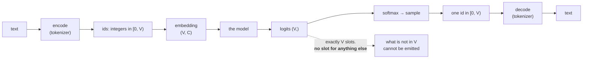

# 1.1 — A model can only emit what is in its vocabulary

## One-line answer

A language model's output layer has one slot per vocabulary entry and no slot for anything else, so the
vocabulary is not a preprocessing detail — it is a hard, permanent limit on the set of things the model
is capable of saying.

---

## The story

A print shop in a small town owns one set of metal type. Twenty-six letters in each of two cases, ten
digits, and a tray of punctuation.

They can print anything. Novels, posters, tax forms, wedding invitations — any English text at all,
because English text is made of those pieces and nothing else.

Then a customer brings in a page of Greek.

The shop cannot set it. Not slowly, not badly, not approximately. There is no drawer for it. The
compositor can produce something that *looks* like an attempt — substituting `p` for `ρ` and `o` for
`ο` — and the result is not Greek rendered imperfectly. It is English letters arranged to resemble
Greek, which is a different and worse thing, because it looks like the shop did the job.

The limit is not skill, effort or budget. It is the drawer, and the drawer was chosen years earlier by
somebody who was thinking about English.

---

## The idea in plain language

Day 5 part
[1.1](../../../day-005-logits-softmax-sampling/parts/01-logits-and-probabilities/1.1-a-distribution-over-a-vocabulary.md)
established what a language model outputs: a probability for each entry of a fixed list. This part is
about that list.

Two words, defined now and used for the rest of the curriculum:

- A **token** is one entry of the list. It might be a word, a piece of a word, a single character, or a
  single byte — which of those is the subject of this whole day.
- The **vocabulary** is the list itself, and `V` is its size. Curriculum-wide, `V` always means this.

The model's final layer produces a vector of `V` numbers — the logits from Day 5. Softmax turns them
into `V` probabilities. Sampling picks one index. **That index is the output.** There is no mechanism
by which a model can produce something outside the list, in the same way there is no mechanism by which
a die can roll a seven.

Three consequences, and they are the reason this day exists before any of the building days:

**The vocabulary is chosen before training and cannot change afterwards.** Every parameter of the
embedding matrix and the output head is sized by `V`. Change `V` and those two matrices no longer fit
the model — Day 16 is the surgery required to add even a single token.

**Whatever cannot be tokenized cannot be represented.** Not merely "represented poorly" — a piece of
text that the tokenizer has no way to encode either becomes a special "unknown" token, which throws
away the information entirely, or crashes. There is no third behaviour.

**`V` is a load-bearing number.** It sets the size of two of the largest matrices in the model, it sets
the floor of the loss at initialisation — Day 6 part
[3.2](../../../day-006-entropy-cross-entropy-perplexity/parts/03-kl-and-perplexity/3.2-perplexity.md)
gave that as `ln(V)` — and it interacts with sequence length, because a vocabulary of small pieces
needs more of them per sentence. Part [2.4](../02-what-a-tokenizer-is/2.4-vocabulary-size-is-a-budget.md)
is that arithmetic.

So the question the rest of this day answers is: **what should the entries of the list be?** And the
surprising part is that the two obvious answers — words, and letters — are both badly wrong, in
opposite directions.

---

## Why Akshara needs it

- **Part [1.2](1.2-why-not-words.md)** and part [1.3](1.3-why-not-characters.md) rule out the two
  obvious choices, and both arguments depend on `V` being a hard limit rather than a soft preference.
- **Day 12** trains Akshara's BPE vocabulary, and the training procedure is meaningless until you know
  what the vocabulary is *for*.
- **Day 18** builds the embedding matrix, whose shape is `(V, C)` — the first place `V` becomes a
  tensor dimension.
- **Day 16** resizes an embedding matrix to add special tokens, which is only difficult because `V` was
  baked in.
- **Day 6 part [3.2](../../../day-006-entropy-cross-entropy-perplexity/parts/03-kl-and-perplexity/3.2-perplexity.md)**
  established that perplexity is meaningless without its vocabulary. This is why: two models with
  different `V` are answering different questions.

---

## The mechanism

A vocabulary and the two functions that use it, in fifteen lines:

```python
import re
import collections
import pathlib

text = pathlib.Path("docs/00_MASTER_PLAN.md").read_text(encoding="utf-8")
words = [w.lower() for w in re.findall(r"[A-Za-z']+", text)]
counts = collections.Counter(words)

V = 1000
itos = ["<unk>"] + [w for w, _ in counts.most_common(V - 1)]      # (V,)  index -> string
stoi = {w: i for i, w in enumerate(itos)}                         #       string -> index

def encode(s):
    return [stoi.get(w.lower(), 0) for w in re.findall(r"[A-Za-z']+", s)]   # (T,)

def decode(ids):
    return " ".join(itos[i] for i in ids)
```

**Line by line:**
- The corpus is `docs/00_MASTER_PLAN.md`, which ships with this repository — so **every number in this
  day reproduces exactly for any reader**, without downloading anything. That is a deliberate choice;
  Day 61 is where real corpora arrive, with licences and revision SHAs.
- `re.findall(r"[A-Za-z']+", text)` is the crudest possible word-splitter and it is *wrong* in ways
  Day 13's regex pre-tokenizer fixes. It is here because it is legible, not because it is good.
- `itos` and `stoi` are the two directions, and **they must be inverses**. `itos` is a list, so `itos[i]`
  is `O(1)`; `stoi` is a dict, so `stoi[w]` is `O(1)`. The names are conventional in this field and
  worth adopting.
- `["<unk>"] + …` puts the unknown token at index `0`. **That reservation is the whole of the design
  decision this part is about**: the list must contain something for everything it cannot represent.
- `stoi.get(w.lower(), 0)` maps anything absent to index 0. Note it **does not raise** — and part
  [1.5](1.5-the-vocabulary-that-could-not-spell.md) is what that silence costs.
- `counts.most_common(V - 1)` keeps the `V − 1` most frequent words. Frequency is the ordering because
  it maximises coverage per slot; part [1.2](1.2-why-not-words.md) measures how well that works.

Run it:

```python
s = "The tokenizer is the first thing you build"
ids = encode(s)
print(f"  text  : {s!r}")
print(f"  ids   : {ids}")
print(f"  decode: {decode(ids)!r}")
print(f"  round-trip identical? {decode(ids) == s}")
```

**Line by line:**
- The round-trip is the test that matters for a tokenizer, and it is stated as an equality on the
  *string*, not on the ids. Comparing ids to ids proves nothing.
- Measured on Intel Core i3-1115G4 (2 cores / 4 threads), 11.7 GB RAM, Windows 11, CPython 3.12.12,
  on 2026-08-26, against `docs/00_MASTER_PLAN.md` at the revision in this repository:

```text
  text  : 'The tokenizer is the first thing you build'
  ids   : [1, 116, 4, 1, 75, 277, 15, 101]
  decode: 'the tokenizer is the first thing you build'
  round-trip identical? False
```

**`False`.** The capital `T` is gone, because `encode` lowercased and `decode` cannot un-lowercase.
Nothing raised, the output is a perfectly reasonable English sentence, and information was destroyed.
Part [2.1](../02-what-a-tokenizer-is/2.1-a-function-and-its-inverse.md) is that problem in full; here
it is enough to notice that **a tokenizer's failures are usually silent and usually look like output.**

Now the hard limit, made concrete:

```python
import numpy as np

C = 8
E = np.zeros((len(itos), C))              # (V, C)  the embedding matrix
print(f"  vocabulary size V = {len(itos)}")
print(f"  the model's input is an integer in [0, {len(itos) - 1}]")
print(f"  embedding matrix shape: {E.shape}")
try:
    E[len(itos)]
except IndexError as e:
    print("  IndexError:", e)
```

**Line by line:**
- `E` has exactly `V` rows, one per token. Day 18 builds this properly; here it exists to show that
  **`V` is a tensor dimension**, not a configuration value.
- `E[len(itos)]` asks for the row after the last one — the row a token outside the vocabulary would
  need.
- Measured on this machine, 2026-08-26:

```text
  vocabulary size V = 1000
  the model's input is an integer in [0, 999]
  embedding matrix shape: (1000, 8)
  IndexError: index 1000 is out of bounds for axis 0 with size 1000
```

**There is no row.** Not an empty row, not a zero row — no row. The vocabulary is a physical dimension
of the model's weights, and a token outside it has nowhere to go.



---

## Shapes

| Tensor | Symbolic shape | Concrete here | What each axis means |
| --- | --- | --- | --- |
| `itos` | `(V,)` | `(1000,)` | index → string; a Python list, not a tensor |
| `ids` | `(T,)` | `(8,)` | one integer per token, each in `[0, V)` |
| the embedding `E` | `(V, C)` | `(1000, 8)` | **`V` is a weight-matrix dimension** |
| `E[ids]` | `(T, C)` | `(8, 8)` | the gathered rows — the model's actual input |
| logits | `(B, T, V)` | `(1, 8, 1000)` | batch · position · **one slot per vocabulary entry** |

The last row is the whole part in one line: **the output layer's width is `V`**, and a model cannot
produce a probability for something with no column.

---

## When it breaks

The loud one, from an id outside the vocabulary:

```console
>>> import numpy as np
>>> E = np.zeros((1000, 8))
>>> E[1000]
Traceback (most recent call last):
  File "<stdin>", line 1, in <module>
IndexError: index 1000 is out of bounds for axis 0 with size 1000
```

Verbatim on this machine, 2026-08-26. This is the good outcome — it stops, and the two numbers name
the problem. It happens when a tokenizer and a model disagree about `V`, which is Day 16's surgery done
wrongly.

**The silent version, and it is the one that reaches production:**

```console
>>> stoi.get("kubernetes", 0)
0
>>> stoi.get("مرحبا", 0)
0
>>> stoi.get("", 0)
0
>>> decode([0, 0, 0])
'<unk> <unk> <unk>'
```

Verbatim on this machine, 2026-08-26. Three completely different inputs — an English technical term,
Arabic text, and an empty string — **all map to the same integer**, and the model cannot tell them
apart. Whatever it learns about token `0` is an average over everything the vocabulary could not
represent. And `decode` cheerfully returns a string, so a pipeline that logs its output looks like it
is working.

The check, and it is the first thing to write for any tokenizer:

```python
def vocabulary_report(stoi, itos, sample_text):
    """Three facts about a vocabulary that a config file will not tell you."""
    if len(stoi) != len(itos):
        raise ValueError(f"stoi has {len(stoi)} entries, itos has {len(itos)} — not inverses")
    for i, w in enumerate(itos):
        if stoi[w] != i:
            raise ValueError(f"itos[{i}]={w!r} but stoi[{w!r}]={stoi[w]} — the maps disagree")
    tokens = re.findall(r"[A-Za-z']+", sample_text)
    unk = sum(1 for w in tokens if w.lower() not in stoi)
    print(f"  V = {len(itos)}   unk rate on this sample: {unk}/{len(tokens)} = {unk / max(len(tokens), 1):.2%}")
    return unk / max(len(tokens), 1)
```

**Line by line:**
- The two loops check that `stoi` and `itos` are genuine inverses. **They are two data structures
  holding the same information, so they can disagree** — and a saved tokenizer where they disagree is
  a tokenizer that encodes and decodes differently, which is part
  [2.3](../02-what-a-tokenizer-is/2.3-the-tokenizer-is-not-part-of-the-model.md)'s failure in miniature.
- The unk rate is reported rather than raised, because there is no universally correct threshold — but
  **it must be reported**, because it is invisible otherwise and it is the number that decides whether
  a vocabulary is adequate.
- `max(len(tokens), 1)` guards division by zero on an empty sample, which is exactly what a
  configuration test will pass in.
- Run this once, when a tokenizer is loaded, against a sample of the data you actually intend to
  process — **not against the data it was trained on**, which by construction has a low unk rate.

---

## In production

**What a research engineer writes instead of the teaching version.** They load a tokenizer from a file
and never build `stoi`/`itos` by hand — the vocabulary comes from the same artifact as the model
weights, which is exactly the point of part
[2.3](../02-what-a-tokenizer-is/2.3-the-tokenizer-is-not-part-of-the-model.md). What they carry from
here is a habit: **when a model behaves strangely on some input, tokenize the input and look at the
ids before looking at anything else.** A surprising fraction of "the model is bad at X" turns out to be
"X tokenizes badly", and it is a thirty-second check.

The other habit is treating `V` as a **fixed contract**. Adding a token is not a configuration change,
it is a resize of two of the largest matrices in the model plus a decision about how to initialise the
new rows — Day 16. This is why production systems reserve spare slots in the vocabulary up front.

**What degrades at scale.** Nothing about the concept; what grows is the cost of the two `V`-sized
matrices. At `V = 50257` and `C = 768` the embedding alone is `38.6` million parameters — measured in
part [2.4](../02-what-a-tokenizer-is/2.4-vocabulary-size-is-a-budget.md) — which is a substantial
fraction of a small model, and it is why tied input/output embeddings exist.

**The failure that only shows with real data.** Domain shift. A vocabulary built on one kind of text
has a low unk rate on that kind of text by construction, and an unknown one on anything else. Code,
chemical names, other languages, user-generated text with unusual spacing — all of these produce unk
rates the development set never revealed. **The unk rate is a property of the (vocabulary, data) pair,
never of the vocabulary alone**, and quoting it without naming the data is meaningless.

**The review comment.** *"This logs the decoded string. Log the ids too — a run of `<unk>` is invisible
once it has been decoded back into text."*

**The interview question.** *"Why does the tokenizer matter so much?"* The weak answer is "it converts
text to numbers". The strong answer is the constraint: the output layer has exactly `V` slots and the
model samples an index, so **the vocabulary is the complete set of things the model can ever emit** —
anything outside it is not represented badly, it is mapped to a single unknown token that destroys the
distinction. And `V` is baked into the shape of two of the largest weight matrices, so it cannot be
changed after training without surgery. The follow-up that shows real use: *which is why the first
thing I check when a model is unexpectedly bad at something is what that input tokenizes to.*

**Compute tier: T0.** A dict, a list and a `(1000, 8)` array on a laptop CPU, against a corpus that
ships with this repository — so every figure here reproduces exactly for anyone with the repo, with no
download and no network. What T0 cannot show is the effect of `V` on a *trained* model's quality, which
needs Day 66's run; **this part establishes the constraint and Day 17 measures what different choices
cost.**

---

## Check yourself

Run this. It prints **three completely different inputs mapping to the same integer, and one index
error that has no row to point at**:

```python
import re, collections, pathlib
import numpy as np

text = pathlib.Path("docs/00_MASTER_PLAN.md").read_text(encoding="utf-8")
words = [w.lower() for w in re.findall(r"[A-Za-z']+", text)]
counts = collections.Counter(words)
itos = ["<unk>"] + [w for w, _ in counts.most_common(999)]
stoi = {w: i for i, w in enumerate(itos)}

print("  V =", len(itos))
for probe in ("tokenizer", "kubernetes", "", "supercalifragilistic"):
    print(f"    {probe!r:24} -> id {stoi.get(probe, 0)}")

E = np.zeros((len(itos), 8))
try:
    E[len(itos)]
except IndexError as e:
    print("  IndexError:", e)
```

**Line by line:**
- `tokenizer` maps to `116`; the other three all map to `0`. **Say out loud what the model can learn
  about a token that means "one of thousands of different things".**
- The `IndexError` prints `index 1000 is out of bounds for axis 0 with size 1000`. There is no row.
- Now compute, on paper, how many parameters the embedding matrix has at `V = 50257` and `C = 768`, and
  say what fraction of a 124-million-parameter model that is.

**Say this out loud, without scrolling up:** say what a vocabulary is, say why it is a hard limit
rather than a preference, and name the two weight matrices whose shape it decides.
