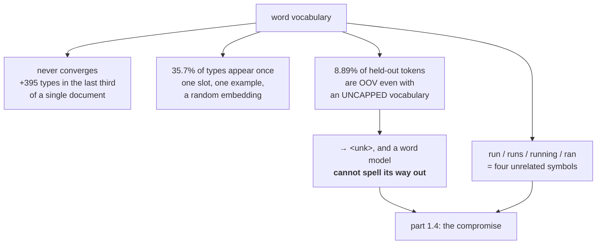

# 1.2 — Why not words: the vocabulary that never stops growing

## One-line answer

A word vocabulary never finishes — new words keep arriving no matter how much text you have read — so
any finite list leaves a permanent hole, measured here at **8.89% of held-out tokens** falling outside
a vocabulary built from the other 80% of the same document.

---

## The story

A library decides to catalogue every word used in its collection, so that any book can be described by
the words it contains.

The first shelf yields two thousand words. The second adds eight hundred more. The tenth shelf adds a
hundred and fifty, and the librarian notes with satisfaction that the rate is falling and the job will
soon be done.

It is never done. The hundredth shelf still adds forty words. The thousandth still adds a dozen. The
new words are not exotic — they are place names, surnames, a chemical, a brand, a hyphenation the
cataloguer had not seen, a typo that appears once in a print run of ten thousand.

Twenty years later the catalogue has four hundred thousand entries and is still growing by a few every
week, and the librarian's successor finally states the thing properly: **the set of words is not a set
you can finish enumerating.** Not because the library is large. Because that is what words are.

---

## The idea in plain language

Part [1.1](1.1-a-model-can-only-emit-its-vocabulary.md) established that the vocabulary is a fixed,
finite list chosen before training. The obvious thing to put in it is words. This part is why that
fails, and the failure has three separate parts.

**First: the vocabulary does not converge.** Read more text and you keep finding words you have not
seen. The rate slows — this is an empirical regularity known as *Heaps' law*, that the number of
distinct types grows roughly as a power of the number of tokens — but it does not stop. There is no
amount of text after which you have them all.

**Second: most of the vocabulary is nearly useless and you cannot tell which part in advance.** In the
corpus measured below, **35.7% of distinct words appear exactly once**. They consume a vocabulary slot
each, they receive one training example each, and their embedding row is essentially random. Meanwhile
the ten most common words cover 21% of all text. **Word frequency is extraordinarily skewed** — the
regularity here is *Zipf's law*, that frequency falls roughly as one over rank — so a vocabulary sized
for coverage is mostly tail, and the tail is mostly untrained.

**Third: whatever you cut becomes `<unk>`, permanently.** A word outside the vocabulary does not
degrade gracefully. It maps to a single token that means "something I cannot represent", and part
[1.5](1.5-the-vocabulary-that-could-not-spell.md) shows the damage. Critically, **the model cannot spell
its way out** — with a word vocabulary there is no smaller unit to fall back on. A word-level model
that has never seen `tokenizer` cannot produce it, ever, by any route.

And then the arrangement that makes all three worse: **the words you most need are the ones most likely
to be missing.** Proper nouns, technical terms, numbers, product names, code identifiers — the tokens
that carry the most specific information — are exactly the rare ones. A vocabulary chosen by frequency
systematically discards the informative tail.

One more structural objection, separate from the counting. A word vocabulary treats `run`, `runs`,
`running` and `ran` as four unrelated symbols, with four unrelated embedding rows learned from four
disjoint sets of examples. **The model must learn from scratch that they are related**, and it must do
so for every word in the language. That is a large amount of capacity spent re-deriving morphology that
was visible in the spelling all along.

---

## Why Akshara needs it

- **Part [1.4](1.4-the-subword-compromise.md)** is the answer to this part, and the answer only makes
  sense once the problem is quantified.
- **Day 11** builds a word-level tokenizer for real and hits this wall deliberately. This part is the
  arithmetic that predicts what happens there.
- **Day 12** trains BPE, whose entire purpose is to have a finite vocabulary with **no** unknown token.
- **Day 17** measures what different vocabulary sizes cost in a real model — this part is why the
  question has a trade-off in it at all.
- **Day 61**'s corpus work has to decide what to do with rare tokens, and "keep the top `V`" is the
  decision this part is arguing against.

---

## The mechanism

The corpus and the counting, against a document that ships with this repository:

```python
import re
import collections
import pathlib

text = pathlib.Path("docs/00_MASTER_PLAN.md").read_text(encoding="utf-8")
words = [w.lower() for w in re.findall(r"[A-Za-z']+", text)]      # (N,)
counts = collections.Counter(words)
print(f"  word tokens: {len(words)}")
print(f"  word types : {len(counts)}")
```

**Line by line:**
- **Tokens** are occurrences; **types** are distinct strings. `the the cat` is three tokens and two
  types, and the distinction is the whole of this part.
- `.lower()` merges `The` and `the`, which is a *choice* that shrinks the vocabulary and destroys
  information — Day 11 makes it properly and Day 16 revisits it. It is done here so the numbers are
  about the word problem rather than about capitalisation.
- Measured on Intel Core i3-1115G4 (2 cores / 4 threads), 11.7 GB RAM, Windows 11, CPython 3.12.12, on
  2026-08-26, against `docs/00_MASTER_PLAN.md` at the revision in this repository: **14,798 tokens,
  2,376 types.**

The vocabulary growth curve, which is the first argument:

```python
seen = set()
for i, w in enumerate(words, 1):
    seen.add(w)
    if i in (100, 1000, 5000, 10000, len(words)):
        print(f"  after {i:>6} tokens: {len(seen):>5} types   ({len(seen) / i:.3f} new types per token)")
```

**Line by line:**
- The set grows as text is consumed, one pass, in the document's own order. **Shuffling the words
  first would give a different curve** — a fairer one, since document order groups related vocabulary
  — and this measurement does not shuffle, which is worth saying rather than hiding.
- The third column is types-per-token *cumulatively*, which falls as the vocabulary saturates. The
  question is whether it falls to zero.
- Measured on this machine, 2026-08-26:

```text
  after    100 tokens:    78 types   (0.780 new types per token)
  after   1000 tokens:   460 types   (0.460 new types per token)
  after   5000 tokens:  1445 types   (0.289 new types per token)
  after  10000 tokens:  1981 types   (0.198 new types per token)
  after  14798 tokens:  2376 types   (0.161 new types per token)
```

**The rate falls and does not reach zero.** Between 10,000 and 14,798 tokens — the last third of the
document — the vocabulary still grew by 395 types. This document is about one subject, written by one
author, in one voice. **If it does not saturate, nothing does.**

The skew, which is the second argument:

```python
once = sum(1 for w, k in counts.items() if k == 1)
print(f"  types appearing exactly once: {once} ({once / len(counts):.1%} of types)")
print(f"  top 10: {counts.most_common(10)}")
total = sum(counts.values())
for k in (10, 100, 1000, 5000):
    print(f"  top {k:>5} types cover {sum(v for _, v in counts.most_common(k)) / total:.2%} of tokens")
```

**Line by line:**
- `k == 1` counts *hapax legomena* — words appearing exactly once. In any natural-language corpus this
  is a large fraction of the types, and each one is a vocabulary slot with a single training example.
- The coverage table answers "how many slots do I need to represent most text", which is the question a
  vocabulary size is trying to answer.
- Measured on this machine, 2026-08-26:

```text
  types appearing exactly once: 848 (35.7% of types)
  top 10: [('the', 893), ('and', 544), ('a', 517), ('is', 275), ('day', 179), ('it', 177),
           ('that', 144), ('what', 133), ('in', 131), ('not', 115)]
  top    10 types cover 21.00% of tokens
  top   100 types cover 48.01% of tokens
  top  1000 types cover 87.13% of tokens
  top  5000 types cover 100.00% of tokens
```

**Ten words cover a fifth of the text. A hundred cover half.** And then the curve flattens brutally:
going from 100 slots to 1000 — ten times the vocabulary — buys 39 percentage points, and the remaining
13% needs the other 1376 types. **The last few percent of coverage is where all the cost is**, which is
the shape of every vocabulary-size decision you will ever make.

And the third argument, which is the one that actually decides it:

```python
split = int(len(words) * 0.8)
train, test = words[:split], words[split:]
vocab = set(train)
oov = [w for w in test if w not in vocab]
print(f"  train tokens {len(train)}  vocab {len(vocab)}")
print(f"  test tokens  {len(test)}   OOV {len(oov)} = {len(oov) / len(test):.2%}")
print(f"  distinct OOV types: {len(set(oov))}")
print("  first 12 OOV words:", sorted(set(oov))[:12])
```

**Line by line:**
- The split is **by position, not random**, which is the honest version: a real held-out set is text
  you have not seen, and randomly interleaving it with training text would leak.
- `vocab = set(train)` is the *most generous possible* word vocabulary — it keeps **every** word seen in
  training, with no size cap at all. Any real vocabulary is smaller and the numbers are worse.
- Measured on this machine, 2026-08-26:

```text
  train tokens 11838  vocab 2161
  test tokens  2960   OOV 263 = 8.89%
  distinct OOV types: 215
  first 12 OOV words: ["'d", 'academy', 'acceptance', 'active', 'add', 'adjective', 'adrs',
                       'afternoon', 'allow', 'amend', 'amendment', 'analogy']
```

**Nearly one token in eleven is unrepresentable**, using an unlimited vocabulary built from 80% of the
*same document*. Look at the words: `add`, `allow`, `active`, `afternoon`. Not exotic. Ordinary English
words that happened not to occur in the first 11,838 tokens.

And with a realistic size cap:

```python
for V in (1000, 5000, 10000):
    keep = set(w for w, _ in counts.most_common(V))
    unk = sum(1 for w in test if w not in keep)
    print(f"  V={V:>6}: {unk / len(test):.2%} of test tokens become <unk>")
```

**Line by line:**
- `counts` here is over the **whole** corpus rather than only the training half, which is deliberately
  optimistic — it lets the vocabulary see the test words' frequencies. Even so:
- Measured on this machine, 2026-08-26: `V = 1000` gives **10.88%** unk; `V = 5000` and `V = 10000` give
  `0.00%`, because this corpus has only 2376 types in total and both caps exceed it.
- **The two zeros are the honest limit of this experiment.** A 109 KB document is small enough that a
  5000-slot vocabulary covers it entirely. That does not generalise: real corpora have hundreds of
  thousands of types, and the `V = 1000` row is the one that shows the shape of the problem.



---

## Shapes

| Tensor | Symbolic shape | Concrete here | What each axis means |
| --- | --- | --- | --- |
| `words` | `(N,)` | `(14798,)` | tokens — occurrences, in document order |
| `counts` | `(types,)` | `(2376,)` | distinct strings and their frequencies |
| `vocab` (uncapped) | `(2161,)` | from 80% of the corpus | every training word, no cap |
| `test` | `(2960,)` | the held-out 20% | where the 8.89% was measured |
| a capped vocabulary | `(V,)` | `(1000,)` | **`V` is a choice; the OOV rate is the consequence** |

The gap between rows three and five is the argument: 2161 slots to cover the training text, and it
still misses 8.89% of the next 2960 tokens.

---

## When it breaks

The loud one, from a vocabulary that is genuinely too small to index:

```console
>>> import numpy as np
>>> E = np.zeros((1000, 8))
>>> ids = np.array([1, 2, 1400])
>>> E[ids]
Traceback (most recent call last):
  File "<stdin>", line 1, in <module>
IndexError: index 1400 is out of bounds for axis 0 with size 1000
```

Verbatim on this machine, 2026-08-26. This happens when a vocabulary file and a checkpoint disagree —
Day 16's problem — and it is the *good* case, because it stops.

**The silent version is the one this part is about:**

```console
>>> unk = sum(1 for w in test if w not in vocab)
>>> unk, len(test), unk / len(test)
(263, 2960, 0.08885135135135135)
>>> [w for w in test[:40] if w not in vocab]
['installs', 'downloads']
```

Verbatim on this machine, 2026-08-26. Nothing raised. The pipeline ran, the model trained, and **8.89%
of the evaluation text was replaced by a token meaning "unrepresentable"** — and the first two, in the
opening forty tokens of the held-out text, are `installs` and `downloads`: not unusual words, just
words whose *inflected form* had not occurred yet. The corpus contains `install` and `download`
throughout. **A word vocabulary cannot use that**, which is the morphology objection made concrete. In a loss computation those positions still contribute; the model
learns to predict `<unk>` where interesting words go, and a metric computed over them is measuring the
tokenizer as much as the model.

The check, and it is a report rather than an assertion:

```python
def oov_report(vocab, tokens, name="corpus"):
    """The number a vocabulary config will not tell you. Report it per dataset, always."""
    oov = [w for w in tokens if w not in vocab]
    types = collections.Counter(oov)
    rate = len(oov) / max(len(tokens), 1)
    print(f"  {name}: |V|={len(vocab)}  OOV {len(oov)}/{len(tokens)} = {rate:.2%}  "
          f"({len(types)} distinct)")
    print(f"    most frequent OOV: {types.most_common(5)}")
    return rate
```

**Line by line:**
- It returns the rate **and** prints the most frequent unknown words, because the rate alone does not
  tell you whether the problem is a long tail of one-offs or one common word you forgot to include —
  and those have completely different fixes.
- It takes `name` because **the OOV rate is a property of the (vocabulary, dataset) pair**. Reporting
  one number without saying which dataset is how a vocabulary gets called adequate on the strength of
  its training set.
- No threshold and no exception: there is no universal cut-off, and a check that raises on an arbitrary
  number would be deleted the first time it fired on a legitimate domain shift. **The value is in
  having the number in the log at all.**
- Run it on **every** split — train, validation, test — and on any new data source before using it.

---

## In production

**What a research engineer writes instead of the teaching version.** Nothing — nobody ships a
word-level vocabulary for a general language model, and has not for years. What survives is the
*diagnostic*: when a model is unexpectedly bad on some input, check what fraction of that input
tokenizes into rare or unknown pieces. With a subword vocabulary there is no `<unk>`, so the symptom
changes shape — it becomes a high tokens-per-word ratio instead — but the underlying fact is the same:
**the tokenizer had not seen this kind of text, and the model is paying for it.** Day 17 measures that
version.

Where word-level vocabularies do still appear is in narrow, closed domains — a fixed command set, a
classifier over a known label space, a retrieval index over a controlled vocabulary. **In a closed
domain the vocabulary genuinely is finite and enumerable**, and the objections in this part do not
apply. Knowing which situation you are in is the actual skill.

**What degrades at scale.** The tail, faster than the head. More text means more types, and Heaps' law
says the type count keeps rising — so a vocabulary that covered 95% of a small corpus covers less of a
larger one from the same source. **Scaling the data makes the word-vocabulary problem worse, not
better**, which is the opposite of what scaling usually does and is the deepest reason this approach
was abandoned.

**The failure that only shows with real data.** Multilingual and code data. This part's corpus is
English prose with a small technical vocabulary. Real corpora contain many languages, identifiers,
URLs, numbers and markup, and each of those multiplies the type count without adding much coverage.
**A word vocabulary that is merely inadequate on English is hopeless on a mixed corpus.**

**The review comment.** *"The vocabulary is built from the training split and the OOV rate is only
reported for the training split. Report it on validation and on each new data source — that is where
the number is meaningful."*

**The interview question.** *"Why don't language models use word-level tokenization?"* The weak answer
is "there are too many words". The strong answer is the three-part measurement: the type count never
converges — I have seen a single 109 KB document still adding 395 new types in its last third — the
distribution is extremely skewed, so a third of the types appear exactly once and get one training
example each, and anything you cut becomes an unknown token that a word-level model **cannot spell its
way out of**, because there is no smaller unit. I measured 8.89% of held-out tokens falling outside an
*uncapped* vocabulary built from 80% of the same document. The follow-up that shows depth: *and it also
wastes capacity by treating `run` and `running` as unrelated symbols, so the model has to re-derive
morphology that was in the spelling.*

**Compute tier: T0.** A `Counter` and a `set` on a laptop, against a corpus in this repository, so every
number reproduces exactly for any reader without a download. What T0 cannot show is the scale at which
this matters most — a real corpus has hundreds of thousands of types and this one has 2,376, which is
why the `V = 5000` row reads `0.00%` and would not on real data. **The mechanism is exact here and the
magnitude is Day 61's**, and the honest reading of this part is the *shape* of the curves rather than
their absolute values.

---

## Check yourself

Run this. It prints **a vocabulary still growing at the end of a document, and an 8.89% hole in
held-out text**:

```python
import re, collections, pathlib

text = pathlib.Path("docs/00_MASTER_PLAN.md").read_text(encoding="utf-8")
words = [w.lower() for w in re.findall(r"[A-Za-z']+", text)]
counts = collections.Counter(words)

seen = set()
for i, w in enumerate(words, 1):
    seen.add(w)
    if i in (1000, 5000, 10000, len(words)):
        print(f"  after {i:>6} tokens: {len(seen):>5} types")

once = sum(1 for w, k in counts.items() if k == 1)
print(f"  types appearing once: {once}/{len(counts)} = {once / len(counts):.1%}")

split = int(len(words) * 0.8)
vocab = set(words[:split])
test = words[split:]
oov = [w for w in test if w not in vocab]
print(f"  OOV on held-out: {len(oov)}/{len(test)} = {len(oov) / len(test):.2%}")
```

**Line by line:**
- The growth rows print `460`, `1445`, `1981`, `2376`. **Subtract the last two** and say whether the
  vocabulary has finished.
- The hapax line prints `848/2376 = 35.7%`. Say out loud how many training examples each of those 848
  embedding rows will receive.
- The OOV line prints `263/2960 = 8.89%` — from an **uncapped** vocabulary on the *same document*.
- Now print `sorted(set(oov))[:20]` and look at the words. Say whether any of them are unusual.

**Say this out loud, without scrolling up:** give the three separate reasons a word vocabulary fails,
say which of them a bigger corpus makes *worse*, and say why a word-level model cannot recover from an
unknown word.
