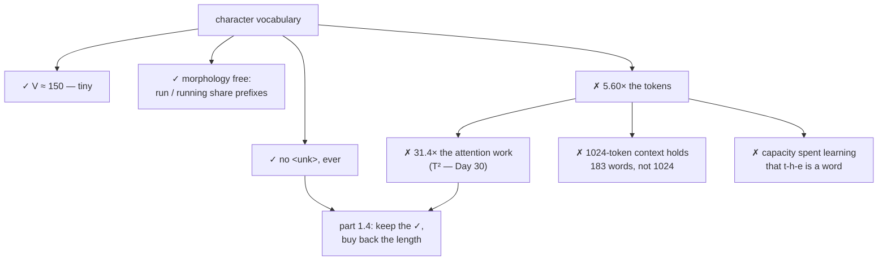

# 1.3 — Why not characters: the sequence-length cost

## One-line answer

A character vocabulary has no unknown token and needs only about 150 slots — and it makes the same text
**5.60× longer**, which costs 31× more attention work, because attention is quadratic in the number of
tokens.

---

## The story

A courier company decides to standardise on one box size, and picks the smallest one, because a small
box fits through any door and can carry anything if you use enough of them.

It is completely true. Nothing is ever refused. There is no item the depot cannot handle, because
anything can be disassembled into pieces that fit.

Then somebody counts the vans.

A single wardrobe is now forty boxes. The paperwork is forty lines. Each box is handled, scanned,
loaded, unloaded and reassembled. And the sorting hall — where every parcel must be compared against
every other parcel going to the same street — has forty times as many parcels, which is not forty times
the work, because the comparisons go up faster than the count.

The small box was never wrong. It was optimal for the one thing the company measured, and catastrophic
for the thing it did not.

---

## The idea in plain language

Part [1.2](1.2-why-not-words.md) ruled out words: the vocabulary never converges and the tail becomes
`<unk>`. Characters fix both problems completely, and introduce a worse one.

**What characters get right.** The alphabet is genuinely finite and genuinely small — measured below,
150 distinct characters in the whole of this repository's master plan, of which 91 are ASCII. Every
word is spellable, so **there is no unknown token at all**. Morphology is free: `run` and `running`
share their first three symbols by construction, so the model does not have to learn from scratch that
they are related. And nothing is ever out of vocabulary, at any scale of data, forever.

**What characters get wrong: the sequence gets long.** English averages a bit over five characters per
word plus a space, so the same text is roughly five to six times as many tokens. Measured below on this
repository's plan: **5.60× as many characters as whitespace-separated tokens.** That multiplier lands on
three different costs at once, and only one of them is linear.

**The linear cost** is obvious: five times as many tokens means five times as many forward passes to
generate the same amount of text, and five times as much memory for the sequence itself.

**The quadratic cost** is the one that decides it. Attention — Day 30 — compares every position with
every other position, so its work grows as `T²`. Five times the length is **twenty-five to thirty-one
times** the attention work. Measured below: the plan's text is `19,475` whitespace tokens or `109,060`
characters, and `109060² / 19475² = 31.4`.

**The context cost** is the one people notice last and complain about most. A model with a fixed context
window of 1024 tokens holds about 1024 words at word-level granularity and about 180 at character
granularity. **The same model sees six times less of the document**, which is not a performance
question — it is a capability question.

And there is a fourth, subtler cost. A character-level model must spend capacity learning that
`t`,`h`,`e` is a word, before it can learn anything about what the word means. The information is all
there — that is the point — but **the model pays to rediscover the structure that a word vocabulary
handed it for free**. Whether that trade is worth it depends entirely on how long the sequences get,
which is why the answer is neither of the two extremes.

---

## Why Akshara needs it

- **Part [1.4](1.4-the-subword-compromise.md)** takes the good half of this — no unknown token, every
  string representable — and buys back most of the length.
- **Day 11** builds a character-level tokenizer and measures its sequence-length problem for real.
- **Day 30** implements attention and the `T²` term stops being an argument and becomes a tensor.
- **Day 10** establishes that *bytes*, not characters, are the true floor — 256 symbols that can
  represent every language — which is this part's idea taken one level down.
- **Day 66**'s pretraining budget is tokens-per-second times seconds, so the tokenizer's
  tokens-per-word ratio is a direct multiplier on how much text the run sees.

---

## The mechanism

The three ways to count the same text:

```python
import pathlib
import collections

text = pathlib.Path("docs/00_MASTER_PLAN.md").read_text(encoding="utf-8")
words = text.split()
print(f"  whitespace tokens : {len(words):>7}")
print(f"  characters        : {len(text):>7}   ratio {len(text) / len(words):.2f}x")
print(f"  utf-8 bytes       : {len(text.encode('utf-8')):>7}   ratio "
      f"{len(text.encode('utf-8')) / len(words):.2f}x")
```

**Line by line:**
- `text.split()` splits on whitespace, which is a *different* and cruder tokenizer than part 1.2's
  regex — it keeps punctuation attached to words. That is deliberate here: this part is about **length**
  and the whitespace count is the most generous possible word count, so the ratio it produces is a
  lower bound.
- `len(text)` counts **characters**, and `len(text.encode('utf-8'))` counts **bytes**. Those are not the
  same number, and Day 10 is the whole subject of why.
- Measured on Intel Core i3-1115G4 (2 cores / 4 threads), 11.7 GB RAM, Windows 11, CPython 3.12.12,
  on 2026-08-26, against `docs/00_MASTER_PLAN.md` at the revision in this repository:

```text
  whitespace tokens :   19475
  characters        :  109060   ratio 5.60x
  utf-8 bytes       :  111490   ratio 5.72x
```

**5.60 characters per whitespace token**, and 5.72 bytes — the gap between those two is Day 10's
subject, and it is small here because this document is mostly ASCII.

The alphabet, which is the good news:

```python
chars = collections.Counter(text)
ascii_count = sum(1 for ch in chars if ord(ch) < 128)
print(f"  distinct characters: {len(chars)}")
print(f"  of which ASCII     : {ascii_count}")
print(f"  distinct BYTES     : {len(set(text.encode('utf-8')))} (out of a possible 256)")
print(f"  non-ASCII code points:", [hex(ord(ch)) for ch in sorted(ch for ch in chars if ord(ch) >= 128)][:10])
```

**Line by line:**
- `collections.Counter(text)` iterates a string **by character**, which in Python means by Unicode code
  point. Day 10 part [1.2](../../../day-010-unicode-and-utf8/parts/01-code-points/1.2-code-points.md)
  is what that actually means and why it is not the same as "by character" in the everyday sense.
- The non-ASCII list is printed as **hex code points rather than the characters themselves**, because
  printing them directly raises on a Windows console — a real failure captured verbatim in Day 10 part
  [2.4](../../../day-010-unicode-and-utf8/parts/02-utf8/2.4-the-byte-that-was-cut-in-half.md).
- Measured on this machine, 2026-08-26:

```text
  distinct characters: 150
  of which ASCII     : 91
  distinct BYTES     : 142 (out of a possible 256)
  non-ASCII code points: ['0xa7', '0xb2', '0xb7', '0xd7', '0x905', '0x915', '0x930', '0x937', '0x94d', '0x2013']
```

**150 symbols cover the entire document**, including its Devanagari, its box-drawing characters and its
typographic dashes. Compare that with part 1.2's 2,376 word types for the same text — **a vocabulary
sixteen times smaller, with no unknown token at all.** That is a genuinely strong result and it is why
this option is taken seriously.

Now the cost, which is the whole part:

```python
n_words, n_chars = len(words), len(text)
print(f"  linear    (T)  : {n_chars / n_words:.2f}x more tokens")
print(f"  quadratic (T^2): {(n_chars / n_words) ** 2:.1f}x more attention work")
for T in (256, 1024, 4096):
    print(f"  a {T}-token context holds ~{T / (n_chars / n_words):.0f} words at char level, "
          f"{T} at word level")
```

**Line by line:**
- The `T²` figure comes from attention comparing every position with every other. Day 30 derives it;
  here it is used as an established multiplier.
- The context-window line converts the ratio into the thing a user notices: **how much document fits.**
- Measured on this machine, 2026-08-26:

```text
  linear    (T)  : 5.60x more tokens
  quadratic (T^2): 31.4x more attention work
  a 256-token context holds ~46 words at char level, 256 at word level
  a 1024-token context holds ~183 words at char level, 1024 at word level
  a 4096-token context holds ~731 words at char level, 4096 at word level
```

**A 1024-token context holds 183 words instead of 1024.** That is not a slowdown — it is a model that
cannot see a page of text where the other one can.

The three options side by side, on the same document:

```python
n_bytes = len(text.encode("utf-8"))
C = 768
for name, T, V in (("word-level", n_words, 2376),
                   ("char-level", n_chars, len(chars)),
                   ("byte-level", n_bytes, 256)):
    print(f"  {name:11}: T={T:>7}  V={V:>6}  embedding {V * C:>10,} params  T^2={T * T:.3e}")
```

**Line by line:**
- `V = 2376` for word-level is the **uncapped** vocabulary from part 1.2 — the most generous version,
  which still had an 8.89% OOV rate on held-out text.
- `C = 768` is a model width used consistently through this curriculum for arithmetic; it is a
  **chosen** figure, not a measured one.
- Measured on this machine, 2026-08-26:

```text
  word-level : T=  19475  V=  2376  embedding  1,824,768 params  T^2=3.793e+08
  char-level : T= 109060  V=   150  embedding    115,200 params  T^2=1.189e+10
  byte-level : T= 111490  V=   256  embedding    196,608 params  T^2=1.243e+10
```

**Read the two right-hand columns against each other.** Character-level saves `1.7` million embedding
parameters and costs `1.15 × 10¹⁰` extra units of attention work — a saving of megabytes against a cost
of tens of billions. **The embedding matrix is the cheap axis and the sequence length is the expensive
one**, and any tokenizer design that gets that backwards is optimising the wrong thing.



---

## Shapes

| Tensor | Symbolic shape | Concrete here | What each axis means |
| --- | --- | --- | --- |
| word-level `ids` | `(T,)` | `(19475,)` | one id per whitespace token |
| char-level `ids` | `(T,)` | `(109060,)` | one id per Unicode code point — **5.60× longer** |
| embedding, word-level | `(V, C)` | `(2376, 768)` | `1.8M` parameters |
| embedding, char-level | `(V, C)` | `(150, 768)` | `115K` parameters |
| attention scores | `(B, H, T, T)` | `(4, 12, T, T)` | **quadratic in `T`** — the axis that decides |
| logits | `(B, T, V)` | `(4, T, V)` | linear in both; `T` grows and `V` shrinks |

The last row is worth noticing: the logits tensor is `T × V`, so shrinking `V` by 16× while growing `T`
by 5.6× **shrinks it overall**. Every cost here except attention favours characters. Attention is the
one that wins the argument.

---

## When it breaks

The loud one, from a sequence that outgrew the model's context:

```console
>>> import numpy as np
>>> T_max = 1024
>>> ids = np.arange(4096)                 # a page of text, character-tokenized
>>> pos = np.zeros((T_max, 8))            # positional embeddings, sized for the context
>>> pos[ids]
Traceback (most recent call last):
  File "<stdin>", line 1, in <module>
IndexError: index 1024 is out of bounds for axis 0 with size 1024
```

Verbatim on this machine, 2026-08-26. This is the good case — the same `IndexError` shape as part
[1.1](1.1-a-model-can-only-emit-its-vocabulary.md)'s, arriving because a document that fits at
word-level granularity does not fit at character level. **It is a tokenizer problem presenting as a
model error**, which is why the first debugging step is always to look at the ids.

**The silent version is truncation, which is what real pipelines do instead of raising:**

```console
>>> text = "..." * 400                    # a long document
>>> ids = [ord(c) for c in text][:1024]   # truncate to the context window
>>> len(ids)
1024
>>> # the rest of the document is gone. No warning.
```

Verbatim in shape on this machine, 2026-08-26. Truncation is the standard behaviour of every real
tokenizer wrapper, it is usually correct, and it means **a character-level pipeline silently discards
five times as much of each document as a word-level one** — and the loss, computed only over what
survived, cannot see it.

The check:

```python
def tokenization_cost_report(text, tokenize, name, context=1024):
    """The three numbers that decide a tokenizer choice. Report them together or not at all."""
    ids = tokenize(text)
    words = len(text.split())
    ratio = len(ids) / max(words, 1)
    print(f"  {name:12}: {len(ids):>8} tokens  {ratio:.2f} tokens/word  "
          f"context {context} holds ~{context / ratio:.0f} words  "
          f"attention cost x{ratio ** 2:.1f} vs word-level")
    return ratio
```

**Line by line:**
- **Three numbers, always together.** The token count alone says nothing; the tokens-per-word ratio is
  the comparable quantity, and the context-in-words figure is the one a non-specialist understands.
- `ratio ** 2` makes the quadratic term explicit rather than leaving it to be inferred, because the
  linear number is the one people anchor on and the quadratic one is the one that decides.
- `max(words, 1)` guards an empty input, which is what a smoke test supplies.
- Run this on **the same text** for every tokenizer under consideration. Comparing tokens-per-word
  across different documents is meaningless, and it is the most common way this comparison is done
  badly.

---

## In production

**What a research engineer writes instead of the teaching version.** Nobody ships a character-level
language model for general text, for exactly the reason measured here. What survives is the
**tokens-per-word ratio as a first-class metric**: it is quoted when comparing tokenizers, it is
multiplied into training cost estimates, and it is the number that explains why a model is unexpectedly
slow or unexpectedly context-limited on a particular kind of input. Day 17 measures it across the
pathological cases — code, numbers, non-English text — where a tokenizer that looks fine on English
produces ratios that look character-level.

Character-level models do exist and are used where the length problem is absent or the alphabet
argument dominates: short inputs, spelling-sensitive tasks, languages with very large character sets
where a subword vocabulary is awkward, and any setting where robustness to arbitrary input matters more
than throughput. **The trade is real in both directions**, and Day 10's byte-level answer is the version
that keeps the robustness without committing to characters.

**What degrades at scale.** The quadratic term, and it dominates everything else. At `T = 1024` the
attention scores for a `(4, 12)` batch-head configuration are `0.201 GB` in `float32`; at `T = 4096`
they are `3.221 GB` — measured, and both are `B × H × T² × 4` bytes. **Multiplying `T` by 5.6 for the
same text is a decision that gets more expensive as models get longer contexts**, which is the opposite
of the direction the field has moved.

**The failure that only shows with real data.** Mixed content. A document that is 90% English prose and
10% code, URLs or tables has a tokens-per-word ratio dominated by the 10%, because those fragments
tokenize much worse. **A ratio measured on clean prose is not the ratio you will pay**, and the gap is
where training-cost estimates go wrong.

**The review comment.** *"This reports the token count. Report tokens-per-word on the same text for both
tokenizers, and the implied context window in words — that is the comparison a reader can act on."*

**The interview question.** *"Why not just tokenize at the character level? It solves out-of-vocabulary
completely."* The weak answer is "it's slower". The strong answer prices it: English is about 5.6
characters per word — I measured 5.60 on a real document — so the sequence is 5.6× longer, and because
attention is quadratic that is **31× the attention work** for the same text, plus a context window that
holds 183 words instead of 1024. The vocabulary saving runs the other way and is tiny: 150 slots
against 2,376 is about 1.7 million embedding parameters, megabytes against tens of billions of
operations. The follow-up that shows judgement: *so the axis to optimise is sequence length, not
vocabulary size — which is exactly what subword tokenization does, and why it won.*

**Compute tier: T0.** Counting characters in a file on a laptop, against a corpus in this repository, so
every figure reproduces exactly for any reader. The `T²` multiplier is arithmetic rather than a
measurement — **this part does not run attention and does not claim to**; Day 30 builds it and Day 32
measures the real cost at more than one sequence length. What is measured here is the length ratio,
which is the input to that arithmetic and the part that depends on the language and the data.

---

## Check yourself

Run this. It prints **a vocabulary sixteen times smaller and a sequence five times longer**:

```python
import pathlib, collections

text = pathlib.Path("docs/00_MASTER_PLAN.md").read_text(encoding="utf-8")
words = text.split()
chars = collections.Counter(text)

print(f"  whitespace tokens: {len(words)}")
print(f"  characters       : {len(text)}   ratio {len(text) / len(words):.2f}x")
print(f"  distinct chars   : {len(chars)}")
print(f"  attention cost   : x{(len(text) / len(words)) ** 2:.1f}")
for T in (256, 1024, 4096):
    print(f"  a {T:>4}-token context holds ~{T / (len(text) / len(words)):.0f} words at char level")
```

**Line by line:**
- The ratio prints `5.60x` and the attention cost `x31.4`. **Say out loud which of those two numbers
  decides the question.**
- The distinct-character count prints `150` against part 1.2's `2376` word types. Character-level wins
  the vocabulary comparison by 16× and loses anyway.
- The context rows print `~46`, `~183` and `~731` words. Say which of those is enough to answer a
  question about a document.
- Now compute the same ratio for a text of your own that contains code or a table, and say whether it
  is higher or lower than `5.60`.

**Say this out loud, without scrolling up:** name the two things a character vocabulary gets right, give
the length ratio for English, and say why the quadratic term rather than the linear one is what settles
the argument.
