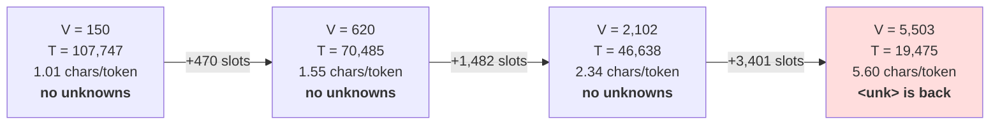

# 1.4 — The subword compromise: frequent pieces whole, rare pieces spelled

## One-line answer

Keep the pieces that occur constantly as single tokens and spell everything else out of smaller
pieces — which buys back most of the sequence length that characters cost, while keeping the property
that made characters attractive: **nothing is ever unrepresentable**.

---

## The story

Think about coins and notes.

Imagine a currency that had only one-rupee coins. Every price in the country is payable, and no shop
can ever refuse you, because any amount at all can be made out of ones. Then you go and pay a ₹500
bill and count out five hundred coins onto the counter.

Now imagine the opposite currency: a separate note printed for every price anybody has ever charged. A
₹347 note. A ₹1,299 note. Paying is always one note, handed over in one second. But new prices appear
every single day, and the mint can never finish printing, and the note you need is the one that does
not exist yet.

What every real currency does is neither of those. It keeps a small handful of denominations — 1, 2,
5, 10, 20, 50, 100, 500 — chosen so that the amounts people actually pay come out in three or four
pieces. And it keeps the one-rupee coin at the bottom of the set, so that **anything at all is still
payable**, however odd the amount.

Nobody picked those denominations by arguing about principles in a room. Somebody looked at what
people actually buy.

---

## The idea in plain language

Part [1.2](1.2-why-not-words.md) ruled out words: the vocabulary never converges, and everything you
cut becomes `<unk>`. Part [1.3](1.3-why-not-characters.md) ruled out characters: nothing is ever
unknown, and the sequence gets 5.6× longer, which costs 31× the attention work.

Both of those are extremes of one dial, and the dial is: **how big is a token allowed to be?**

- Turn it all the way down and a token is one character. `V` is tiny, `T` is enormous, and coverage is
  perfect.
- Turn it all the way up and a token is one word. `V` is unbounded, `T` is small, and coverage is
  impossible.

A **subword** vocabulary sits in the middle, and it does so with two rules:

**Rule one — frequent pieces get their own slot.** `the`, `ing`, `tion`, ` model` occur constantly.
Giving each of them one token turns four or eight characters into one, and those are the pieces that
occur often enough to be worth a slot.

**Rule two — the smallest pieces are always in the vocabulary.** Every single character (Day 10 will
sharpen this to every *byte*) keeps its own token, permanently, no matter how rare. This is the
one-rupee coin. It is what guarantees that **there is no such thing as an unrepresentable input**, and
it is the whole reason the `<unk>` problem disappears rather than shrinking.

Put those together and you get the property that makes the scheme work: a common word is one token, a
rare word is a handful of tokens, and a string of random noise is one token per character. **The cost
degrades gracefully instead of failing.** A word vocabulary fails at exactly the moment it meets
something new; a subword vocabulary just gets a bit longer.

Two terms, defined now:

- **Subword tokenization** is any scheme whose vocabulary contains pieces smaller than a word and
  larger than a character, together with the smallest pieces as a fallback.
- The **compression ratio** is characters per token. Character-level is 1.0 by definition. Word-level
  on English is around 5.6 (measured in [1.3](1.3-why-not-characters.md)). Subword schemes land in
  between, and *where* they land is the thing you are buying with vocabulary slots.

What this part does **not** do is tell you which pieces to keep. That is the learned part, and it is
Day 12's byte-pair encoding. What is built here is a deliberately crude stand-in — keep the `N` most
frequent whole words, spell everything else — so that the *shape* of the trade-off is visible with a
rule you could write on a napkin, before the real algorithm arrives (Principle 3).

---

## Why Akshara needs it

- **Day 12 and Day 13** build byte-pair encoding, which is exactly rule one implemented properly:
  instead of guessing which pieces are frequent, it discovers them by repeatedly merging the commonest
  adjacent pair. Everything BPE does is a better answer to the question this part asks. Arriving at
  Day 12 without having felt the trade-off makes BPE look like an arbitrary algorithm rather than the
  obvious response to a measured problem.
- **Day 10** replaces "every character is in the vocabulary" with "every *byte* is in the vocabulary",
  which is the version that actually holds for text nobody has seen — including text in scripts the
  vocabulary was never built for. Rule two is what Day 10 is fixing.
- **Day 17** measures a real tokenizer's compression ratio on code, numbers and non-English text, and
  the numbers there are bad in ways this part predicts: the further the input is from what the
  vocabulary was chosen for, the closer the scheme slides back towards character-level.
- **Day 39 onward**, `V` and `T` are both in the model's memory arithmetic, and they move in opposite
  directions along this dial. Every "will this fit" question from Day 66 is a point on the curve
  measured below.

---

## The mechanism

The crude stand-in for a learned vocabulary, in twelve lines. Keep the `n` most frequent whitespace
tokens whole; spell everything else one character at a time.

```python
import collections
import pathlib

text = pathlib.Path("docs/00_MASTER_PLAN.md").read_text(encoding="utf-8")
words = text.split()
counts = collections.Counter(words)
chars = sorted(set(text))


def keep_top_n(n: int) -> tuple[int, int]:
    """Keep the n commonest words whole, spell the rest. Return (V, T)."""
    kept = {w for w, _ in counts.most_common(n)}
    vocab = set(chars) | kept                       # rule two: every character stays
    length = sum(1 if w in kept else len(w) + 1 for w in words)
    return len(vocab), length
```

**Line by line:**
- `text.split()` is the **whitespace** convention, the same one part
  [1.3](1.3-why-not-characters.md) used, so the numbers here chain directly onto its `5.60×`. Part
  [1.2](1.2-why-not-words.md) used a different convention — lowercased alphabetic runs — which is why
  its type counts are smaller. **Two conventions, two sets of numbers, and saying which one you are
  using is not pedantry**; it is the difference between comparable measurements and incomparable ones.
- `vocab = set(chars) | kept` is **rule two, and it is the load-bearing line**. The characters go in
  unconditionally, before anything else is considered. Delete this line and you have rebuilt the word
  vocabulary of part 1.2, `<unk>` and all.
- `len(w) + 1` is the cost of spelling a word out: one token per character, plus one for the space
  that follows it. Spaces are cheap to forget and they are a real part of the sequence — Day 13's
  regex pre-tokenizer is largely about where the space goes.
- `counts.most_common(n)` is the crude part. It ranks by raw frequency, so it will happily spend a
  slot on a common word and none on a common *suffix* like `ing`, which is exactly the thing a learned
  vocabulary would find. That gap is the argument for Day 12.

Now turn the dial and watch both numbers move:

```python
import math

print(f"{'kept words':>11} {'V':>7} {'T':>8} {'chars/token':>12} {'ln(V)':>7}")
for n in (0, 100, 500, 2000, 4000, len(counts)):
    v, t = keep_top_n(n)
    print(f"{n:>11} {v:>7} {t:>8} {len(text) / t:>12.2f} {math.log(v):>7.3f}")
```

**Line by line:**
- `n = 0` keeps no words at all, so this row *is* character-level. `n = len(counts)` keeps every word,
  so that row *is* word-level. **The two extremes of the previous two parts are the two ends of this
  one table**, which is the point of building it this way.
- `chars/token` is the compression ratio: how many characters of text one token carries. Higher is a
  shorter sequence.
- `ln(V)` is the loss of a freshly-initialised model in nats — Day 6 part
  [3.2](../../../day-006-entropy-cross-entropy-perplexity/parts/03-kl-and-perplexity/3.2-perplexity.md).
  It is in the table because **growing the vocabulary raises the number your loss curve starts from**,
  and comparing loss across two tokenizations without noticing that is part
  [3.3](../../../day-006-entropy-cross-entropy-perplexity/parts/03-kl-and-perplexity/3.3-the-perplexity-that-improved.md)'s
  bug all over again.
- Measured on Intel Core i3-1115G4 (2 cores / 4 threads), 11.7 GB RAM, Windows 11, CPython 3.12.12, on
  2026-08-26, against `docs/00_MASTER_PLAN.md` at the revision in this repository — 19,475 whitespace
  tokens, 109,060 characters, 150 distinct characters:

```text
 kept words       V        T  chars/token   ln(V)
          0     150   107747         1.01   5.011
        100     238    86242         1.26   5.472
        500     620    70485         1.55   6.430
       2000    2102    46638         2.34   7.651
       4000    4096    30343         3.59   8.318
       5411    5503    19475         5.60   8.613
```

Read the table as a purchase. **The first 500 slots are extraordinary value**: `V` goes from 150 to
620 — 470 slots — and `T` falls by 35%, from 107,747 to 70,485. The next 1,500 slots buy another 34%.
By the time you are spending 4,000 slots you are buying 3.59 characters per token, and the last 1,411
slots — every remaining word in the document — buy the jump from 3.59 to 5.60 and bring back
every out-of-vocabulary failure of part [1.2](1.2-why-not-words.md) with them.

The shape of that curve, which is the thing to carry forward:



The diminishing returns are the whole reason a real tokenizer's vocabulary is in the tens of thousands
rather than the millions: past a point, slots stop buying length.

---

## When it breaks

**The loud failure — a vocabulary with no fallback.** Delete rule two and the scheme is a word
vocabulary wearing a disguise:

```console
>>> kept = {w for w, _ in counts.most_common(2000)}
>>> stoi = {w: i for i, w in enumerate(sorted(kept))}      # no characters!
>>> [stoi[w] for w in "the tokenizer works".split()]
Traceback (most recent call last):
  File "<stdin>", line 1, in <module>
  File "<stdin>", line 1, in <listcomp>
KeyError: 'tokenizer'
```

What it means: `tokenizer` is not in the top 2,000 words of this document, and without the character
fallback there is nothing smaller to fall back **to**. The fix is not a bigger `n`. It is the line you
deleted.

**The silent failure, and it is the one to watch for.** Nothing raises. You keep rule two, so
everything encodes, and the compression ratio you report is measured on the text you built the
vocabulary from. Then real input arrives that is unlike that text — a different language, a table of
numbers, a stack trace — and every piece of it falls through to the character fallback:

```python
for probe in ("the model that", "षड्दर्शन", "0x7f3a91cc", "the tokenizer works"):
    kept = {w for w, _ in counts.most_common(2000)}
    t = sum(1 if w in kept else len(w) + 1 for w in probe.split())
    print(f"  {probe!r:24} {len(probe):>4} chars -> {t:>4} tokens   {len(probe) / t:.2f} chars/token")
```

**Line by line:**
- Every probe **encodes successfully**. There is no error, no warning, and no `<unk>`. That is rule two
  working exactly as designed, and it is also why the problem is invisible.
- The ratio is the thing that moves. On text like the corpus it is around 2.34; on a string the
  vocabulary has never seen, it collapses towards 1.0 — which is character-level, which is 31× the
  attention work of part [1.3](1.3-why-not-characters.md), silently, on that input only.
- **A compression ratio measured on your training text is a best case, not a typical case.** Day 17
  measures the gap on real pathological inputs, and this is the mechanism behind every number there.
- Measured on this machine, 2026-08-26:

```text
  'the model that'           14 chars ->    3 tokens   4.67 chars/token
  'षड्दर्शन'                  8 chars ->    9 tokens   0.89 chars/token
  '0x7f3a91cc'               10 chars ->   11 tokens   0.91 chars/token
  'the tokenizer works'      19 chars ->    8 tokens   2.38 chars/token
```

  Read the last column. Familiar English gets `4.67`; a word the vocabulary happens not to hold drags
  the same kind of English down to `2.38`; and the Devanagari and the hexadecimal string come out
  **below 1.0**, because spelling a word costs one token per character *plus one for the space*. That
  is worse than character-level, on input that raised no error at all.

**The failure that looks like a win.** You increase `n`, the sequence gets shorter, training gets
faster, and the loss goes *down* — and some of that fall is not learning at all. A shorter sequence in
the same number of steps means fewer predictions, and a bigger `V` means a different `ln(V)` floor.
Part
[3.3](../../../day-006-entropy-cross-entropy-perplexity/parts/03-kl-and-perplexity/3.3-the-perplexity-that-improved.md)
measured a factor of 42 in perplexity from nothing but a tokenization change. **Any loss number
compared across two tokenizers is comparing two different quantities**, and the only honest
cross-tokenizer comparison is per *character* or per *byte*.

---

## In production

**What a research engineer writes instead of the teaching version.** Nobody writes `keep_top_n`. They
call a trained tokenizer and treat its vocabulary as a fixed artefact of the run. What they carry from
this part is the *dial*: when somebody proposes changing the vocabulary size, the engineer's first
question is "what does that do to tokens-per-word on our actual data, and what does it do to the
embedding and output matrices" — because those two answers move in opposite directions and the right
choice depends on which is scarcer.

The rule-two habit shows up in reviews as a specific question: **"what happens to input this
vocabulary has never seen?"** A scheme whose answer is "an exception" or "`<unk>`" gets sent back. A
scheme whose answer is "it gets longer" is accepted, and the follow-up is "how much longer, measured
on the worst input we actually receive".

**What degrades at scale.** The embedding and output matrices. At `C = 768`, a vocabulary of 2,102
costs `2102 × 768 = 1,614,336` parameters per matrix; a vocabulary of 32,000 costs `24,576,000` —
93.8 MiB in `float32` for the embedding alone, and the same again for the output head unless the two
are tied. That is arithmetic on this page, not a benchmark. **At small model sizes the vocabulary
matrices are the largest single item in the model**, which is why very small models use very small
vocabularies and why the choice is not free.

**The failure that only shows with real data.** Multilingual corpora. A vocabulary whose frequent
pieces were learned mostly from one language spends almost all its slots on that language, so every
other language falls back towards the character level — and pays several times more tokens for the
same meaning. The users of those languages experience it as a smaller context window, a higher price
per request and a worse model, from a change nobody made on purpose. Day 17 measures this directly.

**The review comment.** *"You raised the vocabulary from 8k to 32k and the loss went down. Report loss
per character as well as per token, and report tokens-per-word on the eval set — otherwise I cannot
tell how much of that is the model and how much is the tokenizer."*

**The interview question.** *"Why is subword tokenization the standard rather than words or
characters?"* The weak answer is "it's a compromise". The strong answer names both failures precisely
— words never converge and produce `<unk>`, characters produce a 5.6× longer sequence and 31× the
attention work — and then names the property that makes subword different in kind rather than merely
in between: **the smallest units stay in the vocabulary, so coverage is total, and the cost of unusual
input is extra length rather than lost information.** The follow-up that shows judgement: *and that
means the compression ratio is data-dependent, so the number you quote has to come from the data you
actually serve.*

**Compute tier: T0.** Counting words in a file on a laptop. Everything in this part is exact
arithmetic over a corpus in this repository, so every figure reproduces for any reader. What is *not*
measured here is whether a subword model trains better — that needs a training run, and the honest
version of that comparison is Day 17. This part measures only the length and vocabulary trade, which
is the input to that question.

---

## Check yourself

Run this. It prints **six rows, and the first and last are the two previous parts**:

```python
import collections, math, pathlib

text = pathlib.Path("docs/00_MASTER_PLAN.md").read_text(encoding="utf-8")
words = text.split()
counts = collections.Counter(words)
chars = set(text)

for n in (0, 500, 2000, len(counts)):
    kept = {w for w, _ in counts.most_common(n)}
    V = len(chars | kept)
    T = sum(1 if w in kept else len(w) + 1 for w in words)
    print(f"  n={n:>5}  V={V:>5}  T={T:>7}  {len(text)/T:.2f} chars/token  ln(V)={math.log(V):.3f}")
```

**Line by line:**
- The `n = 0` row prints `V=150` and `1.01` chars/token. That is part 1.3's character-level, and the
  `1.01` rather than `1.00` is the spaces being counted as tokens.
- The `n = 5411` row prints `5.60` chars/token, which is part 1.3's measured ratio for this corpus.
  **Two parts, two methods, the same number** — that agreement is the check.
- The middle rows are the point. Say out loud how many slots it took to halve the sequence length, and
  whether you would spend them.
- Now change the `+ 1` in `len(w) + 1` to `+ 0` and re-run. The ratios all move. Say why, and say which
  version is the honest one.

**Say this out loud, without scrolling up:** name the two rules a subword vocabulary follows, say which
of the two makes `<unk>` disappear rather than merely shrink, and say what happens to the sequence
length when input arrives that the vocabulary was never built for.
