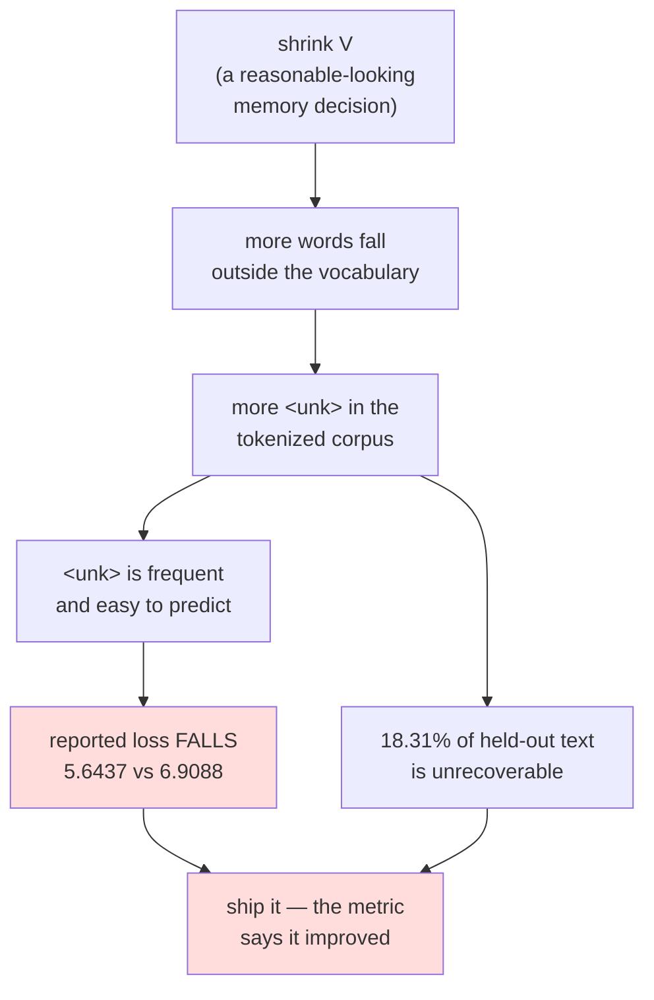

# 1.5 — 💥 The vocabulary that could not spell

## One-line answer

An `<unk>` token does not lose a little information, it loses **all** of it for that word — and
because `<unk>` is one of the easiest tokens in the corpus to predict, adding more of them makes the
reported loss go **down**: measured here, a 1,000-word vocabulary turns 18.31% of held-out tokens into
`<unk>` and drops the uniform-baseline loss from `6.9088` nats to `5.6437`, an 18% improvement bought
entirely by destroying text.

---

## The story

A photocopier in an office has a fault. Any character it cannot handle — an accent, a symbol, a
letter from another alphabet — comes out as a solid black square.

Most days nobody notices, because most pages are ordinary English and there is nothing for it to
choke on. The copies look perfect.

Then somebody copies a page of chemistry notes and gets back a page with fourteen black squares on
it. Not a smudged formula, not a faint formula. A black square where a formula used to be.

The important thing is what the black square does **not** tell you. It does not say which symbol it
replaced. It does not say whether it replaced one symbol or a whole word. Two completely different
formulas, copied on two different days, come back as the same black square, and there is no way to
work backwards from the copy to either of them.

And here is the part that makes it dangerous rather than merely annoying. Somebody is asked to check
how faithful the copies are, and they do it by comparing each copy against the last copy of the same
page. The black squares match perfectly, every time. **The check passes, and it passes more easily on
exactly the pages that were damaged most.**

---

## The idea in plain language

Part [1.2](1.2-why-not-words.md) established that a word vocabulary must throw away its tail, and that
whatever it throws away becomes a single token conventionally written `<unk>` — short for *unknown*.
Part [1.4](1.4-the-subword-compromise.md) showed the fix. This part is about why the problem is worse
than "some words are missing", and it has three layers.

**Layer one: `<unk>` is not a degraded word, it is the absence of a word.** When a tokenizer maps
`tokenizer`, `Bengaluru` and `0x7f3a` all onto the same `<unk>` id, those three inputs become
*identical* from the model's point of view. Nothing downstream can distinguish them. The embedding row
for `<unk>` is a single vector that has to stand in for every rare thing in the language at once, so
the one thing it cannot mean is anything in particular.

**Layer two: a word model cannot spell its way out.** This is the difference between word-level and
everything after it. If your vocabulary contains characters or bytes, an unfamiliar word costs you
extra tokens — and the information survives. If your vocabulary is words and only words, there is no
smaller unit to fall back on. A word-level model that has never seen `tokenizer` **cannot produce it,
ever, by any route**, no matter how much you train it, because there is no sequence of its tokens that
spells it.

**Layer three — and this is the one that makes it a silent failure: `<unk>` is easy.** A language model
is scored on how surprised it is by the next token. `<unk>` is, by construction, one of the most
frequent tokens in the tokenized corpus — it absorbs the entire tail. It is also highly predictable
from context, because rare words cluster in exactly the places rare words appear. So a model that
learns "when in doubt, say `<unk>`" is rewarded for it, and the reward shows up in the number everybody
is watching.

That gives the failure its shape, and it is Silent Failure #4 from the plan's §6 wearing a different
coat:

> **Shrink the vocabulary → more `<unk>` → the reported loss improves → the model got worse.**

Every step in that chain is real, and no step in it raises an error.

---

## Why Akshara needs it

- **Day 10 and Day 13** end the problem for good by putting **bytes** at the bottom of the vocabulary.
  This part is the reason that decision is not a detail: a byte-level fallback means the `<unk>` token
  can be removed from the design entirely, and a design with no `<unk>` cannot have this failure.
- **Day 6 part [2.5](../../../day-006-entropy-cross-entropy-perplexity/parts/02-cross-entropy/2.5-the-loss-that-counted-padding.md)**
  is the same shape with padding instead of `<unk>` — an easy token diluting the average and making a
  worse model report a better number. Two different causes, one mechanism. Recognising the pattern is
  worth more than remembering either instance.
- **Day 17** evaluates a real tokenizer, and one of its checks exists because of this part: report the
  fraction of eval tokens that hit any fallback path, alongside the loss, always.
- **Day 25 onward**, every loss curve in this curriculum is compared against `ln(V)` at step zero. If
  `V` changed between two runs, that floor changed too, and comparing the curves without saying so is
  this bug in reporting rather than in code.

---

## The mechanism

Reproduce it in three steps. First, build the vocabulary honestly — from the training half only, with
a size cap, exactly as anybody would:

```python
import collections
import pathlib
import re

text = pathlib.Path("docs/00_MASTER_PLAN.md").read_text(encoding="utf-8")
words = [w.lower() for w in re.findall(r"[A-Za-z']+", text)]      # (N,)
split = int(len(words) * 0.8)
train, test = words[:split], words[split:]
train_counts = collections.Counter(train)

for V in (500, 1000, 2000):
    keep = {w for w, _ in train_counts.most_common(V)}
    unk = [w for w in test if w not in keep]
    print(f"  V={V:>5}  <unk> {len(unk):>5}/{len(test)} = {len(unk) / len(test):.2%}"
          f"   distinct words destroyed: {len(set(unk))}")
```

**Line by line:**
- The convention is part [1.2](1.2-why-not-words.md)'s — lowercased alphabetic runs — so these numbers
  chain onto its `14,798` tokens and `2,376` types rather than onto part 1.4's whitespace counts.
- The split is **by position**. The test half is text that comes after the training half in the same
  document, which is the closest a single file gets to held-out data. Shuffling first would leak.
- `train_counts.most_common(V)` counts frequencies on the **training half only**. Counting them on the
  whole corpus would let the vocabulary see the test set, which is the mistake this line exists to
  avoid.
- `len(set(unk))` is the number of *distinct* words destroyed, which is the number that matters for the
  damage. `len(unk)` counts occurrences.
- Measured on Intel Core i3-1115G4 (2 cores / 4 threads), 11.7 GB RAM, Windows 11, CPython 3.12.12, on
  2026-08-26, against `docs/00_MASTER_PLAN.md` at the revision in this repository:

```text
  V=  500  <unk>   880/2960 = 29.73%   distinct words destroyed: 551
  V= 1000  <unk>   542/2960 = 18.31%   distinct words destroyed: 395
  V= 2000  <unk>   336/2960 = 11.35%   distinct words destroyed: 262
```

Second, look at what the text becomes. This is the black square:

```python
keep = {w for w, _ in train_counts.most_common(1000)}
sample = test[120:150]
print("  original:", " ".join(sample))
print("  decoded :", " ".join(w if w in keep else "<unk>" for w in sample))
print("  destroyed:", sum(1 for w in sample if w not in keep), "of", len(sample))
```

**Line by line:**
- `test[120:150]` is an arbitrary thirty-word window, chosen before looking at the result rather than
  after. Choosing the window that makes the point best would be a different and dishonest exercise.
- The "decoded" line is what the model **would** emit at its very best: every in-vocabulary word
  perfect, every out-of-vocabulary word gone.
- Measured on this machine, 2026-08-26:

```text
  original: free notebook gpu or t parked cannot be done at and what the t version proves what the hub lesson md must contain the hub is orientation and assembly never
  decoded : free notebook gpu or t parked cannot be done at and what the t version <unk> what the hub lesson md must <unk> the hub is <unk> and <unk> never
  destroyed: 4 of 30
```

Read what was destroyed: `proves`, `contain`, `orientation`, `assembly`. **Every one is an ordinary
English word, and every one is a verb or a noun carrying the sentence's actual content.** The words
that survived are `the`, `and`, `is`, `what`, `at`. That is not bad luck — part
[1.2](1.2-why-not-words.md) predicted it: a vocabulary chosen by frequency keeps the function words
and discards the informative ones.

Third — the part that makes it silent. Price what `<unk>` does to the reported loss:

```python
import math

keep = {w for w, _ in train_counts.most_common(1000)}
p_unk = sum(1 for w in test if w not in keep) / len(test)
uniform = math.log(1001)                      # ln(V + 1), the step-zero floor from Day 6

print(f"  P(<unk>) on held-out text : {p_unk:.4f}")
print(f"  uniform over V+1          : {uniform:.4f} nats")
print(f"  with <unk> predicted free : {(1 - p_unk) * uniform:.4f} nats"
      f"   ({p_unk:.2%} lower)")
```

**Line by line:**
- `math.log(1001)` is `ln(V + 1)` — the `+1` is the `<unk>` slot itself, which is a real vocabulary
  entry and has to be counted. Day 6 part
  [3.2](../../../day-006-entropy-cross-entropy-perplexity/parts/03-kl-and-perplexity/3.2-perplexity.md)
  established this as the loss of a model that has learned nothing.
- `(1 - p_unk) * uniform` is the loss of a model that has learned **exactly one thing**: to predict
  `<unk>` with certainty wherever `<unk>` occurs, and nothing at all anywhere else. It is a
  deliberately stupid model, and it is the floor this bug pushes the number down to.
- Measured on this machine, 2026-08-26:

```text
  P(<unk>) on held-out text : 0.1831
  uniform over V+1          : 6.9088 nats
  with <unk> predicted free : 5.6437 nats   (18.31% lower)
```

**An 18% improvement in the reported loss, from a model that has learned nothing except how to say
"I don't know".** Shrink the vocabulary to 500 and `p_unk` rises to 29.73%, so the same trick buys
nearly 30%. The direction is unambiguous: **the more text you destroy, the better the number gets.**

The whole chain in one picture:



---

## When it breaks

**There is no loud failure. That is the entire problem.** Nothing raises, nothing warns, and the number
on the dashboard moves in the direction everybody wants. To make the point concretely, here is the
scheme working exactly as designed:

```console
>>> keep = {w for w, _ in train_counts.most_common(1000)}
>>> encode = lambda s: [w if w in keep else "<unk>" for w in s.lower().split()]
>>> encode("the abstraction breaks the acceptance")
['the', '<unk>', 'breaks', 'the', '<unk>']
>>> encode("the anecdote breaks the analogy")
['the', '<unk>', 'breaks', 'the', '<unk>']
```

Two completely different sentences, one identical token sequence, no error. **Any model trained on
this corpus is being asked to treat those two sentences as the same sentence**, and it will, because
they are.

**The check that catches it, and it is one line.** Report the fallback rate next to the loss, always:

```python
def loss_report(loss_nats: float, tokens: list[str], unk_token: str = "<unk>") -> None:
    """Never report a loss without the fraction of tokens that hit the fallback path."""
    n_unk = sum(1 for t in tokens if t == unk_token)
    frac = n_unk / max(len(tokens), 1)
    print(f"  loss {loss_nats:.4f} nats over {len(tokens)} tokens"
          f"   <unk> rate {frac:.2%}")
    if frac > 0.01:
        print(f"  WARNING: {frac:.2%} of tokens are <unk> — this loss is not comparable "
              f"to a run with a different <unk> rate")
```

**Line by line:**
- The two numbers are printed by the **same function**, so they cannot become separated in a log, a
  spreadsheet or a summary slide. A fallback rate that lives in a different file from the loss is a
  fallback rate nobody reads.
- `max(len(tokens), 1)` guards the empty batch a smoke test supplies.
- The threshold of `1%` is a choice for this curriculum, not a law, and it is deliberately low: at 1%
  the effect on the loss is already larger than most of the improvements anybody celebrates.
- The warning says **"not comparable"**, not "too high". A 30% `<unk>` rate is fine if that is genuinely
  what your data looks like and you say so. What is never fine is comparing a 30% run against a 5% run
  and calling the difference progress.

**The variant that survives into modern systems.** `<unk>` is mostly gone, but its shape is not. Any
token that means "something I cannot represent" — a truncation marker, a replacement character, a
`<pad>`, a filtered-out span — has exactly these properties: frequent, easy, and information-destroying.
The habit to keep is not "never use `<unk>`". It is: **for every token in your vocabulary, ask whether
predicting it is easy, and whether it stands in for something that was thrown away. If both, it will
flatter your loss.**

---

## In production

**What a research engineer writes instead of the teaching version.** Nobody designs an `<unk>` token
today; byte-level fallback removed the need (Day 10). What survives is the *reflex*: when a metric
improves after a change to the data pipeline rather than to the model, the first question is **"what
fraction of the eval set is now a special token?"** — and the second is "is the eval set still the same
set of characters it was before?". Both questions have caught real regressions, and both are cheap.

The other survival is in vocabulary-size decisions. A proposal to halve `V` to save embedding memory is
evaluated on two axes, not one: the memory saved, and the fraction of real traffic that now tokenizes
worse. The second number is measured on production traffic, not on the training corpus, because the
gap between those two is where this failure lives.

**What degrades at scale.** The damage concentrates rather than spreading. Rare words are not spread
evenly through a corpus — they cluster in technical documents, in non-English text, in code, in names.
So a fixed `<unk>` rate of 5% overall can be 0.5% on ordinary prose and 40% on the subset of documents
that mattered. **An average fallback rate hides the distribution**, and the honest report is the rate
per document type, or at minimum the worst decile.

**The failure that only shows with real data.** Proper nouns. A model evaluated on a benchmark of
general prose can have a low `<unk>` rate and be entirely unable to say any user's name, any city
outside the top few hundred, any product, any identifier. The benchmark cannot see it because the
benchmark does not contain those things. Every user sees it in their first sentence.

**The review comment.** *"This loss is 8% lower than last week's. Last week's tokenizer had a 4,000-word
vocabulary and this one has 1,000 — what is the `<unk>` rate on the eval set in both runs? Until I see
those two numbers I cannot tell whether the model improved."*

**The interview question.** *"You shrink the vocabulary and the validation loss goes down. Is that
good?"* The weak answer is yes. The strong answer is: **it depends entirely on what happened to the
`<unk>` rate**, because `<unk>` is a frequent, easy, information-destroying token, and pushing more
text into it lowers the average surprise while making the model strictly less capable — measured on a
real corpus, an 18% `<unk>` rate buys an 18% reduction in the uniform-baseline loss on its own. The
follow-up that shows judgement: *so the comparable quantity across two tokenizations is loss per
character or per byte, not per token — and the fallback rate belongs on the same line as the loss.*

**Compute tier: T0.** Counting words in a file on a laptop, against a corpus committed to this
repository, so every number here reproduces exactly. What is **not** measured here is a trained model —
the `5.6437` figure is the loss of an explicitly-described stupid model, computed as arithmetic and
labelled as such, not the result of a training run. Day 25 runs the real version. The arithmetic is
enough to establish the *direction*, which is the claim this part makes.

---

## Check yourself

Run this. It prints **three rows in which the loss falls as the damage rises**:

```python
import collections, math, pathlib, re

text = pathlib.Path("docs/00_MASTER_PLAN.md").read_text(encoding="utf-8")
words = [w.lower() for w in re.findall(r"[A-Za-z']+", text)]
split = int(len(words) * 0.8)
train, test = words[:split], words[split:]
tc = collections.Counter(train)

for V in (2000, 1000, 500):
    keep = {w for w, _ in tc.most_common(V)}
    p = sum(1 for w in test if w not in keep) / len(test)
    floor = math.log(V + 1)
    print(f"  V={V:>5}  <unk> {p:>6.2%}   uniform {floor:.4f} -> reported {(1 - p) * floor:.4f} nats")
```

**Line by line:**
- The rows print `11.35%`, `18.31%` and `29.73%` for the `<unk>` rates. **Read down the last column and
  say out loud which model you would ship.**
- The `uniform` column falls too, because `ln(V + 1)` falls with `V` — so a smaller vocabulary looks
  better for a second, entirely separate reason. Two effects, same direction, neither of them learning.
- Now compute loss per *character* instead: divide each number by the average characters per token for
  that vocabulary. Say whether the ordering survives.
- Finally, print `sorted(set(w for w in test if w not in keep))[:20]` for `V = 1000` and read the list
  aloud. Say whether a model that cannot produce any of those words is one you would call finished.

**Say this out loud, without scrolling up:** explain in one sentence why shrinking a vocabulary can make
a loss curve look better, name the one number that has to be reported alongside the loss for that
number to mean anything, and say why a byte-level fallback makes the whole failure impossible rather
than merely rarer.
