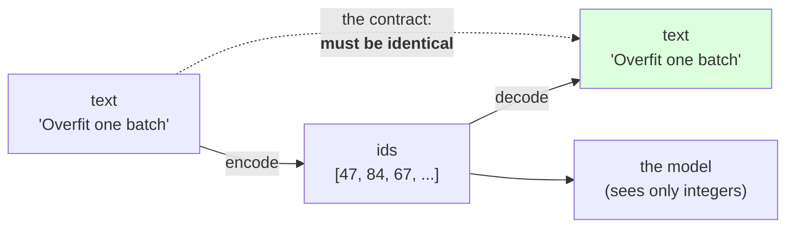

# 2.1 — A tokenizer is a function and its inverse

## One-line answer

A tokenizer is exactly two functions — `encode: str → list[int]` and `decode: list[int] → str` — and
the only property that makes it a tokenizer rather than a pair of unrelated functions is that
`decode(encode(s)) == s` for every `s` you will ever pass it, which is a **contract you have to test**,
not something you get for free.

---

## The story

A cloakroom.

You hand over your coat and you are given a numbered ticket. Two operations, and everybody in the
queue understands both without being told: coat goes in and a number comes out; number goes in and a
coat comes out.

The whole thing rests on one rule that nobody writes on a sign, because it sounds too obvious to say
out loud: **the second operation has to undo the first exactly.** Hand in your coat, take ticket 47,
come back at midnight, hand over 47, get your coat. Not *a* coat. Yours.

It sounds too obvious to be a rule, and it is a rule, and it can be broken. A cloakroom that runs out
of pegs and hangs two coats on one hook still hands you a coat. A cloakroom that writes "black jacket"
on your ticket instead of a number will also hand you a black jacket — one of the forty in the room.
Both of those cloakrooms function. Neither of them gives you back what you gave them.

The round trip is the contract. It is worth checking, and almost nobody checks it.

---

## The idea in plain language

Part [1.1](../01-the-vocabulary-problem/1.1-a-model-can-only-emit-its-vocabulary.md) established that
a model consumes and produces integers, and that the vocabulary is the list those integers index. The
thing that stands between text and those integers is a **tokenizer**, and it is smaller than most
people expect. It is two functions and a table.

**`encode(s: str) -> list[int]`** turns text into ids. Given the string `"cat"` and a vocabulary in
which `c` is 12, `a` is 10 and `t` is 29, it returns `[12, 10, 29]`.

**`decode(ids: list[int]) -> str`** turns ids back into text. Given `[12, 10, 29]` it returns `"cat"`.

**The table** is the vocabulary — a mapping from string pieces to ids, and its reverse. Everything else
about a tokenizer, including all of Day 12 and Day 13, is about how that table is *built*. The
interface never changes.

Now the part that is easy to skip past. `encode` and `decode` are not automatically inverses. They are
two separate pieces of code, and it is entirely possible — and extremely common — to write a pair that
almost works:

- `encode` lowercases the text first. Now `decode(encode("Akshara"))` is `"akshara"`. Capital letters
  are gone from the universe, permanently, for every document this tokenizer ever touches.
- `encode` strips leading and trailing whitespace, or collapses runs of spaces. Now indentation is
  gone, which for code is the same as deleting the program.
- `encode` drops characters it does not recognise instead of raising. Now the failure is silent and the
  text is quietly shortened.
- `decode` joins tokens with a space. Now `"don't"` comes back as `"don ' t"`.

Every one of those still gives you a working `encode` and a working `decode`. None of them satisfies
the contract, and **none of them raises an error to tell you so**.

Two words for that, and both are used constantly from here on:

- A tokenizer is **lossless** (or *round-trip exact*) if `decode(encode(s)) == s` for all `s` in the
  input domain. This is the property you want.
- A tokenizer is **lossy** if it is not. Sometimes lossy is a deliberate, documented choice. It is
  never an acceptable accident.

There is a third possibility that is worth naming separately, because it is a different kind of
problem: `encode` may **refuse**. If a character is not in the table, the honest response is an
exception. That is not a violation of the contract — a function is allowed to have a domain — but it
does mean the domain is part of the tokenizer's specification, and Day 10's byte-level answer exists
precisely to make the domain "all possible input" so that the refusal can never happen.

---

## Why Akshara needs it

- **Day 11** builds a character tokenizer and a word tokenizer as real modules under `akshara/tokenizer/`,
  and the first test either of them gets is the round-trip. That test is written today, in this part.
- **Day 13** builds BPE `encode` and `decode`, and its part on decode exists because **decode is not
  simply the inverse of encode** for byte-level BPE — the merge table runs one way and the untangling
  runs the other. Knowing that the round trip is a *contract* is what makes that day's complication
  legible rather than surprising.
- **Silent Failure #2 in the plan's §6** is "trained with one tokenizer, inferred with another", and
  the check the plan prescribes is *"round-trip the exact training string through the inference path
  and `assert` equality"*. That sentence is this part's contract, applied at a boundary. Part
  [2.5](2.5-the-tokenizer-that-did-not-match.md) is what happens without it.
- **Day 20 onward**, the chat template wraps every training example in special tokens, and the round
  trip has to survive that wrapping. A template that cannot be round-tripped is a training/inference
  mismatch waiting for a release date.

---

## The mechanism

The whole thing, for characters, in nine lines. This is a complete tokenizer — there is nothing
missing from it except a better table.

```python
import pathlib

text = pathlib.Path("docs/00_MASTER_PLAN.md").read_text(encoding="utf-8")
chars = sorted(set(text))
stoi = {ch: i for i, ch in enumerate(chars)}       # string -> id
itos = {i: ch for ch, i in stoi.items()}           # id -> string


def encode(s: str) -> list[int]:
    return [stoi[ch] for ch in s]


def decode(ids: list[int]) -> str:
    return "".join(itos[i] for i in ids)
```

**Line by line:**
- `sorted(set(text))` is the table, and **`sorted` is doing real work**. Without it, the set's iteration
  order decides the ids, and a set's order is not part of its contract — so two runs of the same script
  could produce two different vocabularies over the same characters. That is exactly the bug in part
  [2.5](2.5-the-tokenizer-that-did-not-match.md), and one word prevents it.
- `stoi` and `itos` are the two directions of one table. They are built from each other rather than
  independently, so they cannot drift apart. Building `itos` with a second comprehension over `chars`
  would work today and break the first time somebody edits one of the two lines.
- `encode` raises `KeyError` on anything outside the table. That is deliberate: **a tokenizer that
  silently skips what it cannot represent is lying about its output**, and the exception is the honest
  behaviour. Part [1.5](../01-the-vocabulary-problem/1.5-the-vocabulary-that-could-not-spell.md) is
  what the alternative costs.
- `"".join(...)` with **no separator** is the decode side of "a token is a piece of the string". A
  space between tokens would be a different tokenizer with a different contract.

Now test the contract, which is the part that is usually missing:

```python
print(f"  V = {len(stoi)}")
print(f"  round-trip on the whole corpus: {decode(encode(text)) == text}")

probe = "Overfit one batch"
print(f"  {probe!r} -> {encode(probe)}")
print(f"  back      -> {decode(encode(probe))!r}")
```

**Line by line:**
- The first check runs on **the entire corpus**, not on a handful of hand-picked strings. A round-trip
  test on `"hello"` proves almost nothing; a round-trip test on 109,060 characters of real text
  exercises every character in the table at least once, by construction.
- The `probe` line prints the ids so you can see that they are just small integers with no structure —
  `1` is the space, and it appears wherever a space does.
- Measured on Intel Core i3-1115G4 (2 cores / 4 threads), 11.7 GB RAM, Windows 11, CPython 3.12.12, on
  2026-08-26, against `docs/00_MASTER_PLAN.md` at the revision in this repository:

```text
  V = 150
  round-trip on the whole corpus: True
  'Overfit one batch' -> [47, 84, 67, 80, 68, 71, 82, 1, 77, 76, 67, 1, 64, 63, 82, 65, 70]
  back      -> 'Overfit one batch'
```

And now break it, on purpose, in the most ordinary way anybody breaks it:

```python
def lossy_encode(s: str) -> list[int]:
    """A perfectly reasonable-looking 'normalisation' step."""
    return [stoi[ch] for ch in s.lower() if ch.lower() in stoi]


print(f"  lossy round-trip: {decode(lossy_encode(probe))!r}")
print(f"  identical?        {decode(lossy_encode(probe)) == probe}")
```

**Line by line:**
- `s.lower()` is the single most common thing anybody adds to an `encode`, and it is usually added for
  a good reason: it shrinks the vocabulary and makes `The` and `the` share their training examples.
- `if ch.lower() in stoi` is the second most common thing, and it is worse. It makes `encode` **never
  raise**, which feels robust and is the opposite: unknown characters now vanish without a word.
- Measured on this machine, 2026-08-26: it prints `'overfit one batch'` and `False`. **The output is
  perfectly readable, which is why nobody notices.** A capital letter is not a crash; it is a piece of
  information that no longer exists anywhere in the pipeline.
- Whether losing capitalisation is acceptable is a **design decision**, and it might be the right one.
  The failure is making it by accident and then being unable to say, three weeks later, why the model
  cannot produce a capital letter.

The two functions and the one property, drawn:



---

## Shapes

| Object | Symbolic shape | Concrete here | What it means |
| --- | --- | --- | --- |
| `text` | — | 109,060 chars | one document, as a Python `str` |
| `stoi` | `V` entries | 150 | string piece → id |
| `itos` | `V` entries | 150 | id → string piece, the exact reverse |
| `encode(s)` | `(T,)` | `(17,)` for the probe | one id per token; `T` is the sequence length |
| `encode(text)` | `(T,)` | `(109060,)` | the whole corpus as ids |
| a batch of ids | `(B, T)` | e.g. `(4, 128)` | what the model actually receives — part [2.2](2.2-where-the-tokenizer-sits.md) |

`V` is the vocabulary size and `T` is the sequence length, curriculum-wide, from part
[1.1](../01-the-vocabulary-problem/1.1-a-model-can-only-emit-its-vocabulary.md) onward. Note that
`encode` is the **only** place in the whole stack where `T` is decided: the model does not choose its
sequence length, the tokenizer does.

---

## When it breaks

**The loud failure — a character outside the table.** This is the correct behaviour, and it is worth
seeing:

```console
>>> encode("श")
Traceback (most recent call last):
  File "<stdin>", line 1, in <module>
  File "<stdin>", line 2, in encode
  File "<stdin>", line 2, in <listcomp>
KeyError: 'श'
>>> encode("Ω")
Traceback (most recent call last):
  File "<stdin>", line 1, in <module>
  File "<stdin>", line 2, in encode
  File "<stdin>", line 2, in <listcomp>
KeyError: 'Ω'
```

What it means: this vocabulary was built from one document, and that document contains 59 non-ASCII
characters — including some Devanagari, some box-drawing characters and a good deal of emoji — but not
`श` and not `Ω`. The fix is **not** a `try/except` that skips the character. It is either a larger
domain (Day 10's bytes) or an explicit, documented refusal. Swallowing it is how part
[1.5](../01-the-vocabulary-problem/1.5-the-vocabulary-that-could-not-spell.md) happens.

**The silent failure — a round trip nobody ran.** Everything above works. `encode` returns a list,
`decode` returns a string, the strings look right in a terminal, and the training loop runs. Six weeks
later somebody notices the model has never produced a tab character, or an em dash, or a capital
letter after a full stop. There is no traceback to search for and no log line to grep, because nothing
ever went wrong — the information was removed at the very first step, before anything that logs.

**The check that catches it, and it belongs in `tests/`:**

```python
def test_round_trip_is_exact() -> None:
    """decode(encode(s)) == s, on real text, on every character in the table."""
    text = pathlib.Path("docs/00_MASTER_PLAN.md").read_text(encoding="utf-8")
    tok = CharTokenizer.from_text(text)
    assert tok.decode(tok.encode(text)) == text, "round trip is not exact"

    for probe in ("", " ", "\n", "\t\t", "a  b", "Don't", "  leading", "trailing  "):
        assert tok.decode(tok.encode(probe)) == probe, f"round trip failed on {probe!r}"
```

**Line by line:**
- The first assertion is the whole corpus, which is the strongest cheap statement available: every
  character in the table, in real context, in one line.
- The probe list is not decoration. **Every entry is a specific bug**: the empty string catches
  off-by-one length handling; the bare space and newline catch whitespace stripping; `"\t\t"` catches
  tab collapsing; `"a  b"` catches run-of-spaces collapsing; `"Don't"` catches quote normalisation; the
  leading and trailing pairs catch `.strip()`.
- The failure message includes `{probe!r}`. `repr` rather than `str` is essential here, because the
  difference between `"a  b"` and `"a b"` is invisible in a plain print and obvious in a repr.
- This test is CPU-only, offline, deterministic and takes no seed, which is what the plan's testing
  rule requires of everything in `tests/`.

---

## In production

**What a research engineer writes instead of the teaching version.** They call a tokenizer library and
never write `encode` themselves. What they carry from this part is the **round-trip assertion at the
boundary**: the first thing done with an unfamiliar tokenizer is to push a representative sample of the
actual data through `decode(encode(x))` and diff it. This takes two minutes and has caught, in real
projects, stripped whitespace, normalised quotation marks, dropped control characters and mangled
emoji — every one of which would otherwise have surfaced as a mysterious model behaviour months later.

The second habit is treating the round trip as a **property**, not an example. `hypothesis`-style
property testing over random strings is common for tokenizers precisely because the interesting inputs
are the ones nobody thinks to write down.

**What degrades at scale.** Not the correctness — the *cost of finding out*. A round-trip failure on
one character in ten thousand is invisible in every spot check and unmissable in an exact comparison of
a large corpus. So the production version is a full-corpus diff run once, at ingestion, with the
mismatching positions printed. Doing it per-batch during training is wasted work; doing it never is how
a corpus with a subtly-mangled 3% gets trained on.

**The failure that only shows with real data.** User-generated text. Curated corpora are clean;
real input contains zero-width characters, mixed scripts, lone surrogates, control codes, and byte
sequences that are not valid text at all. A tokenizer that round-trips perfectly on your corpus and
raises on 0.1% of production traffic is a tokenizer whose domain was never specified. Day 10 is
where the domain gets fixed properly.

**The review comment.** *"Where is the round-trip test? And does it include the exact string format the
training data is in, whitespace and all — not a cleaned-up version of it?"*

**The interview question.** *"What is a tokenizer?"* The weak answer describes splitting text into
words. The strong answer is: **two functions and a table — `encode: str → list[int]`, `decode:
list[int] → str`, and a vocabulary mapping the two** — and then, unprompted, names the contract
`decode(encode(s)) == s` and points out that it is not automatic, giving lowercasing as the example
everybody has actually shipped. The follow-up that shows judgement: *and the domain of `encode` is part
of the specification, which is why byte-level tokenizers exist.*

**Compute tier: T0.** Two dictionaries and a list comprehension over a file, on a laptop. Nothing here
needs a GPU and nothing here is approximate: the round-trip check is an exact string comparison and its
answer is `True` or `False`, never "close enough". That exactness is the reason this is the first test
Day 11 writes.

---

## Check yourself

Run this. It prints **`True` once and `False` once, and the `False` is the interesting one**:

```python
import pathlib

text = pathlib.Path("docs/00_MASTER_PLAN.md").read_text(encoding="utf-8")
chars = sorted(set(text))
stoi = {ch: i for i, ch in enumerate(chars)}
itos = {i: ch for ch, i in stoi.items()}

enc = lambda s: [stoi[ch] for ch in s]
dec = lambda ids: "".join(itos[i] for i in ids)
lossy = lambda s: [stoi[ch] for ch in s.lower() if ch.lower() in stoi]

print("  exact round-trip on corpus :", dec(enc(text)) == text)
print("  lossy round-trip on corpus :", dec(lossy(text)) == text)
for probe in ("", " ", "\t\t", "a  b", "Don't", "  x  "):
    print(f"  {probe!r:10} -> {dec(enc(probe))!r:10} exact={dec(enc(probe)) == probe}")
```

**Line by line:**
- The first line prints `True`. The second prints `False`, on the same corpus, with a change most
  people would call a harmless cleanup.
- Every probe row prints `exact=True` for the honest encoder. **Change `enc` to `lossy` and re-run the
  probe loop**, then say which rows changed and why.
- `V` for this corpus is `150`. Print `''.join(ch for ch in chars if ord(ch) >= 128)` and look at what
  is in there. Say whether a vocabulary built from one document is a domain you would ship.
- Now call `enc("Ω")` and read the traceback. Say why that exception is better news than a silently
  shorter list.

**Say this out loud, without scrolling up:** state the two functions a tokenizer consists of, state the
one property that connects them, and name two ordinary-looking lines of code that break that property
without raising anything.
